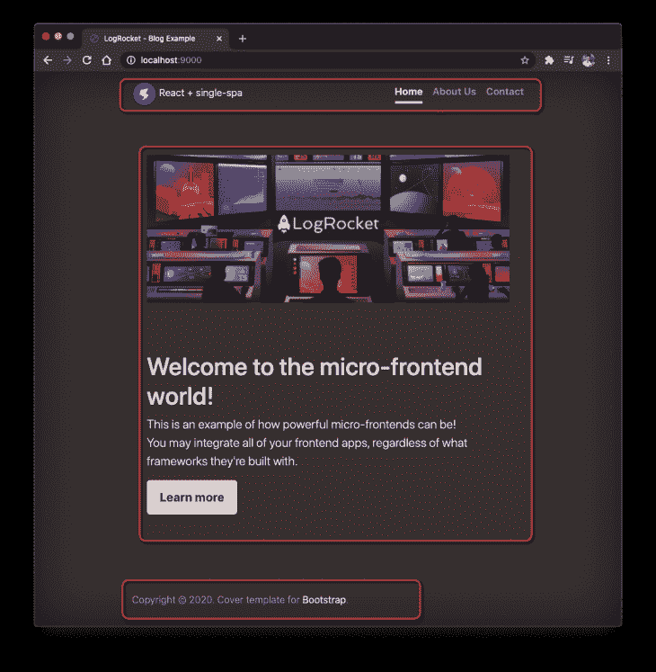
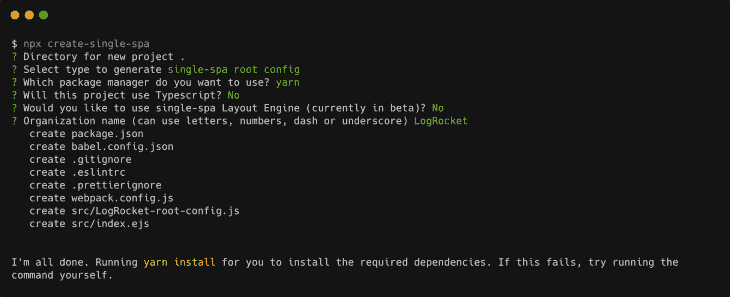
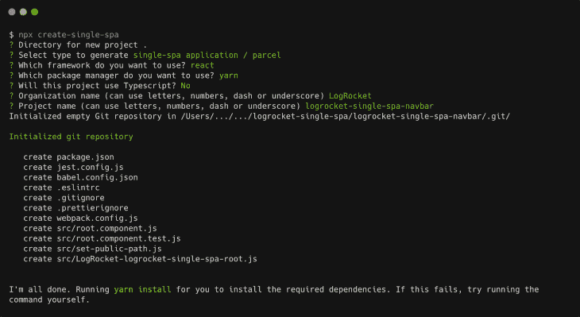
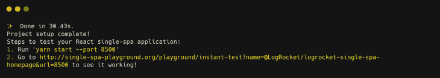
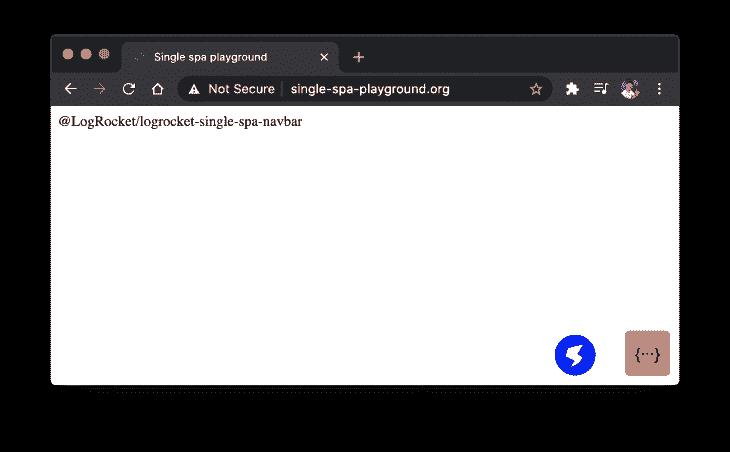
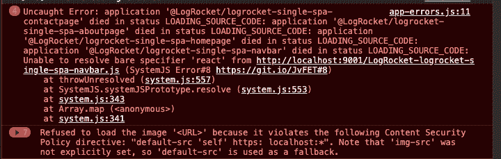
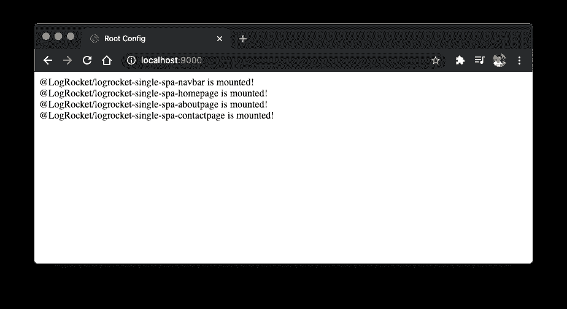
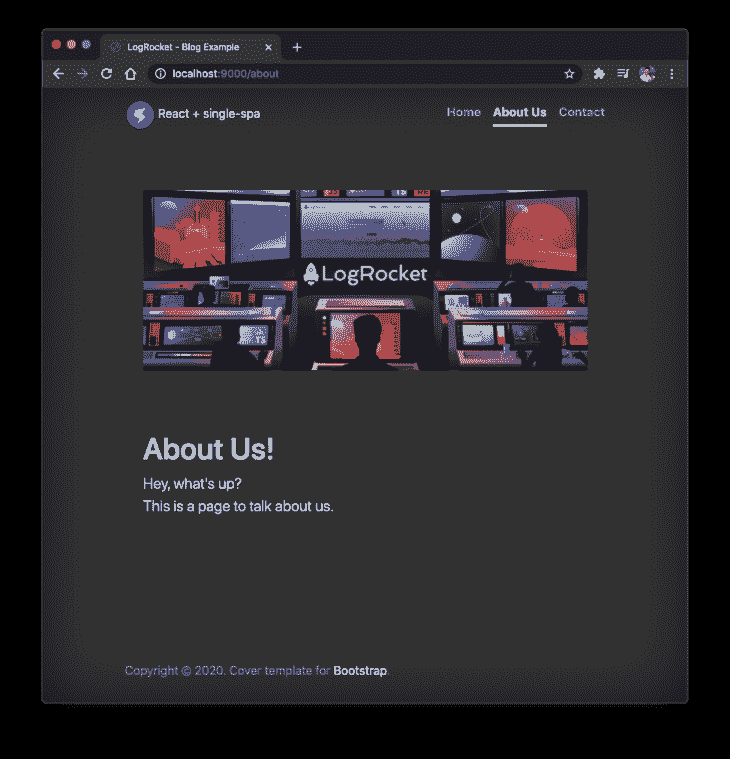

# 用单 spa - LogRocket 博客创建微前端应用

> 原文：<https://blog.logrocket.com/micro-frontend-apps-single-spa/>

在过去的几年里，围绕微服务有很多争论。作为这场辩论的结果，所有人现在都知道围绕这个概念的利弊，以及盲目地在每个项目中采用它的后果。

嗯，微前端也存在同样的争论。这个术语本身就说明了很多:它让你有能力把你的前端分成更小的有意义的部分。这将允许您更快地测试、构建、开发和部署这些部分，因为它们是独立的。

这个术语最早于 2016 年在著名的 [ThoughtWorks Tech Radar](https://www.thoughtworks.com/radar/techniques/micro-frontends) 中进入公共词汇。这将概念从后端扩展到了前端。

今天，有很多前端开发人员在从事相同的项目，或者在某个时候必须集成的项目。最终，开发人员希望能够使用框架或库来构建一个完整的应用程序，其中包含许多由不同人构建的部分(组件)。

我们将整个应用程序集成在一起，就像拼图一样，而不是组件。

你可以在这里阅读更多关于微前端[的内容。然而，对于这篇文章，我们将把重点放在实践方面。换句话说，我们将讲述如何使用](https://micro-frontends.org/) [single-spa](https://single-spa.js.org/) 和 React 从头开始创建你的第一个微面应用。

Single-spa 是用于前端微服务的 JavaScript 路由器。

它允许集成构建在所有类型框架(Vue、Angular、React、普通 HTML/JS/CSS 等)之上的多个应用程序，从而简化了微前端的构建。).让我们仔细看看！

### 我们将构建的应用程序

到本文结束时，您将能够构建您的微前端应用程序，密切跟进这里介绍的步骤。

这是我们将要构建的应用程序:



Micro-frontend application.

请注意，我们将屏幕突出显示为多个部分，每个部分对应一个不同的应用。

*   应用程序标题+菜单:这些将由`logrocket-single-spa-navbar`应用程序管理
*   首页正文:由`logrocket-single-spa-homepage`应用程序管理
*   关于我们页面:由`logrocket-single-spa-aboutpage`应用程序管理
*   联系人页面:由`logrocket-single-spa-contactpage` app 管理

这是一个很好的例子，可以探索框架处理将许多应用程序集成到一个应用程序中的方式。

页面的页脚不会改变，所以我们将它留给根应用程序。

## 设置和应用程序创建

我们将利用 [create-single-spa](https://single-spa.js.org/docs/create-single-spa/) CLI 工具来自动生成我们的单 spa 项目。它管理 Webpack、Babel、Jest 的配置，以及您将要使用的前端框架(React、Angular 等)。).

要安装它，请运行以下命令:

```
npm install --global create-single-spa
```

然后，创建根项目，如下所示:

```
// Creating the folder for all projects
mkdir logrocket-single-spa
cd logrocket-single-spa

// Creating the root app folder
mkdir logrocket-single-spa-root
cd logrocket-single-spa-root

// Creating the single-spa app
npx create-single-spa
```

根应用程序(也称为`container app`)负责管理所有其他应用程序如何集成。

当您运行最新的命令时，必须通过命令行提供一些额外的输入。下图说明了您可以填写的每个值。



Setting up the root single-spa application.

请注意每一个选项，因为如果选择不当，它们会导致错误。

比如第二个是`single-spa root config`。应该从三个选项中选择，并声明当前创建的项目是根配置项目。

您还会注意到，当您选择不同的选项时，其他微前端项目的问题也会发生变化。它就像一个真正的交互式问卷。

请特别注意您将提供给`Organization name`的值，因为它在字母大小写上有所不同。在这里，我们利用了整个单词`LogRocket`。

现在，让我们回到根文件夹，并创建其他项目。以下是创建导航栏项目的命令:

```
cd ..
mkdir logrocket-single-spa-navbar
cd logrocket-single-spa-navbar
```

```
npx create-single-spa
```

因为它们不是配置项目，所以需要不同的设置。下图将展示详细信息以及您必须填写的选项:



Creating an ordinary single-spa app.

这个项目设置比前一个多启用了几个选项，比如您想要使用的框架(React)和项目名称。同样，要注意区分大小写。

继续之前，请确保对其余项目重复上述步骤:

*   `logrocket-single-spa-navbar`
*   `logrocket-single-spa-homepage`
*   `logrocket-single-spa-aboutpage`
*   `logrocket-single-spa-contactpage`

当您完成每个项目的设置后，在控制台日志的末尾，您将看到以下输出:



The created app – setup logs

日志给出了两个提示:

*   通过 Yarn 单独启动应用程序
*   直接在单温泉远程游乐场进行测试

由于 single-spa 利用 [System.js](https://github.com/systemjs/systemjs) 来创建 I[import map](https://github.com/systemjs/systemjs/blob/master/docs/import-maps.md)，它允许您通过网络轻松地导入一个模块，并因此将它映射到变量名。

这样，它就知道如何阅读你的整个应用程序内容并进行预览:



Logrocket-single-spa-navbar app viewed from the Playground.

请注意您将通知每个应用程序的端口，以避免端口冲突。

## 应用程序配置

我们的大部分改变都将发生在根应用上。因此，打开它，并前往其名称以`-root-config.js`结尾的文件。

您可能会在这里看到一些初始配置，但我们会将它们更改为以下内容:

```
import { registerApplication, start } from "single-spa";

registerApplication({
    name: "@LogRocket/logrocket-single-spa-navbar",
    app: () => System.import("@LogRocket/logrocket-single-spa-navbar"),
    activeWhen: ["/"],
});

registerApplication({
    name: "@LogRocket/logrocket-single-spa-homepage",
    app: () => System.import("@LogRocket/logrocket-single-spa-homepage"),
    activeWhen: [(location) => location.pathname === "/"],
});

registerApplication({
    name: "@LogRocket/logrocket-single-spa-aboutpage",
    app: () => System.import("@LogRocket/logrocket-single-spa-aboutpage"),
    activeWhen: ["/about"],
});

registerApplication({
    name: "@LogRocket/logrocket-single-spa-contactpage",
    app: () => System.import("@LogRocket/logrocket-single-spa-contactpage"),
    activeWhen: ["/contact"],
});

start({
    urlRerouteOnly: true,
});
```

这是你必须注册所有微前端应用的地方。因为我们有四个，所以每个人都有四个`registerApplication`。

每个应用程序都必须有一个名称、一条路线(通过 SystemJS，就像我们之前说过的那样)，以及一个必须激活或不激活的条件(`activeWhen`)。

该名称通常遵循模式`@OrganizationName/AppName`，因此请确保使用您在创建应用程序时提供的相同名称进行填充。

该条件通常适用于 URL 路径名。这就是为什么对于 about 和 contact 页面，您只需要提供路径名。

然而，有些时候你想定义你自己的条件，就像我们在主页配置中看到的那样。只要确保在那里提供一个布尔结果。

转到`index.ejs`文件，打开它并在`head`标记中的任意位置添加以下代码片段:

```
<% if (isLocal) { %>
    <script type="systemjs-importmap">
      {
        "imports": {
          "react": "https://cdn.jsdelivr.net/npm/[email protected]/umd/react.development.js",
          "react-dom": "https://cdn.jsdelivr.net/npm/[email protected]/umd/react-dom.development.js",
          "@LogRocket/root-config": "http://localhost:9000/LogRocket-root-config.js",
          "@LogRocket/logrocket-single-spa-navbar": "http://localhost:9001/LogRocket-logrocket-single-spa-navbar.js",
          "@LogRocket/logrocket-single-spa-homepage": "http://localhost:9002/LogRocket-logrocket-single-spa-homepage.js",
          "@LogRocket/logrocket-single-spa-aboutpage": "http://localhost:9003/LogRocket-logrocket-single-spa-aboutpage.js",
          "@LogRocket/logrocket-single-spa-contactpage": "http://localhost:9004/LogRocket-logrocket-single-spa-contactpage.js"
        }
      }
    </script>
  <% } %>
```

这些是 single-spa 需要了解哪些微前端要导入到根应用程序中的必需导入。

他们也遵守 a `name:value`的规则，以及字母的情况。

注意，我们在开始时也导入了 React 和`react-router`库。这是为了保证不会发生以下错误:



Error: Missing React and react-router.

保存所有的文件，在不同的终端上运行所有的应用程序(注意我们为每个应用程序定义的端口),然后启动根应用程序。然后访问地址**[http://localhost:9000/](http://localhost:9000/)**查看以下结果。



Imported micro-frontends in action!

测试一下！如果您导航到其他网址，您可能会看到一些文本显示或消失。

## 微前端应用

现在是时候设置每个应用程序的内容了。让我们从`navbar`开始，因为其余的设计都需要它。

打开 navbar 项目下的`root.component.js`文件，将其内容更改为:

```
import React from "react";

export default function Root(props) {
  return (
    <header className="masthead mb-auto">
      <div className="inner">
        <a className="blog-logo" href="/">
          {" "}
          React + single-spa
        </a>
        <nav className="nav nav-masthead justify-content-center">
          <a
            className={`nav-link ${location.pathname === "/" && "active"}`}
            href="/"
          >
            Home
          </a>
          <a
            className={`nav-link ${location.pathname === "/about" && "active"}`}
            href="/about"
          >
            About Us
          </a>
          <a
            className={`nav-link ${
              location.pathname === "/contact" && "active"
            }`}
            href="/contact"
          >
            Contact
          </a>
        </nav>
      </div>
    </header>
  );
}
```

你觉得熟悉吗？这是因为这个代码是完整的反应。它是一个 React 组件，因为这是我们从通用线创建设置中选择的技术。

请注意，我们正在摆弄位置路由器对象。是的，它将被自动注入到所有的 React 文件中。这样，我们可以自定义导航栏菜单的链接。

以下代码属于同一个根组件文件，但这次是针对`homepage`项目的:

```
import React from "react";

export default function Root(props) {
  return (
    <section>
      <div className="homepage-hero" style={{ margin: "5rem 0" }}>
        
      </div>
      <h1 className="cover-heading">Welcome to the micro-frontend world!</h1>
      <p className="lead">
        This is an example of how powerful micro-frontends can be!
        <br /> You may integrate all of your frontend apps, regardless of what
        frameworks they're built with.
      </p>
      <p className="lead">
        <a href="#" className="btn btn-lg btn-secondary">
          Learn more
        </a>
      </p>
    </section>
  );
}
```

这里没有什么新东西——只是简单的静态 React 组件的全部 JSX 代码。

这同样适用于“关于”和“联系人”页面。下面，您可以找到他们的两个代码:

```
// About page

import React from "react";

export default function Root(props) {
  return (
    <section>
      <div className="homepage-hero" style={{ margin: "5rem 0" }}>
        
      </div>
      <h1 class="cover-heading">About Us!</h1>
      <p class="lead">
        Hey, what's up?
        <br />
        This is a page to talk about us.
      </p>
    </section>
  );
}

// Contact page
import React from "react";

export default function Root(props) {
  return (
    <section>
      <div className="homepage-hero" style={{ margin: "5rem 0" }}>
        
      </div>
      <h1 className="cover-heading">Contact Us</h1>
      <p className="lead">
        Hey, what's up?
        <br />
        This is a page to contact us.
      </p>
    </section>
  );
}
```

## 一点设计

让我们定制页面的整体设计。为此，我们将利用 [Bootstrap](https://getbootstrap.com/) ，因为它是一个快速且非常简单的库。

仍然在`index.ejs`页面中，向 head 标签添加以下两行:

```
<!-- Bootstrap core CSS -->
<link href="https://stackpath.bootstrapcdn.com/bootstrap/4.5.2/css/bootstrap.min.css" rel="stylesheet" />
<link rel="stylesheet" href="https://getbootstrap.com/docs/4.0/examples/cover/cover.css" />
```

那些是 Bootstrap 的 CSS 文件的 CDN 链接。对于这个例子，不需要任何引导 JavaScript 文件。

第二个 CSS 文件属于 Bootstrap 提供的一个很好的[示例](https://getbootstrap.com/docs/4.0/examples/cover/)，我们将在这个应用程序中使用它。

是时候测试这个项目了。single-spa 的另一个很好的特性是，默认情况下会启用实时重新加载功能，因此无需在每次进行更改时重新启动应用程序。

如果返回浏览器，您可能会看到新设计应用如下:



App’s contact page.

## 结论

在单人水疗中心，你可以做更多的事情。该框架附带了一些额外的好特性，如 parcels，这是一个与框架无关的特性，允许手动构建大量功能，而不管您选择哪个框架进行开发。

可选的 [single-spa-layout](https://single-spa.js.org/docs/layout-overview) 包为顶级路由、应用程序甚至 DOM 元素提供了一些很好的路由 API 控件。

还支持 Angular、AngularJS、Ember、代码延迟加载、简单的代码库重写等等。由于特性的广泛性，我强烈建议通读一下它的官方文档。

你可以在这里访问这个例子[的完整源代码。有一个很棒的微前端-编程！](https://github.com/diogosouza/logrocket-single-spa)

## [LogRocket](https://lp.logrocket.com/blg/react-signup-general) :全面了解您的生产 React 应用

调试 React 应用程序可能很困难，尤其是当用户遇到难以重现的问题时。如果您对监视和跟踪 Redux 状态、自动显示 JavaScript 错误以及跟踪缓慢的网络请求和组件加载时间感兴趣，

[try LogRocket](https://lp.logrocket.com/blg/react-signup-general)

.

[ ](https://lp.logrocket.com/blg/react-signup-general) [](https://lp.logrocket.com/blg/react-signup-general) 

LogRocket 结合了会话回放、产品分析和错误跟踪，使软件团队能够创建理想的 web 和移动产品体验。这对你来说意味着什么？

LogRocket 不是猜测错误发生的原因，也不是要求用户提供截图和日志转储，而是让您回放问题，就像它们发生在您自己的浏览器中一样，以快速了解哪里出错了。

不再有嘈杂的警报。智能错误跟踪允许您对问题进行分类，然后从中学习。获得有影响的用户问题的通知，而不是误报。警报越少，有用的信号越多。

LogRocket Redux 中间件包为您的用户会话增加了一层额外的可见性。LogRocket 记录 Redux 存储中的所有操作和状态。

现代化您调试 React 应用的方式— [开始免费监控](https://lp.logrocket.com/blg/react-signup-general)。