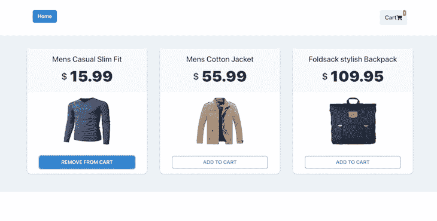
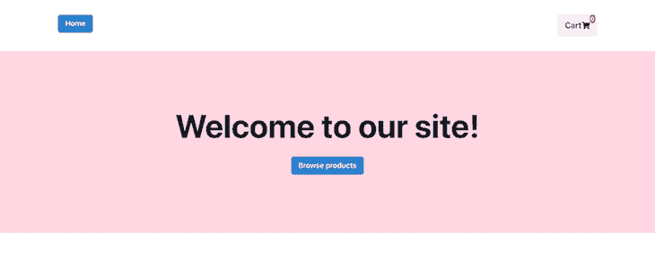
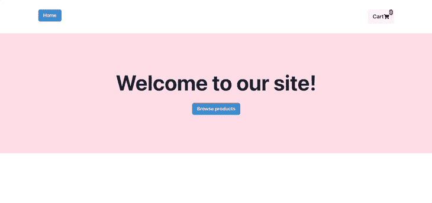
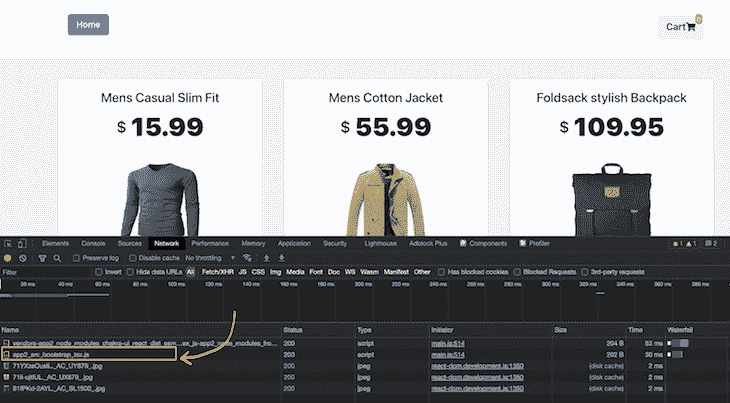

# 用 Fronts 构建渐进式微前端

> 原文：<https://blog.logrocket.com/micro-frontends-fronts/>

在过去的几年里，我们开发应用程序的方式发生了很大的变化。随着每天都有新的框架发布，拥有一个灵活的技术堆栈，例如，在 React 中构建应用程序的某些部分，而在 Vue 中构建其他部分，在跨团队工作时是非常有益的。

微前端允许我们构建单独开发和部署的 web 应用程序，但作为单个应用程序工作。微前端是实现更大灵活性的一种常见方法，允许团队合并不同框架或库中构建的组件。在生产中，有几种不同的方法来实现微前端。

在本教程中，我们将探索一些构建微前端的方法。然后我们将深入研究 [Fronts.js](https://github.com/unadlib/fronts) ，这是一个用于构建 web 应用程序的渐进式微前端框架。我们开始吧！

## 前线的替代方案

首先，让我们回顾一下构建微前端的两种常见方法。网

### 单温泉


[单 spa](https://github.com/single-spa/single-spa) 路由器使用一个`single-spa root config`文件，该文件保存共享依赖关系等信息，以及打包成模块的几个单独 spa，[通过 API](https://blog.logrocket.com/micro-frontend-apps-single-spa/)相互通信和单 spa 通信。

### webpack 模块联盟

另一个流行的解决方案是 [webpack 的模块联合](https://blog.logrocket.com/building-micro-frontends-webpacks-module-federation/)，它是作为 webpack v.5 中的核心特性之一引入的，模块联合通过允许应用程序相互加载代码来解决代码共享的问题。然而，模块联合有点冗长，并且缺少定制选项。

## Fronts 入门

与其他微前端框架相比，Fronts 提供了一个更完整和完全目标化的实现，提供了几个独特的好处，比如对嵌套微前端的支持。嵌套的微前端是用一个代码库构建的前端，该代码库被放置在用不同代码库构建的另一个前端内。嵌套的微前端允许一个父页面拥有几个不同的子页面，每个子页面都可以使用不同的存储库来构建。

此外，Fronts 提供跨框架支持，这意味着开发人员可以不受限制地使用任何特定的技术堆栈。跨框架支持还允许开发人员使用几种不同的技术构建单个页面。代码分割和延迟加载是 Fronts 中包含的两个额外的流行功能，允许使用 Fronts 构建的不同应用程序将不同的 Fronts 应用程序作为模块导入。

我们可以挂钩 Fronts 应用程序提供的生命周期方法，并执行所需的操作。最后，Fronts API 在某种程度上是通用的和框架不可知的，这意味着我们可以将其应用于各种各样的用例。

## 前沿进步性质

Fronts 本质上是进步的，这意味着[它支持模块联合和非模块联合](https://fronts.js.org/)。在没有模块联合的正常模式下启动的应用程序可以逐渐转变为模块联合。

除了模块联合之外，Fronts 还提供了版本控制模式，允许对不同的组件应用程序进行版本管理。

## 查看前端 API

正如我们之前提到的，Fronts API 非常简单。然而，有必要深入研究一下它的代码。Fronts 包括三种不同的装载机，可根据需求选择正确的型号。

当我们需要将 CSS 与其他应用程序隔离时，我们使用`useWebComponents()` API。对于不需要我们将 CSS 与其他应用程序隔离的应用程序，我们可以使用`useApp()`加载器，但是，这样做是可选的。最后，当我们需要将 CSS 和 JavaScript 与应用程序的其余部分隔离时，我们使用`useIframe()`加载器。

除了这三个加载器，Fronts 还包括两个用于模块联合的 API。`createWebpackConfig()`是一个包装函数，它接受原始的 webpack 配置并返回支持模块联合的更新的 webpack 配置。要为模块联合生成 webpack 配置，只需调用`createWebpackConfig()`。

`getMeta()`是一个用来获得依赖图全貌的工具。调用`getMeta()`返回整个 monorepo 结构的 JSON，以及所有组件应用程序及其依赖项。

最后，Fronts 为不同组件微前端之间的通信提供了 API。`globalTransport.listen`通过提供一个字符串事件和一个当该事件被触发时被触发的监听器来帮助配置全局事件监听器。

`globalTransport.emit`函数发出前一个函数将监听的事件。它将一个字符串事件名称作为第一个参数，将其值作为第二个参数。

## 带前端的微前端示例

现在，我们已经了解了前端的本质，让我们通过一个示例来更深入地了解前端。

对于我们的演示，我们将在官方的[战线之上工作——例如](https://github.com/unadlib/fronts-example)回购。容器电子商务网站是父网站，产品页面是子网站。要跟进，您可以访问[已完成的回购示例](https://github.com/kokanek/fronts-example)。它使用 Chakra UI 作为其 UI 组件，并有一个硬编码的`products.json`文件和一个虚拟购物车。

我们最后的微前端示例将如下图所示:



要运行应用程序，请克隆存储库，然后运行以下命令:

```
yarn install

```

接下来，运行下面的代码:

```
start

```

要试用和测试该应用程序，请访问 [localhost](http://localhost:3001/#/) 。

## Fronts 文件夹结构

上面的示例 repo 在`packages`目录中包含两个成熟的 Fronts 项目。请记住，没有必要将两个项目放在同一个 monorepo 中。如果每一个都放在自己单独的存储库中，我们的应用程序将完全以同样的方式工作。

每个应用程序的文件夹结构大致类似于以下代码段:

```
|- public
 |- index.html
|- src
    |- App.jsx
    |- index.jsx
    |- styles.css
    |- bootstrap.tsx 
|- .babelrc
|- webpack.config.js
|- site.json

```

让我们更详细地看一下每个特定的文件。

## `bootstrap.tsx`

顾名思义，我们将使用`bootstrap.tsx`文件来帮助我们在浏览器中加载 Fronts 应用程序时进行引导:

```
export default function render(element: HTMLElement | null) {
  ReactDOM.render(<App />, element);
  return () => {
    ReactDOM.unmountComponentAtNode(element!);
  };
}
boot(render, document.getElementById('root'));

```

注意应用程序是如何在一个渲染函数中渲染的，然后这个渲染函数被提供给 Fronts 库提供的`boot`方法。

* * *

### 更多来自 LogRocket 的精彩文章:

* * *

在函数内部，React 应用程序的呈现方式与普通 React 应用程序一样。它还返回一个 arrow 函数，当不再需要时调用元素上的`ReactDOM.unmount`。

作为 Fronts 库的用户，我们需要在`bootstrap.tsx`文件中做的就是调用 boot 方法，Fronts 会处理剩下的事情。

## `site.json`

`site.json`是另一个重要的文件，它为应用程序指定了许多配置细节。以下是它对集装箱电子商务应用`app1`的看法:

```
{
  "name": "app1",
  "dependencies": {
    "app2": "http://localhost:3002/remoteEntry.js"
  },
  "shared": {
    "react": { "singleton": true },
    "react-dom": { "singleton": true }
  }
}

```

请注意，通过传递本地主机部署 URL，后跟作为入口点的`remoteEntry.js`，产品应用`app2`被称为`app1`的依赖项之一。当我们将两个应用程序都部署到生产环境中时，`remoteEntry.js`将被生产部署 URL 替换。

`shared`对象提到了这些 Fronts 应用程序共享的所有依赖项，这样就不会在浏览器上再次下载这些包。以这种格式指定入口点和共享依赖项使得我们的 bundle 函数与其他 Fronts 应用程序同步，库将为我们处理剩下的事情。

查看`app2`中的同一个文件，我们看到它看起来略有不同:

```
{
  "name": "app2",
  "exports": ["./src/bootstrap", "./src/Button"],
  "dependencies": {},
  "shared": {
    "react": { "singleton": true },
    "react-dom": { "singleton": true }
  }
}

```

具体来说，我们看到一个额外的`exports`键。这是因为`app2`导出了其他应用程序可以使用的某些功能。在上面的例子中，`src/bootstrap`文件被导出，这意味着整个应用程序可以像被`app1`导入一样被导入到其他 Fronts 应用程序中。

## 微前端之间的路由

如果您看一下`app1/src/App.tsx`文件，您会看到这两个应用程序是如何共享路线的:

```
const routes = [
  {
    path: "/",
    component: () => <HomePage />,
    exact: true,
  },
  {
    path: "/app2",
   component: () => {
     const App2 = useApp({
       name: "app2",
     loader: () => import("app2/src/bootstrap"),
      });
      return <App2 />;
    },
    exact: true,
  },
];

```

路由`/`用于主页，由`app1`中的`HomePage`组件处理:



在上图中，主页按钮和购物车按钮来自于`app1`中的`<Navigation />`组件。整个粉色区域由`<HomePage />`组件渲染。

请注意，路由`/app2`正由一个组件处理，该组件使用`useApp`功能从一个单独的微前端生成一个组件。如果我们点击上一页的**浏览产品**按钮，我们将进入产品页面，如下所示:



在浅灰色背景中显示三种产品的应用程序是一个完全不同的应用程序，由 Fronts.js 无缝呈现。当我们看到对`app2`的 bootstrap 函数的调用时，我们将在网络选项卡中看到证明:



## 微前端之间的通信

您可能已经注意到，点击**添加到购物车**按钮后，购物车图标顶部显示的数字会相应增加或减少。假设这两个组件理论上在两个不同的微前端中，它们是如何通信的？

这种通信是由 Fronts 库提供的`globalTransport`功能实现的。在`app1/src/App.tsx`中，我们分别为 increase 和 decrease 事件设置了两个全局侦听器，并基于它修改购物车计数:

```
const [count, setCount] = useState(0);
useEffect(
  () =>
    globalTransport.listen("increase", () => {
      setCount(count + 1);
    }),
  [count]
);
useEffect(
  () =>
    globalTransport.listen("decrease", () => {
      setCount(count - 1);
    }),
  [count]
);

```

在`app2/src/App.tsx`内部，当相应的按钮被点击时，我们发出特定的事件:

```
function addToCart(pid) {
  const newProd = [...prod];
  newProd.forEach(p => {
    if (p.id === pid) {
      if (!p.active) {
        globalTransport.emit("increase");
        p.active = true;
      } else {
        globalTransport.emit("decrease");
        p.active = false;
      }
    }
  });
  setProducts(newProd);
}

```

Fronts 确保在其中一个微前端(发射器)中触发的事件调用不同微前端(侦听器)中的相应侦听器。

## 与 webpack 的区别

Fronts 库是在 webpack 的模块联邦之上编写的，试图简化构建微前端的过程。因此，Fronts 包含了 webpack 开箱即用的所有优势。但是，当我们将两者并列比较时，我们会发现 Fronts 具有以下优势:

*   简化配置
*   无需处理插件修改
*   不需要处理原始的 webpack 配置
*   简化的多应用路由
*   CSS 边界级别的选择

## 结论

微前端允许开发人员分别处理前端应用程序的各个部分，并独立部署它们，这种技术继续流行。Fronts 通过允许开发团队分离独立但相关的应用程序的生命周期而不用担心崩溃，从而真正大放异彩。

在我看来，Front 的最低配置和它的灵活性是目前无法比拟的。它绝对值得考虑作为您下一个微前端项目的框架选择。我希望你喜欢这个教程。

## 您是否添加了新的 JS 库来提高性能或构建新特性？如果他们反其道而行之呢？

毫无疑问，前端变得越来越复杂。当您向应用程序添加新的 JavaScript 库和其他依赖项时，您将需要更多的可见性，以确保您的用户不会遇到未知的问题。

LogRocket 是一个前端应用程序监控解决方案，可以让您回放 JavaScript 错误，就像它们发生在您自己的浏览器中一样，这样您就可以更有效地对错误做出反应。

[](https://lp.logrocket.com/blg/javascript-signup)[https://logrocket.com/signup/](https://lp.logrocket.com/blg/javascript-signup)

[LogRocket](https://lp.logrocket.com/blg/javascript-signup) 可以与任何应用程序完美配合，不管是什么框架，并且有插件可以记录来自 Redux、Vuex 和@ngrx/store 的额外上下文。您可以汇总并报告问题发生时应用程序的状态，而不是猜测问题发生的原因。LogRocket 还可以监控应用的性能，报告客户端 CPU 负载、客户端内存使用等指标。

自信地构建— [开始免费监控](https://lp.logrocket.com/blg/javascript-signup)。