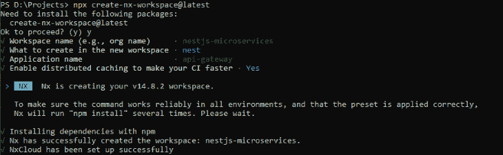
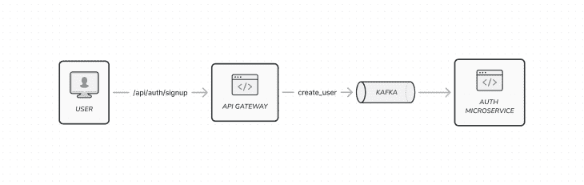
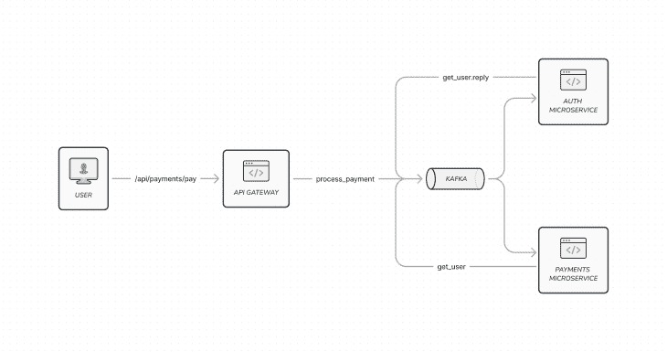
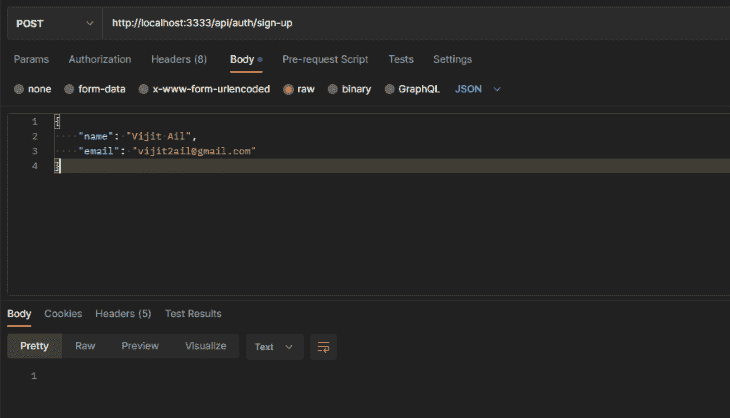
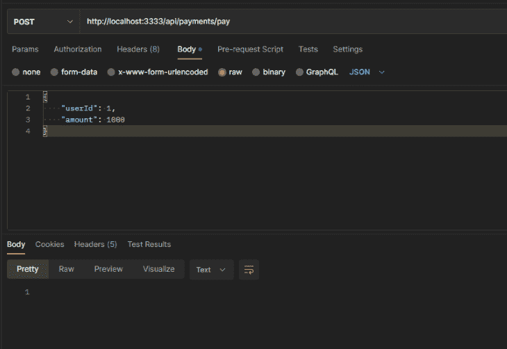
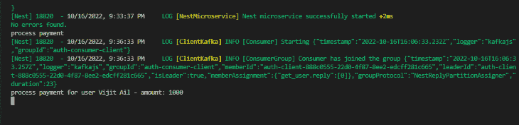

# 使用 NestJS、Kafka 和 TypeScript 的微服务

> 原文：<https://blog.logrocket.com/microservices-nestjs-kafka-typescript/>

微服务架构是一种日益流行的架构模式，它遵循 SOA(面向服务的架构)概念。它有几个优点和缺点，但它最重要的优点之一是与其他体系结构相比，它允许更容易的可伸缩性。

本指南将演示如何通过 Kafka 和 TypeScript 使用 NestJS 构建微服务。

*向前跳转:*

## 设置项目工作环境

让我们从为我们的演示设置项目工作环境开始。在继续之前，请确保您已经在本地计算机上安装并运行了 Apache Kafka。您可以查看本指南，了解如何[在本地](https://blog.logrocket.com/building-rust-microservices-apache-kafka/#getting-started-kafka)设置卡夫卡。

您将创建一个身份验证微服务来创建和保存用户详细信息。除了 auth 微服务，您还需要一个 API 网关来将事件从 HTTP API 端点发送到微服务。

因为您将创建多个后端服务，所以最好有一个 monorepo 来实现代码共享。monorepo 是一个单一版本控制的代码库，包括各种应用程序和库。

Nx 是一个管理 monorepos 的流行工具。这个框架允许您在 monorepo 中设计和扩展 web 应用程序和服务。

通过运行以下命令创建 Nx 工作区:

```
> npx [email protected]
```



创建工作区时指定`nest`选项，并将应用程序命名为`api-gateway`。

创建工作空间后，通过运行以下命令安装项目依赖项:

```
> cd nestjs-microservices
> npm i @nestjs/microservices kafkajs class-validator class-transformer

```

## API 网关入门

API 网关是微服务架构中的服务之一，它将客户端和外部应用程序连接到内部服务。API gateway 处理路由、转换和聚合请求数据，并实现共享逻辑，如身份验证和限速器。



通常，当前端应用调用注册 API 时，API 网关会向 Kafka 队列发出`create_user`事件。auth 微服务将从队列中轮询`create_user`事件，并从事件负载中创建一个用户。

在这种架构模式下，前端应用不会直接与微服务交互。通常，在现实场景中，API 网关还具有额外的功能，如日志记录、分析和负载平衡。

在 api-gateway 应用程序中，创建 auth 模块，负责处理与身份验证相关的请求，如注册。使用 auth 模块中的`@nestjs/microservices`包中的`ClientsModule`配置 Kafka 客户端。

`ClientsModule`公开了一个静态的`register()`方法，该方法将描述微服务传输器的对象数组作为参数。每个传输器对象都有一个`name`属性、一个`transporter`属性(在本例中是`Transport.Kafka`)和一个特定于传输器的`options`属性。`name`属性定义了注入令牌，稍后您可以在服务类中使用它来发布事件:

```
// apps/api-gateway/src/auth/auth.module.ts

import { Module } from '@nestjs/common';
import { ClientsModule, Transport } from '@nestjs/microservices';
import { AuthController } from './auth.controller';
import { AuthService } from './auth.service';

@Module({
  imports: [
    ClientsModule.register([
      {
        name: 'AUTH_MICROSERVICE',
        transport: Transport.KAFKA,
        options: {
          client: {
            clientId: 'auth',
            brokers: ['localhost:9092'],
          },
          producerOnlyMode: true,
          consumer: {
            groupId: 'auth-consumer',
          },
        },
      },
    ]),
  ],
  providers: [AuthService],
  controllers: [AuthController],
})
export class AuthModule {} 

```

因为传输是 Kafka，`options`属性将定义 Kafka 客户端对象，它包括`clientId`、`brokers`和一个带有`groupId`的`consumer`对象。在这里，您指定的`groupId`是必不可少的，因为具有相同`groupId`的消费者只能读取发布的事件。

例如，使用`groupId` auth-consumer 的消费者只能阅读使用`groupId:` `'auth-consumer'`发布的事件。`producerOnlyMode`选项将绕过 api-gateway 应用程序的消费者组注册，仅作为生产者。

### 微服务之间的代码共享

由于创建用户的 HTTP 请求负载和事件负载是相同的，所以最好创建一个共享数据传输对象(DTO ),所有服务都可以在 monorepo 中访问它。

通过运行以下命令创建共享库:

```
> nx g @nrwl/node:lib shared

```

接下来，创建一个`dto`文件夹；在`create-user.dto.ts`文件中添加具有强制`name`和`email`属性的`CreateUserDto`类；

```
// libs/shared/src/lib/dto/create-user.dto.ts

import { IsEmail, IsNotEmpty, IsString } from 'class-validator';

export class CreateUserDto {
  @IsString()
  @IsNotEmpty()
  name: string;

  @IsEmail()
  @IsNotEmpty()
  email: string;
}
```

```
// libs/shared/src/lib/dto/index.ts

export * from './create-user.dto';

```

现在，在`paths`对象中添加一个条目，用于解析`tsconfig.base.json`文件中的`dto`文件:

```
{
  ...
  "paths": {
      ...
      "@nestjs-microservices/shared/dto": ["libs/shared/src/lib/dto/index.ts"]
  }
  ...
}

```

回到 api-gateway 应用程序，创建`AuthService`将事件发布到 auth 微服务。

通过使用`@Inject()`装饰器创建一个`ClientKafka`的实例，并使用在 Kafka 传输的`name`属性中指定的`AUTH_MICROSERVICE`注入标记。使用客户端实例，您可以访问`emit()`方法来发布`create_user`事件和有效负载:

```
// apps/api-gateway/src/auth/auth.service.ts

import { Inject, Injectable } from '@nestjs/common';
import { ClientKafka } from '@nestjs/microservices';
import { CreateUserDto } from '@nestjs-microservices/shared/dto';

@Injectable()
export class AuthService {
  constructor(
    @Inject('AUTH_MICROSERVICE') private readonly authClient: ClientKafka
  ) {}

  createUser(createUserDto: CreateUserDto) {
    this.authClient.emit('create_user', JSON.stringify(createUserDto));
  }
}

```

接下来，在`AuthController`类中，创建一个用于创建用户的 API 端点，并调用`AuthService`的`createUser`方法:

```
// apps/api-gateway/src/auth/auth.controller.ts

import { Body, Controller, Post, ValidationPipe } from '@nestjs/common';
import { AuthService } from './auth.service';
import { CreateUserDto } from '@nestjs-microservices/shared/dto';

@Controller('auth')
export class AuthController {
  constructor(private readonly authService: AuthService) {}

  @Post('sign-up')
  createUser(@Body(ValidationPipe) createUserDto: CreateUserDto) {
    return this.authService.createUser(createUserDto);
  }
}

```

## 创建授权微服务

接下来，您将创建 auth 微服务来使用 API 网关发送的`create_user`消息。

要创建授权微服务应用程序，请运行以下命令:

```
> nx g @nrwl/nest:app auth-microservice

```

在 auth-microservice app 的`main.ts`文件中，去掉`bootstrap()`函数的样板代码，替换为`NestFactory.createMicroservice()`方法。

将第一个参数中的`AppModule`和第二个参数中的 Kafka `transport`对象传递给`createMicroservice()`方法。在`consumer`对象的`groupId`属性中，确保您指定了与 api-gateway 应用程序的`AuthModule`中使用的值相同的值:

```
// apps/auth-microservice/src/main.ts

async function bootstrap() {
  const app = await NestFactory.createMicroservice<MicroserviceOptions>(
    AppModule,
    {
      transport: Transport.KAFKA,
      options: {
        client: {
          brokers: ['localhost:9092'],
        },
        consumer: {
          groupId: 'auth-consumer',
        },
      },
    }
  );
  await app.listen();
}

```

接下来，在共享库中创建一个`User`实体来表示用户数据。在`UsersRepository`类中使用这个实体 it 来执行类似保存用户数据和通过`id`检索单个用户的操作:

```
// libs/shared/src/lib/entities/user.entity.ts

export class User {
  id?: number;
  name: string;
  email: string;
}
```

```
// libs/shared/src/lib/entities/index.ts

export * from './user.entity';
```

```
// apps/auth-microservice/src/app/users.repository.ts

import { Injectable } from '@nestjs/common';
import { User } from '@nestjs-microservices/shared/entities';

@Injectable()
export class UsersRepository {
  private readonly users: User[] = [];

  save(user: User) {
    this.users.push({ ...user, id: this.users.length + 1 });
  }

  findOne(id: number) {
    return this.users.find((u) => u.id === id) || null;
  }
}

```

通常，在 NestJS 应用程序中，TypeORM 用于通过数据库管理数据，但是为了演示的简洁，我们将数据存储在内存中。

在`AppService`中，创建`createUser()`和`getUser()`方法，分别用`UsersRepository`方法创建和查找用户:

```
// apps/auth-microservice/src/app/app.service.ts

import { CreateUserDto } from '@nestjs-microservices/shared/dto';
import { User } from '@nestjs-microservices/shared/entities';
import { Injectable } from '@nestjs/common';
import { UsersRepository } from './users.repository';

@Injectable()
export class AppService {
  constructor(private readonly usersRepository: UsersRepository) {}

  createUser(data: CreateUserDto): void {
    this.usersRepository.save(data);
  }

  getUser(id: number): User {
    return this.usersRepository.findOne(id);
  }
}

```

现在在`app.controller.ts`文件中，创建一个方法来处理`create_user`事件。使用`@EventPattern()`装饰器创建一个事件处理程序并传递事件名称。您可以使用`@Payload()`装饰器访问事件数据，类似于`@Body()`装饰器，您可以使用`ValidationPipe`来验证有效负载对象:

```
// apps/auth-microservice/src/app/app.controller.ts

import { CreateUserDto } from '@nestjs-microservices/shared/dto';
import { Controller, ParseIntPipe, ValidationPipe } from '@nestjs/common';
import { EventPattern, MessagePattern, Payload } from '@nestjs/microservices';

import { AppService } from './app.service';

@Controller()
export class AppController {
  constructor(private readonly appService: AppService) {}

  @EventPattern('create_user')
  handleUserCreate(@Payload(ValidationPipe) data: CreateUserDto) {
    this.appService.createUser(data);
  }
}

```

## 添加支付微服务

现在 auth 微服务已经启动并运行，让我们添加一个支付微服务来处理用户帐户的支付，并完成整个架构。



第一步是在 api-gateway 应用程序中创建一个 API 端点，前端应用程序可以调用它来启动支付。在请求正文中，您需要`userId`和支付金额。

API 网关将发出一个名为`process_payment`的事件和支付数据，支付微服务将读取这些数据。支付微服务将需要用户详细信息来处理支付。因为您只传递了`userId`，其余的数据将通过发布`get_user`事件从 auth 服务中检索。

在 api-gateway 应用程序中，您将创建支付模块并注册 Kafka 客户端，类似于您为 auth 模块设置它的方式。对于支付模块，`groupId`将是`payment-consumer`:

```
// apps/api-gateway/src/payment/payments.module.ts

import { Module } from '@nestjs/common';
import { ClientsModule, Transport } from '@nestjs/microservices';
import { PaymentController } from './payment.controller';
import { PaymentService } from './payment.service';

@Module({
  imports: [
    ClientsModule.register([
      {
        name: 'PAYMENT_MICROSERVICE',
        transport: Transport.KAFKA,
        options: {
          client: {
            clientId: 'payment',
            brokers: ['localhost:9092'],
          },
          consumer: {
            groupId: 'payment-consumer',
          },
        },
      },
    ]),
  ],
  providers: [PaymentService],
  controllers: [PaymentController],
})
export class PaymentModule {}

```

然后，在共享库中创建`MakePaymentDto`，它将用于表示处理支付的有效负载:

```
// libs/shared/src/lib/dto/make-payment.dto.ts

import { IsNotEmpty, IsNumber } from 'class-validator';

export class MakePaymentDto {
  @IsNotEmpty()
  @IsNumber()
  userId: number;

  @IsNotEmpty()
  @IsNumber()
  amount: number;
}

```

接下来，在`PaymentController`中，添加一个 POST API 来创建发布`process_payment`事件的入口点:

```
// apps/api-gateway/src/payment/payment.controller.ts

import { Body, Controller, Post, ValidationPipe } from '@nestjs/common';
import { PaymentService } from './payment.service';
import { MakePaymentDto } from '@nestjs-microservices/shared/dto';

@Controller('payments')
export class PaymentController {
  constructor(private readonly paymentService: PaymentService) {}

  @Post('pay')
  makePayment(@Body(ValidationPipe) makePaymentDto: MakePaymentDto) {
    return this.paymentService.makePayment(makePaymentDto);
  }
}

```

在`PaymentService`中，使用`@Inject()`装饰器和`PAYMENT_MICROSERVICE`作为注入令牌来注入`ClientKafka`。现在，使用 Kafka 客户端发出`process_payment`事件:

```
// apps/api-gateway/src/payment/payment.service.ts

import { Inject, Injectable } from '@nestjs/common';
import { ClientKafka } from '@nestjs/microservices';
import { MakePaymentDto } from '@nestjs-microservices/shared/dto';

@Injectable()
export class PaymentService {
  constructor(
    @Inject('PAYMENT_MICROSERVICE') private readonly paymentClient: ClientKafka
  ) {}

  makePayment(makePaymentDto: MakePaymentDto) {
    this.paymentClient.emit('process_payment', JSON.stringify(makePaymentDto));
  }
}

```

支付集成的 API 网关部分已经完成。现在，让我们用微服务应用程序来构建。

## 构建微服务应用

首先运行以下命令来创建支付微服务应用程序:

```
> nx g @nrwl/nest:app payments-microservice

```

类似于 auth-microservice，用`createMicroservice()`方法替换`main.ts file`的内容。在这里，您还将使用值`'payment-consumer'`来定义`groupId`:

```
// apps/payments-microservice/src/main.ts

import { NestFactory } from '@nestjs/core';
import { MicroserviceOptions, Transport } from '@nestjs/microservices';

import { AppModule } from './app/app.module';

async function bootstrap() {
  const app = await NestFactory.createMicroservice<MicroserviceOptions>(
    AppModule,
    {
      transport: Transport.KAFKA,
      options: {
        client: {
          brokers: ['localhost:9092'],
        },
        consumer: {
          groupId: 'payment-consumer',
        },
      },
    }
  );
  await app.listen();
}

bootstrap();

```

现在，在`app.module.ts`文件中注册一个向 auth-microservice 发送事件的 Kafka 客户端:

```
// apps/payments-microservice/src/app/app.module.ts

import { Module } from '@nestjs/common';
import { ClientsModule, Transport } from '@nestjs/microservices';

import { AppController } from './app.controller';
import { AppService } from './app.service';

@Module({
  imports: [
    ClientsModule.register([
      {
        name: 'AUTH_MICROSERVICE',
        transport: Transport.KAFKA,
        options: {
          client: {
            clientId: 'auth',
            brokers: ['localhost:9092'],
          },
          consumer: {
            groupId: 'auth-consumer',
          },
        },
      },
    ]),
  ],
  controllers: [AppController],
  providers: [AppService],
})
export class AppModule {}

```

在`AppService`中，将发布事件的 Kafka 客户端注入 auth-microservice app。当您发出`get_user`事件时，您需要监听来自 auth 微服务的响应；这与你为`create_user`事件所做的不同。

对于 Kafka 通信，事件的响应在 NestJS 现成处理的回复事件中返回。Nest 自动在一个以关键字`.reply`结束的新事件中发回回复。微服务之间的这种通信被称为[请求-响应模式](https://blog.logrocket.com/nodejs-pub-sub-messaging-brokers/)。

要在`AppService`中配置这种通信，您需要实现`onModuleInit`接口并使用`onModuleInit()`生命周期方法来订阅使用`subscribeToResponseOf()`方法的`get_user`事件的响应。您不必为`get_user.reply`事件手动添加任何处理程序，因为 Nest 会处理这些。

```
// apps/payments-microservice/src/app/app.service.ts

import { MakePaymentDto } from '@nestjs-microservices/shared/dto';
import { User } from '@nestjs-microservices/shared/entities';
import { Inject, Injectable, OnModuleInit } from '@nestjs/common';
import { ClientKafka } from '@nestjs/microservices';

@Injectable()
export class AppService implements OnModuleInit {
  constructor(
    @Inject('AUTH_MICROSERVICE') private readonly authClient: ClientKafka
  ) {}

  processPayment(makePaymentDto: MakePaymentDto) {
    const { userId, amount } = makePaymentDto;
    console.log('process payment');
    this.authClient
      .send('get_user', JSON.stringify({ userId }))
      .subscribe((user: User) => {
        console.log(
          `process payment for user ${user.name} - amount: ${amount}`
        );
      });
  }

  onModuleInit() {
    this.authClient.subscribeToResponseOf('get_user');
  }
}

```

不使用`emit()`方法来发布`get_user`事件，而是使用`send()`方法。`send()`方法使您能够使用回调来订阅事件的回复。

现在，通过在支付`AppController`中添加`process_payment`事件的事件处理程序来结束支付微服务:

```
// apps/payments-microservice/src/app/app.controller.ts

import { MakePaymentDto } from '@nestjs-microservices/shared/dto';
import { Controller, ValidationPipe } from '@nestjs/common';
import { EventPattern, Payload } from '@nestjs/microservices';

import { AppService } from './app.service';

@Controller()
export class AppController {
  constructor(private readonly appService: AppService) {}

  @EventPattern('process_payment')
  handleProcessPayment(@Payload(ValidationPipe) data: MakePaymentDto) {
    this.appService.processPayment(data);
  }
}

```

接下来，切换回 auth-microservice app 的`AppController`，添加`get_user`事件的处理程序，完成请求-响应通信。对于请求-响应消息传递模式，您需要使用`@MessagePattern()`装饰器来消费事件:

```
// apps/auth-microservice/src/app/app.controller.ts

@Controller()
export class AppController {

  @MessagePattern('get_user')
  handleGetUser(@Payload('userId', ParseIntPipe) userId: number) {
    return this.appService.getUser(userId);
  }
}

```

## 运行和测试服务

要测试并查看所有运行中的服务，您需要在单独的终端上分别运行以下命令:

```
> nx serve api-gateway
> nx serve auth-microservice
> nx serve payments-microservice

```

现在微服务已经启动并运行，让我们用 Postman 测试一下。

选择`/api/auth/signup` API 来创建用户:



接下来，调用`/api/payments/pay` API 用`userId`和`amount`处理支付:





如果微服务之间的通信设置正确，您应该会在终端上看到一条控制台消息，如上所示。

## 结论

本文研究了使用 NestJS 和 Kafka 的微服务架构构建健壮的应用程序。我们展示了如何结合使用这些技术来创建一个可伸缩的、可靠的、易于维护的系统。如果您正在寻找一种方法来构建易于开发和部署的微服务，那么这个堆栈是值得考虑的。

您可以通过使用 Kafka 通信创建重试逻辑来进一步探索微服务，以便在微服务关闭时关键数据不会丢失。

作为参考，您可以在 [GitHub](https://github.com/vijitail/nestjs-kafka-microservices) 上找到本指南的完整代码。

## [LogRocket](https://lp.logrocket.com/blg/typescript-signup) :全面了解您的网络和移动应用

[](https://lp.logrocket.com/blg/typescript-signup)

LogRocket 是一个前端应用程序监控解决方案，可以让您回放问题，就像问题发生在您自己的浏览器中一样。LogRocket 不需要猜测错误发生的原因，也不需要向用户询问截图和日志转储，而是让您重放会话以快速了解哪里出错了。它可以与任何应用程序完美配合，不管是什么框架，并且有插件可以记录来自 Redux、Vuex 和@ngrx/store 的额外上下文。

除了记录 Redux 操作和状态，LogRocket 还记录控制台日志、JavaScript 错误、堆栈跟踪、带有头+正文的网络请求/响应、浏览器元数据和自定义日志。它还使用 DOM 来记录页面上的 HTML 和 CSS，甚至为最复杂的单页面和移动应用程序重新创建像素级完美视频。

[Try it for free](https://lp.logrocket.com/blg/typescript-signup)

.