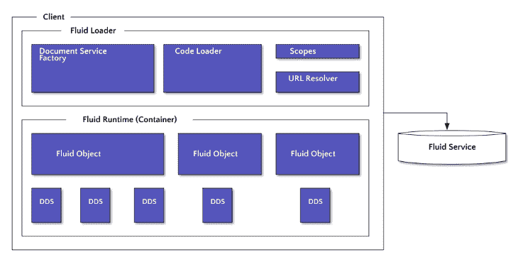
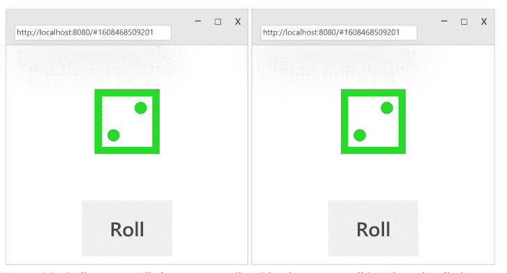

# 微软的 Fluid Framework:介绍- LogRocket 博客

> 原文：<https://blog.logrocket.com/microsofts-fluid-framework-an-introduction/>

微软的 Fluid Framework 是一项令人兴奋的新技术，最近已经开源。微软在其许多受欢迎的应用程序中使用了 Fluid 框架，包括 Office 365 和 Teams。

该技术的主要用例是支持跨用户的协作和实时更新。这与经典的 SignalR 技术不同，它不仅通过 WebSockets 广播实时更新，还通过所谓的[分布式数据结构(DDS)](https://fluidframework.com/docs/faq/#distributed-data-structures) 在数据中维护这些更新。

现在 [Fluid Framework 已经开源](https://developer.microsoft.com/en-us/office/blogs/fluid-framework-is-now-open-source/)，该技术可以在微软生态系统内外的客户端应用程序中使用。流体框架的示例用例包括:

*   共享项目(文档、演示等。)
*   赌博
*   需要标记在线状态(显示某人在线)的应用程序
*   头脑风暴和构思应用程序，如 Microsoft Visio 或流程图工具
*   团队协作

Fluid 的主要目标是处理实时更新的管道和机制，以便开发人员可以专注于体验，而不是处理同步消息和数据。Fluid Framework 提供了帮助器方法和包装器，使您的应用程序能够实时更新。

这篇文章将介绍 Fluid 框架，然后通过一个样例应用程序展示如何将它集成到您的项目中。要快速了解这项技术的运行情况，请查看 Build 2019 上展示的演示:

 [https://www.youtube.com/embed/RMzXmkrlFNg?version=3&rel=1&showsearch=0&showinfo=1&iv_load_policy=1&fs=1&hl=en-US&autohide=2&wmode=transparent](https://www.youtube.com/embed/RMzXmkrlFNg?version=3&rel=1&showsearch=0&showinfo=1&iv_load_policy=1&fs=1&hl=en-US&autohide=2&wmode=transparent)

视频

## 流体框架如何工作

正如我在介绍中提到的，Fluid Framework 已经存在了一段时间，现在你看到的许多微软应用中都有它的身影。我们可以讨论一般意义上的机制，如果你使用像微软团队这样的应用程序，你也可以看到它的运行。

该框架可以用以下术语来解释:

*   流体装载机
*   流体容器
*   流体服务

我借用了[流体框架文档](https://fluidframework.com/docs/concepts/architecture/)中的下图，它提供了一个极好的视觉效果:



A diagram of the Fluid Framework architecture (original can be found here: [https://fluidframework.com/docs/concepts/architecture/](https://fluidframework.com/docs/concepts/architecture/))

当应用程序使用流体框架时，它们从**流体加载器**开始。流体加载器包装了一个**流体容器**，其中包含了所有允许客户端与流体框架通信的机制。

流体容器包含与**流体加载器**通信的所有逻辑，然后流体加载器再与**流体服务**通信。流体容器还包含**流体运行时**，它包括分布式数据结构 [(DDS)](https://fluidframework.com/docs/concepts/dds/#:~:text=The%20Fluid%20Framework%20provides%20developers,access%20to%20the%20same%20state.&text=You%20can%20add%20data%20to,other%20users%20that%20are%20editing.) ，将数据保存到连接到应用程序的任何客户端。

**流体服务**将来自客户端 DDS 的任何变更作为 **op** (变更)接收。每当一个 op 被传递到 Fluid 服务中时，它就在 DDS 中保持它所发生的改变，然后将该改变传播到任何连接的客户端。

流体服务的作用是:

1.  维护排序
2.  广播更改
3.  存储数据

它跨任何客户端维护数据状态的方式是通过**会话存储**和**永久存储**。会话存储由运行在客户端上的 Fluid 服务管理。持久存储是保存在流体服务之外的 ops 记录(通常在数据库或文件中)。

有了 Fluid 框架，客户代码可以在 [npm](https://www.npmjs.com/) 上获得处理所有繁重工作的库。Fluid 框架最好的部分之一是它将独立地与[最流行的 UI 库](https://blog.logrocket.com/top-7-ui-libraries-and-kits-for-react/)一起工作，包括 React、Vue.js 和 Angular。

这给了团队很大的灵活性来使用他们选择的框架来实现这项技术。开发人员可以专注于他们的客户体验，让 Fluid Framework 为他们完成剩下的工作。

流体服务还有一个服务器组件。为了持久保存客户端的操作，需要一台服务器来存储数据。微软应用程序通过 SharePoint 和 OneDrive 形式的 Office 365 支持这一点。

如果您想自己构建这个，Fluid 服务也可以通过 Routerlicious 实现，它将处理不同客户端之间的 op 交换。这个实现可以用作本地服务器，或者您可以为您的应用程序生产它。查看[routerlious 自述文件](https://github.com/microsoft/FluidFramework/blob/main/server/routerlicious/README.md)了解更多信息。

如果你想了解更多关于整体实现的信息，我强烈推荐你观看尼克·西蒙斯和丹·瓦赫林的视频:

 [https://www.youtube.com/embed/SggIENvoeSg?version=3&rel=1&showsearch=0&showinfo=1&iv_load_policy=1&fs=1&hl=en-US&autohide=2&wmode=transparent](https://www.youtube.com/embed/SggIENvoeSg?version=3&rel=1&showsearch=0&showinfo=1&iv_load_policy=1&fs=1&hl=en-US&autohide=2&wmode=transparent)

视频

### 流体框架与信号 r

Fluid 框架在某种程度上类似于 SignalR 协议，因为它们都支持实时通信。然而，Fluid Framework 和 SignalR 之间的关键区别在于，Fluid Framework 协调了与前面提到的 DDS 对象的通信。

SignalR 支持客户端之间的直接通信。Fluid Framework 接收要发送的数据，不仅传输数据，还根据 DDS 对象的设置方式编排数据。要了解更多关于 SignalR 的信息，请查看我在[上发表的将微软 SignalR 与 Angular](https://rhythmandbinary.com/post/2020-10-16-connecting-microsoft-signalr-with-angular) 连接起来的博文。

## 使用 Fluid 框架编写应用程序

至此，我们已经讨论了这项技术及其工作原理。我们甚至已经进入了如何在您的应用程序代码中使用它的初级阶段。

为了更好地理解它们是如何组合在一起的，在一个示例应用程序中查看它会有所帮助。由于 Fluid 框架不依赖于客户端的任何一个库，它可以被拉入任何流行的前端库或框架，包括 React、Vue.js 和 Angular。

在大多数情况下，如果您想要使用 Fluid 框架，您需要一个运行 Fluid 服务的服务器，然后是包含 Fluid 容器的客户端应用程序。有多种方法可以做到这两点，这是该技术最强大的部分之一。

如果您查看 Fluid Framework 网站上的[入门部分](https://fluidframework.com/docs/get-started/tutorial/)，您会发现一些很棒的文档和多个示例项目可以帮助您入门。在这篇文章的下一部分，我将介绍这里解释的[教程](https://fluidframework.com/docs/get-started/tutorial/)。

### 骰子滚动器的例子



Source: [https://fluidframework.com/docs/get-started/quick-start/](https://fluidframework.com/docs/get-started/quick-start/)

骰子滚动器示例应用程序源代码可以在[GitHub repo 这里](https://github.com/microsoft/FluidHelloWorld)找到。

应用程序本身非常简单，只显示当你点击**掷骰子**时更新的骰子图像。每当骰子通过 Fluid Framework 掷出时，连接到该应用程序的客户端都会收到[实时更新](https://blog.logrocket.com/websockets-tutorial-how-to-go-real-time-with-node-and-react-8e4693fbf843/)。

该应用程序是一个很好的例子，因为它只有一个**流体容器**，然后连接到运行**流体服务**的本地服务器。

#### 掷骰子的观点

在将 Fluid Framework 连接到应用程序之前，第一步是定义骰子的视图。主要的前端框架和库通过不同的引导机制来实现这一点。这个例子非常简单，只利用了 webpack 的 TypeScript，所以我们可以如下定义初始视图:

```
export function renderDiceRoller(div: HTMLDivElement) {
    const wrapperDiv = document.createElement("div");
    wrapperDiv.style.textAlign = "center";
    div.append(wrapperDiv);
    const diceCharDiv = document.createElement("div");
    diceCharDiv.style.fontSize = "200px";
    const rollButton = document.createElement("button");
    rollButton.style.fontSize = "50px";
    rollButton.textContent = "Roll";

    rollButton.addEventListener("click", () => { console.log("Roll!"); });
    wrapperDiv.append(diceCharDiv, rollButton);

    const updateDiceChar = () => {
        const diceValue = 1;
        // Unicode 0x2680-0x2685 are the sides of a die (⚀⚁⚂⚃⚄⚅).
        diceCharDiv.textContent = String.fromCodePoint(0x267F + diceValue);
        diceCharDiv.style.color = `hsl(${diceValue * 60}, 70%, 50%)`;
    };
    updateDiceChar();
}

```

如果您注意到，它只是设计了一个基本的 div，并添加了事件侦听器，以便在点击 **Roll** 按钮并更新骰子时做出反应。

#### 掷骰子模型及其实现

因为我们的示例是用 TypeScript 实现的，所以我们可以使用一个接口来定义应用程序的行为，并对该接口的实现进行建模。

我们将在本节中定义的实现将通过 Fluid 框架的一个名为 Tinylicious 的助手函数连接到 Fluid 服务的一个正在运行的实例。如果你想了解它是如何被引导的，请看这里的[项目中的`src/app.ts`文件。](https://github.com/microsoft/FluidHelloWorld/blob/09e6c447bd360d046f72fa213253533a50b05cc9/src/app.ts#L34)

我们在示例应用程序中使用的骰子滚动器模型在“滚动”发生时发送一个`EventEmitter`事件，定义如下:

```
export interface IDiceRoller extends EventEmitter {
    readonly value: number;
    roll: () => void;
    on(event: "diceRolled", listener: () => void): this;
}

```

现在，如果我们从其 npm 模块(更多请参见此处的[)中引入流体框架的`DataObject`类，我们将在下面的实现中向流体容器注册骰子滚动:](https://github.com/microsoft/FluidHelloWorld/blob/09e6c447bd360d046f72fa213253533a50b05cc9/src/dataObject.ts#L7)

```
export class DiceRoller extends DataObject implements IDiceRoller {
    protected async initializingFirstTime() {
        this.root.set(diceValueKey, 1);
    }

    protected async hasInitialized() {
        this.root.on("valueChanged", (changed: IValueChanged) => {
            if (changed.key === diceValueKey) {
                this.emit("diceRolled");
            }
        });
    }

    public get value() {
        return this.root.get(diceValueKey);
    }

    public readonly roll = () => {
        const rollValue = Math.floor(Math.random() * 6) + 1;
        this.root.set(diceValueKey, rollValue);
    };
}

```

`root`对象将运行掷骰子模型(在前面的视图中)的流体容器连接到流体服务。如果您注意到了`initializedFirstTime`和`hasInitialized`方法，它们使用来自流体框架的`SharedDirectory`的`DataObject`向 DDS 注册流体容器，然后将其存储在流体服务的实例中。

我们将所有这些打包成一个工厂方法，任何客户端都可以通过以下方式调用该方法:

```
import { ContainerRuntimeFactoryWithDefaultDataStore } from "@fluidframework/aqueduct";

export const DiceRollerContainerRuntimeFactory = new ContainerRuntimeFactoryWithDefaultDataStore(
    DiceRollerInstantiationFactory,
    new Map([
        DiceRollerInstantiationFactory.registryEntry,
    ]),
);

```

这个方法利用了 Fluid Framework 的`ContainerRuntimeFactoryWithDefaultDataStore` helper 方法，它定义了一个容器实例。如果您想查看完整的实现以及它在示例项目中的位置，请查看 [GitHub repo](https://github.com/microsoft/FluidHelloWorld/blob/main/src/dataObject.ts) 中的`src/dataObject.ts`文件。

#### 将流体容器连接到流体服务

现在我们已经定义了视图和 dice 容器，我们可以用我前面提到的 Tinylicious 服务器来连接这一切。如果你看一下`src/app.ts`文件，你会看到当应用程序启动时[发生的所有引导。](https://github.com/microsoft/FluidHelloWorld/blob/main/src/app.ts)

特别注意这里的方法:

```
import { getTinyliciousContainer } from "@fluidframework/get-tinylicious-container";

const container = await getTinyliciousContainer(documentId, DiceRollerContainerRuntimeFactory, createNew);

```

导入的函数`getTinyliciousContainer`是 Fluid Framework 的 npm 包中的一个帮助器方法，它允许您启动运行 Fluid 服务的本地服务器。在生产环境中，您会将它与更多的编排联系起来，但是这里的 helper 方法只是让您作为初始介绍开始。

* * *

### 更多来自 LogRocket 的精彩文章:

* * *

这些是传递给函数的参数:

1.  `documentId`–会话的标识符，以便 Fluid Service 可以正确注册键-值对来存储和发布更新
2.  `DiceRollerContainerRuntimeFactory`–这是之前我们使用工厂方法包装流体容器时创建的
3.  `createNew`–一个布尔值，它让 Tinylicious 知道是开始一个新会话还是使用一个现有会话

#### 清理骰子视图

所有的部分都连接起来后，我们只需要修改我们最初创建的视图，现在就可以考虑流体框架了。如果您修改我们之前创建的原始`renderDiceRoller`函数，它应该是这样的:

```
export function renderDiceRoller(diceRoller: IDiceRoller, div: HTMLDivElement) {
    const wrapperDiv = document.createElement("div");
    wrapperDiv.style.textAlign = "center";
    div.append(wrapperDiv);
    const diceCharDiv = document.createElement("div");
    diceCharDiv.style.fontSize = "200px";
    const rollButton = document.createElement("button");
    rollButton.style.fontSize = "50px";
    rollButton.textContent = "Roll";

    // Call the roll method to modify the shared data when the button is clicked.
    rollButton.addEventListener("click", diceRoller.roll);
    wrapperDiv.append(diceCharDiv, rollButton);

    // Get the current value of the shared data to update the view whenever it changes.
    const updateDiceChar = () => {
        // Unicode 0x2680-0x2685 are the sides of a die (⚀⚁⚂⚃⚄⚅).
        diceCharDiv.textContent = String.fromCodePoint(0x267F + diceRoller.value);
        diceCharDiv.style.color = `hsl(${diceRoller.value * 60}, 70%, 50%)`;
    };
    updateDiceChar();

    // Use the diceRolled event to trigger the re-render whenever the value changes.
    diceRoller.on("diceRolled", updateDiceChar);
}

```

如果你注意到这里，我们现在将`diceRoller`值传递给函数。这由 Fluid Framework 更新，并告诉视图当掷骰子时要将图像更新成什么样子。

要查看所有这些操作，在这里做一个[项目回购的`git clone`](https://github.com/microsoft/FluidHelloWorld)，然后在你的终端中打开它，首先运行`npm install`，然后运行`npm run start`来启动服务器。打开您的 web 浏览器到`localhost:8080`，当您看到骰子渲染时，复制 URL 并打开第二个选项卡，以观察 Fluid Framework 保持两个选项卡同步。

这里的选项卡模拟了如果独立客户端连接到您拥有流体容器和流体服务的应用程序，您会看到什么。请点击此处查看它的运行情况:

 [https://www.youtube.com/embed/SXB89NuSwJE?version=3&rel=1&showsearch=0&showinfo=1&iv_load_policy=1&fs=1&hl=en-US&autohide=2&wmode=transparent](https://www.youtube.com/embed/SXB89NuSwJE?version=3&rel=1&showsearch=0&showinfo=1&iv_load_policy=1&fs=1&hl=en-US&autohide=2&wmode=transparent)

视频

## 最后的想法

在这篇文章中，我们介绍了微软的 Fluid Framework，并讲述了如何在我们的应用程序中使用该技术。我们介绍了这项技术的工作原理和所涉及的部分，包括流体容器和流体服务，并介绍了 Dice Roller 示例项目。

这篇文章只是触及了这项技术的表面可能性。在这个许多人远程工作、在线协作至关重要的时代，Fluid Framework 为实现这种实时交流提供了一条真正坚实的道路。

微软在团队和 Office 365 方面的成功证明了这项技术的实用性。此外，您可以轻松地引入 Fluid 框架并构建自己的应用程序，这也是一个很好的入门动机。

微软最近开放了 Fluid Framework 的源代码。现在所有开发人员都可以获得源代码，这项技术在未来有很大的潜力。

我希望你喜欢这篇文章，并有兴趣了解更多关于流体框架的知识。我强烈建议查看[流体框架网站](https://fluidframework.com/)了解更多信息。

感谢您阅读我的帖子！在 [andrewevans.dev](https://www.andrewevans.dev/) 上关注我，在 [@AndrewEvans0102](https://twitter.com/AndrewEvans0102) 的 Twitter 上与我联系。

## 使用 [LogRocket](https://lp.logrocket.com/blg/signup) 消除传统错误报告的干扰

[](https://lp.logrocket.com/blg/signup)

[LogRocket](https://lp.logrocket.com/blg/signup) 是一个数字体验分析解决方案，它可以保护您免受数百个假阳性错误警报的影响，只针对几个真正重要的项目。LogRocket 会告诉您应用程序中实际影响用户的最具影响力的 bug 和 UX 问题。

然后，使用具有深层技术遥测的会话重放来确切地查看用户看到了什么以及是什么导致了问题，就像你在他们身后看一样。

LogRocket 自动聚合客户端错误、JS 异常、前端性能指标和用户交互。然后 LogRocket 使用机器学习来告诉你哪些问题正在影响大多数用户，并提供你需要修复它的上下文。

关注重要的 bug—[今天就试试 LogRocket】。](https://lp.logrocket.com/blg/signup-issue-free)