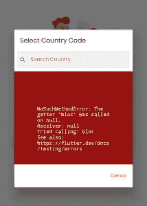
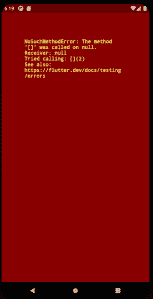
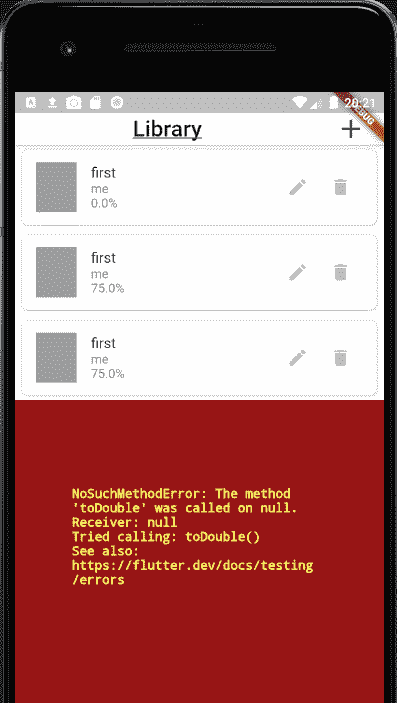
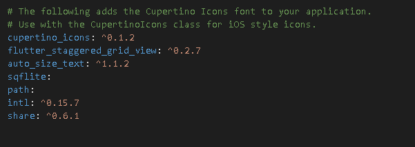
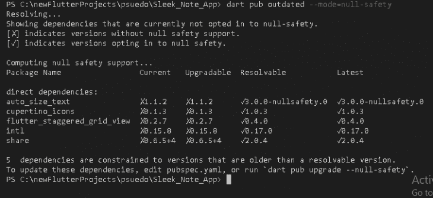
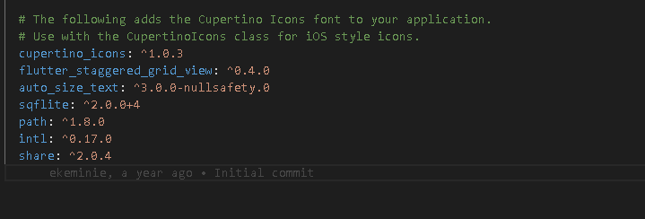
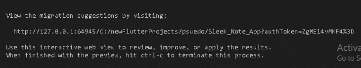
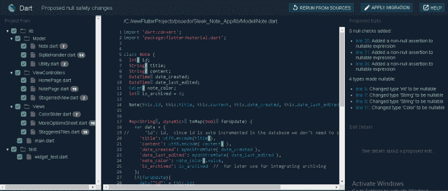

# 将你的 Flutter 项目迁移到 null 安全日志

> 原文：<https://blog.logrocket.com/migrating-flutter-project-null-safety/>

大多数使用过 Flutter 的人都在运行时遇到过空错误。它们通常看起来像这样:





这些例子只是由于没有初始化应用程序中的变量而导致的一些运行时错误。

这就是 Flutter 的无效安全功能占据中心舞台的地方。空安全是面向对象编程语言中的一种保证，即没有对象引用具有`null`或`void`值，尤其是在运行时。

Flutter 的零位安全与健全的零位安全捆绑在一起，以确保 Dart 分析仪提供有用的警告和提示。

为了享受空安全的好处，您必须将您的项目迁移到一个空安全版本的 Flutter 2，这带来了一些变化。和往常一样，Dart 文档提供了一个很好的关于这个迁移如何工作的[指南](https://dart.dev/null-safety/migration-guide)，并且有一个方便的命令`dart migrate`，帮助自动化这个过程，但是本文将带您一步步地完成将一个旧项目迁移到 null safety 的过程。

在将项目迁移到空安全版本之前，您需要考虑以下几点。

## 检查您的项目是否使用空安全

为了知道您的项目是否使用空安全，请转到您的`pubspec.yaml`文件，并在环境部分下检查您的项目当前使用的 Dart SDK 版本:

```
environment:
  sdk: ">=2.10.0 <3.0.0"

```

如果左侧的 SDK 版本等于或低于 2.10.0，则您当前没有在项目中启用空安全。

另一方面，如果您的版本号是 2.12.0 或更高，那么您在项目中启用了空安全。

## 迁移您的包

对于本文，我们将把我的 [Sleek Note 应用程序项目](https://github.com/Ekeminie/Sleek_Note_App)迁移到 null safety，这将在 GitHub 上主分支的一个新分支上完成:

```
dart pub outdated --mode=null-safety

```

我们将使用上面的命令来检查我们在项目中使用的包的状态，看看它们是否可以迁移到一个空安全的版本。

我们的项目包含以下包:



在我们的例子中，这是我们运行命令得到的结果:



结果显示，我们所有的包都可以升级，因为它们都有新版本，在 Resolvable 和 Latest 列下支持空安全。如果出于任何原因，您使用的软件包没有空安全版本或预发行版本，您可以随时从软件包网站联系作者。

为了迁移我们的包，我们将使用下面的命令:

```
dart pub upgrade --null-safety

```

完成后，运行以下命令:

```
flutter pub get

```

一旦我们完成了上面的工作，我们在`pubspec`中更新的包现在看起来像这样:



在确定您的项目中没有运行 null safety 并且您希望进行切换之后，下一步是确保您使用的所有包都已经正确地迁移到 null safety。

这也意味着，如果您使用一个对另一个包具有依赖链的包，您将需要等待这些包按照它们的层次结构进行迁移。例如，如果您的项目使用包 A 并依赖于包 B，而包 B 又依赖于包 C，那么要迁移的第一个包应该是 C，接着是 B，然后是 A。

*注意，在依赖于您的包的包被迁移之前，您可以将这些包迁移到 null safety，但是这一步可以确保您在最终迁移这些包时不会遇到错误。*

## 迁移您的 Flutter 项目

我们将使用 Dart 迁移工具迁移我们的代码。如果您对 Dart 空安全语法感到满意，您也可以手动迁移您的代码。

### 使用 Dart 迁移工具

要使用 Dart 内置迁移工具，请运行以下命令:

```
dart migrate

```

由于我们完成了上述步骤，我们将看到一个链接，这个链接应该在 Chrome 浏览器中打开。



当我们的浏览器窗口打开时，我们将看到我们所有的项目文件被选中，您可以浏览每个项目文件以查看所做的更改。在我们的例子中，如果你看一下我们的`Note Model`类，你会发现一个主要的变化是一个非空断言将被添加到所有可空的表达式中。



值得注意的是，对于大多数生产规模的应用程序，尤其是包含大量文件的大型项目，您可能不希望一次迁移所有内容。因此，您可以简单地取消选中您的文件和项目文件夹，并使用所谓的增量迁移。您可以在这里找到更多关于增量迁移的[细节。](https://dart.dev/null-safety/unsound-null-safety)

对于这个特定的项目，我们将通过单击 Apply Migration 将更改应用到我们所有的文件，因为一切看起来都很好。

这样做之后，我们可以通过运行`flutter pub get`命令来获得我们的包，并尝试运行我们的项目。

我们无缝成功地将一个旧项目迁移到 null safety。

* * *

### 更多来自 LogRocket 的精彩文章:

* * *

### 手动将您的代码迁移到空安全

使用以下代码检查您的 Dart 版本，以确保您没有运行任何低于 Dart 2.12 的版本:

```
 dart --version

```

如果是，只需更新您的`pubspec.yaml`文件中的数字，如下所示:

```
environment:
  sdk: ">=2.12.0 <3.0.0"

```

这也是在项目中禁用空安全的一种很酷的方式。

任何时候你需要关闭空安全，只需降级你的版本号并再次运行`flutter pub get`来更新你的依赖关系。

之后，使用下面的命令再次更新您的包:

```
dart pub get

```

不出所料，分析器会对您的代码不满，并指出许多分析错误，您必须在必要的地方进行修改。所需的大部分改变只是在需要的地方添加`?`、`! required`和`late`。

完成后，您可以运行下面的代码来验证您所做的更改:

```
dart analyze 

```

## 最后的想法

从以上所述，我们可以看到声音零安全是多么有用。

记住，对于需要声明 null aware 的变量类型或命名参数，要始终使用 null aware 操作符`?`,以减少编译时错误。

您可以随时[查阅有关零安全的官方文件，了解更多信息](https://dart.dev/null-safety)。

我们项目的零安全版本可以在这里找到。

## 使用 [LogRocket](https://lp.logrocket.com/blg/signup) 消除传统错误报告的干扰

[](https://lp.logrocket.com/blg/signup)

[LogRocket](https://lp.logrocket.com/blg/signup) 是一个数字体验分析解决方案，它可以保护您免受数百个假阳性错误警报的影响，只针对几个真正重要的项目。LogRocket 会告诉您应用程序中实际影响用户的最具影响力的 bug 和 UX 问题。

然后，使用具有深层技术遥测的会话重放来确切地查看用户看到了什么以及是什么导致了问题，就像你在他们身后看一样。

LogRocket 自动聚合客户端错误、JS 异常、前端性能指标和用户交互。然后 LogRocket 使用机器学习来告诉你哪些问题正在影响大多数用户，并提供你需要修复它的上下文。

关注重要的 bug—[今天就试试 LogRocket】。](https://lp.logrocket.com/blg/signup-issue-free)