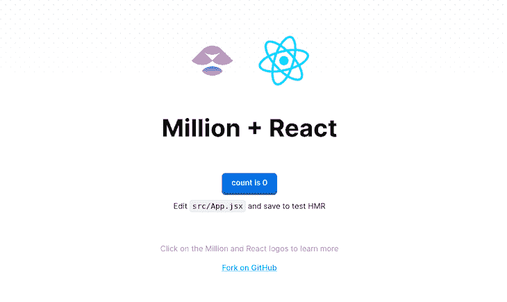

# 百万:用 JSX 构建应用程序的速度比 React 和 Preact 还要快

> 原文：<https://blog.logrocket.com/million-js-build-apps-jsx-faster-react-preact/>

React 是撰写本文时最主要的前端 web 框架，然而，它也存在一些问题，例如，膨胀的包大小会降低应用程序的性能。

虽然已经有许多尝试来最小化这些因素，但是新的创新寻求在已经取得的进展上进行改进。在本文中，我们将探索 [Million，一个轻量级虚拟 DOM](https://millionjs.org) 。我们还将比较 Million 与 React 和 Preact 的性能和特性。我们开始吧！

## React 的常见问题

React 引入了几项有用的创新，例如，一种用于表达声明性 UI 的类似 HTML 的语法，可以转换成`React.createElement`调用。React 还为我们提供了优化 DOM 更新的能力。通过创建 DOM 树的虚拟版本来跟踪实际 DOM 中的差异，我们可以将更新限制在实际发生变化的内容上。

然而，React 的一个问题是，您必须为每个 React 应用程序提供 React 库。这样做会增大包的大小，从而降低首次绘制的速度，或者降低 web 应用程序的初始加载速度。

React 在撰写本文时是 18.2 版本，由两个库组成:React，10.7kb 缩小版，和`[react-dom](https://reactjs.org/docs/react-dom.html)`，131.9.kb 缩小版。对于浏览器来说，这可能是一个很大的负担，而且它甚至不包括 web 应用程序本身的实际代码。

另一个问题是虚拟 DOM，它可能是处理密集型的。虽然虚拟 DOM 可以在开发良好的应用程序上加速渲染，但它也会在没有使用最佳实践或使虚拟 DOM 能够有效优化的开发不良的应用程序上增加大量处理工作负载。

## 使用 Preact 加快速度

虽然许多开发人员喜欢使用 React 的开发人员体验和生产效率，但减轻大的包大小和虚拟 DOM 工作负载是一个关键的优先事项。

解决这些问题的最初尝试之一是 Preact。Preact [创建了一个虚拟 DOM 实现](https://blog.logrocket.com/introduction-to-preact-a-smaller-faster-react-alternative-ad5532eb6d79/),它利用了 web 标准，因此需要交付的代码更少。结果实现了 3kb 的库大小，比 React 小得多，更快的虚拟 DOM，以及通过使用 HTM 标记的模板文字而不是 JSX 来避免翻译的能力。

Preact 在那些关心 react 的包大小和虚拟 DOM 处理的人中间变得越来越流行。事实上，它是 [Fresh](https://fresh.deno.dev/) 的本地模板库，这是 Deno 运行时的一个新的全栈 web 框架。

## 编译:苗条、结实、百万的下一代

另一项开发试图通过完全消除将框架运送到浏览器的需要来进一步降低包的大小和速度。这项创新包括流行的工具，如 Svelte、Solid 和，Million，所有这些工具都因其速度而越来越受欢迎。

### 苗条的

由 Rich Harris 创建的 Svelte 采用了传统的 web 模式和标准。苗条的应用程序被编译成网络标准代码，所以没有框架必须运送给最终用户。Rich Harris 最近被 Vercel 聘用，全职开发“苗条”[和它的“苗条工具包”框架](https://blog.logrocket.com/intro-testing-sveltekit-applications/)。

### 固体

由 Ryan Carniato 创作，Solid 的灵感来自于 Knockout 这样的框架，但通过使用 JSX 带来了非常熟悉的 React 风格。

可靠的应用程序，如 Svelte，被编译，只有应用程序代码被发送给最终用户。Solid 的反应模型与 React 有很大的不同，所以即使你使用 JSX 语法，某些模式的表现也有很大的不同。

不是每次更新时都重新运行组件函数，而是将代码的一部分指定为效果，每当依赖项更新时都重新计算这些效果。Ryan Carniato 已被 Netlify 聘用，全职工作于 Solid。

### 百万

与 Solid 类似，Million 允许你使用 JSX 语法并编译你的代码，这样你给浏览器带来的东西就少多了。

Million 有一个精简的虚拟 DOM 实现，像 Preact 一样，用来维护一个更加一致的 API 来作出反应。与 Preact 的 3kb 虚拟 DOM 实现相比，100 万只船的容量不到 1kb。

Million 的 API 是开源的，允许任何人在其上构建。理论上，如果我想创建一个编译器来编译 Vue 组件，使之与百万虚拟 DOM 一起工作，我可以做到。

Million 在其当前版本中提供了更快的类似 React 的体验，但也为开发人员打开了大门，让他们可以在其轻薄快速的虚拟 DOM 方法之上构建新框架或扩展现有框架。让我们通过构建一个快速应用程序来看看它是如何工作的。

## 设置您的百万应用程序

前往这个[百万模板](https://github.com/aidenybai/million-react)，点击**使用模板**在你的 GitHub 账户中创建你自己的模板副本。

通过运行`git clone <github repo url>`克隆到您的计算机上。然后，将`cd`放到新创建的文件夹中，并运行`npm install`来安装所需的依赖项。最后运行`npm run dev`运行开发服务器。

当您转到`localhost:3000`时，您应该会看到以下内容:



我们现在已经准备好开始开发这款价值百万的应用，这应该和使用 React 没有什么不同。

## 创建基本计数器

转到您的`src/App.jsx`文件，用下面的代码替换其中的内容，这会清空屏幕:

```
import { useState } from 'react';
import './App.css';
function App() {
  // State for the counter
  const [count, setCount] = useState(0);
  return (
    <div className="App">
    </div>
  );
}
export default App;

```

现在，让我们构建我们的传统计数器，就像我们在任何早期阶段的 React 教程中一样:

```
import { useState } from 'react';
import './App.css';
function App() {
  // State for the counter
  const [count, setCount] = useState(0);
  // Function to increment counter
  function addCount(){
    setCount((current) => current + 1)
  }
  return (
    <div className="App">
      <h1>{count}</h1>
      <button onClick={addCount}>Add One</button>
    </div>
  );
}
export default App;

```

现在，您应该会在屏幕上看到以下内容:


就是这样，您不需要对 React 中的应用程序开发做任何更改，就可以在 Million 中进行开发，但是您将受益于 Million 针对超薄捆绑包使用的更快的虚拟 DOM 实现和编译。

## 结论

和 Preact 一样，Million 解决了大型 react 包和重量级虚拟 DOM 的问题，但增加了编译功能，以进一步提高速度和减少包。

有了 Million，我们可以享受用我们熟悉的 React 方式开发应用程序的乐趣，而不用做任何大的改动。然而，请记住[一些新功能可能不会立即可用](https://github.com/aidenybai/million-react#limitations)。前端框架空间仍然是 web 开发空间中许多创新的中心，看到这个项目的成果是令人兴奋的。

## 使用 LogRocket 消除传统反应错误报告的噪音

[LogRocket](https://lp.logrocket.com/blg/react-signup-issue-free)

是一款 React analytics 解决方案，可保护您免受数百个误报错误警报的影响，只针对少数真正重要的项目。LogRocket 告诉您 React 应用程序中实际影响用户的最具影响力的 bug 和 UX 问题。

[ ](https://lp.logrocket.com/blg/react-signup-general) [  ](https://lp.logrocket.com/blg/react-signup-general) [LogRocket](https://lp.logrocket.com/blg/react-signup-issue-free)

自动聚合客户端错误、反应错误边界、还原状态、缓慢的组件加载时间、JS 异常、前端性能指标和用户交互。然后，LogRocket 使用机器学习来通知您影响大多数用户的最具影响力的问题，并提供您修复它所需的上下文。

关注重要的 React bug—[今天就试试 LogRocket】。](https://lp.logrocket.com/blg/react-signup-issue-free)