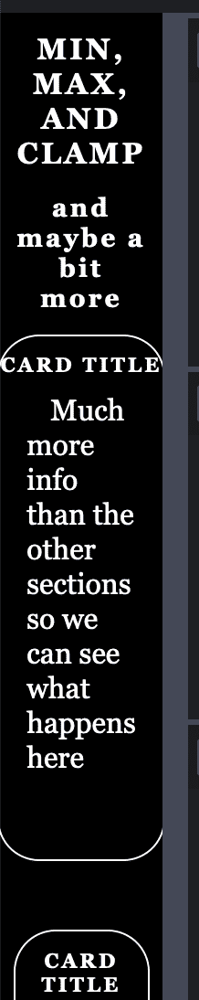
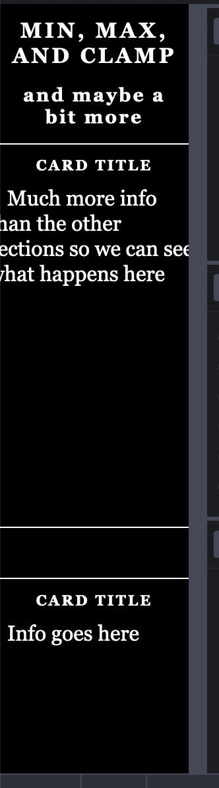
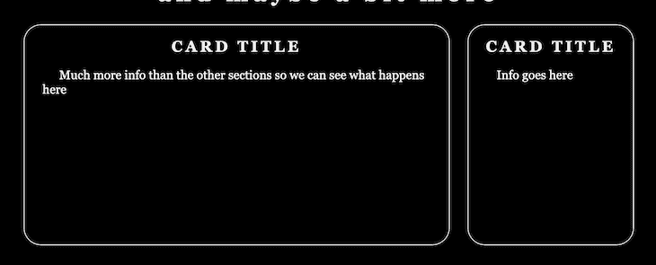
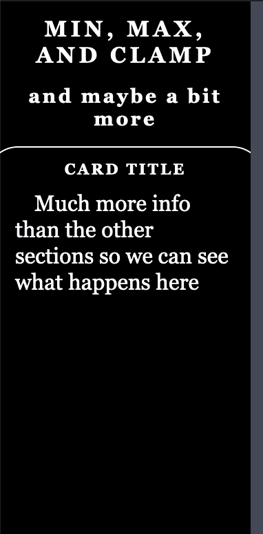

# min()、max()和 clamp() CSS 函数指南

> 原文：<https://blog.logrocket.com/min-max-clamp-css-functions/>

我最近有机会重新设计了一个网站，所以我想我应该掌握一下`min()`、`max()`和`clamp()` CSS 函数，这些函数现在已经开始被[广泛实现](https://caniuse.com/?search=min%20max%20clamp)了，非常有用。

在我看来，这些功能有可能彻底改变网页布局，但如果充分发挥它们的潜力，它们也会让 CSS 变得更加难以理解。

## 这些功能是什么？

我们将参考 MDN 来了解它们的定义。

*   `[**min()**](https://developer.mozilla.org/en-US/docs/Web/CSS/min)`:允许您将逗号分隔表达式列表中的最小(最负)值设置为 CSS 属性值
*   `[**max()**](https://developer.mozilla.org/en-US/docs/Web/CSS/max)`:允许您将逗号分隔的表达式列表中的最大(最正)值设置为 CSS 属性值
*   `[**clamp()**](https://developer.mozilla.org/en-US/docs/Web/CSS/clamp)`:将一个值夹在上限和下限之间。`clamp()`允许选择定义的最小值和最大值之间的中间值。它有三个参数:最小值、首选值和最大允许值

另一个有趣的注意事项是，您可以在函数内部进行数学运算，而无需使用`calc`。所以，你可以只做`min(5vw + 5px, 50px);`，而不是`min(calc(5vw + 5px), 50px);`。当然，你也可以在一个变量中进行计算，然后使用这个变量。

可能令人困惑的一件事是命名。如您所料，`min()`返回其值列表中的最小值，`max()`返回其最大值。但是如果我做了下面的事情会发生什么呢(对于这个例子来说，这是一个非常荒谬的用法):

```
width: min(1px,200px,300px);

```

当然，会返回 1px，这意味着 min 函数的输出将该宽度的最大值设置为 1px。

正如 W3C 规范对 CSS 值和单位模块级别 4 的描述:

> 使用`min()` / `max()`时偶尔会出现的一个混淆点是，你用`max()`对某个东西施加最小值(也就是像`min-width`这样的属性有效地使用了`max()`，用`min()`对某个东西施加最大值；很容易不小心碰到相反的功能，试图用`min()`加一个最小尺寸。使用`clamp()`可以使代码读起来更自然，因为值位于最小值和最大值之间。

这是一个有三个 div 的例子，两个显示`min()`值输出，一个显示`max()`值输出以设置宽度:

参见 [CodePen](https://codepen.io) 上布莱恩·拉斯姆森([@布莱恩·拉斯姆森](https://codepen.io/bryanrasmussen) )
的 Pen [例子 min，max](https://codepen.io/bryanrasmussen/pen/xxVMbpp) 。

每个 div 的文本内容是用来设置其宽度的实际的`min()`或`max()`函数，所以你可以很容易地看到效果。

这些函数中的每一个都可以在任何可以使用长度、频率、角度、时间、百分比、数字或整数的地方使用。显然，这意味着他们可以将任何可以用于这些类型的值的单位作为输入。因此，例如，您可能有如下内容:

```
transform: rotate(min(45deg, .15turn));
```

## 以意想不到的方式使用这些函数

当然，你将如何在像`width`这样的属性中使用这些函数或者像`calc()`这样的函数是显而易见的(或者，如果不能立即明显看出*到*如何使用它们，至少可以立即明显看出它们*可以在那里使用*)。但是还有许多其他可能不太明显的方法可以使用它们。

从这一节中得到的主要教训是，由于这些函数作用于单元，所以您可以将任何返回的函数——比如`calc()` —作为输入，或者在任何需要单元的函数中使用它们。所以作为我们的第一个例子，让我们在不太明显的 HSL 函数中使用它们。

### 与 HSL 功能一起使用

HSL 代表色调、饱和度、明度，是 CSS 3 中增加的功能。你可以[参考这篇文章](https://blog.logrocket.com/colors-in-css-present-and-future/)来复习 HSL。

下面的例子乍一看似乎不是特别有用，但是看看如何在 HSL 函数中使用`min`和`max`:

```
hsl(min( 180, 190, 150), max(75%, 50%; 100%), 50%)
```

这并没有给你任何你不能通过简单地在你的头脑中计算和书写得到的东西:

```
hsl(150, 100%, 50%)
```

在这种情况下，你知道所有的值是什么。CSS 变量使得这些函数在这种情况下更加有用。

### 对 CSS 变量使用数学和 HSL

CSS 变量可能会被媒体查询覆盖，在您所在站点的上下文中加载特定的 CSS，或者由 JavaScript 更改变量值。

因此，一旦你能这样做:

```
hsl(
  min(
    var(--extreme-hue),
    var(--base-hue)
  ), 
  max(
    var(--base-saturation),
    var(--region-saturation)
  ),
  50%);
```

它为更有意义和更强大的计算打开了大门。(请注意，在站点或应用程序的上下文中，变量名可能更能反映用法；在这里，它们只是为了表明一种方法。)

这里有一个例子:

见 [CodePen](https://codepen.io) 上布莱恩·拉斯姆森([@布莱恩·拉斯姆森](https://codepen.io/bryanrasmussen) )
用 HSL 的笔[、Min、Max。](https://codepen.io/bryanrasmussen/pen/YzqvXKe)

下面是一个在媒体查询中覆盖 CSS 变量值的例子:

见笔 [Min，Max 随 HSL 媒体查询](https://codepen.io/bryanrasmussen/pen/eYZKvqp)by Bryan Rasmussen([@ Bryan Rasmussen](https://codepen.io/bryanrasmussen))
于 [CodePen](https://codepen.io) 。

如我所说，你也可以用 JavaScript 覆盖 CSS 变量。下面是一个在两秒钟间隔内随机改变变量的愚蠢例子:

请看 [CodePen](https://codepen.io) 上 Bryan Rasmussen([@ Bryan Rasmussen](https://codepen.io/bryanrasmussen))
用 HSL JavaScript 更新的 Pen[Min，Max。](https://codepen.io/bryanrasmussen/pen/abNKWOp)

### 可以使用`min()`、`max()`和`clamp()`的功能

正如我所展示的，由于 CSS 变量的存在，甚至那些你可能认为不可能从`min()`、`max()`或`clamp()`中受益的函数仍然可以使用它们。

所以，这里有一个函数列表，你可以在其中使用数学函数，尽管你可能通常不会想到(你可能会想到使用它们的函数，比如`calc()`，已经被忽略了)。为了便于理解，该列表被划分为不同类型的函数:

#### 颜色函数

这些函数将输出一个滤镜或处理图像的配色方案。

#### 形状函数

这些函数将创建一个形状(一个图像)或输出一个变换:

*   `[circle()](https://developer.mozilla.org/en-US/docs/Web/CSS/basic-shape#circle())`
    *   [这里有一个例子](https://codepen.io/bryanrasmussen/pen/NWNzwvd)使用`circle`和先前的径向梯度函数。其他形状功能如`polygon`、`ellipse`等。也可以用同样的方式使用数学函数。若要查看效果，请调整渲染区域的大小
*   `[cubic-bezier](https://developer.mozilla.org/en-US/docs/Web/CSS/easing-function#cubic-bezier())`等动画功能
*   `[invert()](https://developer.mozilla.org/en-US/docs/Web/CSS/filter-function/invert)`
*   `[matrix()](https://developer.mozilla.org/en-US/docs/Web/CSS/transform-function/matrix)`
*   `[matrix3d()](https://developer.mozilla.org/en-US/docs/Web/CSS/transform-function/matrix3d)`
*   `[perspective()](https://developer.mozilla.org/en-US/docs/Web/CSS/transform-function/perspective)`
*   `[rotate()](https://developer.mozilla.org/en-US/docs/Web/CSS/transform-function/rotate)`(亦作`rotate3d()`、`rotateX()`等)。)
*   `[scale()](https://developer.mozilla.org/en-US/docs/Web/CSS/transform-function/scale)`(亦作`scale3d()`、`scaleX()`等)。)
*   `[skew()](https://developer.mozilla.org/en-US/docs/Web/CSS/transform-function/skew)`(亦作`skewX()`、`skewY()`)
*   `[steps()](https://developer.mozilla.org/en-US/docs/Web/CSS/easing-function#steps())`
*   `[translate()](https://developer.mozilla.org/en-US/docs/Web/CSS/transform-function/translate)`(亦作`translate3d()`、`translateX()`等)。)

当然，还有其他可用的函数，但是其中一些函数在我能想到的任何方式下都是不可用的，无论您多么有创造力——或者，在撰写本文时，它们在大多数流行的平台上都不受支持，因此不太可能值得使用。

## 这些功能不起作用的意想不到的方式——目前还没有

如前所述，这些函数可以接受任何数字或可计算值作为输入，比如变量的长度。此外，它们可以将诸如变量之类的东西作为输入，您可以将计算结果、数字或其他值保存在变量中。

许多不同的 CSS 属性都有特殊的关键字，这些关键字最终会返回一个值，这个值可以是长度、百分比或数字，也就是说，可能会被这些函数之一使用。

例如，`width`有以下特殊关键字:

*   `**max-content**`:固有的首选高度或宽度
*   `**min-content**`:固有的最小高度或宽度(例如，包含一个字母的块具有该字母的固有最小高度或宽度)

引用 W3C 工作组关于[的话，内在规模意味着什么](https://drafts.csswg.org/css-sizing/#intrinsic-sizing):

> 每个轴中盒子的 [`min-content`大小](https://drafts.csswg.org/css-sizing/#min-content)是如果它是一个在该轴中给定了`[auto](https://drafts.csswg.org/css-sizing/#valdef-width-auto)`大小的浮点数(并且在该轴中没有[最小](https://drafts.csswg.org/css-sizing/#min-width)或[最大大小](https://drafts.csswg.org/css-sizing/#max-width))并且如果它的包含块在该轴中的大小为零，那么它将具有的大小。(换句话说，当调整为“收缩至适合”时，它具有的最小尺寸。)
> 
> 一个盒子在每个轴上的 [`max-content`大小](https://drafts.csswg.org/css-sizing/#max-content)是如果它是一个在该轴上给定了`auto`大小的浮点数(并且在该轴上没有最小或最大大小)，并且如果它的包含块在该轴上是无限大小的，那么它将具有的大小。(换句话说，当调整为“收缩至适合”时，它所具有的最大尺寸。)

您可能会认为这些关键字在`min` / `max`函数中是可用的，尤其是当您看到像`fit-content` [这样的函数在它们的定义](https://developer.mozilla.org/en-US/docs/Web/CSS/fit-content)中使用它们来描述函数是如何实现的。但是目前，还没有关于如何实现这一点的规范。

我向 CSS 工作组询问是否可以使用它们，但答案似乎是“现在不行”然而，他们希望它们在某个时候是可用的。

## 稍微讲一下`clamp()`

在下一节中，我们将开始使用`clamp()`函数，尽管在适用的地方仍然会用到`min()`和`max()`。因此，在继续之前，我们可能应该扩展一下`clamp()`，以及我们三个函数一起使用时会产生的复杂性。

首先，记住`clamp()`只接受三个属性:最小值、首选值或默认值以及最大值。所以，`clamp(MIN, DEFAULT, MAX)`。

关于`clamp()`的推理容易是一个很大的好处。有了`clamp()`，你将能够减轻一些 QA 和设计师的疯狂，你作为一个开发者可能已经注意到了。我的意思是，当然，像素完美设计的疯狂。

### 如何帮助像素完美的设计

如果你在谷歌或 DuckDuckGo 中搜索“像素完美设计的问题”，你会发现足够多的反对理由让你忙个不停。但是作为一名开发者，你可能已经意识到，因为像素完美的设计并不真正存在。考虑:

1.  设计可能不会显示应用程序的所有可能状态。例如，如果数据太少，无法实现设计，会发生什么情况？
2.  设计时考虑了特定的显示器尺寸和分辨率，因此，它并不适合世界上所有其他显示器。

然而，作为一名开发人员，你可能也遇到过控制你的工作的人要求设计的保真度。通常，这是因为设计是根据他们的显示器规格进行的。因此，他们可以看到它看起来不正确，因为你可能已经将设计视为必须平衡的百分比的集合，以便在最广泛的显示器上看起来很好。

* * *

### 更多来自 LogRocket 的精彩文章:

* * *

但是使用`clamp()`，以及它的最小值、缺省值和最大值的组合，您可以指定一个缺省值或最大值(取决于哪个有意义)来匹配设计期望。

因此，如果你遇到一个利益相关者，他要求一个设计在他们的计算机上看起来是正确的(即使他们不会轻易接受你的论点，即它在你的计算机上工作是没有错误的一个原因)，只要记住你有一个工具可以使这个原本荒谬的目标成为可能。

话虽如此，*请*向他们发送一些反对像素完美设计的理由，并在满足他们之前，努力让他们明白他们想要的*是不明智的*。

### 如何实现`clamp()`

[MDN 断言](https://developer.mozilla.org/en-US/docs/Web/CSS/clamp)“`clamp(MIN, VAL, MAX)`被解析为`max(MIN, min(VAL, MAX))`”

还记得我们早先的简单的`min`/`max`div 的例子，其中函数是以文本形式编写的，这里有两个`clamp()`的例子，其中一个说明了`clamp()`函数的实现就像 MDN 上面描述的那样:

参见 [CodePen](https://codepen.io) 上布莱恩·拉斯姆森([@布莱恩·拉斯姆森](https://codepen.io/bryanrasmussen) )
的笔 [例夹](https://codepen.io/bryanrasmussen/pen/BaKMyvy)。

当然，这向我们展示了制作箝位行为的小变体是非常容易的。例如，我们可以很容易地得到类似于`max(MIN, min(Variable 1, MAX), min(Variable 2, MAX))`的用法，同样地(正如我们之前提到的)，你可以在`min`或`max`中使用`clamp`；`clamp`内用的`min`或`max`；和`calc`以及使用这些函数或基本值的变量。

最后，当然，正如您已经看到的，我们可以混合和匹配测量单位。但是让我们假设你有`min(200px; 50%; 50vw)`。现在你正在对三个值做一个`min`，其中一个是绝对的(`200px`)，一个是由你的父元素的大小决定的(`50%`)，一个是基于窗口大小决定的(`50vw`)。

因此，虽然`clamp(minimal value, default value, maximum value)`可能更容易推理，但当您考虑到这三个值的确定实际上可能有多复杂，以及作为开发人员您可能需要记住多少因素来推理代码时，这种好处可能会直接消失。

所有这些都意味着 CSS 比以前更复杂的可能性——同时也意味着权力的相对增加。我不会建议一个解决这个问题的方法，因为我认为任何建议都会部分地基于提出建议的人的首选问题处理方法。

因此，我可以很容易地想象一些人建议处理这些复杂情况的最佳实践是建立某种编码规则，其中没有任何`clamp()`函数可以包含嵌套的函数或计算，以保持对预期输出的推理更简单(可能由林挺规则强制执行)。

另一方面，我处理这种复杂性的首选方式是编写工具来帮助分析 CSS 代码正在做什么(因为我不喜欢放弃权力)。还有一些人可能想对计算出的样式结果进行广泛的测试。

## 这些函数的用途是什么

我想我们已经证明了这些函数可以用在许多你最初可能不会想到会用到它们的地方，仅仅是因为许多 CSS 属性将某种数字作为它们的输入。但是现在，我认为是时候看看它们在主要用例中是如何工作的了。

### 字体大小

我将从字体大小开始，因为这些通常是你在一个网站中开始的。(至少我是这样做的——在开始设计更复杂的模块之前，我喜欢给出标题和主要文本的大小和布局。)

有了`clamp()`和一些计算，创建一个好的字体大小体验就变得简单了。

例如，这里有两个类——一个标题和一个副标题——以及一些用于表示大小的变量。通过在标题上使用`clamp()`，我们可以指定标题的最小字体大小将是应用程序的默认字体大小。我们的首选大小是 4.5vw，但它绝不能超过应用程序的最大字体大小。

我们为`subTitle`指定同样的东西；我们只是用了一点点`calc`来减小尺寸。

你也会注意到我在`title`和`subTitle`的`letter-spacing`上加了一个`clamp`。同样的原理:最小的时候，标题的字母间距是. 1rem 最大也就. 5 雷姆，如果我们能在中间装上 1.5vw，就用上了。在任何情况下，`subTitle`的`letter-spacing`都比`title`的略小。

```
.title {
  text-transform: uppercase;
  font-weight: 800;
  font-size: clamp(var(--default-font-s), 4.5vw, var(--biggest-font-s));
  letter-spacing: clamp(.1rem, 1.5vw, .5rem)
}

.subTitle {
  font-size: clamp( var(--default-font-s) - 2px, 4.5vw - 10px, var(--biggest-font-s) - 5px);
  letter-spacing: clamp(.1rem, 1vw, .4rem)
}

```

如果你看下面的例子，你可以看到当你让窗口变大变小时，它会很好地调整大小。(当然，这些项目有一些额外的属性来使它们看起来更好。)

请看 [CodePen](https://codepen.io) 上布莱恩·拉斯姆森([@布莱恩·拉斯姆森](https://codepen.io/bryanrasmussen) )
的 Pen [min，max，clamp _ titles](https://codepen.io/bryanrasmussen/pen/JjXBGLY) 。

现在来看看这个例子:

参见 Bryan Rasmussen([@ Bryan Rasmussen](https://codepen.io/bryanrasmussen))
在 [CodePen](https://codepen.io) 上的 Pen [min，max，clamp _ with cards _ simple content](https://codepen.io/bryanrasmussen/pen/rNerLqK)。

这增加了几个带有文本和`font-size`和`letter-spacing`集合的块。一些样式已经被移动以在类之间重用，但是对于`title`和`subTitle`的样式没有真正的改变，只是增加了一些其他的部分。我们将在文章的下一部分对这些部分进行样式化。

### 边距和填充

我认为这实际上是这些功能的最佳用例。几乎在我参与的每一个项目中，我都希望能够像定义`min-width`或`max-width`一样定义最小或最大边距(或填充)。

请看下面的演示:

参见 Bryan Rasmussen([@ Bryan Rasmussen](https://codepen.io/bryanrasmussen))
在 [CodePen](https://codepen.io) 上的 Pen [min，max，clamp _ with cards _ simple content](https://codepen.io/bryanrasmussen/pen/XWdBjXO)。

你会注意到我们的卡片有很大的余量，这是由浏览器的用户代理样式表设置的。例如，在 Brave 浏览器中，用户代理样式表说:

```
margin-block-start: 0.83em;
margin-block-end: 0.83em;

```

如果您查看其他浏览器设置，您会看到类似的声明。您还会注意到，由于它被设置为使用一个`em`单元，因此大小会受到我们的本地`font-size`的影响。

现在看看这个演示:

参见 Bryan Rasmussen([@ Bryan Rasmussen](https://codepen.io/bryanrasmussen))
在 [CodePen](https://codepen.io) 上的 Pen [min，max，clamp _ negative margins](https://codepen.io/bryanrasmussen/pen/PoNdmOa) 。

在我的`resolvedSectionsNav`类中，我有以下内容:

```
margin-top: min(-10px, -3vh );

```

出于教学目的，这是一段有点淘气的代码，指出我们可以像使用正数一样容易地在这些函数中使用负数。

#### 测试您的号码

还有一个写着`GetComputedValue`的按钮。当点击时，它会告诉你用于`margin-top`的当前计算值。

当你降低窗口的高度时，边距也会减小，因为`cardTitle`的`em`大小也在减小(记住——它有一个正的`margin-block-start`和与`font-size`相关的`margin-block-end`)。

但是请注意，保存我们的卡片的 div 向上移动(通过减少它的`margin-top`)越来越少，直到它达到-10px，在这一点上它不会再移动了。

既然这个有趣的例子已经过时了，更严肃的例子就在这里:

参见 Bryan Rasmussen([@ Bryan Rasmussen](https://codepen.io/bryanrasmussen))
在 [CodePen](https://codepen.io) 上的 Pen [min，max，clamp _ margins](https://codepen.io/bryanrasmussen/pen/jOqvGBd) 。

我对`cardTitle`的字体大小做了一些改动，只是为了让它看起来更好，我还把`title`居中了。但是这里需要注意的主要内容是边距和填充。

通过基于带有`clamp()`的视口设置一个`margin-bottom`:

```
margin-bottom: clamp( 4px, 3.5vh, 1.5rem)
```

我们可以实现一个很好的响应行为，当您降低屏幕高度时，行之间的边距会减小，直到达到最小间距 4px。

我知道在 CodePen 中用这么小的尺寸很难看出区别(因为视窗从来没有那么大，我们正在检查视窗的高度)，所以为了更好地了解这样做有多平滑，也许缩小一点，然后将`margin-bottom`改为如下:

```
margin-bottom: clamp( 4px, 6.5vh, 5.5rem)
```

之后，我们在我们的`.info`文本上添加一个`padding-left`和`padding-right`，也许还有一个`text-indent`。

这里，我们对每个变量重复使用了相同的变量:

```
.info {
  padding-left: var(--card-h-pad);
  padding-right: var(--card-h-pad);
  text-indent: calc(var(--card-h-pad) - 2px);
}
```

还有`card-h-pad`变量包含什么？一个`clamp`功能:

```
--card-h-pad: clamp( 15px, 10%, 1.5rem);
```

### 宽度和高度

许多人第一次看到`min()`和`max()`函数时都很兴奋，因为他们认为这是减少代码大小的一种方式。也就是说，不是像下面这样:

```
.roundedCard {
  min-height: 75px;
  max-height: 125px;
  height: 25vh;  
}
```

他们可以不那么罗嗦:

```
.roundedCard {
  height: clamp(75px, 25vh, 125px);  
}
```

这是真的——他们可以。但是考虑到`min-height`、`max-height`，当然还有`min-`和`max-width`属性仍然在那里，并且它们在很长一段时间内(如果有的话)不会去任何地方。我个人认为它们永远不会消失，因为就像你可以在`height`和`width`中使用这些功能一样，你也可以在`min-height`、`min-width`、`max-height`和`max-width`中使用它们。

`min()`、`max()`和`clamp()`经常带来的另一个兴奋是能够为媒体查询编写不太复杂的代码。请考虑以下情况:

```
.example {
  min-width: 100px;
  max-width: 200px;
  width: 80vw;
}

@media only screen and (min-width: 700px) {
  .example {
    max-width: 350px;
    width: 40vw;
  }
} 

@media only screen and (min-width: 1250px) {
  .example {
    max-width: unset;
    width: 500px;
  }
}

```

所以在更小的屏幕上，我们的`.example`宽度不会小于 100px，也不会大于 200px，但是会默认为屏幕尺寸的 80vw。

假设屏幕大小由设备宽度决定，例如 iPhone，那么实际上，这个例子的宽度可能是 200 像素。假设这是由于一些开发人员坐在一起，让他们的屏幕变得很小来测试一些东西，那么我们可能会达到我们的最小宽度。

我们这里的中等屏幕尺寸是 700 像素。当我们的屏幕打到 700px 时，宽度是`700 * .40`，意思是 280px。当然，随着屏幕尺寸变大，我们的`.example`的宽度将增加，直到屏幕尺寸达到 875px，此时我们应该达到中等屏幕尺寸的`max-width`的 350px。

当我们达到 1250 像素以上的大屏幕尺寸时，我们的`.example`宽度正好是 500 像素。

注意，在下面的例子中，我添加了`overflow-wrap: break-word`来更容易地显示行为:

参见 [CodePen](https://codepen.io) 上布莱恩·拉斯姆森([@布莱恩·拉斯姆森](https://codepen.io/bryanrasmussen) )
的笔 [示例最小宽度](https://codepen.io/bryanrasmussen/pen/eYZbxmV)。

显然，我们会这样表示它:

```
.example {
  width: clamp(100px, 80vw, 200px);
}

@media only screen and (min-width: 700px) {
  .example {
    width: clamp(280px, 40vw, 350px);
  }
} 

@media only screen and (min-width: 1250px) {
  .example {
    width: 500px;
  }
}
```

我们的缺点是，由于宽度要求，我们必须为 700 像素编写新的`min()`大小，也就是`700 * .40`，而不是从以前继承 100 像素的`min-width`，这无关紧要，因为我们已经比那个`min-width`大了。然而，除此之外，我认为在清晰度方面有一个合理的收益。

带`clamp()`的例子:

参见 [CodePen](https://codepen.io) 上布莱恩·拉斯姆森([@布莱恩·拉斯姆森](https://codepen.io/bryanrasmussen) )
的笔 [例夹 2](https://codepen.io/bryanrasmussen/pen/LYNMqVa) 。

但是回到我们的卡片布局，假设我们在`roundedCard`类中添加了下面的`width`:

```
width: clamp(200px, 25vw, 300px);
```

这里可以[看到。如果您在 HTML 显示区域非常小的情况下查看它，您会看到类似这样的内容:](https://codepen.io/bryanrasmussen/pen/vYGvQdW)



所以，在这种情况下，你可以看到除了你的`clamp`功能之外还有一个`min-width: 200px`设置的好处，[，如这里看到的](https://codepen.io/bryanrasmussen/pen/jOqdPrw):



但是请记住:我们也在一个 flex 容器中，它有自己的控制来调整大小。那么[如果你设置这个](https://codepen.io/bryanrasmussen/pen/oNxmXzO)会发生什么:

```
min-width: clamp(200px, 25vw, 300px);
```



第一张卡采用最大值，这没有为其余卡的最大值留下足够的空间，然后其余卡采用默认的箝位值。

另一个难以推理的结果是，将`clamp()`函数与`flex`布局结合使用。但是当然，我们在较小的内容区域看起来不错。



## 你可能需要知道或思考的事情

### 如果您使用预处理器…

许多人使用 Sass，或者更少，或者谁知道还有什么其他东西，在我个人看来，现在我们有了 [cssnext 和 PostCSS](https://blog.logrocket.com/getting-started-with-postcss-in-2019-484262a4d725/) 就不再需要了。那些库有它们自己的内置(功能较弱)函数`min()`和`max()`。所以，如果你在这些预处理程序中使用其中一个函数，你需要一种方法让他们知道你在使用真正的 CSS `min()`或`max()`。

如果你不这样做，会发生以下两种情况之一:

1.  该函数将在编译时进行计算，这可能是您不想要的。
2.  整个过程将会失败，因为你在计算中使用了数值——比如使用 vw 或 vh 单位——你的预处理器将无法理解。

所以，很明显，你需要逃离你的 CSS `min()`和`max()`。[在 Sass](http://www.sass-lang.com/documentation/modules/string) 中，你用未加引号的函数来做这件事。所以，你应该写`width: unquote("min(200px, 50%, 50vw)");`，而不是`width: min(200px, 50%, 50vw)`。换句话说，你可以用 [`e`函数](http://lesscss.org/functions/#string-functions-e)来完成。同样的事情:`width: e("min(200px, 50%, 50vw)");`

### 关于 SVG…

随着 SVG 2 的实现，许多以前必须直接在 SVG 元素上设置的属性将可以设置为 CSS 属性——其中许多属性需要长度、百分比等。因此，您将能够使用高级 CSS 功能，如`min`、`max`和`clamp`，以及`calc`和 CSS 变量，来操作更多的内联 SVG 特性。

在 CSS 中已经有可以设置的 SVG 属性，比如`stroke-width`，它接受长度或百分比，并且将与这些函数一起工作。这里有一个例子:

请看 [CodePen](https://codepen.io) 上布莱恩·拉斯姆森([@布莱恩·拉斯姆森](https://codepen.io/bryanrasmussen) )
的 Pen [svg with max](https://codepen.io/bryanrasmussen/pen/ZEWZXMX) 。

调整渲染区域的大小以查看圆形的变化。此外，为了完整和比较起见，这里的同一个圆使用了`clamp()`而不是`max()`:

请看 [CodePen](https://codepen.io) 上布莱恩·拉斯姆森([@布莱恩·拉斯姆森](https://codepen.io/bryanrasmussen) )
的带夹子的笔[。](https://codepen.io/bryanrasmussen/pen/ExKJwzp)

显然，`min()`在这里进行比较不会太有趣，因为它只会给你一个 20px 的`stroke-width`。

### 测试您的实施…

正如在[*`clamp()`是如何实现的*](#implemented) 一节的结尾所提到的，人们想要减轻这些函数推理的复杂性的方法之一是测试它们，我认为在某些情况下这是一个很好的主意。

例如，当编写一些复杂的大小会根据窗口大小动态变化时，根据我们的预期来测试元素的`computedStyle`会很有用。我已经在上面做了一个`computedStyle`例子[，但是在为你的特定 GUI 测试解决方案编写的测试中使用`computedStyle`将由你来决定。](#number)

## 某种结论

我在这里作出结论，不是因为我认为我们已经得出了一个自然的结论，而是因为这篇文章已经开始达到一个压倒性的长度。这可以理解；虽然这些函数看起来很简单，但它们有许多含义，几乎涉及现代 CSS 的每个方面。

这三个函数，尤其是与`calc()`和变量结合时，对 CSS 的理解和能力都有影响。它们有可能改变响应式设计的实施方式，并且我希望在未来影响 Zeplin、Invision 和 Sketch 等工具的设计。

而这仅仅是在我们期望看到它们产生影响的领域；毫无疑问，在很多场景中，一些聪明的人会用它们来实现一种你意想不到的颜色或动画效果。因此，我们应该记住，这些函数可能会以如此意想不到的方式使用，或者准备好花几个小时去思考让事情运转的 JavaScript 在哪里。

## 你的前端是否占用了用户的 CPU？

随着 web 前端变得越来越复杂，资源贪婪的特性对浏览器的要求越来越高。如果您对监控和跟踪生产环境中所有用户的客户端 CPU 使用、内存使用等感兴趣，

[try LogRocket](https://lp.logrocket.com/blg/css-signup)

.

[](https://lp.logrocket.com/blg/css-signup)[https://logrocket.com/signup/](https://lp.logrocket.com/blg/css-signup)

LogRocket 就像是网络和移动应用的 DVR，记录你的网络应用或网站上发生的一切。您可以汇总和报告关键的前端性能指标，重放用户会话和应用程序状态，记录网络请求，并自动显示所有错误，而不是猜测问题发生的原因。

现代化您调试 web 和移动应用的方式— [开始免费监控](https://lp.logrocket.com/blg/css-signup)。