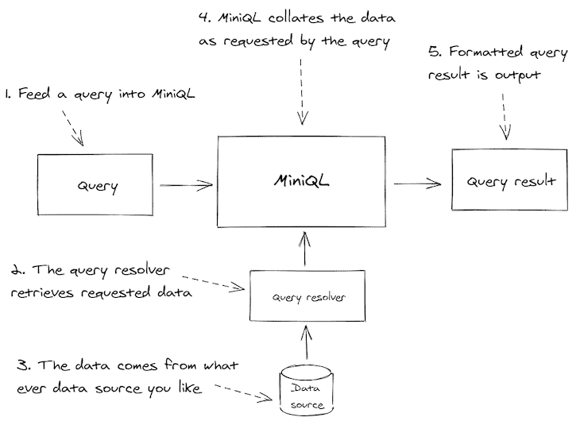

# MiniQL:在 TypeScript - LogRocket 博客中构建查询语言

> 原文：<https://blog.logrocket.com/miniql-building-query-language-typescript/>

重新发明轮子意味着重建以前已经建成的东西。它的内涵通常是负面的——也就是说，重新发明一样东西是毫无意义的，也是浪费时间，因为有人已经做过了。

总的来说，这是一个很好的警告。你应该小心你投入时间和精力的地方。但我最近有了再造一个流行技术的经历。

我基本上重建了 GraphQL。

在这篇博文中，我想向您介绍我的新开源项目 MiniQL。我们还将讨论为什么我要重新发明轮子，以及什么时候可以这样做。

### 直接去

想看看 MiniQL 吗？想看看它然后再回到这篇博文吗？点击查看[交互示例。你可以在 GitHub](https://miniql.github.io/miniql-interactive-example/) 上找到 MiniQL 的[代码。](https://github.com/miniql/miniql)

## 为什么选择 MiniQL？

我真的很想用 GraphQL。我以前在其他公司工作的时候用过。但不幸的是，它并不完全符合我的初创公司的需求(稍后会有更多内容)，所以我无法使用它。

我花了几个月的时间希望能将 GraphQL 集成到我们的项目中。我知道它会简化很多事情，并创建一个内聚的数据模型，但我就是做不到。

有一段时间，这个想法酝酿着，如果我可以复制 GraphQL 的一些部分，我就可以得到我需要的东西。MiniQL 的概念正在形成。

## GraphQL 是什么？

[GraphQL](https://graphql.org/) ，如果你还没听说过的话，是一种描述、查询和操作你的数据的语言和运行时。它非常受欢迎，而且是开源的，是由脸书发明的。

GraphQL 不依赖于任何特定的数据库或数据格式，它在许多编程语言中都得到支持。GraphQL 很棒，你可以[在这里](https://blog.logrocket.com/tag/graphql/)了解更多。

## GraphQL 怎么了？

如果 GraphQL 真的这么棒，那我为什么不用它呢？

嗯，GraphQL 肯定是有时间和地点的。我看到它在生产中工作得非常好。但是对我的创业公司没用。

主要问题是需要创建一个数据模式。我们还没有，我也不想创造一个。我们是一家初创公司，正在迅速尝试改进我们的产品，并找到合适的市场。在产品的快速发展过程中使用模式会产生大量的无用功。

模式需要不断更新以保持其相关性，更不用说持续的数据迁移以使数据与模式保持一致，以及为不同的环境管理不同的模式。首先创建模式(跨我们 20 多岁的微服务)本身就是一项令人生畏的工作。

所以我们说没有，因为有一个模式——它与我们快速的开发步调背道而驰。

还有其他问题。GraphQL 为我们的技术组合增加了一种额外的语言。这意味着我们的开发人员需要额外的培训，我们的堆栈也更加复杂。集成和实现 GraphQL 所花的时间最好花在为我们的客户添加特性上。

此外，这是一件相对较小的事情，但我发现我必须指定要返回的数据中的所有字段，这真的很繁琐。我知道在 GraphQL 中，这是一种优化，以最小化返回到前端的数据。这对优化来说很好，但对数据探索来说真的很糟糕。

有时候我只是想探索数据，看看这一切。或者，也许我只是需要在 MVP 或原型中快速完成一些事情，我想不加思考地获得所有数据。当然，我以后需要做优化，但现在我只想快速简单的路线。

为什么我不能两全其美呢？在某些情况下，我希望检索我的所有数据；在其他情况下，我希望检索一个最优或最小化的数据集。对于我的创业公司来说，GraphQL 的门槛比它提供的价值要高。

## 为什么要重新发明轮子？

尽管重新发明轮子经常被视为贬义词，但实际上在某些场合它是件好事。

* * *

### 更多来自 LogRocket 的精彩文章:

* * *

首先，考虑一下这个:如果没有人重新发明任何东西，我们就不会有更好的东西。

我们都将受困于相同的陈旧编程语言、数据库和框架。重新发明对于创新和进化是必要的——有时甚至对于革命也是必要的。

但遗憾的是，我们只能后知后觉地看到这一点。只有当改造成功时(记住他们通常不成功)，你才会受到表扬。在那之前，你肯定会受到批评。走向成功意味着超越那些告诉你不要重新发明轮子的人。

以下是一些重新发明轮子的正当理由:

*   现有的轮子不能按你想要的方式工作
*   你需要一个更好的轮子
*   为了娱乐或教育

我创建 MiniQL 是因为 GraphQL 没有按照我想要的方式工作。

就个人而言，我不认为我能做出比 GraphQL 更好的东西；这已经很好了，要做得更好需要一个团队和资源，而我们没有。所以那不是我的动机。但这是一个彻底改造某样东西的绝佳理由——因为你想要一个更好的版本。

当然，为了娱乐或教育而重新发明东西也是完全可以的，这是作为一名开发人员学习新事物和获得经验的极好方式。

只是要小心不要陷得太深以至于溺水。重建尖端技术绝非易事。这可能非常困难，而且往往不会成功。

MiniQL 就不是这样了。这已经很成功了——至少对我的初创公司来说是这样。它在做它该做的事。

MiniQL 小巧而简单。我是故意这样做的，我知道这是可以实现的。只取我们需要的 GraphQL 的一部分(根据我们的特定用例定制),并简单地丢弃 GraphQL 中那些太麻烦或我们不需要的部分。

如果你发现自己陷得太深，请随时放下你的项目。当为了爱好或教育而编码时，只要你已经找到了乐趣或学到了有用的东西，就停止编码。

开始一个项目，发现它非常困难，然后放弃它是完全可以的。只要确保你得到了回报，无论是乐趣、学习、投资组合的收获，还是其他结果。

但是请不要在工作时间去做不必要的事情！如果你打算在工作中这样做，你最好有一个好的理由和你经理的支持——否则，事情会变得尴尬。

## MiniQL 简介

2020 年的大部分时间里，MiniQL(后来被称为 MiniQL)一直在我的脑海中酝酿。我知道我需要某种方法来简化我的创业公司的数据管理和检索。然后有一个周末，我坐下来开始编码。

MiniQL 诞生于一个周末。它是用 TypeScript 开发的，可以在 JavaScript 和 TypeScript 中使用。我对它将如何工作有了一个很好的想法(在思考了几个月并做了大量笔记之后)。我优先考虑的是保持它的小规模和可管理性。我从一开始就使用测试驱动开发(TDD)。

MiniQL 需要另一个周末来充实特性集并稳定核心逻辑。核心查询引擎完成得相当快，从那以后，在我开发插件、示例和文档时，它断断续续地进行。有趣的是，我现在花在示例和文档上的时间比花在核心查询引擎上的时间多得多。

代码非常抽象，尽管通过 TDD 的迭代开发很简单。在每一个阶段，我都添加了新特性或者进行了重构，但是在任何时候我都没有让任何错误进入画面。这就是 TDD 的工作方式:它给你的项目增加了一个脚手架，在你编码的时候支持和保护你。

TDD 确实支持代码的抽象性质，这使得它难以阅读。抽象的代码也使得解释起来很困难，因此需要例子和文档。

你可以在 GitHub 上找到 MiniQL 查询引擎[。要快速、交互式地了解 MiniQL，请参见这里的](https://github.com/miniql/miniql)[交互式示例](https://miniql.github.io/miniql-interactive-example/)。

如果您是开发新手，并且希望看到 TDD 如何运行的例子，这是一个很好的项目。你可以穿越时空，一个接一个地回放这个项目的历史，看看它是如何随着时间的推移而建立起来的(事实上，我制作了一个关于最初几个小时开发的[延时视频](https://youtu.be/4nBvSi2bVWY))。

通过依次获得每个提交并运行测试来查看添加了哪些测试以及它们是如何运行代码的，您可以随意地完成它。这是感受测试驱动开发的一次又一次迭代本质的好方法。

### 简而言之，MiniQL

下面的图 1 简洁地描述了 MiniQL。

我们对 MiniQL ( *1* )执行 JSON 查询。用户定义的查询解析器负责从我们使用的任何数据库或数据源中检索数据( *2* )。解析器是[适配器模式](https://en.wikipedia.org/wiki/Adapter_pattern)的一个实现——它使我们选择的数据源适应 MiniQL。

然后，MiniQL 按照查询请求组织检索到的数据( *4* )，并返回一个包含请求数据的格式化 JSON 文档( *5* )。



Figure 1: MiniQL in a nutshell.

#### 目的

MiniQL 的目标是小巧，但非常灵活。

首先，我们希望能够轻松地创建和执行查询。必须能够通过网络发送查询和接收结果。这就是为什么查询和结果都用 JSON 格式表示。

JSON 在许多技术栈中已经很常见了，所以这意味着我们没有引入任何新的语言。这还意味着查询和结果都很容易序列化，如果您需要实现缓存，这是非常好的。

为 MiniQL 实现查询解析器也必须很容易。我们希望能够轻松地插入任何我们想要执行查询的自定义数据库或数据格式。事实上，MiniQL 已经实现了许多预构建的解析器，更多解析器即将推出([参见 GitHub 页面](https://github.com/miniql/miniql)获取示例链接)。但是创建自己的查询解析器并不困难。

MiniQL 将特性委托给查询解析器。将特性委托给解析器也意味着我们可以利用特定数据库提供的任何特殊特性。

MiniQL 的主要驱动力之一是简化我的创业公司产品中的 REST API 的需要。我不希望 REST API 中有数百个端点，而是希望只有几个。

MiniQL 允许多种类型的查询和更新操作通过单个端点进行路由。这意味着我们可以大大减少应用程序所需的端点数量。它还使我们的代码更简单，并为我们提供了一个应用身份验证和其他安全措施的单一位置。

我们还希望能够将优化的或最少的数据检索到前端(就像 GraphQL 一样)，但是除此之外，只要我们需要这种能力，就能够检索所有数据是有意义的。获取所有数据对于探索我们的数据或者在我们不需要或者不想优化结果的时候(比如说，当我们正在构建一个 MVP 的原型时)是有好处的。

最后，但非常重要的是，MiniQL 不会对我们的数据强加不必要的结构或规则。MiniQL 没有任何内置的模式概念。

当然，这并不意味着我们不能制定自己的规则或结构。就我个人而言，我喜欢使用 TypeScript 对我的数据进行静态类型化。如果您想在 MiniQL 之上构建一个模式，您可以很容易地使用 [JSON 模式](https://json-schema.org/)。你可以在[的查询编辑器中看到一个例子，交互例子](https://github.com/miniql/miniql-interactive-example)。

## MiniQL 查询

MiniQL 的核心是检索和更新数据存储中的实体。我们可以检索单个实体、所有实体，或者搜索一组实体。我们也可以解析嵌套的实体。通过简单的组合，我们在如何构造查询结果方面获得了很大的灵活性。在这篇博文中，我只展示了如何从我们的数据源中检索实体。在以后的博文中，我将展示如何更新实体。

让我们看一些简单的例子，从星球大战宇宙数据集中检索实体(感谢 [Kaggle](https://www.kaggle.com/jsphyg/star-wars/data) 提供数据)。

### 抓住达斯·维德

清单 1 中的查询显示了如何检索单个实体的记录:Darth Vader。

MiniQL 查询是用 JSON 编写的，但是对于这些例子(以及在[交互式例子](https://miniql.github.io/miniql-interactive-example/)中)，我将使用 [JSON5](https://miniql.github.io/miniql-interactive-example/) 进行演示，这是一个更人性化的 JSON 版本，支持注释。

注意我们如何使用`args`字段来设置要检索的实体的名称。`args`的含义完全取决于查询解析器。所以你需要传入什么，取决于分解器。在这种情况下，我们基于 CSV 文件中的 name 列来查找记录，这就是为什么我们将查询中的`name`字段设置为`"Darth Vader"`。

#### *清单 1:获取单个实体*

```
{
  "get": {
    "character": { // Gets the character entity.
      "args": {        
        "name": "Darth Vader" // Gets Darth Vader by name.
      }
    }
  }
}

```

#### *清单 1 查询结果*

```
{
  "character": {
    "name": "Darth Vader", // Got Darth Vader.
    "height": 202,
    "mass": 136,
    "hair_color": "none",
    "skin_color": "white",
    "eye_color": "yellow",
    "birth_year": "41.9BBY",
    "gender": "male",
    "homeworld": "Tatooine",
    "species": "Human"
  }
}

```

### 获取所有字符

清单 2 中的查询显示了如何从*星球大战*宇宙中获取所有角色。请注意，我们将`args`字段留空。不指定参数来匹配任何特定的字符向查询解析器表明我们想要获取所有的字符而不是特定的字符。

#### *清单 2:获取所有实体*

```
{
  "get": {
    "character": { // Gets the character entity.
      "args": {
        // No args, gets all characters.
      }
    }
  }
}

```

#### *清单 2 查询结果*

```
{
  "character": [ // Got all Star Wars characters.
    {
      "name": "Luke Skywalker",
      "height": 172,
      "mass": 77,
      "hair_color": "blond",
      "skin_color": "fair",
      "eye_color": "blue",
      "birth_year": "19BBY",
      "gender": "male",
      "homeworld": "Tatooine",
      "species": "Human"
    },
    {
      "name": "C-3PO",
      "height": 167,
      "mass": 75,
      "hair_color": "NA",
      "skin_color": "gold",
      "eye_color": "yellow",
      "birth_year": "112BBY",
      "gender": "NA",
      "homeworld": "Tatooine",
      "species": "Droid"
    },
    // ... and so on
  ]
}

```

### 获取嵌套实体

MiniQL 支持检索相关实体并将结果嵌套在输出中。

清单 3 中的查询显示了如何获取角色 Darth Vader，并以嵌套实体的形式检索他的家乡的详细信息。请注意,`resolve`字段是如何用来指定我们也想解析维德家乡的细节的。

#### *清单 3:获取嵌套实体*

```
{
  "get": {
    "character": {
      "args": {
        "name": "Darth Vader" // Gets Darth Vader.
      },
      "resolve": {
        "homeworld": { // Gets Darth Vader's homeworld.
        }
      }
    }
  }
}

```

#### *清单 3 查询结果*

```
{
  "character": {
    "name": "Darth Vader", // Got Darth Vader.
    "height": 202,
    "mass": 136,
    "hair_color": "none",
    "skin_color": "white",
    "eye_color": "yellow",
    "birth_year": "41.9BBY",
    "gender": "male",
    "homeworld": { // Got Darth Vader's homeworld.
      "name": "Tatooine",
      "rotation_period": 23,
      "orbital_period": 304,
      "diameter": 10465,
      "climate": "arid",
      "gravity": "1 standard",
      "terrain": "desert",
      "surface_water": 1,
      "population": 200000
    },
    "species": "Human"
  }
}

```

## 创建查询解析程序

现在我们可以进行一些基本的查询，是时候学习如何创建查询解析器了。有各种各样的 MiniQL 插件可以为某些类型的数据源实现查询解析器，但是真正实现它的目标，用 MiniQL 为自己创建一个是非常容易的。

下面的例子基于使用 MongoDB 作为数据源，但是对于您的实现，您可以使用任何其他您喜欢的数据库或数据格式。

### 字符实体的查询解析器

清单 4 中的查询解析器显示了前一个示例中使用的`character`实体的简单解析器。请注意如何使用一个解析器来获取单个字符或所有字符，这取决于查询参数中是否提供了一个`name`字段。

整个 arguments 对象直接通过解析器传递，因此我们的解析器实际上可以访问查询传递的任何参数。这提供了一种将自定义参数传递给解析器的方法，可以以任何您可以想象的方式使用该方法。

如您所见，查询解析器是支持异步的。`invoke`函数是异步的，允许从数据库、文件、REST APIs 或任何您想获取数据的地方进行异步数据检索。

#### *清单 4:一个针对*星球大战*人物*的查询解析器

```
const characterCollection = // ... A MongoDB collection.

const queryResolver = {
  get: { // Resolver for "get" operations.
    character: { // Resolver for the character entity.
      invoke: async (args, context) => { // Function to get characters.
        if (args.name !== undefined) {
          // Gets a single character.
          const character = await characterCollection.findOne({ name: name });
          return character;
        }
        else {
          // Gets all characters.
          const characters = await characterCollection.find().toArray()
          return characters;
        }
      },
    },
  },
};

```

### 多种实体类型

通过向查询解析器添加更多的字段，我们可以轻松地支持多种实体类型。在清单 5 中可以看到，我们向解析器添加了一个新的`species`实体。

#### *清单 5:多种实体类型的查询解析器*

```
const queryResolver = {
  get: {
    character: { // Resolver for the character entity.
      invoke: async (args, context) => { 
        // ... Gets Star Wars characters.
      },
    },

    species: { // Resolver for the species entity.
      invoke: async (args, context) => { 
        // ... Gets Star Wars species.
      },
    },
  },
};

```

## 嵌套实体

我们可以通过将实体放在父实体的`nested`字段下来支持实体。例如，在清单 6 中，我们在`character`实体解析器下嵌套了`homeworld`实体解析器。

#### *清单 6:嵌套实体* 的查询解析器

```
const queryResolver = {
  get: {
    character: {
      invoke: async (args, context) => { 
        // ... Gets Star Wars characters.
      },

      nested: {
          homeworld: { // Gets the homeworld for the character.
            invoke: async (args, context) => { 
                // ... Gets a Star Wars planet.
            },
          },
      },
    },
};

```

### MiniQL 委托给查询解析器

MiniQL 将有关实体检索的所有细节委托给查询解析器。实体查询的`args`字段中提供的任何内容都被传递给解析器。这意味着您可以实现任何您喜欢的查询功能，例如基于文本的实体搜索或显示特定数据库的特殊功能。

作为一个例子，清单 7 展示了我们如何在查询解析器中实现分页。注意这段代码如何期望通过查询参数提供`skip`和`limit`字段。MiniQL 不知道也不关心这些特定的字段；它们只与我们如何实现查询解析器相关。

在这个例子中，`skip`和`limit`的值被传递给 MongoDB 驱动程序，以对所有字符集进行分页。

#### *清单 7:实现分页的查询解析器*

```
const queryResolver = {
  get: {
    character: {
      invoke: async (args, context) => {
        if (args.name !== undefined) {
          // Gets a single character.
          const character = await characterCollection.findOne({ name: name });
          return character;
        }
        else {
          // Gets all characters.
          const characters = await characterCollection.find()
            .skip(args.skip)    // Skips a number of records.
            .limit(args.limit)  // Limits the number of records returned.
            .toArray()
          return characters;
        }
      },
    },
  },
};

```

## 结论

MiniQL 是一种小巧但功能强大的基于 JSON 的查询语言，灵感来自 GraphQL。它旨在复制 GraphQL 中我离不开的部分，并丢弃我认为无关、乏味或不必要的部分。

MiniQL 是在 TypeScript 中实现的，以便在 JavaScript 或 TypeScript 中使用，但是没有理由它不能在其他编程语言中实现。MiniQL 的输入和输出是 JSON，所以 MiniQL 查询语言本质上是与编程语言无关的。

如果你想实现不同的语言，请在 Twitter 上给我发一个 [DM 让我知道。](https://twitter.com/ashleydavis75)

喜欢 MiniQL 的想法？请[在回购协议](https://github.com/miniql/miniql)上打个星号，[跟我来](https://twitter.com/ashleydavis75)了解最新消息。

重新发明轮子通常被认为是一件坏事。但它可能是有用的，有时是进步所必需的。我们也可能只是为了乐趣或教育而做，但要意识到你做这件事的原因以及你从中获得的价值。如果一个“改造”项目变得太困难，不要害怕放弃它。如果你得到了一些乐趣或者学到了一些东西，那是一个好的结果——即使你没有完成它。

实际上完成项目是一项艰苦的工作。为了有最好的机会完成一个项目，保持你的关注点狭窄。那会给你最好的机会完成它。

如果你是为了娱乐或教育而重新发明一些东西，不要在工作时间做！我不希望你在工作中给自己带来任何麻烦。如果你必须为工作重新发明一些东西，在你开始之前确保你的经理同意。

在重新发明任何技术之前，请考虑以下事项…

## 我该重新发明 *X* 吗？

| **考虑事项** | 我是否应该重塑 *X* ？ |
| X 几乎做到了我想要的，而且是开源的。 | No, it’s better to contribute to *X*.叉自己的副本，改做自己想做的。提交一个 pull 请求，将您的更改集成到 *X* 中。 |
| 我喜欢 X 中的一些想法，但不喜欢其他的。 | 也许——考虑重新发明一个更小版本的 *X* ,只做你需要的事情。 |
| 我想我可以造出更好的 *X* 。 | Maybe, but even though you can conceive of this, you might find it very difficult to achieve, especially if *X* is a technology created by a team of developers.一个单独的开发者很难与之竞争。 |
| 我可以通过建立一个新的 *X* 来学习。 | Yes, but only to a point.作为一名开发人员，重新发明东西是学习和获得经验的好方法。当你有动力的时候，当你在学习的时候，努力去做吧。一旦学习完了，感觉像是艰苦的工作，随时可以放弃。 |
| 我认为重建 *X.* 会很有趣 | Yes, but only to a point.编码是有趣的，重新发明东西也是令人愉快的。只是不要沉迷于此。注意你对这个项目的感受。一旦不再有趣，就放弃它。 |

## [LogRocket](https://lp.logrocket.com/blg/typescript-signup) :全面了解您的网络和移动应用

[](https://lp.logrocket.com/blg/typescript-signup)

LogRocket 是一个前端应用程序监控解决方案，可以让您回放问题，就像问题发生在您自己的浏览器中一样。LogRocket 不需要猜测错误发生的原因，也不需要向用户询问截图和日志转储，而是让您重放会话以快速了解哪里出错了。它可以与任何应用程序完美配合，不管是什么框架，并且有插件可以记录来自 Redux、Vuex 和@ngrx/store 的额外上下文。

除了记录 Redux 操作和状态，LogRocket 还记录控制台日志、JavaScript 错误、堆栈跟踪、带有头+正文的网络请求/响应、浏览器元数据和自定义日志。它还使用 DOM 来记录页面上的 HTML 和 CSS，甚至为最复杂的单页面和移动应用程序重新创建像素级完美视频。

## 监控生产中失败和缓慢的 GraphQL 请求

虽然 GraphQL 有一些调试请求和响应的特性，但确保 GraphQL 可靠地为您的生产应用程序提供资源是一件比较困难的事情。如果您对确保对后端或第三方服务的网络请求成功感兴趣，

[try LogRocket](https://lp.logrocket.com/blg/graphql-signup)

.

[](https://lp.logrocket.com/blg/graphql-signup)[https://logrocket.com/signup/](https://lp.logrocket.com/blg/graphql-signup)

LogRocket 就像是网络和移动应用的 DVR，记录下你网站上发生的每一件事。您可以汇总并报告有问题的 GraphQL 请求，以快速了解根本原因，而不是猜测问题发生的原因。此外，您可以跟踪 Apollo 客户机状态并检查 GraphQL 查询的键值对。

LogRocket 检测您的应用程序以记录基线性能计时，如页面加载时间、到达第一个字节的时间、慢速网络请求，还记录 Redux、NgRx 和 Vuex 操作/状态。

[Start monitoring for free](https://lp.logrocket.com/blg/graphql-signup)

.

[Try it for free](https://lp.logrocket.com/blg/typescript-signup)

.