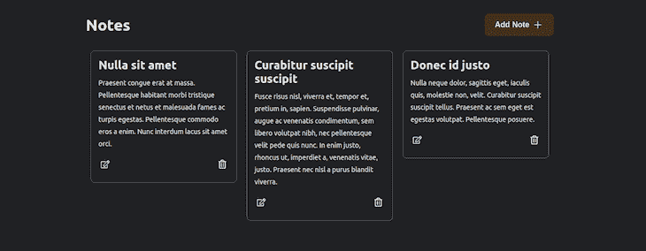

# Mirage JS 教程:在 React - LogRocket 博客中模仿 API

> 原文：<https://blog.logrocket.com/mirage-js-tutorial-mocking-apis-in-react/>

通常，当构建与后端接口的应用程序时，您必须等待来自后端的活动数据可用才能继续开发。这可能导致生产率降低和周转时间变慢。模拟 API 使您能够构建应用程序的前端，而不必依赖来自后端的数据。

在这个 [Mirage JS](https://miragejs.com/) 教程中，我们将向您展示如何构建一个模拟 API。我们将详细介绍以下内容:

要学习本教程，您应该具备:

*   [JavaScript/ES6 的知识](https://blog.logrocket.com/es6-keyed-collections-maps-and-sets/)
*   使用 [React](https://reactjs.org/) 的体验
*   [节点](https://nodejs.org/) [。js](https://nodejs.org/) v10 或更高
*   npm v5.2 或更高版本
*   代码编辑器和终端的选择
*   什么是幻影 JS？

## [Mirage JS](https://miragejs.com/) 是一个 JavaScript 库，它允许您模拟可用于构建、测试和共享全栈 JavaScript 应用程序的 API。幻影 JS 的独特之处在于它能够重现动态场景。其他模拟 API 服务器，如 [JSON 服务器](https://github.com/typicode/json-server)和 [MSW](https://github.com/mswjs/msw) ，本质上是相当静态的。

Mirage JS 通过拦截您的 JavaScript 应用程序发出的网络请求来工作。它允许您模拟响应，这使您能够开发和测试您的应用程序，就像您正在与一个活动的服务器交互一样。

Mirage JS 的其他显著特性包括:

处理 [HTTP 请求的路由](https://blog.logrocket.com/5-ways-to-make-http-requests-in-node-js/)

*   用于存储数据和处理关系的数据库和模型
*   用于序列化数据的工厂和设备
*   用于格式化 HTTP 响应的序列化程序
*   Mirage JS 示例

## 为了展示如何使用 Mirage JS 模拟 API，我们将使用 [Create React App](https://create-react-app.dev/docs/getting-started/) 创建一个 notes 应用程序，这允许我们引导我们的项目，而不用担心手动配置 React 应用程序的复杂性。

打开一个终端并运行下面的命令来创建一个新的 React 应用程序:

命令成功执行后，它会初始化一个名为`notes`的 React 应用程序。通过运行以下命令导航到根目录:

```
npx create-react-app notes

```

进入根目录后，运行以下命令:

```
cd notes

```

这个命令启动 React 应用程序的开发服务器。

```
npm start

```

设置 Mirage JS

## 在我们开始模拟应用程序所需的 API 之前，运行以下命令将 Mirage JS 添加到项目中:

成功安装 Mirage JS 库后，导航到`src`目录并创建一个名为`server.js`的文件:

```
# Using npm
npm install --save-dev miragejs

# Using Yarn
yarn add --dev miragejs

```

在您选择的编辑器中打开`server.js`文件，并粘贴以下代码:

```
cd src
touch server.js

```

`createServer`函数负责创建一个新的模拟服务器实例。转到根目录中的`index.js`文件，将其重构为如下所示的代码:

```
import { createServer } from 'miragejs';
export function makeServer() {
  let server = createServer();
  return server;
}

```

在重构后的`index.js`文件中，我们导入了在`server.js`文件中创建的`makeServer`函数并运行它:`makeServer({ environment: 'development' })`注意一个`{ environment: 'development' }`参数被传递给了`makeServer`函数；这允许我们在开发环境中运行种子，我们将在后面讨论。

```
import React from 'react';
import ReactDOM from 'react-dom';
import './index.css';
import App from './components/App';
import { makeServer } from './server';

if (process.env.NODE_ENV === 'development') {
  makeServer({ environment: 'development' });
} 
ReactDOM.render(
  <React.StrictMode>
    <App />
  </React.StrictMode>,
  document.getElementById('root')
);

```

保存和播种数据

## 我们希望我们的应用程序像一个真正的服务器一样存储数据，并加载一些现有的数据(种子)。我们将使用名为`Model`的 Mirage JS 数据层，在其“内存”数据库中为我们的应用程序创建一个 notes 集合。

打开`server.js`文件，用以下代码替换现有代码:

`createServer`功能中的`environment`选项允许我们在`development`和`test`之间进行选择。如果环境设置为`development`，Mirage JS 将加载种子并将其所有响应记录到控制台。我们已经通过`makeServer`默认参数`{ environment = 'test' } = {}`将环境设置为默认测试，以便在每次需要运行测试时运行一个没有种子的服务器的新实例。我们还在`createServer`函数的`models`属性中定义了一个名为`notes`的集合。

```
import { createServer, Model } from 'miragejs';
export function makeServer({ environment = 'test' } = {}) {
  let server = createServer({
    environment,
    models: {
      notes: Model,
    },
    seeds(server) {
      server.create('note', {
        title: 'Nulla sit amet',
        body:
          'Praesent congue erat at massa. Pellentesque habitant morbi tristique senectus et netus et malesuada fames ac turpis egestas. Pellentesque commodo eros a enim. Nunc interdum lacus sit amet orci.',
      });
      server.create('note', {
        title: 'Curabitur suscipit suscipit',
        body:
          'Fusce risus nisl, viverra et, tempor et, pretium in, sapien. Suspendisse pulvinar, augue ac venenatis condimentum, sem libero volutpat nibh, nec pellentesque velit pede quis nunc. In enim justo, rhoncus ut, imperdiet a, venenatis vitae, justo. Praesent nec nisl a purus blandit viverra.',
      });
      server.create('note', {
        title: 'Donec id justo',
        body:
          'Nulla neque dolor, sagittis eget, iaculis quis, molestie non, velit. Curabitur suscipit suscipit tellus. Praesent ac sem eget est egestas volutpat. Pellentesque posuere.',
      });
    }
  return server;
}

```

如前所述，种子使我们能够创建初始数据。`server.create`函数允许我们在我们定义的`notes`模型中创建新的笔记记录。id 会自动分配给创建的种子。

创建路线

## 既然我们已经成功设置了一个带有数据库和初始种子的 Mirage JS 服务器，下一步就是创建路由。我们的 notes 应用程序需要以下路径:

获取`/api/notes`以获取所有笔记记录

*   获取`/api/notes/:id`以获取单个笔记记录
*   POST `/api/notes`创建新的笔记记录
*   修补`/api/notes/:id`以更新现有的注释记录
*   删除`/api/notes/:id`以删除现有的注释记录
*   打开`server.js`文件，用以下代码替换现有代码:

这个`routes`钩子是我们的应用程序将被定义的路径。`this.namespace = 'api/notes'`允许我们定义 API 名称空间，这样我们就不必在应用程序的所有路径中重复使用，例如`/api/notes/:id`。`this.get`、`this.post`、`this.patch`和`this.delete`允许我们模拟各种网络请求。`schema`参数用于从我们之前创建的`notes`模型中访问数据，而`request`参数用于从我们的应用程序中获取数据。

```
import { createServer, Model } from 'miragejs';
export function makeServer({ environment = 'test' } = {}) {
  let server = createServer({
    environment,
    models: {
      notes: Model,
    },
    seeds(server) {
      server.create('note', {
        title: 'Nulla sit amet',
        body:
          'Praesent congue erat at massa. Pellentesque habitant morbi tristique senectus et netus et malesuada fames ac turpis egestas. Pellentesque commodo eros a enim. Nunc interdum lacus sit amet orci.',
      });
      server.create('note', {
        title: 'Curabitur suscipit suscipit',
        body:
          'Fusce risus nisl, viverra et, tempor et, pretium in, sapien. Suspendisse pulvinar, augue ac venenatis condimentum, sem libero volutpat nibh, nec pellentesque velit pede quis nunc. In enim justo, rhoncus ut, imperdiet a, venenatis vitae, justo. Praesent nec nisl a purus blandit viverra.',
      });
      server.create('note', {
        title: 'Donec id justo',
        body:
          'Nulla neque dolor, sagittis eget, iaculis quis, molestie non, velit. Curabitur suscipit suscipit tellus. Praesent ac sem eget est egestas volutpat. Pellentesque posuere.',
      });
    },
    routes() {
      this.namespace = 'api/notes';
      this.get('/', (schema, request) => {
        return schema.notes.all();
      });
      this.get('/:id', (schema, request) => {
        let id = request.params.id;
        return schema.notes.find(id);
      });
      this.post('/', (schema, request) => {
        let attrs = JSON.parse(request.requestBody);
        return schema.notes.create(attrs);
      });
      this.patch('/:id', (schema, request) => {
        let newAttrs = JSON.parse(request.requestBody);
        let id = request.params.id;
        let note = schema.notes.find(id);
        return note.update(newAttrs);
      });
      this.delete('/:id', (schema, request) => {
        let id = request.params.id;
        return schema.notes.find(id).destroy();
      });
    },
  });
  return server;
}

```

设置前端

## 至此，我们已经完成了对服务器的模拟，并创建了模拟 API。下一步是构建一个前端来访问我们创建的模拟 API。

打开终端并导航到根目录。粘贴下面的代码来安装我们将用来在 React 应用程序中显示图标和 toast 消息的库:

在`src`目录下创建一个名为`components`的文件夹。这个文件夹将存放我们将在应用程序中使用的组件。

```
npm install react-icons react-toastify

```

打开`index.css`文件并粘贴以下代码:

这个文件包含我们将在应用程序中使用的样式。

```
*,
*::before,
*::after {
margin: 0;
padding: 0;
box-sizing: border-box;
}
html {
font-size: 62.5%;
scroll-behavior: smooth;
}
body {
font-family: -apple-system, BlinkMacSystemFont, 'Segoe UI', 'Roboto', 'Oxygen',
'Ubuntu', 'Cantarell', 'Fira Sans', 'Droid Sans', 'Helvetica Neue',
sans-serif;
background-color: #202124;
font-size: 1.6rem;
color: #e8eaed;
}
.container {
padding: 2rem;
max-width: 100rem;
margin: 0 auto;
}
.header {
display: flex;
flex-direction: row;
justify-content: space-between;
align-items: center;
padding: 2rem 0;
}
.btn {
background-color: #41331c;
padding: 1rem 2rem;
color: #e8eaed;
font-size: 1.6rem;
border: 1px solid #41331c;
border-radius: 8px;
cursor: pointer;
font-weight: 700;
display: flex;
justify-content: center;
align-items: center;
transition: all 0.5s;
}
.btn:hover,
.toolbox__btn:hover {
background-color: #b38b4d;
}
.btn__icon {
margin-left: 5px;
}
.notes-container {
display: flex;
flex-direction: row;
align-items: flex-start;
flex-wrap: wrap;
}
.notes-item {
margin: 1rem;
padding: 1.5rem;
border: 1px solid #5f6368;
border-radius: 8px;
color: #e8eaed;
width: 100%;
min-height: 6rem;
cursor: pointer;
}
.notes-item h2 {
margin-bottom: 1rem;
}
.notes-item p {
line-height: 2.5rem;
font-size: 1.4rem;
}
.toolbox {
display: flex;
flex-direction: row;
justify-content: space-between;
align-items: center;
padding: 5px 0;
margin-top: 1rem;
}
.toolbox__btn {
padding: 5px;
border-radius: 50%;
background-color: transparent;
border: 0;
cursor: pointer;
}
.showModal {
display: block;
}
.hideModal {
display: none;
}
.modal {
position: fixed;
z-index: 1;
left: 0;
top: 0;
width: 100%;
height: 100%;
overflow: auto;
background-color: #202124;
padding: 4rem;
}
.go-back-container {
width: 50%;
}
.go-back {
background-color: transparent;
font-size: 1.6rem;
display: flex;
justify-content: center;
align-items: center;
transition: all 0.5s;
color: #e8eaed;
border: 0;
cursor: pointer;
font-weight: 700;
padding: 1rem 0;
}
.go-back span {
margin-left: 1rem;
}
.modal-form {
background-color: transparent;
width: 100%;
margin: 2rem auto;
}
.modal-form-input {
display: block;
margin: 2rem 0;
padding: 1rem;
font-size: 1.8rem;
border: 2px solid #5f6368;
color: #e8eaed;
background-color: #202124;
width: 100%;
border-radius: 8px;
}
@media (min-width: 768px) {
.modal-form {
width: 50%;
}
.notes-item {
max-width: 30rem;
}
}
```

导航到我们创建的`components`目录，并创建一个名为`NoteItem.js`的文件。打开文件并粘贴下面的代码:

该文件是我们将在笔记列表中使用的单个笔记项的 react 组件。导航回`components`目录并创建另一个名为`NotesList.js`的文件，这个文件将包含一个`NoteItems.js`组件的列表。打开文件并粘贴下面的代码

```
import React from 'react';
import { FaRegEdit, FaRegTrashAlt } from 'react-icons/fa';
const NotesItem = ({ note, getNote, deleteNote }) => {
  return (
    <div className="notes-item" onClick={() => getNote(note.id)}>
      <h2 className="notes-item__title">{note.title}</h2>
      <p>{note.body}</p>
      <div className="toolbox">
        <button className="toolbox__btn" onClick={() => getNote(note.id)}>
          <FaRegEdit color="#e8eaed" size={18} />
        </button>
        <button className="toolbox__btn" onClick={() => deleteNote(note.id)}>
          <FaRegTrashAlt color="#e8eaed" size={18} />
        </button>
      </div>
    </div>
  );
};
export default NotesItem;

```

我们现在有了一个用于注释项的组件和另一个用于注释项列表的组件，现在在`components`目录中创建一个`Form.js`文件，用于添加和更新注释。创建文件后，将下面的代码粘贴到创建的文件中

```
import React from 'react';
import NotesItem from './NotesItem';
const NotesList = ({ notes, getNote, setToggle, deleteNote }) => {
  return (
    <div className="notes-container">
      {notes &&
        notes.map((note) => (
          <NotesItem
            key={note.id}
            note={note}
            getNote={getNote}
            toggleModal={setToggle}
            deleteNote={deleteNote}
          />
        ))}
    </div>
  );
};
export default NotesList;

```

将`App.js`文件移动到`components`目录，并用以下代码替换其中的代码:

```
import React, { useEffect } from 'react';
import { FaArrowCircleLeft } from 'react-icons/fa';
const Form = ({
  showModal,
  toggleModal,
  note,
  addNote,
  updateNote,
  inputs,
  setInputs,
}) => {
  useEffect(() => {
    if (note) {
      setInputs({ title: note.title, body: note.body });
    }
  }, [note, setInputs]);
  const handleSubmit = (event) => {
    event.preventDefault();
    const { title, body } = inputs;
    if (!note.id) {
      addNote(title, body);
      return;
    }
    updateNote(note.id, title, body);
  };
  const handleChange = (event) => {
    event.persist();
    setInputs((inputs) => ({
      ...inputs,
      [event.target.name]: event.target.value,
    }));
  };
  return (
    <div className={`modal ${showModal ? 'showModal' : 'hideModal'}`}>
      <div className="go-back-container">
        <button className="go-back" onClick={() => toggleModal(false)}>
          <FaArrowCircleLeft
            size={32}
            color="#41331c"
            onClick={() => toggleModal(false)}
          />
          <span>Go Back</span>
        </button>
      </div>
      <form className="modal-form" onSubmit={handleSubmit}>
        <input
          type="text"
          className="modal-form-input"
          value={inputs.title}
          onChange={handleChange}
          placeholder="Title"
          name="title"
          required
        />
        <textarea
          rows="10"
          className="modal-form-input"
          value={inputs.body}
          placeholder="Start typing ...."
          onChange={handleChange}
          name="body"
          required
        />
        <button type="submit" className="btn" onClick={handleSubmit}>
          {note.id ? 'Update Note' : 'Add Note'}
        </button>
      </form>
    </div>
  );
};
export default Form;

```

`App.js`文件集合了我们创建的所有组件。我们还定义了向我们创建的模拟路由发出`fetch`请求的函数。

```
import React, { useEffect, useState } from 'react';
import { IoAdd } from 'react-icons/io5';
import { ToastContainer, toast } from 'react-toastify';
import 'react-toastify/dist/ReactToastify.css';
import NotesList from './NotesList';
import Form from './Form';
const App = () => {
  const [notes, setNotes] = useState([]);
  const [note, setNote] = useState({});
  const [inputs, setInputs] = useState({ title: '', body: '' });
  const [toggle, setToggle] = useState(false);

  useEffect(() => {
    getNotes();
  }, []);

  const getNotes = () => {
    fetch('/api/notes')
      .then((res) => res.json())
      .then((data) => setNotes(data.notes))
      .catch((error) => console.log('Error fetching notes', error));
  };
  const getNote = (id) => {
    fetch(`/api/notes/${id}`)
      .then((res) => res.json())
      .then((data) => {
        setNote(data.notes);
        setToggle(true);
      })
      .catch((error) => console.log('Note not found', error));
  };
  const addNote = (title, body) => {
    if (!title || !body) {
      toast.error('Please fill all the required input fields');
      return;
    }
    fetch('/api/notes', {
      method: 'POST',
      body: JSON.stringify({
        title: title,
        body: body,
      }),
    })
      .then((res) => {
        console.log(res.json());
        getNotes();
        setToggle(false);
        setInputs({ title: '', body: '' });
        toast.success('Note added successfully');
      })
      .catch((error) => {
        console.log('Error adding note.', error);
        toast.error('Error adding note.');
      });
  };

  const updateNote = (id, title, body) => {
    if (!title || !body) {
      toast.error('Please fill all the required input fields');
      return;
    }
    fetch(`/api/notes/${id}`, {
      method: 'PATCH',
      body: JSON.stringify({
        title: title,
        body: body,
      }),
    })
      .then((res) => {
        getNotes();
        setToggle(false);
        toast.success('Note updated successfully.');
      })
      .catch((error) => {
        console.log('Note not found', error);
        toast.error('Error updating note.');
      });
  };

  const deleteNote = (id) => {
    fetch(`/api/notes/${id}`, { method: 'DELETE' })
      .then((res) => {
        getNotes();
        toast.success('Note deleted successfully');
      })
      .catch((error) => {
        console.log('Note not found', error);
        toast.error('Error deleting note.');
      });
  };

  const handleAdd = () => {
    setInputs({ title: '', body: '' });
    setNote([]);
    setToggle(true);
  };

  return (
    <div className="container">
      <header className="header">
        <h1 className="header__title">Notes</h1>
        <button className="btn" onClick={handleAdd}>
          Add Note <IoAdd className="btn__icon" size="24" />
        </button>
      </header>
      <NotesList
        notes={notes}
        getNote={getNote}
        setToggle={setToggle}
        deleteNote={deleteNote}
      />
      <Form
        showModal={toggle}
        note={note}
        toggleModal={setToggle}
        addNote={addNote}
        updateNote={updateNote}
        inputs={inputs}
        setInputs={setInputs}
      />
      <ToastContainer
        position="bottom-right"
        autoClose={5000}
        hideProgressBar={true}
        newestOnTop={false}
        closeOnClick
      />
    </div>
  );
};
export default App;

```

保存文件并在浏览器中打开应用程序。您应该会看到类似这样的内容:



显示的初始注释来自于`server.js`文件中的种子。您可以添加、修改和删除注释。

结论

## 在本 Mirage JS 教程中，我们介绍了如何使用 Mirage JS 模拟 API，并从前端应用程序中的 API 获取数据。关于幻影 JS 的更多信息，请查看官方文档。

我们在本教程中构建的应用程序的存储库可以在 [GitHub](https://github.com/sa-ma/notes-app) 上获得。你还可以看到一个应用程序的[工作版本。](https://notes-app-one.vercel.app/)

[LogRocket](https://lp.logrocket.com/blg/react-signup-general) :全面了解您的生产 React 应用

## 调试 React 应用程序可能很困难，尤其是当用户遇到难以重现的问题时。如果您对监视和跟踪 Redux 状态、自动显示 JavaScript 错误以及跟踪缓慢的网络请求和组件加载时间感兴趣，

.

[try LogRocket](https://lp.logrocket.com/blg/react-signup-general)

LogRocket 结合了会话回放、产品分析和错误跟踪，使软件团队能够创建理想的 web 和移动产品体验。这对你来说意味着什么？

[ ](https://lp.logrocket.com/blg/react-signup-general) [](https://lp.logrocket.com/blg/react-signup-general) 

LogRocket 不是猜测错误发生的原因，也不是要求用户提供截图和日志转储，而是让您回放问题，就像它们发生在您自己的浏览器中一样，以快速了解哪里出错了。

不再有嘈杂的警报。智能错误跟踪允许您对问题进行分类，然后从中学习。获得有影响的用户问题的通知，而不是误报。警报越少，有用的信号越多。

LogRocket Redux 中间件包为您的用户会话增加了一层额外的可见性。LogRocket 记录 Redux 存储中的所有操作和状态。

现代化您调试 React 应用的方式— [开始免费监控](https://lp.logrocket.com/blg/react-signup-general)。

Modernize how you debug your React apps — [start monitoring for free](https://lp.logrocket.com/blg/react-signup-general).