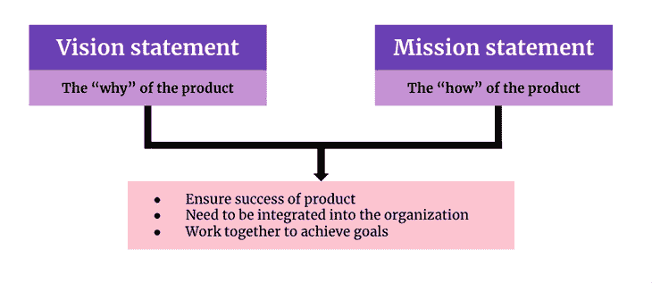

# 使命与愿景陈述:主要差异和重要性

> 原文：<https://blog.logrocket.com/product-management/mission-vs-vision-statements-key-differences-and-importance/>

产品的使命陈述和愿景陈述经常被互换使用，而且两者的意图经常被误解。实际上，这两者是截然不同的，它们都有明确的目的、意义和背景。

在本文中，我们将了解使命和愿景陈述的目的，以及它们如何概述公司的目标和目的。

* * *

## 目录

* * *

## 什么是使命陈述？

使命陈述是用来谈论为什么要制造产品，以及它要达到什么目标。从广义上讲，它可以谈论产品试图解决的问题，为谁解决，以及如何解决。

与“使命”一词的含义一致，使命陈述本质上是产品的“如何”。

使命陈述是用现在时态定义的，因为它试图说明产品试图积极实现的目标。

## 什么是愿景陈述？

相反，愿景陈述概述了产品试图实现的长期目标。愿景陈述概述了产品试图实现的最终目标或长期目标。

[愿景更具战略性](https://blog.logrocket.com/product-management/what-is-a-strategy-canvas-how-to-create-examples/),通过定义 it 想要为用户提供什么价值来概括一切。这是产品的“为什么”。

因此，愿景陈述是对公司和产品目标的未来的、长远的看法。

因此，愿景声明一般设定在未来。

## 使命陈述与愿景陈述

让我们详细讨论一下使命陈述和愿景陈述。

### 主要差异

下表列出了产品的使命和愿景陈述之间的主要差异:

| **愿景声明** | **使命陈述者** t |
| 在开始产品定义和开发的第一步中定义 | 设定产品愿景后的下一步 |
| 推动产品战略，是产品的“为什么” | 推动产品的“如何”以及如何实现产品愿景 |
| 定义产品的最终目标(长期或未来) | 定义产品的近期目标(短期或近期) |
| 影响产品的焦点、产品路线图和要优先考虑的功能 | 影响目标市场/客户以及发展计划/流程 |
| 帮助利益相关者朝着共同的目标努力，实现共同的目的 | 帮助执行计划、资源等。 |

### 主要相似之处

| **产品愿景和使命陈述** |
| 这两者都是确保产品成功的必要条件 |
| 两者都需要集成并嵌入到组织中，以推动结果 |
| 两者都需要合作来实现产品的目标和目的 |

## 为什么它们在产品管理中很重要？

愿景和使命陈述在产品管理的背景下都是至关重要的。

没有目标或未来方向的产品很快就会失败，因为客户看不到它们满足了他们的需求或解决了他们的痛点。这是愿景陈述帮助设定方向、策略和产品焦点的地方。

与此同时，没有战术或短期计划的产品将无法瞄准正确的用户或市场，也无法对竞争做出反应。在这里，使命陈述将确保产品管理团队与所有这些方面保持同步。

## 如何写一份使命陈述

写使命陈述的关键是描述产品如何对客户有用和有吸引力。使命陈述是产品的卖点，以及产品如何满足客户的需求。因此，使命陈述应该帮助回答的关键问题是:

*   谁是该产品的受益客户？
*   产品给客户带来了什么价值？
*   产品的关键区别或独特销售主张(USP)是什么？

在写使命陈述的时候，请记住，它应该有助于解决这些问题，并符合以下标准:

*   应该简短、简明、有影响力
*   应概述产品的“如何”(即，它计划如何满足客户需求并带来价值)
*   应该是现在时态
*   应该得到整个组织的认可

### 使命陈述示例

在这里，我们来看一些世界领先公司使命宣言的真实例子。通过他们的使命陈述，他们能够更好地了解他们的客户和市场，帮助定位和改进他们的产品，服务他们的客户，并通过他们的产品取得成功:

谷歌:组织全世界的信息，并使其普遍可用。

LinkedIn:连接世界各地的专业人士，让他们更有效率、更成功。

Meta:给予人们建立社区的力量，让世界更加紧密。

沃尔玛:通过零售商店和电子商务，帮助世界各地的人们省钱并过上更好的生活——无论何时何地。

## 如何撰写愿景陈述

[愿景陈述，如前所述，是未来的和长期的](https://blog.logrocket.com/product-management/what-is-a-product-vision-statement-examples/)。因此，在构建愿景陈述时，它们应该有助于解决以下问题:

*   应该概述产品试图达到的最终目标
*   应该概述产品的“为什么”(它给客户带来的价值)
*   心中应该有一个实现最终目标的愿景
*   应该有一个明确的、现实的里程碑来帮助评估最终目标何时实现

当上述信息被压缩形成愿景陈述时，提炼和实现最终愿景陈述(类似于使命陈述)的关键是:

### 愿景陈述示例

有趣的是，我们注意到一些全球顶级公司的愿景声明，它们已经取得了巨大的进步。他们对产品的愿景陈述帮助他们将产品和整个组织的方向引向最终目标。

这些强大的公司能够实现他们设定的目标，因为他们没有忽视愿景。他们始终如一地取得进步，实现了他们的愿景:

谷歌:提供一键访问世界信息的服务。

LinkedIn:为全球员工创造经济机会。

Meta:将元宇宙带入生活，帮助人们联系、寻找社区和发展业务。

沃尔玛:让忙碌的家庭每天更轻松。

## 关键要点总结

以上章节记录了一些世界领先的成功公司的愿景和使命。从这些愿景和使命的陈述中，我们应该注意到这两个陈述是紧密相关的，但却是相互排斥的。它们就像一枚硬币的两面。

愿景陈述驱动某些关键方面，例如产品的最终目标、利益相关者的联合以及路线图。使命陈述驱动产品的“如何”、用户和市场以及计划和过程。

因此，这两种说法都是产品的关键，缺一不可。此外，这两者不能在筒仓中进行和执行。

产品管理团队希望确保他们构建的产品服务于他们的目的，并获得客户的成功。为此，组织应确保愿景和使命陈述是公司*和*产品管理团队成功推出产品的基石。

* * *

订阅我们的产品管理简讯
将此类文章发送到您的收件箱

* * *

*精选图片来源:[icon scout](https://iconscout.com/icon/file-3250251)*

## [LogRocket](https://lp.logrocket.com/blg/pm-signup) 产生产品见解，从而导致有意义的行动

[LogRocket](https://lp.logrocket.com/blg/pm-signup) 确定用户体验中的摩擦点，以便您能够做出明智的产品和设计变更决策，从而实现您的目标。

使用 LogRocket，您可以[了解影响您产品的问题的范围](https://logrocket.com/for/analytics-for-web-applications)，并优先考虑需要做出的更改。LogRocket 简化了工作流程，允许工程和设计团队使用与您相同的[数据进行工作](https://logrocket.com/for/web-analytics-solutions)，消除了对需要做什么的困惑。

让你的团队步调一致——今天就试试 [LogRocket](https://lp.logrocket.com/blg/pm-signup) 。