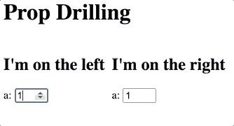
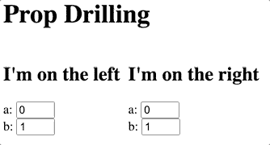

# 用 React 和 TypeScript 减轻钻柱的策略

> 原文：<https://blog.logrocket.com/mitigating-prop-drilling-with-react-and-typescript/>

道具钻探是 React 最常见的问题之一。你在层次结构的底层组件中添加了一个 prop 或事件处理程序，你不得不把它添加到每一个父组件中。如果使用 TypeScript(或 PropTypes)，情况会更糟。现在，您还需要向层次结构中的每个组件添加道具或事件的类型。

这篇文章将解释这个问题，并通过几个选项来缓解它。这些方法中的大多数已经在其他帖子中解释过了，但是我认为在一个地方用一个通用的演示应用程序来查看它们是有帮助的。我以前没有见过“挑选道具”的方法——如果你见过，请告诉我！如果你喜欢看到所有的例子，看看这篇文章的同伴 [GitHub repo](https://github.com/danvk/prop-drilling) 。

## 问题是

这里有一个小小的 React 应用程序:



You can find the full source code [here](https://codesandbox.io/s/green-pond-kpv82?file=/src/App.tsx). It’s not much, but it does show React’s incredible ability to keep multiple parts of the UI in sync with one another.

这里有四个组件`App`、`LeftColumn`、`RightColumn`和`ACounter`。`App`组件拥有状态并呈现两列:

```
export default function App() {
  const [a, setA] = React.useState(0);
  return (
    <div className="root">
      <h1>Prop Drilling</h1>
      <div className="columns" style={{ display: "flex" }}>
        <LeftColumn a={a} onSetA={setA} leftThing="I'm on the left" />
        <RightColumn a={a} onSetA={setA} rightThing="I'm on the right" />
      </div>
    </div>
  );
}
```

左栏显示它的消息和一个计数器。它将状态和事件处理程序向下传递给计数器:

```
interface LeftColumnProps {
  a: number;
  onSetA: (a: number) => void;
  leftThing: string;
}

function LeftColumn({ a, onSetA, leftThing }: LeftColumnProps) {
  return (
    <div className="left" style={{ paddingRight: 10 }}>
      <h2>{leftThing}</h2>
      <ACounter a={a} onSetA={onSetA} />
    </div>
  );
}
```

(右栏类似。)
最后，我们有一个计数器，它呈现一个 DOM 元素，并在情况发生变化时调用事件处理程序:

```
interface ACounterProps {
  a: number;
  onSetA: (a: number) => void;
}

function ACounter({ a, onSetA }: ACounterProps) {
  return (
    <>
      a:{" "}
      <input
        type="number"
        style={{ width: "3em" }}
        value={a}
        onChange={(e) => onSetA(+e.target.value)}
      />
    </>
  );
}
```

因为只有一个状态，所以两列中的两个计数器彼此保持同步。这就是 React 的妙处！

这个简单的例子用了 [64 行代码](https://codesandbox.io/s/green-pond-kpv82?file=/src/App.tsx)。而且已经说明了道具钻的特点，`LeftColumn`(和`RightColumn`)组件不直接使用`a`或`onSetA`。相反，它们只是将它们传递给子组件。

如果我们增加另一个计数器，情况会变得更糟:



Now there are TWO counters

为了处理这种变化，我们可以将`ACounter`改为`ABCounter`，并引入第五个组件，一个通用的`Counter`，以减少重复:

```
interface CounterProps {
  name: string;
  val: number;
  onSetVal: (val: number) => void;
}

function Counter({ name, val, onSetVal }: CounterProps) {
  return (
    <>
      {name}:{" "}
      <input
        type="number"
        style={{ width: "3em" }}
        value={val}
        onChange={(e) => onSetVal(+e.target.value)}
      />
    </>
  );
}

interface ABCounterProps {
  a: number;
  onSetA: (a: number) => void;
  b: number;
  onSetB: (b: number) => void;
}

function ABCounter({ a, onSetA, b, onSetB }: ABCounterProps) {
  return (
    <>
      <Counter name="a" val={a} onSetVal={onSetA} />
      <br />
      <Counter name="b" val={b} onSetVal={onSetB} />
    </>
  );
}
```

为了实现这一点，我们还必须对所有其他组件进行更改。

对于`LeftColumn`:

```
interface LeftColumnProps {
  a: number;
  onSetA: (a: number) => void;
  b: number;  // NEW!
  onSetB: (a: number) => void;  // NEW!
  leftThing: string;
}

function LeftColumn({ a, onSetA, b, onSetB, leftThing }: LeftColumnProps) {
  return (
    <div className="left" style={{ paddingRight: 10 }}>
      <h2>{leftThing}</h2>
      <ABCounter a={a} onSetA={onSetA} b={b} onSetB={onSetB} />
      {/* ^^^ Changed! ^^^ */}
    </div>
  );
}
```

我们必须对`RightColumn`进行同样的更改。对于`App`:

```
export default function App() {
  const [a, setA] = React.useState(0);
  const [b, setB] = React.useState(1);  // NEW!
  return (
    <div className="root">
      <h1>Prop Drilling</h1>
      <div className="columns" style={{ display: "flex" }}>
        <LeftColumn
          a={a}
          onSetA={setA}
          b={b}  { /* NEW! */ }
          onSetB={setB}  { /* NEW! */ }
          leftThing="I'm on the left"
        />
        <RightColumn
          a={a}
          onSetA={setA}
          b={b}  { /* NEW! */ }
          onSetB={setB}  { /* NEW! */ }
          rightThing="I'm on the right"
        />
      </div>
    </div>
  );
}
```

这个应用程序现在记录了 99 行代码。除了`Counter`的变化和一个新状态(`b`)的添加，我们必须向两个类型声明(`LeftColumnProps`和`RightColumnProps`)添加新的道具，在两个组件中将它们传递给`ABCounter`，并从`App`开始将它们传递给两列。总之，我统计了三个文件中的十行更改，它们只是传递数据和处理程序。如果您想添加第三个计数器，您必须对所有文件进行更多的更改。

这就是道具钻的问题。这一变化的本质是将`b`添加到应用程序的状态中，并添加 UI 来显示它。但是几乎一半的变化是在其他组件中传递道具。

我们称之为“完全线程化”方法，因为应用程序状态和处理程序一直向下传递。这篇文章的剩余部分着眼于一些减少重复的方法。

全螺纹:

*   优点——它非常明显！这里没有魔法。每个组件都准确地接收它需要的道具
*   缺点——最大重复。需要改变层次结构中的所有组件

## 解决方案 1:使用更少的组件

让我们称之为肯特·c·多兹方法，因为他在他关于支柱钻井的经典文章[中提出了这一方法](https://kentcdodds.com/blog/prop-drilling)。我们真的需要所有这些中间组件吗？如果我们保留`Counter`，但将其他所有内容都放在`App`，去掉`LeftColumn`、`RightColumn`和`ABCounter`组件，看起来会是这样:

```
export default function App() {
  const [a, setA] = React.useState(0);
  const [b, setB] = React.useState(1);
  return (
    <div className="root">
      <h1>Prop Drilling</h1>
      <div className="columns" style={{ display: "flex" }}>
        <div className="left" style={{ paddingRight: 10 }}>
          <h2>I'm on the left</h2>
          <Counter name="a" val={a} onSetVal={setA} />
          <br />
          <Counter name="b" val={b} onSetVal={setB} />
        </div>
        <div className="right">
          <h2>I'm on the right</h2>
          <Counter name="a" val={a} onSetVal={setA} />
          <br />
          <Counter name="b" val={b} onSetVal={setB} />
        </div>
      </div>
    </div>
  );
}
```

这个版本的应用程序只有 46 行代码。通过去掉中间组件和它们的道具，我们得到了比原来更短的东西！

我们还完全消除了 prop drilling 的问题，因为显示状态和生成事件的`Counter`组件在管理状态的同一个组件(`App`)中呈现，不需要线程处理。不涉及中间部件。

那么这是解决问题的方法吗？我们应该把我们所有的部件都粘在一起吗？这种方法有一些缺点:

1.  想必，您创建所有这些中间组件是有原因的。也许它们也用于应用程序的其他部分。如果你在多个地方内联它们(就像我们对`ABCounter`所做的那样)，那么你是在用重复的线程来换取 UI 代码的复制
2.  内联组件也消除了内存化的可能性。如果你的组件层次的整个块可以被记忆，那么你将节省许多不必要的渲染

也就是说，这种方法确实产生了非常简洁明了的代码。它还需要最少的类型注释。因此，在尝试其他解决方案之前，值得考虑是否有一些组件可以合并。如果你正在寻找更多的指导，Kent C. Dodds 也有一篇关于何时分解组件的文章。

使用更少的组件(即 Kent C. Dodds 方法):

*   优点—用最少的类型注释生成非常简洁、清晰的代码
*   缺点——使得重用组件更加困难，并且消除了记忆的可能性

## 解决方案 2:使用儿童

组合组件非常有效，因为它将状态和使用它的组件放在一起，不需要线程！但是缺点是您失去了在代码的其他地方重用中间组件的能力。

不过还有一个折中的办法，那就是使用 React 的`children`道具。通过这样做，我们可以保留我们的中间组件(`LeftColumn`和`RightColumn`)，并且仍然将计数器和状态放在一起。

下面是`LeftColumn`(一如既往，`RightColumn`也差不多):

```
interface LeftColumnProps {
  leftThing: string;
  children: React.ReactNode;
}

function LeftColumn({ leftThing, children }: LeftColumnProps) {
  return (
    <div className="left" style={{ paddingRight: 10 }}>
      <h2>{leftThing}</h2>
      {children}
    </div>
  );
}
```

它接受它所呈现的一个`children`道具。下面是你如何使用它(在`App`):

```
export default function App() {
  const [a, setA] = React.useState(0);
  const [b, setB] = React.useState(1);
  return (
    <div className="root">
      <h1>Prop Drilling</h1>
      <div className="columns" style={{ display: "flex" }}>
        <LeftColumn leftThing="I'm on the left">
          <Counter name="a" val={a} onSetVal={setA} />
          <br />
          <Counter name="b" val={b} onSetVal={setB} />
        </LeftColumn>
        <RightColumn rightThing="I'm on the right">
          <Counter name="a" val={a} onSetVal={setA} />
          <br />
          <Counter name="b" val={b} onSetVal={setB} />
        </RightColumn>
      </div>
    </div>
  );
}
```

这个解决方案有 [72 行代码](https://codesandbox.io/s/sparkling-wood-o8lry?file=/src/App.tsx)。通过让中间组件接受`children`，我们可以将`Counter`和状态放在一起，就像我们在解决方案 1 中所做的那样。但是与解决方案 1 不同，如果我们愿意，我们仍然可以在应用程序的其他地方重用中间组件。

React 文档在[组合与继承](https://reactjs.org/docs/composition-vs-inheritance.html)的主题下讨论孩子。把孩子当作道具是一个非常强大的工具，这是我使用 React 这些年来越来越欣赏的一个工具。孩子不一定是 DOM 元素。关于非 DOM 孩子的一些很好的例子，请查看 React Router，[使用孩子来绘制路线](https://reactrouter.com/web/example/basic)，以及 [react-mapbox-gl](https://github.com/alex3165/react-mapbox-gl) ，使用孩子来定义交互式 mapbox 地图上的图层。

儿童:

*   优点—允许您将组件及其状态放在一起，同时保留可重用的中间组件
*   缺点——要求中间组件对其子组件完全不可知

## 解决方案 3:将相关道具组合成一个对象

如果两个道具经常一起使用，你可以考虑将它们组合成一个单独的物体，然后在周围传递。下面是使用这种方法后`ABCounter`的样子:

```
interface ABCounterProps {
  vals: { a: number; b: number };
  onSetVal: (which: "a" | "b", val: number) => void;
}

function ABCounter({ vals: { a, b }, onSetVal }: ABCounterProps) {
  return (
    <>
      <Counter name="a" val={a} onSetVal={(v) => onSetVal("a", v)} />
      <br />
      <Counter name="b" val={b} onSetVal={(v) => onSetVal("b", v)} />
    </>
  );
}
```

我们没有将`a`和`b`作为单独的道具传递，而是将它们组合成一个单独的`vals`对象。代替`onSetA`和`onSetB`道具，我们有一个带`which`参数的`onSetVal`道具。

我们可以通过`LeftColumn`传递这两者:

```
interface LeftColumnProps extends ABCounterProps {
  leftThing: string;
}

function LeftColumn({ vals, onSetVal, leftThing }: LeftColumnProps) {
  return (
    <div className="left" style={{ paddingRight: 10 }}>
      <h2>{leftThing}</h2>
      <ABCounter vals={vals} onSetVal={onSetVal} />
    </div>
  );
}
```

这里我使用了带有类型声明的`extends`来共享`ABCounterProps`和`LeftColumnProps`之间的公共属性。

最后，`App`:

```
export default function App() {
  const [a, setA] = React.useState(0);
  const [b, setB] = React.useState(1);
  const vals = { a, b };
  const handleSetVal = (which: "a" | "b", val: number) =>
    (which === "a" ? setA : setB)(val);
  return (
    <div className="root">
      <h1>Prop Drilling</h1>
      <div className="columns" style={{ display: "flex" }}>
        <LeftColumn
          vals={vals}
          onSetVal={handleSetVal}
          leftThing="I'm on the left"
        />
        <RightColumn
          vals={vals}
          onSetVal={handleSetVal}
          rightThing="I'm on the right"
        />
      </div>
    </div>
  );
}
```

整个事情总共有 88 行代码。这比我们将所有组件放在一起时要多得多，尽管这肯定是对全线程版本的改进。更何况如果加一个`c`计数器，只需要[加三行代码](https://codesandbox.io/s/gallant-turing-w1hn4?file=/src/App.tsx)。因为第三个计数器将进入同一个对象，所以不需要对中间组件进行任何更改。

这种方法最适合总是一起传递或一起修改的道具。或者对于完全不修饰的道具。如果您的应用程序有某种全局配置，在启动时只初始化一次，那么这是组合成单个对象的绝佳选择。

将道具组合成物品:

*   优点—减少添加或更改对象属性时的重复
*   缺点—可能导致更复杂的事件处理程序。如果组件不需要对象中的所有属性，可能会导致“过度转发”。会使缓存变得更加棘手

## 解决方案 4:使用上下文 API

React 的[上下文 API](https://reactjs.org/docs/context.html) 是依赖注入的一种形式。它让父组件提供一个对象，子组件使用它，而中间组件不必知道它的任何信息。

要使用上下文 API，首先需要使用`React.createContext`创建一个`Context`对象。

我们将使用`ABCounterProps`作为类型:

```
interface ABCounterProps {
  a: number;
  onSetA: (a: number) => void;
  b: number;
  onSetB: (b: number) => void;
}

const ABContext = React.createContext<ABCounterProps>({
  a: 0,
  b: 0,
  onSetA(a) {},
  onSetB(b) {}
});
```

然后，在 App 中，我们提供上下文:

```
export default function App() {
  const [a, setA] = React.useState(0);
  const [b, setB] = React.useState(1);
  const context = { a, b, onSetA: setA, onSetB: setB };

  return (
    <div className="root">
      <h1>Prop Drilling</h1>
      <ABContext.Provider value={context}>
        <div className="columns" style={{ display: "flex" }}>
          <LeftColumn leftThing="I'm on the left" />
          <RightColumn rightThing="I'm on the right" />
        </div>
      </ABContext.Provider>
    </div>
  );
}
```

最后，在`ABCounter`中，我们使用`React.useContext`检索上下文:

```
function ABCounter(props: {}) {
  const { a, b, onSetA, onSetB } = React.useContext(ABContext);
  return (
    <>
      <Counter name="a" val={a} onSetVal={onSetA} />
      <br />
      <Counter name="b" val={b} onSetVal={onSetB} />
    </>
  );
}
```

不需要对`LeftColumn`(或`RightColumn`)做任何修改，这就是上下文 API 的全部思想。`ABContext`在我们的组件层次结构中一路向下传送。这个解决方案有 91 行代码。

这是不是有点诡异？`ABCounter`声明没有道具，但明明消耗了东西。如果您未能提供一个`ABContext`，该应用程序将无法工作。同样，如果您试图在不提供上下文的情况下呈现一个`LeftColumn`，它也会失败。这些依赖是关键的，但是它们没有以通常的方式列出(通过 props)。TypeScript 也帮不了你。未能向子组件提供所需的上下文可能是错误，也可能不是错误。它可能只是由父组件提供的。

背景通常被描述为支柱钻井的解决方案，但是 T2 的反应文件竭尽全力将你推向替代方案。尤其是如果您使用 TypeScript，在跳转到上下文之前考虑您的选择。

上下文 API:

*   优点——直接解决了道具穿过中间组件的问题。内置于 React 中
*   缺点—使依赖关系不太明确，并防止 TypeScript 能够跟踪它们。带来一些自己的样板文件

## 解决方案 5:挑选道具

这种策略认识到在应用程序中传递的大多数道具都不是唯一的。组件的属性往往是应用程序状态的子集。类似的模式也适用于事件处理程序。如果我们定义了应用程序状态的类型(以及事件处理程序的范围)，那么当我们定义单独的组件时，我们就可以[【pick】](https://www.typescriptlang.org/docs/handbook/utility-types.html#picktype-keys)避开它。

以下是描述应用程序整体状态的类型:

```
interface AppState {
  leftThing: string;
  rightThing: string;
  a: number;
  b: number;
  onSetA: (a: number) => void;
  onSetB: (b: number) => void;
}
```

(实际上，您可能希望分离出事件处理程序。)
要为`ABCounter`定义道具类型，可以使用 TypeScript 的内置`[Pick](https://www.typescriptlang.org/docs/handbook/utility-types.html#picktype-keys)`泛型:

```
type ABCounterProps = Pick<AppState, "a" | "b" | "onSetA" | "onSetB">;

function ABCounter({ a, onSetA, b, onSetB }: ABCounterProps) {
  return (
    <>
      <Counter name="a" val={a} onSetVal={onSetA} />
      <br />
      <Counter name="b" val={b} onSetVal={onSetB} />
    </>
  );
}
```

将鼠标放在这个定义上，您可以看到我们得到了所有正确的`a`、`b`和事件处理程序的类型。

道具列表对渲染`ABCounter`的组件也很有用，因为它们可以用它来选择它们传递的道具:

```
const abCounterProps = ["a", "b", "onSetA", "onSetB"];

function LeftColumn(props: LeftColumnProps) {
  return (
    <div className="left" style={{ paddingRight: 10 }}>
      <h2>{props.leftThing}</h2>
      <ABCounter {..._.pick(props, abCounterProps)} />
    </div>
  );
}
```

这里我们使用对象扩散(`...`)和[洛达什的](https://lodash.com/docs/4.17.15#pick) `[_.pick](https://lodash.com/docs/4.17.15#pick)`来挑选`ABCounter`需要的道具。

在`ABCounterProps`(类型)和`abCounterProps`(值)之间有一些重复。我们怎样才能摆脱这种情况并使它们保持同步呢？请记住，TypeScript 类型在运行时消失。所以类型和值是一条[单行道，](https://effectivetypescript.com/2020/07/27/safe-queryselector/)你可以从值中派生出类型，但不能从类型中派生出值。所以先说价值。

我们将使用一个[常量断言](https://www.typescriptlang.org/docs/handbook/release-notes/typescript-3-4.html#const-assertions) ( `as const`)来获得`abCounterProps`的更精确类型:

```
const abCounterProps = ["a", "b", "onSetA", "onSetB"] as const;
// type is readonly ["a", "b", "onSetA", "onSetB"]
```

如果没有`as const`，那么推断出的类型就是简单的`string[]`。这种类型可以参考`typeof abCounterProps`。要为元组类型的元素抽取类型，可以使用`[0]`、`[1]`等。但是我们想要的是所有元素类型的联合。为此我们使用`[number]`:

```
type T1 = typeof abCounterProps[0]; // type is "a"
type T2 = typeof abCounterProps[1]; // type is "b"
type T3 = typeof abCounterProps[number];
// type is "a" | "b" | "onSetA" | "onSetB"
```

这最后一种类型看起来和我们传递给`Pick`的工会一模一样！所以我们可以插上这个来得到`ABCounterProps`:

```
const abCounterProps = ["a", "b", "onSetA", "onSetB"] as const;
type ABCounterProps = Pick<AppState, typeof abCounterProps[number]>;
```

如果你添加一个道具到`abCounterProps`，它会自动添加到`ABCounterProp`。如果新道具不是`AppState`的一部分，那么你会得到一个错误。

我们可以对`LeftColumnProps`使用类似的策略。但是我们可以将`ABCounter`中的道具展开，而不是明确列出所有道具:

```
const leftColumnProps = [...abCounterProps, "leftThing"] as const;
type LeftColumnProps = Pick<AppState, typeof leftColumnProps[number]>;

function LeftColumn(props: LeftColumnProps) {
  return (
    <div className="left" style={{ paddingRight: 10 }}>
      <h2>{props.leftThing}</h2>
      <ABCounter {..._.pick(props, abCounterProps)} />
    </div>
  );
}
```

最后，我们可以使用`leftColumnProps`来挑选`App`中的道具:

```
export default function App() {
  const [a, setA] = React.useState(0);
  const [b, setB] = React.useState(1);

  const appState: AppState = {
    a,
    b,
    onSetA: setA,
    onSetB: setB,
    leftThing: "I'm on the left",
    rightThing: "I'm on the right"
  };

  return (
    <div className="root">
      <h1>Prop Drilling</h1>
      <div className="columns" style={{ display: "flex" }}>
        <LeftColumn {..._.pick(appState, leftColumnProps)} />
        <RightColumn {..._.pick(appState, rightColumnProps)} />
      </div>
    </div>
  );
}
```

这种方法的好处是，如果你向`ABCounter`添加一个新道具，它将自动被添加到中间组件的道具类型中(因为数组扩展和`Pick`)，并且它将自动被传递下去(因为`{..._.pick()}`)。您只需要修改消费者和生产者，而不需要修改中间组件。

我们保留了全线程版本的所有显式依赖关系。只是我们欺骗了 TypeScript 和 JS 运行时，让它们为我们添加到中间组件中，而我们不必键入任何内容。因为一切都是显式的，所以当您未能传递所需的属性时，TypeScript 仍然可以标记错误。

* * *

### 更多来自 LogRocket 的精彩文章:

* * *

这是这种方法的[完整源代码，有 93 行代码。](https://codesandbox.io/s/stoic-snow-upjv2?file=/src/App.tsx)

挑选道具:

*   优点—保留显式依赖关系，无需修改中间组件。避免重复的类型声明
*   缺点——需要一些奇特的类型脚本结构。查看组件的道具需要你的编辑器的帮助。至少在本例中，没有其他方法节省那么多代码行

## 结论

正确钻取可能是 React 中令人沮丧的一个原因，尤其是在使用 TypeScript 时。但不要因此而沮丧！有许多可能的方法来避免“线程化”,这种“线程化”会导致与 prop drilling 相关的重复的样板代码。

如果你遇到了支柱钻井，首先问问你是否可以使用更少的部件。如果一个组件只在一个地方被使用，你可能想内联它以减少开销。分解出不同的 React 组件通常是个好主意，但不如分解出不同的函数好。

如果您不能合并组件，请考虑您的一些中间组件是否主要充当布局组件，或者它们的某些部分是否主要与布局有关。如果是这样，你可能要用`children`。将子组件传递给组件有助于组件及其状态的协同定位，并且可以有效地减少适当的钻取。

如果这两种方法都不起作用，你可以考虑将相关的道具合并到对象中，使用上下文 API，或者使用本文中描述的“挑选道具”模式。

有没有其他方法可以避免钻柱？请在[同伴回购](https://github.com/danvk/prop-drilling)中建议他们！

## 使用 LogRocket 消除传统反应错误报告的噪音

[LogRocket](https://lp.logrocket.com/blg/react-signup-issue-free)

是一款 React analytics 解决方案，可保护您免受数百个误报错误警报的影响，只针对少数真正重要的项目。LogRocket 告诉您 React 应用程序中实际影响用户的最具影响力的 bug 和 UX 问题。

[ ](https://lp.logrocket.com/blg/react-signup-general) [  ](https://lp.logrocket.com/blg/react-signup-general) [LogRocket](https://lp.logrocket.com/blg/react-signup-issue-free)

自动聚合客户端错误、反应错误边界、还原状态、缓慢的组件加载时间、JS 异常、前端性能指标和用户交互。然后，LogRocket 使用机器学习来通知您影响大多数用户的最具影响力的问题，并提供您修复它所需的上下文。

关注重要的 React bug—[今天就试试 LogRocket】。](https://lp.logrocket.com/blg/react-signup-issue-free)

## [LogRocket](https://lp.logrocket.com/blg/typescript-signup) :全面了解您的网络和移动应用

[](https://lp.logrocket.com/blg/typescript-signup)

LogRocket 是一个前端应用程序监控解决方案，可以让您回放问题，就像问题发生在您自己的浏览器中一样。LogRocket 不需要猜测错误发生的原因，也不需要向用户询问截图和日志转储，而是让您重放会话以快速了解哪里出错了。它可以与任何应用程序完美配合，不管是什么框架，并且有插件可以记录来自 Redux、Vuex 和@ngrx/store 的额外上下文。

除了记录 Redux 操作和状态，LogRocket 还记录控制台日志、JavaScript 错误、堆栈跟踪、带有头+正文的网络请求/响应、浏览器元数据和自定义日志。它还使用 DOM 来记录页面上的 HTML 和 CSS，甚至为最复杂的单页面和移动应用程序重新创建像素级完美视频。

[Try it for free](https://lp.logrocket.com/blg/typescript-signup)

.