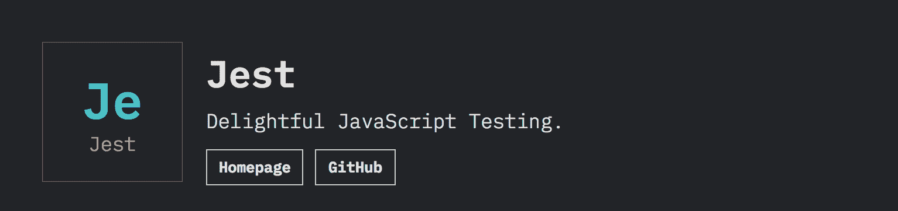
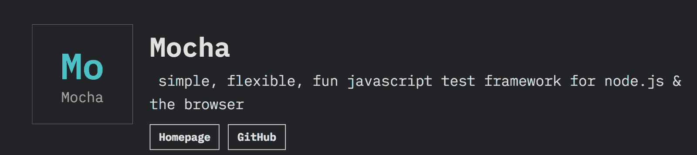
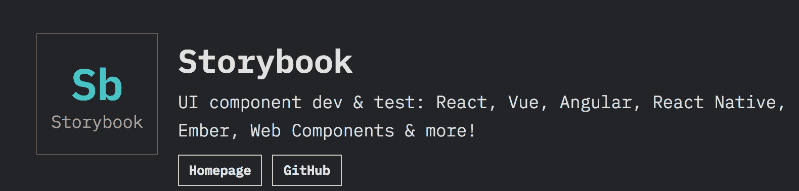
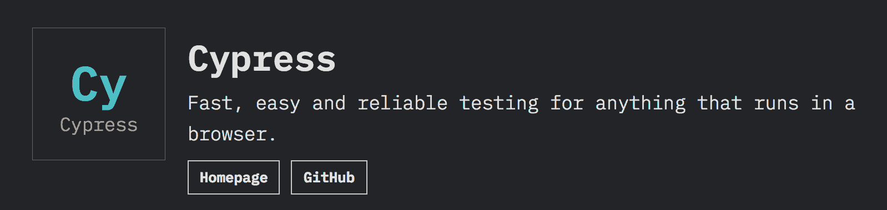
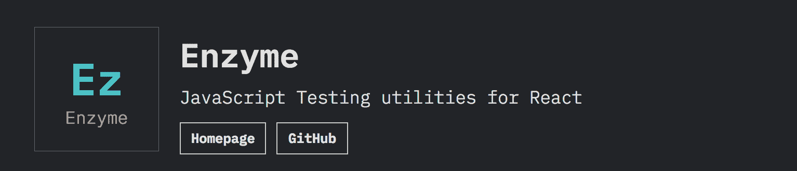
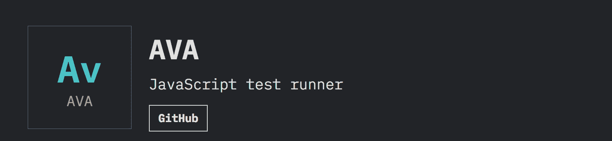
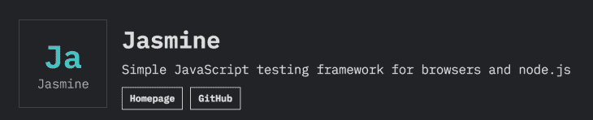
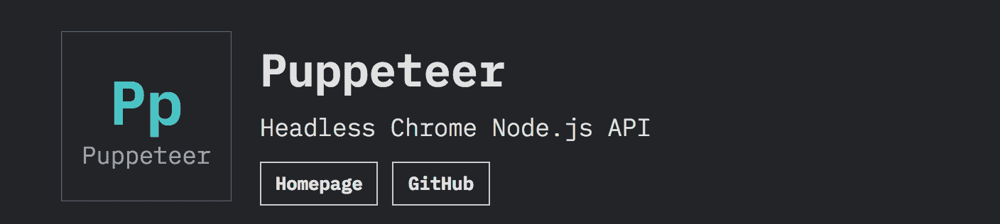

# 2020 年最受欢迎的 JavaScript 测试工具

> 原文：<https://blog.logrocket.com/most-in-demand-javascript-testing-tools-in-2020/>

在这篇文章中，我将带您回顾和分析 2019 年 JavaScript 报告的状态，向您展示将在 2020 年占据中心舞台的 JavaScript 测试框架。在 2019 年之后，我们将看看 JS State insights 中反映的 JavaScript 状态，该公司调查了全球 21，000 多名开发人员。

## JS 的状态是什么？

JS state 是一项关于 JavaScript 的年度调查，参与调查的开发人员的意见被记录下来，并以漂亮的可视化方式展示了当年 JavaScript 的状态。

数据点涵盖了前端 web 开发框架、数据库、状态管理、框架之间的关系、接收和易用性、编译成 JavaScript 的语言、移动框架、构建工具、JavaScript 测试工具等等。

这是一项非常全面的 JavaScript 调查，由 Sacha Greif 和其他几个助手在 2016 年启动。现在，在最新版本的中，已经有超过 21，000 个开发者的回复。

## 为什么是州政府？

在我看来,《JS 状态》实际上是第一个只针对 JavaScript 的开发者调查，就 JavaScript 社区而言，它受到了普遍的尊重。

还有其他非常受欢迎的调查，如 StackOverflow 开发人员调查，吸引了超过 100，000 名受访者。Jetbrain 的开发者生态系统状态报告也非常全面，有超过 6000 名受访者。

根据调查洞察，这些是 JavaScript 开发者在 2019 年最受欢迎的测试工具，按照意识、兴趣和满意度确定的重要性顺序排列。

## 玩笑

Jest 是最受欢迎的 JavaScript 测试框架之一，由脸书团队构建并持续维护。它是 React 推荐的零配置 JavaScript 测试框架，也是最易用的。

Jest 在 2018 年有着非常令人印象深刻的接受率，今年在 JavaScript 社区中更是如此。根据 GitHub 的数据，Jest 目前被超过 150 万个项目使用。

在过去的 12 个月中，保留率从 39%急剧上升到 61%。这是一个经常性增长率，因为从 2017 年到 2018 年也有所增加。

对笑话感兴趣的人的比例也减少了。这个数字从 29%下降到现在的 22%。他们中的大多数人现在都是回访用户，这一点可以从留存洞察中看出。

## 摩卡

多年来，Mocha 一直是最常用的 JavaScript 测试框架之一。它与第三方断言、嘲讽和间谍工具(如 Chai 或 Enzyme)一起使用。除了庞大的生态系统之外，Mocha 还拥有完善的选项和优秀的文档。

它非常灵活，可以进行很多扩展。根据 GitHub 的数据，Mocha 已经被超过 90 万个项目使用。

根据调查结果，在过去 12 个月中，保留率从 39%增长到 42%。大约 8%的受访者没有听说过摩卡，这是一个认知差距，摩卡正在不断填补，因为去年这个比例是 10。

## 故事书

Storybook 是 UI 组件的开发环境。

它允许您浏览组件库，查看每个组件的不同状态，并以交互方式开发和测试组件。它已经在 GitHub 上被加了约 44000 次星，拥有庞大的用户群。

使用故事书的保留率在 12 个月内翻了一番，从 15%上升到 32%，在同一时间段内，兴趣水平也从 23%上升到 26%。

Storybook 去年甚至还没有进入开发者的视线，但在 2019 年和 2020 年已经有了巨大的增长。这将是有趣的一年。

## 柏树

Cypress 是一个非常快速可靠的 JavaScript 测试工具。它基本上将测试注入到 web 应用程序中，提供了非常清晰和广泛的文档，并与另一个名为 TestCafe 的测试框架不断竞争。

根据 GitHub 的数据，超过 25，000 个项目正在使用它。

留存率 23%，柏木利率 28%。这是一个意识上的空白，赛普拉斯正在努力填补这个空白。

## 酶

Enzyme 是 React 的一个 JavaScript 测试工具，它使测试 React 组件的输出变得更加容易。您还可以操纵、遍历和以某种方式模拟给定输出的运行时。

Enzyme 的 API 旨在通过模仿 jQuery 的 DOM 操作和遍历 API 来实现直观和灵活。

在过去 12 个月中，保留率从 20%增长到 23%。从 46%到 38%之间也存在认知差距。

## 麻醉椒

艾娃是 Node.js 的测试运行者，它有简洁的 API、详细的错误输出、新语言特性的支持以及让你更有效地编写测试的进程隔离。

有了艾娃，你可以发布更棒的代码。根据 GitHub 的数据，目前有 47，000 个项目在使用它。

去年，大约 72%的 JavaScript 开发者听说过艾娃。今年，这一数字下降到 69%，而保留率增长到 5%。

## 茉莉

Jasmine 是一个行为驱动的 JavaScript 开发测试框架。

它不依赖于浏览器、DOM 或任何 JavaScript 框架。因此，它适用于网站、 [Node.js](http://nodejs.org/) 项目或 JavaScript 可以运行的任何地方。

根据调查结果，在过去 12 个月中，保留率略有上升。然而，意识上的差距越来越大，Jasmine 可以在 2020 年试图弥合这一差距。

## 操纵木偶的人

由 Google 的团队构建的 Puppeteer 是一个节点库，它提供了一个高级 API 来控制 Chrome 或 DevTools 协议上的 Chrome。

默认情况下，Puppeteer 是无头运行的，但是可以配置为运行全(非无头)Chrome 或 Chrome。它也很快，因为它是本地的。

调查结果显示，木偶师的保留率为 24.3%，利率为 24%。尽管已经有超过 55，000 个项目在使用该产品，但仍需要提高对该产品的认识。

## 概括起来

Puppeteer 和 Cypress 是今年由 JavaScript 开发者确定的新加入者。2016 年以来，是摩卡、茉莉、Jest、酵素、艾娃。

虽然 Jest 似乎领导着市场，其 96%以上的用户是回头客，但似乎有一种开发人员到测试工具的平均分布。

你使用什么样的测试框架？在评论区告诉我。

## 您是否添加了新的 JS 库来提高性能或构建新特性？如果他们反其道而行之呢？

毫无疑问，前端变得越来越复杂。当您向应用程序添加新的 JavaScript 库和其他依赖项时，您将需要更多的可见性，以确保您的用户不会遇到未知的问题。

LogRocket 是一个前端应用程序监控解决方案，可以让您回放 JavaScript 错误，就像它们发生在您自己的浏览器中一样，这样您就可以更有效地对错误做出反应。

[https://logrocket.com/signup/](https://lp.logrocket.com/blg/javascript-signup)

[LogRocket](https://lp.logrocket.com/blg/javascript-signup) 可以与任何应用程序完美配合，不管是什么框架，并且有插件可以记录来自 Redux、Vuex 和@ngrx/store 的额外上下文。您可以汇总并报告问题发生时应用程序的状态，而不是猜测问题发生的原因。LogRocket 还可以监控应用的性能，报告客户端 CPU 负载、客户端内存使用等指标。

自信地构建— [开始免费监控](https://lp.logrocket.com/blg/javascript-signup)。