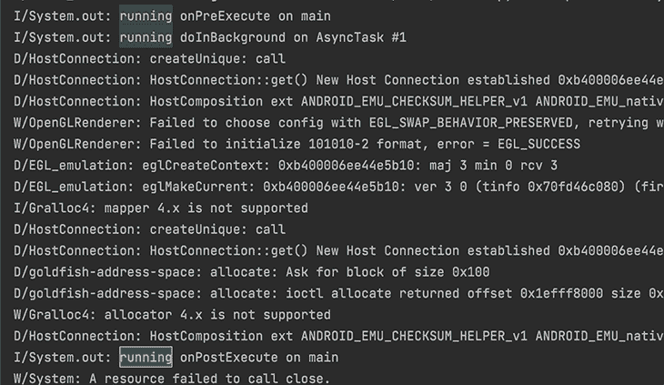

# 远离 Kotlin 的 AsyncTask:替代解决方案

> 原文：<https://blog.logrocket.com/moving-away-kotlin-asynctask-alternative-solutions/>

在 Android 的世界中，长时间运行的操作——如繁重的计算、数据库操作或网络操作——不会在 UI 或主线程上执行，因为这些操作不会立即完成，并且往往会阻塞调用它们的线程。

如果这些操作是在主线程上完成的，那将会是一场 UI 灾难。在现代应用程序中，人们非常依赖长时间运行的操作来为用户提供丰富的内容。而且，正如我们所知，保持良好的用户界面体验是非常有吸引力的，可以让用户不断回来。为了避免 UI 崩溃和冻结，应该将工作从主线程中取出并卸载到另一个线程上，以避免丢失用户。

Android 框架对此有严格的政策；默认情况下，它不允许在主线程上执行长时间运行的操作，如数据库交互或网络请求。如果违反此策略，将在运行时引发异常。

Android 最初设计了[API`AsyncTask`T4 来帮助异步任务，而不需要第三方库。我不会详述`AsyncTask`的内部工作方式，因为从 API 级别 30 开始，`AsyncTask`已经被弃用，取而代之的是其他替代方式，我们将在本帖中讨论。](https://developer.android.com/reference/kotlin/android/os/AsyncTask)

*向前跳转:*

## AsyncTask 为什么被弃用？

在使用此 API 之前，您应该了解此 API 的三个主要部分:

*   在使用它之前，必须对其进行子类化
*   它有三种通用类型，分别是`Params`、`Progress`和`Result`
*   执行有四个步骤:
    *   `onPreExecute`
    *   `doInBackground`
    *   `onProgressUpdate`
    *   `onPostExecute`

### `AsyncTask`的用法示例

让我们先看一些代码:

```
class DoWorkAsync(private val binding: ActivityMainBinding) :
    AsyncTask<Int, Unit, AsyncResult>() {

    override fun onPreExecute() {
        super.onPreExecute()
        println("running onPreExecute on ${Thread.currentThread().name}")
        binding.displayText.text = "heavy calculation ongoing..."
    }

    override fun doInBackground(vararg params: Int?): AsyncResult {
        println("running doInBackground on ${Thread.currentThread().name}")
        val param = params.first() ?: return AsyncResult.Error
        val factorial = factorial(param)
        return AsyncResult.Success(param, factorial)
    }

    override fun onPostExecute(result: AsyncResult?) {
        println("running onPostExecute on ${Thread.currentThread().name}")
        super.onPostExecute(result)
        when (result) {
            is AsyncResult.Success -> "Factorial of ${result.input} = ${result.value}"
            AsyncResult.Error, null -> "An error occurred while computing the value"
        }.also { binding.displayText.text = it }
    }
}

```

在上面的代码块中，我创建了一个扩展了`AsyncTask`的`DoWorkAsync`类，并将泛型类型指定为`Int`、`Unit`和`AsyncResult`。这些类型分别代表`Params`、`Progress`和`Result`。

在我们执行`doInBackground`中的长时间运行的操作之前，`onPreExecute`被调用。在这里你可以做一些事情，比如[显示一个进度条](https://blog.logrocket.com/build-react-native-progress-bar/)来表示工作正在进行中。

实际任务在`doInBackground`中完成；这里所做的工作从主线程转移到另一个线程，以确保流畅的用户体验。

通过这种方法访问视图是不安全的，因为您试图从另一个线程访问在主线程中创建的视图。从技术上讲，如果发生这种情况，应用程序应该会崩溃。

`onPostExecute`在`doInBackground`工作完成后被调用。从这里*访问视图是*安全的，因为我们从最初创建视图的主线程调用。

参见下面打印到控制台的线程名称截图。



使用`AsyncTask` API 可能允许您执行异步任务，但是有一些显而易见的问题:

1.  对于简单的任务来说，设置太麻烦了
2.  API 容易出现内存泄漏
3.  从 API 级别 30 开始，该 API 已被弃用

## 不推荐使用的替代产品`AsyncTask`

由于`AsyncTask`的缺点和不受欢迎，开发者应该转向 Android 异步编程的替代解决方案之一:

1.  科特林·科特雷普
2.  [RxJava](https://github.com/ReactiveX/RxJava)
3.  实施者

前两个更受欢迎，API 使用更简单，所以我们将在本文中重点讨论这两个。

## 什么是 Kotlin 协同程序？

协程是一种并发的方法，你可以在不阻塞 UI 线程的情况下暂停和恢复任务的执行。多个协程可以在一个线程上执行，而不会阻塞该线程。

JetBrains 在 Kotlin 中从头开始开发 Kotlin 协同例程，以减少处理异步任务和并发时的麻烦。它的好处之一是用顺序代码简化了异步性。

要在 Android 中使用 Kotlin 协同程序，您需要掌握一些基本组件。

### 暂停功能

暂停功能类似于常规功能。唯一的区别是函数上的`suspend`修饰符。在编译时，编译器将这样的函数标记为暂停点。这些功能可以暂停或恢复。最后一点是，挂起函数只能从协程或另一个挂起函数中调用。

一个`suspend`函数是这样定义的:

```
suspend fun invokeSuspendFunc(){ }
```

一个`regular`函数是这样定义的:

```
fun invokeRegularFunc(){ }

```

### 协同程序构建器

协程生成器用于启动新协程。常见的构建者有`launch()`和`async()`。

### 协程上下文和调度程序

这决定了操作应该在哪个线程中执行。

## 为异步任务使用 Kotlin 协同例程

为了开始使用协程，我们将添加一些额外的依赖项，以便从应用程序内的逻辑范围启动协程。这样做的好处是，当启动协程的作用域被破坏时，协程会自动取消。

从下面的代码块中复制依赖项。

```
implementation 'org.jetbrains.kotlinx:kotlinx-coroutines-android:1.6.3'
implementation "androidx.lifecycle:lifecycle-runtime-ktx:2.5.1"

```

为了演示，我将坚持我们以前使用的相同任务，寻找一个数的阶乘。

* * *

### 更多来自 LogRocket 的精彩文章:

* * *

```
private fun coDoWork(binding: ActivityMainBinding) {
    lifecycleScope.launch(Dispatchers.IO) {
        println("running task on ${Thread.currentThread().name}")
        val result = factorial(input)
        val text = "Factorial of $result = $result"
        withContext(Dispatchers.Main) {
            println("Accessing UI on ${Thread.currentThread().name}")
            binding.displayText.text = text
        }
    }
    println("running end on ${Thread.currentThread().name}")
}

```

检查上述代码块的输出，第 11 行的语句在协程代码块中的代码之前执行。我们已经能够使用顺序代码实现协程的异步性，而不会阻塞主线程。

在第 2 行中，我们创建了一个协程，并将其执行标记为在一个工作线程上完成。这释放了主线程来执行其他操作，如第 11 行中的语句。

因为 UI 应用程序是单线程的，所以 Kotlin 协同程序为我们提供了在线程间切换的灵活性，以执行特定于线程的操作；一个例子是访问 UI 组件。`binding.displayText.*text*` `= text`如果从非主线程的线程访问会抛出异常。为了安全地通知 UI 所做工作的结果，我们使用`withContext(Dispatchers.Main)`T3 切换到主线程。

## RxJava 是什么？

RxJava 是基于反应流规范的 [`reactiveX`库](https://reactivex.io/)的 Java 实现。背后的基本思想由[观察者模式](https://en.wikipedia.org/wiki/Observer_pattern)描述。

这个范式有两个主要组成部分:可观察的和观察者。可观察对象负责发出数据流，由观察者使用。为了建立这种联系，观察者必须认同可观察的事物。

此外，由可观察对象发出的项目会受到转换和操作的影响，这取决于用例。根据 GitHub repo 上的这个[列表，RxJava 有大量的操作符(超过 200 个),可以在数据流发送给观察者之前应用于数据流。](https://github.com/ReactiveX/RxJava/wiki/Alphabetical-List-of-Observable-Operators)

RxJava 谈够了；让我们深入了解 RxJava 在异步编程中的一些实际应用。

## 将 RxJava 用于异步任务

像这样添加必要的梯度依赖关系:

```
implementation "io.reactivex.rxjava3:rxjava:3.1.5"
implementation 'io.reactivex.rxjava3:rxandroid:3.0.0'

```

我们这里的目标是异步计算一个数的阶乘，并在主线程上发出计算结果，在那里将使用它。

首先，我们将这样设置我们的可观察对象:

```
val observable = Observable.create<BigInteger> {
    it.onNext(factorial(input))
}.subscribeOn(Schedulers.io())
    .observeOn(AndroidSchedulers.mainThread())

```

上面的代码块相当简单:首先，我们创建一个发出数字阶乘的可观察对象。指定当观察者订阅时，被观察对象应该使用哪个调度程序。在我们的例子中，我们使用`Schedulers.io()`，这意味着在后台进行 I/O 工作。

`observeOn`指定观察者应该观察哪个调度器的可观察对象。在我们的例子中，我们使用了`AndroidSchedulers.mainThread()`来表示主线程。

像这样实现观察者:

```
val observer = object : Observer<BigInteger> {
    override fun onSubscribe(disposable: Disposable) {
        disposableContainer.add(disposable)
    }

    override fun onNext(result: BigInteger) {
        val text = "Factorial of $result = $result"
        binding.displayText.text = text
    }

    override fun onError(error: Throwable) {
        binding.displayText.text = error.message
    }

    override fun onComplete() {
        println("operation completed")
    }
}

```

观察者的实现相当简单。回调在不同的时间被调用，这取决于来自可观察对象的信号。

实际订阅是这样的:

```
observable.subscribe(observer)

```

这是装置的最后一部分，它建立了可观察对象和观察者之间的联系；把它看作一个闭合电路的开关。只有当订阅处于活动状态时，才会将数据发送给观察者。

有关完整的代码示例，请查看 [my GitHub repo](https://github.com/enyason/asynctask_and_alternative_solutions) 。

## 结论

`AsyncTask`的被弃进一步指出了它在 Android 上的缺点。因此，强烈建议利用我们在本文中讨论的其他替代方法。协程和 RxJava 都是为并发和异步编程而设计。

Kotlin coroutines 对异步编程的顺序方法使其在 Android 社区中比 RxJava 有优势；然而，在一些特定的用例中，两者各有千秋；协程在发出网络请求和执行数据库操作方面表现突出，另一方面，RxJava 在处理表单验证和实现反应式系统方面非常强大。

## LogRocket :即时重现你的安卓应用中的问题。

[](https://lp.logrocket.com/blg/kotlin-signup)

[LogRocket](https://lp.logrocket.com/blg/kotlin-signup) 是一款 Android 监控解决方案，可以帮助您即时重现问题，确定 bug 的优先级，并了解您的 Android 应用程序的性能。

LogRocket 还可以向你展示用户是如何与你的应用程序互动的，从而帮助你提高转化率和产品使用率。LogRocket 的产品分析功能揭示了用户不完成特定流程或不采用新功能的原因。

开始主动监控您的 Android 应用程序— [免费试用 LogRocket】。](hhttps://lp.logrocket.com/blg/kotlin-signup)