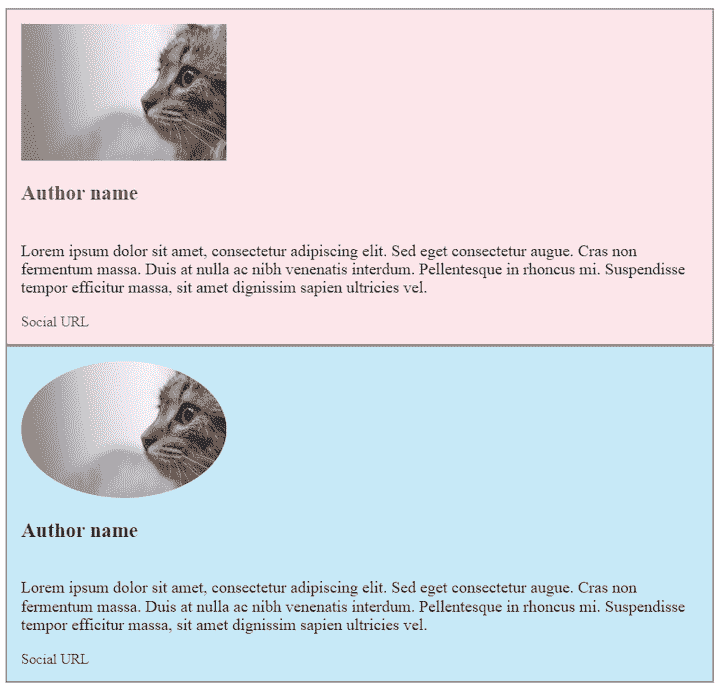
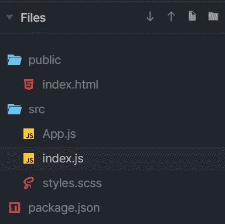
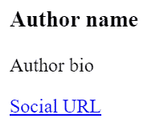
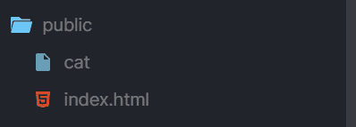
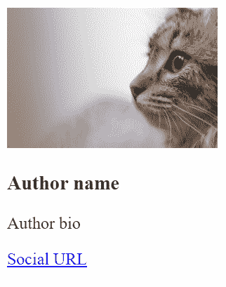
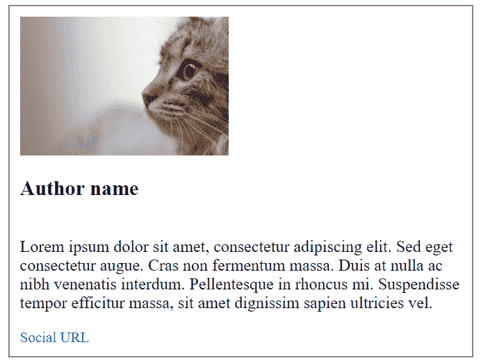
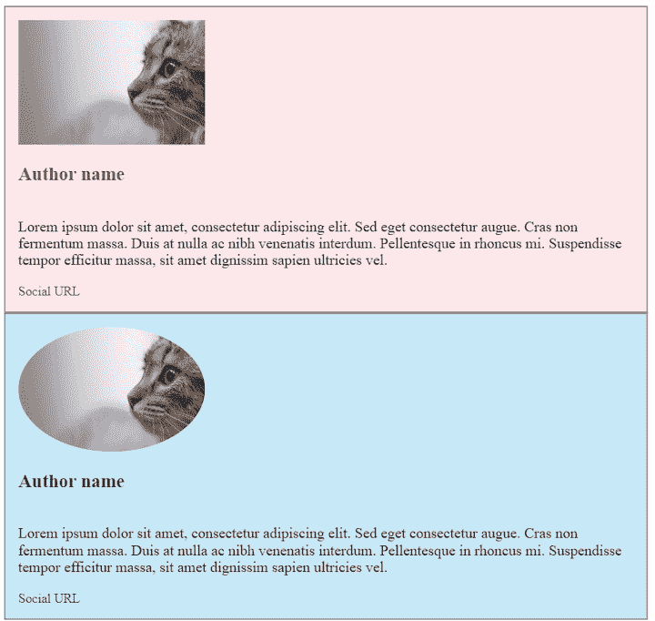
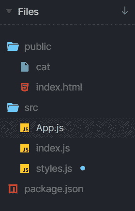
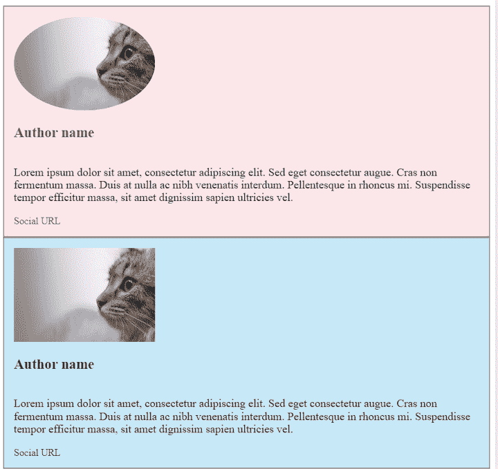
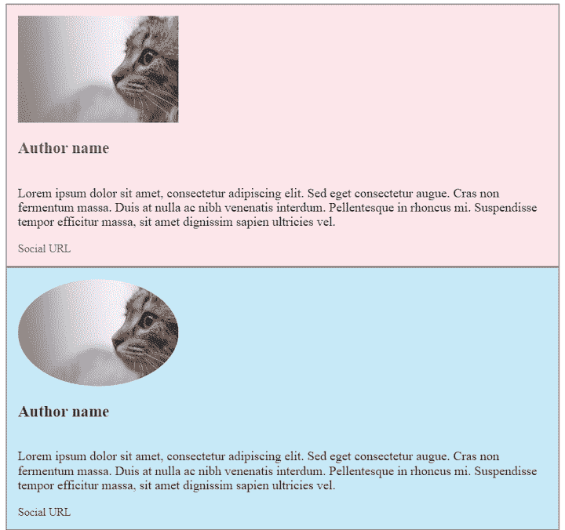

# 从 SCSS 到风格化组件:优点和注意事项

> 原文：<https://blog.logrocket.com/moving-from-scss-to-styled-components-advantages-and-caveats/>

像 React 这样的前端框架已经改变了我们解释关注点分离的方式。根据传统的方法，HTML、CSS 和 JavaScript 都被认为是独立的问题。您的应用程序的标记、样式和行为都被分离并保存在不同的文件中。

另一方面，React 将应用程序分解为同时具有呈现逻辑和 UI 逻辑的组件。这些独立的、可重用的部分被单独编码，但是稍后被组装成组件、模板和页面的组合。

React 组件及其更小的构建块(称为元素)负责您可能期望从 UI 的一部分获得的一切，包括事件处理、状态更改和显示数据。他们通过将 JS 和 HTML 混合到 JSX(一种 JavaScript 的语法扩展)中来实现这一点。

这种标记和行为的混合现在在前端世界被广泛采用，React 是最流行的框架之一。但是当谈到造型时，意见是分裂的:虽然有些人更喜欢[风格的组件](https://blog.logrocket.com/new-in-styled-components-5-0/)，其他人不能放弃[萨斯/SCSS](https://blog.logrocket.com/the-definitive-guide-to-scss/) 。

在本指南中，我们将探讨这两种选择，并评估在 React 应用程序中从 SCSS 迁移到样式化组件的优缺点。

对于可视化表示，我们将在 React 中创建一个作者框，并用两种方式对其进行样式化。您可以在此处找到代码:

我们的成品将是这样的:



让我们开始吧！

## 先决条件

在本教程中，我们将使用 React 来创建组件。虽然您不必熟悉样式化组件或 Sass，但理想情况下，您应该对 JavaScript 和 CSS 有一些实践经验。

## 在无样式的 React 中创建作者框

让我们看看如何在 React 中构建一个没有样式的作者框。

### 步骤 1:安装 React 和依赖项

出于本教程的目的，我们只是使用一个沙箱，但是如果您正在创建一个真正的应用程序，您将需要安装 React、ReactDOM、styled-components 和 Sass。您的项目文件夹应该包括以下文件。



现在让我们开始填充`index.js`文件。首先，将 React 和 styled-components 分别导入到`styles.scss`文件中。

```
import React from "react";
import ReactDOM from "react-dom";
import styled from "styled-components";
import "./styles.scss";
```

我已经注释掉了这两个库，所以我们可以先关注组件的标记。你的`index.js`你应该长这样:

```
import React from "react";
import ReactDOM from "react-dom";
// import styled from "styled-components";
// import "./styles.scss";

import App from "./App";

ReactDOM.render(<App />, document.getElementById("root"));
```

您的`index.html`文件应该包含以下代码。

```
<html>

<head>
  <title>React Exercise</title>
  <meta charset="UTF-8" />
</head>

<body>
  <div id="app"></div>

  <script src="../src/index.js"></script>
</body>

</html>
```

然而，如果您使用上面的小提琴，`index.html`文档看起来会略有不同，所以在使用代码时要注意这一点。

现在我们准备创建`<AuthorBox>`组件。请记住，在 React 中，所有组件都以大写字母开头。

### 第二步:用 JSX 构建作者框的元素

我们的组件将由以下元素组成。

*   作者姓名(`<H3>`)
*   作者简介:(`<p>`)
*   社交网址(`<a href>`)
*   一个作者头像(``)
*   一个包装来装所有这些(`<div>`)

在`App.js` 文件中，添加以下代码。

```
import React from "react";
// import "./styles.scss";

const AuthorBox = () => (
 <div>
   
   <h3>Author name</h3>
   <p>Author bio</p>
   <a href="#socialURL">Social URL</a>
 </div>
);

export default function App() {
 return <AuthorBox />;
}
```

我们从`react`导入 React，这样我们可以使用 JSX 语法。我们将`AuthorBox`组件定义为一个简单的 ES6 arrow 函数，它现在不接受任何参数，输出普通的 HTML 标记。最后，我们将这个组件导出为`App.js`文件的默认导出。

您应该会看到这样的渲染:



在我们开始样式化之前，让我们添加一张图片。对于要在沙箱中显示的图像，我们必须首先将其添加到 public 文件夹中。



您的代码现在应该如下所示:

```
import React from "react";
// import "./styles.scss";

const AuthorBox = () => (
 <div>
   
   <h3>Author name</h3>
   <p>Author bio</p>
   <a href="#socialURL">Social URL</a>
 </div>
);

export default function App() {
 return <AuthorBox />;
}
```

它应该呈现这个:



现在我们可以开始造型了。我们将添加 SCSS 样式，然后将代码重构为样式化组件。

### 第三步:用 SCSS 设计作者框

首先，将样式添加到`styles.scss`文件中。

```
$size-s: 14px;
$size-m: 16px;
$size-l: 20px;
$size-xl: 24px;

.wrapper {
  display: flex;
  flex-flow: column nowrap;
  justify-content: flex-start;
  align-items: flex-start;
  align-content: center;
  padding: 10px;

  &-border {
    border: solid 1px grey;
  }
}

.author {
  &-name {
    font-size: $size-l;
  }

  &-bio {
    font-size: $size-s;
  }

  &-socialUrl {
    text-decoration: none;
    font-size: $size-m;
  }

}
```

下一步是将这些样式添加到元素中。继续更新`AuthorBox`组件。出于演示目的，我在作者简介中添加了一些 lorem ipsum 文本。

```
import React from "react";
import "./styles.scss";

const AuthorBox = () => (
 <div className="wrapper wrapper-border">
   
   <h3 className="author-name">Author name</h3>
   <p className="author-bio">Lorem ipsum dolor sit amet, consectetur adipiscing elit. Sed eget consectetur augue. Cras non fermentum massa. Duis at nulla ac nibh venenatis interdum. Pellentesque in rhoncus mi. Suspendisse tempor efficitur massa, sit amet dignissim sapien ultricies vel.
</p>
   <a className="author-socialUrl" href="#socialURL">
     Social URL
   </a>
 </div>
);

export default function App() {
 return <AuthorBox />;
}
```

您的组件现在应该呈现如下:



如果我们想给作者框分配不同的配色方案呢？假设我们想要一个粉红色的盒子和一个调整了字体颜色的蓝色盒子。我们需要创建额外的类。

```
.background {
 &-pink {
   background-color: pink;

   h3,a {
       color: palevioletred;
   }
 }
  &-blue {
   background-color: skyblue;

   h3,a {
     color: blue;
   }
 }
```

让我们在应用程序输出中复制作者框，这样我们就可以同时看到两种风格。为此，调整`App.js`文件中的默认导出代码。

```
export default function App() {
 return (
   <>
     <AuthorBox />
     <AuthorBox />
   </>in
 );
}
```

注意，现在`AuthorBox`组件被包装在一个`empty`标签中，这是一个 React 片段。

要添加背景颜色，我们需要向`AuthorBox`组件传递一个背景属性。当`AuthorBox`拥有`isPink`属性时，我们将背景设置为粉色，否则设置为蓝色。

```
 const background = `${isPink? "backgroundPink" : "backgroundBlue"}`;
```

我们更新了底部的`AuthorBox`,因此其中一个组件是粉红色的。

```
import React from "react";
import "./styles.scss";
// import classNames from "classnames";

const AuthorBox = ({ isPink }) => {

 const background = `${isPink? "backgroundPink" : "backgroundBlue"}`;

 return (
   <div
     className={`wrapper wrapperBorder ${background}`}
   >
     
     <h3 className="authorName">Author name</h3>
     <p className="authorBio">
       Lorem ipsum dolor sit amet, consectetur adipiscing elit. Sed eget consectetur augue. Cras non fermentum massa. Duis at nulla ac nibh venenatis interdum. Pellentesque in rhoncus mi. Suspendisse tempor efficitur massa, sit amet dignissim sapien ultricies vel.
     </p>
     <a className="authorSocialUrl" href="#socialURL">
       Social URL
     </a>
   </div>
 );
}

export default function App() {
 return (
   <>
     <AuthorBox isPink />
     <AuthorBox />
   </>
 )
}
```

例如，如果我们想在包装器中增加一个类来获得上边距，代码就会变得非常拥挤。

```
<div
     className={`wrapper wrapperBorder ${background} wrapper-margin`}
>
```

最后，我们来把作者形象圆一圆。我们需要添加另一个类，因为我们希望它是一个选项，而不是强制性的。创建一个名为`avatar`的类，并将其添加到``标签中。

```
.avatar{
   border-radius: 50%;
 }

```

我们希望这个类只应用于其中一个容器——比如说蓝色的容器。我们需要调节这个。

```
const AuthorBox = ({ isPink }) => {

 const background = `${isPink? "backgroundPink" : "backgroundBlue"}`;
 const avatar = `${isPink? " " : "avatar"}`;

 return (
   <div
     className={`wrapper wrapperBorder ${background}`}
   >
     
     <h3 className="authorName">Author name</h3>
     <p className="authorBio">
       Lorem ipsum dolor sit amet, consectetur adipiscing elit. Sed eget consectetur augue. Cras non fermentum massa. Duis at nulla ac nibh venenatis interdum. Pellentesque in rhoncus mi. Suspendisse tempor efficitur massa, sit amet dignissim sapien ultricies vel.
     </p>
     <a className="authorSocialUrl" href="#socialURL">
       Social URL
     </a>
   </div>
 );
}

```

以下是我们的最终组件。



虽然这对于这样的小项目来说是完全可以实现的，但是随着代码库的增长，维护风格变得越来越麻烦。让我们看看同样的组件在使用样式化组件时会是什么样子。

### 步骤 4:用样式化组件对作者框进行样式化

我已经从`index.js`和`app.js`文件中复制了代码，但是这次我们的样式将留在`style.js`文件中。



我们如何从 SCSS 重构到样式化组件？首先，我们将调整样式，我们的代码应该如下所示:

```
import styled from "styled-components";

const sizeS = '14px';
const sizeM = '16px';
const sizeL = '20px';

export const Wrapper = styled.div`
 display: flex;
 flex-flow: column nowrap;
 justify-content: flex-start;
 align-items: flex-start;
 align-content: center;
 padding: ${sizeS};
 border: solid 1px grey;
 background-color: ${props => (props.isPink ? "rgb(252, 230, 234)" : "rgb(199, 233, 247)")};
`

export const Avatar = styled.img`
 border-radius: ${props => (props.isRound ? `50%` : ` `)};
`

export const Name = styled.h3`
 font-size: ${sizeL};
 color: ${props => (props.isPink ? "rgb(150, 13, 58)" : "rgb(4, 46, 94)")};
`

export const Bio = styled.p`
 font-size: ${sizeM};
`

export const SocialURL = styled.a`
 text-decoration: none;
 font-size: ${sizeS};
 color: ${props => (props.isPink ? "rgb(150, 13, 58)" : "rgb(4, 46, 94)")};
`

```

这是 34 行代码，而 SCSS 版本是 54 行。

接下来，调整`App.js`文件。

```
import React from "react";
import { Wrapper, Avatar, Name, Bio, SocialURL } from "./styles";

const AuthorBox = ({ isPink, isRound }) => {
 return (
   <Wrapper isPink={isPink}>
     <Avatar isRound={isRound} src="cat" alt="" width="200" />
     <Name isPink={isPink}>Author name</Name>
     <Bio>
       Lorem ipsum dolor sit amet, consectetur adipiscing elit. Sed eget consectetur augue. Cras non fermentum massa. Duis at nulla ac nibh venenatis interdum. Pellentesque in rhoncus mi. Suspendisse tempor efficitur massa, sit amet dignissim sapien ultricies vel.
     </Bio>
     <SocialURL isPink={isPink} href="#socialURL">
       Social URL
     </SocialURL>
   </Wrapper>
 );
};

export default function App() {
 return (
   <>
     <AuthorBox isPink isRound/>
     <AuthorBox />
   </>
 );
}

```

现在我们有 29 行代码，而不是 SCSS 版本的 36 行。

组件应该呈现如下:



如果您使用切换功能，样式化的组件甚至可以更整洁，但是通过这个设置，您可以看到混合和匹配组件和属性是多么容易。如果希望蓝色版本中的头像是圆形的，只需将`isRound`属性传递给第二个组件即可。

```
export default function App() {
 return (
   <>
     <AuthorBox isPink />
     <AuthorBox isRound />
   </>
 );
}

```



## SCSS 与风格化组件

样式化组件使您能够将 UI 与组件的功能和状态完全分离。但是他们真的比萨斯/SCSS 好吗？让我们比较一下这两个库的优缺点。

### 覆盖样式和命名约定

由于样式化组件没有任何全局范围的选择器，所以您不需要担心冲突和样式相互覆盖。虽然 Sass 带来了嵌套和变量等不错的升级，但它更有可能导致覆盖样式。

样式化组件在命名上非常简单。对于萨斯/SCSS——无论是否与边界元法结合——有很多来回寻找正确的类。您可以想象在一个大型项目中确定什么覆盖什么是一个多么大的挑战。

此外，在 Sass 样式表的情况下，当您开始添加类时，代码很快变得拥挤，特别是如果您希望额外的样式对用户来说是可选的。

### 定制和重用

风格化组件比那些用 Sass 风格化的组件更容易重用。如果你想在两个更高级的组件之间或者甚至在两个应用程序之间共享一个组件，你可以确保逻辑和样式保持一致。

它们也很容易定制，只需传递额外的道具。对道具的大小和颜色等属性进行调整的能力使样式更加动态，在大型项目中也更容易处理。

### 性能和缓存

样式化组件只有在组件在屏幕上时才会被渲染，而 Sass 在大多数情况下都会被处理，尽管这是可以控制的。

这是样式化组件的一个要点，但这种情况下的缺点是，一旦样式被解析，所有的代码都被添加到`index.html`文件中，没有办法将 CSS 与其他部分分开。

样式化组件的另一个缺点是类名是动态生成的，这会导致构建或呈现之间的缓存问题。使用 Sass，这个问题就不存在了。

### 排除故障

确定样式组件范围的方法在可重用性和定制方面更优越，但是因为组件更通用，所以调试它们会更困难。

此外，由于所有的条件和逻辑与风格混在一起，它们也更难阅读。使用 Sass/SCSS，输出是普通的 CSS，调试更容易。

### 学习曲线和遗留代码

风格化组件的学习曲线比萨斯/SCSS 的更陡峭，并且不是所有的开发人员都喜欢将 CSS 和 JS 混合使用。但是对于样式化组件，你仍然可以使用普通的 CSS。你不能灵活地用 Sass 做两件事。

最后，Sass 更可能出现在遗留项目中。将两个库集成到一个应用程序中可能会令人困惑。尽管样式化组件提供了无数的优势，但是比起样式化组件的新奇，一些开发人员更喜欢 Sass 的稳定性和更通用的特性。

## 你的前端是否占用了用户的 CPU？

随着 web 前端变得越来越复杂，资源贪婪的特性对浏览器的要求越来越高。如果您对监控和跟踪生产环境中所有用户的客户端 CPU 使用、内存使用等感兴趣，

[try LogRocket](https://lp.logrocket.com/blg/css-signup)

.

[](https://lp.logrocket.com/blg/css-signup)[https://logrocket.com/signup/](https://lp.logrocket.com/blg/css-signup)

LogRocket 就像是网络和移动应用的 DVR，记录你的网络应用或网站上发生的一切。您可以汇总和报告关键的前端性能指标，重放用户会话和应用程序状态，记录网络请求，并自动显示所有错误，而不是猜测问题发生的原因。

现代化您调试 web 和移动应用的方式— [开始免费监控](https://lp.logrocket.com/blg/css-signup)。