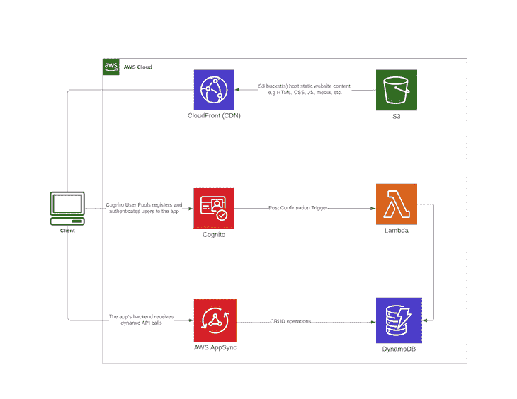
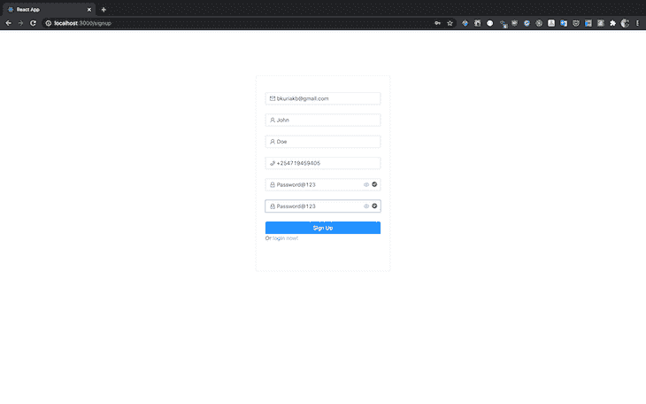
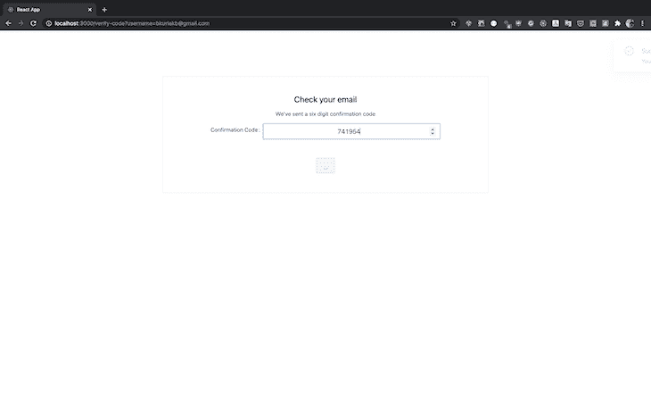
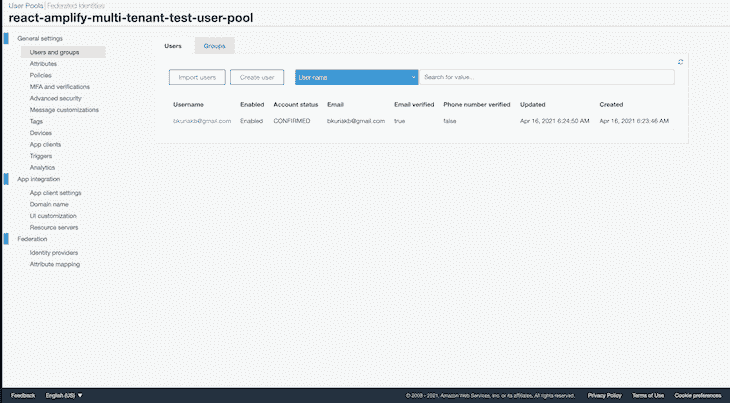
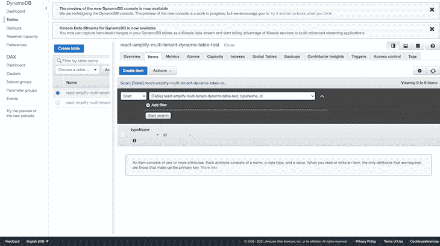
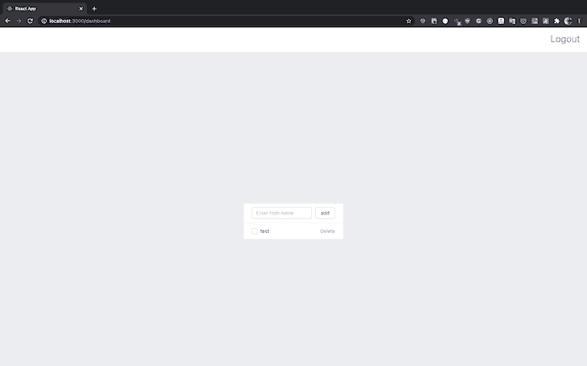
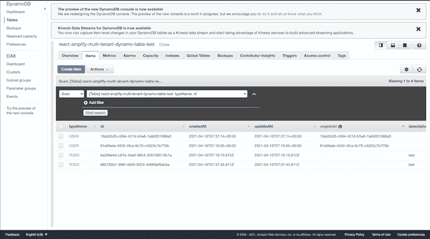

# 使用 React frontend 构建多租户 Amplify 应用程序

> 原文：<https://blog.logrocket.com/multi-tenant-amplify-app-react-frontend/>

## 介绍

软件即服务(SaaS)模型中的一个关键实体是租户，即任何注册使用给定服务的客户。

“房客”一词来自于租用有形财产的概念。租户支付租金来占用空间，但他们并不拥有财产。类似地，对于 SaaS 的产品，客户付费获得服务，但他们并不拥有提供服务的软件。

有多种[租赁模式](https://docs.microsoft.com/en-us/azure/architecture/isv/application-tenancy)可供选择，即:

1.  **单一租户**:为每个客户部署一个应用程序的单一专用实例
2.  **多租户**:为所有客户部署应用程序的单个实例，并在他们之间共享
3.  **混合租户**:应用程序的一个或多个部分被部署为专用于每个客户，其余部分在所有客户之间共享

使用我在前面两篇文章中提到的原则(链接如下)，我们将重点关注多租户模型，并使用 AWS 建立一个具有单个多租户数据库的多租户 SaaS 应用程序。我们将使用以下 AWS 资源:

## 体系结构

不管你的经验水平如何，在试图弄清楚一个应用程序是如何工作的同时查看代码库是一项单调乏味的任务。由于人类更容易与视觉内容联系起来，我绘制了下面的架构图来展示我们的待办事项应用程序将如何工作:



Multi-tenant to-do app architecture diagram.

理论上，React 客户端包含使用 Amplify 库执行的登录功能。一旦用户成功注册，Cognito post 确认触发器就会执行一个 Lambda 函数，接收包含新注册用户信息的有效载荷。

Lambda 代码将新创建的用户保存到 DynamoDB，从而允许我们在使用 Cognito 进行授权时将所有新创建的用户配置文件存储在 DynamoDB 下。DynamoDB 项目将具有以下结构:

```
Item: {
    createdAt: {
        S: "timestamp here",
    },
    updatedAt: {
        S: "timestamp here",
    },
    typeName: { S: "USER" },
    id: { S: "unique id" },
    cognitoId: { S: "cognito id gotten from the post confirmation trigger payload" },
    email: { S: "user email"},
    phoneNumber: { S: "user phone number" },
}
```

当新用户登录时，他们将可以访问 React 前端上的 AppSync GraphQL API，这允许对待办事项进行 CRUD 操作。使用 AppSync 中创建的映射模板将创建的项目保存到 DynamoDB。这些允许将有效负载从方法请求映射到相应的集成请求，以及从集成响应映射到相应的方法响应。

## 数据库设计

多租户数据库的模式必须有一个或多个租户标识符列，以便可以有选择地检索来自任何给定租户的数据。为此，我们可以使用 DynamoDB 提供的[单表设计](https://www.alexdebrie.com/posts/dynamodb-single-table/),以实现我们的目标，即使用复合主键作为惟一标识符来建立多租户数据库。

DynamoDB 有两种不同的[主键](https://docs.aws.amazon.com/amazondynamodb/latest/developerguide/HowItWorks.CoreComponents.html#HowItWorks.CoreComponents.PrimaryKey)，即分区键和复合主键(分区键和排序键)。我们将定义一个复合主键，用`id`作为分区键，用`typeName`作为排序键。

DynamoDB 并不是处理关系数据的最佳解决方案，但是正如 Alex DeBrie 关于在 DynamoDB 中建模一对多关系的文章所描述的:

> DynamoDB 有时被认为只是一个简单的键值存储，但事实并非如此。DynamoDB 可以处理复杂的访问模式，从高度相关的数据模型到时间序列数据甚至是地理空间数据。

在我们的例子中，有一个一对多的关系，一个`User`可以拥有许多`ToDo`项。

## 在代码上

既然我们已经讨论了本文的理论部分，我们可以继续代码了。

正如在引言中提到的，我们将使用从我的前两篇文章中学到的知识为我们的应用程序提供一个真实的例子。为了避免重复，我只包括了我们将在本文中添加的新功能，并省略了前几篇文章中已经介绍过的一些部分。

### 项目设置

在您的首选目的地为我们的项目添加一个新文件夹，并创建一个名为`backend`的新的无服务器项目。然后，在同一个目录下使用 [Create React app](https://blog.logrocket.com/getting-started-with-create-react-app-d93147444a27/) 引导一个 React App，并将其命名为`client`。这会产生以下目录结构:

```
$ tree . -L 2 -a
.
├── backend
└── client
```

导航到无服务器文件夹并安装这些依赖项:

```
$ yarn add serverless-appsync-plugin serverless-stack-output serverless-pseudo-parameters serverless-webpack
```

仍然在`backend`文件夹中，创建一个`schema.yml`文件并添加以下模式:

```
type ToDo {
  id: ID
  description: String!
  completed: Boolean
  createdAt: AWSDateTime
  updatedAt: AWSDateTime
  user: User
}

type User {
  id: ID
  cognitoId: ID!
  firstName: String
  lastName: String
  email: AWSEmail
  phoneNumber: AWSPhone
  createdAt: AWSDateTime
  updatedAt: AWSDateTime
}

input ToDoUpdateInput {
  id: ID!
  description: String
  completed: Boolean
}

type Mutation {
  createTodo(input: ToDoCreateInput): ToDo
  updateTodo(input: ToDoUpdateInput): ToDo
  deleteTodo(id: ID!): ToDo
}

type Query {
  listToDos: [ToDo!]
  listUserTodos(id: ID): [ToDo!]
  getToDo(id: ID): ToDo
  profile: User!
}

schema {
  query: Query
  mutation: Mutation
}
```

## 供应和创建我们的无服务器资源

### DynamoDB

在名为`resources`的文件夹中创建一个新文件:

```
$ mkdir resources && touch resources/dynamo-table.yml
```

打开文件并添加以下 CloudFormation 模板，它定义了我们的 DynamoDB 配置:

```
Resources:
  PrimaryDynamoDBTable:
    Type: AWS::DynamoDB::Table
    Properties:
      AttributeDefinitions: 
        - AttributeName: typeName
          AttributeType: S
        - AttributeName: id
          AttributeType: S
      KeySchema: # Hash Range key
        - AttributeName: typeName
          KeyType: HASH
        - AttributeName: id
          KeyType: RANGE
      BillingMode: PAY_PER_REQUEST
      TableName: ${self:custom.resources.PRIMARY_TABLE}
      TimeToLiveSpecification:
        AttributeName: TimeToLive,
        Enabled: True
      GlobalSecondaryIndexes:
        - IndexName: GSI1
          KeySchema:
            - AttributeName: typeName
              KeyType: HASH
          Projection:
            ProjectionType: ALL
```

### 认知用户池

在 resources 文件夹中为 Cognito 用户池创建一个新的配置文件:

```
$ mkdir resources && touch resources/cognito-userpool.yml
```

打开该文件并添加以下 CloudFormation 模板，该模板定义了用户池配置:

```
Resources:
  CognitoUserPoolToDoUserPool:
    Type: AWS::Cognito::UserPool
    Properties:
      AdminCreateUserConfig:
        AllowAdminCreateUserOnly: FALSE
      AutoVerifiedAttributes:
        - email
      Policies:
        PasswordPolicy:
          MinimumLength: 7
          RequireLowercase: True
          RequireNumbers: True
          RequireSymbols: True
          RequireUppercase: True
      Schema:
        - Name: email
          AttributeDataType: String
          Mutable: false
          Required: true
        - Name: phone_number
          Mutable: true
          Required: true
      UserPoolName: ${self:service}-${self:provider.stage}-user-pool
  CognitoUserPoolClient:
    Type: "AWS::Cognito::UserPoolClient"
    Properties:
      ClientName: ${self:service}-${self:provider.stage}-user-pool-client
      GenerateSecret: false
      UserPoolId:
        Ref: CognitoUserPoolToDoUserPool
Outputs:
  UserPoolId:
    Value:
      Ref: CognitoUserPoolToDoUserPool
  UserPoolClientId:
    Value:
      Ref: CognitoUserPoolClient
```

### 映射模板

下面，我将分解给之前构建的待办事项应用添加授权带来的新功能。你可以在这里查看其余的映射模板[，因为它们是不言自明的。](https://github.com/brayoh/amplify-multi-tenant-react/tree/main/backend/mapping-templates)

#### `create_todo.vtl`

回头看看我们的模式，待办事项有一个名为`user`的字段，它将包含拥有该项目的用户的 Cognito ID。我们从`identity`对象中获得`id`，这是用户的认知档案。

创建映射模板文件:

```
$ mkdir mapping-templates/create_todo && touch mapping-templates/create_todo/request.vtl
```

添加以下代码:

```
$util.qr($ctx.args.input.put("createdAt", $util.time.nowISO8601()))
$util.qr($ctx.args.input.put("updatedAt", $util.time.nowISO8601()))
{
  "version" : "2017-02-28",
  "operation" : "PutItem",
  "key" : {
    "id": $util.dynamodb.toDynamoDBJson($util.autoId()),
    "typeName": $util.dynamodb.toDynamoDBJson("TODO"),
    "user" : { "S" : "${context.identity.sub}" }
  },
  "attributeValues" : $util.dynamodb.toMapValuesJson($ctx.args.input)
}
```

#### `get_user_todos.vtl`

创建映射模板文件:

```
$ mkdir mapping-templates/get_user_todos && touch mapping-templates/get_user_todos/request.vtl
```

添加以下代码:

```
{
  "version" : "2017-02-28",
  "operation" : "GetItem",
  "key" : {
    "id" : { "S" : "${context.source.user}" },
    "typeName": $util.dynamodb.toDynamoDBJson("USER")
  },
}
```

#### `list_user_todos.vtl`

再次创建映射模板文件:

```
$ mkdir mapping-templates/list_user_todos && touch mapping-templates/list_user_todos/request.vtl
```

并添加以下代码:

```
{
  "version" : "2017-02-28",
  "operation" : "Query",
  "query" : {
    "expression": "#typeName = :typeName",
    "expressionNames": {
      "#typeName": "typeName"
    },
    "expressionValues" : {
      ":typeName" : $util.dynamodb.toDynamoDBJson("TODO")
    }
  },
  "filter": {
    "expression": "#user = :user",
    "expressionNames": {
      "#user": "user"
    },
    "expressionValues": {
      ":user" : { "S" : "${context.identity.sub}" }
    }
  },
}
```

因为我们在一个`User`和`ToDo`条目之间有一对多的关系，为了获取特定用户创建的所有待办事项，我们使用`Query`方法获取数据库中的所有条目，然后过滤条目并返回包含与用户的 Cognito ID 相同的用户属性的待办事项。

### λ函数

接下来，我们将设置 Lambda 函数，负责将新注册的用户保存到 DynamoDB。一旦用户确认了他们的电子邮件，当 Cognito post 确认触发器被调用时，该功能被执行。

创建文件:

```
$ touch handler.ts
```

添加以下代码:

```
import * as moment from "moment";
import { v4 as uuidv4 } from "uuid";
import { DynamoDB } from "aws-sdk";

const ddb = new DynamoDB({ apiVersion: "2012-10-08" });

export const cognitoPostConfirmation = async (event, context, callback) => {
  try {
    const userParams = {
      TableName: process.env.PRIMARY_TABLE, // gotten from serverless deployment
      Item: {
        createdAt: {
          S: moment().format("YYYY-MM-DDThh:mm:ssZ"),
        },
        updatedAt: {
          S: moment().format("YYYY-MM-DDThh:mm:ssZ"),
        },
        typeName: { S: "USER" },
        id: { S: uuidv4() },
        cognitoId: { S: event.request.userAttributes.sub },
        email: { S: event.request.userAttributes.email },
        phoneNumber: { S: event.request.userAttributes.phone_number },
      },
    };
    // @ts-ignore
    await ddb.putItem(userParams).promise();
    return callback(null, event);
  } catch (error) {
    return callback(error);
  }
};
```

### 添加类型脚本支持

因为我们为 Lambda 函数创建了一个`.ts`文件，所以我们需要通过创建一个`tsconfig.json`文件和一个`webpack.config.js`文件来为无服务器项目添加类型脚本支持:

```
$ touch tsconfig.json webpack.config.js
```

```
//tsconfig.json

{
  "compilerOptions": {
    "allowSyntheticDefaultImports": true,
    "module": "commonjs",
    "removeComments": false,
    "preserveConstEnums": true,
    "sourceMap": true,
    "skipLibCheck": true,
    "resolveJsonModule": true,
    "lib": ["esnext"]
  }
}
```

```
//webpack.config.js

const slsw = require("serverless-webpack");
const nodeExternals = require("webpack-node-externals");
module.exports = {
  entry: slsw.lib.entries,
  target: "node",
  // Generate sourcemaps for proper error messages
  devtool: "source-map",
  // Since "aws-sdk" is not compatible with webpack,
  // we exclude all node dependencies
  externals: [nodeExternals()],
  mode: slsw.lib.webpack.isLocal ? "development" : "production",
  optimization: {
    // We no not want to minimize our code.
    minimize: false,
  },
  performance: {
    // Turn off size warnings for entry points
    hints: false,
  },
  resolve: {
    extensions: [".ts"],
  },
  // Run babel on all .js files and skip those in node_modules
  module: {
    rules: [
      {
        test: /\.ts(x?)$/,
        exclude: /node_modules/,
        use: [
          {
            loader: "ts-loader",
          },
        ],
      },
    ],
  },
};
```

## 部署无服务器项目

现在我们已经完成了所有资源的创建，我们将把所有的东西放在一起，并将其添加到`serverless.yml`文件中，如下所示:

```
service: react-amplify-multi-tenant
app: amplify-multi-tenant
frameworkVersion: "2"
provider:
  name: aws
  runtime: nodejs12.x
  lambdaHashingVersion: 20201221
  region: eu-west-1 
  stage: ${opt:stage, 'dev'}
  environment:
    PRIMARY_TABLE: ${self:custom.resources.PRIMARY_TABLE}
plugins:
  - serverless-appsync-plugin
  - serverless-stack-output
  - serverless-pseudo-parameters
  - serverless-webpack
custom:
  webpack:
    webpackConfig: ./webpack.config.js # typescript support
    includeModules: true
  resources:
    PRIMARY_TABLE: ${self:service}-dynamo-table-${self:provider.stage}
    PRIMARY_BUCKET: ${self:service}-primary-bucket-${self:provider.stage}
    WEB_HOSTING_BUCKET: ${self:service}-web-hosting-bucket-${self:provider.stage}
  output:
    handler: ./scripts/output.handler
    file: ../client/src/aws-exports.json
  appSync: # appsync plugin configuration
    name: ${self:service}-appsync-${self:provider.stage}
    authenticationType: AMAZON_COGNITO_USER_POOLS
    additionalAuthenticationProviders:
      - authenticationType: API_KEY
    dataSources:
      - type: AMAZON_DYNAMODB
        name: PrimaryTable
        description: "Primary Table"
        config:
          tableName: ${self:custom.resources.PRIMARY_TABLE}
          serviceRoleArn: { Fn::GetAtt: [AppSyncDynamoDBServiceRole, Arn] }
    userPoolConfig:
      awsRegion: ${self:provider.region}
      defaultAction: ALLOW
      userPoolId: { Ref: CognitoUserPoolToDoUserPool } # name of the resource
    logConfig:
      loggingRoleArn: { Fn::GetAtt: [AppSyncLoggingServiceRole, Arn] }
      level: ALL
    mappingTemplates:
      - dataSource: PrimaryTable
        type: Mutation
        field: createTodo
        request: "create_todo/request.vtl"
        response: "common-item-response.vtl"
      - dataSource: PrimaryTable
        type: Mutation
        field: updateTodo
        request: "update_todo/request.vtl"
        response: "common-item-response.vtl"
      - dataSource: PrimaryTable
        type: Mutation
        field: deleteTodo
        request: "delete_todo/request.vtl"
        response: "common-item-response.vtl"
      - dataSource: PrimaryTable
        type: Query
        field: getToDo
        request: "get_todo/request.vtl"
        response: "common-item-response.vtl"
      - dataSource: PrimaryTable
        type: Query
        field: getUser
        request: "get_user/request.vtl"
        response: "common-item-response.vtl"
      - dataSource: PrimaryTable
        type: Query
        field: listUserTodos
        request: "list_user_todos/request.vtl"
        response: "common-items-response.vtl"
      - dataSource: PrimaryTable
        type: ToDo
        field: user
        request: "get_todo_user/request.vtl"
        response: "common-item-response.vtl"
functions:
  cognitoPostConfirmation:
    handler: handler.cognitoPostConfirmation
    events: # cognito post confirmation trigger
      - cognitoUserPool:
          pool: CognitoUserPoolToDoUserPool
          trigger: PostConfirmation
resources:
  - ${file(./resources/appsync-dynamo-role.yml)}
  - ${file(./resources/dynamo-table.yml)}
  - ${file(./resources/web-hosting-bucket.yml)}
  - ${file(./resources/cognito-userpool.yml)}
```

然后我们部署:

```
$ sls deploy --stage=dev
```

## 构建前端客户端

既然我们的后端已经设置和部署好了，我们将继续到前端客户端来演示上面的逻辑是如何组合在一起的。

我们将为 UI 组件使用 [Ant Design](https://ant.design/) ，为了验证用户密码，我们将使用一个密码验证器。我们在设置用户池时添加了密码要求，如下所示:

*   最少八个字符
*   至少一个大写字母
*   至少一个小写字母
*   至少一个符号
*   至少一位数字

在成功验证所有必需的用户详细信息后，我们将有效负载发送到 Cognito API，它将验证码发送到用户的电子邮件，并在`UserPool`中创建一个新用户:

```
  const onFinish = (values: any) => {
    const { firstName, lastName, email, phoneNumber, password } = values;
    // hide loader
    toggleLoading(false);
    Auth.signUp({
      username: email,
      password,
      attributes: {
        email,
        name: `${firstName} ${lastName}`,
        phone_number: phoneNumber,
      },
    })
      .then(() => {
        notification.success({
          message: "Successfully signed up user!",
          description:
            "Account created successfully, Redirecting you in a few!",
          placement: "topRight",
          duration: 1.5,
          onClose: () => {
            updateUsername(email);
            toggleRedirect(true);
          },
        });
      })
      .catch((err) => {
        notification.error({
          message: "Error",
          description: "Error signing up user",
          placement: "topRight",
          duration: 1.5,
        });
        toggleLoading(false);
      });
  };
```

导航到注册路径并创建一个新用户:



User registration page.

检查您的电子邮件中是否有新的确认码，并按如下方式添加:



Entering email confirmation code.

验证后，您的用户池现在应该在“用户和组”下有一个新用户列表:



Cognito user pool.

当一个新用户注册时，我们设置的 post 确认触发器接收到一个包含用户注册数据的有效负载，然后我们将它作为用户记录保存到 DynamoDB。打开 AWS 控制台，导航到 [DynamoDB](https://eu-west-1.console.aws.amazon.com/dynamodb/home?region=eu-west-1) ，并选择新创建的表。您应该保存一个新的用户记录，其中包含注册过程的详细信息:



接下来，您现在可以使用新的凭据登录，之后您将被重定向到仪表板页面，在这里您可以创建、编辑和删除新的待办事项。因为本文是为了演示，我们将添加一个包含所有 CRUD 逻辑的组件文件:

```
const DataList = () => {
  const [description, updateDescription] = React.useState("");
  const [updateToDoMutation] = useMutation(updateToDo);
  const [createToDoMutation] = useMutation(createToDo);
  const [deleteToDoMutation] = useMutation(deleteToDo);
  const { loading, error, data } = useQuery(listUserToDos);

  function handleCheck(event: CheckboxChangeEvent, item: ToDo) {
    updateToDoMutation({
      variables: { input: { completed, id: item.id } },
      refetchQueries: [
        {
          query: listUserToDos,
        },
      ],
    })
      .then((res) => message.success("Item updated successfully"))
      .catch((err) => {
        message.error("Error occurred while updating item");
      });
  }

  function handleSubmit(event: React.FormEvent) {
    event.preventDefault();
    createToDoMutation({
      variables: { input: { description } },
      refetchQueries: [
        {
          query: listUserToDos,
        },
      ],
    })
      .then((res) => message.success("Item created successfully"))
      .catch((err) => {
        message.error("Error occurred while creating item");
      });
  }

  function handleKeyPress(event: React.KeyboardEvent) {
    if (event.key === "Enter") {
      // user pressed enter
      createToDoMutation({
        variables: { input: { description } },
        refetchQueries: [
          {
            query: listUserToDos,
          },
        ],
      })
        .then((res) => {
          message.success("Item created successfully");
        })
        .catch((err) => {
          message.error("Error occurred while creating item");
        });
    }
  }

  function handleDelete(item: ToDo) {
    deleteToDoMutation({
      variables: { id: item.id },
      refetchQueries: [
        {
          query: listUserToDos,
        },
      ],
    })
      .then((res) => {
        message.success("Deleted successfully");
      })
      .catch((err) => {
        message.error("Error occurred while deleting item");
      });
  }

  if (loading) {
    return (
      <CenterContent>
        <LoadingOutlined style={{ fontSize: 50 }} spin />
      </CenterContent>
    );
  }

  if (error) {
    return <div>{`Error! ${error.message}`}</div>;
  }

  return (
    <ListContainer>
      <List
        header={
          <div style={{ display: "flex" }}>
            <Input
              placeholder="Enter todo name"
              value={description}
              onChange={(event) => updateDescription(event.target.value)}
              style={{ marginRight: "10px" }}
              onKeyDown={handleKeyPress}
            />
            <Button name="add" onClick={handleSubmit}>
              add
            </Button>
          </div>
        }
        bordered
        dataSource={data.listUserTodos}
        renderItem={(item: ToDo) => (
          <List.Item>
            <Checkbox
              checked={item.completed}
              onChange={(event: CheckboxChangeEvent) =>
                handleCheck(event, item)
              }
            >
              {item.description}
            </Checkbox>
            <Popconfirm
              title="Are you sure to delete this item?"
              onConfirm={() => handleDelete(item)}
              okText="Yes"
              cancelText="No"
            >
              <DeleteAction>Delete</DeleteAction>
            </Popconfirm>
          </List.Item>
        )}
      />
    </ListContainer>
  );
};
```

现在，添加一个新项目:



Dashboard for adding new to-do item.

导航到 DynamoDB 仪表板，查看新创建的待办事项。因为我们对数据库使用单表设计，所以用户和待办事项记录都存储在同一个表中，如下所示:



为了测试上述应用程序的多租户模型，请导航到您的终端并部署一个具有不同 stage 名称的新实例。该部署将提供新的独立资源，包括新的数据库和 Cognito 用户池。

```
$ sls deploy --stage=new_stage_name
```

## 结论

我希望你喜欢这篇文章，并且你学到了一些新的东西。正如所展示的，构建一个多租户应用程序可能是相当具有挑战性的，因为没有一刀切的方法；这需要大量的预先规划和选择最适合您的解决方案。

为了保持文章的简短和可读性，我不得不省略一些代码，但是你可以[在这里](https://github.com/brayoh/amplify-multi-tenant-react)查看回购，如果有任何事情不像你预期的那样工作，请提出问题，我会花时间来研究它。编码快乐！

## [LogRocket](https://lp.logrocket.com/blg/react-signup-general) :全面了解您的生产 React 应用

调试 React 应用程序可能很困难，尤其是当用户遇到难以重现的问题时。如果您对监视和跟踪 Redux 状态、自动显示 JavaScript 错误以及跟踪缓慢的网络请求和组件加载时间感兴趣，

[try LogRocket](https://lp.logrocket.com/blg/react-signup-general)

.

[ ](https://lp.logrocket.com/blg/react-signup-general) [](https://lp.logrocket.com/blg/react-signup-general) 

LogRocket 结合了会话回放、产品分析和错误跟踪，使软件团队能够创建理想的 web 和移动产品体验。这对你来说意味着什么？

LogRocket 不是猜测错误发生的原因，也不是要求用户提供截图和日志转储，而是让您回放问题，就像它们发生在您自己的浏览器中一样，以快速了解哪里出错了。

不再有嘈杂的警报。智能错误跟踪允许您对问题进行分类和归类，然后从中吸取教训。获得有影响的用户问题的通知，而不是误报。警示越少，信号就越有用。

LogRocket Redux 中间件包为您的用户会话增加了一层额外的可见性。LogRocket 记录 Redux 存储中的所有操作和状态。

现代化您调试 React 应用的方式— [开始免费监控](https://lp.logrocket.com/blg/react-signup-general)。