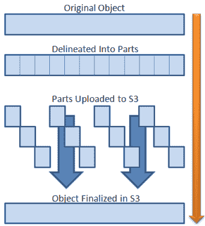

# 在 Node.js 和 React 中使用 S3 进行多部分上传

> 原文：<https://blog.logrocket.com/multipart-uploads-s3-node-js-react/>

在云存储中存储文件现在是一个标准，允许用户上传文件是一个 web 应用程序的常见功能。具体来说，文件通常上传到服务器，然后上传到云存储服务，或者直接上传到云存储服务。当处理小文件时，这是一个容易完成的任务。另一方面，当上传大文件时，会变得很有挑战性。

这就是为什么 [AWS 云存储](https://aws.amazon.com/what-is-cloud-storage/)和其他类似亚马逊 S3 的云存储服务支持多部分上传。这种技术允许你把一个文件分割成几个小块，然后按顺序或并行上传，使你能够简洁地处理大文件。

首先，让我们了解什么是多部分上传，它是如何工作的，以及为什么它的最佳方法涉及 S3 预签名的网址。然后，让我们看看如何通过 Node.js 和 React 中内置的演示应用程序实现开始多部分上传所需的一切，包括后端和前端。

## 先决条件

您需要以下先决条件来复制本文的示例:

*   有效的 S3 凭据
*   Node.js 和 npm 5.2+版本
*   反应> = 17.x
*   [AWS-SDK](https://www.npmjs.com/package/aws-sdk)= 2 . x

`aws-sdk`是 AWS SDK for JavaScript，您可以使用以下 npm 命令安装它:

```
npm install --save aws-sdk

```

## 什么是多部分上传？

正如亚马逊 S3 文档中的[所解释的，多部分上传允许你上传单个对象作为一组部分，它通常用于大文件。这种技术允许你把一个文件分割成许多部分，然后并行上传，在你需要的时候暂停和恢复操作，甚至在知道一个对象的全局大小之前就开始上传它。](https://docs.aws.amazon.com/AmazonS3/latest/userguide/mpuoverview.html)

换句话说，多部分上传可以更快、更可控、更灵活地上传到任何类似亚马逊 S3 的云存储中。

### 多部分上传是如何工作的？

上传完你对象的所有部分，你要告诉你的云存储，操作已经完成。然后，上传的数据将作为单个对象呈现，等同于上传的文件。

因此，这是多部分上传请求中涉及的步骤:

1.  将一个物体分割成许多部分
2.  启动多部分上传过程
3.  上传每个零件
4.  完成多部分上传过程

[](https://aws.amazon.com/blogs/aws/amazon-s3-multipart-upload/)

这种上传方法通常用在前端，让用户可以上传大文件。详细地说，[官方文档](https://aws.amazon.com/premiumsupport/knowledge-center/s3-upload-large-files/)推荐对任何大于 1GB 的文件使用多部分方法。但是请注意，您可以对任何文件使用多部分上传，无论其大小如何。

### 多部分上传与 S3 预签名的网址

多部分上传的最佳前端方法包括预先签名的 URL。一个 [S3 预签名 URL](https://docs.aws.amazon.com/AmazonS3/latest/userguide/ShareObjectPreSignedURL.html) 是一个用 AWS 访问密钥签名的 URL，该密钥临时授予你对特定 S3 对象的受限访问。使用 S3 预签名的 URL，您可以在预定义的时间限制内执行 GET 或 PUT 操作。默认情况下，S3 预签名的 URL 将在 15 分钟后过期。

S3 预签名的 URL 特别有用，因为它们允许您保持您的 S3 凭证和存储桶私有，只在有限的时间内授予对资源的访问权。你所要做的就是在你的后端生成它们，然后把它们提供给前端。

因此，预先签名的网址是一种安全的方式上传任何类型的文件到你的 S3 桶。此外，它们允许您避免创建和管理角色，以及更改 [bucket ACL](https://docs.aws.amazon.com/AmazonS3/latest/userguide/acl-overview.html) 或为用户提供上传文件的特殊帐户。

可以想象，当涉及到多部分上传时，它们特别有用。这是因为您可以为原始对象被分割成的每个部分生成一个预签名的 URL，然后上传该部分及其各自的 URL。

如果你想遵循一种涉及预签名 URL 的多部分上传方法，你必须考虑一个新的步骤。这是所有必需步骤的列表:

1.  将一个物体分割成许多部分
2.  启动多部分上传过程
3.  为每个部分创建预签名的 URL
4.  通过预先签名的 URL 上传每个部分
5.  完成多部分上传过程

现在，让我们深入研究多部分上传的预签名 URL 方法的优缺点。

#### 赞成的意见

*   它具有多部分上传的所有优点，例如由于并行上传而提高了吞吐量，由于每个部分都很小，与整个文件相比更容易重新发送，因此在出现网络问题时可以快速恢复，以及暂停和恢复对象上传的能力
*   它本质上是安全的
*   它消除了具有特殊限制的角色或帐户的需要
*   这是一种易于维护和理解的多部分上传方法

#### 骗局

*   它涉及额外的逻辑，包括后端和前端
*   它要求你预先知道对象的大小，以生成所有预签名的 URL

## 使用 S3 预签名 URL 实现多部分上传

您可以克隆支持本文的 [GitHub 存储库，并通过启动以下命令立即尝试演示应用程序:](https://github.com/Tonel/multipart-upload-js-demo)

```
git clone https://github.com/Tonel/multipart-upload-js-demo
cd multipart-upload-js-demo
npm i
npm backend:start
npm frontend:start

```

为了让应用程序工作，您必须处理留在`/backend/controllers/upload.js`文件中的“TODO ”,要求您在代码中添加您的`S3`凭证。

否则，继续按照这个循序渐进的教程来学习如何构建它以及它是如何工作的。

### Node.js 中的多部分上传

要在 S3 实现多部分上传签名的 URL，您需要三个 API。但是首先，您需要一个`[AWS.S3](https://docs.aws.amazon.com/AWSJavaScriptSDK/latest/AWS/S3.html)`实例。

您可以使用您的 S3 凭证和`aws-sdk`库初始化它，如下所示:

```
const AWS = require("aws-sdk")

const s3Endpoint = new AWS.Endpoint("<YOUR_ENDPOINT>")

const s3Credentials = new AWS.Credentials({
  accessKeyId: "<YOUR_ACCESS_KEY>",
  secretAccessKey: "<YOUR_SECRET_KEY>",
})

const s3 = new AWS.S3({
  endpoint: s3Endpoint,
  credentials: s3Credentials,
})

```

现在，让我们更深入地研究如何构建三个 API 来实现多部分上传:

*   发布`/uploads/initializeMultipartUpload`

    ```
    async function initializeMultipartUpload(req, res) { const { name } = req.body const multipartParams = { Bucket:"", Key: ${name}, ACL: "public-read", } const multipartUpload = await s3.createMultipartUpload(multipartParams). promise() res.send({ fileId: multipartUpload.UploadId, fileKey: multipartUpload.Key, }) },
    ```

在请求体中传递的`name`参数表示在多部分上传操作结束时将在云存储中创建的文件的名称。这个 API 通过调用先前创建的`s3`对象中的`[createMultipartUpload()](https://docs.aws.amazon.com/AWSJavaScriptSDK/latest/AWS/S3.html#createMultipartUpload-property)`函数来初始化多部分上传请求。

这个 API 是必要的，因为要执行多部分上传请求，您需要`UploadId`值。云存储服务使用它在过程结束时关联多部分上传中涉及的所有部分，而`Key`参数表示文件的全名。

*   发布`/uploads/getMultipartPreSignedUrls`

    ```
    async function getMultipartPreSignedUrls(req, res) { const { fileKey, fileId, parts } = req.bodyconst multipartParams = { Bucket: BUCKET_NAME, Key: fileKey, UploadId: fileId, }const promises = [] for (let index = 0; index < parts; index++) { promises.push( s3.getSignedUrlPromise("uploadPart", { ...multipartParams, PartNumber: index + 1, }), ) } const signedUrls = await Promise.all(promises) // assign to each URL the index of the part to which it corresponds const partSignedUrlList = signedUrls.map((signedUrl, index) => { return { signedUrl: signedUrl, PartNumber: index + 1, } }) res.send({ parts: partSignedUrlList, }) },
    ```

这个 API 负责返回与多部分请求中涉及的部分相关联的预先签名的 URL。它需要从以前的 API 中检索到的`fileKey`和`fileId`参数，以及通过多部分上传将原始文件拆分成的`parts`号。

然后，通过调用`s3`对象上的`[getSignedUrlPromise()](https://docs.aws.amazon.com/AWSJavaScriptSDK/latest/AWS/S3.html#getSignedUrlPromise-property)`函数，它使用这些信息来生成 S3 预签名的 URL。如你所见，`PartNumber`参数告诉你这个 URL 与哪个部分相关联，它是一个从`1`开始的索引。使用从`0`开始的索引会导致错误。

*   发布`/uploads/finalizeMultipartUpload`

    ```
    async function finalizeMultipartUpload(req, res) { const { fileId, fileKey, parts } = req.bodyconst multipartParams = { Bucket: BUCKET_NAME, Key: fileKey, UploadId: fileId, MultipartUpload: { // ordering the parts to make sure they are in the right order Parts: _.orderBy(parts, ["PartNumber"], ["asc"]), }, }const completeMultipartUploadOutput = await s3.completeMultipartUpload(multipartParams).promise() // completeMultipartUploadOutput.Location represents the // URL to the resource just uploaded to the cloud storage res.send() },
    ```

最后一个 API 完成了一个多部分上传请求。同样，它需要来自第一个 API 的`fileId`和`fileKey`。此外，它需要`parts`参数，该参数是具有以下类型的对象列表:

```
{
  PartNumber: number
  ETag: string
}

```

根据官方文档中的定义，`ETag`是一个标识新创建的对象数据的 ID。您很快就会看到，这可以在使用预先签名的 URL 执行的成功上传请求的响应头中检索到。

然后，这些数据用于调用`[completeMultipartUpload()](https://docs.aws.amazon.com/AWSJavaScriptSDK/latest/AWS/S3.html#completeMultipartUpload-property)`函数，该函数完成多部分上传请求，并使上传的对象在云存储中可用。注意，`MultipartUpload`的`Parts`字段必须有一个有序列表，Lodash `[orderBy()](https://lodash.com/docs/#orderBy)`用于确保这一点。

现在，您已经具备了在前端应用程序上开始执行多部分上传请求所需的一切。让我们学习如何。

### React 中的多部分上传

在前端处理多部分上传有点棘手。如果您希望并行上传许多部分，并计划为用户提供中止操作的能力，这一点尤其正确。因此，不要重新发明轮子，你应该修改来自这个库的实用程序类来满足你的需求。

更具体地说，您可以实现一个实用程序类来执行多部分上传:

```
import axios from "axios"

// initializing axios
const api = axios.create({
  baseURL: "http://localhost:3000",
})

// original source: https://github.com/pilovm/multithreaded-uploader/blob/master/frontend/uploader.js
export class Uploader {
  constructor(options) {
    // this must be bigger than or equal to 5MB,
    // otherwise AWS will respond with:
    // "Your proposed upload is smaller than the minimum allowed size"
    this.chunkSize = options.chunkSize || 1024 * 1024 * 5
    // number of parallel uploads
    this.threadsQuantity = Math.min(options.threadsQuantity || 5, 15)
    this.file = options.file
    this.fileName = options.fileName
    this.aborted = false
    this.uploadedSize = 0
    this.progressCache = {}
    this.activeConnections = {}
    this.parts = []
    this.uploadedParts = []
    this.fileId = null
    this.fileKey = null
    this.onProgressFn = () => {}
    this.onErrorFn = () => {}
  }

  // starting the multipart upload request
  start() {
    this.initialize()
  }

  async initialize() {
    try {
      // adding the the file extension (if present) to fileName
      let fileName = this.fileName
      const ext = this.file.name.split(".").pop()
      if (ext) {
        fileName += `.${ext}`
      }

      // initializing the multipart request
      const videoInitializationUploadInput = {
        name: fileName,
      }
      const initializeReponse = await api.request({
        url: "/uploads/initializeMultipartUpload",
        method: "POST",
        data: videoInitializationUploadInput,
      })

      const AWSFileDataOutput = initializeReponse.data

      this.fileId = AWSFileDataOutput.fileId
      this.fileKey = AWSFileDataOutput.fileKey

      // retrieving the pre-signed URLs
      const numberOfparts = Math.ceil(this.file.size / this.chunkSize)

      const AWSMultipartFileDataInput = {
        fileId: this.fileId,
        fileKey: this.fileKey,
        parts: numberOfparts,
      }

      const urlsResponse = await api.request({
        url: "/uploads/getMultipartPreSignedUrls",
        method: "POST",
        data: AWSMultipartFileDataInput,
      })

      const newParts = urlsResponse.data.parts
      this.parts.push(...newParts)

      this.sendNext()
    } catch (error) {
      await this.complete(error)
    }
  }

  sendNext() {
    const activeConnections = Object.keys(this.activeConnections).length

    if (activeConnections >= this.threadsQuantity) {
      return
    }

    if (!this.parts.length) {
      if (!activeConnections) {
        this.complete()
      }

      return
    }

    const part = this.parts.pop()
    if (this.file && part) {
      const sentSize = (part.PartNumber - 1) * this.chunkSize
      const chunk = this.file.slice(sentSize, sentSize + this.chunkSize)

      const sendChunkStarted = () => {
        this.sendNext()
      }

      this.sendChunk(chunk, part, sendChunkStarted)
        .then(() => {
          this.sendNext()
        })
        .catch((error) => {
          this.parts.push(part)

          this.complete(error)
        })
    }
  }

  // terminating the multipart upload request on success or failure
  async complete(error) {
    if (error && !this.aborted) {
      this.onErrorFn(error)
      return
    }

    if (error) {
      this.onErrorFn(error)
      return
    }

    try {
      await this.sendCompleteRequest()
    } catch (error) {
      this.onErrorFn(error)
    }
  }

  // finalizing the multipart upload request on success by calling
  // the finalization API
  async sendCompleteRequest() {
    if (this.fileId && this.fileKey) {
      const videoFinalizationMultiPartInput = {
        fileId: this.fileId,
        fileKey: this.fileKey,
        parts: this.uploadedParts,
      }

      await api.request({
        url: "/uploads/finalizeMultipartUpload",
        method: "POST",
        data: videoFinalizationMultiPartInput,
      })
    }
  }

  sendChunk(chunk, part, sendChunkStarted) {
    return new Promise((resolve, reject) => {
      this.upload(chunk, part, sendChunkStarted)
        .then((status) => {
          if (status !== 200) {
            reject(new Error("Failed chunk upload"))
            return
          }

          resolve()
        })
        .catch((error) => {
          reject(error)
        })
    })
  }

  // calculating the current progress of the multipart upload request
  handleProgress(part, event) {
    if (this.file) {
      if (event.type === "progress" || event.type === "error" || event.type === "abort") {
        this.progressCache[part] = event.loaded
      }

      if (event.type === "uploaded") {
        this.uploadedSize += this.progressCache[part] || 0
        delete this.progressCache[part]
      }

      const inProgress = Object.keys(this.progressCache)
        .map(Number)
        .reduce((memo, id) => (memo += this.progressCache[id]), 0)

      const sent = Math.min(this.uploadedSize + inProgress, this.file.size)

      const total = this.file.size

      const percentage = Math.round((sent / total) * 100)

      this.onProgressFn({
        sent: sent,
        total: total,
        percentage: percentage,
      })
    }
  }

  // uploading a part through its pre-signed URL
  upload(file, part, sendChunkStarted) {
    // uploading each part with its pre-signed URL
    return new Promise((resolve, reject) => {
      if (this.fileId && this.fileKey) {
        // - 1 because PartNumber is an index starting from 1 and not 0
        const xhr = (this.activeConnections[part.PartNumber - 1] = new XMLHttpRequest())

        sendChunkStarted()

        const progressListener = this.handleProgress.bind(this, part.PartNumber - 1)

        xhr.upload.addEventListener("progress", progressListener)

        xhr.addEventListener("error", progressListener)
        xhr.addEventListener("abort", progressListener)
        xhr.addEventListener("loadend", progressListener)

        xhr.open("PUT", part.signedUrl)

        xhr.onreadystatechange = () => {
          if (xhr.readyState === 4 && xhr.status === 200) {
            // retrieving the ETag parameter from the HTTP headers
            const ETag = xhr.getResponseHeader("ETag")

            if (ETag) {
              const uploadedPart = {
                PartNumber: part.PartNumber,
                // removing the " enclosing carachters from
                // the raw ETag
                ETag: ETag.replaceAll('"', ""),
              }

              this.uploadedParts.push(uploadedPart)

              resolve(xhr.status)
              delete this.activeConnections[part.PartNumber - 1]
            }
          }
        }

        xhr.onerror = (error) => {
          reject(error)
          delete this.activeConnections[part.PartNumber - 1]
        }

        xhr.onabort = () => {
          reject(new Error("Upload canceled by user"))
          delete this.activeConnections[part.PartNumber - 1]
        }

        xhr.send(file)
      }
    })
  }

  onProgress(onProgress) {
    this.onProgressFn = onProgress
    return this
  }

  onError(onError) {
    this.onErrorFn = onError
    return this
  }

  abort() {
    Object.keys(this.activeConnections)
      .map(Number)
      .forEach((id) => {
        this.activeConnections[id].abort()
      })

    this.aborted = true
  }
}

```

正如您将要看到的，这个实用程序类允许您在一堆代码行中执行多部分请求。`Uploader`实用程序类使用`axios` API 客户端，但是任何其他基于[承诺](https://developer.mozilla.org/en-US/docs/Web/JavaScript/Reference/Global_Objects/Promise)的 API 请求都可以。

这个实用程序类负责将代表对象的`file`参数拆分，以便将构造函数中接收到的内容上传到每个 5 MB 的小部分中。然后，它初始化多部分上传请求(一次最多并行上传 15 个部分)，最后调用上一章定义的终结 API 来完成请求。

如果出现错误，`sendNext()`函数负责将上传失败的零件放回队列中。如果出现致命错误或故意中断，上传过程将会停止。

实用程序类最相关的部分由`upload()`函数表示。这是通过预先签名的 URL 上传每个部分并检索其对应的`ETag`值的地方。

现在，让我们看看如何使用`Uploader`类:

```
import "./App.css"
import { Uploader } from "./utils/upload"
import { useEffect, useState } from "react"

export default function App() {
  const [file, setFile] = useState(undefined)
  const [uploader, setUploader] = useState(undefined)

  useEffect(() => {
    if (file) {
      let percentage = undefined

     const videoUploaderOptions = {
        fileName: "foo",
        file: file,
      }
      const uploader = new Uploader(videoUploaderOptions)
      setUploader(uploader)

      uploader
        .onProgress(({ percentage: newPercentage }) => {
          // to avoid the same percentage to be logged twice
          if (newPercentage !== percentage) {
            percentage = newPercentage
            console.log(`${percentage}%`)
          }
        })
        .onError((error) => {
          setFile(undefined)
          console.error(error)
        })

      uploader.start()
    }
  }, [file])

  const onCancel = () => {
    if (uploader) {
      uploader.abort()
      setFile(undefined)
    }
  }

  return (
    <div className="App">
      <h1>Upload your file</h1>
      <div>
        <input
          type="file"
          onChange={(e) => {
            setFile(e.target?.files?.[0])
          }}
        />
      </div>
      <div>
        <button onClick={onCancel}>Cancel</button>
      </div>
    </div>
  )
}

```

一旦通过带有`type="file"` HTML 元素的 [`<input>`上传文件，就会执行`useEffect()`挂钩。在那里，`Uploader`实用程序类被用来相应地自动管理多部分上传请求。在上传过程中，您可以按下**取消**按钮中止操作。](https://developer.mozilla.org/en-US/docs/Web/HTML/Element/input)

瞧啊！通过多部分上传来上传大文件的演示应用程序已经准备好了！

## 结论

在本文中，我们研究了什么是 S3 多部分上传，它是如何工作的，为什么应该使用 S3 预签名的 URL 来实现它，以及如何在 Node.js 和 React 中实现它。

* * *

### 更多来自 LogRocket 的精彩文章:

* * *

如前所述，多部分上传是一种有效的、官方推荐的、可控的处理大文件上传的方式。当使用 S3 预签名 URL 时尤其如此，它允许您以安全的方式执行多部分上传，而不会暴露您的存储桶的任何信息。

在 Node.js 中放置一个服务器来实现带有预先签名的 URL 的多部分上传只需要三个 API，这并不是一个困难的任务。另一方面，在前端处理文件分割和并行上传有点棘手，但它肯定可以实现。正如我们所见，您只需定义一个通用的、可重用的实用程序类来处理任何多部分上传，在这里我们学习了如何做到这一点。

感谢阅读！我希望这篇文章对你有所帮助。如果有任何问题、意见或建议，请随时联系我。

## 使用 LogRocket 消除传统反应错误报告的噪音

[LogRocket](https://lp.logrocket.com/blg/react-signup-issue-free)

是一款 React analytics 解决方案，可保护您免受数百个误报错误警报的影响，只针对少数真正重要的项目。LogRocket 告诉您 React 应用程序中实际影响用户的最具影响力的 bug 和 UX 问题。

[ ](https://lp.logrocket.com/blg/react-signup-general) [  ](https://lp.logrocket.com/blg/react-signup-general) [LogRocket](https://lp.logrocket.com/blg/react-signup-issue-free)

自动聚合客户端错误、反应错误边界、还原状态、缓慢的组件加载时间、JS 异常、前端性能指标和用户交互。然后，LogRocket 使用机器学习来通知您影响大多数用户的最具影响力的问题，并提供您修复它所需的上下文。

关注重要的 React bug—[今天就试试 LogRocket】。](https://lp.logrocket.com/blg/react-signup-issue-free)