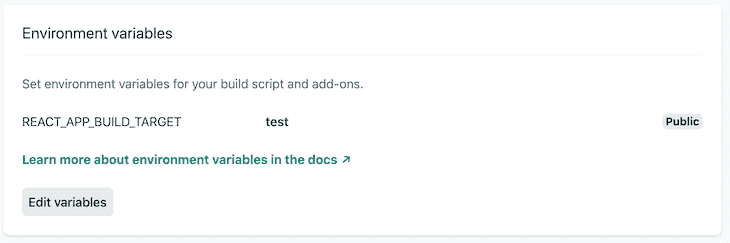

# 创建-反应-应用程序中的多个入口点，无需弹出-日志火箭博客

> 原文：<https://blog.logrocket.com/multiple-entry-points-in-create-react-app-without-ejecting/>

## 介绍

我最近被指派并行构建两个应用程序。第一个是商业 web 应用程序，第二个充当 A/B 测试内容消息传递、页面布局等的平台。

为了提高效率，我想重用这两个应用程序的大部分核心组件和样式，并交换任何品牌资产(图像、字体、调色板等)。)的虚拟品牌，使用风格化组件的[主题化](https://styled-components.com/docs/advanced#theming)功能。

因此，挑战在于从一个 [create-react-app (CRA)](https://github.com/facebook/create-react-app) 应用程序中创建多个应用程序，这些应用程序共享通用组件和样式，但是在它们的捆绑构建文件中没有其他品牌资产的痕迹。幸运的是，有很多方法可以实现这一点，包括复杂性和开发工作量。

## 多个入口点的多个选项

Lerna 是一个流行的工具，它在一个存储库下维护多个包(通常称为 monorepo)。它通过跨其包链接相同的依赖项来实现这一点，并具有集体或单独发布它们的能力。

Lerna 将允许我们为每个应用程序创建一个包，并为它们之间共享的核心组件创建一个包。这当然解决了用例，但是需要我们重新构建整个代码库，并且增加了构建过程的复杂性。

考虑到没有立即向代码库添加任何其他容器的计划，并且在初始开发阶段之后可能不需要测试应用程序，我们认为这个场景的相关开销是多余的。

一个更简单的方法是用 [React App 重新连接](https://github.com/timarney/react-app-rewired)来重新连接代码库，它调整了 CRA 构建脚本，而不需要[退出](https://www.notion.so/phunkren/Multiple-entry-points-in-Create-React-App-without-ejecting-8b9f99a040c04225b4f5f2c19022420b#b2e9e1ca8a0f4141bc0992918bae2a92)。在我们的例子中，我们将在构建时使用 rewired 来改变应用程序的入口点。

这里的一个主要缺点是，这样做，我们会通过对我们隐藏配置文件来打破 CRA 提供的保证，并且软件本身在编写时仅由社区进行少量维护( [customize-cra](https://github.com/arackaf/customize-cra) 是一个构建在 rewired 之上的流行包，支持 CRA v2)。

这个解决方案在个人项目中可能是可行的，但是我们不愿意依赖它来实现商业应用。

[弹出](https://create-react-app.dev/docs/available-scripts/#npm-run-eject)是单向操作，不能撤销。它允许我们通过将代码库转换成标准的 React 应用程序来完全控制项目的基础设施，代价是将维护公开配置的责任转移给我们的团队。

这种方法在某些情况下是可行的，但是由于增加了复杂性和相关的维护成本，它通常被认为是最后的手段。

其中的每一个——还有更多——都是可行的解决方案，都有各自的优缺点。然而，对于这个特定的场景，我们热衷于研究一个简单的解决方案，它允许我们从单个代码库工作，不依赖于第三方依赖，并且不被 CRA 的安全网排斥。

## 无限，或者更远

让我们看看 CRA 应用程序中的默认入口点。`src/index.js`文件导入`App`容器，并在`public/index.html`中定义的`div#root`元素中呈现它。

```
/* src/index.js */
import React from 'react';
import ReactDOM from 'react-dom';
import App from './App';

ReactDOM.render(<App />, document.getElementById('root'));
/* public/index.html */
<body>
  <noscript>You need to enable JavaScript to run this app</noscript>
  <div id="root"></div>
</body>
```

我们可以通过将两个容器导入到`index.js`文件中来引入多个入口点，并基于一个常量变量有条件地呈现它们。这允许我们在容器之间切换，但是有几个警告。

为了在构建之间切换，我们需要手动更新`isTestEnv`变量。在部署每个站点时，总是需要正确设置变量，否则会将错误的代码部署到生产环境中。

```
/* src/index.js */
import React from "react";
import ReactDOM from "react-dom";
import App from "./app";
import Test from './test';

const isTestEnv = true;

if (isTestEnv) {
        ReactDOM.render(<Test />, document.getElementById("root"));
} else {
        ReactDOM.render(<App />, document.getElementById("root"));
}
```

让我们通过创建一个带有[自定义环境变量](https://create-react-app.dev/docs/adding-custom-environment-variables/)的`.env`文件来强化这一点。现在，我们能够在运行本地开发脚本之前选择构建目标，并为我们的每个生产环境永久赋值。

```
/* .env */
REACT_APP_BUILD_TARGET=
/* index.js */
import React from "react";
import ReactDOM from "react-dom";
import { App } from "./App";
import { Test } from './Test'; 

if (process.env.REACT_APP_BUILD_TARGET === 'test')
        ReactDOM.render(<Test />, document.getElementById("root"));
} else {
        ReactDOM.render(<App />, document.getElementById("root"));
}
```

我们使用 [Netlify](https://www.netlify.com/) 为每个应用程序创建一个生产环境。两个站点将几乎完全相同。它们都将指向同一个 [GitHub 库](https://github.com/phunkren/multiple-entry-points)，并将 master 设置为 production 分支。唯一的区别是它们各自的`BUILD_TARGET`环境变量:`test`被分配给[测试站点](https://multiple-entry-points-test.netlify.app/)，而`app`被分配给[主应用程序](https://multiple-entry-points-app.netlify.app/)。



The test production environment on Netlify.


The app production environment on Netlify.

我们现在有两个生产环境，它们具有正确的构建目标，并且没有人为错误。剩下的就是确保只有来自定义的容器的代码出现在捆绑的构建中。

由于树抖动的性质，应用程序当前`index.js`文件中所有导入的容器都会出现在生产构建文件中，而不管我们的构建目标是什么。为了解决这个问题，我们可以使用 CommonJS 根据环境变量`BUILD_TARGET`有条件地要求所需的容器。

```
/* index.js */
require(process.env.REACT_APP_BUILD_TARGET === "test" 
  ? "./test" 
  : "./app"
);
```

这是可行的，但是将环境变量设置为除了`test`之外的任何值都会导入主应用程序。我们可以用一条`if/else`语句解决这个问题，并用 [ES6 动态导入](https://developer.mozilla.org/en-US/docs/Web/JavaScript/Reference/Statements/import#Dynamic_Imports)进一步完善解决方案。

下面的`importBuildTarget()`函数将为每个入口点返回一个承诺，并在没有找到指定的构建目标时返回一个回退错误。一旦解析了导入承诺，它将呈现所请求的构建目标，而不包含捆绑构建中的任何其他入口点文件。💥

```
/* index.js */
import React from "react"; 
import ReactDOM from "react-dom"; 

function importBuildTarget() { 
  if (process.env.REACT_APP_BUILD_TARGET === "app") { 
    return import("./app.js"); 
  } else if (process.env.REACT_APP_BUILD_TARGET === "test") { 
    return import("./test.js"); 
  } else { 
    return Promise.reject(
      new Error("No such build target: " + process.env.REACT_APP_BUILD_TARGET)
    ); 
  } 
} 

// Import the entry point and render it's default export 
importBuildTarget().then(({ default: Environment }) => 
  ReactDOM.render( 
    <React.StrictMode> 
      <Environment /> 
    </React.StrictMode>
  , document.getElementById("root") 
  ) 
);

```

## TL；速度三角形定位法(dead reckoning)

通过使用环境变量有条件地导入容器文件，可以在 CRA 应用程序中创建多个入口点，而无需弹出。这样做可以防止来自其他容器的代码出现在所需的捆绑版本中。

### 资源

特别感谢[斯蒂芬·泰勒](https://twitter.com/meandmycode)和[罗宾·韦斯顿](https://twitter.com/robinweston)的宝贵投入，以及[乔纳森·霍克斯](https://twitter.com/jonathanhawkes)为捆绑构建中出现的所有构建目标文件提供的解决方案。

喜欢这篇文章吗？在[推特](https://twitter.com/phunkren)上告诉我🐦

## [LogRocket](https://lp.logrocket.com/blg/react-signup-general) :全面了解您的生产 React 应用

调试 React 应用程序可能很困难，尤其是当用户遇到难以重现的问题时。如果您对监视和跟踪 Redux 状态、自动显示 JavaScript 错误以及跟踪缓慢的网络请求和组件加载时间感兴趣，

[try LogRocket](https://lp.logrocket.com/blg/react-signup-general)

.

[ ](https://lp.logrocket.com/blg/react-signup-general) [](https://lp.logrocket.com/blg/react-signup-general) 

LogRocket 结合了会话回放、产品分析和错误跟踪，使软件团队能够创建理想的 web 和移动产品体验。这对你来说意味着什么？

LogRocket 不是猜测错误发生的原因，也不是要求用户提供截图和日志转储，而是让您回放问题，就像它们发生在您自己的浏览器中一样，以快速了解哪里出错了。

不再有嘈杂的警报。智能错误跟踪允许您对问题进行分类，然后从中学习。获得有影响的用户问题的通知，而不是误报。警报越少，有用的信号越多。

LogRocket Redux 中间件包为您的用户会话增加了一层额外的可见性。LogRocket 记录 Redux 存储中的所有操作和状态。

现代化您调试 React 应用的方式— [开始免费监控](https://lp.logrocket.com/blg/react-signup-general)。