# 用窗口控件覆盖本地化 PWAs

> 原文：<https://blog.logrocket.com/nativizing-pwas-window-controls-overlay/>

渐进式网络应用程序(PWA)已经存在了很长一段时间，它们被广泛认为是一种创建更自然的网络应用程序的简单方法。

随着时间的推移，随着 PWA 能够做越来越多的事情，同时还允许安装到计算机或电话上，这种情况只会有所改善。随着 PWA 的进步，原生应用和 web 应用之间的差距已经缩小。

然而，无论 PWA 看起来多么令人信服或可信，它们总是保留指示性工具栏，让它非常清楚地表明你不是在运行原生应用程序，而是在外壳中使用网站。例如，YouTube 音乐作为 PWA 运行时，看起来像这样:

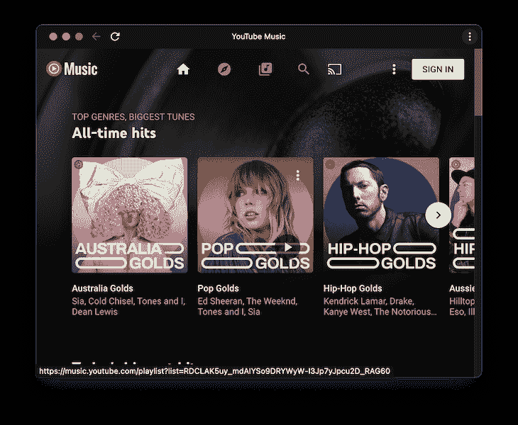

在窗口的顶部，你会看到网站的标题，右边的三点菜单，以及右边的刷新和导航按钮。这显然不是本机应用程序，毕竟本机应用程序没有刷新按钮，因为它们通常不需要。

一看就知道这是装在电脑上的 PWA。这是件好事。

为什么呢？首先，从安全角度来看，web 应用和本地应用之间的界限非常重要。如果我们在 PWA 中看到我们的计算机被感染的警告，我们可能不会关心它，因为我们知道它可能只是网站上的垃圾广告。

但是，如果我们在电脑上看到一个看起来像本机应用程序的应用程序发出的警告，我们可能会更认真地对待它。可能，我们会与它互动，因为我们可能认为我们的电脑上已经有了那个应用程序，我们正在检查，看看问题是什么。

它也很重要，因为它设定了期望。本地应用通常会对点击或其他类型的交互做出即时响应，而 web 应用可能不会如此即时。

然而，随着 Chromium(支持 Chrome 和 Edge 的核心浏览器)即将到来的变化，开发人员可以利用窗口控件覆盖来对 web 应用程序的标题栏区域进行更多控制。

这意味着开发人员可以用自定义内容覆盖他们的 web 浏览器的窗口控件区域，而不是由浏览器或操作系统向他们提供这些内容。

更好的是，它是 2022 年 3 月 1 日[发布的](https://chromereleases.googleblog.com/2022/03/stable-channel-update-for-desktop.html) [Chrome 99](https://chromestatus.com/feature/5741247866077184#:~:text=Chrome%20Platform%20Status,-Roadmap%20All%20features&text=When%20the%20window%20controls%20overlay,top%20of%20the%20client%20area.) 的一部分。这意味着开发人员现在就可以开始使用这一功能，使他们的 PWA 更加身临其境。

只有在用户允许的情况下，网站和 PWA 才会以这种模式运行，这降低了恶意网站试图冒充真实网站的风险。

因此，在本教程中，我们将涵盖以下内容:

## PWAs 有什么变化？

传统上，PWA 应用程序有一个标题区域，如下所示:

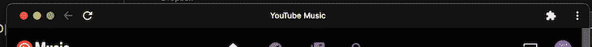

如果我们使用窗口控制覆盖功能，我们可以在该区域内的任何地方绘图:

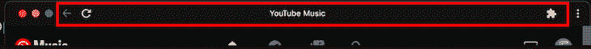

这意味着我们可以无限制地控制在这个区域中实际放置什么。因此，让我们通过创建一个简单的音乐播放器来深入研究这个新功能，该播放器可以显示当前正在播放的曲目，并为用户提供更换曲目的机会。

## 创建示例 PWA

今天，我们将用 HTML 和 JavaScript 创建以下应用程序。很难相信，其实是 PWA 而不是原生 app。

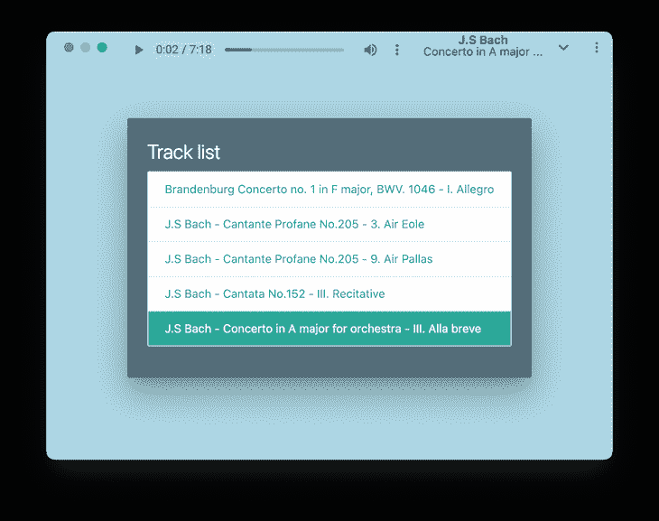

我们使用标题区域中的可用空间来显示音频播放器、曲目艺术家和曲目标题。我们还保持了应用程序背景和标题栏之间的背景颜色相同，所以应用程序看起来是相同的颜色。

所有这些造就了相当令人信服的视觉体验。

你可以在这里[演示应用程序](https://window-control-overlay-demo.web.app/)，在这里[克隆源代码](https://github.com/flutterfromscratch/window-controls-overlay)。PWA 可通过地址栏安装，但要查看演示如何正确工作，请快速访问`chrome://flags`并启用桌面 PWA 窗口控件覆盖选项。

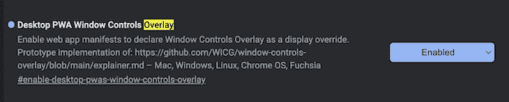

如果您在启用桌面 PWA 窗口控件覆盖后访问演示应用程序的链接，您应该能够单击标题栏中的箭头，此时应用程序将在启用窗口控件覆盖功能的情况下运行。

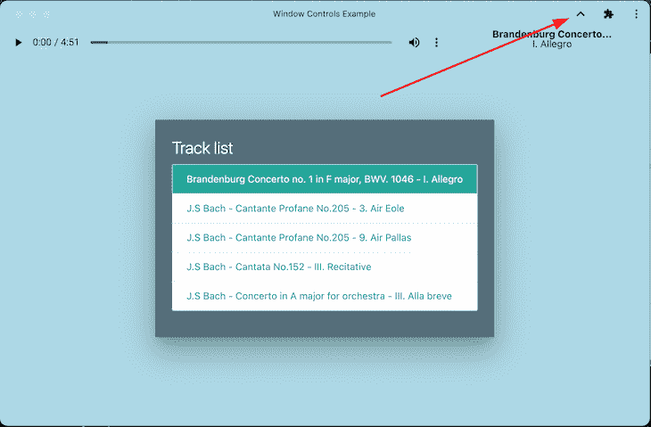

### 创建我们的清单

我们需要做的第一件事是在一个目录中创建我们的`index.html`。接下来，我们必须创建一个 PWA 清单，以便浏览器将我们的网站识别为 PWA。

这很简单，只需在我们的目录中创建一个`manifest.json`，并使用以下详细信息:

```
{
    "theme_color": "#ADD8E6",
    "background_color": "#ADD8E6",
    "display": "standalone",
    "display_override": ["window-controls-overlay"],
    "scope": "/",
    "start_url": "/",
    "name": "Window Controls Example",
    "short_name": "Window Controls Example",
    "icons": [
        {
            "src": "/icon-192x192.png",
            "sizes": "192x192",
            "type": "image/png"
        },
        {
            "src": "/icon-256x256.png",
            "sizes": "256x256",
            "type": "image/png"
        },
        {
            "src": "/icon-384x384.png",
            "sizes": "384x384",
            "type": "image/png"
        },
        {
            "src": "/icon-512x512.png",
            "sizes": "512x512",
            "type": "image/png"
        }
    ]
}

```

这里我们将`theme_color`和`background_color`设置为相同的浅蓝色，但更重要的是，我们将`display_override`设置为`["window-controls-overlay"]`。这是我们表明我们的 PWA 支持窗口控件覆盖功能的方式。

在我们的`index.html`中，我们现在可以添加下面的`head`元素:

```
<head>
  <!-- We use Materialize CSS for styling -->
  <link rel="stylesheet" href="https://cdnjs.cloudflare.com/ajax/libs/materialize/1.0.0/css/materialize.min.css">
  <script src="https://cdnjs.cloudflare.com/ajax/libs/materialize/1.0.0/js/materialize.min.js"></script>
  <!-- PWA Manifest -->
  <link rel="manifest" href="manifest.json">
</head>
<body>
</body>

```

我们还必须配置我们的服务工作者，这为我们提供了一些基本的缓存。为此，创建一个`serviceworker.js`并将以下详细信息粘贴到:

```
var staticCacheName = "pwa";

// Register the install event
self.addEventListener("install", function (e) {
  e.waitUntil(
    caches.open(staticCacheName).then(function (cache) {
      return cache.addAll(["/"]);
    })
  );
});

// Register the fetch event
self.addEventListener("fetch", function (event) {
  console.log(event.request.url);

  event.respondWith(
    caches.match(event.request).then(function (response) {
      return response || fetch(event.request);
    })
  );
});

```

最后，在我们的`index.html`中，我们需要注册我们的服务人员。这就像在页面加载后注册我们的服务人员一样简单，我们可以在我们的`index.html`中的`<script>`块内完成:

```
    window.addEventListener('load', () => {
      registerSW();
    });
    // Register the Service Worker
    async function registerSW() {
      if ('serviceWorker' in navigator) {
        try {
          await navigator
            .serviceWorker
            .register('serviceworker.js');
        }
        catch (e) {
          console.log('SW registration failed');
        }
      }
    }

```

现在，如果我们通过 HTTP 提供这个文件，并在 Chrome 的预览版中打开它，我们将被要求安装该应用程序。

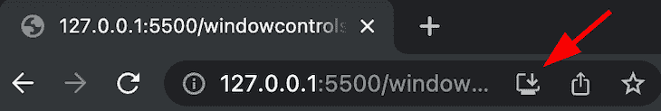

点击此按钮后，我们的应用程序将弹出一个单独的窗口，如下所示:

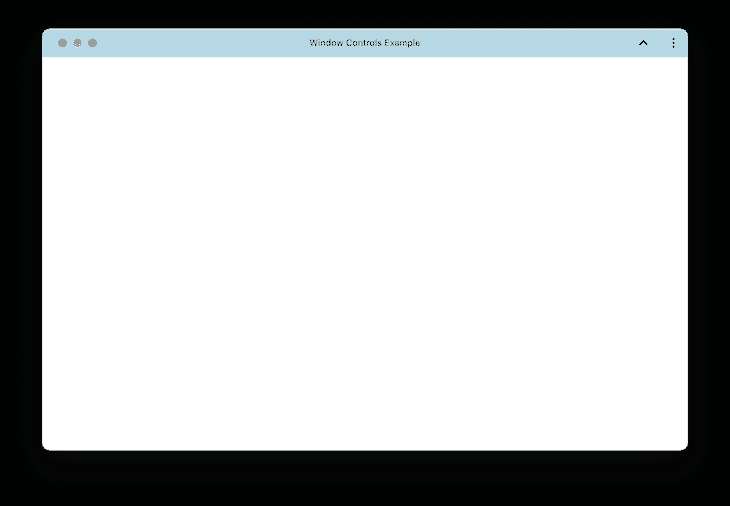

如果我们点击三个点旁边的 **^** 按钮，我们会第一次感受到窗口控件覆盖🎉。

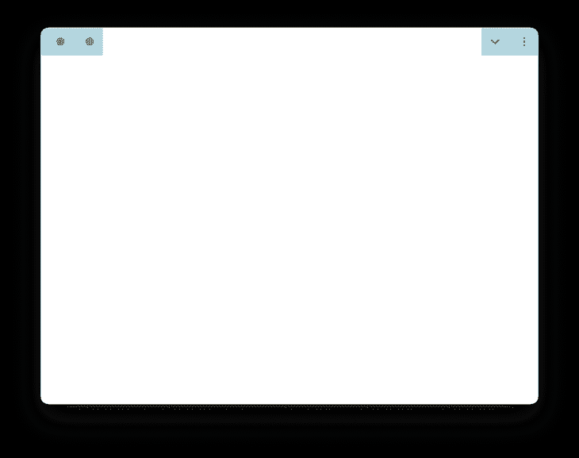

这很没意思，但它向我们展示了我们可以访问的新标题区。所以，我们开始用吧。

### 设置标题栏

我们的标题栏将包含当前正在播放的曲目的播放头和当前曲目的名称。我们需要做的第一件事是确保当我们滚动页面时标题栏不会移动，并在允许的空间内适当地定位它。

为了实现我们的布局，让我们在一行布局中并排使用两个`div`。左边的`div`将包含`audio`播放器，右边的`div`将包含曲目艺术家和标题，就像这样:

```
  <div class="audiobar">
    <audio controls id="player" style="width: 70%">
      <source src="music/Brandenburg Concerto no. 1 in F major, BWV. 1046 - I. Allegro.mp3" type="audio/mpeg"
        id="audiosource">
    </audio>
    <div style="display: flex; flex-direction: column; width: 30%; margin-top: 3px">
      <div style="text-align: center; line-height: 1; font-weight: bold;" id='artist'>Track Artist</div>
      <div style="text-align: center; line-height: 1;" id='trackname'>Track Title</div>
    </div>
  </div>

```

我们的`audiobar`类的样式如下所示:

```
  .audiobar {
      /* Always position it at the top */
      position: fixed;
      /* Position the left of this box to the titlebar-area-x variable, otherwise fallback to 0\. */
      left: env(titlebar-area-x, 0);
      /* Position the right of this box to the titlebar-area-x variable, otherwise fallback to 0\. */
      top: env(titlebar-area-y, 0);
      /* Set the width of the titlebar, to the variable of titlebar-area-width. Otherwise, fallback to 100% width. */
      width: env(titlebar-area-width, 100%);
      /* Make the height of the title bar the titlebar-area-height variable, otherwise fallback to 33px high. */
      height: env(titlebar-area-height, 33px);
      /* Layout the child items from left to right */
      flex-direction: row; 
      /* Use flexbox to control the layout of this div */
      display: flex;
      /* Make the background colour the same as the PWA colour*/
      background-color: #ADD8E6;
    }

```

如果我们现在保存 HTML，我们可以看到我们已经在标题区域设置了音频跟踪栏。

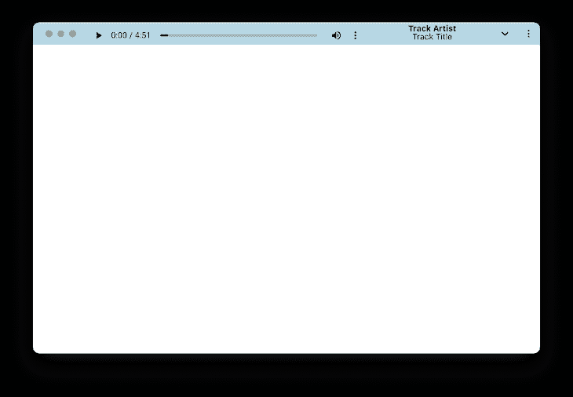

从技术上来说，这是窗口控件覆盖功能，但让我们把更多的工作，所以它看起来像一个实际的应用程序。

### 设置播放列表

我们的播放列表将使用 [Materialize CSS 库](https://blog.logrocket.com/bootstrap-materialize-tailwind-css-which-is-best/#materialize-css)向用户呈现一张卡片，上面有几首曲目。在本例中，我们为播放列表创建了一个容器，以便稍后用 JavaScript 填充它:

```
<!-- Colour the entire background the same light blue as the PWA colour -->
  <div style="background-color: #ADD8E6; width: 100%; height: 100%; z-index: -100; position: fixed;"></div>

  <!-- The main playlist container -->
  <div class="content">
    <div class="row">
      <div class="col s12 m12">
        <div class="card blue-grey darken-1 z-depth-5">
          <div class="card-content white-text">
            <span class="card-title">Track list</span>
            <div class="collection" id='tracklist'>
            </div>
          </div>
        </div>
      </div>
    </div>
  </div>

```

### 连接音频播放器

在我们的`script`标签中，让我们设置一个基本数组，其中包含我们的音轨的文件名:

```
    var trackNames = [
      'Brandenburg Concerto no. 1 in F major, BWV. 1046 - I. Allegro.mp3',
      'J.S Bach - Cantante Profane No.205 - 3\. Air Eole.mp3',
      'J.S Bach - Cantante Profane No.205 - 9\. Air Pallas.mp3',
      'J.S Bach - Cantata No.152 - III. Recitative.mp3',
      'J.S Bach - Concerto in A major for orchestra - III. Alla breve.mp3'
    ];

```

这些曲目位于我们的示例的`music`目录中，您可以克隆和使用它们。如果你愿意，你也可以使用不同的音轨。

接下来，让我们检索对 DOM 中各种元素的引用:

```
    var musicContainer = document.getElementById('tracklist');
    var player = document.getElementById('player');
    var audioSource = document.getElementById('audiosource');

```

现在是时候将曲目添加到播放列表容器中了。为了实现这一点，对于我们的`trackNames`数组中的每个轨道，我们必须创建一个`anchor`标签，在轨道列表中设置适当的类，如果它是列表中的第一个轨道，则使用活动类。

我们还必须用要播放的音轨来调用`play`函数，我们稍后会对此进行定义。

当我们为曲目设置文本时，我们还将删除最后四个字符(后缀`.mp3`),因此我们只剩下曲目艺术家和标题:

```
   trackNames.forEach((track, index) => {
      let tag = document.createElement('a');
      tag.classList = 'collection-item ' + (index == 0 ? 'active' : '');
      tag.setAttribute('href', '#');
      tag.setAttribute('onclick', 'play(\'' + track + '\')');
      let text = document.createTextNode(track.substring(0, track.length - 4));
      tag.appendChild(text);
      musicContainer.appendChild(tag);
    });

```

我们还将声明我们的`play`函数，该函数将所选曲目设置为要播放的曲目。这个函数接受我们正在播放的曲目的名称，并用它来计算出所选曲目的索引。

然后，它从 DOM 中拥有它的任何元素中取消设置`.active`类，并将其设置为已被点击的轨道:

```
    function play(track) {
      let trackIndex = trackNames.findIndex(x => x == track);
      document.querySelector('.active').classList.remove('active');
      musicContainer.children[trackIndex].classList.add('active');
      setTrackMetadata(track);
      player.pause();
      audioSource.setAttribute('src', 'music/' + track);
      player.load();
      player.play();
    }

```

我们还需要定义我们的`setTrackMetadata`函数，它将更新我们当前播放的曲目。这将从曲目名称中删除`.mp3`，将曲目名称拆分为艺术家和标题，并将结果分别赋给`artist`和`trackName`变量。

如果需要，我们也可以缩短这些物品的长度，以便它们整齐地放在分配的空间内:

```
    function setTrackMetadata(track) {
      let metadata = track.substring(0, track.length - 4).split(' - ');
      let artist = metadata[0];
      let trackName = metadata[1];
      if (artist.length > 20) {
        artist = artist.substring(0, 20) + '...';
      }
      if (trackName.length > 20) {
        trackName = trackName.substring(0, 20) + '...';
      }
      document.getElementById('artist').innerText = artist;
      document.getElementById('trackname').innerText = trackName;
    }

```

### 最终抛光和造型

我们需要更新应用程序的样式，这样我们就可以:

1.  垂直偏移我们的应用程序的内容，这样它就不会与标题栏重叠
2.  将`audio`播放器的背景颜色改为透明，这样它看起来就像是标题栏的一部分
3.  偏移`audio`元素，使其在标题区域内更加居中
4.  垂直和水平对齐`content`类，使播放列表位于屏幕中间

幸运的是，我们可以通过以下方式完成以上所有工作:

```
    .content {
      padding-top: env(titlelbar-area-height, 33px);
      display: flex;
      align-items: center;
      justify-content: center;
      height: 100%;
      width: 100%;
    }
    audio::-webkit-media-controls-enclosure {
      background-color: rgba(0, 0, 0, 0);
      color: white;
    }
    audio {
      color: white;
      margin-top: -5px;
    }

```

随着我们的应用程序有了最终的视觉润色，我们已经创建了一个相当引人注目的 PWA，它充分利用了标题栏区域。

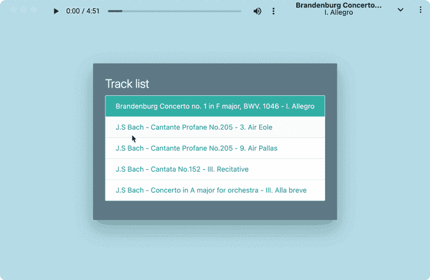

## 结论

PWAs 是软件开发人员将他们的网站带到计算机和设备上并让他们感觉更自然的一种简单方法。随着窗口控件覆盖功能即将登陆，这种趋势只会继续下去。

无论你决定在标题区放置什么，都由你自己决定，不久之后，我相信我们会看到很多网站使用这个功能。但是，别管他们，你会做什么？请务必在下面的评论中让我们知道你将如何利用这一点。

快乐发展！

## 通过理解上下文，更容易地调试 JavaScript 错误

调试代码总是一项单调乏味的任务。但是你越了解自己的错误，就越容易改正。

LogRocket 让你以新的独特的方式理解这些错误。我们的前端监控解决方案跟踪用户与您的 JavaScript 前端的互动，让您能够准确找出导致错误的用户行为。

[](https://lp.logrocket.com/blg/javascript-signup)

LogRocket 记录控制台日志、页面加载时间、堆栈跟踪、慢速网络请求/响应(带有标题+正文)、浏览器元数据和自定义日志。理解您的 JavaScript 代码的影响从来没有这么简单过！

[Try it for free](https://lp.logrocket.com/blg/javascript-signup)

.