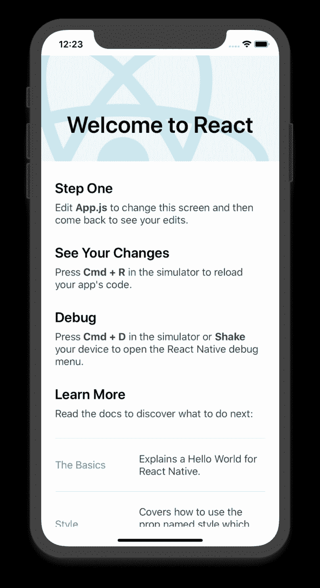
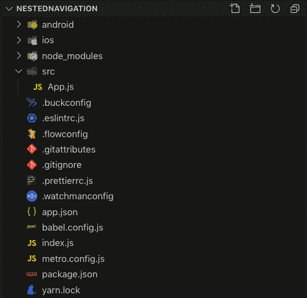
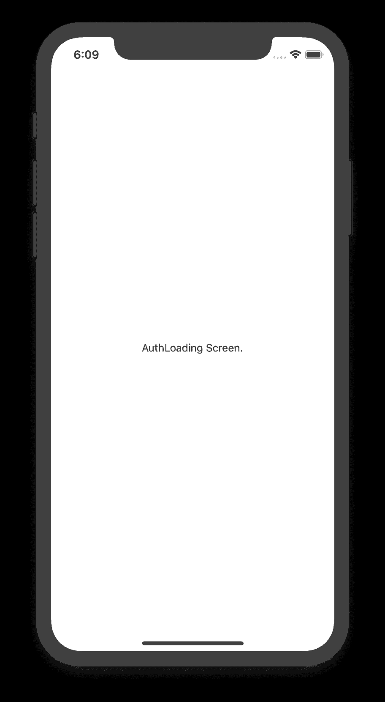
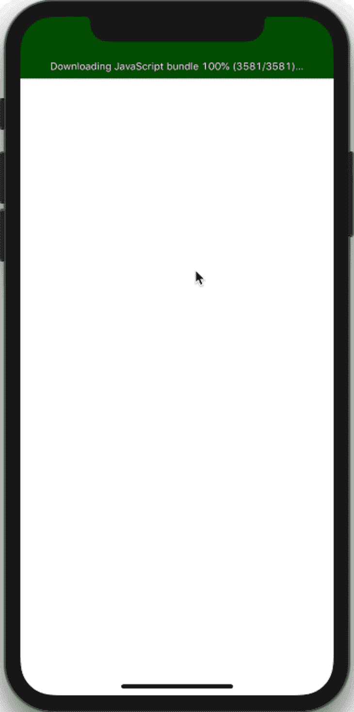
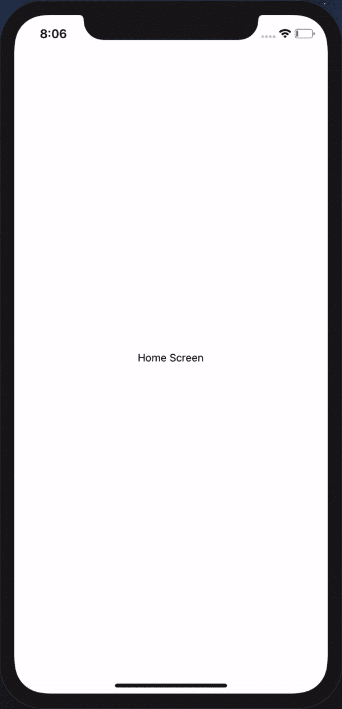
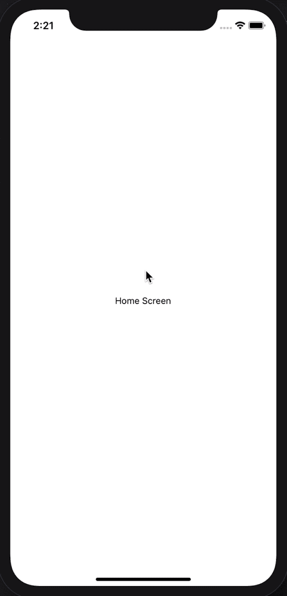
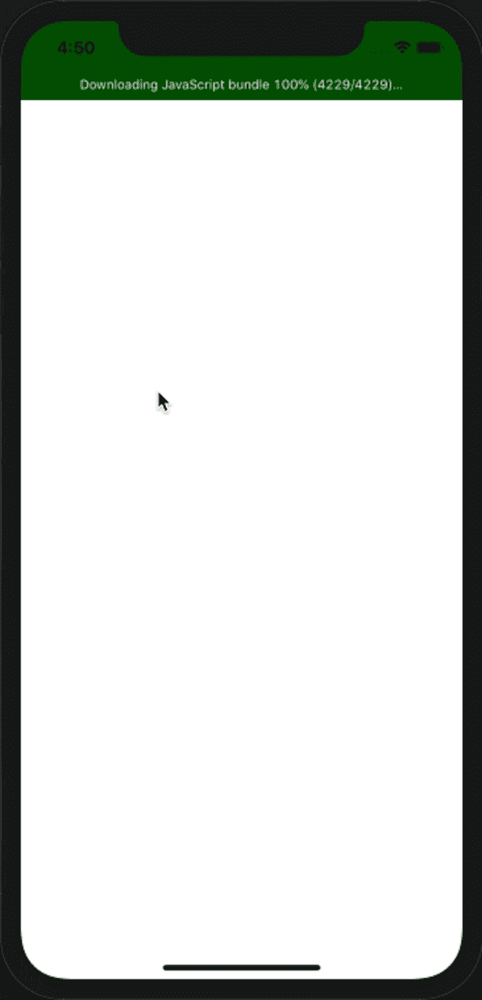
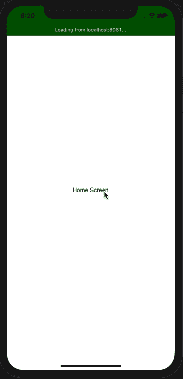
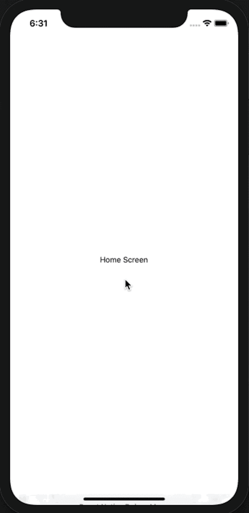

# 嵌套的 React 本地导航器

> 原文：<https://blog.logrocket.com/nested-react-native-navigators/>

移动应用程序通常有多个屏幕，用户可以与之交互来访问应用程序上的不同功能。开发移动应用程序时最大的挑战是找出如何将屏幕捆绑在一起，并为用户提供最简单的方式来导航和与这些屏幕交互。

大多数移动应用程序都有嵌套在一起的导航器组合，以提供最佳的屏幕导航体验，从而改善应用程序本身的用户体验。

## 先决条件

要阅读本文，您应该具备:

*   对 React Native 的基本理解
*   React Native [在您的开发机器上设置](https://reactnative.dev/docs/getting-started)

## 为什么要反应导航？

当使用 React Native 进行开发时，有几个导航库选项可用于在应用程序上实现所需的导航。其中有 [React 导航](https://reactnavigation.org)、 [react-native-router-flux](https://www.npmjs.com/package/react-native-router-flux) 、 [react-native-navigation](https://wix.github.io/react-native-navigation/#/) 。

在这篇博客中，我们将使用 [React Navigation](https://reactnavigation.org) 来实现不同的导航器。React 导航很容易使用，有一个很大的社区来帮助解决基地的问题，还有非常详细的[文档](https://reactnavigation.org/docs/en/getting-started.html)。最重要的是，它是 [React 原生文档](https://facebook.github.io/react-native/docs/navigation)中推荐的导航库。

## 设置

首先，我们需要设置应用程序，我们将在其中实现导航。如果您没有 React Native 设置，请访问 [React Native 入门文档](https://reactnative.dev/docs/getting-started)，一旦您有了设置，请从这里开始。

使用`react-native init`设置 React 原生应用程序:

```
  npx react-native init NestedNavigation
```

这将在文件夹`NestedNavigation`下建立一个 React 本地项目。确保它能在您的模拟器或设备上正常运行，支持任何平台(iOS 或 Android)。您应该有 React 本机欢迎屏幕显示，如下所示:



让我们移动几个文件，为应用程序准备一些编码。让我们创建一个`src`文件夹，我们的大部分代码将存放在这里。然后将`App.js`文件移动到创建的`src`文件夹中，更新文件结构，如下所示:



更新`index.js`上`App.js`的导入路径以包含更新的文件夹名称，并重新加载您的应用程序:

```
// index.js
import { AppRegistry } from 'react-native'
import App from './src/App'
import { name as appName } from './app.json'

AppRegistry.registerComponent(appName, () => App)
```

现在，当您的应用程序重新加载时，您应该能够看到本节前面显示的欢迎屏幕。

## 添加导航库

对于设置，让我们安装我们将用于导航的 React 导航。请访问 React Navigation v4 [入门页面](https://reactnavigation.org/docs/4.x/getting-started)了解关于设置的完整详细信息。这里有一个简短的设置演练。

安装 React Navigation v4 及其依赖项，如下所示:

```
yarn add [email protected]

yarn add react-native-reanimated react-native-gesture-handler react-native-screens react-native-safe-area-context @react-native-community/masked-view
```

对于 iOS，请务必安装 pod:

```
cd ios; pod install; cd ..
```

对于 Android，我们需要在`MainActivity.java`上做一些改变。添加以下几行:

```
...
import com.facebook.react.ReactActivityDelegate;
import com.facebook.react.ReactRootView;
import com.swmansion.gesturehandler.react.RNGestureHandlerEnabledRootView;

public class MainActivity extends ReactActivity {
  ...
  @Override
  protected ReactActivityDelegate createReactActivityDelegate() {
    return new ReactActivityDelegate(this, getMainComponentName()) {
      @Override
      protected ReactRootView createRootView() {
        return new RNGestureHandlerEnabledRootView(MainActivity.this);
      }
    };
  }
}
```

平台设置完成后，我们将完成手势处理器到`index.js`的导入:

```
  // index.js
    import 'react-native-gesture-handler';
```

现在，运行应用程序以确认安装成功。您应该会再次看到“欢迎反应”屏幕。

在我们开始添加导航器之前，让我们对将要实现的导航有一个概述。我们将从用于在应用程序屏幕和认证屏幕之间切换的[切换导航器](https://reactnavigation.org/docs/4.x/switch-navigator/)开始。然后我们将有一个[抽屉导航器](https://reactnavigation.org/docs/4.x/drawer-based-navigation)，它将包含[标签导航器](https://reactnavigation.org/docs/4.x/tab-based-navigation)和[堆栈导航器](https://reactnavigation.org/docs/4.x/stack-navigator)。

## 添加交换机导航器

我们将从设置交换机导航器开始。顾名思义，该导航器在不同屏幕之间切换(例如，在加载屏幕和登录屏幕或主屏幕之间切换)。这个导航器不处理返回操作，一次只显示一个屏幕，这使得它非常适合身份验证流程。我们将为 switch navigator 添加三个屏幕:

*   用于检查登录状态的自动加载屏幕
*   处理认证的登录屏幕
*   默认登录屏幕的主屏幕

在`src`目录下创建一个`components`文件夹，创建上面提到的屏幕(`AuthLoading.js`、`Login.js`、`Home.js`)。让我们为我们创建的屏幕添加一些简单的代码。将下面的代码复制到每个文件，并确保更新类名、显示文本和导出以匹配每个文件:

```
// AuthLoading.js / Login.js / Home.js
import React from 'react'
import { StyleSheet, View, Text } from 'react-native'

class AuthLoading extends React.Component {
  render() {
    return (
      <View style={styles.container}>
        <Text>AuthLoading Screen</Text>
      </View>
    )
  }
}

const styles = StyleSheet.create({
  container: {
    flex: 1,
    alignItems: 'center',
    justifyContent: 'center',
  },
})

export default AuthLoading
```

最后，我们可以启动并运行我们的 switch navigator。

让我们跳到`App.js`删除那里的所有内容，用这个替换，然后我会解释我们在这里试图施展什么魔法:

```
// App.js
import React from 'react'
import { SafeAreaView, StyleSheet } from 'react-native'
import { createAppContainer, createStackNavigator } from 'react-navigation'

import Login from './components/Login'
import AuthLoading from './components/AuthLoading'
import Home from './components/Home'

const switchNavigator = createSwitchNavigator(
  {
    AuthLoading,
    Login,
    Home,
  },
  {
    initialRouteName: 'AuthLoading',
  },
)

const AppNavigator = createAppContainer(switchNavigator)

class App extends React.Component {
  render() {
    return (
      <SafeAreaView style={styles.container}>
        <AppNavigator />
      </SafeAreaView>
    )
  }
}

const styles = StyleSheet.create({
  container: {
    flex: 1,
  },
})

export default App
```

我们从通常情况开始，从`react`、`react-native`和`react-navigation`进口。如上所示，我们导入了用于设置切换导航器的`createSwitchNavigator`和在 React 导航中用作根导航器的`createAppContainer`。

然后，我们通过添加我们希望在 navigator 中使用的屏幕来完成导入(如设置 switch navigator 中所示)。在 switch navigator 的 navigator 配置中，我们将`AuthLoading`设置为初始路径，因为它是我们希望在根据身份验证状态切换到登录或主屏幕之前加载的第一个屏幕。

当我们现在重新加载应用程序时，它应该会显示如下图所示的`AuthLoading`屏幕，没有任何到登录或主屏幕的导航:



这样一来，让我们根据认证状态赋予`AuthLoading`屏幕在其他两个屏幕之间切换的权力。由于这不是一篇关于 React Native 中的身份验证的博客，我们将绕开这个问题:

```
// AuthLoading.js
...
import { ActivityIndicator, StyleSheet, View, Text } from 'react-native'

class AuthLoading extends React.Component {
  constructor(props) {
    super(props)

    this.state = {
      loggedIn: false,
    }
  }

  checkLoggedInStatus = () => {
    if (this.state.loggedIn) {
      return this.props.navigation.navigate('Home')
    }

    return this.props.navigation.navigate('Login')
  }

  componentDidMount() {
    this.checkLoggedInStatus()
  }

...

        <Text>AuthLoading Screen</Text>
        <ActivityIndicator />
...
```

我们将添加一个状态来存储我们的虚拟登录状态，根据用户是否登录，该状态可以是真或假。然后，我们将创建一个函数`checkLoggedInStatus`，它检查用户状态，并根据需要将我们导航到主屏幕或登录屏幕。然后在我们的`componentDidMount`中，我们将调用一个函数，这样每次挂载`AuthLoading`时它都会运行。作为奖励，我们还增加了一个`ActivityIndicator`来显示切换应用程序前的加载状态。

通过切换登录状态并检查呈现的是哪个屏幕，您可以随意使用它。

最后，让我们在`Login`屏幕中添加一个登录按钮来模拟登录，并将用户导航到主屏幕:

```
// Login.js
...
import { StyleSheet, View, Text, TouchableOpacity } from 'react-native'

class Login extends React.Component {
  render() {
    return (
      <View style={styles.container}>
        <Text>Login Screen.</Text>
        <TouchableOpacity
          style={styles.loginButton}
          onPress={() => this.props.navigation.navigate('Home')}>
          <Text>Login</Text>
        </TouchableOpacity>
      </View>
    )
  }
}

const styles = StyleSheet.create({
  loginButton: {
    height: 30,
    width: '40%',
    margin: 5,
    borderWidth: 1,
    borderRadius: 5,
    alignItems: 'center',
    justifyContent: 'center',
  },

...
```

我们创建了一个在用户未登录时显示的登录屏幕，并添加了一个模拟用户登录的登录按钮，并在成功登录后将用户导航到主屏幕。完成所有这些后，我们应该有一个平滑的切换导航器工作并产生一些导航，如下所示，检查登录状态并导航到登录屏幕，然后在登录后导航到主屏幕:



## 添加抽屉导航器

[抽屉导航器](https://reactnavigation.org/docs/4.x/drawer-navigator)为用户提供非常简单直观的导航。从左侧或右侧拉动侧菜单，查看更多选项并在屏幕间导航。当使用抽屉导航器时，它必须是应用程序其余部分的基本导航器，因此我们首先介绍它。

我们开始吧。让我们安装导航器的必要要求:

```
yarn add react-navigation-drawer
```

现在让我们跳到`App.js`并启动抽屉导航器，这将需要对该文件进行一些更新，以导入并设置抽屉导航器:

```
// App.js
...
import { createDrawerNavigator } from 'react-navigation-drawer' // import drawer nav

const DrawerNavigator = createDrawerNavigator(
  {
    Home, // move Home screen to drawer
  },
)

const switchNavigator = createSwitchNavigator(
  {
    AuthLoading,
    Login,
    DrawerNavigator, // change this to DrawerNavigator
  },
  {
    initialRouteName: 'AuthLoading',
  },
)

...
```

我们导入`createDrawerNavigator`函数，并用主屏幕设置我们的`DrawerNavigator`。当然，我们稍后会添加更多的屏幕，但是对于初始设置，我们现在只使用一个屏幕并打开导航器。

随着主屏幕移动到抽屉导航器中，我们用新创建的`DrawerNavigator`替换它在切换导航器上的位置，以便在认证流程之后，应用导航到抽屉导航器。记得更新`AuthLoading.js`上的`checkLoggedInStatus`功能，导航到更新后的路线名称`DrawerNavigator`:

```
// AuthLoading.js
...

  checkLoggedInStatus = () => {
    if (this.state.loggedIn) {
      return this.props.navigation.navigate('DrawerNavigator')
    }
    return this.props.navigation.navigate('Login')
  }
```

有了这个设置，重新加载应用程序，它应该导航到抽屉导航器，打开主屏幕，侧菜单准备就绪。从左侧滑动应该可以打开它，并显示只有主屏幕选项的侧菜单。



因此，让我们添加另一个屏幕来演示不同屏幕之间的导航。在 components 文件夹中，创建`Settings.js`文件并将`Login.js`的内容复制到其中，更新类名并对其进行如下更新:

```
// Settings.js
...

class Settings extends React.Component {
  render() {
    return (
      <View style={styles.container}>
        <Text>Settings Screen</Text>

        <TouchableOpacity
          style={styles.loginButton}
          onPress={() => this.props.navigation.openDrawer()}>
          <Text>Open Drawer</Text>
        </TouchableOpacity>
      </View>
    )
  }
}

...
export default Settings
```

正如你所注意到的，我们增加了`openDrawer()`功能，无需从左侧滑动即可打开抽屉。现在让我们将视图设置屏幕添加到`App.js`中的`DrawerNavigator`:

```
// App.js
...
import Settings from './components/Settings'

const DrawerNavigator = createDrawerNavigator(
  {
    Home,
    Settings,
  },
  {
    initialRouteName: 'Home'
  }
)

...
```

我们还在抽屉导航器配置中设置了`initialRouteName`,这样抽屉导航器首先显示主屏幕。完成后，我们的抽屉导航就可以使用了。让我们重新加载我们的应用程序，看看我们在哪里。

你可以根据自己的喜好进一步定制侧边菜单，但我们不会在这篇文章中讨论。



## 在抽屉中添加标签导航器

选项卡导航器使用位于屏幕顶部或底部的选项卡栏，让您在不同路线之间切换。选项卡导航器上的屏幕直到被聚焦后才会被安装。这个导航器为在屏幕上的内容之间切换提供了很好的导航(例如，当你在聊天、状态和通话之间切换时，在 WhatsApp 中；或者当你在主页、搜索、通知和消息之间切换时，在 Twitter 上)。

在 React 导航中，有几个选项可以设置你的标签导航器，你可以使用`createBottomTabNavigator`(默认)、`createMaterialBottomTabNavigator`或者`createMaterialTopTabNavigator`。顾名思义，最后两个是分别位于底部或顶部的材料设计主题选项卡。在本演练中，我们将使用默认选项(`createBottomTabNavigator`)。

当然，我们将从安装所需的依赖项开始:

```
yarn add react-navigation-tabs
```

为了简单起见，我们将在我们的`components`文件夹中创建一个文件`WeekDays.js`，它将包含三个选项卡组件`Monday`、`Tuesday`和`Wednesday`，我们将在我们的`App.js`中使用它们来设置选项卡导航器:

```
// WeekDays.js
import React from 'react'
import { StyleSheet, View, Text } from 'react-native'

export class Monday extends React.Component {
  render() {
    return (
      <View style={styles.container}>
        <Text>Monday Blues</Text>
      </View>
    )
  }
}
export class Tuesday extends React.Component {
  render() {
    return (
      <View style={styles.container}>
        <Text>Tuesday Thoughts</Text>
      </View>
    )
  }
}
export class Wednesday extends React.Component {
  render() {
    return (
      <View style={styles.container}>
        <Text>Wednesday Wisdom</Text>
      </View>
    )
  }
}
const styles = StyleSheet.create({
  container: {
    flex: 1,
    alignItems: 'center',
    justifyContent: 'center',
  },
})
```

选项卡屏幕准备就绪后，是时候创建选项卡导航器了，让我们进入 App.js 屏幕并开始运行:

```
// App.js
...
import { createBottomTabNavigator } from 'react-navigation-tabs'
import { Monday, Tuesday, Wednesday } from './components/TabScreens'

const WeekDays = createBottomTabNavigator(
  {
    Monday,
    Tuesday,
    Wednesday,
  }
)

const DrawerNavigator = createDrawerNavigator(
  {
    Home,
    Settings,
    WeekDays, // add bottom navigator here
  },
  ...
)

...
```

这样，我们应该在侧边菜单上有`WeekDays`选项，然后显示不同的选项卡选项，如下所示:



添加堆栈导航器

## 最后，我们将讨论的最后一个导航器是堆栈导航器。这个导航器通过将新的屏幕放在堆栈的顶部来在不同的屏幕之间移动。Stack navigator 非常简单——一个新的屏幕放在堆栈的顶部，要查看以前的屏幕，您只需向后导航即可。

为此，我们将在我们的应用程序中添加配置文件设置，理想情况下，它们应该与设置在同一个堆栈中。让我们创建`ProfileSettings.js`，然后设置设置堆栈导航:

```
yarn add react-navigation-stack @react-native-community/masked-view
```

现在准备好了，我们可以对我们的`App.js`做最后的修改，添加我们的堆栈导航器。在必要的导入之后，我们初始化 stack navigator 并将设置屏幕以及新的`ProfileSettings`移入其中。在抽屉导航器上，我们也将其更新为指向包含我们的设置屏幕的`AllSettings`堆栈导航器:

```
// ProfileSettings.js
import React from 'react'
import { StyleSheet, View, Text } from 'react-native'

class ProfileSettings extends React.Component {
  render() {
    return (
      <View style={styles.container}>
        <Text>Profile Settings Screen</Text>
      </View>
    )
  }
}
const styles = StyleSheet.create({
  container: {
    flex: 1,
    alignItems: 'center',
    justifyContent: 'center',
  },
})
export default ProfileSettings
```

完成后，应用程序应该会成功运行，您也应该能够从抽屉导航器导航到`AllSettings`，这将显示设置屏幕。此外，请注意，没有办法在设置和配置文件设置屏幕之间导航。让我们在“设置”屏幕中添加一个按钮，从“设置:

```
// App.js

...
import { createStackNavigator } from 'react-navigation-stack'
import ProfileSettings from './components/ProfileSettings'

const AllSettings = createStackNavigator(
  {
    Settings,
    ProfileSettings,
  }
)
const DrawerNavigator = createDrawerNavigator(
  {
    Home,
    AllSettings, // update this
    WeekDays,
  },
  {
    initialRouteName: 'Home',
  },
)
```

这样，我们应该能够使用上面添加的按钮导航到配置文件设置，并使用堆栈导航器提供的本机后退按钮导航回来，就像这样:


```
// Settings.js

...
        <TouchableOpacity
          style={styles.loginButton}
          onPress={() => this.props.navigation.openDrawer()}>
          <Text>Open Drawer</Text>
        </TouchableOpacity>

        <TouchableOpacity // add this
          style={styles.loginButton}
          onPress={() => this.props.navigation.navigate('ProfileSettings')}>
          <Text>Profile Settings</Text>
        </TouchableOpacity>

...
```

结论

## 瞧，我们完成了嵌套导航！

我们从一个处理认证状态的切换导航器开始，然后我们创建了一个抽屉导航器，它应该是使用时的基本导航器，并在其上添加了选项卡和堆栈导航器。最后两个可以按照您喜欢的顺序嵌套。

这个的代码可以在 Github 上找到[。](https://github.com/jmkitavi/NestedNavigation)



nbsp

[LogRocket](https://lp.logrocket.com/blg/react-native-signup) :即时重现 React 原生应用中的问题。

## [LogRocket](https://lp.logrocket.com/blg/react-native-signup) 是一款 React 原生监控解决方案，可帮助您即时重现问题、确定 bug 的优先级并了解 React 原生应用的性能。

[](https://lp.logrocket.com/blg/react-native-signup)

LogRocket 还可以向你展示用户是如何与你的应用程序互动的，从而帮助你提高转化率和产品使用率。LogRocket 的产品分析功能揭示了用户不完成特定流程或不采用新功能的原因。

开始主动监控您的 React 原生应用— [免费试用 LogRocket】。](https://lp.logrocket.com/blg/react-native-signup)

Start proactively monitoring your React Native apps — [try LogRocket for free](https://lp.logrocket.com/blg/react-native-signup).