# 嵌套智能合同指南

> 原文：<https://blog.logrocket.com/nested-smart-contracts-creating-contract-within-contract/>

智能合约是存储在区块链上的程序，当某些条件被预先确定或调用时运行。智能合同用于自动化协议，消除中介，并创建一个不受外部影响的更加分散的网络。

在本文中，我们将研究一种被称为嵌套契约或带契约的契约的特定策略。具体来说，我们将回顾如何创建多个契约并从父契约中调用函数。我们将演示如何从父契约调用嵌套契约，以及如何从外部契约调用它。本文中使用的所有智能合同示例都是用 Solidity 编写的。

让我们开始吧。

*向前跳转:*

## 先决条件

为了理解本文的教程部分，您应该具备以下条件:

## 为什么要将合同嵌套在合同中？

将一个智能合同包含在另一个智能合同中可能是有利的，这有几个原因:

*   安全性:嵌套契约有助于隔离漏洞风险；当所有的合同变量都包含在一个智能合同中时，就更容易忽略可能被坏人利用的错误或弱点
*   分段:多个合同使我们能够用不太复杂的逻辑将主合同分成较小的部分
*   可重用代码:许多基本的契约功能都可以通过像 [OpenZeppelin](https://www.openzeppelin.com) 这样的公司以开源、可重用逻辑的形式获得；利用他们的代码可以节省大量的开发时间

## 智能合约可以交互吗？

智能合约能够创建或部署其他合约。他们还可以调用其他智能合约的函数。在本文中，我们将研究调用嵌套智能契约的两个示例:

*   合约中的合约:当合约嵌套在一个主合约中时，可以从其他合约中调用它们或它们的函数
*   从外部协定调用嵌套协定:也可以从外部调用协定；例如，您可以使用构造函数来调用外部协定

## 演示:从父协定调用嵌套的智能协定

对于我们的第一个示例，让我们在父契约中创建并部署一个子契约。

### 创建嵌套合同

首先，我们将打开 Remix 并创建父合同。对于这个例子，我们将创建一个贷款合同；任何人都可以调用此合同并请求贷款。

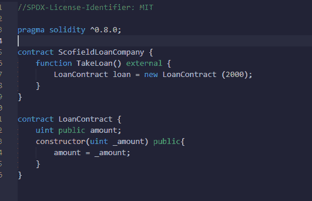

合同的第一行是我们的`License`。这非常重要，因为不调用它会引发错误:

```
//SPDX-License-Identifier: MIT
pragma solidity ^0.8.0;

```

我们用 Remix 作为编译器，它有不同的版本。验证您使用的版本；如果版本与编译器不符，你会得到一个错误。在这个例子中，我们使用的是混音版本`^0.8.0`和更高版本。`^`符号表示“以上”。

如下所示，`ParentLoanCompany`契约采用了一个名为`TakeLoan`的函数，该函数采用了`external`属性。外部模块可用于将自定义或第三方 API 引入 Web3 实例。外部模块是简单的类，其方法和属性可以在 Web3 实例中使用。

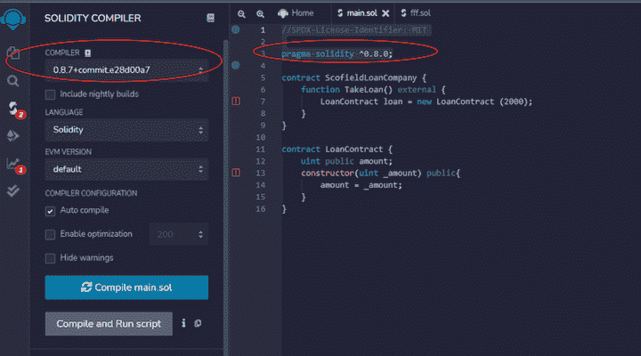

```
contract ParentLoanCompany {
    function TakeLoan() external {
        LoanContract loan = new LoanContract (2000);
    }
}

```

为了调用我们的子契约，我们使用了`external`属性。

在此之前，让我们在父契约中创建子契约:

```
 contract ChildLoanContract {
    uint public amount;
    constructor(uint _amount) public{
        amount = _amount;
    }
}

```

我们的`ChildLoanContract`是用户直接交互的契约，我们把子契约调入父契约。让我们回顾一下子合同的基本细节:

```
uint public amount;
    constructor(uint _amount) public{

```

我们必须让 Solidity 意识到这份合同是关于钱的。为此，我们调用`uint`，它是一个无符号整数，我们将其设为`public`。

我们创建了一个首先运行的`constructor`，一旦调用了契约，我们就给出一个参数`_amount`，这意味着无论谁调用这个函数，都必须指定他们希望借入的金额。

最后，我们调用`amount = _amount;`，这意味着用户投入的任何金额都成为贷款金额`public`。

现在，让我们回到`ParentLoanCompany`契约，添加下面的代码片段来连接这两个契约。

`LoanContract loan = new LoanContract (2000);`

我们通过调用`LoanContract`来调用`ChildLoanContract`，并给它一个名字`loan`。当我们以后要调用借款人的地址时，这是非常重要的。这相当于`new`，它是创建一个类型为`LoanContract`的新合同的函数。

### 部署嵌套合同

在用 Remix IDE 部署了`ParentLoanCompany`契约之后，我们应该在契约面板上看到两个契约。

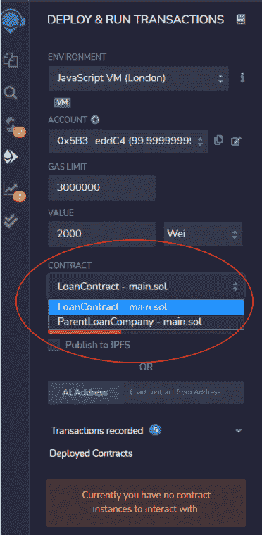

## 演示:从外部协定调用嵌套的智能协定

现在，让我们看看外部契约如何调用嵌套契约。

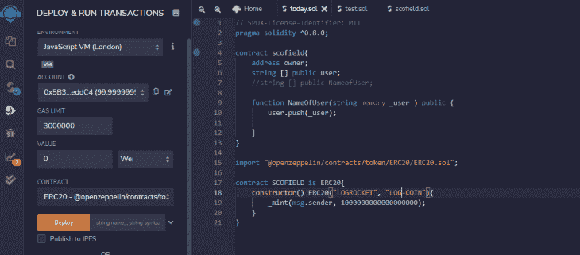

### 创建合同

就像前面的例子一样，第一行代码是我们的`License`。如果我们不提供这个，Remix 将抛出一个错误。

接下来，我们指定我们的版本和编译器；Remix 使用这个编译器来测试我们的项目，如果编译器和版本不同，我们会得到一个错误。

```
// SPDX-License-Identifier: MIT 
pragma solidity ^0.8.0;

```

我们将创建一个名为`scofield`的契约，允许用户在`string [] public user`数组中存储一个地址。

我们还在`NameOfUser`函数中创建了一个参数，用于存储契约调用方在`_user`中提供的名称。

```
contract scofield{
    address owner;
    string [] public user;
    function NameOfUser(string memory _user ) public {
        user.push(_user);
    }
}

```

现在，让我们创建嵌套契约。

我们将在铸造硬币的同一个文件中创建另一个合同，`LOGROCKET`。这枚硬币的符号是`LOG_COIN`。这枚硬币将使用我们从 OpenZeppelin 进口的合同铸造。

在我们的`scofield`契约中，我们将导入 OpenZeppelin 契约，并将以下命令粘贴到我们的 Remix 编辑器中:

```
import "@openzeppelin/contracts/token/ERC20/ERC20.sol";

```

接下来，我们调用外部`COINMAKER`契约。我们指定它是一个 ERC-20 合约，然后我们调用一个`constructor function`，我们给出一个参数`name of coin`，LOGROCKET，和`symbol of coin`，LOG-COIN。

我们的`constructor function`必须在任何其他函数之前运行。它有一个`_mint`参数，告诉合同`msg.sender`可以铸造多少硬币。我们指定`msg.sender`可以铸造`1000000000000000000`卫，这是最小的以太坊单位。

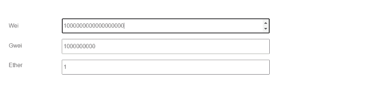

### 转换以太币

作为旁注，我们应该讨论一下以太坊单位。在这个契约中，我们创建了一个以太，但是我们使用最小的以太坊单位(Wei)来表示值。

这里有一个很有用的[工具，可以转换不同的以太坊单位](https://eth-converter.com/extended-converter.html)，比如卫、圭、芬尼、以太。

### 部署和调用嵌套协定

现在是时候部署我们的合同了。在 Remix **DEPLOY & RUN** 面板中，我们可以看到合同下拉列表和合同列表。这些合同与我们创建的`COINMAKER`和`scofield`合同放在一起。

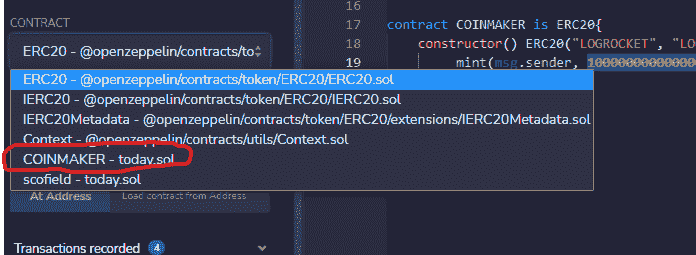

现在，让我们部署`COINMAKER`契约。

如果您尝试在没有首先安装元掩码 wallet 的情况下进行部署，您将会看到如下内容:

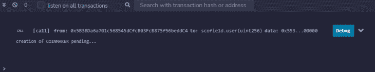

接下来说一下燃气费和 testnet 水龙头。要处理此合同，您可以从 testnet 请求测试 ETH。在文章中，我使用了 Rinkeby，但它正在贬值。如果你愿意，你可以用 Goerli 来代替。

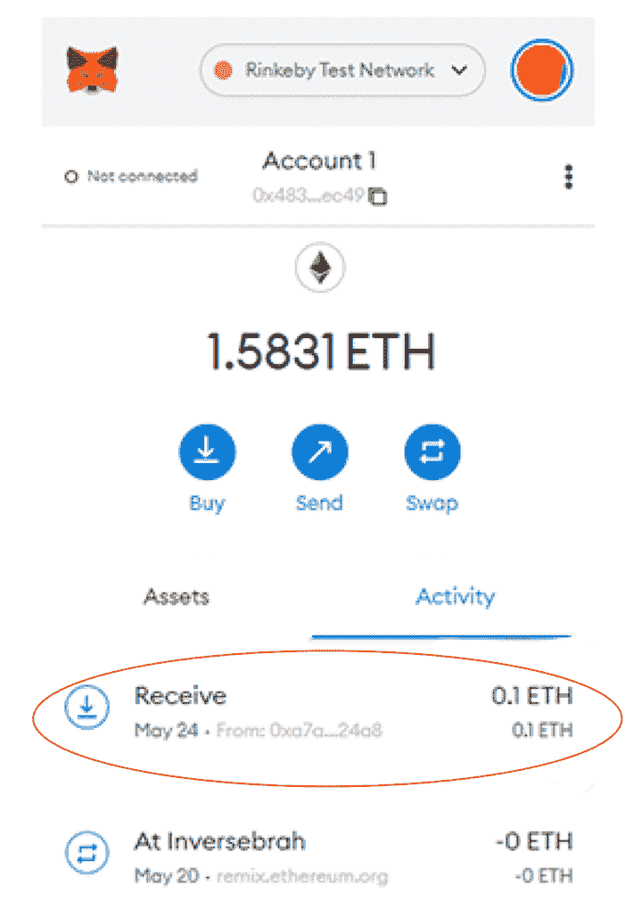

如上图所示，你会从 testnet 得到`0.1 ether`，这足够支付油费了。然而，如果你想继续练习，你可以多次提出这个要求。

在部署合同之前，确保将`Environment`从`Javascript VM`更改为`Injected Web3`。

现在，让我们再次部署合同。这一次，您应该会看到以下元掩码通知:

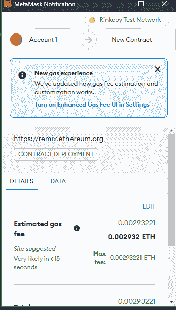

在面板的底部，我们看到`COINMAKER`的创建正在等待。


接下来，点击 etherscan 上的**视图。这将打开以太扫描，在这里我们可以看到我们刚刚创建的硬币。**

我们可以看到令牌的名称`LOGROCKET`，以及用于部署该合同的气体量。

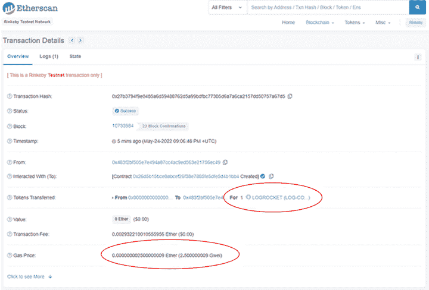

单击令牌的名称以查看更多详细信息:


这里我们可以看到持有令牌的人数(现在只有一个)。

现在，让我们回到我们的合同上。

我们合同中的每个功能都有一个目的。这里有一个总结:

*   `Approve`:允许汇款人在区块链上保留一定金额的资金，并提供一个可以提取该指定金额的地址
*   `DecreaseAllowance`:允许我们减少在`Approve`函数中设置的金额，因此，如果计划的金额过高，创建的合同可能会减少指定的金额
*   `IncreaseAllowance`:增加区块链的拨款
*   `Transfer`:允许合同所有者将合同中的资金转移给另一个用户
*   `TransferFrom`:在被批准进入区块链后，允许所有者从`Approve`功能转账，而不是从所有者资金转账

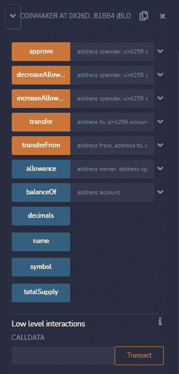

就是这样；您刚刚创建了自己的 Web3 硬币！

## 结论

使用多个智能合约可以为项目提供更多的安全性。在本文中，我们使用了贷款智能契约的示例来演示从父契约调用嵌套契约。我们还使用了一个定制硬币铸造契约的例子来演示如何从嵌套契约中调用外部契约。

在合同中创建合同，或者嵌套的智能合同，对于限制用户可以做什么和可以调用什么非常有用。

## 加入像 Bitso 和 Coinsquare 这样的组织，他们使用 LogRocket 主动监控他们的 Web3 应用

影响用户在您的应用中激活和交易的能力的客户端问题会极大地影响您的底线。如果您对监控 UX 问题、自动显示 JavaScript 错误、跟踪缓慢的网络请求和组件加载时间感兴趣，

[try LogRocket](https://lp.logrocket.com/blg/web3-signup)

.

[](https://lp.logrocket.com/blg/web3-signup)[https://logrocket.com/signup/](https://lp.logrocket.com/blg/web3-signup)

LogRocket 就像是网络和移动应用的 DVR，记录你的网络应用或网站上发生的一切。您可以汇总和报告关键的前端性能指标，重放用户会话和应用程序状态，记录网络请求，并自动显示所有错误，而不是猜测问题发生的原因。

现代化您调试 web 和移动应用的方式— [开始免费监控](https://lp.logrocket.com/blg/web3-signup)。