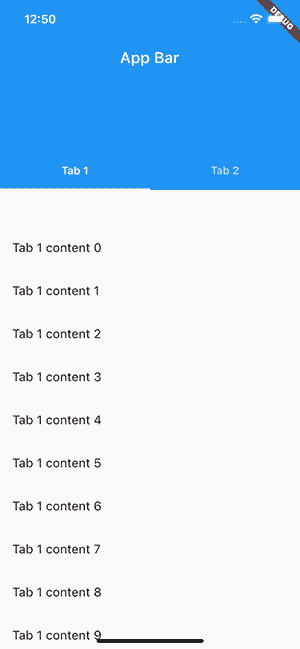
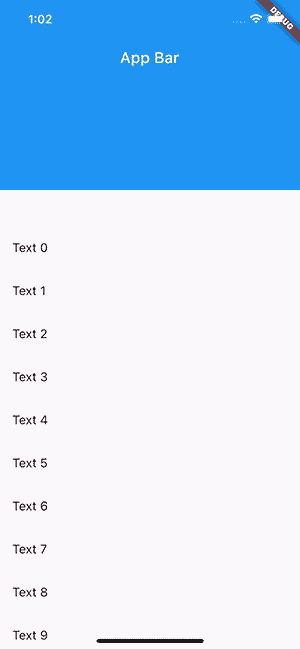
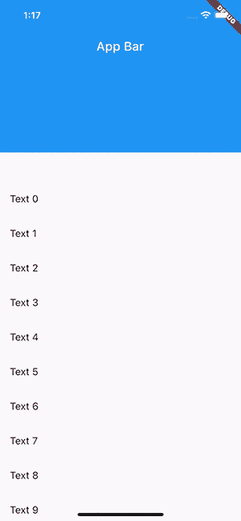
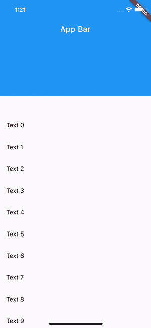
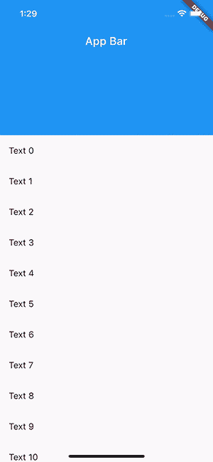
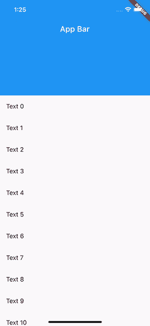

# NestedScrollView:Flutter-log rocket 博客的增强滚动

> 原文：<https://blog.logrocket.com/nestedscrollview-enhanced-scrolling-flutter/>

良好的滚动体验在移动设备上非常重要。您的空间有限，必须显示大量信息，同时您的应用程序保持响应迅速。

作为一名开发人员，你经常需要在应用程序中实现复杂的滚动机制。这通常涉及多个滚动视图。一个典型的例子是带有标签页的应用程序栏。

在本教程中，我们将学习`NestedScrollView`以及如何在 Flutter 中使用它。我们将讨论何时使用它，给出一个示例用例，讨论幕后发生的事情，并概述该功能的一些限制和约束。

[在 Flutter](https://blog.logrocket.com/implement-infinite-scroll-pagination-flutter/) 中，你有不同的选项来滚动你的内容。最简单的方法是使用`SingleChildScrollView`小部件，在需要时自动滚动其子部件。

您还有其他选项，比如用`ListView`或`GridView`来显示多个元素。这两个小部件都提供了构造器，这些构造器需要一个 builder 方法来按需构建它们的子部件。这一点很重要，因为它们只创建那些可见的或即将可见的小部件。当您需要显示大量数据时，使用它们可以使您的应用程序响应更快、性能更好。

当你使用 Flutter 时，你会听说 slivers——特别是当你构建一个滚动 UI 时。Slivers 是 Flutter 中滚动 UI 的基本构件。长条是可滚动区域的一部分，根据其配置显示内容。

当 Slivers 的子对象变得可见时，slivers 管理它们的显示，并对它们应用滚动效果。`ListView`、`GridView`和其他滚动窗口小部件构建在 slivers 之上，以便于使用。

当你想构建一个漂亮的滚动 UI 时，你可以将`CustomScrollView`与小部件一起使用，比如`SliverList`、`SliverGrid`或`SliverAppBar`。它们提供了与非细长版本相同的功能，但是您可以定制它们的滚动行为。例如，您可以在同一列表中添加一个列表和一个网格，它们将一起滚动。

一个`CustomScrollView`只能在一个方向上滚动，所以如果你需要垂直和水平滚动，你将需要嵌套滚动视图。但这可能会导致奇怪的滚动行为…

这就是`NestedScrollView`可以帮助你的地方。

[Flutter 文档](https://api.flutter.dev/flutter/widgets/NestedScrollView-class.html)将`NestedScrollView`定义为“一个滚动视图，其中可以嵌套其他滚动视图，它们的滚动位置是内在联系的。”

这意味着用`NestedScrollView`，你得到两个滚动区域。一个是头部分，一个是正文部分。

连接这两个部分，使它们表现得像一个一致的可滚动区域。这两个部分将一起滚动，并且它们的滚动位置将被链接。

[通常，`NestedScrollView`与标题中有`TabBar`和正文中有`TabView`的`SliverAppBar`](https://blog.logrocket.com/how-to-add-sliverappbar-to-your-flutter-app/) 一起使用。通常，`TabView`是水平滚动的，也可以有垂直滚动的可滚动内容。

`NestedScrollView`连接正文中内容的滚动行为，所以当你滚动其内容并到达顶部时，它会将剩余的滚动转发到页眉。如果你有一个灵活的应用程序栏，它会打开它。



当你有想要链接在一起的嵌套滚动视图时，你应该使用`NestedScrollView`,这样它们就像一个一致的可滚动区域。这意味着您只能以编程方式一起控制它们。

让我们看一个简单的例子，其中有一个灵活的应用程序栏和一个项目列表。第一，不带`NestedScrollView`:

```
class MyHomePage extends StatelessWidget {
  const MyHomePage({Key? key}) : super(key: key);

  @override
  Widget build(BuildContext context) {
    return CustomScrollView(
      slivers: [
        // A flexible app bar
        const SliverAppBar(
          title: Text('App Bar'),
          expandedHeight: 200,
          pinned: true,
        ),
        // Uses the remaining space
        SliverFillRemaining(
          // Renders a scrollable list
          child: ListView.builder(
            itemBuilder: (context, index) => ListTile(
              title: Text(
                'Text $index',
              ),
            ),
          ),
        ),
      ],
    );
  }
}

```



问题是`ListView`和`SliverAppBar`彼此独立工作。如果您滚动列表，灵活的应用程序栏不会折叠或展开。这不会产生一致的滚动效果，而`NestedScrollView`在这种情况下会有所帮助。

让我们看看同一个例子，但现在使用`NestedScrollView`:

```
class MyHomePageWithNestedScrollView extends StatelessWidget {
  const MyHomePageWithNestedScrollView({Key? key}) : super(key: key);

  @override
  Widget build(BuildContext context) {
    return NestedScrollView(
      // This builds the scrollable content above the body
      headerSliverBuilder: (context, innerBoxIsScrolled) => [
        SliverAppBar(
          title: const Text('App Bar'),
          expandedHeight: 200,
          pinned: true,
          forceElevated: innerBoxIsScrolled,
        ),
      ],
      // The content of the scroll view
      body: ListView.builder(
        itemBuilder: (context, index) => ListTile(
          title: Text(
            'Text $index',
          ),
        ),
      ),
    );
  }
}

```



我们用`NestedScrollView`小部件替换了`CustomScrollView`，并分离了标题和内容部分。

`headerSliverBuilder`负责构建外部可滚动区的内容，而`body`包含其余的内容。`NestedScrollView`连接这两个区域，所以当你滚动的时候，它会一起滚动外部和内部的可滚动区域。

这样做的结果是，当您滚动列表时，应用程序栏将折叠或展开。当您滚动浏览应用程序栏时，列表也会滚动。

* * *

### 更多来自 LogRocket 的精彩文章:

* * *

通常，`NestedScrollView`在 app 栏中与`TabBar`一起使用，在正文中与`TabView`一起使用:

```
class MyTabbedPage extends StatelessWidget {
  const MyTabbedPage({Key? key}) : super(key: key);

  @override
  Widget build(BuildContext context) {
    // Provides a TabController for TabBar and TabBarView
    return DefaultTabController(
      length: 2,
      child: NestedScrollView(
        headerSliverBuilder: (context, innerBoxIsScrolled) => [
          // The flexible app bar with the tabs
          SliverAppBar(
            title: const Text('App Bar'),
            expandedHeight: 200,
            pinned: true,
            forceElevated: innerBoxIsScrolled,
            bottom: const TabBar(tabs: [
              Tab(text: 'Tab 1'),
              Tab(text: 'Tab 2'),
            ]),
          )
        ],
        // The content of each tab
        body: TabBarView(
          children: [
            ListView.builder(
              itemBuilder: (context, index) => ListTile(
                title: Text(
                  'Tab 1 content $index',
                ),
              ),
            ),
            ListView.builder(
              itemBuilder: (context, index) => ListTile(
                title: Text(
                  'Tab 2 content $index',
                ),
              ),
            ),
          ],
        ),
      ),
    );
  }
}

```

上面的小部件有两个页面的选项卡式导航。每个页面都包含一个项目列表。

当您在页面上滚动时，它会根据滚动位置折叠/展开应用程序栏，并给您一致的滚动效果。

### 浮动应用程序栏

通过将`floating`属性设置为`true`，您可以将`SliverAppBar`配置为每当用户向其滚动时出现。然而，`NestedScrollView`的默认行为是，一旦主体到达其边界，就将滚动转发到标题区域。

结果就是你不会得到 app 栏的浮动效果。要解决这个问题，您必须将`floatHeaderSlivers`属性设置为`true`。它改变了`NestedScrollView`链接外部和内部滚动区的方式。

当它的值为`true`时，`floatHeaderSlivers`将滚动到外部可滚动区——这是应用程序栏所在的位置——而内部区域将只获得剩余部分。

这是我们的应用程序在没有`floatHeaderSlivers`属性的情况下的样子:


这是预期的行为:

```
class MyHomePageWithNestedScrollViewAndFloatingAppBar extends StatelessWidget {
  const MyHomePageWithNestedScrollViewAndFloatingAppBar({Key? key})
      : super(key: key);

  @override
  Widget build(BuildContext context) {
    return NestedScrollView(
      // Changes the way the inner and outer scroll are linked together
      floatHeaderSlivers: true,
      // This builds the scrollable content above the body
      headerSliverBuilder: (context, innerBoxIsScrolled) => [
        SliverAppBar(
          title: const Text('App Bar'),
          expandedHeight: 200,
          floating: true,
          forceElevated: innerBoxIsScrolled,
        ),
      ],
      // The content of the scroll view
      body: ListView.builder(
        itemBuilder: (context, index) => ListTile(
          title: Text(
            'Text $index',
          ),
        ),
      ),
    );
  }
}

```



### 管理重叠

`SliverAppBar`能够在漂浮时将自身动画化到视野中。可以通过将其`snap`属性设置为`true`来启用它。`NestedScrollView`内部的这个动画并没有下推嵌套的内部滚动视图的内容，所以 app bar 与主体重叠。

让我们从启用捕捉的以下示例开始:

```
class MyHomePageWithNestedScrollViewAndSnappingAppBar extends StatelessWidget {
  const MyHomePageWithNestedScrollViewAndSnappingAppBar({Key? key})
      : super(key: key);

  @override
  Widget build(BuildContext context) {
    return NestedScrollView(
      // Changes the way the inner and outer scroll are linked together
      floatHeaderSlivers: true,
      // This builds the scrollable content above the body
      headerSliverBuilder: (context, innerBoxIsScrolled) => [
        SliverAppBar(
          title: const Text('App Bar'),
          expandedHeight: 200,
          floating: true,
          snap: true,
          forceElevated: innerBoxIsScrolled,
        ),
      ],
      // The content of the scroll view
      body: Builder(builder: (context) {
        return CustomScrollView(
          slivers: [
            SliverList(
              delegate: SliverChildBuilderDelegate(
                (context, index) => ListTile(
                  title: Text(
                    'Text $index',
                  ),
                ),
              ),
            ),
          ],
        );
      }),
    );
  }
}

```

您可以看到重叠部分的应用程序外观:



幸运的是，Flutter 通过 `SliverOverlapAbsorber` 和 `SliverOverlapInjector` 提供了修复这种行为的小部件。前者负责检测快照动画何时发生，并将重叠量重定向到 `SliverOverlapInjector` ，后者将重叠量注入嵌套的内部滚动区。

```
class MyHomePageWithNestedScrollViewAndSnappingAppBar extends StatelessWidget {
  const MyHomePageWithNestedScrollViewAndSnappingAppBar({Key? key})
      : super(key: key);

  @override
  Widget build(BuildContext context) {
    return NestedScrollView(
      // Changes the way the inner and outer scroll are linked together
      floatHeaderSlivers: true,
      // This builds the scrollable content above the body
      headerSliverBuilder: (context, innerBoxIsScrolled) => [
        // This redirects the amount of the overlap to the injector
        SliverOverlapAbsorber(
          handle: NestedScrollView.sliverOverlapAbsorberHandleFor(context),
          sliver: SliverAppBar(
            title: const Text('App Bar'),
            expandedHeight: 200,
            floating: true,
            snap: true,
            forceElevated: innerBoxIsScrolled,
          ),
        ),
      ],
      // The content of the scroll view
      body: Builder(builder: (context) {
        return CustomScrollView(
          slivers: [
            // Injects the overlapped amount into the scrollable area
            SliverOverlapInjector(
              handle: NestedScrollView.sliverOverlapAbsorberHandleFor(context),
            ),
            SliverList(
              delegate: SliverChildBuilderDelegate(
                (context, index) => ListTile(
                  title: Text(
                    'Text $index',
                  ),
                ),
              ),
            ),
          ],
        );
      }),
    );
  }
}

```

您可以在下面看到正确的行为。当快照动画运行时，内容被下推:



## 在引擎盖下寻找

为了简化它，`NestedScrollView`做了两件事:它创建了两个滚动控制器，一个用于外部滚动区域，一个用于嵌套的内部滚动视图，并将它们链接在一起。这种链接是基于滚动位置和用户拖动的计算结果。

一旦控制器被链接，微件必须通过向主体中的微件提供内部控制器来使用它们，所有这些都要借助于`PrimaryScrollController`微件。它的工作是为一个子树提供一个滚动控制器。

如果像`ListView`这样的可滚动小部件没有关联的滚动控制器，它将使用由`PrimaryScrollController`提供的控制器。这意味着您不能将自己的`ScrollController`实例分配给`NestedScrollView`主体内的任何可滚动小部件。

当您使用`NestedScrollView`时，您不能向嵌套的内部可滚动小部件提供`ScrollController`。那是因为`NestedScrollView`会给它的`body`提供自己的内部滚动控制器。

在`NestedScrollView`中不支持`SliverAppbar.stretch`属性。

## 结论

当你需要嵌套多个滚动视图时,`NestedScrollView`是一个强大的小部件。它链接了两个可滚动区域，使它们看起来像一个一致的滚动视图。

它的典型用例是在标题中有一个带标签的`SliverAppBar`，在正文中有一个`TabView`。`SliverAppBar`有多种效果，在`NestedScrollView`中使用时有些效果需要特殊处理。

## 使用 [LogRocket](https://lp.logrocket.com/blg/signup) 消除传统错误报告的干扰

[](https://lp.logrocket.com/blg/signup)

[LogRocket](https://lp.logrocket.com/blg/signup) 是一个数字体验分析解决方案，它可以保护您免受数百个假阳性错误警报的影响，只针对几个真正重要的项目。LogRocket 会告诉您应用程序中实际影响用户的最具影响力的 bug 和 UX 问题。

然后，使用具有深层技术遥测的会话重放来确切地查看用户看到了什么以及是什么导致了问题，就像你在他们身后看一样。

LogRocket 自动聚合客户端错误、JS 异常、前端性能指标和用户交互。然后 LogRocket 使用机器学习来告诉你哪些问题正在影响大多数用户，并提供你需要修复它的上下文。

关注重要的 bug—[今天就试试 LogRocket】。](https://lp.logrocket.com/blg/signup-issue-free)