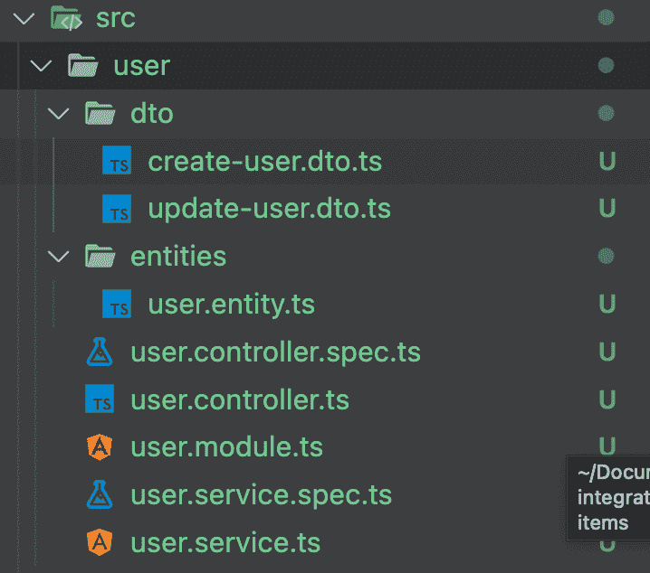

# 用 Dynamoose 对 NestJS 应用数据建模

> 原文：<https://blog.logrocket.com/nestjs-data-dynamoose/>

DynamoDB 是一个 [NoSQL 数据库](https://www.mongodb.com/nosql-explained)，这意味着它没有预定义的结构。使用 DynamoDB，您可以存储任何想要的数据，而不用担心数据模型，这使它成为处理非结构化数据时使用的强大工具。

但是 NoSQL 是有代价的。不定义结构意味着您必须一致地维护结构和数据类型，否则您的应用程序有崩溃的风险。

开发人员已经想出了防止这些问题的方法。在本文中，我们将探讨为什么应该使用 ORM 或对象关系映射和 DynamoDB 来管理数据库模型。我们还将看到为什么 Dynamoose 是最好的 ORM 工具。最后，我们将把 Dynamoose 与 NestJS 应用程序集成在一起，构建一个完整的 CRUD 应用程序，您可以将其作为参考。

在这篇文章中:

我们开始吧！

## DynamoDB 的难点

从 JavaScript 应用程序与 DynamoDB 交互的最常见方式是使用`[aws-sdk](https://docs.aws.amazon.com/AWSJavaScriptSDK/v3/latest/clients/client-dynamodb/index.html)`的 DynamoDB 客户端。但是这带来了几个问题。

### 1.DynamoDB 没有管理数据模型的方法

客户端没有提供管理应用模型的方法。如果您的应用程序需要一致性，这就变得很麻烦。

### 2.DynamoDB 没有数据验证

这可能是一个有争议的话题，因为使用 DynamoDB 的一个重要好处是能够在数据库中存储任何东西。

但是，实际上，我们并不经常要求这样。例如，我们不把电子邮件放入年龄字段，对吗？那我们该怎么办？

```
if(name.length > 0 && isEmail(email)){
  // store the value
}

```

我们必须自己进行验证，并且对每个领域进行验证，这变得很难维护。

### 3.DynamoDB 的奇怪语法

访问 DynamoDB 的语法很奇怪，经常依赖于字符串查询，很不方便。下面是来自官方文档的一个例子，它查询一个包含视频系列中某一集信息的表格。

```
var params = {
  ExpressionAttributeValues: {
    ':s': {N: '2'},
    ':e' : {N: '09'},
    ':topic' : {S: 'PHRASE'}
  },
  KeyConditionExpression: 'Season = :s and Episode > :e',
  ProjectionExpression: 'Episode, Title, Subtitle',
  FilterExpression: 'contains (Subtitle, :topic)',
  TableName: 'EPISODES_TABLE'
};

ddb.query(params, function(err, data) {
   // handle the error and the other things here
});

```

这可能需要很长时间才能理解。而当有多个领域可以推理的时候，就变成了噩梦！

### 4.DynamoDB 很难维护

DynamoDB 的这些问题让开发人员(包括我自己)很难对查询进行推理。而且因为语法不熟悉，所以需要陡峭的学习曲线，这对于快节奏的项目是不可取的。

## DynamoDB 问题的解决方案

我们可以用 ORM 或对象关系映射来解决前面提到的问题。ORM 工具使管理数据库模型变得容易，并且通过使用更简单的语法使访问数据库变得更容易。

使用 ORM 有很多好处:

*   语法很简单
*   当您可以利用您最喜欢的类型脚本时，管理模型变得更加容易
*   这样更安全
*   数据验证很容易完成
*   它可以与 DynamoDB 表通信，并提供类型脚本支持

## 为什么你应该选择 Dynamoose 作为你的 ORM 工具

DynamoDB 有很多 ORM 工具可供选择，包括 [dynamodb-data-types](https://github.com/kayomarz/dynamodb-data-types) 、 [dyngod](https://github.com/aaaristo/dyngodb) 、 [b](https://github.com/aaaristo/dyngodb) 和[dynasour](https://github.com/tglines/dynasaur)。

但是它们都没有[电动汽车](https://dynamoosejs.com/getting_started/Introduction)受欢迎:

*   易于使用
*   类似于 Mongoose，它是 MongoDB 的 ORM 工具，使得开发人员对语法非常熟悉
*   提供良好的类型支持
*   具有强大的过滤功能
*   支持 DynamoDB 事务
*   提供回拨和承诺支持

今天，我们将了解如何在 NestJS 应用程序中使用 Dynamoose。

## 使用 Dynamoose 创建 NestJS 应用程序

创建我们的 NestJS 项目的第一步是安装 NestJS CLI。

```
npm i -g @nestjs/cli

```

接下来，初始化样板项目。

```
nest new nestjs-dynamoose-integration

```

然后，安装所需的依赖项。

```
yarn add dynamoose

```

我们准备开始了！

## 1.配置电动主机

为了让 Dynamoose 与 AWS 帐户上的 DynamoDB 表对话，它需要适当的权限。你可以在这里找到配置[的不同方法。](https://dynamoosejs.com/getting_started/Configure/)

出于我们的目的，我们将在应用程序中使用`access_key`和`secret_key`来设置凭证。

打开`main.ts`文件，添加以下配置代码:

```
import { NestFactory } from '@nestjs/core';
import { AppModule } from './app.module';

import * as dynamoose from 'dynamoose';

async function bootstrap() {
  // do this before the app is created.
  dynamoose.aws.sdk.config.update({
    accessKeyId: 'YOUR_ACCESS_KEY',
    secretAccessKey: 'YOUR_SECRET_ACCESS_KEY',
    region: 'YOUR_PREFERRED_REGION',
  });

  const app = await NestFactory.create(AppModule);
  await app.listen(3000);
}
bootstrap();

```

如果您不确定如何获得这些密钥，您可以[参考文档](https://docs.aws.amazon.com/sdk-for-javascript/v2/developer-guide/getting-your-credentials.html)。理想情况下，您应该使用环境变量来加载它们，而不要在项目中以纯文本的形式使用它们。

## 2.创建用户端点

NestJS 的好处在于它会自动为您创建许多样板文件。今天我们将使用 Dynamoose 构建一个 CRUD 端点。让我们为它创建样板代码。

在命令行上运行以下命令。

```
nest g resource user

```

运行该命令后，您将看到所有必需的代码都是自动生成的。



多酷啊。

## 3.定义数据结构

下一步是创建一个扩展 Dynamoose 提供的`Document`类的`entity`类，它将定义我们实体的结构。

打开`user.entity.ts`文件并粘贴以下代码。

```
import { Document } from 'dynamoose/dist/Document';

export class User extends Document {
  Id = 0;
  Name = '';
}

```

这种结构有两个目的:

*   它帮助其他开发人员快速了解数据结构
*   它使用 TypeScript 的功能自动建议字段

这一步是可选的，但是我强烈推荐它！

## 4.创建模式来定义 Dynamoose 数据库模型

遵循 Mongoose 库的足迹，Dynamoose 还使用模式的概念定义了数据库模型。模式是我们的 DynamoDB 表理解的数据模型的定义。

如前所述，DynamoDB 不限制我们可以上传到数据库表的数据。但是我们可以使用模式定义所需的数据形状，Dynamoose 将确保我们的数据符合该结构。

其他一些好处包括:

*   我们可以将一个字段标记为`required`，这将确保该字段永远不会为空
*   我们可以定义一个属性的`type`
*   我们可以定义嵌套对象的结构
*   我们可以提供一个`custom validation`函数来验证字段的值
*   我们可以自动生成`timestamps`

让我们在实体目录中创建新的`user.schema.ts`文件，并将下面的代码粘贴到那里。

```
import * as dynamoose from 'dynamoose';

export const UserSchema = new dynamoose.Schema(
  {
    Id: {
      type: Number,
      hashKey: true,
      required: true,
    },
    Name: {
      type: String,
      required: true,
      index: {
          name: nameIndex,
          global: true
      }
    },
  },
  {
    timestamps: true,
  },
);

```

让我们了解一下这是怎么回事:

*   `Id`字段被指定为一个`Number`，所以我们不能在这里传递任何键
*   `Name`字段是`required`，所以如果它是空的，就会出错
*   `Name`的类型是`String`，所以没有其他数据类型可以放在那里
*   我们添加了`timestamps`属性，它将自动为我们生成和维护`createdAt`和`updatedAt`字段
*   我们在`Name`字段上创建了一个全局索引

这些事情的发生并不需要我们编写不必要的验证函数。

## 5.创建 CRUD 操作

让我们打开`user.service.ts`文件，在这里我们将创建所有需要的 CRUD 操作。

首先，确保我们有一个本地`dbInstance`并用用户信息初始化它。

请记住，理想情况下，我们希望创建一个单独的`user.repository.ts`文件来保存我们的数据库逻辑。我们通常将服务类用于业务逻辑。

为了简单起见，我们现在将 DB 操作放在服务类中。

```
@Injectable()
export class UserService {
  private dbInstance: Model<User>;

  constructor() {
    const tableName = 'users';
    this.dbInstance = dynamoose.model<User>(tableName, UserSchema);
  }

  //... crud functions
}

```

这里，我们用`User`模型添加一个私有的`dbInstance`。在构造函数内部，我们指定想要使用哪个表，并在这里提供`UserSchema`。

现在，我们的`dbInstance`知道要访问哪个 DynamoDB 表，以及预期的数据类型。

### 创建用户

为了创建一个`user`，我们可以编写下面的函数。

```
async create (createUserDto: CreateUserDto) {
    return await this.dbInstance.create({
      Id: createUserDto.Id,
      Name: createUserDto.Name,
    });
}

```

注意，我们使用的是`CreateUserDto`请求对象，NestJS 已经为我们定义了这个对象。

它看起来会像这样:

```
export class CreateUserDto {
  Id: number;
  Name: string;
}

```

### 获取用户

要获得单个用户，我们可以使用主键查询数据库，如下所示:

```
async findOne(id: number) {
    return await this.dbInstance.get({ Id: id });
}

```

您还可以使用许多东西进行查询，比如部分匹配、小于或大于运算符。你可以在文档中找到更多的细节。

### 更新用户

为了更新`user`，我们得到了一个由 Dynamoose 提供的`update`函数。

```
async update(id: number, updateUserDto: UpdateUserDto) {
    return await this.dbInstance.update({
      Id: id,
      Name: updateUserDto.Name,
    });
}

```

### 删除用户

要通过 ID 删除用户，请输入以下代码:

```
async remove(id: number) {
    return await this.dbInstance.delete({ Id: id });
}

```

最终版本应该是这样的:

```
import * as dynamoose from 'dynamoose';
import { Injectable } from '@nestjs/common';
import { CreateUserDto } from './dto/create-user.dto';
import { UpdateUserDto } from './dto/update-user.dto';
import { User } from './entities/user.entity';
import { Model } from 'dynamoose/dist/Model';
import { UserSchema } from './entities/user.schema';

@Injectable()
export class UserService {
  private dbInstance: Model<User>;

  constructor() {
    const tableName = 'users';
    this.dbInstance = dynamoose.model<User>(tableName, UserSchema);
  }

  async create(createUserDto: CreateUserDto) {
    return await this.dbInstance.create({
      Id: createUserDto.Id,
      Name: createUserDto.Name,
    });
  }

  async findOne(id: number) {
    return await this.dbInstance.get({ Id: id });
  }

  async update(id: number, updateUserDto: UpdateUserDto) {
    return await this.dbInstance.update({
      Id: id,
      Name: updateUserDto.Name,
    });
  }

  async remove(id: number) {
    return await this.dbInstance.delete({ Id: id });
  }
}

```

## 6.测试用户端点

让我们转到 [Postman](https://www.postman.com/) 并使用下面的主体创建一个用户。

```
endpoint: http://localhost:3000/user
method: POST
body: {
    "Id": 1,
    "Name" : "Faisal"
}

```

如果你试图像这样得到特定的用户…

```
endpoint: http://localhost:3000/user/1
method: GET

```

…它会给你以下的回应:

```
{
    "Id": 1,
    "Name": "Faisal",
    "createdAt": 1660504687981,
    "updatedAt": 1660504687981
}

```

你可以看到有两个额外的字段:`createdAt`和`updatedAt`，它们是自动生成的。

同样，你也可以使用`update`和`delete`方法。

现在，您已经有了一个完全正常工作的 CRUD 应用程序，能够使用 Dynamoose 与实际的 DynamoDB 对话。

在本文中，您学习了如何在 NestJS 应用程序中使用 Dynamoose。点击查看该项目的 GitHub 库[。另一个名为](https://github.com/Mohammad-Faisal/nestjs-dynamoose-integration) [nestjs-dynamoose](https://www.npmjs.com/package/nestjs-dynamoose) 的包在用法上添加了一些语法糖。

我希望你今天学到了新东西。祝您愉快！

## 使用 [LogRocket](https://lp.logrocket.com/blg/signup) 消除传统错误报告的干扰

[](https://lp.logrocket.com/blg/signup)

[LogRocket](https://lp.logrocket.com/blg/signup) 是一个数字体验分析解决方案，它可以保护您免受数百个假阳性错误警报的影响，只针对几个真正重要的项目。LogRocket 会告诉您应用程序中实际影响用户的最具影响力的 bug 和 UX 问题。

然后，使用具有深层技术遥测的会话重放来确切地查看用户看到了什么以及是什么导致了问题，就像你在他们身后看一样。

LogRocket 自动聚合客户端错误、JS 异常、前端性能指标和用户交互。然后 LogRocket 使用机器学习来告诉你哪些问题正在影响大多数用户，并提供你需要修复它的上下文。

关注重要的 bug—[今天就试试 LogRocket】。](https://lp.logrocket.com/blg/signup-issue-free)