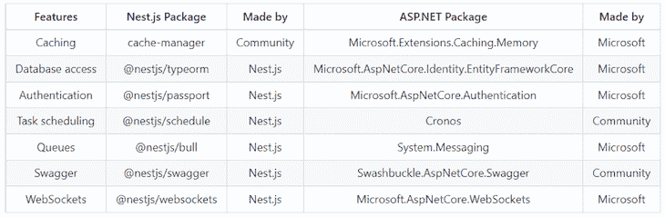

# NestJS vs. ASP。NET:比较 web 框架

> 原文：<https://blog.logrocket.com/nestjs-vs-asp-net-comparing-web-frameworks/>

有太多的方法可以开始你的 web 开发之旅，现代 web 有这么多可用的框架，对于新手来说，选择一个最适合他们的框架变得越来越困难。

尽管任何给定的 web 框架显然都是为 web 本身设计的，但每个框架都有自己的长处和短处。例如，你要建立的网站的类型，你的网站应该有多高的性能，可用的开发者资源，以及你使用的云提供商都会影响你的决策。因此，在选择 web 框架时，需要考虑很多因素。

在本文中，我们将回顾两个流行的框架，NestJS 和 ASP.NET，从特性和可用性方面对它们进行比较。我们开始吧！

## 目录

## 什么是 NestJS？

[NestJS](https://nestjs.com/) 是一个 Node.js web 框架，完全使用 TypeScript 编程语言实现。与 Node.js 中的其他 web 框架相比， [NestJS 强调更有组织的项目结构](https://blog.logrocket.com/nestjs-vs-express-js/)。大多数有经验的开发人员都知道 NestJS 是如何从另一个框架 Angular 构建代码的。

与 Express 使用的函数式方法相比，NestJS 充分利用了 TypeScript 的面向对象编程。在幕后，根据您的配置，NestJS 使用 Express 或 Fastify 来运行其 HTTP 服务器。因此，您可以将 NestJS 视为另一个框架之上的抽象层。

## 什么是 ASP.NET？

[ASP.NET](https://dotnet.microsoft.com/en-us/apps/aspnet)是微软创建的一个 web 框架，使用微软的 C#编程语言。ASP.NET 已经存在很长时间了，早在 2002 年。尽管如此，它在过去的几年中已经有了巨大的改进，并且每年都在不断地发布新的版本。

因此，ASP.NET，现在更普遍的称呼。NET 是一套编程工具，你可以用它来用 C#构建几乎任何东西。web 框架现在通常被称为。网芯，带[。NET 6](https://dotnet.microsoft.com/en-us/download/dotnet/6.0) 是撰写本文时的最新版本。

## 什么是 TypeScript 和 C#？

微软同时创造了 TypeScript 和 C#。微软创造 C#是为了应对网络繁荣时期日益增长的需求。像 Sun Microsystems 的 Java 这样的语言正在发展成为 web 开发人员中最流行的编程语言之一，所以微软决定通过创建自己的语言来进入市场。

网络泡沫破灭后，JavaScript 也变得越来越流行。在 21 世纪初，微软的工程师们用一个叫做 TypeScript 的健壮的类型系统创建了一个 JavaScript 的超集。但是，TypeScript 在 2010 年代后期，大约在 2016 年至 2017 年蓬勃发展之前，花了很长时间才成熟。

由于这两种编程语言都是由同一家公司开发的，因此它们具有影响开发体验的内在相似性。两种语言都被编译，这意味着编译器会在编译时检查错误。但是，只有使用 TypeScript，而不是 JavaScript，编译才是真的。

## TypeScript 中的面向对象编程

TypeScript 中的 OOP 比 JavaScript 中的要好一些。然而，JavaScript 和 TypeScript 都支持类，用这两种语言实现代码封装非常简单:

```
class Car {
  color: string;
  getColor() {
    return this.color;
  }
  setColor(_color: string) {
    this.color = _color;
  }
}

```

然而，TypeScript 有一点 JavaScript 没有，那就是接口:

```
interface Car {
  type: string;
  getType(): string;
  setType(_type);
}

```

该接口的实现类似于下面的代码:

```
class Audi implements Car{
  type: string;
  color: string;
  getName() {
    return this.color;
  }
  setName(_color: string) {
    this.color = _color;
  }
  getType(): string {
    return this.type;
  }
  setType(_type: any) {
    this.type = _type;
  }
}
interface Car {
    type: string;
    getType(): string;
    setType(_type);
}

```

NestJS 是在 TypeScript 中最熟练地使用 OOP 的框架之一。NestJS 中的一切都涉及 OOP 概念，如接口、类和依赖注入。

## C#中的面向对象编程

C#模仿了当时最流行的面向对象编程语言 Java。直到最近，用 C#编写代码总是有与用 Java 编写代码相同的缺点，例如，必须创建一个`main`函数，处理复杂的项目结构，以及围绕提供者、服务和控制器的相似和冲突的类名的混乱。

在 C#中创建一个类似的基类将类似于下面的代码:

```
class Car
{
  private string color;
public void getColor() 
  {
    return this.color;
  }
public void setColor(string color) 
  {
    this.color = _color;
  }
}

```

界面将类似于下面的代码:

```
interface ICar
{
    string getType();
    void setType(_type);
}

```

该接口的完整实现类似于下面的代码:

```
class Audi : ICar
{
  private string type;
  private string color;
  public void getColor() 
  {
    return this.color;
  }
  public void setColor(string color) 
  {
    this.color = _color;
  }
  public void getType() 
  {
    return this.type;
  }
  public void setType(string type) 
  {
    this.type = _type;
  }
}

```

从经验上讲，与 TypeScript 相比，你会发现 C#拥有丰富得多的 OOP 特性。接口仅仅触及了 C#的皮毛。一个更高级的概念将是使用反射，但我在这里超越了自己。

## 内斯特杰队对 ASP.NET 队

现在，我们开始有争议的部分；你的项目应该选哪个？

无论是内斯特和。NET 是你可以在其上构建的卓越框架，但是你需要考虑的一些决策很可能属于个人偏好。这不是一场受欢迎程度的竞赛，就像商业中的其他事情一样，视情况而定。在这两个框架之间做出选择是很棘手的，因为它们非常相似。

## 主要功能比较

谈到认证、缓存和数据库访问，NestJS 和 ASP.NET 都提供了开箱即用的特性。NestJS 将这些包含在以下包中:

另一方面，ASP.NET 涵盖了身份验证、缓存、数据库访问，以及更多类似以下的包:

*   `Microsoft.AspNetCore.Authentication`
*   `Microsoft.AspNetCore.Caching.Memory`
*   `Microsoft.AspNetCore.Identity.EntityFrameworkCore`

Tevpro 的这篇[文章描述了 NestJS 为您提供的开箱即用的特性集合。为了向您提供更好的描述，您可以查看比较 NestJS 和 ASP 之间可用包的表格。网络:](https://www.tevpro.com/blog/why-your-next-application-should-be-built-with-nestjs)



内斯特和 ASP.NET 背后都有庞大的社区。例如，NestJS 可以依赖 Node.js 社区，而 ASP.NET 有一个大公司的支持，因为它被用于世界上几乎所有的大公司系统。

自然，与 NestJS 相比，ASP.NET web 框架有更多的软件包，因为 ASP.NET 已经存在更长时间了。但是随着时间的推移，越来越多的 JavaScript 和 TypeScript 开发人员进入这个领域，NestJS 将从中受益。

## 类似

你可能会惊讶，内斯特和 ASP.NET 有很多相似之处。由于这两个框架在日常工作中都非常依赖于 OOP，并且考虑到 TypeScript 和 C#作为编程语言是如此的相似，当你比较一个用这两个框架创建的应用程序时，不会有太大的不同。

例如，一个简单的 NestJS 项目的服务控制器将如下所示:

```
@Controller()
export class AppController {
  constructor(private readonly appService: AppService) {}
  @Get()
  getHello(): string {
    return this.appService.getHello();
  }
}

```

`AppController`通过依赖注入接收一个`AppService`，`getHello`函数将返回一个字符串作为响应。例如，ASP.NET 的一个类似的控制器看起来像下面的代码:

```
namespace Backend.AppController
{
    [ApiController]
    public class AppController
    {
        private readonly AppService appService;
        public AppController(AppService _appService)
        {
            this.appService = _appService;
        }
        [HttpGet]
        public async Task<IActionResult> GetHello()
        {
            return Ok(this.appService.GetHello());
        }
    }
}

```

与 NestJS 的对应物相比，用 ASP.NET 语言写似乎更冗长。因为两个框架都使用编译语言，编译器可以在运行前捕捉到像类型错误这样的小错误。

## NestJS vs . ASP.NET 基准测试

比较两种框架之间的速度是有争议的，至少可能会招致一些批评，但是在选择框架时，您仍然应该考虑这一点。

在 [2022 年 Tech Empower Web 基准测试](https://www.techempower.com/benchmarks/#section=data-r21)中，ASP.NET 核心在速度最快的框架中排名第 14:


而使用 Fastify 后端的 NestJS 排在第 239 位:


请注意，这些基准测试是对框架响应速度的任意速度计算。大多数时候你不一定需要一个快速的框架。可以说，最重要的度量标准是您的开发速度，但这是非常主观的，这就引出了下一点。

## 什么时候你应该考虑 NestJS 超过 ASP.NET？

当在内斯特和 ASP.NET 之间做出选择时，公众舆论会让你举棋不定。通常，这将归结为你问哪个社区，或者，在这种情况下，Sub Reddit。

在回顾了 Reddit 之后，有几个帖子对两个框架进行了比较。有人将 [Node.js 直接与 ASP.NET](https://www.reddit.com/r/dotnet/comments/9ft0hc/is_it_worthy_to_change_nodejs_to_aspnet_core/)相提并论。讨论的主要共识可以总结为，[如果你想从 Node.js 迁移到 ASP.NET，首先考虑 TypeScript】。](https://www.reddit.com/r/Nestjs_framework/comments/vwu57t/whats_the_pros_of_nestjs_over_aspnet_core/)

由于 NestJS 已经使用了 TypeScript，这就自动解决了问题，对吗？不对。没那么简单。当然，TypeScript 被认为更好，因为它结合了前端语言和后端语言，使得小团队更容易扩展他们的产品。但是，在某些情况下，使用 ASP.NET 会更有意义。

例如，如果你的云提供商是 Azure，并且你不介意被某个供应商锁定，那么 ASP.NET 会更好。

但是，从更广的范围来看，NestJS 和 ASP.NET 之间并没有太多的不同，因为他们追求的理念有很多重叠，最明显的是他们对 OOP 的大量使用。因此，在某些情况下，您会发现这两个框架之间的相似之处多于不同之处，除了语言特定的差异，这种差异非常多。

实际上，您不需要考虑速度、项目结构、库可用性和社区支持。您只需要考虑以下几点:

1.  您团队的特定技能组合
2.  您的产品时间表
3.  您正在使用的云提供商
4.  两者都是服务器端的渲染框架，让你可以很容易地连接一个传统的 MVC 应用程序，把所有的东西放在一个紧密结合的整体中

在选择您的框架时，您应该注意常见的陷阱。不要对自己之前的选择过于教条。时代在变，一些框架可能变得更受欢迎，不是因为它们的能力，而是因为它们赢得了流行度竞赛。不要为小事搬起石头砸自己的脚。

## 结论

NestJS 和 ASP.NET 是卓越的框架，但是它们的使用通常仅限于你所拥有的那种团队。

没有理由一定要选择这些框架，除非您正在做一些特定于行业的事情，需要您使用一组语言而不是另一组。举个例子，如果[你用 Unity 做游戏开发](https://blog.logrocket.com/making-mobile-game-motion-sensors-unity/)，无意中用到了 C#，那么你应该考虑用 ASP.NET 做你的后端。

在 NestJS 和 ASP.NET 之间做出选择不像在 NestJS 或高性能 Go 或 Rust web 框架之间做出选择那么高风险。每一个都有其独特的功能，但总的来说，它们的共同点多于差异。所以，不要对技术过于教条；跟上时代。编码快乐！