# NestJS vs. LoopBack 4:哪个最好？

> 原文：<https://blog.logrocket.com/nestjs-vs-loopback-which-is-best/>

NestJS 和 LoopBack:哪个最好？有最好的吗？

在节点框架之间进行选择是非常令人困惑的，尤其是当有这么多好的选择时。选择正确的框架不仅需要了解你正在做的项目，还需要了解两种框架以及何时使用它们。

我以前并不喜欢使用框架来构建后端节点应用程序。你可以说我们有一种爱恨交加的关系，但是几年前我尝试使用 NestJS，并感到惊讶！在那之后，我认为 Nest 是最好的…

…直到我开始尝试 LoopBack 4。现在我被撕裂了！

在本文中，我们将比较 NestJS 和 LoopBack 的各种属性和特性。我们还将讨论在不同的场景下这两者中哪一个是最好的。虽然我不能明确指出哪个更好，但我可以根据几个重要因素来分析哪个最好。我们将在下面的文章中讨论这些问题！

## 什么是 NestJS？

[NestJS 是一个 Node.js 框架](https://blog.logrocket.com/node-back-end-next-level-nestjs/)，用于构建高效、可伸缩、企业级的服务器端应用。它使用渐进式 JavaScript 并完全支持 TypeScript。

Nest 使用默认的 Express.js，但也可以使用 Fastify 等替代方法进行配置。

Nest 旨在解决软件架构的问题。值得注意的是，该架构的灵感主要来自 Angular，这是一个用于创建单页面应用程序的前端平台和框架。由于其软件架构，Nest 使团队和开发人员能够创建易于维护、可测试、可伸缩和松散耦合的服务器端应用程序。

## 什么是回环 4？

LoopBack 是一个创新的、[获奖的](https://strongloop.com/strongblog/loopback-2019-api-award-api-middleware/) Node.js 框架。它使软件工程师能够使用后端系统快速创建 API 和微服务，如数据库和 REST 或 SOAP 服务。

LoopBack 是高度可扩展的，具有对 TypeScript 的现成支持，并且构建在 Express 之上。

LoopBack 使构建现代 API 应用程序变得非常简单,几乎不需要编码。它是开源的，受到 IBM 和 StrongLoop 的大力支持，由 OpenAPI 驱动。Loopback 也遵循 [OpenAPI 标准](https://www.openapis.org/)，该标准正在被业界广泛接受。

我不知道你怎么想，但是仅仅定义这两个框架并不能让我确信哪一个是最好的。我们来试着对比一下！

## NestJS 与 LoopBack 4 的比较

NestJS 是全栈节点框架，LoopBack 是微框架。前者功能强大，非常容易使用，而后者是在需要数据库、REST API、AAA 和 Swagger 时考虑的。这两个框架都是开源的。

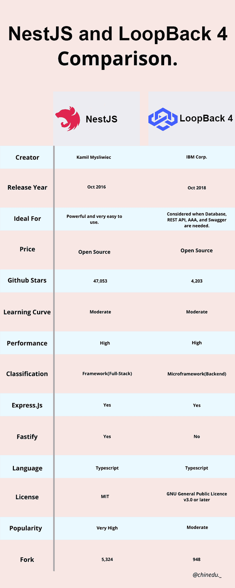

### 受欢迎程度和增长

这两个框架在开发人员和各种技术社区中都很受欢迎。

写这篇文章的时候，LoopBack 有 4.2k 的 GitHub 星和 947 个叉，而 NestJS 有 47k 星和 5.3k 左右的叉。你可以在下图中看到，随着时间的推移，这两个框架对 Google 的兴趣越来越大。

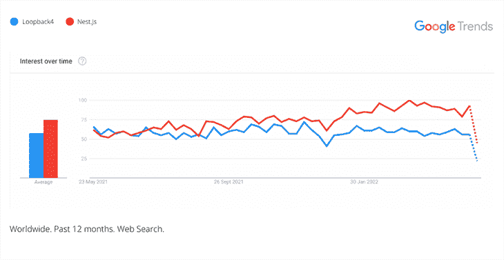

LoopBack 4 and NestJS interest over 12 months.

如前所述，LoopBack 是一个微框架(后端)，而 NestJS 是一个框架(全栈)。这可能是 NestJS 比 LoopBack 拥有更多的 GitHub 明星的一个原因。

GitHub 明星之间的差距和 NestJS 普遍受欢迎背后的另一个原因可能是因为 NestJS 软件非常固执己见。它也得到了 Angular 社区的大力支持并很容易被采纳。

看看对比信息图，看看哪个框架有更高的 GitHub 星级计数仍然不能满足我。让我们继续其他因素。

### 总性能

性能是一个好框架的基础。毫不奇怪，NestJS 在开发人员中非常受欢迎，LoopBack 作为最具创新性的框架之一赢得了奖项。

[回送基准](https://github.com/loopbackio/loopback-next/pull/1583)测量我们创建新记录和获取数据的速度。这项测试是在 2015 年年中的 MacBook Pro 上进行的，该机配有 22.5 GHz 英特尔酷睿 i7 处理器、16GB 内存和 1600 MHz DDR3。

获取数据的平均结果是每秒 4，569 个请求，而创建一个新记录需要每秒 348 个请求。

当我们查看延迟时，以毫秒为单位获取数据的平均时间是 1.68，而创建一个新数据需要 28.27 毫秒。

* * *

### 更多来自 LogRocket 的精彩文章:

* * *

虽然 LoopBack 试图使用真实世界的工作场景来测试和测量每秒的请求数，但 NestJS 使用了一个“Hello World”应用程序来进行测试，根据 NestJS [代码检查基准](https://github.com/nestjs/nest/runs/482105333)显示，NestJS 和 Fastify 应用程序每秒处理大约 30，001 个请求。

### 可量测性

web 应用程序的可伸缩性是它处理越来越多的并发用户的能力。

由于其应用程序架构，NestJS 对于大型应用程序是可伸缩的。它允许软件开发人员构建易于维护、高度可测试和松散耦合的应用程序。

此外，使用像 Express(默认)或 Fastify 这样的 HTTP 服务器框架极大地提高了大型应用程序的可伸缩性。它是用 TypeScript 构建的这一事实也是一大优势。

LoopBack 也非常适合构建复杂的 Node.js 应用程序。它解决了松耦合应用程序的一个巨大问题:不同的部分必须无缝地协同工作，而不需要了解彼此，以引入模式来帮助解决这些问题。

回送将控制权交给软件工程师。它支持问题解决，允许开发者在不破坏应用核心基础的情况下引入更多功能。

我们还可以通过回送将一组动作组合成一个有意义的流/序列，比如建立一个有效的管道来处理 HTTP 请求和响应。

LoopBack 构建在 Express 框架上，使用 TypeScript，这使得它具有高度的可伸缩性，可以构建具有可扩展性、可组合性和极大灵活性的应用程序。

## NestJS 和 LoopBack 4 的特性

现在，我们将比较 NestJS 和 LoopBack 4 的一些特性。

### NestJS 的特点

不出所料，NestJS 的流行是由于其惊人的功能，这些功能在技术社区掀起了风暴。

以下是其中的一些，仅举几例:

*   由于其惊人而强大的命令行界面(CLI ),提高了工作效率并增加了开发时间
*   拥有大量持续维护的文档
*   是开源的(麻省理工学院许可)
*   是用 JavaScript 的超集 TypeScript 编写的
*   在使用 NestJS 构建的微服务类型应用程序的文档中有一个专门的章节
*   使单元测试变得容易
*   拥有积极维护和开发的代码库

### 环回 4 的特征

虽然 LoopBack 的受欢迎程度与 NestJS 相比无处可去，但 LoopBack 有一些令人惊叹的创新功能，我们不能视而不见。以下是其中的一些:

*   是开源的
*   支持 TypeScript 并包含 OpenAPI 规范、GraphQL 等。
*   借助其强大的命令行界面(CLI ),开发团队可以快速创建动态的端到端 REST APIs
*   支持使用 AngularJS、Android 和 iOS SDKs 快速创建客户端应用。
*   具有简单的授权和身份验证设置、API 资源管理器模型、基于角色的访问控制、oAuth 注册，以及带有开箱即用浏览器支持的用户模型
*   轻松连接到 MongoDB、Postgres、MySQL 和 Oracle 等后端数据存储

即使在研究了它们的特性之后，我们也不能忽视性能、可伸缩性、入门的容易性以及测试基于这些框架的 web 应用程序的容易性。所有这些因素对于软件工程师来说都是不可或缺的决策，以充分利用这些技术并真正实现开发目标。

现在，让我们来评估在每个框架中创建一个项目。

## 创建项目

让我们看看如何在这两个框架中创建一个简单的项目。

### 在 NestJS 中创建“Hello World”应用程序

**N.B，**根据 NestJS 文档，建议在您的操作系统中安装 Node.js v10.13.0 及更高版本，v13 除外。

首先，我们需要安装 NestJS 命令行接口。

```
npm i -g @NestJS/cli

```

然后，在我们操作系统的终端，我们使用下面的命令创建一个新项目:

```
nest hello-world-app

```

将为`hello-world-app`创建一个目录。将安装必要的样板文件和节点模块，并填充`src/`目录。

下面是填充在`src/`目录中的文件的图像:

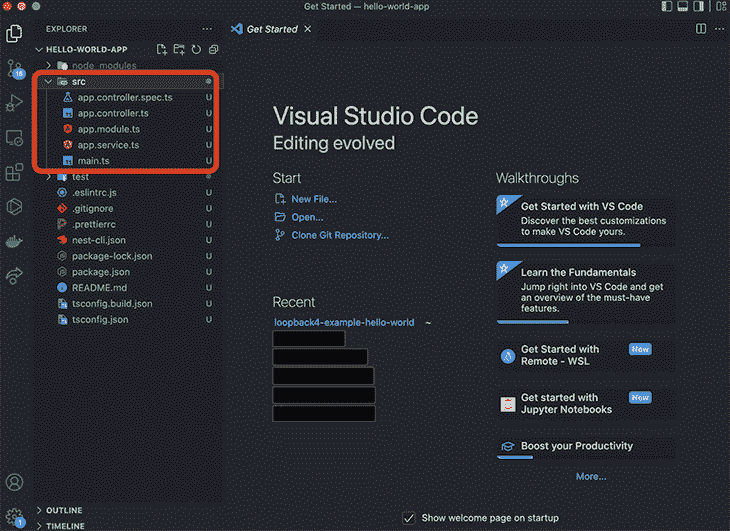

安装过程结束后，我们可以运行`npm run start:dev`命令来启动 app。

一旦应用程序运行，如果我们打开浏览器并访问 [http://localhost:3000/](http://localhost:3000/) ，我们将看到“Hello World！”在浏览器里！

### 在 LoopBack 4 中创建“Hello World”应用程序

注意:为了让这个应用程序工作，我们需要安装 Node.js v10 或更高版本。

首先，我们必须全局安装环回 CLI 工具包:

```
npm i -g @loopback/cli

```

然后，当我们创建一个新项目时，CLI 会安装所有依赖项并配置一个 TypeScript 编译器。CLI 将创建项目的框架，为此，我们将运行 CLI 并回答提示:

```
lb4 app

```

回答如下图所示的提示:

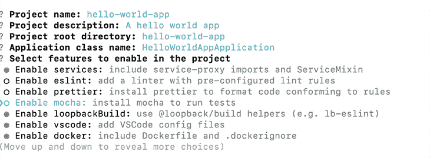

脚手架创建现在正在进行中。

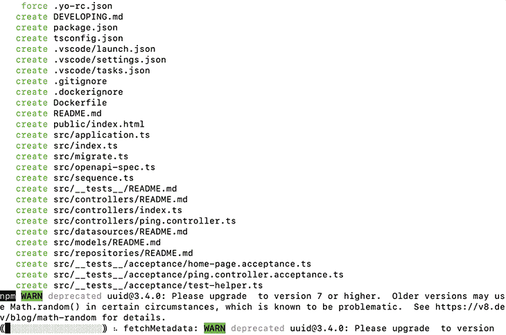

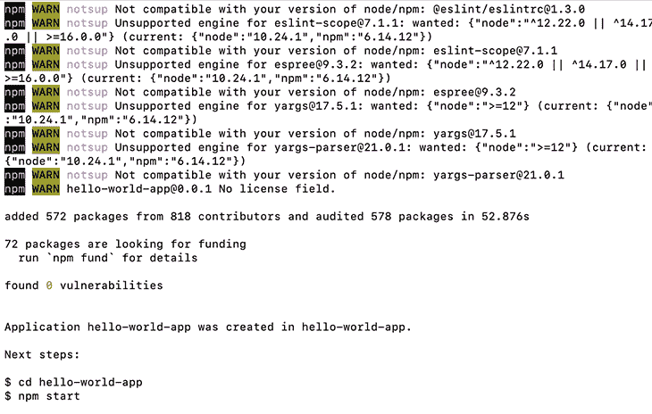

脚手架搭好之后，项目自带路线:`/ping`。为了进行测试，我们`cd`进入我们的项目并运行它:

```
cd hello-world-app
npm start

```

在我们的浏览器中，我们可以访问 [http://[::1]:3000/ping](http://127.0.0.1:3000/ping) 来查看结果:

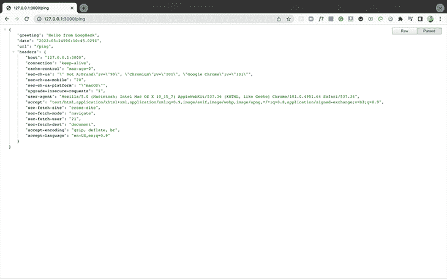

我们还可以看到我们的服务器运行在 [http://[::1]:3000](http://%5B::1%5D:3000) :

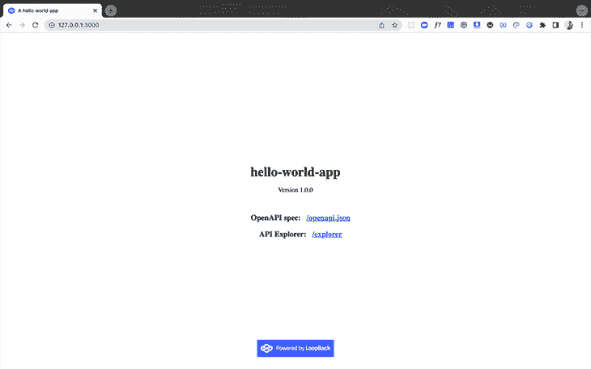

我们可以在[http://127 . 0 . 0 . 1:3000/Open API . JSON](http://127.0.0.1:3000/openapi.json)看到我们的开放 API 规范:

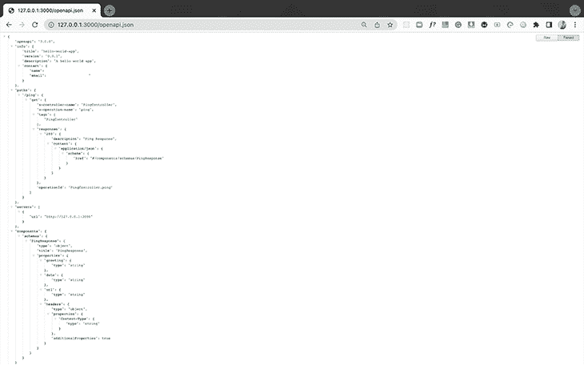

最后，我们在[http://127 . 0 . 0 . 1:3000/Explorer/](http://127.0.0.1:3000/explorer/)上的 API Explorer:

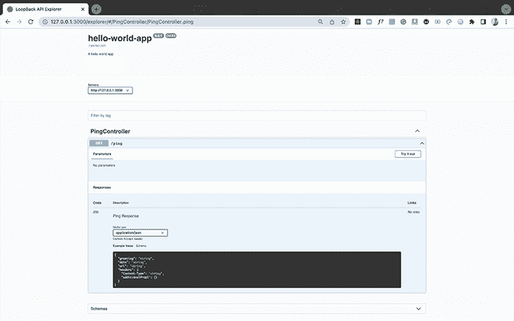

现在我们已经为我们的应用程序创建了脚手架，让我们继续为“Hello World”添加一个简单的控制器。

首先，如果应用程序还在运行，我们需要用`Control + C`停止它。

然后，我们需要为控制器运行以下命令:

```
lb4 controller

```

接下来，我们将回答如下提示:

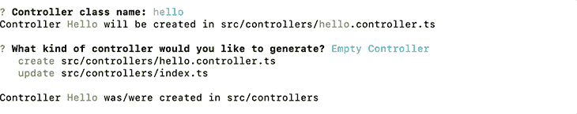

为了创建“Hello World”路线，我们将在`src/controllers/hello.controller.ts:`中粘贴以下代码

```
import {get} from '@loopback/rest';

export class HelloController {
  @get('/hello')
  hello(): string {
    return 'Hello world!!!';
  }
}

```

最后，我们可以使用`npm start`启动应用程序。

当我们访问[http://127 . 0 . 0 . 1:3000/Hello](http://127.0.0.1:3000/hello)时，看到的是“Hello World”。

## 在 NestJS 和 LoopBack 4 中测试

NestJS 支持自动化测试，这对软件开发非常重要。

自动化确保测试在非常关键的开发阶段运行，例如功能集成、版本发布和源代码控制检入。

前者包括使开发人员和团队能够自动化和构建测试的特性。

NestJS 集成了 [SuperTest](https://github.com/visionmedia/supertest) 和 [Jest](https://github.com/facebook/jest) ，提供自己的默认工具，自动搭建组件的默认单元测试和应用的端到端测试。

NestJS 也使得使用任何测试框架变得容易。

LoopBack 附带了一个完全自动化的测试套件，有助于加速开发。它还帮助新的和有经验的开发人员理解应用程序代码库的不同部分。当错误被修复和新特性被实现时，回送有助于防止退化，并确保基于回送构建的应用程序按预期工作。

回环已经推荐使用[摩卡](https://mochajs.org/)。Mocha 是一个运行在 Node.js 和浏览器上的 JavaScript 测试框架，它简化了异步测试。

然而，LoopBack 的自动化测试套件需要一个测试运行程序来执行测试并生成一个总结报告。于是，摩卡出手相救。

除了测试运行程序之外，自动化测试套件还需要一个库来创建测试替身。[兴农。JS](https://sinonjs.org/) 用于此。

推荐使用像 [Should.js](https://shouldjs.github.io/) 这样的断言库，以及像 [SuperTest](https://github.com/visionmedia/supertest) 这样的用于进行 HTTP 调用并验证其结果的库。

[@loopback/testlab](https://www.npmjs.com/package/@loopback/testlab) 模块自动与这些包集成，使它们易于与 loopback 一起使用，从而使 LoopBack 应用程序的测试设置非常快速和简单。

## NestJS 和 LoopBack 4 哪个框架更好？

我们已经到了必须回答这个非常重要的问题的时候了。嗯…

在这篇文章的开头，我问了一个我觉得你可能已经想到的问题。这两者之间真的有最好的吗？

每个框架都有它的优点和缺点，就像生活中的所有事情一样。

我发现选择一项技术并坚持下去才是王道。但是，当然，你必须根据你正在从事的项目及其背后团队的需求来做出决定。

最终，这两种技术都为帮助软件工程师构建快速、可伸缩、高效和可维护的 web 应用程序打下了坚实的基础。

## 结论

比较这两种技术并不容易，因为它们都是惊人的和非常创新的。

我们从定义这些框架到比较它们的流行度和增长。我们研究了它们的特性，它们是如何扩展的，以及使用这两个框架建立一个“Hello World”应用程序有多简单和快捷。最后，我们看了测试以及在两个框架中设置它有多容易。

这是一篇很长的文章，如果你一直读到这里，我必须说一声非常感谢你！总之，我希望你喜欢这篇文章，就像我喜欢写它一样。再次感谢你一直以来对我的支持！编码快乐，同志们！

## 使用 [LogRocket](https://lp.logrocket.com/blg/signup) 消除传统错误报告的干扰

[](https://lp.logrocket.com/blg/signup)

[LogRocket](https://lp.logrocket.com/blg/signup) 是一个数字体验分析解决方案，它可以保护您免受数百个假阳性错误警报的影响，只针对几个真正重要的项目。LogRocket 会告诉您应用程序中实际影响用户的最具影响力的 bug 和 UX 问题。

然后，使用具有深层技术遥测的会话重放来确切地查看用户看到了什么以及是什么导致了问题，就像你在他们身后看一样。

LogRocket 自动聚合客户端错误、JS 异常、前端性能指标和用户交互。然后 LogRocket 使用机器学习来告诉你哪些问题正在影响大多数用户，并提供你需要修复它的上下文。

关注重要的 bug—[今天就试试 LogRocket】。](https://lp.logrocket.com/blg/signup-issue-free)