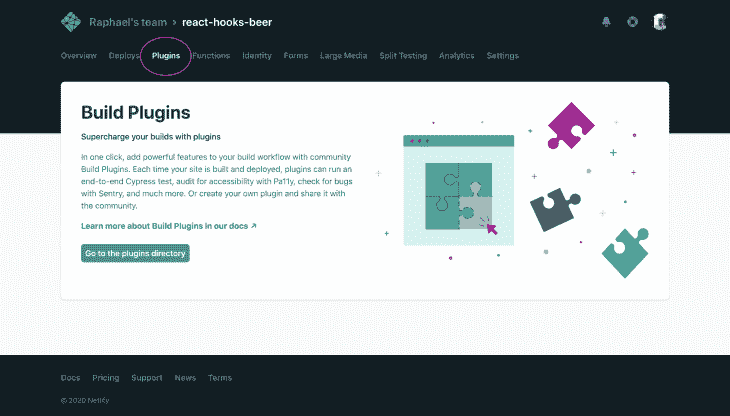
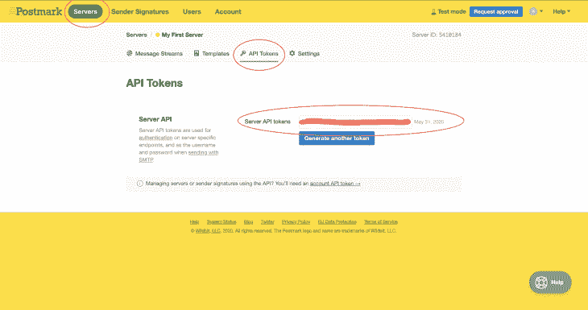
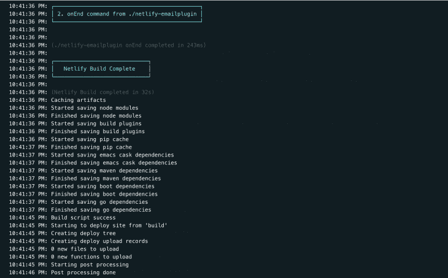
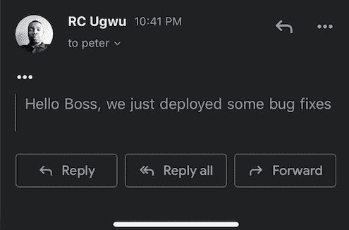

# 关于 Netlify 构建插件，你需要知道什么

> 原文：<https://blog.logrocket.com/netlify-build-plugins/>

有一段时间，托管基础设施和部署站点是我们唯一的选择。您部署了您的网站，购买了 URL，并支付了订阅费以保持其活跃。如今，Netlify 已经通过一系列功能成功地改进了这一点，包括跨框架支持、分析和无服务器功能。最近推出的一个特别的功能被证明是一个游戏改变者。

在这篇文章中，我们将学习什么是 Netlify 构建插件，它们做什么，以及如何创建一个插件。本教程假设您对 Netlify 及其特性有基本的了解——如果您不熟悉 Netlify，您可以查看本综合指南。

## 什么是 Netlify 构建插件？

构建插件允许您自动执行与项目构建过程相关的任务。每次部署项目时，这些任务都是异步执行的。每次部署项目时，您都可以使用构建插件来执行各种操作，例如每次站点部署时进行加密货币捐赠，或者向团队的其他成员发送通知——可能性是无限的。

有许多由开发人员创建的已发布插件，您可以添加到您的项目中，并在每次部署时执行很酷的东西。要向您的项目添加插件，在您的 Netlify 仪表板上，导航至`Sites`，然后选择您要添加插件的项目:


接下来，点击`Plugins`选项卡，浏览插件目录，然后选择您希望在项目中安装的插件:



 [https://www.youtube.com/embed/uZQuU-VBfK0?version=3&rel=1&showsearch=0&showinfo=1&iv_load_policy=1&fs=1&hl=en-US&autohide=2&wmode=transparent](https://www.youtube.com/embed/uZQuU-VBfK0?version=3&rel=1&showsearch=0&showinfo=1&iv_load_policy=1&fs=1&hl=en-US&autohide=2&wmode=transparent)

视频

## 构建自己的插件

每个 Netlify 构建插件都有一个由三个文件组成的“骨架”结构:

*   `index.js` —插件的入口点。这是你嵌入定义插件动作的逻辑的地方，可以使用 Netlify 的钩子，比如`onPrebuild`、`onPostbuild`或`onEnd`
*   `manifest.yml` —该文件处理交互数据。它可能是一组用户输入或信息，无论何时进行部署都需要这些信息
*   这个文件处理非交互数据，它包含插件的名字、作者和依赖关系

然后还有一个附加文件`netlify.toml`，当你的插件包含在你的项目中时，它将指定你的插件的路径。注意，这个文件只有在你的插件还没有发布到 NPM 的时候才有用。

我们将处理这四个文件，但是首先，我们需要在项目的文件夹中全局安装 Netlify。对于我的项目，我将部署一个用 React Hooks 构建的电子商务商店演示。使用我们的终端，让我们导航到我们的项目文件夹并安装 Netlify:

```
# Navigate to your project
cd react-hooks-app

# Install Netlify CLI globally
npm install netlify-cli -g

### OR use Yarn ### 
yarn global add netlify-cli
```

接下来，在我们的项目中，我们将为插件创建一个文件夹。在项目文件夹中，创建一个存储插件内容的文件夹。Netlify 插件遵循一个命名约定，插件是根据它们的功能来命名的。我们正在构建一个插件，每次部署我们的应用程序时，它都会向队友或老板发送一封电子邮件，所以我们称之为`netlify-emailplugin`:

```
+ react-hooks-app
   + .netlify
   + build
   + node_modules
   + public
     - index.html
   + src
   + netlify-emailplugin
     - index.js
     - manifest.yml
     - package.json
```

## `package.json`

让我们首先处理`package.json`文件，在这里我们将定义我们的插件并安装我们需要的任何必要的依赖项。在您的终端中，导航到您的插件的文件夹并运行`npm init`——这将显示几个您需要填写的关于您的插件的问题:

```
{
  "name": "netlify-emailplugin",
  "version": "1.0.0",
  "description": "A Netlify plugin that emails my boss each time I make an update",
  "main": "index.js",
  "devDependencies": {},
  "scripts": {
    "test": "echo \\\"Error: no test specified\\\" && exit 1"
  },
  "repository": {
    "type": "git",
    "url": "git+https://github.com/fullstackmafia/netlify-emailplugin.git"
  },
  "keywords": [
    "netlify",
    "netlify-plugin",
    "build",
    "plugins"
  ],
  "author": "Raphael Ugwu <[email protected]>",
  "license": "MIT",
  "bugs": {
    "url": "https://github.com/fullstackmafia/netlify-emailplugin/issues"
  },
  "homepage": "https://github.com/fullstackmafia/netlify-emailplugin#readme"
}
```

将`netlify`和`netlify-plugin`作为关键词来提高你的插件在被查找时被发现的几率是非常重要的。对于我们的插件，我们需要包含一个在每次部署后发送电子邮件通知的依赖项。为此，我们将使用[邮戳](https://postmarkapp.com/)——一个很棒的电子邮件 API。首先，让我们注册邮戳并获得一组 API 密钥:



接下来，我们将安装邮戳作为插件文件夹的依赖项:

```
# Navigate to your plugin's folder
cd netlify-emailplugin

# Install Postmark
npm install postmark

### OR use Yarn ###
yarn add postmark
```

一旦完成，您就成功地建立了您的`package.json`文件。

## `netlify.toml`

接下来，在我们项目的根文件夹中，我们需要创建`netlify.toml`文件，在这里我们将指定插件的路径:

```
[[plugins]]
package = "./netlify-emailplugin"
```

因为我们使用本地插件，所以我们需要包含 Netlify 的本地核心安装程序插件，它将帮助启用安装在我们的`package.json`文件中的任何依赖项:

```
 [[plugins]]
 package = "@netlify/plugin-local-install-core"

 [[plugins]]
 package = "./netlify-emailplugin"
```

## `manifest.yml`

我们的`manifest.yml`文件应该包含关于我们插件的基本信息。由于这是一个电子邮件插件，我们将包括插件的名称、发件人的电子邮件(我的电子邮件)和收件人的电子邮件(我老板的电子邮件):

```
name: netlify-emailplugin
inputs:
  - name: from
    description: Sender email
    default: [email protected]
  - name: to
    description: Receiver email
    default: [email protected]om
```

在构建我们的`index.js`文件之前，让我们花点时间来理解 Netlify 的构建事件。构建事件允许你访问应用构建过程的不同阶段——通过它们你可以决定你希望你的插件在哪里被触发。Netlify 总共有七个构建过程:

*   `onInit` —在任何事情之前运行
*   `onPreBuild` —在执行构建命令之前运行
*   `onBuild` —在执行构建命令时运行
*   `onPostBuild` —在执行构建命令后运行
*   `onSuccess` —构建成功完成后运行
*   `onError` —存在构建错误时运行
*   `onEnd` —当构建过程结束时，在构建错误或成功时运行

对于我们的插件，我们将使用`onEnd` build 事件——因此每当我们运行一个成功的构建时，就会发送一封电子邮件。

## `index.js`

创建我们的`index.js`文件的第一步是包含之前在`package.json`中安装的任何依赖项:

```
var postmark = require("postmark");
```

接下来，我们需要包含插件将与之交互的常量。在这种情况下，我们的常量是发件人的电子邮件、收件人的电子邮件和邮戳的 API 密钥。为了保持这个插件的可访问性、唯一性和安全性，Netlify 让我们将这些常量保存在我们项目的`Build and Deploy`部分:

 [https://www.youtube.com/embed/ESMe1h86ZVY?version=3&rel=1&showsearch=0&showinfo=1&iv_load_policy=1&fs=1&hl=en-US&autohide=2&wmode=transparent](https://www.youtube.com/embed/ESMe1h86ZVY?version=3&rel=1&showsearch=0&showinfo=1&iv_load_policy=1&fs=1&hl=en-US&autohide=2&wmode=transparent)

视频

现在，我们可以在文件中包含这些常量:

```
const {
    FROM_EMAIL,
    KEY,
    TO_EMAIL,
 } = process.env
```

遵循最佳实践，我们应该在插件中包含某种形式的错误处理。为此，我们将在插件每次缺少常量时抛出一个错误:

```
if (!FROM_EMAIL) {
  throw new Error('No sender email present')
}
if (!TO_EMAIL) {
  throw new Error('No recipient email present')
}
if (!KEY) {
  throw new Error('No KEY present')
}
```

最后，我们将启动一个发送电子邮件的邮戳实例。我们还将为插件提供在`manifest.yml`文件中访问用户输入的选项:

```
const client = new postmark.ServerClient(KEY);
const message = 'Hello Boss, we just deployed some bug fixes'
await client.sendEmail({
  From: inputs.from || FROM_EMAIL,
  To: inputs.to || TO_EMAIL,
  Subject: "New Deploy",
  TextBody: message
```

那里！我们已经编译完了我们的`index.js`文件，剩下的就是将我们所有的代码包装在一个`module.exports`函数中，这样我们项目的其他部分就可以访问它了:

```
module.exports = {
    onEnd: async ({ inputs }) => {
        if (!FROM_EMAIL) {
            throw new Error('No sender email present')
          }
          if (!TO_EMAIL) {
            throw new Error('No recipient email present')
          }
          if (!KEY) {
            throw new Error('No KEY present')
          }
          const client = new postmark.ServerClient(KEY);
          const message = 'Hello Boss, we just deployed some bug fixes'
          await client.sendEmail({
            From: inputs.from || FROM_EMAIL,
            To: inputs.to || TO_EMAIL,
            Subject: "New Deploy",
            TextBody: message
          })
    },
}
```

现在我们开始使用我们的插件。用 Git push 更新您最近的更改，然后在 Netlify 上部署您的项目。您应该会收到一个摘要，说明您的构建进行得很顺利，并且您的插件已被使用:


你的老板应该会收到你的邮件:



## 结论

构建插件将会为交叉合作带来如此多的机会。它们出现的时间不长，但已经成为主流。你可以在这个 [repo](https://github.com/netlify/plugins) 中查看其他开发者制作的更棒的构建插件示例。如果你想查看这个插件的源代码，你可以在[这里](https://github.com/fullstackmafia/netlify-emailplugin/tree/master)查看。

## 使用 [LogRocket](https://lp.logrocket.com/blg/signup) 消除传统错误报告的干扰

[](https://lp.logrocket.com/blg/signup)

[LogRocket](https://lp.logrocket.com/blg/signup) 是一个数字体验分析解决方案，它可以保护您免受数百个假阳性错误警报的影响，只针对几个真正重要的项目。LogRocket 会告诉您应用程序中实际影响用户的最具影响力的 bug 和 UX 问题。

然后，使用具有深层技术遥测的会话重放来确切地查看用户看到了什么以及是什么导致了问题，就像你在他们身后看一样。

LogRocket 自动聚合客户端错误、JS 异常、前端性能指标和用户交互。然后 LogRocket 使用机器学习来告诉你哪些问题正在影响大多数用户，并提供你需要修复它的上下文。

关注重要的 bug—[今天就试试 LogRocket】。](https://lp.logrocket.com/blg/signup-issue-free)