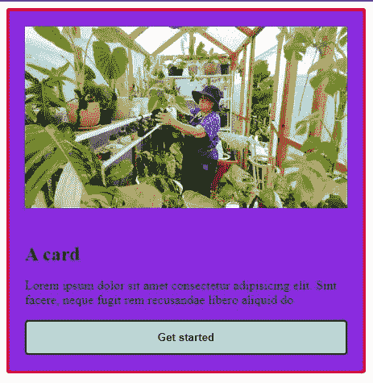
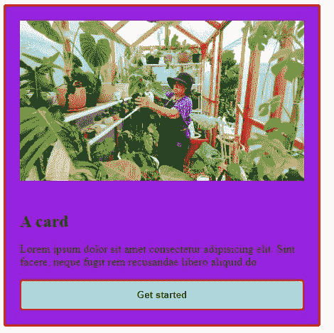

# 理解和使用新的 CSS 样式查询

> 原文：<https://blog.logrocket.com/new-css-style-queries/>

如果你一直在关注[最新的 CSS 发展](https://blog.logrocket.com/cascade-layers-subgrid-container-queries-whats-new-css/#)，你可能会对响应式 web 开发的未来感到非常兴奋。容器查询是 CSS 中最令人兴奋的新增功能之一，它吸引了大多数前端开发人员的关注。如果你不熟悉容器查询，你可以在上面的链接中阅读。

关于容器查询的很多兴奋之处都集中在容器大小查询上。但是容器查询还有一个更令人兴奋的方面，大多数开发人员都不知道:容器样式查询。在这篇文章中，我们将会看到你需要知道的关于样式查询的一切。

本文假设您至少对一种编程语言有基本的了解，最好是 CSS，并且能够使用像 [Chrome Canary 这样的实验性浏览器。](https://www.google.com/chrome/canary/)

在本文中，我们将讨论:

事不宜迟，让我们言归正传。

## 什么是样式查询？

容器查询的工作方式类似于媒体查询，但它们允许您直接基于组件的大小或样式而不是设备的视口来查询组件。如果你想了解更多关于如何根据大小查询容器的信息，请参考上面的链接。大多数开发人员使用容器查询来根据容器的大小查询容器，如下所示:

```
.card {
  /* query the inline-direction size of this parent */
  container-type: inline-size;
  display :block;
  background: blue;
}

@container (min-width: 600px) {
  .card {
    /* styles to apply when the card container is greater than or equal to 600px */
    display: flex;
    background: green;
  }
}

```

上面的代码根据卡片的大小查询卡片容器，只有当卡片的宽度大于或等于 420px 时，效果才会改变。

样式查询的工作方式相同，但是它们允许您在查询容器中查询父元素的计算值或样式，然后根据父元素将样式应用到子元素。

更简单地说，您可以使用样式查询根据容器的样式而不仅仅是大小来查询容器。它是这样工作的:

```
@container style(color: purple) {
      /* styles to apply when the card container has a color of purple */
  .card {
    /* To change the background to green: */
    background: green;
  }
}

```

如果父节的颜色是紫色，上面的代码会将卡片或节的背景更改为绿色。与大小查询不同，在大小查询中，您必须使用`container-type`标签将元素建立为查询容器，除非另有说明，否则所有元素都被视为样式查询的查询容器。

接下来，我们将看看何时何地使用样式查询。

## 何时何地使用 CSS 样式查询

CSS 样式查询可以查询父容器的不可继承的样式，并将所述样式应用于子容器。CSS 中不可继承的样式包括高度、宽度、边框、边距、填充等。为了了解其工作原理，让我们创建一张卡片:

```
<!DOCTYPE html>
<html lang="en">
<head>
  <meta charset="UTF-8">
  <meta http-equiv="X-UA-Compatible" content="IE=edge">
  <meta name="viewport" content="width=device-width, initial-scale=1.0">
  <title>Document</title>
  <link rel="stylesheet" href="style.css">
</head>
<body>
    <div class="card">
      <div class="cardheader">
        
      </div>
      <div class="card-body">
        <h5 class="title">A card</h5>
        <p class="text">Lorem ipsum dolor sit amet consectetur adipisicing elit. Sint facere, neque fugit rem recusandae libero aliquid do</p>
        <button class="btn">Get started</button>
      </div>
    </div>

</body>
</html>

```

现在，让我们设计卡片的样式:

```
.card{
    width:400px;
    padding: 20px;
    border-radius: 4px;
    border: solid 3px red;
    background-color: blueviolet;
    border-color: red;
}

.card-header{
    margin: -20px -20px 0 -20px;

}

.card-img{
    width: 100%;
    height: auto;
}

.title {
    font-size: 1.5rem;
    margin-bottom: 0.5rem;
}

.btn{
    border: solid 2px;
    width: 100%;
    padding: 0.75rem 1rem;
    border-radius: 4px;
    background-color: lightblue;
    color: black;
    font-weight: 600;
    cursor: pointer;
    border-color: black;
}

.btn:hover{
    background-color: brown;
}

```

上面的代码看起来会像这样:



如果我们希望按钮继承卡片的边框颜色，我们将运行以下代码:

```
@container style(border-color: red) {
  .btn {
    border-color: red;
  }
}

```

结果将如下所示:



与大小查询不同，样式查询没有固定的用例。当然，它们看起来很酷，是新的，并且让你的代码看起来更好，但是它们目前没有解决任何具体的问题。几乎所有样式查询都可以用类或数据属性来完成。

例如，上述功能可以通过直接定位按钮并将其边框指定为红色，或者通过创建自定义变量并将其添加到按钮样式中来实现。

然而，当与大小查询结合使用时，样式查询可以大放异彩，这实际上只有在使用[高阶变量](https://developer.mozilla.org/en-US/docs/Web/CSS/Using_CSS_custom_properties)(自定义属性)时才有用。这里有一个例子:

```
@container card (min-width: 600px) and style(--responsive: true) {
  /* styles for responsive components at a minimum width of 600px  */
}

```

将样式查询与大小查询一起使用将允许您应用特定的逻辑，从而产生更灵活的组件拥有的样式。这是一个方便的技巧，如果样式查询最终发布，我们可能会看到它变得流行起来。

## 样式查询的问题

就目前的情况来看，在发布样式查询之前，还有很多工作要做。样式查询收到了很多 beta 测试者的负面评论，但是最重要的问题是[缺乏对非定制 CSS 属性的特异性](https://github.com/w3c/csswg-drafts/issues/7185)。

例如，没有人知道`style(width: calc(…))`将如何表现，或者样式查询将如何处理像`style(color: inherit)`这样的简写属性。这些问题可能会导致编码过程中的重大问题，并可能导致开发人员不使用样式查询。

虽然这些问题可能有一些解决方案,但在这些问题得到解决之前，样式查询不太可能与大小查询一起发布，因为容器大小查询仍然保留了许多没有样式查询的功能。

## 对于要在非实验性浏览器中使用的样式查询，是否存在聚合填充？

目前，没有可用于样式查询的聚合填充。针对容器查询的唯一的 [polyfill](https://github.com/GoogleChromeLabs/container-query-polyfill) 只涵盖了容器大小查询，但是在撰写本文时，还没有针对容器样式查询做任何事情。

如果你想帮 CSS 世界一个忙，为样式查询创建一个 polyfill，这里有一个[指南](https://philipwalton.com/articles/the-dark-side-of-polyfilling-css/)供你使用。

## 结论

虽然样式查询可能不是自媒体查询以来响应式 web 设计的最佳选择，但它们仍然有很大的潜力。如果在发布时所有的问题都解决了，它们对开发人员来说还是很有价值的。

## 你的前端是否占用了用户的 CPU？

随着 web 前端变得越来越复杂，资源贪婪的特性对浏览器的要求越来越高。如果您对监控和跟踪生产环境中所有用户的客户端 CPU 使用、内存使用等感兴趣，

[try LogRocket](https://lp.logrocket.com/blg/css-signup)

.

[](https://lp.logrocket.com/blg/css-signup)[https://logrocket.com/signup/](https://lp.logrocket.com/blg/css-signup)

LogRocket 就像是网络和移动应用的 DVR，记录你的网络应用或网站上发生的一切。您可以汇总和报告关键的前端性能指标，重放用户会话和应用程序状态，记录网络请求，并自动显示所有错误，而不是猜测问题发生的原因。

现代化您调试 web 和移动应用的方式— [开始免费监控](https://lp.logrocket.com/blg/css-signup)。