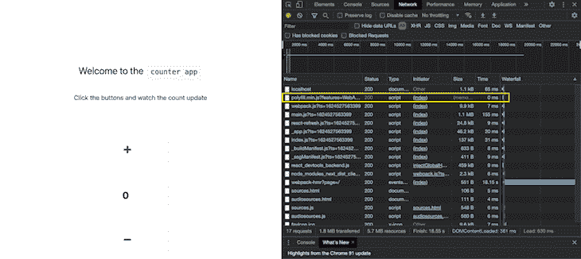
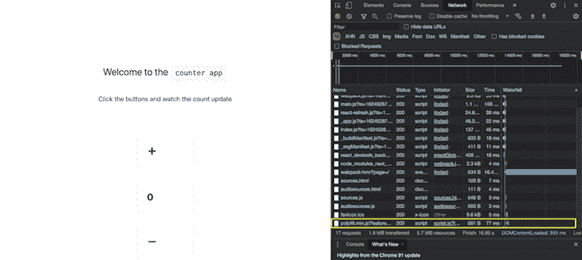
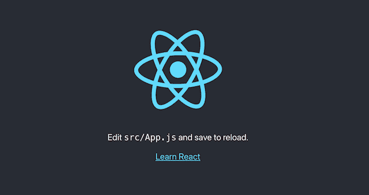

# Next.js 11 - LogRocket 博客中的新特性

> 原文：<https://blog.logrocket.com/new-features-in-next-js-11/>

在 6 月 15 日的 [2021 Next.js Conf](https://nextjs.org/conf#room-jz4ki) 上，来自世界各地的开发者共同见证了 Vercel 团队最新发布的 [Next.js 11](https://nextjs.org/blog/next-11) 的发布。Next.js 11 中包含的更新和新特性对已经很流行的库进行了重大改进。

在本文中，我们将深入了解这些更新，它们对用户和开发人员的体验都产生了影响。我们开始吧！

## 顺应

在其核心，一致性是一套原则或编码指南，它从开发人员那里拿走了一些决策责任。通过设置默认值和提供指导方针，可以更容易地达到预期的结果并防止常见错误。

根据 [Next.js 团队的说法，](https://nextjs.org/blog/next-11)“一致性是一个系统，它提供精心制作的解决方案和规则，以支持最佳加载和核心 Web 活力”。

Next.js 11 中新的一致性原则可以分为三个方面:

### 1.严重违约

框架必须在其核心建立一定的设计模式，使开发人员很难做错误的事情。

### 2.可执行的规则

尽管有很强的默认设置，但还是会有这样的情况，即开发人员有责任在两条潜在的路径之间做出选择。一组可操作的规则将使应用程序更容易遵守强大的性能标准，同时仍然允许足够的定制级别。

### 3.创作时间

创作时间在特性的开发周期中(而不是在生产之后)赋予性能以重要性。在代码提交之前必须考虑性能，而不是在产品发布之后将其视为基于分析的指标。

实施创作时间原则的最简单的方法之一是通过林挺规则。所以 Next.js 11 支持 ESLint 开箱即用。

要获得这些功能的好处，您必须通过运行以下代码升级到 Next.js 的最新版本:

```
npm i [email protected] [email protected] [email protected]
```

通过运行以下代码启用林挺:

```
npx next lint
```

一旦我们升级我们的版本并启用 ESLint，我们将开始收到警告，促使我们朝着行业最佳实践的方向前进，帮助我们的应用程序遵守一致性准则。

## 脚本优化

许多网站包含第三方脚本来支持分析和广告。

脚本的加载顺序对页面性能有很大的影响，尤其是在处理一个网页上的多个外部脚本时。如果管理不当，脚本会严重降低用户体验。

Next.js 引入了一个[脚本组件](https://nextjs.org/docs/basic-features/script)，它带有一个`strategy`属性，可以处理很多这样的问题。

让我们来测试一下！一个值得注意的变化是，我们不再需要将原生 HTML 脚本标签包装在`next/head`标签中:

```
import Head from 'next/head'
function Home() {
 return (
    <>
      <Head>
        <script async src="https://polyfill.io/v3/polyfill.min.js?features=WebAnimations" />
      </Head>
    </>
  )
}

```

相反，我们可以直接使用本机 HTML 脚本标记，如下所示:

```
import Script from 'next/script'
function Home() {
  return (
    <>
      <Script src="https://polyfill.io/v3/polyfill.min.js?features=WebAnimations" />
    </>
  )
}

```

在本例中，建议我们使用`beforeInteractive`策略加载 polyfill。让我们改变策略，看看它是如何影响脚本加载的！

### `beforeInteractive`

在捆绑的 JavaScript 可以运行之前，脚本被注入到服务器端的 HTML 中并在浏览器上运行。使用下面的代码块，我们看到获取 polyfill 的网络调用是在 network 选项卡中的其他所有操作之前进行的:

```
<Script src="https://polyfill.io/v3/polyfill.min.js?features=WebAnimations" 
`strategy="beforeInteractive" />

```



### `afterInteractive`

如果我们将策略改为`afterInteractive`，脚本将在页面变得可交互后执行。网络请求位于页面底部的网络选项卡中，该选项卡优先处理更重要的任务。


### `lazyOnload`

将策略改为`lazyOnload`告诉 Next.js 在空闲时间加载脚本。提取聚合填充的网络请求进一步向下移动到页面底部；没有其他懒惰加载的脚本，如下一个截图所示。



### `onLoad`支柱

除了上面的定制之外，如果我们想在脚本加载后执行一些代码，我们可以对脚本标签使用`onLoad`属性。`onLoad` prop 确保上面的脚本已经加载，允许函数使用脚本的特性和变量而不会崩溃:

```
<Script
  id="my-script"
src="https://polyfill.io/v3/polyfill.min.js?features=WebAnimations"
  onLoad={() => {
    // this executes after the script is loaded
  }}
/>

```

## 形象改善

Next.js 11 包含了对`next/image`组件的增强，比如减少布局偏移的[和为最终用户提供更流畅体验的](https://blog.logrocket.com/fix-layout-shifts-improve-seo-next-js/)。

### 静态图像的尺寸检测

以前，要使用`Image`组件渲染图像，必须使用`height`和`width`道具。这些道具允许 Next.js 识别图像的大小并呈现占位符，防止布局偏移和混乱的用户界面:

```
<Image
  alt="Fixing"
  src="/fixing.png"
  layout="intrinsic"
  width={700}
  height={475}
/>

```

Next.js 11 提供了对`src` prop 的支持，可以使用`import`关键字来应用它。如果以这种方式导入源，您不需要分别指定`height`和`width`道具:

```
import source from '../public/fixing.png'
<Image
  alt="Fixing"
  src={source}
  layout="intrinsic"
/>

```

### 图像占位符

在 Next.js 11 中，`next/image`组件支持一个新的占位符属性，该属性在较慢的连接上将`value`设置为`blur`。在加载原始图像时，`next/image`组件将显示模糊的低分辨率图像:

```
<Image
  alt="Fixing"
  src={source}
  layout="intrinsic"
  placeholder="blur"
/>

```

在原始图像最终加载之前，模糊图像将显示两到三秒钟。

此外，Next.js 11 提供了一个选项，通过`Image`标签提供一个定制的占位符，可以使用`blurDataURL` prop 来显示。提供给这个道具的值可以使用类似 [**blurha.sh**](https://blurha.sh/) **的应用程序生成。**

## Webpack 5 默认支持

在 10.2 版本中，宣布对所有 Next.js 项目提供 Webpack 5 支持，这些项目的`next.config.js`文件中没有自定义 Webpack 配置。自定义 webpack 配置类似于下面的代码:

```
module.exports = {
  webpack: (config, { buildId, dev, isServer, defaultLoaders, webpack }) => {
    return config; // return the modified config
  },
}

```

从版本 11 开始，webpack 5 是所有 Next.js 应用程序的默认构建工具，与定制配置无关。webpack 5 附带的以下所有优化将可用于新构建的项目。

### 改进的磁盘缓存

我们知道可以使用命令`next build`来触发构建。但是如果我们为项目触发的两个连续的构建之间没有什么变化呢？

Webpack 5 只允许有条件地重新编译已经更改的文件。性能得到了提高，因为我们没有冗余地处理没有被改变的块。

### 改进的快速刷新

有了 webpack 5，Next.js 11 将快速刷新识别为一项特殊任务，并以更高的优先级执行它，从而在每次保存任何代码更改时实现更快的刷新。

* * *

### 更多来自 LogRocket 的精彩文章:

* * *

### 长期资产缓存

有了 webpack 5，`build`命令的构建过程是确定的。如果代码段没有改变，则后续构建中生成的哈希不会改变，这意味着浏览器中经过哈希处理的文件可以在更长时间内重用。

### 改进的树摇动

Webpack 5 提供了树摇动`commonJS`模块的能力，从包中移除未使用的代码。

## 从创建 React 应用程序迁移

由于社区的要求，Vercel 团队已经推出了`@next/codemod`工具，它支持 React 和 Next.js 项目之间的兼容性。

我们可以运行该工具，为它提供一个使用 Create React App 脚本生成的项目，并将其转换为 Next.js 项目。我们来试试吧！

首先，使用以下命令创建一个 React 应用程序:

```
npx create-react-app cra-demo

```

现在，我们已经初始化了一个新的 React 项目，我们可以使用命令运行我们的项目:

```
npm run start

```

您将看到熟悉的 React 屏幕:



接下来，运行脚本从 Create React App 迁移到 Next.js 项目:

```
npx @next/codemod cra-to-next cra-demo

```

我们可以看到，该脚本对存储库进行了一些修改，以将其移植到 Next.js。

*   更改`package.json`中的脚本
*   添加了`pages`文件夹，这是 Next.js repo 的一个主要特性
*   通过创建一个`_app.js`文件来改变 CSS 的导入方式
*   创建一个`next.config.js`文件并填充它

## 巴别塔优化

Next.js 11 采用了 webpack 的 [Babel loader、](https://nextjs.org/blog/next-11#improved-performance)的全新实现，它包括一个内存中的配置缓存层，从 10.1 和 10.2 版本的改进中进一步减少了启动时间。

## Next.js Live

Vercel 的团队已经使用了几种下一代前端技术，如 serviceWorker、WebAssembly 和 es 模块，以在浏览器中提供协作环境。使用 Next.js Live 特性，开发人员和设计人员只需共享一个 URL 就可以进行协作。实况特征是当前在早期访问下运行的[。](https://nextjs.org/live)

## 结论

很明显，这些升级构成了有史以来最突出的 Next.js 版本之一！

对核心进行了一些更改，减少了启动时间，比如 Babel 优化，以及一些一致性建议，将开发人员推向一个成熟的解决方案。其他改进是加载图像和脚本，使用户体验无缝。此外，我们现在能够使用实时功能改进协作。

出于这些原因以及更多原因，Next.js 11 版本看起来很有前途，值得升级。试试吧，在评论中告诉我们你的想法！

## [LogRocket](https://lp.logrocket.com/blg/nextjs-signup) :全面了解生产 Next.js 应用

调试下一个应用程序可能会很困难，尤其是当用户遇到难以重现的问题时。如果您对监视和跟踪状态、自动显示 JavaScript 错误、跟踪缓慢的网络请求和组件加载时间感兴趣，

[try LogRocket](https://lp.logrocket.com/blg/nextjs-signup)

.

[](https://lp.logrocket.com/blg/nextjs-signup)[](https://lp.logrocket.com/blg/nextjs-signup)

LogRocket 就像是网络和移动应用的 DVR，记录下你的 Next.js 应用上发生的一切。您可以汇总并报告问题发生时应用程序的状态，而不是猜测问题发生的原因。LogRocket 还可以监控应用程序的性能，报告客户端 CPU 负载、客户端内存使用等指标。

LogRocket Redux 中间件包为您的用户会话增加了一层额外的可见性。LogRocket 记录 Redux 存储中的所有操作和状态。

让您调试 Next.js 应用的方式现代化— [开始免费监控](https://lp.logrocket.com/blg/nextjs-signup)。