# CSS 溢出新指南

> 原文：<https://blog.logrocket.com/new-guide-css-overflow/>

作为一名前端开发人员，溢出是你在构建网站布局时可能遇到的最令人恼火的问题之一。当 web 元素中的内容不符合其[块格式上下文](https://blog.logrocket.com/why-your-css-fails/)的约束，并最终溢出时，就会发生溢出:


默认情况下，父元素将扩展以适应其中的内容，除非为其宽度和高度指定了固定值。当父元素的宽度和高度使用像素的固定值或任何其他固定 CSS 值指定时，当元素中的内容增加时，很可能会发生溢出。

例如，在下面的代码中，只要容器没有指定的固定宽度或高度，浏览器就会将内容放入容器中:

```
//HTML
<div class="container">
  <p class="content">
Lorem ipsum dolor sit amet...
  </p>
</div>

//CSS
.container{
  margin: auto;
  outline: solid purple 2px;
}

```

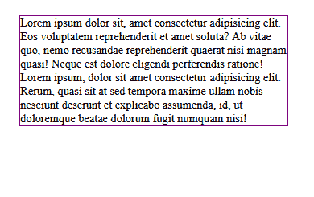

CSS `overflow`属性可用于修复由溢出问题导致的布局损坏，当给定元素的内容不符合其父元素的约束时，经常会发生溢出问题。

本指南不是提供 CSS `overflow` 的[概述，而是检查 CSS `overflow`的每个值，并演示它们如何解决构建网站布局时经常遇到的溢出问题。](https://blog.logrocket.com/how-to-prevent-overflow-scrolling-css/)

*向前跳转:*

## 先决条件

为了跟随示例并理解本文中使用的术语，您需要对 CSS 有一个基本的了解。

## CSS `overflow`属性值是什么？

属性有一组唯一的值，它用来修复 CSS 中的溢出问题。这些值用于使用特定方法隐藏或剪切溢出的内容。

这些值包括:

*   `visible`
*   `hidden`
*   `clip`
*   `scroll`
*   `auto`

`overflow-x`、`overflow-y`、`overflow-clip-margin`和`overflow-wrap`是可以修复 CSS 中溢出问题的其他属性，但方式略有不同。我们将在本指南的后面了解更多关于这些属性的内容，但是现在，让我们看看 CSS `overflow`的主值是如何工作的，以及它们是如何被使用的。

### `overflow-visible`

`overflow-visible`是`overflow`属性的默认值——它不隐藏或剪裁元素的溢出内容；相反，它让它保持原样。

默认情况下，每个元素都设置了这个`overflow`值。如果有一个内容溢出的元素，那么该元素的溢出是可见的。

在元素上设置`visible`值等同于根本不设置它；溢出是可见的，不管:

```
//HTML
<div class="container">
  <p class="content">
Lorem ipsum dolor sit amet...
  </p>
</div>

//CSS
.container{
  width: 370px;
  height: 100px;
  margin: auto;
  outline: solid purple 2px;
  overflow: visible;
} 

```

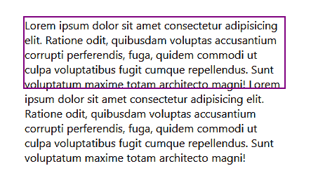

### `overflow-hidden`

`overflow-hidden`用于通过裁剪内容以适合父元素的框并使溢出的内容不可见来隐藏元素的溢出。这样，只有在父边界内的内容才是可见的，如下例所示:

```
<div class="container">
  <p class="content">
Lorem ipsum dolor sit amet...
  </p>
</div>

//CSS
.container{
  ...
  overflow: hidden;
}

```

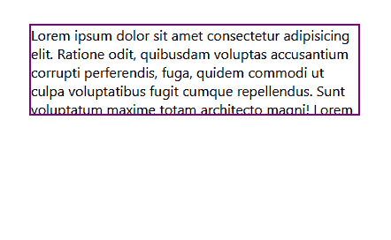

这里，段落元素溢出的文本被隐藏，但是父元素`div`边框内的文本仍然可见。

### `overflow-clip`

乍一看，`overflow-clip`的工作原理与`hidden`的值相似；它还裁剪内容以适合父框，并隐藏溢出的内容。

有人可能会认为`clip`值是多余的，因为`overflow`属性已经有了一个具有相同用例的值。然而，`clip`值实际上与`hidden`值非常不同。

`clip`值不仅隐藏了溢出，还禁用了应用它的容器上的滚动手势。因此，用户无法使用鼠标滚轮将隐藏的内容滚动到此类容器的视图中。

然而，与`clip`值不同，当`hidden`值应用于容器时，可以使用 JavaScript 属性和方法(如`scrollLeft`和`scrollTo()`)以编程方式滚动内容。

在下面的例子中，我们看到`overflow-clip`不允许我们滚动隐藏的内容:

请看 [CodePen](https://codepen.io) 上 David omotayo([@ David 4473](https://codepen.io/david4473))
的笔 [](https://codepen.io/david4473/pen/PoeNgvJ) 。

这里，我们看到`overflow-hidden`属性可以和`scrollLeft`一起使用，允许我们滚动隐藏的内容:

参见 [CodePen](https://codepen.io) 上 David omotayo([@ David 4473](https://codepen.io/david4473))
的笔 [溢出-隐藏](https://codepen.io/david4473/pen/rNvebKP)。

如您所见，`scrollLeft`属性只对具有`overflow-hidden`值的容器有效。

`overflow-scroll`也用于裁剪元素的溢出，但是，与`hidden`和`clip`不同的是，`scroll`值向容器添加了滚动条。用户可以使用滚动条查看剪辑的内容:

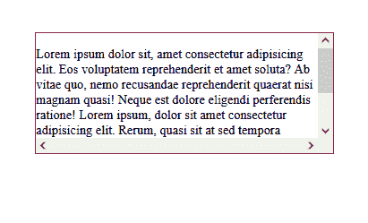

`scroll`值看起来是溢出问题的理想解决方案，但不幸的是，它有一些问题。

当应用于容器时，`scroll`值在容器的 x 轴和 y 轴上都显示一个滚动条，不管是否有溢出。正如我们将在本指南后面看到的那样，`scroll`值最好与`overflow-x`和`overflow-y`属性一起使用。

另一方面，当元素超出其父元素的边界时，浏览器往往会自动将滚动条添加到视口，从而导致布局偏移。

通过在 HTML 的根元素中添加一个轮廓并突出显示标记中的每个元素，可以很容易地解决这个问题。然而，问题可能会更加广泛，甚至可能在调试后仍然存在。

这里有一个[详细的教程，教你如何捕捉与滚动相关的错误](https://blog.logrocket.com/how-to-prevent-overflow-scrolling-css/#what-is-overflow-in-css)以及修复它们的建议。

### `overflow-auto`

`overflow-auto`类似于`scroll`值，除了它只在必要时显示滚动条，默认情况下不显示。但是，如果容器的内容增加并溢出其边界，`auto`值将导致滚动条自动显示在内容溢出的轴上，而不是同时显示在两个轴上:

参见 [CodePen](https://codepen.io) 上 David omotayo([@ David 4473](https://codepen.io/david4473))
的钢笔 [溢出-自动](https://codepen.io/david4473/pen/poVymJG)。

如果我们试图减少容器元素的宽度，或者在上面的 CodePen 示例中向段落添加更多内容，滚动条将自动显示在容器的右边界。

## 什么是`overflow-x`和`overflow-y`属性？

[`overflow-x`](https://developer.mozilla.org/en-US/docs/Web/CSS/overflow-x) 和 [`overflow-y`](https://developer.mozilla.org/en-US/docs/Web/CSS/overflow-y) CSS 属性用于设置容器元素在 x 轴和 y 轴上的溢出行为。

这些属性很像`overflow`属性本身。唯一的区别是，它们的值只应用于容器的水平或垂直边框，而不是同时应用于两个轴。

在下面的例子中，`overflow-scroll`已经应用到容器中；因此，滚动条同时显示在 x 轴和 y 轴上:

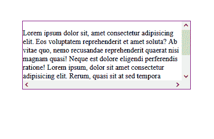

我们可以通过将`-x`或`-y`附加到`overflow`属性(注意我们使用的是`scroll`值)来控制滚动条在容器上的显示位置，分别显示在 x 轴或 y 轴上:

```
<div class="container">
  <p class="content">
Lorem ipsum dolor sit amet...
  </p>
</div>

//CSS
.container{
  ...
  Overflow-y: scroll;
  Or
  Overflow-x: scroll;
}

```

在下面的例子中，我们使用`overflow-y`在垂直轴上显示滚动条:

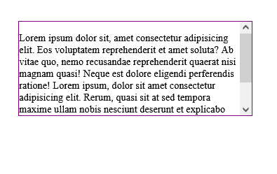

在这个例子中，我们使用`overflow-x`在水平轴上显示滚动条:

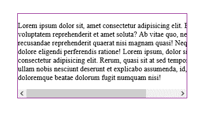

像`scroll`这样的值的目的不仅仅是显示滚动条，而是控制滚动条的显示方式。

***注意，*** *如果内容从两个轴溢出(即从容器的右边框和下边框)，滚动条将在两个轴上显示，而不管所使用的* `overflow` *属性*

## 什么是`overflow-clip-margin`属性？

[`overflow-clip-margin`](https://developer.mozilla.org/en-US/docs/Web/CSS/overflow-clip-margin) 是一个比较新的 CSS 属性。它用于控制`overflow-clip`值如何截取元素的溢出。此属性确定元素内容在被剪裁之前可以溢出多远:

```
   /*overflow-visible*/
  .container{
      width: 370px;
      height: 100px;
      margin-right: 90px;
      outline: solid purple 2px;
    }

     /*overflow-clip*/
    .container:nth-child(2){
      overflow: clip;
    }

    /*overflow-clip-margin*/
    .container:nth-child(3){
      overflow: clip;
      overflow-clip-margin: 45px;
    }

```

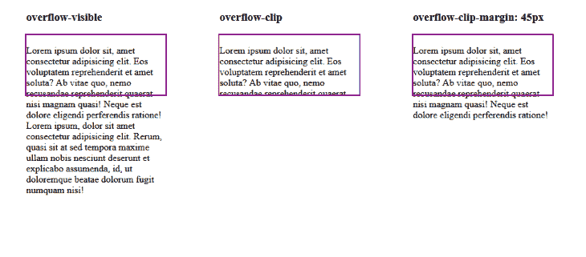

注意我们是如何在容器中添加了一个值`overflow-clip`和`overflow-clip-margin`。这是因为这是`overflow-clip-margin`属性工作所必需的。

如果容器没有`overflow-clip`值，CSS 将忽略`overflow-clip-margin`属性。这就是为什么`overflow-clip-margin`属性只应用于被剪辑到容器上的轴。例如，如果使用`overflow-x`属性将剪辑值应用于容器的 x 轴，则`overflow-clip-margin`将仅应用于 x 轴。

`overflow-clip-margin`没有像`overflow`属性那样的专用值。相反，它接受正数值来指定溢出将从容器延伸多远。但是，它和其他 CSS 属性一样具有全局值:

*   `inherit`
*   `initial`
*   `revert`
*   `unset`

## 什么是`overflow-wrap`属性？

[`overflow-wrap`](https://developer.mozilla.org/en-US/docs/Web/CSS/overflow-wrap) 是一个 CSS 属性，用于在一长串文本溢出目标容器元素的边界时打断该文本。但是，与`overflow`属性不同，`overflow-wrap`只能应用于行内元素，比如段落和标题元素。

这个属性告诉浏览器，如果它溢出了容器，它可以将一行文本分成多行。类似于`overflow`属性，`overflow-wrap`也有一组值，它用这些值来分隔文本:

*   `normal`:这是`overflow-wrap`属性的默认值，当溢出其容器时不会断行；相反，文本将在正常的单词断点处断开
*   `break-word`:如果文本溢出容器，该值将从可接受的断点将一长行文本分成多行
*   `anywhere`:该值类似于`break-word`值；然而，`anywhere`允许在任意点(甚至是单词的中间)断开长文本行，如果它不能在其他可接受的点断开的话

这里有一个显示`overflow-wrap`及其默认值`normal`的示例:

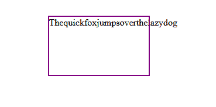

本例显示了带有`break-word`值的`overflow-wrap`:

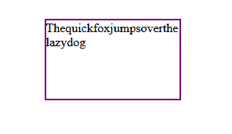

这是同一个`overflow-wrap`示例，但是使用了`anywhere`值:

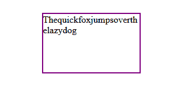

## 跨浏览器兼容性

在撰写本文时，`overflow`和`overflow-wrap`属性及其值已经得到了浏览器的全面支持，这意味着它们在现代浏览器中得到了很好的支持。

另一方面，`overflow-clip-margin`属性被指定为[只适用于 Chrome、Edge 和 Opera 浏览器](https://caniuse.com/?search=overflow-clip-margin)，但是我已经在 Firefox 上使用过了，发现它工作得很好。

你可以在你选择的浏览器上试试这个特性，并在下面的评论中告诉我们它是否适合你。

以下是浏览器对`overflow`属性支持的总结:

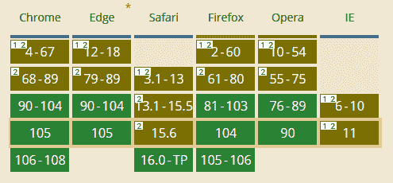

以下是浏览器对`overflow-wrap`属性支持的总结:


以下是浏览器对`overflow-clip-margin`属性支持的总结:

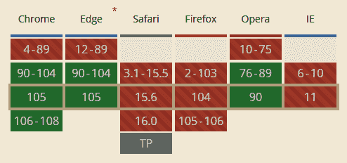

## 结论

在本指南中，我们介绍了 CSS `overflow`属性，研究了它的值，并考虑了如何使用它们来解决溢出问题。我们还查看了`overflow-x`、`overflow-y`、`overflow-clip-margin`和`overflow-wrap`属性，并检查了它们与`overflow`属性的不同之处。

## 你的前端是否占用了用户的 CPU？

随着 web 前端变得越来越复杂，资源贪婪的特性对浏览器的要求越来越高。如果您对监控和跟踪生产环境中所有用户的客户端 CPU 使用、内存使用等感兴趣，

[try LogRocket](https://lp.logrocket.com/blg/css-signup)

.

[](https://lp.logrocket.com/blg/css-signup)[https://logrocket.com/signup/](https://lp.logrocket.com/blg/css-signup)

LogRocket 就像是网络和移动应用的 DVR，记录你的网络应用或网站上发生的一切。您可以汇总和报告关键的前端性能指标，重放用户会话和应用程序状态，记录网络请求，并自动显示所有错误，而不是猜测问题发生的原因。

现代化您调试 web 和移动应用的方式— [开始免费监控](https://lp.logrocket.com/blg/css-signup)。