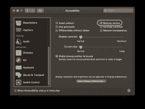

# Chrome 74 新功能:偏好-减少运动媒体查询-日志火箭博客

> 原文：<https://blog.logrocket.com/new-in-chrome-74-prefers-reduced-motion-media-query-50cd89d3e769/>

动画可以是传达信息、阐明功能，甚至只是增加视觉效果的一种非常强大的方式。它们也很烦人，对一些人来说，甚至会引发可怕的症状。

操作系统多年来一直支持减少动画的选项，允许用户在必要时禁用动画。



macOS settings screen with Reduce motion checkbox selected.

然而，网络平台在这方面已经落后了。直到最近，还没有办法询问用户是否喜欢看动画。我们能做的最好的事情是在他们的帐户配置中将它设置为一个选项，但这不是最佳选择，因为我们可能会在他们注册之前就失去这些用户——更不用说这很难实现。

Prefers-reduced-motion 是一个媒体查询，通过允许我们根据用户对动画的选择来查询操作系统，并根据选择设置不同的 CSS 规则，最终将该功能带到 web 上。

它是 [Media Queries Level 5 CSS 规范](https://drafts.csswg.org/mediaqueries-5/)的一部分，该规范正处于编辑的起草阶段，所以直到最近实现还远未完善是有道理的。Firefox 和 Safari 已经在相当长的一段时间前发布了它，但随着最大的玩家退出，这是我们不能依赖的东西。 [Chrome 74](https://developers.google.com/web/updates/2019/04/nic74) 终于加入了支持它的浏览器，所以是时候部署它了。

## 为什么这很重要？

该查询的名称非常简单明了:我们应该尊重用户的偏好。动画用错了会很烦人，我们都知道，所以有些人选择禁用它们是可以理解的。

但对其他人来说，这远不止是简单的偏好:他们是否能使用我们的网站取决于此。患有眩晕等前庭疾病的人可能会因动画而引发严重的头晕和恶心。患有[阅读障碍或注意力障碍的用户会因为这个不必要的动作而失去注意力](https://alistapart.com/article/designing-for-cognitive-differences/)。

此外，当我们试图在资源有限的设备或低刷新率的屏幕上播放动画时，这些设备可能会过载。

这些似乎是罕见的情况，但这些问题非常普遍。有些人永久残疾，而我们其余的人只是暂时有能力，生活可能在任何特定的时刻打击我们。

当迷路炎引发的眩晕突然发作让我在一个多月的时间里无法完成任何事情时，我得到了惨痛的教训。结果，[大约 40%的人一生中至少会经历一次眩晕](https://www.asha.org/PRPSpecificTopic.aspx?folderid=8589942134&section=Incidence_and_Prevalence)。

为我们的用户提供禁用动画的选择是出于同理心。是做一个正派的人。是知道我们可能，并且很可能会在某个时候需要同样的东西。如果这不适合你，让我告诉你这也是关于商业逻辑:如果用户发现我们的网站令人讨厌或不可用，他们就会离开。

## 如何实施

渐进增强可能是新项目的正确答案。对于每一个动画，我们应该提供一个首选的减少运动的媒体查询，当用户要求操作系统剪切动画时，该查询指示浏览器做什么

例如，如果我们想要一个元素从顶部开始动画，我们可以这样做:

```
.animatable{
  animation: animate 2s ease-out;
  transform: translateY(0); /* set the animation's finishing point as the default, so it still shows up when we set animation to none */
}
@keyframes animate{
  from{ transform: translateY(-100%)}
  to{ transform: translateY(0)}
}
@media screen and (prefers-reduced-motion: reduce){
  .animatable {animation: none;}
}
```

这个 stylelint 插件有助于在我们忘记为动画设置一个减少运动选项时提醒我们。

更好的是，我们可以将非动画版本设置为默认版本，并查询`no-preference`选项，改为在那里设置动画:

```
.animatable{
  transform: translateY(0);
  animation: none;
}
@keyframes animate{
  from{ transform: translateY(-100%)}
  to{ transform: translateY(0)}
}
@media screen and (prefers-reduced-motion: no-preference){
  .animatable {animation: animate 2s ease-out;}
}
```

这将对运行不支持此查询(Edge)或媒体查询(IE)的浏览器的用户隐藏动画，以防一些用户运行它们并对动画有任何问题。

Google 推荐的一个很好的替代方案是[为我们所有的动画设计一个单独的样式表，并有条件地加载它们](https://developers.google.com/web/updates/2019/03/prefers-reduced-motion)。请记住，我们可以在 HTML 中设置媒体查询，因此只有支持该功能的浏览器才会下载动画相关的 CSS，从而节省一些字节。

`<link rel=”stylesheet” href=”animations.css” media=”(prefers-reduced-motion: no-preference)”>`

## 核武器的方法

在先前存在的代码库中实现查询可能相当困难，所以如果您需要一个快速而肮脏的解决方案，请考虑使用一个在用户选择时覆盖所有动画的规则。

最简单的方法，也可能是我想到的第一个方法，就是使用下面这样的方法禁用所有元素的动画:

```
@media screen and (prefers-reduced-motion: reduce)
  * {
    animation: none !important;
  }
}
```

通过将该规则放在最后一个样式表的末尾，应该可以阻止任何动画播放。这里的问题是，动画通常以这样的方式实现，元素只在它们结束时出现/定位在正确的位置，所以声明没有动画会使元素变得无用，并破坏我们网站的流程。

因此，我们需要确保以一种将元素放在它们应该在的地方的方式来解决这个问题。Eric Bailey 最近出版了[一个更好的 CSS 方法——Tricks](https://css-tricks.com/revisiting-prefers-reduced-motion-the-reduced-motion-media-query/):

```
@media screen and (prefers-reduced-motion: reduce){
  * {
    animation-duration: 0.001ms !important;
    animation-iteration-count: 1 !important;
  }
}
```

上面的代码将询问浏览器用户是否已经请求操作系统减少运动，在这种情况下，在通用选择器中设置一个非常短的动画持续时间，以强制所有动画立即结束。

`animation-iteration-count: 1`确保他们只玩一次，以防止可能会让`animation-iteration-count: infinite`在短时间内连续玩无数次的规则。

请记住，这应该是我们包含的最后一个 CSS，所以它优先于所有其他的 CSS，即使它们有一个规则设置为`!important`。

## 包扎

Chrome 终于加入了支持这一极其重要的可访问性媒体查询的浏览器，这将有望为许多不同条件的人提供更轻松的网络体验。

让网络成为一个对每个人都更好的地方是我们的责任(也应该是我们的目标),所以无论你选择“核武器方法”还是花时间考虑实现动画作为渐进增强，我们现在都有工具让它变得正确。

## 使用 [LogRocket](https://lp.logrocket.com/blg/signup) 消除传统错误报告的干扰

[](https://lp.logrocket.com/blg/signup)

[LogRocket](https://lp.logrocket.com/blg/signup) 是一个数字体验分析解决方案，它可以保护您免受数百个假阳性错误警报的影响，只针对几个真正重要的项目。LogRocket 会告诉您应用程序中实际影响用户的最具影响力的 bug 和 UX 问题。

然后，使用具有深层技术遥测的会话重放来确切地查看用户看到了什么以及是什么导致了问题，就像你在他们身后看一样。

LogRocket 自动聚合客户端错误、JS 异常、前端性能指标和用户交互。然后 LogRocket 使用机器学习来告诉你哪些问题正在影响大多数用户，并提供你需要修复它的上下文。

关注重要的 bug—[今天就试试 LogRocket】。](https://lp.logrocket.com/blg/signup-issue-free)

* * *