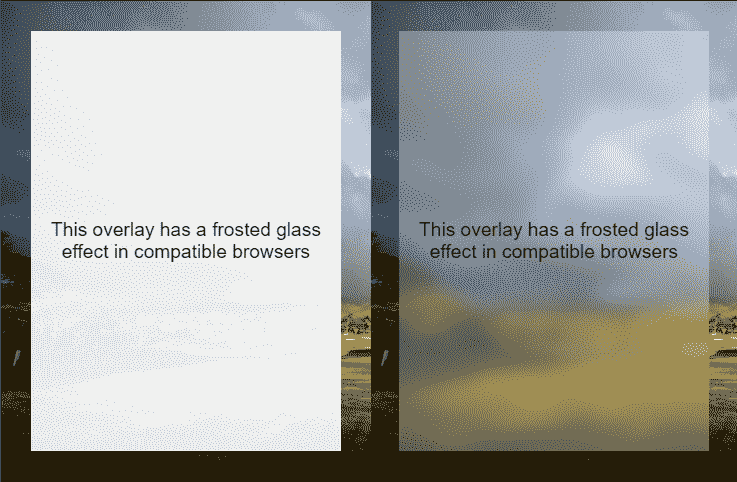
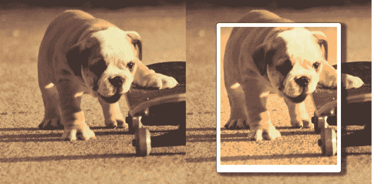

# Chrome 76 中的新功能:带背景的磨砂玻璃效果

> 原文：<https://blog.logrocket.com/new-in-chrome-76/>

你有没有想过在网络上重现 iOS 设备上那种典型的毛玻璃效果/背景模糊？谷歌 Chrome 浏览器的最新版本只需要几行 [CSS](https://blog.logrocket.com/a-guide-to-css-pseudo-elements/) 就可以实现，这要感谢背景过滤属性的实现！

## 了解背景滤镜属性

正如自我描述的名字告诉我们的那样，background-filter 允许我们对元素的背景应用 CSS 过滤器。但是我们如何定义背景呢？

在 CSS 中“背景”代表元素后面*所画的[。当然，这意味着使用`backdrop-filter`的第一件事是增加某种透明度，让我们可以看透它。](https://drafts.fxtf.org/filter-effects-2/#backdrop-root-image)*

为此，我们可以不对元素应用任何背景，通过 RGBA 将其设置为半透明，或者对整个元素应用不透明度。请记住，后者还会影响元素的文本节点和所有后代，因此对于大多数情况来说，这可能不是正确的选择。让我们从半透明的白色背景开始:

```
.frosted{
      background: rgba(255, 255, 255, 0.3);
    }
```

接下来，我们要声明过滤器本身。background-filter 接受与 [filter](https://developer.mozilla.org/en-US/docs/Web/CSS/filter) 属性完全相同的值，因此我们可以以多种方式影响背景。从简单的模糊到灰度或棕褐色，甚至任何花哨的类似 Instagram 的滤镜都可以改变图像的色调、亮度、饱和度和对比度。

让我们应用模糊的毛玻璃效果:

```
.frosted{
  background: rgba(255, 255, 255, 0.3);
  backdrop-filter: blur(8px);
}
```

差不多就是这样。我说“几行”是认真的。通过一些定位魔术，我们可以得到如下结果:

参见 [CodePen](https://codepen.io) 上 Facundo 科拉迪尼([@ facundocoradini](https://codepen.io/facundocorradini))
的笔 [磨砂玻璃效果](https://codepen.io/facundocorradini/pen/OKpreN/)。



The result without backdrop-filter (left) and with it (right)

## 使其对其他浏览器安全

起初，只有 [Safari 和 Edge](https://caniuse.com/#search=backdrop-filter) 支持这一特性，现在 [Chrome](https://blog.logrocket.com/whats-new-in-chrome-74-6f8b82919c68/) 和基于 Chrome 的浏览器也加入进来。但是我们仍然应该让我们的代码对于 Firefox 和其他小型浏览器和设备是安全的。

好消息是，就像 CSS 中的任何东西一样，如果浏览器发现它不理解的声明，它会简单地忽略它。因此，我们上面使用的方法是安全的，因为任何缺乏背景过滤支持的浏览器都会提供半透明的白色背景，没有任何效果。

但是有些情况下这还不够。也许没有模糊背景的半透明背景无法为文本提供足够的对比度，或者我们希望为不支持背景过滤的浏览器提供完全不同的元素样式。

更安全的方法是使用@supports 查询和渐进式改进。我们应该从声明不支持它的浏览器的样式开始。

在这种情况下，我将使用几乎不透明的白色背景，以增加可读性时，没有模糊应用。

```
.frosted{
  background: rgba(255, 255, 255, 0.9);
}
```

然后使用@supports 查询，我们可以在任何支持它的浏览器上应用该效果，并调低 alpha 通道以增加透明度。

```
/* sets default styling */
.frosted{
  background: rgba(255, 255, 255, 0.9);
}

/* applies semi-transparent background for browsers that support backdrop-filter */
@supports (backdrop-filter: none) {
  .frosted {
      background: rgba(255, 255, 255, 0.3);
      backdrop-filter: blur(8px);
  }
}
```

请注意，我使用“背景-过滤器:无”作为条件。在检查浏览器支持时，使用最简单的属性值通常被认为是一个好习惯。我可以使用类似于“@ supports(background-filter:blur(8px))”的东西，但这将是重复的，如果有人在将来更改过滤器，可能会看起来非常混乱。

## 不仅仅是磨砂玻璃

我把重点放在磨砂玻璃上，因为这是我长久以来一直想用的，但我们可以应用任何我们想要的滤镜，包括:

*   虚化
*   聪明
*   对比
*   灰度等级
*   色调-旋转
*   转化的
*   不透明
*   饱和的
*   乌贼的墨

此外，我们甚至可以将它们组合成高级的。为此，我们只需定义属性中的所有过滤器(记住，值必须**而不是**是逗号分隔的…不同 CSS 属性之间相当不一致)。

例如，为了重现瓦尔登效应，我们可以使用:

```
.walden{
  backdrop-filter:
    contrast(100%)
    brightness(110%)
    saturate(160%)
    sepia(30%)
    hue-rotate(350deg)
  ;
}
```

(来自[乌纳克拉韦茨](https://twitter.com/una)’[CSS gram](https://una.im/CSSgram/)的值)

参见 [CodePen](https://codepen.io) 上法库多·科拉迪尼([@法库多科拉迪尼](https://codepen.io/facundocorradini) )
的[瓦尔登湖背景-滤镜](https://codepen.io/facundocorradini/pen/RXpOqX/)。

在 Chrome 76 中更多！



The result in a browser that doesn’t support backdrop-filter (left) vs one that does (right)

## 当然，背景过滤只是这个新版本的众多改进之一。其他好消息包括对[偏好配色方案媒体查询](https://blog.logrocket.com/whats-new-in-firefox-67-prefers-color-scheme-and-more-195be81df03f/)的支持、omnibar 中简化 pwa 安装的新按钮、对众多 apk 的更新等等。你可以在 [Chrome 的博客](https://developers.google.com/web/updates/2019/07/nic76)上读到它们。

使用 [LogRocket](https://lp.logrocket.com/blg/signup) 消除传统错误报告的干扰

## [LogRocket](https://lp.logrocket.com/blg/signup) 是一个数字体验分析解决方案，它可以保护您免受数百个假阳性错误警报的影响，只针对几个真正重要的项目。LogRocket 会告诉您应用程序中实际影响用户的最具影响力的 bug 和 UX 问题。

[](https://lp.logrocket.com/blg/signup)

然后，使用具有深层技术遥测的会话重放来确切地查看用户看到了什么以及是什么导致了问题，就像你在他们身后看一样。

LogRocket 自动聚合客户端错误、JS 异常、前端性能指标和用户交互。然后 LogRocket 使用机器学习来告诉你哪些问题正在影响大多数用户，并提供你需要修复它的上下文。

关注重要的 bug—[今天就试试 LogRocket】。](https://lp.logrocket.com/blg/signup-issue-free)

Focus on the bugs that matter — [try LogRocket today](https://lp.logrocket.com/blg/signup-issue-free).