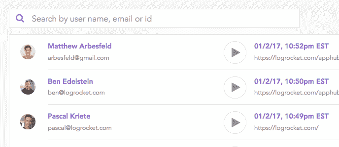
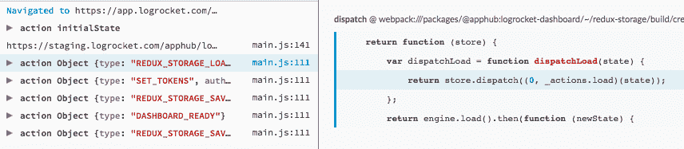
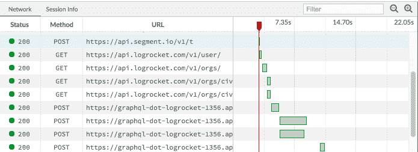

# LogRocket 中的新功能:会话列表、源代码地图、多页支持

> 原文：<https://blog.logrocket.com/new-in-logrocket-sessions-list-source-maps-multi-page-support-f5a747bbd04f/>

# LogRocket 中的新功能:会话列表、源代码映射、多页支持

## 

2017 年 1 月 18 日 38 秒读 180

今天，我们很高兴在 [LogRocket](https://logrocket.com/) 中推出一些非常受欢迎的功能。只需刷新您的应用，您就可以访问:

### 1.用户会话列表

​

这是我们最常要求的功能之一！现在，您可以查看所有用户的会话列表，并按用户名、电子邮件和用户 id 搜索会话。

### 2.源地图

您现在可以将源代码映射上传到 LogRocket，以获得异常和控制台日志的完整符号。访问 [logrocket-cli](https://github.com/LogRocket/logrocket-cli) 存储库，获取如何管理发布和上传源地图的说明。

### 3.多页支持

LogRocket 现在将跨页面加载和刷新跟踪会话，通过查看导致中断状态的原因，可以更容易地了解错误或糟糕用户体验的根本原因。你可以在这里阅读新行为[。](https://docs.logrocket.com/docs/what-defines-a-session)

### 4.改进的网络窗格

“网络”面板现在显示所有网络请求和响应的列表，从而更容易过滤和搜索意外的网络流量。

感谢您的热情和反馈！让我们知道您希望看到的下一个功能/改进🙂