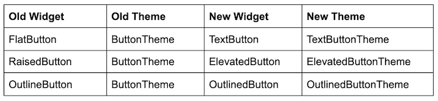
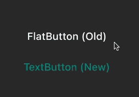
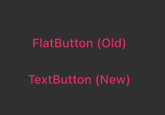
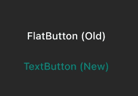
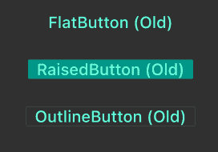
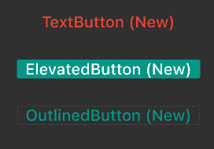

# Flutter 中的新材料按钮

> 原文：<https://blog.logrocket.com/new-material-buttons-in-flutter/>

Flutter 中的旧按钮足以满足你的大部分移动开发需求，但它们可能很难使用，尤其是当你的应用程序需要自定义主题时。

随着 2020 年 10 月 [Flutter v1.22](https://medium.com/flutter/announcing-flutter-1-22-44f146009e5f) 的发布，一个“新的‘宇宙’材质按钮”变得可用。如果你还没有时间检查它们，我强烈建议你这样做，因为使用新的 Flutter 按钮可以在构建移动应用程序时节省你很多时间。

在本教程中，我们将向您介绍 Flutter 中可用的新材质按钮组件，浏览一些如何使用它们的示例，并演示新的 Flutter 按钮如何改善开发人员的体验。

我们将用详细的解释和例子来涵盖以下内容:

## Flutter 中有哪些新材质按键？

Flutter 没有改进现有的按钮类，而是创建了全新的按钮小部件和主题来代替它们。[新颤振按钮](https://github.com/flutter/flutter/pull/59702)的名称是为了使颤振与[材料设计规范](https://material.io/components/buttons)同步。这意味着按钮是最新的新指南，也有新的风格。

简而言之，Flutter 中的新按钮更容易理解和使用。它们使得在应用程序和小部件级别定义通用主题变得简单。例如，您可以更改 app 中使用的所有 [`TextButton`](https://www.woolha.com/tutorials/flutter-using-textbutton-widget-examples) 的文本颜色，而不影响 [`Elevatedbutton`](https://www.woolha.com/tutorials/flutter-using-elevatedbutton-widget-examples) 或 [`OutlinedButton`](https://www.woolha.com/tutorials/flutter-using-outlinedbutton-widget-examples) 的文本颜色。还可以设置`OutlinedButton`在悬停、聚焦等多种状态下的文字颜色。

以下是 Flutter v1.22 引入的新材质按钮:

### `TextButton`

你可以简单地在一个地方使用`TextButton`来关闭屏幕，比如在对话框中关闭屏幕等等。出于明显的用户界面/UX 原因，您应该避免将这个按钮放在任何可滚动列表中。

### `ElevatedButton`

[`ElevatedButton`](https://api.flutter.dev/flutter/material/ElevatedButton-class.html) 最适合应用需要用户直接操作的地方，比如确认订单或者订票。因为它已经被提升了，你应该避免把它放在任何其他提升的小部件上，比如卡片。

### `OutlinedButton`

在很多方面， [`OutlinedButton`](https://api.flutter.dev/flutter/material/OutlinedButton-class.html) 是`TextButton`和`ElevatedButton`的混合体。如果你去掉边框，它是一个文本按钮，如果你悬停或按下它，它会给人一种抬高按钮的感觉。这个按钮是一个中强调按钮，意味着它可以用在动作重要但不关键的地方。

以下是在 Flutter 应用程序中实现新材质按钮的最少代码:

```
Column(
  mainAxisAlignment: MainAxisAlignment.center,
  children: [
    TextButton(
      onPressed: () {},
      child: Text('TextButton'),
    ),
    SizedBox(
      height: 20,
    ),
    ElevatedButton(
      onPressed: () {},
      child: Text('ElevatedButton'),
    ),
    SizedBox(
      height: 20,
    ),
    OutlinedButton(
      onPressed: () {},
      child: Text('OutlinedButton'),
    )
  ],
),

```

## 新的颤振按钮有什么不同？

Flutter 中的每个新材质按钮都有自己的主题，而不是指定一个适用于其他按钮的通用主题。这给了你比旧的颤动按钮更大的灵活性——即[平按钮](https://api.flutter.dev/flutter/material/FlatButton-class.html)、[升起按钮](https://api.flutter.dev/flutter/material/RaisedButton-class.html)和[外按钮](https://api.flutter.dev/flutter/material/OutlineButton-class.html)。

下表显示了与之前的 Flutter 按钮相关联的旧窗口小部件和主题，以及旨在取代它们的新窗口小部件和主题。



需要注意的一个微妙但重要的变化是:`OutlineButton`现在是`OutlinedButton`(名字中增加了`d`)。如果您不小心，您可能会错过这一变化，并最终使用旧的按钮编写所有代码(完全公开:我在为本教程开发示例时就遇到过这种情况)。

说到这里，让我们深入一些实际的例子，看看新的颤振按钮的行动。

## 你能用新的颤动按钮做什么？

为了展示新材质按钮与旧的颤动按钮相比是如何工作的，我们将为每种按钮创建一个实际演示。

下面的代码代表了与 Flutter v1.22 一起发布的旧的`FlatButton`与新的 [`TextButton`](https://www.woolha.com/tutorials/flutter-using-textbutton-widget-examples) :

```
Column(
  mainAxisAlignment: MainAxisAlignment.center,
  children: [
    FlatButton(
      onPressed: () {},
      child: Text('FlatButton (Old)'),
    ),
    SizedBox(
      height: 40,
    ),
    TextButton(onPressed: () {}, child: Text('TextButton (New)'))
  ],
)

```

这将生成以下输出:



第一个值得注意的区别是，新的`TextButton`在应用程序级别使用了主题颜色，没有任何额外的努力。对于这个应用程序，`primarySwatch`被设置为`Colors.teal`，`TextButton`自动将其设置为文本颜色，而`FlatButton`没有这样做。

```
primarySwatch: Colors.teal,

```

如果你仔细观察，你会发现在一个`TextButton`的点击上，涟漪效应要比`FlatButton`平滑得多。

### 覆盖属性

在下面的示例中，我们将尝试更改按钮内文本的颜色:



```
Column(
  mainAxisAlignment: MainAxisAlignment.center,
  children: [
    FlatButton(
      onPressed: () {},
      textColor: Colors.pink,
      child: Text(
        'FlatButton (Old)',
        style: TextStyle(fontSize: 30),
      ),
    ),
    SizedBox(
      height: 40,
    ),
    TextButton(
      onPressed: () {},
      style: TextButton.styleFrom(
        primary: Colors.pink,
      ),
      child: Text(
        'TextButton (New)',
        style: TextStyle(fontSize: 30),
      ),
    )
  ],
)

```

两个按钮产生相同的输出，但是颜色分配的方式不同。对于`FlatButton`，颜色被赋予`textColor`参数。`TextButton`有一个接受 [`ButtonStyle`](https://api.flutter.dev/flutter/material/ButtonStyle-class.html) 类的样式属性，它可以保存按钮的默认值。`TextButton.styleFrom`是一种返回`ButtonStyle`的便捷方法，能够覆盖默认值。`primary`用于实际设置文本的颜色。

按钮的样式属性提供了类似于 [`Text`](https://api.flutter.dev/flutter/widgets/Text-class.html) 小部件的编写样式的体验。

此时，您可能会想，如果我们可以在`FlatButton`本身中用简单的参数做同样的事情，为什么我们还需要这个复杂的样式属性呢？想象一下这样一种情况，您需要对一个按钮进行大量定制，以适应新的定制品牌。这就是它派上用场的地方。

### 在 Flutter 中自定义按钮

假设你想改变一个按钮的文本颜色，但是只在它被按下的时候。你可以这样做:

```
TextButton(
  onPressed: () {},
  style: ButtonStyle(
    foregroundColor: MaterialStateProperty.resolveWith<Color>(
        (Set<MaterialState> states) {
      if (states.contains(MaterialState.pressed))
        return Colors.pink;
      return null; // Defer to the widget's default.
    }),
  ),
  child: Text(
    'TextButton (New)',
    style: TextStyle(fontSize: 30),
  ),
)
```



颜色被赋予`foregroundColor`参数，该参数接受 [`MaterialStateProperty`](https://api.flutter.dev/flutter/material/MaterialStateProperty-class.html) **。** `MaterialStateProperty`用于定义不同按钮状态下显示的颜色，如按下、悬停、聚焦和禁用。这为可能的定制创造了一个全新的世界。

### 在应用程序级别设置默认值

旧的颤动按钮的问题是，如果你试图在应用程序级别改变所有`FlatButtons`的文本颜色，它也会改变`RaisedButton`和`OutlineButton`的文本颜色，就像这样:

```
MaterialApp(
  title: 'Flutter Demo',
  theme: ThemeData(
    primarySwatch: Colors.teal,
    brightness: Brightness.dark,
    buttonTheme: ButtonThemeData(textTheme: ButtonTextTheme.accent),
  ),
  home: OldButtons(),
  debugShowCheckedModeBanner: false,
);
```



随着新的 Flutter 更新，我们现在在应用程序级别上对按钮默认设置有了更多的控制。使用同一个例子，下面是如何在不影响 Flutter v1.22 中其他按钮的情况下改变`TextButton`的文本颜色:



```
MaterialApp(
  title: 'Flutter Demo',
  theme: ThemeData(
    primarySwatch: Colors.teal,
    brightness: Brightness.dark,
    textButtonTheme: TextButtonThemeData(
        style: TextButton.styleFrom(primary: Colors.red)),
  ),
  home: NewButtons(),
  debugShowCheckedModeBanner: false,
);

```

正如你所看到的，我们只是想给`TextButton`一个不同的颜色，我们有一个专用的属性`textButtonTheme`来做到这一点。

## 为什么你应该在 Flutter 中使用新材料按钮

Flutter v.122 中的新按钮可以节省您大量的时间，这样您就可以专注于开发您的应用程序，而不是花时间寻找应该是简单解决方案的修复程序。在其最新的更新中，Flutter 主动解决了许多与旧的 Flutter 按钮相关的常见挑战。向 Flutter 团队和社区致敬！

旧的颤动按钮仍然适用于简单的用例，但是谁知道会持续多久呢？当新特性发布时，尝试一下总是一个好的习惯，尤其是当它最终被设计用来替换旧特性的时候。

## 使用 [LogRocket](https://lp.logrocket.com/blg/signup) 消除传统错误报告的干扰

[](https://lp.logrocket.com/blg/signup)

[LogRocket](https://lp.logrocket.com/blg/signup) 是一个数字体验分析解决方案，它可以保护您免受数百个假阳性错误警报的影响，只针对几个真正重要的项目。LogRocket 会告诉您应用程序中实际影响用户的最具影响力的 bug 和 UX 问题。

然后，使用具有深层技术遥测的会话重放来确切地查看用户看到了什么以及是什么导致了问题，就像你在他们身后看一样。

LogRocket 自动聚合客户端错误、JS 异常、前端性能指标和用户交互。然后 LogRocket 使用机器学习来告诉你哪些问题正在影响大多数用户，并提供你需要修复它的上下文。

关注重要的 bug—[今天就试试 LogRocket】。](https://lp.logrocket.com/blg/signup-issue-free)