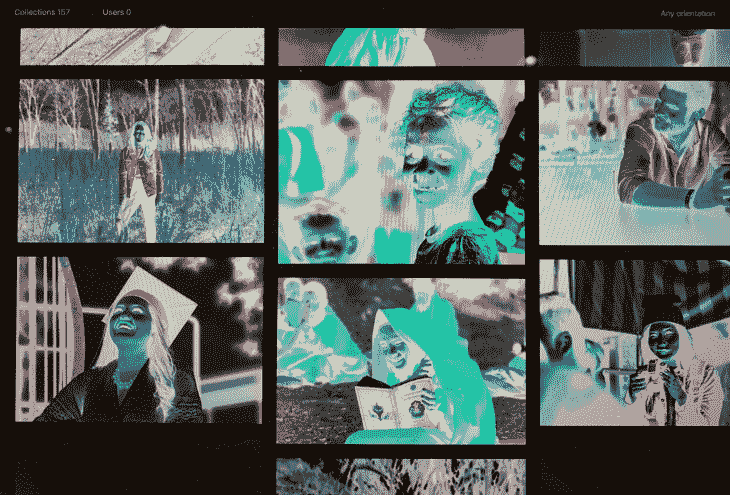

# 你需要知道的新媒体问题

> 原文：<https://blog.logrocket.com/new-media-queries-you-need-to-know/>

媒体查询是级联样式表必须提供的一些最好的特性。它们允许我们根据查看文档的设备和查看文档的上下文来改变应用于文档的样式。偶尔，我们会有新的。

就在我们说话的时候，第 5 级媒体查询规范正在起草中，其中包括一些非常好的规范。其中一些还在研究中，但是有几个已经可以在一些浏览器中使用了。

本文将带您浏览这个新规范中一些最有趣的新媒体查询，并向您展示如何使用它们。

## 亮度级

在写这篇文章的时候，这个特性还没有在任何浏览器中出现，但是它听起来肯定是未来的最爱。使用 **[光级](https://drafts.csswg.org/mediaqueries-5/#light-level)** 媒体查询，您可以根据用户是否在白天查看您的 web 应用程序，或者是否在睡觉前查看，来调整您的风格。对于那些曾经试图在公园里看手机或者在晚上浏览网站的人来说，这是一个好消息！

有三个可用值-**昏暗**、**正常**(默认)和**冲洗。**这里有一个例子，我们改变了一些 CSS 自定义属性:

```
@media (light-level: dim) {
  :root {
    --text-color: white;
    --background-color: black;
  }
}

```

在 [MDN](https://developer.mozilla.org/en-US/docs/Web/CSS/@media/light-level) 阅读更多内容。

## 反转颜色

在黑暗模式出现之前，很多人打开“反转颜色”来获得“黑暗模式”的感觉。它看起来非常整洁，但它也与图像，文本阴影和字体渲染方式(出于某种原因，黑底白字比白底黑字有更多的对比度)拧在一起。



**反色**媒体查询让您适应这些怪癖！虽然目前在 Safari(和 iOS 上的 Safari)中支持，但我确实希望它也能登陆。

这是一个布尔选项，有两个值 **none** 和**反转**。但是您可以完全跳过这个值，编写如下代码:

```
@media (inverted-colors) {
  img { filter: invert(1); }
  * { box-shadow: none !important; text-shadow: none !important; }
}

```

很整洁，是吧？听起来像是现在就可以添加到你的基本 CSS 表单中的东西！

在 MDN 阅读更多内容。

## 偏好，偏好，偏好

CSS 媒体查询的第五层也非常注重个性化。它引入了不少于五种不同的媒体查询，让你可以根据用户的喜好调整你的网站！

### 首选颜色方案

你可能已经听说过**偏好配色方案**的媒体询问。这个可以让你对用户是否在他们的设备上打开了所谓的“黑暗模式”做出反应。换句话说，给你的应用程序添加“黑暗模式”只需要几行代码！

这个特性已经在浏览器中得到了广泛的支持，有三个可能的值——**亮**、**暗**和**无偏好**。这里有一个例子，我们根据喜好改变网站的背景颜色:

```
@media (prefers-color-scheme: dark) {
  body { background: #1e1e1e; color: white; }
}
```

在 MDN 阅读更多内容。

### 偏好-对比

我喜欢这些新媒体查询的一点是它们对可访问性特征的关注。**prefers-contrast**media query 可让您迎合与您的原始设计相比更喜欢高对比度内容的用户。

这里有两个值**——无偏好**和**高**。在[的草案文件](https://drafts.csswg.org/mediaqueries-5/#prefers-contrast)中有一些关于将**高**拆分为**高**和**极高**的讨论，但一切都还不确定。这大概就是这个还没有支持的原因。但是当他们决定了，你就知道该写什么了！

```
@media (prefers-contrast) {
  :root {
    --text-color: black;
  }
}

```

在 MDN 阅读更多内容。

### 偏好-减少运动

一些用户不喜欢动画和过渡。对一些不幸的少数人来说，这种运动会让他们身体不适！这就是为什么现在大多数设备都支持一种方式来减少你在大多数现代用户界面中发现的过渡。

对于**偏好减少运动**的媒体询问，你也可以尊重这个愿望。使用它来减少那些“有弹性的”动画，褪色的图像和“有趣的”过渡。注意，你不一定要去除所有的运动，而是减少它。

浏览器对这个的支持已经很好了，并且也是一个“布尔”值——**无偏好**或**减少**。这里有一个例子:

```
@media (prefers-reduced-motion) {
  * { transition-duration: 0.05s; }
}
```

### 偏好-降低-透明度

一些操作系统提供了减少系统使用的半透明层效果的选项。虽然还没有任何浏览器支持，但**偏好-降低透明度**媒体查询旨在帮助你迎合这些用户。

这是另一个布尔值——**无偏好**和**减少**，所以当它在一些浏览器中发布时，你可以写这样的代码:

```
@media (prefers-reduced-transparency) {
  .floating-box { opacity: 1; }
}

```

在 MDN 阅读更多内容。

### 首选简化数据

现在这个非常令人兴奋。如果你的手机数据快用完了，或者你正在进行国际旅行，访问一个图像密集型网站是很糟糕的。嗯，不再是了，感谢神话般的偏好-减少数据媒体查询！

目前还没有对此的支持，但这是我见过的最实用的媒体查询应用之一。有了这个，你就可以在不需要的时候跳过那些巨大的标题图片或者高分辨率的个人资料图片。我真的希望它能尽快实施。

该值也是布尔值，因此**无偏好**和 ******归约****** 都是值。这里有一个例子:

```
@media (prefers-reduced-data) {
  .hero-image { background-image: none; background-color: salmon; }
}
```

在规范中阅读更多关于它的内容(还没有它的 MDN 页面！).

## 还有一件事—自定义媒体查询

第 5 级规范中引入的最后一个媒体查询无疑是最强大的一个—可脚本化、可定制的媒体查询。

主要目的似乎是通过创建映射到较长媒体查询的自定义媒体查询来避免重复。

它们是用新的 **@custom-media** 关键字指定的，可能是这样的:

```
@custom-media --medium-devices (min-width: 50rem);
@custom-media --large-landscape (min-width: 70rem) and (orientation: landscape);

@media (--medium-devices) {
  .container { max-width: 40rem; }
}

```

CSS 工作组也在计划一种方法来使这些值可脚本化，这将真正为媒体查询带来超能力。想想看，当你有**@ media(–已登录)**或**@ media(–无连接)**媒体查询时，你如何编写样式？

目前还没有浏览器实现这一点，但是你可以使用一个 [PostCSS 插件](https://github.com/postcss/postcss-custom-media)来至少使用规范的 **@custom-media** 部分。

## 令人印象深刻的前景

媒体查询是 CSS 提供的最有用的特性之一，但是这个规范的第五个层次似乎带来了难以置信的进步。请注意，这些媒体查询中有许多尚未实现，仍被视为编辑草案。这意味着在接下来的几年中，您可能会改变一两次您的实现，或者干脆放弃它。

* * *

### 更多来自 LogRocket 的精彩文章:

* * *

从好的方面来说，媒体查询优雅地退化为无，这意味着您今天可以尝试添加它们，而不会对没有运行您选择的浏览器的最新开发者预览版的用户造成影响。

## 你的前端是否占用了用户的 CPU？

随着 web 前端变得越来越复杂，资源贪婪的特性对浏览器的要求越来越高。如果您对监控和跟踪生产环境中所有用户的客户端 CPU 使用、内存使用等感兴趣，

[try LogRocket](https://lp.logrocket.com/blg/css-signup)

.

[](https://lp.logrocket.com/blg/css-signup)[https://logrocket.com/signup/](https://lp.logrocket.com/blg/css-signup)

LogRocket 就像是网络和移动应用的 DVR，记录你的网络应用或网站上发生的一切。您可以汇总和报告关键的前端性能指标，重放用户会话和应用程序状态，记录网络请求，并自动显示所有错误，而不是猜测问题发生的原因。

现代化您调试 web 和移动应用的方式— [开始免费监控](https://lp.logrocket.com/blg/css-signup)。