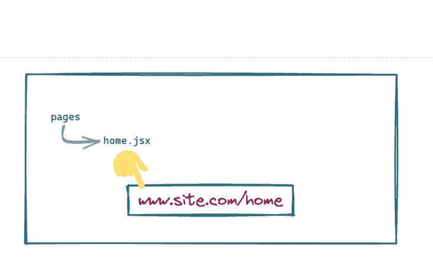
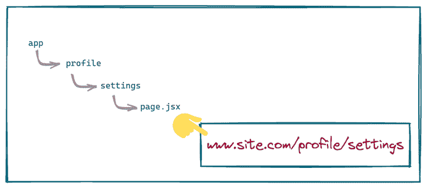
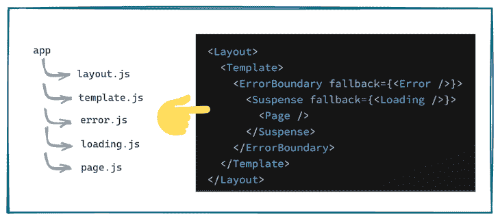
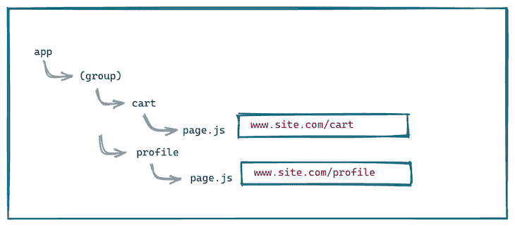
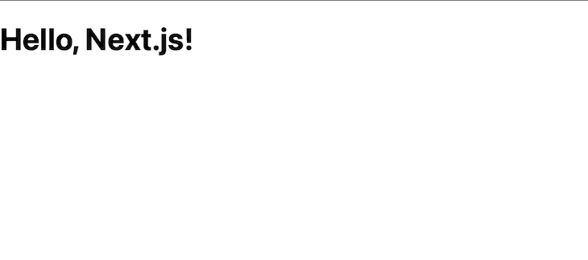
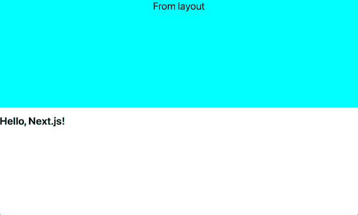
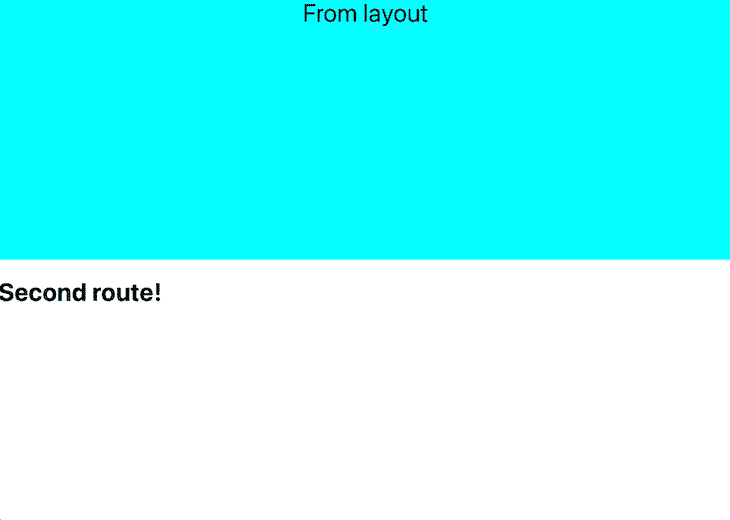
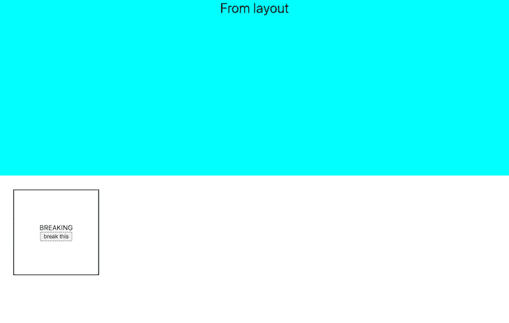
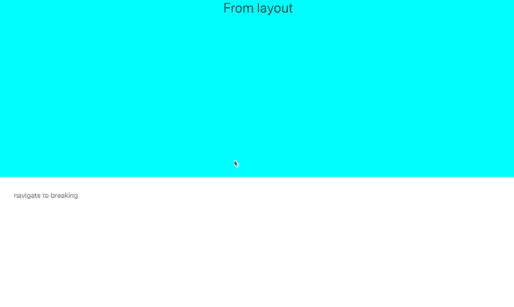
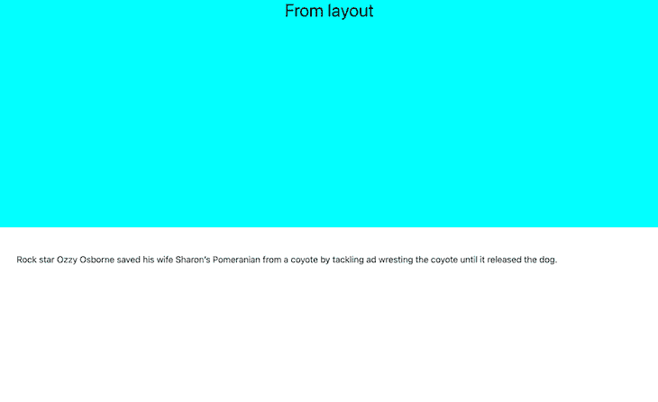

# Next.js 13:使用新的应用程序目录

> 原文：<https://blog.logrocket.com/next-js-13-new-app-directory/>

Next.js 以其基于文件系统的路由而闻名。然而，Next.js v13 在撰写本文时是新的，它改变了以前通过其[新`app`目录](https://beta.nextjs.org/docs/app-directory-roadmap)执行许多任务的方式。

虽然仍然支持相同的基于文件系统的路由，即使用`pages`目录，但新的`app`目录引入了布局、错误组件和加载组件的概念，同时还利用 React 的服务器组件来构建 UI。在本文中，我们将通过构建一个简单的应用程序来探索这些新特性。我们开始吧！

## 目录

## Next.js 13 中的新特性

在开始使用 Next.js 13 进行项目之前，我们将回顾 Next.js 13 引入的新特性和概念。

### 页面目录与应用程序目录

如果你使用过以前版本的 [Next.js，你可能已经熟悉了`pages`目录](https://blog.logrocket.com/implementing-ssr-next-js-dynamic-routing-prefetching/#creating-next-js-routes)。在`pages`目录中创建的任何文件都将作为 UI 中的一个路径。例如，`pages/home.jsx`会负责`/home`路线:



新的`app`目录与`pages`目录一起工作，以[支持增量采用](https://beta.nextjs.org/docs/app-directory-roadmap#supported-features)，并提供其他新功能，如服务器端渲染和静态站点生成。

### 用`app`目录路由

就像`pages`目录中的文件一样，通过`app`目录中的文件夹来控制路由。特定路线的用户界面由文件夹内的`page.jsx`文件定义。

因此，看起来像`app/profile/settings/page.jsx`的文件夹结构将负责呈现`/profile/settings`路线:



### `loading.tsx`文件

`loading.tsx`是一个可选文件，您可以在`app`文件夹内的任何目录中创建它。它自动将页面包裹在一个[反应悬念边界](https://beta.reactjs.org/apis/react/Suspense#suspense)内。该组件将在第一次装载时立即显示，当您在同级路线之间导航时也会显示。

### `error.tsx`文件

`error.tsx`是一个可选文件，将错误隔离到应用程序的最小可能子部分。创建`error.tsx`文件会自动将页面包装在 [React 错误边界](https://reactjs.org/docs/error-boundaries.html)内。每当该文件所在的文件夹中出现任何错误时，该组件将被替换为该组件的内容。

### `layout.tsx`文件

您可以使用`layout.tsx`文件来定义一个跨多个位置共享的 UI。一个布局可以呈现另一个布局或其中的一个页面。每当路由更改到布局内的任何组件时，其状态都会保留，因为布局组件不会被卸载。

### `template.tsx`文件

`template.tsx`类似于`layout.tsx`文件，但是在导航时，组件的一个新实例被挂载并且状态不被保留。

使用布局和模板允许我们利用部分渲染的概念。在同一文件夹内的路线之间移动时，仅提取和渲染该文件夹内的布局和页面:



## 使用`app`目录的注意事项

Next.js 13 引入了这么多变化，当从`pages`目录转移到`app`目录时，我们需要记住一些事情。

### 强制根布局

必须有一个文件定义应用程序目录顶层的根布局。这种布局适用于应用程序中的所有路线。此外，根布局必须定义`<html>`和`<body>`标记，因为 Next.js 不会自动添加它们。

### 头部标签

在`app`目录中的任何文件夹内，我们将创建一个`head.js`文件，该文件将为该文件夹定义`<head>`标签的内容。从这个`head.js`文件返回的组件只能返回某些有限的标签，如`<title>`、`<meta>`、`<link>`、`<script>`。

### 路由组

`app`目录中的每个文件夹都是 URL 路径的一部分。但是，可以通过将文件夹名括在括号内来选择不使用它。这个特殊文件夹中的所有文件和文件夹都是该路由组的一部分:



### 服务器组件

默认情况下，在`app`目录中创建的所有组件都是 React 服务器组件，由于包的大小更小，所以性能更好。但是，如果我们想切换到客户端组件，我们需要用文件顶部的 [`use client`指令](https://beta.nextjs.org/docs/rendering/server-and-client-components#convention)来指定。

## 动手操作 Next.js 13

让我们通过运行一个示例来试验 Next.js 13 中的所有新特性。

### 项目创建

首先，我们使用 [Create Next App](https://blog.logrocket.com/introducing-the-new-create-next-app/) 创建一个新的 Next.js 项目:

```
npx create-next-app next-13
cd next-13

```

让我们按原样运行引导代码:

```
npm run dev

```

迎接我们的是熟悉的主页:


### 页面和布局文件

让我们创建一个与`pages`目录平行的文件夹，并将其命名为`app`。用下面的代码在`app`中创建一个`layout.js`文件:

```
export default function Layout({ children }) {
  return (
    <html lang="en">
      <head>
        <title>Next.js</title>
      </head>
      <body>
        {children}
      </body>
    </html>)
}

```

用以下代码创建一个`page.js`文件:

```
import '../styles/globals.css'
export default function Page() {
  return <h1>Hello, Next.js!</h1>;
}

```

我们还导入了`global.css`文件，以利用已经定义的全局样式。`app`目录仍然是一个实验性的特性，所以我们需要在`next.config.js`文件中设置一个标志来使用它:

```
module.exports = {
  reactStrictMode: true,
  experimental:{appDir: true}
}

```

最后我们需要删除`pages/index.js`文件，这个文件会和`app`目录下的文件冲突。准备就绪后，我们现在可以运行开发服务器了:

```
npm run dev

```

我们看到根路由`/`现在显示了对应于`app/page.js`文件的 UI:



### 测试布局

准备好之后，让我们测试一下布局文件如何影响整个 UI。首先，我们将在同一目录下的一个`layout.module.css`文件中编写一些 CSS 样式:

```
.header {
  width: 100%;
  height: 50vh;
  background-color: cyan;
  text-align: center;
  font-size: 2rem;
}

```

接下来，我们将这些样式导入到`layout.js`文件中，并将它们添加到主体内部的一个`div`中，就在子元素的上方:

```
import styles from './layout.module.css'

export default function Layout({ children }) {
  return (
    <html lang="en">
      <head>
        <title>Next.js</title>
      </head>
      <body>
        <div
          className={styles.header}
        >From layout</div>
        <div>
          {children}
        </div>
      </body>
    </html>)
}

```

用户界面现在看起来如下所示:



让我们在`app`目录中添加一个名为`second`的新文件夹。用下面的代码在里面创建一个名为`page.js`的文件:

```
import '../../styles/globals.css'

export default function Page() {
  return <h1>Second route!</h1>;
}

```

导航到第二条路线`[http://localhost:3000/second](http://localhost:3000/second)`加载以下 UI:



放置在`app`目录中的布局文件被同一目录中的`page.js`和`second`文件夹中的`page.js`共享。您可以通过布局文件完成任何与布局相关的常见更改。

### 测试错误文件

接下来，让我们检查一下`error.js`文件。我们将在`app`文件夹中创建一个文件夹；我们将文件夹命名为`breaking`，并创建单独的`page.js`和`breaking.module.css`文件:

```
'use client';

import '../../styles/globals.css'
import styles from './breaking.module.css';

export default function Page() {
  return (
    <div className={styles.component}>
      <div>BREAKING</div>
      <div>
        <button onClick={(e) => console.log(e.b.c)}>
          break this
        </button>
      </div>
    </div>
  );
}

```

在页面顶部，`use client`告诉 Next.js 将该组件呈现为客户端组件，而不是默认的服务器组件。我们通过下面的按钮组件处理用户输入:

```
.component {
  width: 200px;
  height: 200px;
  display: flex;
  align-items: center;
  justify-content: center;
  border: 2px solid black;
  flex-direction: column;
}

.error {
  background-color: tomato;
  color: white;
}

```

有了这个 CSS，组件看起来就像下图:



现在，让我们在`breaking`文件夹中创建一个`error.js`文件。`error.js`将在该组件内部或其子树中的任何组件出现错误时充当错误边界:

```
'use client';

import '../../styles/globals.css'
import { useEffect } from 'react';
import styles from './breaking.module.css';

export default function Error({
  error,
  reset,
}) {
  useEffect(() => {
    // Log the error to an error reporting service
    console.error(error);
  }, [error]);

  return (
    <div className={styles.error}>
      <div>ERROR</div>
      <p>Something went wrong!</p>
      <button onClick={() => reset()}>Reset error boundary</button>
    </div>
  );
}

```

请注意，这也是一个客户端组件。向该组件传递了两个属性:`error`属性提供了关于错误的更多细节，而`reset`函数重置了错误边界。这应该足以将错误仅包含在组件中，并保留 UI 以及应用程序其余部分的状态。

### 测试加载文件

接下来，我们将测试`loading.js`文件的功能。让我们用下面的代码在同一个文件夹中创建一个:

```
export default function Loading() {
  return <h1>Loading...</h1>
}

```

有了这些，我们需要设置一些导航。在`second/page.js`中，我们放置了一个链接来导航到`/breaking`路线:

```
export default function Page() {
  return (<Link href="/breaking">navigate to breaking</Link>);
}

```

点击这个链接，我们会看到在安装中断组件之前，来自`loading.js`文件的 UI 会出现一瞬间:



## 数据提取

最后，我们将探讨 Next.js 13 中的数据获取与早期版本有何不同。默认情况下，`app`文件夹中的所有组件都是服务器组件。

让我们修改一下`second.js`组件，从[狗事实 API](https://dukengn.github.io/Dog-facts-API/) 中获取随机的狗事实:

```
async function getData() {
  const index = Math.floor(Math.random()*10)
  const res = await fetch(https://dog-facts-api.herokuapp.com/api/v1/resources/dogs?index=${index}`);
  return res.json();
}

```

我们将在 React 组件中直接调用这个函数，方法是使它异步:

```
export default async function Page() {
  const data = await getData();
  return (
    <p>
      {data[0].fact}
    </p>
  );
}

```

上面的代码获取服务器端的 dog 事实，并将其显示在我们的组件中:



### 客户端和服务器端呈现

在组件内部本地使用 Fetch API 为我们提供了根据需求缓存和重新验证请求的能力。因此，前面的实用程序如`getStaticProps`和`getServerSideProps`可以通过一个 API 实现，如下所示:

```
// Generates statically like getStaticProps.
fetch(URL, { cache: 'force-cache' });

// Generates server-side upon every request like getServerSideProps.
fetch(URL, { cache: 'no-store' });

// Generates statically but revalidates every 20 seconds
fetch(URL, { next: { revalidate: 20 } });

```

## 结论

这几乎囊括了 Next.js 13 中由`app`目录引入的所有变化。

虽然在撰写本文时，这些新功能还处于测试阶段，在正式发布之前肯定会有一些小的变化，但我们可以同意，它们通过加载、错误和布局组件提供了更大的灵活性来配置我们的 UI。服务器组件上本地 Fetch API 的简单性也是一个很好的补充。

这是我们使用的[代码](https://github.com/kokanek/nextjs-13)的链接。随意探索！

## [LogRocket](https://lp.logrocket.com/blg/nextjs-signup) :全面了解生产 Next.js 应用

调试下一个应用程序可能会很困难，尤其是当用户遇到难以重现的问题时。如果您对监视和跟踪状态、自动显示 JavaScript 错误、跟踪缓慢的网络请求和组件加载时间感兴趣，

[try LogRocket](https://lp.logrocket.com/blg/nextjs-signup)

.

[](https://lp.logrocket.com/blg/nextjs-signup)[](https://lp.logrocket.com/blg/nextjs-signup)

LogRocket 就像是网络和移动应用的 DVR，记录下你的 Next.js 应用上发生的一切。您可以汇总并报告问题发生时应用程序的状态，而不是猜测问题发生的原因。LogRocket 还可以监控应用程序的性能，报告客户端 CPU 负载、客户端内存使用等指标。

LogRocket Redux 中间件包为您的用户会话增加了一层额外的可见性。LogRocket 记录 Redux 存储中的所有操作和状态。

让您调试 Next.js 应用的方式现代化— [开始免费监控](https://lp.logrocket.com/blg/nextjs-signup)。