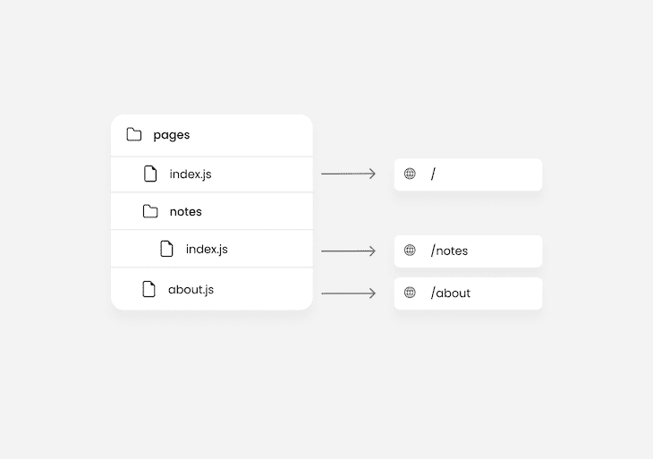
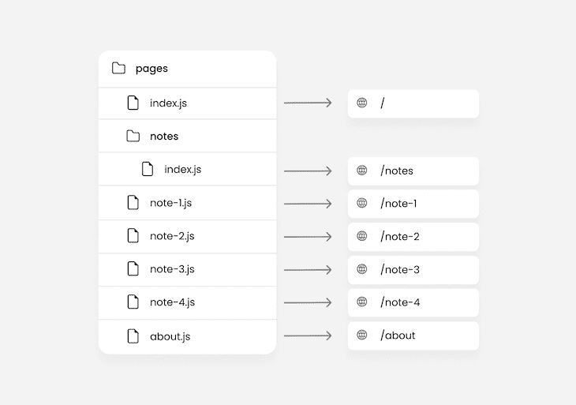
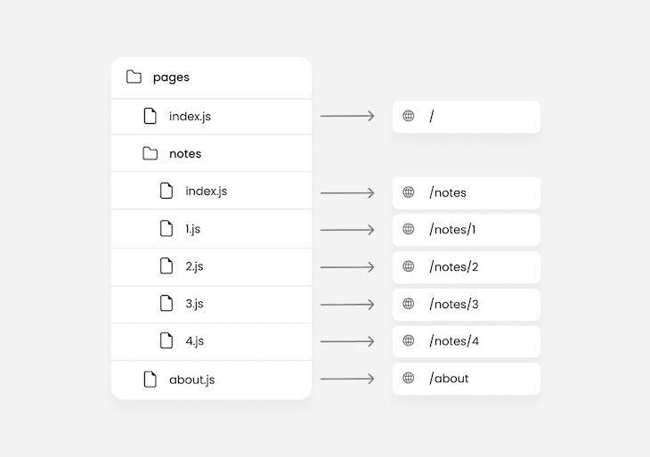
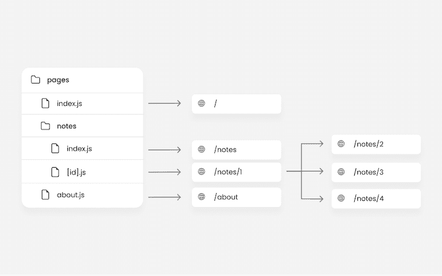
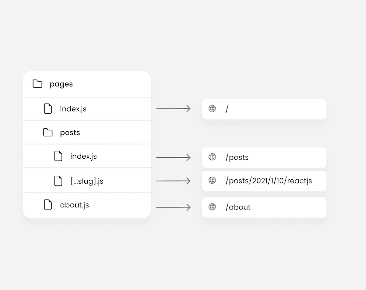

# 了解 Next.js routeChangeStart 和路由器事件

> 原文：<https://blog.logrocket.com/next-js-routechangestart-router-events/>

像 Next.js 这样的现代全栈 React 框架的众多特性之一是令人印象深刻的内置路由系统。虽然 React 本身对于单页面应用程序来说很棒，但是我们可以[将它与 Next.js](https://blog.logrocket.com/creating-website-next-js-react/) 这样的框架一起使用来构建复杂的多页面应用程序。

这些框架还提供了一种通过路由器处理应用导航的方法。例如，Next.js 中的 [routing 就像为应用程序创建一组页面并唯一地处理从一个页面到另一个页面的移动一样简单。](https://blog.logrocket.com/what-you-need-know-new-next-js-router/)

Next.js 使我们能够监听关于从一个页面导航到另一个页面的事件。例如，当一条路线开始改变时，或者换句话说，当用户导航到一个新页面时，`[routeChangeStart](https://nextjs.org/docs/api-reference/next/router#routerevents)`事件就会触发。

在本文中，我们将看看`routeChangeStart`事件，以及 Next.js 中的其他路由器事件。本文中使用的所有代码示例都是一个简单的 Next.js 项目的一部分，可以在这个库中找到[。你也可以](https://github.com/Elijah-trillionz/next.js-router-events-app)[在这里](https://next-js-router-events-app.vercel.app/)观看项目演示。我们开始吧！

*向前跳转:*

## Next.js 中路由的工作方式

在我们进入 Next.js 中的路由器事件之前，让我们回顾一下路由在 Next.js 中是如何工作的，并探索一下我们将在本文中使用的一些路由概念。

Next.js 中的路由是基于页面概念的[。页面是在`pages`目录中带有`.ts`、`.js`、`.tsx`或`.jsx`扩展名的任何文件。因此，`pages`目录中的任何 React 文件都是一个页面，并且可以自动作为一个路径使用。请参见下图:](https://blog.logrocket.com/what-you-need-know-new-next-js-router/)



从上图中，我们知道我们的 Next.js 项目的路径将有三个页面，包括代表当前目录的页面`index.js`、`/`和`/notes`。

### 嵌套路由

嵌套路线有助于您更好地组织路线。在`pages`目录中，不仅可以创建嵌套文件，还可以嵌套文件夹。在嵌套文件夹中创建的文件也被视为页面和嵌套路由。

例如，假设我们有四组笔记，希望在项目中作为页面使用。我们可以简单地创建四个页面，就像这样:



如上图所示，对于每个笔记的页面 URL，我们的命名约定看起来像`/note-1`、`/note-2`等等。

这可能看起来有点奇怪，也不太直观。如今，我们习惯于用`/notes/1`、`/notes/2`等来命名网络上的相关页面。

在这里，嵌套路由开始发挥作用。Next.js 路由器会自动将嵌套文件夹路由到文件夹及其文件的结构。比如说:

*   `pages/notes/1`文件结构将产生一个`/notes/1`路径
*   `pages/notes/drafts/1`文件结构将产生一个`/notes/drafts/1`路径

因此，我们会得到以下结果:



现在，忽略上图中怪异的命名结构。我们将在下一节中解决这个问题。

### 动态路由

动态路由包括创建一个代表无限数量相似页面的动态文件。

例如，如果我们有 15 个不同的笔记，并且我们希望每个笔记都有一个单独的页面，我们将最终创建 15 个文件。我们想要的笔记越多，我们拥有的文件就越多，这最终是不方便和不必要的。

这时，动态路由就派上了用场。由于所有笔记都有相似的页面布局，我们可以创建一个代表无限量笔记的文件，而不是为每个笔记创建一个文件:



下面代码中的方括号`[]`代表一个动态路由。在这些括号中用作占位符的任何内容都将被路由器作为`query`对象的属性来推送:

```
// pages/notes/[id].js
import { useRouter } from 'next/router';

const Sam = () => {
  const router = useRouter();

  useEffect(() => {
    console.log(router.query); // route /notes/1 -> { id: 1 }
  }, [router.query]);

  return (
    <div>
      <h1>Note - {router.query?.id}</h1>
    </div>
  );
};

```

Next.js 通过在占位符旁边添加三个点，即`[...slug].js`，可以扩展动态路由以捕捉所有路由。这对于某些类型的路径很有用，这些路径需要多个路径来为主页返回值。

例如，对于一个博客，文章是通过日期和组成 slug 的文章的标题来获取的，您可以使用类似于`/posts/2021/1/10/reactjs`的路径:



这里，`router.query`会返回`[2021, 1, 10, reactjs]`。因此，你可以说“给我一篇 2022 年的文章，在第一个月的 10 号，标题是`React.js`”

如果你正在使用基于类的组件，或者也许你不想使用`useRouter`钩子来[访问`router`对象](https://nextjs.org/docs/api-reference/next/router#router-object)，你可以[使用`withRouter`函数](https://nextjs.org/docs/api-reference/next/router#withrouter)来代替:

```
const Note = ({ router }) => {

  useEffect(() => {
    console.log(router.query); // route /notes/1 -> { id: 1 }
  }, [router.query]);

  return (
    <div>
      <h1>Note - {router.query?.id}</h1>
    </div>
  );
};
export default withRouter(Note);

```

### 浅层布线

使用浅层路由，我们可以更改页面的路径，而无需再次运行数据获取方法。即使在更改 URL 后，浅层路由也有助于保持页面的状态。

`router`对象也可以访问更新后的`pathname`。更改 URL 可能意味着添加一个新的查询，因此我们可能有以下代码:

```
// pages/notes/[id].js
const Note = () => {
  const router = useRouter();

  useEffect(() => {
    router.push('?id=4', '', { shallow: true });
  }, []);

  useEffect(() => {
    console.log(router.query);
  }, [router.query]);

  return (
     <div>
      <h1>Note - {router.query?.id}</h1>
    </div>
  );
};
export default Note;

export const getServerSideProps = async () => {
  console.log('called');
  return { props: {} };
};

```

当`router.push`方法改变页面的 URL 时，应该调用`getServerSideProps`函数。然而，在这种情况下，因为路由是浅层的，所以既不会调用`getServerSideProps`也不会调用任何其他数据获取方法。

`router.push`方法是 [Next.js `Link`组件](https://blog.logrocket.com/dealing-with-links-in-next-js/)的替代方法，用于在页面间导航。在本例中，我们没有导航到新页面，而是导航到当前页面`/about`，但是使用了新的查询`username`。

注意，`router.push`方法将一个 options 对象作为最后一个参数，我们用它来指定路由是否是浅层的，例如，`shallow: true`。

同时，`Link`组件使用`shallow`属性来指定布线是否是浅的。在这两种情况下，`router.push`和`Link`都默认为 false。

### 使用`next/link`与`next/router`进行路由

如前所述， [`router.push`](https://nextjs.org/docs/api-reference/next/router#routerpush) ，出自`next/router`，是`Link`成分的替代，出自`next/link`。虽然`next/link`和`next/router`是和 Next.js 完全不同的模块，但是你可以用两者来导航。

我不会明确地告诉你什么时候应该或者不应该使用其中的一个，但是我会尽力帮助你理解两者是如何工作的，这样你就可以为每个场景选择最合适的。

用`next/link`路由是以声明的方式完成的，这意味着你可以告诉 Next.js 你想去哪里，它会处理剩下的事情。来自`next/link`的`Link`组件基本上像 HTML 的简单`<a>`标签一样工作。事实上，当您使用`Link`组件时，Next.js 会将一个`<a>`标签推入 DOM。这有利于搜索引擎优化，因为爬虫将能够检测到你的链接。

另一方面，用`next/router`路由是强制性的，意味着你告诉 Next.js 它应该如何转到下一页。

以声明的方式，你可以说出你想要什么，而不必担心如何实现的细节。与此同时，你必须准确地陈述应该做什么来获得最终结果。

* * *

### 更多来自 LogRocket 的精彩文章:

* * *

`router.push`的行为与`window.location`相似。它不会创建一个`<a>`标签，这意味着它不会被爬虫检测到，这对 SEO 不利。

`next/router`的一个流行且非常足智多谋的用途是以编程方式导航。假设您需要在用户访问页面或返回登录页面之前检查用户是否已经登录。为此，您可以如下使用`next/router`:

```
useEffect(() => {
 (async () => {
   const res = await fetch() // fetch request

   if (res.ok) {
     setUser(res.user);
   } else {
     router.push('/login')
   }
 })()
}, []);

```

## Next.js 中的路由器事件

`router`对象有几个[不同的属性和方法](https://nextjs.org/docs/api-reference/next/router#router-object)。其中之一是 [`events`属性](https://nextjs.org/docs/api-reference/next/router#routerevents)，它提供了允许您监听路由器事件的方法。例如:

*   当路线将要改变时
*   当路由完全改变时
*   当浏览器历史将要改变时
*   当路线在改变时遇到错误时

让我们在下面更详细地探讨每一个。

### `routeChangeStart`事件

当路线将要改变时，触发 [`routeChangeStart`事件](https://nextjs.org/docs/api-reference/next/router#routerevents)。换句话说，当用户单击链接导航到新页面时，就会触发一个事件。看看下面的例子:

```
function MyApp({ Component, pageProps }) {
  const router = useRouter();

  useEffect(() => {
    router.events.on('routeChangeStart', (url, { shallow }) => {
      console.log(`routing to ${url}`, `is shallow routing: ${shallow}`);
    });
  }, []);

  return <Component {...pageProps} />;
}
export default MyApp;

```

在本例中，我们订阅了`pages/_app.js`文件中`MyApp`组件内的事件。尽管这不是订阅事件的唯一选项，但却是最方便的选项。我们很快会对此进行更多的讨论，但与此同时，让我们关注一下`routeChangeStart`事件到底是做什么的。

Next.js 路由器提供了订阅和取消订阅`events`属性的两种方法:分别是`on`和`off`。

在上面的例子中，我们使用了`on`方法来订阅`routeChangeStart`事件。然后，第二个参数是一个回调函数，它返回用户导航到的 URL 和一个带有`shallow`属性的对象，该属性指示路由是否是浅层的。

`routeChangeStart`事件是由 Next.js 路由器触发的，而不是浏览器。因此，在 Next.js 路由器之外路由不会触发该事件。

例如，使用默认的`<a>`标签进行导航或在浏览器中手动更改 URL 将不会触发路由器事件。这不仅仅适用于`routeChangeStart`事件；它适用于所有 Next.js 路由器事件。

### `routeChangeComplete`事件

当路线完全改变时，触发`routeChangeComplete`事件:

```
function MyApp({ Component, pageProps }) {
  const router = useRouter();

  useEffect(() => {
    router.events.on('routeChangeComplete', (url) => {
      console.log(`completely routed to ${url}`);
    });
  }, []);

  return <Component {...pageProps} />;
}
export default MyApp;

```

`routeChangeComplete`事件对于终止由`routeChangeStart`事件发起的任何事情都很有用。

例如，假设您想要获得加载一个页面所花费的总时间，那么您在触发`routeChangeStart`事件时启动了一个计时器。使用`routeChangeComplete`，您可以终止并向上舍入计时器。

### `beforeHistoryChange`事件

在实际操作中，`beforeHistoryChange`事件看起来几乎与`routeChangeStart`事件相似。但是，当目标页面出现延迟时，这些事件之间的区别就很明显了。

`beforeHistoryChange`事件一点也不像`routeChangeStart`。只有在浏览器的历史将要改变的时候才会触发。

考虑一个服务器端呈现的示例，其中目标页面上的延迟是由路由到该页面之前预取的数据量引起的。

当用户点击一个页面的链接时，触发`routeChangeStart`事件，并开始获取该页面上的数据。随后，当服务器端功能完全执行时，这意味着新页面完全准备好了。

接下来，您将把用户移动到那个新页面，此时会触发`beforeHistoryChange`事件。

`beforeHistoryChange`事件可能看起来类似于`routeChangeComplete`,因为在浏览器的历史改变之后，路由将被指示为完成。没有`afterHistoryChange`事件，因为`routeChangeComplete`已经服务于该目的。

看看下面的代码:

```
function MyApp({ Component, pageProps }) {
  const router = useRouter();

  useEffect(() => {
    router.events.on('beforeHistoryChange', (url) => {
      console.log(`appending ${url} to history`);
    });
  }, []);

  return <Component {...pageProps} />;
}
export default MyApp;

```

当 URL 附加到`history`后，`beforeHistoryChange`会提醒您。

### `hashChangeStart`和`hashChangeComplete`事件

当一个 URL 的散列开始改变时，触发`hashChangeStart`事件，而不是页面。相比之下，`hashChangeComplete`事件是在 URL 的散列完全改变时触发的。

哈希最常用于在文档和文章的页面中导航。视口中的元素集总是变化的，但页面保持不变。

例如，尝试重新访问本文开头的目录，并单击本节的标题。它会自动带你回到这里。

当哈希值改变时，这两个事件被触发。您可以使用它们来处理当用户在带有哈希的页面中导航时发生的情况:

```
function MyApp({ Component, pageProps }) {
  const router = useRouter();

  useEffect(() => {
    router.events.on('hashChangeStart', (url) => {
      console.log(`navigating to ${url}`);
    });

    router.events.on('hashChangeComplete', (url) => {
      console.log(`navigated to ${url}`);
    });

  }, []);

  return <Component {...pageProps} />;
}
export default MyApp;

```

除了向 URL 添加哈希之外，从 URL 中移除哈希也会触发这些事件。

### `routeChangeError`事件

当路线未能改变时，触发`routeChangeError`事件。路线无法更改可能有多种原因，但一个常见的原因是用户取消了到目的链接的导航。

当用户点击一个链接并立即点击另一个链接时，导航到第一个链接被取消，从而触发`routeChangeError`事件:

```
function MyApp({ Component, pageProps }) {
  const router = useRouter();

  useEffect(() => {
    router.events.on('routeChangeError', (err, url) => {
      console.log(err.cancelled ? 'you cancelled the navigation' : err);
    });
  }, []);

  return <Component {...pageProps} />;
}
export default MyApp;

```

回调返回一个带有`cancelled`属性的`err`变量，以确定它是否被用户取消。

### 取消订阅事件

如前所述，您可以使用`on`来订阅 Next.js 中的事件，而`off`方法用于取消订阅。

取消订阅 React 中的任何事件通常是在组件卸载时完成的。在功能组件中，我们会有以下内容:

```
function MyApp({ Component, pageProps }) {
  const router = useRouter();

  useEffect(() => {
router.events.on('routeChangeStart', (url, { shallow }) => {
      console.log(`routing to ${url}`, `is shallow routing: ${shallow}`);
    });

    return () => {
      router.events.off('routeChangeStart', () => {
        console.log('unsubscribed');
      });
    };
  }, []);

  return <Component {...pageProps} />;
}
export default MyApp;

```

在基于类的组件中，[可以用`componentWillUnmount`](https://reactjs.org/docs/react-component.html#componentwillunmount) 来代替。

您可以取消订阅您订阅的任意多个事件，但您必须单独取消订阅每个事件。比如你订阅了`routeChangeStart`和`routeChangeComplete`，就要分别退订两个。

## 在 Next.js 中何处使用路由器事件

到目前为止，我们考虑的所有例子都在第`pages/_app.js`页。但是，Next.js 中事件的用例不仅限于该页面。您可以在任何页面或组件上订阅路由器事件。

您也不局限于留在组件内部。例如，您可能有以下内容:

```
import Router from 'next/router';

Router.events.on('routeChangeStart', (url, { shallow }) => {
    console.log(`Navigating to ${url}`);
});

function MyApp({ Component, pageProps }) { 
  return <Component {...pageProps} />;
}
export default MyApp;

```

`Router`变量也具有与`useRouter`返回的变量相同的属性和方法。因此，我们可以在`MyApp`组件之外监听路由器事件。

## Next.js 中何时使用路由器事件

知道 Next.js 中有哪些路由器事件以及如何使用它们是很棒的。Next.js 路由器事件的一些示例用例包括但不限于:

*   在页面导航之间创建加载指示器
*   用户导航行为的自定义监控
*   确定页面的加载时间
*   导航期间的动画

通过自定义监控，您可以确定诸如最常访问的页面、断开的链接等等，而无需任何额外的库或工具。

前面，我们提到了数据获取如何影响路由器事件。请注意，由这些路由器事件触发的任何加载指示器通常只会在您使用 Next.js 中的[服务器端渲染时产生明显的影响。](https://blog.logrocket.com/ssg-vs-ssr-in-next-js/)

服务器端呈现往往是唯一会导致路由延迟的数据获取方法，因为它是在运行时执行的，不像[静态站点生成在构建时执行](https://nextjs.org/docs/basic-features/data-fetching/get-static-props)。换句话说，使用服务器端呈现，数据获取方法`getServerSideProps`将只在页面被请求时执行。

当用户点击使用服务器端渲染的页面链接时，在路由器导航到该页面之前会执行`getServerSideProps`功能。结果就是，无论执行`getServerSideProps`函数多长时间，路由器都不会移动到下一页。

在这里，路由器事件在通知用户加载指示器以及确定页面的加载时间方面起着非常重要的作用。

每当您路由到服务器端呈现的页面时，您应该使用路由器事件来显示指示器。你永远不知道加载一个页面要花多长时间，所以让用户知道加载正在进行中要比怀疑链接是否断开或者它实际上根本不是一个链接更安全。

## 结论

在本文中，我们探讨了什么是 Next.js 路由器事件、如何使用它们以及何时何地使用它们。

对于依赖于服务器端渲染的应用程序，或者作为导航期间触发动画的一种方式，Next.js 路由器事件非常有用。

您应该[查看包含本文示例的 GitHub 库](https://github.com/Elijah-trillionz/next.js-router-events-app)。该代码包含由服务器端呈现的页面中的自定义延迟触发的加载指示器动画。

好了，这篇文章就到这里。我希望它是有用的。别忘了在评论区留下你的想法。感谢阅读，祝黑客快乐！

## [LogRocket](https://lp.logrocket.com/blg/nextjs-signup) :全面了解生产 Next.js 应用

调试下一个应用程序可能会很困难，尤其是当用户遇到难以重现的问题时。如果您对监视和跟踪状态、自动显示 JavaScript 错误、跟踪缓慢的网络请求和组件加载时间感兴趣，

[try LogRocket](https://lp.logrocket.com/blg/nextjs-signup)

.

[](https://lp.logrocket.com/blg/nextjs-signup)[](https://lp.logrocket.com/blg/nextjs-signup)

LogRocket 就像是网络和移动应用的 DVR，记录下你的 Next.js 应用上发生的一切。您可以汇总并报告问题发生时应用程序的状态，而不是猜测问题发生的原因。LogRocket 还可以监控应用程序的性能，报告客户端 CPU 负载、客户端内存使用等指标。

LogRocket Redux 中间件包为您的用户会话增加了一层额外的可见性。LogRocket 记录 Redux 存储中的所有操作和状态。

让您调试 Next.js 应用的方式现代化— [开始免费监控](https://lp.logrocket.com/blg/nextjs-signup)。