# 用故事书控件展示下一级组件

> 原文：<https://blog.logrocket.com/next-level-component-showcasing-with-storybook-controls/>

## 什么是故事书控件？

[Storybook controls](https://storybook.js.org/) 构成了一种在专用 Storybook 面板上显示图形 UI 控件(例如，颜色选择器)的机制，以动态地与您的 React 组件进行交互。因此，作为一个例子，为了手动测试或演示的目的，用户可以容易地改变组件的背景颜色或字体大小。

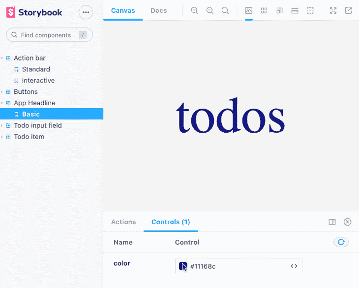

Dynamically change the font color using Storybook’s color picker control

这里重要的一点是，您不必将这些演示用例编码为组件代码库的一部分，这意味着您不必混合这些单独的关注点，而是可以避免淡化 React 组件。

事实上恰恰相反——story book 提供了一种优雅的方式，让这些“交互 UI 元素”直接在故事代码中配置。此外，与使用[故事书旋钮](https://storybook.js.org/addons/@storybook/addon-knobs/)相比，它现在很大程度上被认为是过时的，有利于控制，你不必编写大量的代码来实现这个功能。

这是因为新的控制机制依赖于通过利用静态代码分析工具对 React 组件的代码进行智能分析，例如 [react-docgen](https://github.com/reactjs/react-docgen) 或 [react-docgen-typescript](https://github.com/styleguidist/react-docgen-typescript) 。

如果您已经熟悉 Storybook knobs，或者您对这些机制之间的差异很好奇，我将在本文末尾向您展示用 knobs 实现的相同用例的比较。现在，让我们用故事书控件来研究新的工作方式。

## 用`sb init`设置故事书和控件

安装故事书最简单的方法是借助 [npx 和 sb 包](https://github.com/storybookjs/storybook/tree/main/app/react)。在【React 教程的故事书中可以找到启动和运行它的其他方法。

```
$ npx sb init

```

Storybook 将在添加到现有项目时自动检测项目类型——在我们的例子中，它是一个 React 项目。从下一张截图可以看出，你可以从一个固执己见的 React 项目开始，在 Storybook 启动并运行的情况下，押注于 CSS 文件和 SVG 图像。

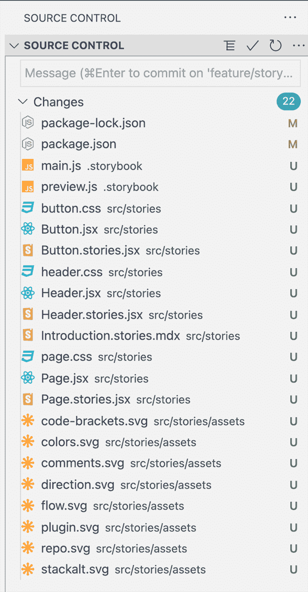

The result of the `sb init` command

目前， [Storybook 控件](https://github.com/storybookjs/storybook/tree/next/addons/controls)并不包含在上述安装脚本中。因此，我们需要手动安装插件。

```
$ npm i -D @storybook/addon-controls

```

由于 Storybook 是一个 [Lerna](https://github.com/lerna/lerna) [monorepo 项目](https://doppelmutzi.github.io/monorepo-lerna-yarn-workspaces/)，所有的插件都位于带有附加`Readme.md`文件的子项目中，这些文件记录了如何在 Storybook 项目中安装和集成它们。

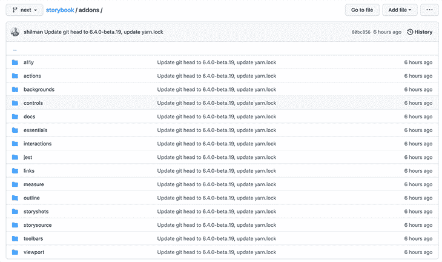

`sb`脚本已经为我们创建了一个带有几个内置插件的`.storybook/main.js`文件。我们必须添加我们的控制插件到这个文件中。以下配置足以满足我们的用例。

```
  "addons": [
    '@storybook/addon-controls',
    "@storybook/addon-essentials"
  ]

```

另外，`sb`脚本给`package.json`增加了 npm 脚本。有了`npm run storybook`，我们可以测试一切是否正常。

```
"scripts": {
  // ...
  "storybook": "start-storybook -p 6006",
  "build-storybook": "build-storybook"
}

```

## 关于我们的伙伴项目

为了演示如何使用 Storybook 控件，我创建了一个由 React 应用程序和大量使用控件的故事组成的配套 GitHub 项目。React 应用受到了 [todomvc](https://todomvc.com/examples/react/#/active) 的极大启发。

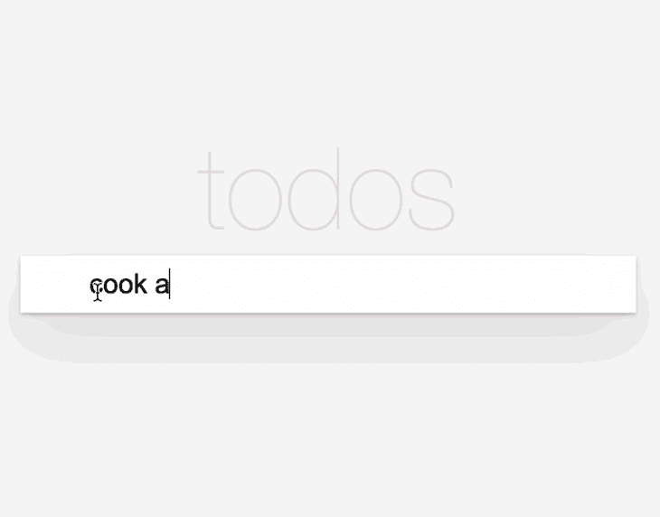

在克隆 GitHub repo 之后，安装依赖项，然后启动 React [dev server](http://localhost:3000) 来运行演示应用程序。

```
$ npm i
$ npm run dev

```

要[打开故事书](http://localhost:6006)，执行以下命令。

```
$ npm run storybook

```

### Webpack 5 支持

在撰写本文时，Storybook 还不能与 webpack 5 一起开箱即用。

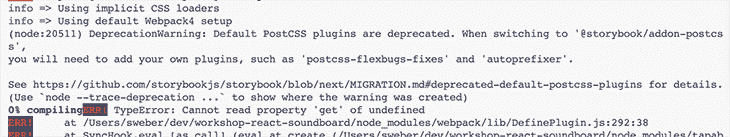

因为我们将在这个演示项目中使用 webpack 5，我们需要采取[一些额外的步骤](https://github.com/storybookjs/storybook/blob/next/MIGRATION.md#webpack-5)。首先，我们要安装两个额外的软件包: [`@storybook/builder-webpack5`](https://www.npmjs.com/package/@storybook/builder-webpack5) 和 [`@storybook/manager-webpack5`](https://www.npmjs.com/package/@storybook/manager-webpack5) 。

```
$ npm i -D @storybook/builder-webpack5 @storybook/manager-webpack5

```

最后，我们需要将 webpack 5 构建器添加到我们的`.storybook/main.js`文件中。

```
  core: {
      builder: 'webpack5',
  }

```

最终结果如下所示:

```
// .storybook/main.js
module.exports = {
  core: {
    builder: "webpack5",
  },
  stories: ["../src/**/*.stories.mdx", "../src/**/*[email protected](js|jsx|ts|tsx)"],
  addons: ["@storybook/addon-essentials", "@storybook/addon-controls"],
};

```

## 使用控件检查我们的第一个基本故事

让我们来看看我们的第一个故事，它是基于`Headline`组件的。在下面截图的右边，你可以看到该组件，它将作为演示应用程序的一部分出现。在左侧，你会看到标题为的 **App 标题为**基本**的栏目中的一个故事。文章设置为使用单个颜色选择器控件来动态调整标题的字体颜色。**

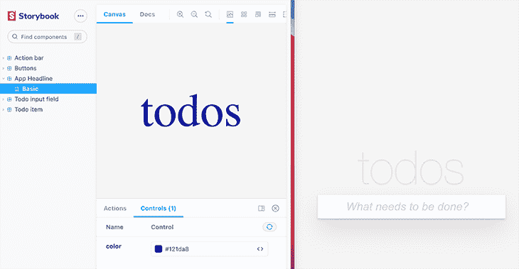

Story with a color picker control

以下代码是将颜色选择器控件添加到故事并将其连接到`Headline`组件所需的全部代码。

```
// src/stories/Headline.stories.jsx
import Headline from "../Headline";
export default {
  component: Headline,
  title: "App Headline",
};
export const Basic = ({ color }) => <Headline color={color} />;
Basic.args = {
  color: "#516dd0",
};

```

虽然这不是故事书控件的一部分，但我想说几句关于故事结构的话。

正如你可以在 [Storybook 的关于故事结构](https://storybook.js.org/docs/react/writing-stories/introduction)的文档中读到的，默认导出定义了关于你的组件的元数据。我们用`title`属性覆盖 Storybook 节点的默认名称(标题)。此外，每个命名的导出都构成一个故事——在我们的例子中，我们只有一个命名为 Basic 的导出。该名称源自导出的变量。

## 控件如何工作

您可能想知道控件的引用在哪里。底层的[控件概念](https://storybook.js.org/docs/react/essentials/controls)是使用 args 编写故事[。Storybook 将自动生成基于这些参数的 UI 控件，以及它可以推断出的关于组件的信息。](https://storybook.js.org/docs/react/writing-stories/introduction#using-args)

下面，我稍微改写了上面的故事代码，让它更清楚控件是如何工作的。

```
// src/stories/Headline.stories.jsx
// ...
export const Basic = (args) => <Headline {...args} />;
Basic.args = {
  color: "#516dd0",
};

```

下面的代码片段显示了`Headline`组件的实现。演示项目使用[样式的组件](https://blog.logrocket.com/benefits-using-styled-components-react/)作为 CSS 库，但是这超出了本文的范围。

```
// src/Headline.jsx
import styled from "styled-components";
const Headline = styled.h1`
  color: ${(props) => props.color};
  font-size: 100px;
  font-weight: 100;
  text-align: center;
`;
const HeadlineComponent = ({ color }) => {
  return <Headline color={color}>todos</Headline>;
};

```

如您所见，`Headline`组件只有一个类型为`string`的`color`道具作为输入。为了让颜色选择器控件工作，我们需要导出一个接受`args`作为单一方法参数的函数，并将其传递给实际的 React 组件。

在第二个例子中，我们通过`(args) => <Headline {...args} />`将所有参数分布到组件中。既然我们知道我们只有一个颜色参数，我们也可以使它更明确，如第一个例子所示:`({ color }) => <Headline color={color} />`。

Storybook 如何知道我们想要显示一个颜色选择器控件？它根据 arg 的初始值做出决定。

```
Basic.args = {
  color: "#516dd0",
};

```

### 自定义控件类型匹配器

如果你明白为什么这对于 Storybook 来说是足够的信息，那么我将为你提供谜题的最后一部分，即在`.storybook/preview.js` 中配置的[。](https://storybook.js.org/docs/react/configure/overview#configure-story-rendering)

```
// .storybook/preview.js
export const parameters = {
  controls: {
    matchers: {
      color: /(background|color)$/i,
      date: /Date$/,
    },
  },
  // ...
}

```

前面提到的`sb`脚本生成了`.storybook/preview.js`文件和这段代码。在这个文件的帮助下，你可以[控制故事中事物的呈现方式](https://storybook.js.org/docs/react/configure/overview#configure-story-rendering)——例如，你可以[配置故事的布局](https://storybook.js.org/docs/react/configure/story-layout#global-layout)，这样组件就会在故事中居中。

从控件的角度来看，重要的部分是`controls`属性，正如你在上面看到的。每当 Storybook 识别出 regex 中指定的名为 arg 的参数时，它就使用[自定义控件类型匹配器](https://storybook.js.org/docs/react/essentials/controls#custom-control-type-matchers) `color`来显示颜色选择器 UI 控件。此外，我们将在本文后面看到一个日期选择器控件的示例。

## 用`argTypes`检查高级控制

在下一个故事示例中，我们将看到仅使用 args 是不够的。我们必须借助 [`argTypes`](https://storybook.js.org/docs/react/api/argtypes) 进一步配置控件。

如下图所示，两个故事显示了`TodoItem`组件，并让用户通过控件与它们交互。


### 关于演示应用架构的一些话

在我看来，如果不参考底层的项目设计，就不可能解释故事书的概念。如何编写您的故事取决于您用来构建组件的 React 概念。

举个例子，与只接受 React props 的组件(如我们的`Headline`组件)相比，如果组件依赖于[React 上下文 API](https://beta.reactjs.org/learn/passing-data-deeply-with-context#context-an-alternative-to-passing-props) ，你需要做一些额外的工作。

在我们开始故事实现之前，让我们先看看`TodoItem`组件的一些关键方面，在我们开始配置我们的控件之前，我们需要首先注意这些方面。

```
// src/TodoItem.jsx
const Container = styled.div`
  height: 30px;
  // ...
`;
const TodoItem = ({ todo }) => {
  const { todos, setTodos } = useContext(AppContext);
  const [hover, setHover] = useState(false);
  const [checkHover, setCheckHover] = useState(false);
  return (
    <Container
      onMouseEnter={() => setHover(true)}
      onMouseLeave={() => setHover(false)}
    >
      // skip implementation for reasons of clarity 
    </Container>
  );
};

```

这个片段的重要之处在于组件[利用了 React 上下文](https://blog.logrocket.com/react-context-api-deep-dive-examples/)，因此，我们需要在我们的故事中提供`todos`和`setTodos`。具体地说，我们需要向`AppContext.Provider`提供上下文值，它是`Todos`组件的一部分。我们的`TodoItem`组件被渲染为`TodoList`组件的一部分。

```
// src/Todos.jsx 
// ...
const Todos = () => {
  const [todos, setTodos] = useState([]);
  const [filterIndex, setFilterIndex] = useState(0);
  return (
    <AppContext.Provider
      value={{
        todos,
        setTodos,
        filterIndex,
        setFilterIndex,
        theme: theme.LIGHT,
        translation,
      }}
    >
      <Container>
        <TodoInput />
        <TodoList />
        {todos.length > 0 && <ActionBar />}
      </Container>
    </AppContext.Provider>
  );
};

```

### 在故事中提供背景

与使用单个道具的`Headline`组件相比，编写这个故事稍微复杂一点。看看下面的代码片段，它将 UI 组件(`TodoItem`)包装在两个容器(`StyleAndContextProvider`、`StorySpecificContainer`)中。

```
// src/stories/TodoItem.stories.jsx
import TodoItem from "../TodoItem";
// ...
const TodoItemWithProvider = ({ label, checked, date, ...ctxValues }) => (
  <StyleAndContextProvider {...ctxValues}>
    <StorySpecificContainer styles={{ width: commonStoryContainerWidth }}>
      <TodoItem
        todo={{
          id: 1,
          date: new Date(date).toDateString(),
          label,
          checked,
        }}
      />
    </StorySpecificContainer>
  </StyleAndContextProvider>
);

```

最重要的部分是`TodoItemWithProvider` React 组件的 props 参数。在我们的例子中，我们直接将相关信息分解成变量，因为我们需要将它们作为参数传递给不同的组件。

正如我将很快描述的，`label`、`checked`和`date`是负责在控件面板中呈现 UI 控件的故事书参数(注意前面截图中的`label`、`creation date`和`checked controls`)。

使用`...ctxValues`，我们获取 props 对象中定义的所有剩余属性，并将它们收集到`ctxValues`变量中。

让我们看一下这两个包装组件。首先，我们检查一下`StyleAndContextProvider`。我们通过由`{...ctxValues}`将`ctxValues`的所有属性散布到组件中来提供它们作为道具。

```
// src/storie/storyHelper.js
import { GlobalStyle } from "../App";
import AppContext from "../AppContext";
export const commonStoryContainerWidth = 750;
export const StyleAndContextProvider = ({ children, ...ctxValues }) => (
  <AppContext.Provider
    value={{
      ...ctxValues,
    }}
  >
    <GlobalStyle />
    {children}
  </AppContext.Provider>
);

```

这段代码是“粘合代码”，它确保我们将 UI 组件(`children`)包装在一个容器中，该容器将所需的上下文值(`ctxValues`)传递给`AppContext.Provider`，因为它也用于应用程序代码中(在`Todos`组件中)。

此外，`GlobalStyle`被导入并呈现以初始化全局样式(例如，body 元素的样式和边距)。为了清楚起见，我没有展示这些风格。

故事可以使用第二个容器(`StorySpecificContainer`)来提供额外的样式，这些样式对于在故事中恰当地呈现独立的 UI 组件很重要。

```
// src/stories/storyHelper.js
/*
    since every component is layout-agnostic and streteches 100% of parent 
    width, we need to take care of a container with appropriate width. 
    Therefore, we can define styles, e.g., width or height.
*/
export const StorySpecificContainer = ({ children, styles }) => (
  <div style={styles}>{children}</div>
);

```

说完这些，让我们继续看实际的特定于控件的代码。

## 借助`argTypes`配置控件

使用下面的代码，Storybook 将文本输入、日期选择器和布尔控件呈现到面板上。结合上一节描述的“粘合代码”，我们可以与我们的`TodoItem`组件进行交互。

```
// stories/TodoItem.stories.jsx
// ...
// some meta information
export default {
  component: TodoItem,
  title: "Todo item",
};
// code for the story "Initially Unchecked"
/* 
  provide context values for component:
  - todos array with one todo item
  - Mocked setTodos function to prevent crashes
*/
const ctxProps = {
  todos: [{
      id: 1,
      date: new Date(Date.now()).toDateString(),
      label: "LogRocket rocks",
      checked: false,
    }],
    setTodos: () => {
      // mock impl
    },
};
export const InitiallyUnchecked = (args) => (
  <TodoItemWithProvider {...args} {...ctxProps} />
);
InitiallyUnchecked.argTypes = {
  date: {
    name: "creation date",
    description: "Creation date of an todo entry.",
    table: {
      type: { summary: "Date.toDateString() result" },
      defaultValue: { summary: "Date.now()" },
    },
    control: "date",
  },
};
InitiallyUnchecked.args = {
  label: "read a LogRocket article",
  date: new Date(),
  checked: false,
};

```

让我们把这段代码分成几部分。我们的应用程序设计需要`ctxProps`对象来向上下文提供者提供额外的上下文值。如果您回忆一下`TodoItem`组件的代码，`todos`和`setTodos`是从上下文中抽出来的(`const { todos, setTodos } = useContext(AppContext)`)。

下面的代码创建了一个具体的故事，并将这些`ctxProps`委托给`TodoItemWithProvider`组件。此外，我们还传播了`args`地成分。这些`args`构成了控制装置。

```
export const InitiallyUnchecked = (args) => (
  <TodoItemWithProvider {...args} {...ctxProps} />
);

```

总之，`args`表示初始化 Storybook 控件并将其传递给上下文提供者所需的值。`ctxProps`是传递给上下文提供者的其他值，用于完全初始化`TodoItem`组件。

设置的最后一部分是`args`和`argTypes`的配置。

```
InitiallyUnchecked.argTypes = {
  date: {
    name: "creation date",
    description: "Creation date of an todo entry.",
    table: {
      type: { summary: "Date.toDateString() result" },
      defaultValue: { summary: "Date.now()" },
    },
    control: "date",
  },
};
InitiallyUnchecked.args = {
  label: "read a LogRocket article",
  date: new Date(),
  checked: false,
};

```

`args`部分为故事提供了初始值，也为附加控件提供了推断具体控件的信息。从文本输入控件(`label`)和布尔控件(`checked`)的角度来看，这就是所需要的。基于`args`对象的每个属性的数据类型，Storybook 可以决定呈现什么控件。这就是为什么类型为 *string* 的`label`被呈现为文本字段，类型为 date 的`date`被呈现为日期选择器。

我们来回忆一下`TodoItemWithProvider`的成分。`label`和`checked`用于初始化`todo`属性，该属性是`TodoItem`组件的输入。

```
const TodoItemWithProvider = ({ label, checked, date, ...ctxValues }) => (
      // skip containers
      <TodoItem
        todo={{
          id: 1,
          date: new Date(date).toDateString(),
          label,
          checked,
        }}
      />
);

```

为了设置日期选择器控件，我们需要在 [`argTypes`](https://storybook.js.org/docs/react/api/argtypes) 的帮助下再做一些额外的工作。`control: "date"`需要告诉 Storybook 呈现一个日期选择器，而不是文本输入字段。

```
InitiallyUnchecked.argTypes = {
  date: {
    name: "creation date",
    control: "date",
    // ignore the rest for now
  },
};

```

日期选择器的初始值必须在`args`对象中指定。

```
InitiallyUnchecked.args = {
  // initialize date picker with current time and date
  date: new Date(), 
  // skip other args
};

```

基本上就这些了！

### `ArgTypes`和`ArgsTable`

下面的截图显示了[我们的日期选择器控件是如何呈现的](https://storybook.js.org/docs/react/writing-docs/introduction)。

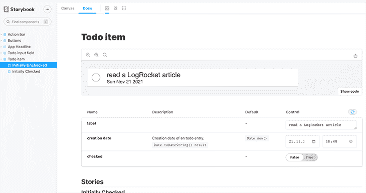

使用`InitiallyUnchecked.argTypes`对象，我们可以提供额外的信息来更详细地描述故事。

```
InitiallyUnchecked.argTypes = {
  date: {
    name: "creation date",
    description: "Creation date of an todo entry.",
    table: {
      type: { summary: "Date.toDateString() result" },
      defaultValue: { summary: "Date.now()" },
    },
    control: "date",
  },
};

```

在这个例子中使用了`name`、`description`和`table`属性来为所谓的 [ArgsTable](https://storybook.js.org/docs/react/writing-docs/doc-blocks#argstable) 提供更多信息。

## 高级控件的更多使用案例

下面的屏幕截图显示了可用控件的[概述](https://storybook.js.org/docs/react/essentials/controls#annotation)以及它们如何映射到数据类型。

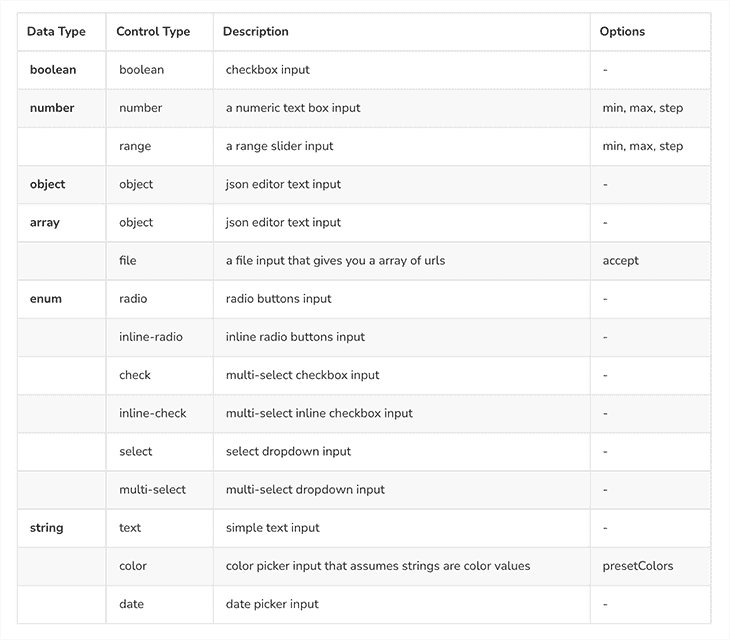

### 单选按钮示例

我们看到的第二个故事，最初是被检查的，与前一个故事的不同之处在于**被检查的**控件是如何实现的。

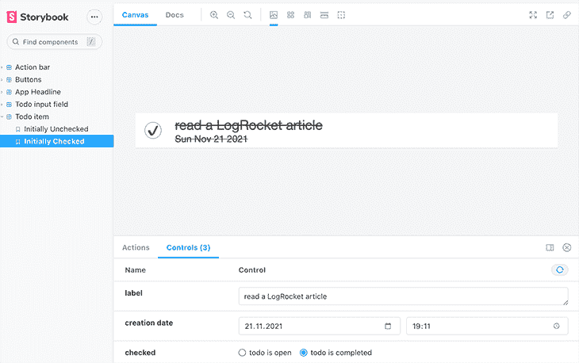

这个故事的 checked 控件的实现演示了如何使用数据类型 enum，以及如何将它映射到带有自定义标签的`inline-radio`控件类型。

```
// src/stories/TodoItem.stories.jsx
// ...
export const InitiallyChecked = InitiallyUnchecked.bind({});
InitiallyChecked.argTypes = {
  ...InitiallyUnchecked.argTypes,
  checked: {
    options: ["openTodo", "completedTodo"],
    mapping: {
      openTodo: false,
      completedTodo: true,
    },
    control: {
      // Type 'select' is automatically inferred when 'options' is defined
      type: "inline-radio", 
      labels: {
        openTodo: "todo is open",
        completedTodo: "todo is completed",
      },
    },
  },
};
InitiallyChecked.args = {
  ...InitiallyUnchecked.args,
  checked: "completedTodo",
};

```

首先，我们定义一个新的、名为 export 的，通过用 [Storybook 的首选技术](https://storybook.js.org/docs/react/writing-stories/introduction#using-args) ( `InitiallyUnchecked.bind({})`)克隆前一个故事来创建一个新故事。

我们自定义控件的目标是将单选按钮值映射到布尔值，这些值作为`checked`属性传递给`TodoItem`组件。因此，我们需要一个`options`、`mapping`和`labels`的组合来实现这一点。重要的是枚举(`options`)的字符串值与属性键`mapping`和`labels`匹配。

`options`和`mapping`足以初始化自定义控件。然而，如果不设置`type: "inline-radio"`，Storybook 将呈现默认控件(**选择**)。如果我们不提供`labels`对象，那么`options`的字符串值将被用作单选按钮的标签。

在`args`对象(`checked: "completedTodo"`)的帮助下为单选按钮提供一个初始值也很重要，否则，两个单选按钮都不会被选中。

### 选择框示例

第二个故事——因其动作栏而名为 Interactive——演示了另外两个控件。正如您在下一个截图中看到的，我添加了一个名为“todos 列表”的控件，其数据类型为 object。Storybook 推断出控件类型为`object`，因此呈现了一个 JSON 编辑器控件。

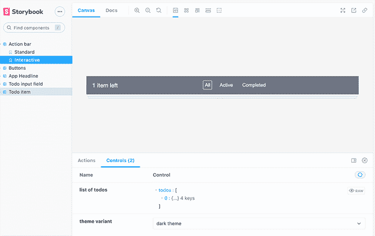

这是向组件提供交互数据的另一种更具技术性的方式。根据用例以及用户类型，这种控制可能是合适的。

如果你的故事被没有开发背景的利益相关者使用，这个“JSON 控件”可能不太好用。例如，一个不太灵活的下拉控件可能更合适，它允许用户从几个值中进行选择，以展示相关的用例。

为了找到关于这个`Action bar`组件的“标准”故事的更多信息，请看一下配套项目的源代码。

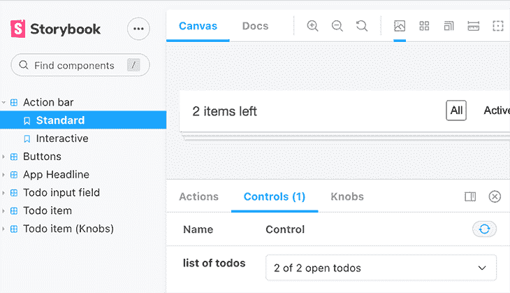

但是，对于“JSON 控件”我们需要将控件类型设置为“object”`Interactive.argTypes.todos`。为了设置初始值，我们将 todos 列表分配给`Interactive.args.todos`。

```
export const Interactive = (args) => (
  <ActionBarWithProvider {...args} {...ctxProps} />
);
Interactive.argTypes = {
  todos: {
    name: "list of todos",
    description: "Status component shows number of unchecked todos.",
    control: { type: "object" },
  },
  theme: {
    name: "theme variant",
    description:
      "There exists a dark and light theme with different background and foreground colors.",
    options: ["light", "dark"],
    mapping: {
      light: theme.LIGHT,
      dark: theme.DARK,
    },
    control: {
      type: "select",
      labels: {
        light: "light theme",
        dark: "dark theme",
      },
    },
  },
};
Interactive.args = {
  todos: [
    {
      id: Date.now(),
      date: new Date(Date.now()).toDateString(),
      label: "a todo",
      checked: false,
    },
  ],
  theme: "dark",
};

```

让我们来看第二个名为“主题变体”的控件。提醒一下，主题可以设置为上下文值，所以我们需要提供一个带有`theme`键的 arg。

```
// src/Todos.jsx
// ...
<AppContext.Provider
      value={{
        todos,
        setTodos,
        filterIndex,
        setFilterIndex,
        theme: theme.LIGHT,
        translation,
      }}
    >
    // ...
</AppContext.Provider>

```

为了配置选择控件来切换主题变量，我们再次利用`options`、`mapping`和`control.labels`作为`Interactive.argTypes.theme`对象的属性。我们可以省略`control.type`，因为“选择”是默认的。用`Interactive.args.theme`设置控制的初始值。

## 控制和旋钮的区别

你可能不知道，但故事书[旋钮](https://github.com/storybookjs/addon-knobs)已经被弃用，取而代之的是控制。根据这个[讨论](https://github.com/storybookjs/storybook/discussions/15060)，控件相对于旋钮最大的优点是基于`args`，所以 Storybook 可以推断信息来渲染控件。

然而，仍然有可能需要旋钮的用例，例如，在 TypeScript 项目中存档类型安全和 IDE 支持。根据上面链接的相同讨论，Storybook 正在努力消除这些缺点。

为了给你一个区别的概念，这里有一个旋钮的例子:`TodoItemKnobs.stories.jsx`，与我们已经用控件`TodoItem.stories.jsx`实现的用例相同。

```
// src/stories/TodoItemKnobs.stories.jsx
import TodoItem from "../TodoItem";
import { withKnobs, text, boolean, date } from "@storybook/addon-knobs";
import {
  StorySpecificContainer,
  StyleAndContextProvider,
  commonStoryContainerWidth,
} from "./storyHelper";

export default {
  component: TodoItem,
  title: "Todo item (Knobs)",
  decorators: [withKnobs],
};

const exampleTodo = {
  id: 1,
  date: new Date(Date.now()).toDateString(),
  label: "hello",
  checked: false,
};

const TodoItemWithProvider = (ctxValues) => (
  <StyleAndContextProvider {...ctxValues}>
    <StorySpecificContainer styles={{ width: commonStoryContainerWidth }}>
      <TodoItem
        todo={{
          ...exampleTodo,
          date: new Date(date("creation date", new Date())).toDateString(),
          label: text("label", "a todo"),
          checked: boolean("checked", false),
        }}
      />
    </StorySpecificContainer>
  </StyleAndContextProvider>
);
// provide context to prevent crashes in event handlers
const ctxProps = {
  todos: [{ ...exampleTodo }],
  setTodos: () => {
    // mock impl
  },
};
export const InitiallyUncheckedKnobs = () => (
  <TodoItemWithProvider {...ctxProps} />
);

```

上面的代码在的[旋钮的帮助下，从`TodoItem.stories.jsx`开始实现了同样的故事，最初没有检查。要让它运行，我们首先要安装插件。](https://github.com/storybookjs/addon-knobs)

```
$ npm i -D @storybook/addon-knobs

```

与控件的主要区别在于，有了旋钮，代码更加明确，这意味着你必须使用更多的 API 函数。

```
import { withKnobs, text, boolean, date } from "@storybook/addon-knobs";

```

在我们的例子中，我们想要创建三个旋钮；因此，我们导入了三种数据类型——`text`、`boolean`和`date`——分别呈现文本输入、复选框和日期选择器。`withKnobs`函数也很重要，因为我们必须向故事的默认导出添加一个装饰器。

```
export default {
  component: TodoItem,
  title: "Todo item (Knobs)",
  decorators: [withKnobs],
};

```

与控件相反，这个故事是在没有`args`的情况下编写的，因此命名导出的函数没有参数。

```
export const InitiallyUncheckedKnobs = () => (
  <TodoItemWithProvider {...ctxProps} />
);

```

另一个区别是，我们不向 React 组件传递数据(以及初始值)。相反，我们必须借助上面导入的数据类型函数在组件内部计算它们。

```
const TodoItemWithProvider = (ctxValues) => (
  // ...
      <TodoItem
        todo={{
          ...exampleTodo,
          date: new Date(date("creation date", new Date())).toDateString(),
          label: text("label", "a todo"),
          checked: boolean("checked", false),
        }}
      />
  // ...
);

```

函数的第一个参数构成旋钮的标签，第二个参数提供初始值。

## 结论

本文关注故事书控件。经过短暂的上升时间后，`args`和`argTypes`的原理很快变得清晰。由于[约定优于配置](https://en.wikipedia.org/wiki/Convention_over_configuration)的概念，开发控件不需要大量代码。正如您在上一节中看到的，使用旋钮并不能带来推断数据类型的好处——因此，每个旋钮都需要借助数据类型函数来显式实现。

在我看来，从长远来看，控制方法对于更大的项目来说更具伸缩性。

本文中展示的例子集中在一个小但真实的用例上，以展示大多数数据类型和控件类型。如果你还需要更多的灵感，请随时查看提供更多故事的[配套项目](https://github.com/doppelmutzi/companion-project-react-storybook)。

## [LogRocket](https://lp.logrocket.com/blg/react-signup-general) :全面了解您的生产 React 应用

调试 React 应用程序可能很困难，尤其是当用户遇到难以重现的问题时。如果您对监视和跟踪 Redux 状态、自动显示 JavaScript 错误以及跟踪缓慢的网络请求和组件加载时间感兴趣，

[try LogRocket](https://lp.logrocket.com/blg/react-signup-general)

.

[ ](https://lp.logrocket.com/blg/react-signup-general) [](https://lp.logrocket.com/blg/react-signup-general) 

LogRocket 结合了会话回放、产品分析和错误跟踪，使软件团队能够创建理想的 web 和移动产品体验。这对你来说意味着什么？

LogRocket 不是猜测错误发生的原因，也不是要求用户提供截图和日志转储，而是让您回放问题，就像它们发生在您自己的浏览器中一样，以快速了解哪里出错了。

不再有嘈杂的警报。智能错误跟踪允许您对问题进行分类，然后从中学习。获得有影响的用户问题的通知，而不是误报。警报越少，有用的信号越多。

LogRocket Redux 中间件包为您的用户会话增加了一层额外的可见性。LogRocket 记录 Redux 存储中的所有操作和状态。

现代化您调试 React 应用的方式— [开始免费监控](https://lp.logrocket.com/blg/react-signup-general)。