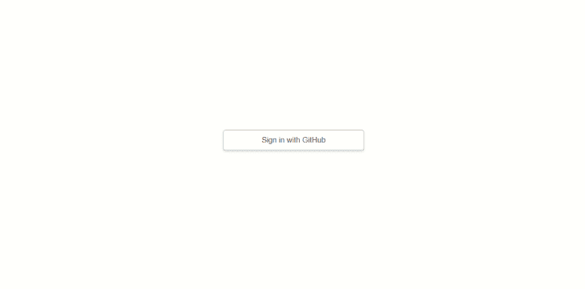
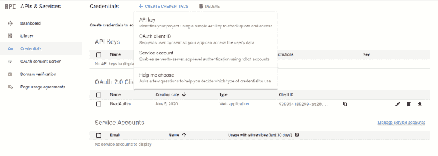
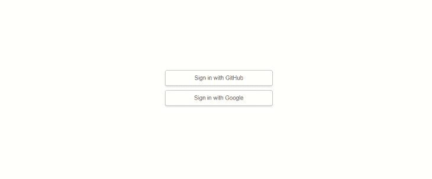
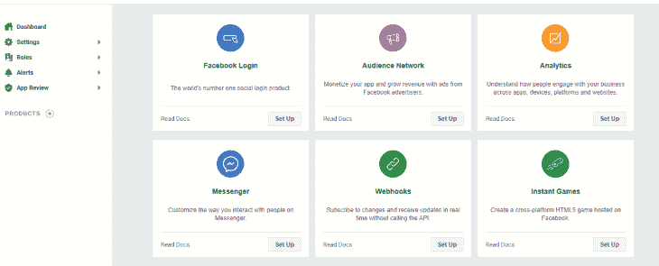
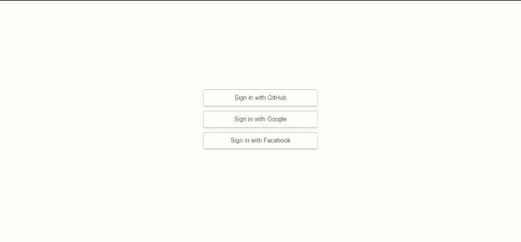

# Next.js | LogRocket 博客中用于客户端身份验证的 NextAuth.js

> 原文：<https://blog.logrocket.com/nextauth-js-for-next-js-client-side-authentication/>

***编者按:**本指南最后一次更新是在 2022 年 3 月 8 日，以反映 NextAuth.js v4 中引入的变更。*

在应用程序中，身份验证是一项重要而敏感的功能，在这些应用程序中，用户的凭据(如用户名、电子邮件和密码)将被验证，以确认用户是否是他们所声称的身份。

这是一种询问用户是谁，然后接收证据以验证其身份的方式。系统获取用户提供的凭证，并检查它们是否有效。

在本文中，我们将带您了解如何使用一个名为 [NextAuth.js](https://next-auth.js.org/) 的强大而安全的库，在 [Next.js](https://nextjs.org/) 中设置不需要密码的客户端身份验证。

在这篇文章结束时，你将已经创建了一个带认证的应用程序，你的用户将能够使用他们的 GitHub、Google 和脸书帐户登录。注册成功后，我们将显示用户的个人资料图片和电子邮件，我们将从他们的社交媒体帐户中检索。

我们将利用 React 挂钩和功能组件来构建我们的应用程序。但是在我们深入探讨之前，让我们先来看看我们将要使用的两个主要工具。

## Next.js 是什么？

Next.js 是一个构建在 React 之上的框架，它使得开发生产就绪、完全优化的 React 应用程序变得超级快速和简单。这是 React 生态系统中最好的东西之一，因为它在零配置的情况下提供了大量的功能。

Next.js 被网飞、Tiktok 和耐克等顶级公司用于生产。它非常容易学习，尤其是如果你熟悉 React 的话。

## 什么是 NextAuth.js？

NextAuth.js 是一个完全安全的身份验证解决方案，用于在 Next.js 应用程序中实现身份验证。这是一个灵活的身份验证库，旨在与任何 OAuth 服务同步，完全支持无密码登录。

它可以在有或没有数据库的情况下使用，并且默认支持流行的数据库，如 MySQL、MongoDB、PostgreSQL 和 MariaDB。

通过与 OAuth 和 JSON Web Token 等服务同步，它可以在没有数据库的情况下使用。

## NextAuth.js 是如何工作的？

有了 NextAuth.js 这样的库，您不需要像使用 OAuth 构建安全的 Next.js 应用程序那样成为身份协议方面的专家。构建 NextAuth.js 是为了避免存储敏感数据，比如用户密码。它与 Next.js 配合得非常好。只需 20 行代码，您就可以在应用程序中实现身份验证功能。

NextAuth.js 有一个客户端 API，您可以使用它与应用程序中的会话进行交互。从[提供者](https://next-auth.js.org/configuration/providers)返回的会话数据包含用户负载，这可以在用户成功登录时显示给用户。

返回给客户端的会话数据如下所示:

```
{
  expires: '2055-12-07T09:56:01.450Z';
  user: {
        email: '[email protected]';
        image: 'https://avatars2.githubusercontent.com/u/45228014?v=4';
        name: 'Ejiro Asiuwhu';
    }
}

```

注意负载不包含任何敏感数据。会话负载或数据是为了表示的目的，也就是说，它是为了显示给用户的。

NextAuth.js 提供了`useSession()` React 钩子，可以用来检查用户登录状态。同时，NextAuth.js 提供了 React 应用程序使用的 REST API。要了解更多关于 REST API NextAuth exposes 的信息，请查看[官方文档](https://next-auth.js.org/getting-started/rest-api)。

## 要求

*   本地计算机上安装的 Node.js 10.13 或更高版本
*   [React.js](http://reactjs.org/) 基础知识

## 创建 Next.js starter 应用程序

我为你创建了一个 starter Next.js 项目，你可以跟着做。首先，将这个[库](https://github.com/ejirocodes/Nextjs_Authentication)分支到您自己的 GitHub 帐户并克隆它。

```
git clone https://github.com/<your-Github-username>/Nextjs_Authentication.git

```

该项目包括两个分支:`starter`和`complete`。查看`starter`分支机构，开始行动。但是，如果您想看到完成的代码，请查看`complete`分支。

克隆存储库后，导航到工作目录:

```
cd Nextjs_Authentication

```

starter 项目最初是用 React v17.0.1 创建的。为了避免在安装 next-auth 时出现任何问题，请更新`package.json`以升级`react`和`react-dom`:

```
"dependencies": {
    "next": "10.0.1",
    "react": "^17.0.2",
    "react-dom": "^17.0.2"
  }

```

然后，安装 Next.js 依赖项:

```
npm i
# or
yarn install

```

您应该已经在`starter`分支上，但是，如果不是这样，请使用以下命令:

```
git checkout starter

```

启动开发服务器:

```
npm run dev
# or
yarn run dev

```

默认情况下，项目将在端口 3000 上运行。启动浏览器并导航至`[http://localhost:3000](http://localhost:3000)`。您应该得到这样的结果:


Starter project.

## 使用 NextAuth.js 设置身份验证

现在我们已经设置了 Next.js starter 应用程序，我们准备学习如何使用 NextAuth.js 认证 Next.js 应用程序。

本 NextAuth.js 客户端认证教程将涵盖以下内容:

### 安装 NextAuth.js

`next-auth`是一个 npm 软件包，因此安装它将轻而易举:

```
npm i next-auth
# or
yarn add next-auth

```

成功安装后，`next-auth`将被添加到您的`package.json`文件中的依赖项中:

```
//Dependencies in package.json
"dependencies": {
  "next": "10.0.1",
  "next-auth": "^4.2.1",
  "react": "^17.0.2",
  "react-dom": "^17.0.2"
}

```

我们将让用户选择使用他们的 GitHub、谷歌或脸书帐户登录我们的应用程序。

## [H3]创建 GitHub OAuth 应用程序

接下来，我们将添加一个 GitHub 身份验证提供者，它本质上允许用户使用他们的 GitHub 帐户登录我们的应用程序。但是首先，我们需要创建一个 [GitHub OAuth 应用](https://github.com/settings/developers)。点击**新 OAuth 应用**，并相应填写表格。查看[官方文件](https://docs.github.com/en/free-pro-team@latest/developers/apps/creating-an-oauth-app)了解更多信息。

*   **应用程序名称**:这是您的应用程序的名称。它可以被称为任何东西——这并不重要
*   **主页网址**:这是我们应用程序主页的完整网址。由于我们仍处于开发模式，我们将填写运行开发服务器的完整 URL。在这种情况下，它是`[http://localhost:3000](http://localhost:3000)`
*   **授权回调 URL** :这是我们的用户成功登录我们的应用后，GitHub 将重定向到的 URL。应该是你的主页网址加上`/api/auth/callback`，产生`[http://localhost:3000/api/auth/callback](http://localhost:3000/api/auth/callback)`

在我们的 OAuth 应用程序注册之后，GitHub 专门为我们新创建的应用程序创建了一个客户端 ID 和客户端密码。将客户端 ID 和密钥复制到剪贴板。点击**生成新的客户端密码**并获得一个客户端密码。

#### 添加环境变量

接下来，在项目的根目录下创建一个`.env.local`文件。Next.js 内置了对环境变量的支持，`.env.local`会将这些变量加载到`process.env`中。因此，文件名不能是随机名称。要了解更多信息，请阅读 [Next.js 关于环境变量](https://nextjs.org/docs/basic-features/environment-variables)的文档。

接下来，用以下内容填充它:

```
GITHUB_ID=<client id of your github auth app should go in here>
GITHUB_SECRET=<client secret of your github app should go in here>
NEXTAUTH_URL=http://localhost:3000
/pre>
```

> `[NEXTAUTH_URL]([https://next-auth.js.org/configuration/options](https://next-auth.js.org/configuration/options))`是我们应用的网址。确保使用运行开发服务器的端口。

现在，回到我们的应用程序。我们将在`pages/api/auth`中创建一个名为`[...nextauth].js`的文件，并添加以下代码:

```
import NextAuth from 'next-auth'
import GitHubProvider from "next-auth/providers/github";

const options = {
    providers: [
        GitHubProvider({
            clientId: process.env.GITHUB_ID,
            clientSecret: process.env.GITHUB_SECRET
        }),
    ],
}

rest apiexport default (req, res) => NextAuth(req, res, options)

```

在第 1 行，我们正在导入 NextAuth，这是我们的主包。在第 2 行，我们从`next-auth`库导入了我们的 [GitHub 提供者](https://next-auth.js.org/providers/github)，这些服务可以集成到我们的应用程序中，允许用户登录。

在第 6 行，我们正在配置 GitHub 提供者，并通过环境变量传递 GitHub 秘密和客户端 ID。最后，在第 13 行，我们导出了一个函数，该函数返回 NextAuth 并接受 options 变量作为第三个参数。

好吧，奇迹已经发生了。如果我们利用由`next-auth`提供的 [REST API](https://next-auth.js.org/getting-started/rest-api) ，我们可以使用我们的 GitHub 账户登录我们的应用。导航到`[http://localhost:3000/api/auth/signin](http://localhost:3000/api/auth/signin)`，您应该会看到这个👇🏽



Sign in with GitHub activated.

遵循流程，然后 shazam！您已登录。接下来，我们需要保存并显示用户登录状态。

#### 用`useSession()`钩检查用户登录状态

我们需要获得用户的登录状态，并在应用程序的前端呈现用户的详细信息。这可以通过使用名为[自定义应用](https://nextjs.org/docs/advanced-features/custom-app)的 Next.js 特性轻松实现。然后，我们将把组件包装在一个提供者中。

在您的`pages`目录中创建一个`_app.js`文件(如果它还不存在)并添加以下代码:

```
import { SessionProvider } from "next-auth/react"
import '../styles/globals.css'

function MyApp({ Component, pageProps }) {
  return (
    <SessionProvider session={pageProps.session}>
      <Component {...pageProps} />
    </SessionProvider>
  )
}

export default MyApp

```

通过将组件包装在一个`Session``Provider`中，我们可以在页面之间共享会话状态。反过来，这将在页面导航期间保持我们的状态，提高性能，并减少网络流量。

接下来，打开`components/Header.js`文件，从`next-auth/client`导入`useSession`、`signIn`和`signOut`:

```
import { useSession, signIn, signOut } from 'next-auth/react'

```

`useSession`将用于管理我们用户的登录和注销状态，而`signIn`和`signOut`将用于执行我们应用程序中的登录和注销功能。

让我们利用`useSession`钩子:

```
 const { data: session } = useSession();

```

该会话将返回用户的详细信息。让我们使用返回的详细信息有条件地呈现一个登录和注销按钮。

用以下代码替换`components/Header.js`中 return 语句中的所有内容:

```
 <div className='header'>
      <Link href='/'>
        <a className='logo'>NextAuth.js</a>
      </Link>
           {session && <a href="#" onClick={handleSignout} className="btn-signin">Sign out</a>  } 
           {!session && <a href="#" onClick={handleSignin}  className="btn-signin">Sign in</a>  } 
    </div>

```

我们需要创建`handleSignin`和`handleSignout`方法，使我们的用户能够登录和注销:

```
const handleSignin = (e) => {
      e.preventDefault()
      signIn()
  }    
const handleSignout = (e) => {
      e.preventDefault()
      signOut()
    }

```

您的`Header.js`现在应该是这样的:

```
import Link from 'next/link'
import { useSession, signIn, signOut } from 'next-auth/react'

export default function Header () {
  const { data: session } = useSession();

  const handleSignin = (e) => {
    e.preventDefault()
    signIn()
  }

  const handleSignout = (e) => {
    e.preventDefault()
    signOut()
  }

  return (
    <div className='header'>
      <Link href='/'>
        <a className='logo'>NextAuth.js</a>
      </Link>
      {session && <a href="#" onClick={handleSignout} className="btn-signin">Sign out</a>  }
      {!session && <a href="#" onClick={handleSignin}  className="btn-signin">Sign in</a>  }
    </div>
  )
}

```

使用标题按钮随意登录和退出应用程序。

#### 检索和显示用户信息

现在，进入我们的`pages/index.js`。我们需要根据用户的登录信息显示并有条件地呈现用户信息。首先，我们必须从`next-auth`进口`useSession`钩子。

所以，用下面的内容替换你的`index.js`:

```
import Head from 'next/head'
import Header from '../components/Header'
import styles from '../styles/Home.module.css'
import { useSession } from 'next-auth/react'

export default function Home() {
  const { data: session, status } = useSession()
  const loading = status === "loading"

  return (
    <div className={styles.container}>
      <Head>
        <title>Nextjs | Next-Auth</title>
        <link rel="icon" href="/favicon.ico" />
      </Head>
      <Header />
      <main className={styles.main}>
        <h1 className={styles.title}>Authentication in Next.js app using Next-Auth</h1>
        <div className={styles.user}>
           {loading && <div className={styles.title}>Loading...</div>}
           {
            session &&
              <>
               <p style={{ marginBottom: '10px' }}> Welcome, {session.user.name ?? session.user.email}</p> <br />
               
              </>
            }
           {
            !session &&
              <>
               <p className={styles.title}>Please Sign in</p>
               
               <p className={styles.credit}>GIF by <a href="https://dribbble.com/shots/6915953-Another-man-down/attachments/6915953-Another-man-down?mode=media">Another man</a> </p>
              </>
           }
         </div>
      </main>
    </div>
  )
}

```

在这段代码中，如果用户登录到我们的应用程序，我们将使用会话状态中的数据有条件地呈现用户的图像、姓名和照片。如果用户没有登录，我们会显示一个虚拟的 GIF，其中包含指示他们登录的文本。

### 创建一个谷歌 OAuth 应用

为了允许用户使用他们的 Google 帐户登录我们的应用程序，我们必须从 [Google API 控制台](https://console.developers.google.com/)获取 OAuth 2.0 客户端凭证。导航到 **C** *凭证，点击**创建凭证**，然后点击 **OAuth 客户端 ID** :*

*

Create Google OAuth client ID.

您将被要求填写以下内容:

*   **选择应用类型**:选择 **Web 应用**
*   **名称**:这是您的应用程序的名称
*   **授权的 JavaScript 起源**:这是我们应用程序主页的完整 URL。由于我们仍处于开发模式，我们将填写运行开发服务器的完整 URL。在这种情况下，它是`[http://localhost:3000](http://localhost:3000)`
*   **授权重定向 URIs** :用户通过谷歌认证后将被重定向到此路径:`[http://localhost:3000/api/auth/callback/google](http://localhost:3000/api/auth/callback/google)`

接下来，一个弹出窗口将显示您的客户端 ID 和客户端密码。将它们复制并添加到您的`env.local`文件中:

```
GOOGLE_ID=<client id of your google auth app should go in here>
GOOGLE_SECRET=<client secret of your google auth app should go in here>

```

接下来，导航到`pages/api/auth/[...nextauth].js`，将以下内容添加到您的提供商列表中:

```
import GoogleProvider from 'next-auth/providers/google';
...
   GoogleProvider({
      clientId: process.env.GOOGLE_ID,
      clientSecret: process.env.GOOGLE_SECRET,
    }),
...

```

您的`[...nextauth].js`现在应该是这样的:

```
import NextAuth from 'next-auth';
import GitHubProvider from 'next-auth/providers/github';
import GoogleProvider from 'next-auth/providers/google';

const options = {
    providers: [
        GitHubProvider({
            clientId: process.env.GITHUB_ID,
            clientSecret: process.env.GITHUB_SECRET
        }),
        GoogleProvider({
          clientId: process.env.GOOGLE_ID,
          clientSecret: process.env.GOOGLE_SECRET,
        }),
    ],
}

export default (req, res) => NextAuth(req, res, options)

```

要使用 Google 帐户测试用户登录，退出开发服务器并运行`npm run dev`。
现在，十指交叉，昂首挺胸，我们应该可以用我们的谷歌账户登录我们的应用了:



Sign in with Google activated.

### 创建脸书 OAuth 应用程序

要为我们的应用程序使用脸书登录，我们需要一个脸书开发者帐户。创建一个帐户，然后创建你的应用程序。对于应用类型，选择**消费者**。在详细信息屏幕中，选择一个显示名称。

完成后，您的屏幕应该如下所示:



Login options.

点击**脸书登录**并选择**网页**。现在，添加以下内容:

要获取您的应用 ID 和应用密码，请导航到**设置**中的**基本**部分，复制它们，并将其添加到您的`env.local`文件中，如下所示:

```
FACEBOOK_ID=<app id of your facebook app should go in here>
FACEBOOK_SECRET=<app secret of your facebook app should go in here>

```

> 不要忘记在**应用程序域**字段中添加`[http://localhost:3000/](http://localhost:3000/)`。

接下来，导航到`pages/api/auth/[...nextauth].js`，将以下内容添加到您的提供商列表中:

```
import FacebookProvider from 'next-auth/providers/facebook';
...
    FacebookProvider({
            clientId: process.env.FACEBOOK_ID,
            clientSecret: process.env.FACEBOOK_SECRET
      })
...

```

您的`[...nextauth].js`现在应该是这样的:

```
import NextAuth from 'next-auth';
import GitHubProvider from 'next-auth/providers/github';
import GoogleProvider from 'next-auth/providers/google';
import FacebookProvider from 'next-auth/providers/facebook';

const options = {
    providers: [
        GitHubProvider({
            clientId: process.env.GITHUB_ID,
            clientSecret: process.env.GITHUB_SECRET
        }),
        GoogleProvider({
          clientId: process.env.GOOGLE_ID,
          clientSecret: process.env.GOOGLE_SECRET,
        }),
        FacebookProvider({
          clientId: process.env.FACEBOOK_ID,
          clientSecret: process.env.FACEBOOK_SECRET
        }),
    ],
}

export default (req, res) => NextAuth(req, res, options)

```

重启开发服务器后，用户应该能够使用他们的 GitHub、Google 和脸书帐户登录到您的 Next.js 应用程序:



Sign in with Facebook activated.

## 结论

在这篇文章中，我们使用 NextAuth.js 在 Next.js 中实现了用户认证，这是一个安全的库，用于识别我们的用户，获取用户配置文件信息，并在我们的前端呈现它们。我们已经介绍了大部分用例，但是您还可以使用 NextAuth.js 做更多的事情。您可以使用 JSON Web Token、安全页面等等来添加数据库。

如果你渴望了解更多内容，请查看 NextAuth.js 官方文档中的[教程页面](https://next-auth.js.org/tutorials)。

请在下面的评论区告诉我你对本教程的看法。你也可以通过 [Twitter](https://twitter.com/ejirocodes) 和 [GitHub](https://github.com/ejirocodes) 联系我。感谢您的阅读，敬请关注。

## [LogRocket](https://lp.logrocket.com/blg/nextjs-signup) :全面了解生产 Next.js 应用

调试下一个应用程序可能会很困难，尤其是当用户遇到难以重现的问题时。如果您对监视和跟踪状态、自动显示 JavaScript 错误、跟踪缓慢的网络请求和组件加载时间感兴趣，

[try LogRocket](https://lp.logrocket.com/blg/nextjs-signup)

.

[](https://lp.logrocket.com/blg/nextjs-signup)[](https://lp.logrocket.com/blg/nextjs-signup)

LogRocket 就像是网络和移动应用的 DVR，记录下你的 Next.js 应用上发生的一切。您可以汇总并报告问题发生时应用程序的状态，而不是猜测问题发生的原因。LogRocket 还可以监控应用程序的性能，报告客户端 CPU 负载、客户端内存使用等指标。

LogRocket Redux 中间件包为您的用户会话增加了一层额外的可见性。LogRocket 记录 Redux 存储中的所有操作和状态。

让您调试 Next.js 应用的方式现代化— [开始免费监控](https://lp.logrocket.com/blg/nextjs-signup)。*