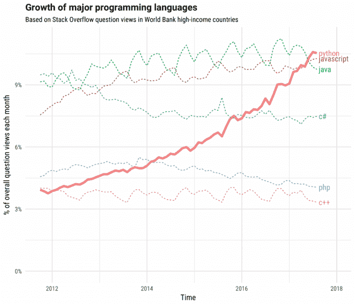
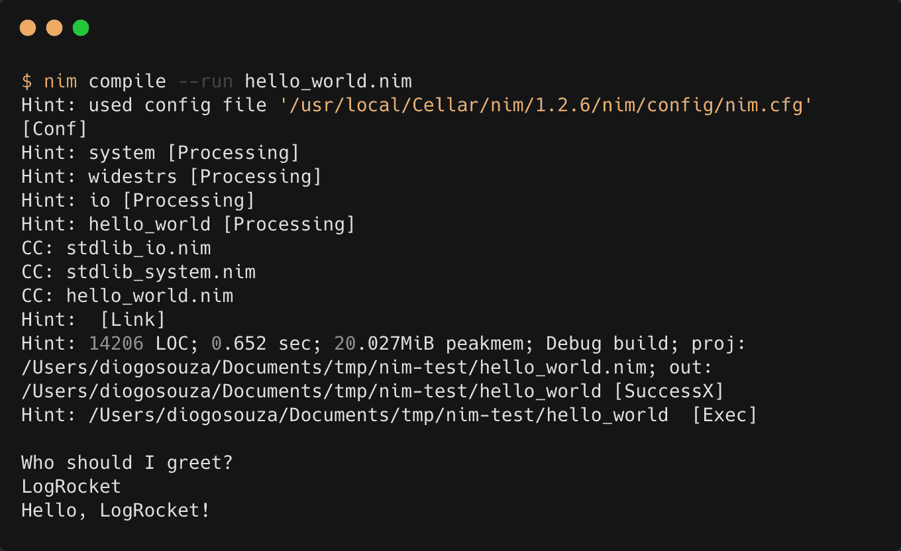
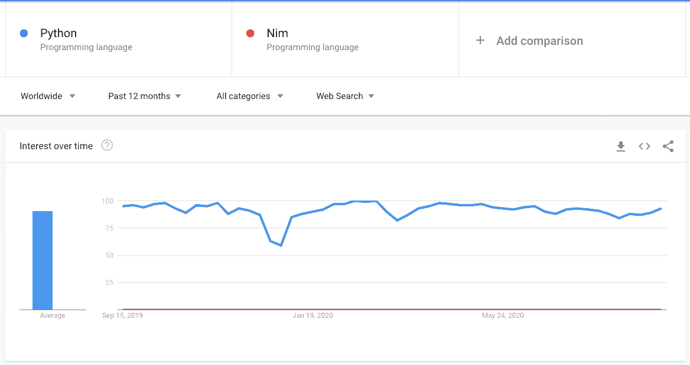

# Nim vs Python:你该选哪个？

> 原文：<https://blog.logrocket.com/nim-vs-python-which-should-you-choose/>

与过去不同，现在新编程语言的发展速度非常快。很难保持这个速度。

乍一看， [Nim](https://nim-lang.org/) 似乎是无数选择中的另一种语言，但事实并非如此。

根据官方文档，“Nim 是一种静态类型的编译系统编程语言”。不仅如此，Nim 也是结合了来自 [Python](https://www.python.org/) 、 [Ada](https://www.adacore.com/about-ada) 和 [Modula](https://www.modula2.org/index.php) 的成功特性而诞生的。

大多数人可能不知道最后两个，但是 Python 是脚本领域公认的王者。那么，Nim 有可能成为 Python 的新替代品吗？还是两种语言针对不同的受众？

本文旨在通过更深入地理解这两种语言的优缺点以及每种语言的独特之处来解决这些问题。让我们开始吧！

## 计算机编程语言

Python 是由荷兰程序员吉多·范·罗苏姆在 80 年代创建的，用 C 语言(不是什么)编写，它的诞生是为了拥抱脚本世界。

Python 在早期被大学、科学家和 shell 开发人员大量采用，它给这个充斥着 Pascal、C、C++和 Lisp 等语言的世界带来了简单性的新概念。

它的成功是如此巨大，以至于 Python 现在是所有语言中使用最多和最受欢迎的语言之一。

根据 Stack Overflow，看看它与其他非常流行的编程语言相比的增长情况:



来源:[Python 不可思议的成长](https://stackoverflow.blog/2017/09/06/incredible-growth-python/)

那么，让我们分析一下 Python 如此受欢迎的一些主要原因。

### Python 的优点

在众多因素中，也许最重要的是它的多功能性。Python 易于使用，易于阅读，编码速度非常快。而且是跨平台的！

在创建的时候，一个简单的 Hello World 程序就已经表明了它的简单性，就像 Python 和 Pascal 之间的比较一样:

```
// Hello World in Pascal
program Hello;
begin
  writeln ('Hello, world.');
end.

// Hello World Python
print("Hello, world.")
```

显然，这不足以描述使语言如此简单的所有机制——这更像是一个起点。

Python 有一个最有活力和参与度的 one 社区。数以千计的开源库、工具和框架都是由真正热爱这门语言的人开发的，并尽他们所能为之做出贡献。例如，这与我们在 JavaScript 社区中看到的非常相似。

相比之下，在撰写本文时，Stack Overflow 在其论坛上总共有 150 万个关于 Python 的问题。与尼姆相比，它是一个神，因为关于尼姆·朗的[问题只有 400 个。](https://stackoverflow.com/questions/tagged/nim-lang)

到目前为止，Python 是这场争论中的巨头。

去年，著名的 GitHub Octoverse(每年发布的关于 GitHub 存储库的统计数据汇编)将 Python 列为该平台开发者使用第二多的语言,首次超过了 Java:


来源: [Octoverse 顶级语言](https://octoverse.github.com/#top-languages)。

谈到数据科学和机器学习领域，Python 远远领先于其竞争对手，已经开发了一个丰富、独特和完整的环境，在这个环境中，任何具有基本编程技能的人都可以从头开始，并在任何时候获得巨大的成果。

在科学家中，它在 MATLAB、Scala 和 r。

让我们深入了解选择 Python 的其他一些好理由:

*   你想要一个过程化的编程风格吗？去吧。更喜欢面向对象？函数式编程？那也可以。Python 包含了所有这些
*   Python 有很多其他语言的解释器，比如 JavaScript。Net、Java 和微控制器
*   可获得的工作数量巨大，平均工资达到 10 万英镑(在美国)
*   游戏开发的绝佳选择，有大量的好工具，如 [pygame](https://www.pygame.org/) (一组用于编写游戏的 Python 模块)
*   教孩子如何编程的最佳赌注。通过像海龟这样的图形工具，事情可以变得更加直观
*   最后但同样重要的是，Python 有很好的文档记录。来吧，好好读读

### Python 的缺点

也许这种语言最著名的缺点是它的速度。几十项研究和测量已经认识到 Python 确实比许多其他流行的编程语言要慢。

因为它是一种解释型语言，所以在代码转换成机器代码之前，Python 需要做更多的工作来读取和“解释”代码。

除此之外，由于 GIL(全局解释器锁)导致的一个经典线程问题也在问题列表中。GIL 是一个互斥体，一次只允许一个线程。因此，如果你打算加载多线程程序，那么它们会比单线程程序运行得更慢。

最后，大多数主要语言都是有目的的，随着时间的推移，扩展到其他领域，比如移动开发。Python 还没有进化到很好地适应移动世界，例如，与 Java 和 JavaScript 相反。

Android 和 iOS，有他们支持的一套语言，不懂 Python。例如，即使你有像 Kivy 这样的跨平台库，它们也不代表全球移动开发市场的大部分。

然而，社区在 pydroid T1 和 T2 qpython T3 等项目上的努力给 python 移动开发的未来带来了更多的希望。

我将留给你一些来自社区的更流行的缺点:

*   Python 在运送和分发其软件方面有点复杂
*   由于大部分项目，因此，开发者仍然使用 Python 2，我们开始处理遗留代码库的大问题，这些代码库可能不会很快升级。版本 2 和版本 3 之间的语法差异很大，但没关系。这就是为什么我们首先要有版本控制。然而，从版本 2 继承的这种碎片化使事情变得有点困难
*   很多人仍然抱怨 Python 对函数式编程的支持。尽管这种语言包含了高阶函数和列表理解，但是在诸如尾部调用和 lambdas 等特性上还是有缺陷的
*   这种语言的设计将缩进作为定义代码块格式的因素，这被许多人认为是一个缺点。如果您来自其他传统语言，可能很难适应它，编码也很棘手

## 让我们来认识一下尼姆

在我们深入 Nim 的世界之前，由于它对大多数人来说是一门相当新的语言，我们先来看一个例子，包括它的设置。

### 设置和示例

在你的计算机上安装 Nim 有几种选择。由于每个操作系统的所有选项都依赖于单个命令，所以我将把这项任务留给您。你可以在这里找到正确的说明[。](https://nim-lang.org/install_unix.html)

安装完成后，运行`nim -v`命令检查是否一切顺利:


对于这个示例，代码示例将在 VS 代码 IDE 下开发。它对 Nim 有一个非常好的[扩展，增加了对 IDE 的语言支持。](https://marketplace.visualstudio.com/items?itemName=kosz78.nim)

选择您喜欢的文件夹，并在 VS 代码中打开它。然后，创建一个名为`hello_world.nim`的新文件(是的，不出所料，这是 Nim 的文件扩展名)，并将以下代码放入其中:

```
echo "Who should I greet?"
var name: string = readLine(stdin)
echo "Hello, ", name, "!"
```

如果你熟悉“hello worlds”，这对于你来说理解起来不会有问题。例如，如果您熟悉 Linux，那么您已经知道 echo 命令的作用。

这个命令是类似 Unix 的操作系统命令的等效版本，它输出作为参数传递的字符串。没什么大不了的。

就在下面，我们正在从控制台读取一些输入；然后，我们再次打印格式化的 hello 消息。

要运行该程序，请转到命令行并发出以下命令:

```
nim compile --run hello_world.nim
```

对于 Nim，由于它是一种编译语言，您需要首先通过编译命令编译代码并运行它。该命令还有一个简短版本，如下所示:

```
nim c -r hellow_world.nim
```

另一个有趣的事情是执行输出。在程序启动之前，您会看到一些打印到控制台的行:



看看以`std`开头的几行……这是 C++影响的标志。

### 尼姆的优点

与 Python 的速度相反，Nim 的执行速度很快。比 Python 快多了。探索编程语言性能的一个好方法是执行基准测试。

Python 有大量的基准测试。我们的问题在于 Nim，因为它远不如 Python 流行。

然而，我们可以找到今天由社区制定的两个很好的基准，它们可以让我们对两种语言之间的性能差异有所了解:Biofast 和 Kostya 的基准。

Biofast 是一个小型基准，用于评估生物信息学领域中一些常见任务的编程语言和实现的性能。它的基准测试基本上与处理大文件和运行许多不同语言的类似算法有关。

在下表中，您可以找到将 BED 文件(制表符分隔的文本文件)加载到内存中并通过 [cgranges 算法](https://github.com/lh3/cgranges)计算间隔的结果:

来源:https://github.com/lh3/biofast

为了简化结果，我删除了一些目录。看看 Nim 和 Python 在 CPU 时间和内存消耗上的区别。展示 c 只是为了比较，因为它的速度非常快。

也许 kostya 开发的基准更加完整和多样化。我们测试了 Base64、JSON 解析、内存分配和其他著名的算法。这些是 [Havlak 的循环查找器](https://github.com/kostya/benchmarks/blob/master/havlak)实现的结果:

| **语言** | **时间，秒** | **内存，MiB** | **能量，J** |
| --- | --- | --- | --- |
| 在 GCC 之前 | 十二点零五分零六分 | 485.71 ± 09.19 | 225.42 ± 01.38 |
| C++ | 15.06 00.11 | 178.24 00.05 | 235.89 03.36 |
| PyPy | 30.38 ± 00.50 | 664.47 ± 82.61 | 545.93 10.51 |
| 计算机编程语言 | 108.91 ± 00.28 | 403.83 ± 00.05 | 1896.41 ± 15.93 |

来源:https://github.com/kostya/benchmarks

令人难以置信的是，根据算法的性质，Nim 的速度甚至可以超过 C++，这很好地说明了 Nim 对项目性能的影响。

当谈到可执行文件时，Nim 提供了将可执行文件与其中包含的依赖项打包在一起的能力。这意味着，与 Python 不同，您不需要依赖安装在特定机器上的 Python。它将在不同的类 Unix 系统上执行，不需要担心链接中断。

除此之外，让我们列举一些其他的优点:

*   Nim 是通用的，这意味着它可以被编译成 C，C++，甚至 JavaScript
*   它还支持一个很好的特性:宏。这对机器学习开发非常有用
*   它有一个很棒的元编程设计。我们有泛型、模板和我们刚刚提到的宏
*   它的类型是严格的，这意味着 Nim 在编译时会检查你的代码
*   它也是多范例的，包含面向对象、函数式和命令式编程
*   提供内置的平滑异步支持

### 尼姆的缺点

当然，Nim 最大的缺点是它的受欢迎程度。在这篇文章之前，你可能从未听说过它。

例如，Nim(创建于 2008 年)比 Swift(创建于 2014 年)等其他著名语言更古老。尽管如此，Swift 目前的特点是堆栈溢出超过 277k 个问题。

在 Google Trends 上快速比较一下 Nim 和 Python，可以发现两者之间的巨大差距:



正因为如此，很难指出它的缺点。关于它的内容不多。除此之外，[官方文档](https://nim-lang.org/documentation.htm)相当不错，非常完整。

关于语法，一些开发人员认为 Nim 比 C 简单，但是与 Python 相比有点冗长。

其他一些缺点可以列举如下:

*   找工作根本不会是一个好的语言选择。除非你是在为自己的项目或某种科学工作而工作
*   虽然 GitHub 的问题得到了回应，但他们现在有 1.7k 的问题，而 Python 有 1.3k 的问题。然而，Python 似乎有更多的交互和贡献者(Nim 是 1310 对 551)
*   在 Nim 下做的大项目不像我们用 Python 做的那么多。如果你的项目是关键的，并且是帮助你在两者之间做出决定的主要因素，那么这可能会很棘手

## 结论

这篇文章不可能是关于这两种语言的全部讨论。所以，请分享你对这两种语言的想法和你目前为止的经历。

一些 Nim 开发人员表示，它更适合来自 C/C++背景并想学习脚本语言的人。也许对 Python 比较的好奇来自于两种语言都是脚本方面的参考。

也许如果 Nim 来自某个科技巨头的官方支持，比如 Google 的 Go，情况会有点不同。然而，一门语言不一定要大到让人喜爱、强大和有用。你只需要有足够的好奇心，然后开始行动。祝你好运！

## 使用 [LogRocket](https://lp.logrocket.com/blg/signup) 消除传统错误报告的干扰

[](https://lp.logrocket.com/blg/signup)

[LogRocket](https://lp.logrocket.com/blg/signup) 是一个数字体验分析解决方案，它可以保护您免受数百个假阳性错误警报的影响，只针对几个真正重要的项目。LogRocket 会告诉您应用程序中实际影响用户的最具影响力的 bug 和 UX 问题。

然后，使用具有深层技术遥测的会话重放来确切地查看用户看到了什么以及是什么导致了问题，就像你在他们身后看一样。

LogRocket 自动聚合客户端错误、JS 异常、前端性能指标和用户交互。然后 LogRocket 使用机器学习来告诉你哪些问题正在影响大多数用户，并提供你需要修复它的上下文。

关注重要的 bug—[今天就试试 LogRocket】。](https://lp.logrocket.com/blg/signup-issue-free)