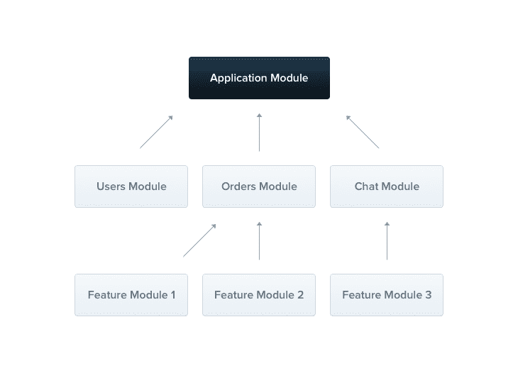
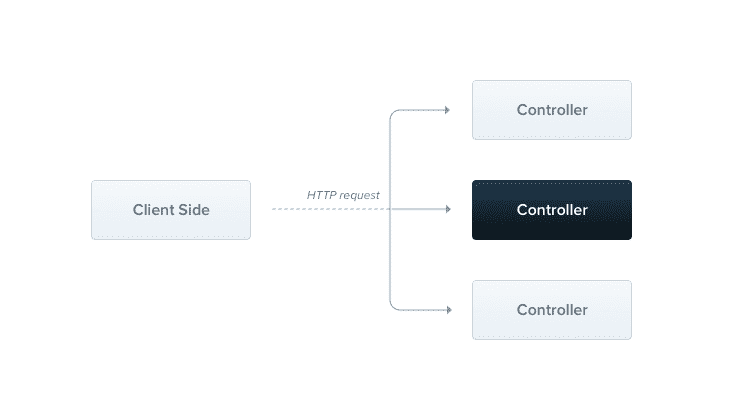
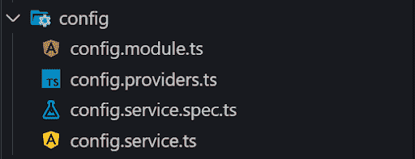

# 使用 NestJS - LogRocket 博客将您的节点后端提升到一个新的水平

> 原文：<https://blog.logrocket.com/node-back-end-next-level-nestjs/>

NestJS 是用于创建可伸缩应用程序的后端框架。它是底层 HTTP 服务器库的抽象。目前，它支持两个库——Express 和 Fastify——同时仍然允许开发人员在需要时使用他们自己的 API。

更重要的是，它通过引入类似 Angular 的模块、服务和控制器，迫使开发人员使用特定的架构，确保应用程序是可伸缩的、高度可测试的和松散耦合的。

Express、Koa 和 hapi 不强制任何特定的架构。当然，它们提供了一套底层工具，但仍有许多工作留给了开发人员。项目早期关于架构的错误可能会花费大量时间来重构代码库。

相反，Nest 对代码库——它的模块、服务和控制器——是严格的，你真的不能出错。

## 体系结构

作为一个团队在一个项目中工作意味着有很多关于应用程序应该如何构建的偏好。所有这些被强加到一个代码库中的偏好不会提供任何增强。反而会造成乱七八糟，整体代码质量差。

为了解决这个问题，Nest 通过定义团队中每个开发人员都必须遵循的自以为是的架构，提供了一套标准化的指导方针。结果是一个易于维护的代码库。

Nest 通过引入一些简单的构建模块，抽象出了与 Express 或 Fastify 等底层库的所有交易，其中最重要的是模块、服务和控制器。



模块封装了与给定领域相关的所有逻辑。假设我们需要实现与用户相关的逻辑。我们可以创建一个包含`UserService`、`UserController`的`UserModule`。

模块本身只是一个用`@Module` decorator 修饰的类，其中我们提供了所有必要的元数据。如果我们想从其他模块中访问模块的给定部分，我们可以在`exports`数组中导出该部分。

以下是来自官方文档的`CatModule`:

```
import { Module } from '@nestjs/common';
import { CatsController } from './cats.controller';
import { CatsService } from './cats.service';

@Module({
  controllers: [CatsController],
  providers: [CatsService],
  exports: [CatsService]
})
export class CatsModule {}
```

一个典型的应用程序将拥有诸如`ApplicationModule`(根模块)、`SharedModule`(它将进一步封装所有底层的可重用的、跨应用程序的模块)，以及，像上面提供的那样，将封装公共 API 的逻辑的模块。

点击阅读更多关于 [NestJS 模块的信息。](https://docs.nestjs.com/modules)

### 控制器

控制器是一个用`@Controller`装饰器标注的类。控制器充当传入 HTTP 请求和处理它的相应逻辑之间的一层。我们可以把控制器看作一个中间人:它检查传入的请求并调用适当的服务方法。



控制器定义路由路径、参数、响应以及与 HTTP 请求相关的一切。他们不关心请求和响应之间发生了什么。

```
@Controller('cats')
export class CatsController {
  @Post()
  create(@Body() createCatDto: CreateCatDto) {
    return 'This action adds a new cat';
  }

  @Get()
  findAll(@Query() query: ListAllEntities) {
    return `This action returns all cats (limit: ${query.limit} items)`;
  }

  @Get(':id')
  findOne(@Param('id') id: string) {
    return `This action returns a #${id} cat`;
  }

  @Put(':id')
  update(@Param('id') id: string, @Body() updateCatDto: UpdateCatDto) {
    return `This action updates a #${id} cat`;
  }

  @Delete(':id')
  remove(@Param('id') id: string) {
    return `This action removes a #${id} cat`;
  }
}
```

在上面的例子中，有一个控制器在监听`application_url/cats`路径。每个方法都用`@Get`、`@Post`、`@Put`或`@Delete`来修饰，以表明他们对什么 HTTP 方法感兴趣。我们还可以在装饰器内部提供一个额外的路径。

与直接使用请求对象访问主体或查询(如我们在 Express 中所做的那样)不同，每个参数都可以用`@Param`、`@Query`或`@Body`来修饰，这样就可以抽象出底层的访问层。

尽管上例中的每个方法都是同步工作的，但是方法可能会返回带有承诺和可观察值的异步值。

[在此阅读更多关于控制器的信息](https://docs.nestjs.com/controllers)。

### 服务

服务是用`@Injectable`装饰器标注的类。它包含领域(业务)逻辑。通过分离访问层(控制器)和逻辑层(服务)，我们可以清楚地分离关注点。

```
@Injectable()
export class CatsService {
  private readonly cats: Cat[] = [];

  create(cat: Cat) {
    this.cats.push(cat);
  }

  findAll(): Cat[] {
    return this.cats;
  }
}
```

通过使用`@Injectable`装饰器，我们告诉 Nest 这个类可以被注入到应用程序的其他部分。

阅读更多关于[服务](https://docs.nestjs.com/providers)的信息。

### 依赖注入

依赖注入是 Nest 最重要的方面之一。通过提供开箱即用的支持，Nest 允许我们编写松散耦合的代码，这反过来也很容易测试。

* * *

### 更多来自 LogRocket 的精彩文章:

* * *

由于 Nest 是用 TypeScript 编写的，所以依赖关系只是通过类型来解析——不需要手工注入它们！

```
@Controller('cats')
export class CatsController {
  constructor(private readonly catsService: CatsService) {}

  @Post()
  async create(@Body() createCatDto: CreateCatDto) {
    this.catsService.create(createCatDto);
  }

  @Get()
  async findAll(): Promise<Cat[]> {
    return this.catsService.findAll();
  }
}
```

我们没有为依赖于`CatsService`的每个类提供`new CatsService(...deps)`，而是告诉 Nest，“如果有人在其依赖关系中请求这个类的实例，就为他们创建它。”

默认情况下，提供的实例是单例的，在每个请求实体之间共享，但是可以通过指定[注入范围](https://docs.nestjs.com/fundamentals/injection-scopes)来改变。我们的依赖关系通常通过使用`private readonly name: type`语法在构造函数中定义。

在 [Angular 的依赖注入指南](https://angular.io/guide/dependency-injection)中阅读更多关于依赖注入的内容。

### 文件结构

强烈建议在文件夹结构中反映代码库的结构。一个模块应该有它自己独立的文件夹，所有的内部构件都在这个文件夹中。



按照 Angular 的步骤，Nest 也有一个命名约定，包括适当的文件结尾，如`.controller`、`.service`和`.module`。这样，项目的文件夹结构易于阅读，并为开发人员提供了一个良好的代码库概览。

### 硬币指示器 （coin-levelindicator 的缩写）命令行界面（Command Line Interface for batch scripting）

Nest 自带 CLI。

```
npm i -g @nestjs/cli
```

最重要的命令是`new`和`generate`。

`new`命令让我们可以在几秒钟内用 Nest 创建一个完整的应用程序模板。

```
nest new application-name
```

`generate`命令为请求的特征生成一组文件。如果有必要，它也可能修改现有的。

```
nest generate service cat
```

在上面的例子中，会生成两个文件:`cat.service.ts`和`cat.service.spec.ts`。此外，如果目录中指定了一个`cat`模块，该服务将被自动导入。

CLI 通过减少需要为每个构建块编写的样板文件的数量，并通过生成一个包含一些非常基本的测试的`.spec`文件，真正提高了开发人员的生产力。

## 测试

测试对于确保应用程序在做出一些更改后仍能正常工作非常重要。Nest 非常重视测试，并提供测试工具，以使测试过程尽可能顺利。通过使用依赖注入，由于 Nest 的[定制提供者](https://docs.nestjs.com/fundamentals/custom-providers)特性，模拟出我们目前没有测试的模块是非常容易的。

这里有一个单元测试`CatsController`的例子:

```
import { Test } from '@nestjs/testing';
import { CatsController } from './cats.controller';
import { CatsService } from './cats.service';

describe('CatsController', () => {
  let catsController: CatsController;
  let catsService: CatsService;

  beforeEach(async () => {
    const module = await Test.createTestingModule({
        controllers: [CatsController],
        providers: [CatsService],
      }).compile();

    catsService = module.get<CatsService>(CatsService);
    catsController = module.get<CatsController>(CatsController);
  });

  describe('findAll', () => {
    it('should return an array of cats', async () => {
      const result = ['test'];
      jest.spyOn(catsService, 'findAll').mockImplementation(() => result);

      expect(await catsController.findAll()).toBe(result);
    });
  });
});
```

正如我们之前提到的，Nest 的 CLI 为每个服务、控制器、过滤器等生成基本测试。通过这样做，Nest 不仅给了我们必要的工具，还提醒我们应该测试应用程序的每个特性。

如果你想看一些更复杂的情况(例如，模拟数据库连接)，我已经创建了一个应用程序，你可以在这里看到。

## 摘要

Nest 站在新趋势的顶端，使编写基于微服务架构的应用程序变得非常容易。

尽管默认情况下 Nest 用于构建 REST APIs，但由于其平台无关的方法，该架构也可以用于创建 GraphQL API。当谈到记录我们的 REST API 时，有一个与 *Swagger* 库的很好的集成，让我们可以毫不费力地生成文档。

Nest 生态系统中也有很多将现有的包集成到 Nest 架构中的包。最受欢迎的套餐有*型的*、*护照*、*猫鼬*。如果一个给定的库不被支持，我们可以创建我们自己的服务/提供者，以一种嵌套可访问的方式封装这个库。

当然，Nest 并不是万能的，在某些情况下确实有所欠缺，或者实现预期结果所需的步骤并不明确。但随着其不断增长的社区(GitHub 上超过 20，000 颗星)，快速获得燃眉之急问题的回应变得越来越容易。

## 200 只显示器出现故障，生产中网络请求缓慢

部署基于节点的 web 应用程序或网站是容易的部分。确保您的节点实例继续为您的应用程序提供资源是事情变得更加困难的地方。如果您对确保对后端或第三方服务的请求成功感兴趣，

[try LogRocket](https://lp.logrocket.com/blg/node-signup)

.

[](https://lp.logrocket.com/blg/node-signup)[https://logrocket.com/signup/](https://lp.logrocket.com/blg/node-signup)

LogRocket 就像是网络和移动应用程序的 DVR，记录下用户与你的应用程序交互时发生的一切。您可以汇总并报告有问题的网络请求，以快速了解根本原因，而不是猜测问题发生的原因。

LogRocket 检测您的应用程序以记录基线性能计时，如页面加载时间、到达第一个字节的时间、慢速网络请求，还记录 Redux、NgRx 和 Vuex 操作/状态。

[Start monitoring for free](https://lp.logrocket.com/blg/node-signup)

.