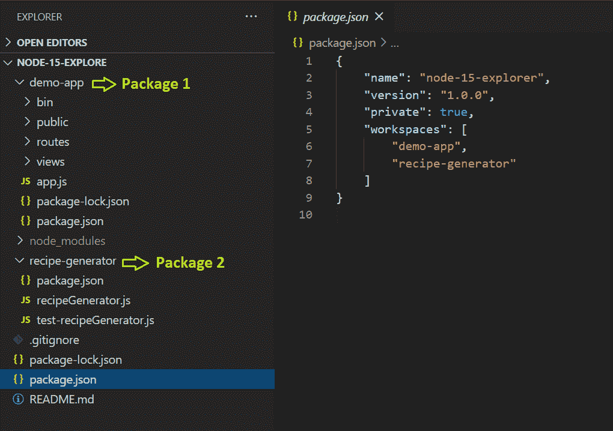

# Node.js 15:新增功能以及开发人员体验的改进

> 原文：<https://blog.logrocket.com/node-js-15-whats-new-and-how-the-developer-experience-has-improved/>

[Node.js](https://nodejs.org/en/) 的下一个主要版本现已发布。到目前为止，在 Node.js 15 系列发布中，我们已经看到了一些改进，一些新的 JavaScript 语言特性，甚至一些突破性的变化。

其中一些改进，比如新版的 [NPM](https://www.npmjs.com/) ，是实质性的，极大地改善了开发者的体验。其他变化，如 N-API 的新版本或对 [QUIC](https://www.chromium.org/quic) 协议的实验性支持，可能不会吸引大众，但对于确保 Node.js 继续可扩展并为 web 的未来做好准备同样重要。

让我们来看看有哪些新内容，以及您为什么应该关注。

> 提示:Node.js 15 不是一个长期支持(LTS)版本。对该版本的支持预计将在 2021 年 6 月结束，即第一个 Node.js 16 版本发布后不久。您可能希望暂时将生产应用程序保留在 Node.js 14 上。

## NPM 7

由于一系列新功能，NPM 7 很可能是这次发布的最大头条。最大的特性是 NPM 工作区，它开始内置支持在单个文件系统中创建和管理多个 NPM 包。已经在积极使用 [Yarn](https://yarnpkg.com/) 包管理器或者 [Lerna](https://lerna.js.org/) 的开发者应该会看到与 NPM 工作空间实现的相似之处。

开始使用 NPM 工作空间相对容易。首先，在文件系统上排列所有的 NPM 包文件夹，创建一个引用每个文件夹的顶层 package.json，并开始跨所有 NPM 包运行命令。



Here’s an NPM workspace example.

请记住，这是 NPM 工作区的初始实施。如果你是经验丰富的纱线或 Lerna 用户，你会注意到，许多表桩的能力仍然缺失。例如，使用 NPM CLI[还无法](https://github.com/npm/npm-v7-blog/issues/5)在工作区的特定包中执行脚本。我确信我们将会看到工作空间功能的迅速扩展。

> 提示:您可以使用`--prefix`参数在工作区的特定包中运行脚本。例如，`npm run` `--``prefix recipe-generator test`会在当前工作区运行`recipe-generator`包中的`test`脚本。

除了工作区之外，NPM 7 中还引入了其他几项重大变化。

在 NPM 6 中，对等依赖基本上被忽略了。在 NPM 7 中，它们是默认安装的。你可以在 [NPM RFC0025](https://github.com/npm/rfcs/blob/latest/implemented/0025-install-peer-deps.md) 中了解更多关于这一变化的信息。有趣的是，React 开发人员社区可能影响了这一变化。

使用新的`npm exec`命令，在不安装 NPM 软件包的情况下运行它们已经成为核心 NPM 的一部分。这个新命令取代了`npx`，但行为也略有不同。为了向后兼容，`npx`被重写为使用`npm exec`但相同的 CLI。你可以在 [NPM 文档](https://docs.npmjs.com/cli/v7/commands/npm-exec)中了解更多。

NPM 现在支持 yarn.lock 文件。如果该文件存在，NPM 将使用它来确定从哪里获取包。NPM 甚至会在添加或删除软件包时更新它。没有用 yarn.lock 替换 package-lock.json 的计划，实际上，仍然生成并维护一个 package-lock.json 文件，作为包版本元数据的权威来源。

NPM 有一个新的 package-lock.json 格式，现在支持确定性构建。简而言之，这意味着如果 package-lock.json 文件没有改变，NPM 可以确保已安装软件包的版本在不同的构建中保持一致。一段时间以来，确定性构建一直是 Yarn 的一个特征。

这仅仅触及了 NPM 7 号的表面。你可以在这里阅读更多关于 NPM 7 [的新内容。](https://blog.npmjs.org/post/634067895980294144/release-v709)

## V8 8.6

Node.js 15 将其使用的 V8 引擎版本从 8.4 提升到 8.6。V8 是 Node.js 运行的底层 JavaScript 引擎。

所以你为什么要在乎呢？因为 V8 定义了可供开发人员使用的 JavaScript 语言特性。虽然这个版本变动很小，但是有一些新的语言特性将减少您需要编写的代码量，并可能使您的代码更具可读性。

首先，有一些新的逻辑赋值操作符允许您有条件地为变量赋值:

```
// new logical AND operator
let a = 1;
let b = 0;
a &&= 2;
b &&= 2;
console.log(a); // prints 2
console.log(b); // prints 0

// new logical OR operator
a = 1;
b = null;
a ||= 3;
b ||= 3;
console.log(a); // prints 1
console.log(b); // prints 3

// new logical nullish operator
a = 1;
b = null;
a ??= 4;
b ??= 4; 
console.log(a); // prints 1
console.log(b); // prints 4

```

`Promise`对象有一个新的`any()`函数，它接受一个或多个承诺并返回首先解决的承诺。被拒绝的承诺被忽略。如果所有承诺都被拒绝，则返回一个新的`AggregateError`，其中包含所有被拒绝承诺的错误。

许多开发人员没有记住正则表达式语法。幸运的是，`String`对象现在有了一个新的`replaceAll()`函数，这意味着少了一个正则表达式，您需要查找它来替换所有出现的字符串。

就这么简单:`myString.replaceAll(``'``regex``'``,` `'``function``'``)`。

## 对 QUIC 协议(HTTP/3)的实验性支持

HTTP/1 标准出现在 1996 年左右。近 19 年后，经过对原始标准的多次扩展，HTTP/2 在 2015 年成为标准。

现在我们紧跟在 HTTP/3 之后，它将取代从 TCP 到 QUIC 的网络传输层协议。Node.js 通过增加对 QUIC 协议的实验性支持，继续向开发人员社区承诺保持最新标准的领先地位。

好吧，标准正在以更快的速度发展，但是这对主流 Node.js 开发人员意味着什么呢？嗯，这可能意味着很多，取决于你正在建设什么。

如果您正在使用`net`模块在您的应用程序中创建套接字，您可以开始利用一组新的实验函数和对象来使用 QUIC 协议建立连接。与 TCP 相比，QUIC 承诺减少延迟，TLS 加密是内置的，等等。

## 未处理的拒绝承诺

Node.js 15 中最大的突破性变化是如何处理未处理的拒绝承诺。在 Node.js 14 中，如果您没有显式处理被拒绝的承诺，您会看到以下警告:

```
(node:764) UnhandledPromiseRejectionWarning: something happened
(Use `node --trace-warnings ...` to show where the warning was created)
(node:764) UnhandledPromiseRejectionWarning: Unhandled promise rejection. This error originated either by throwing inside of an async function without a catch block, or by rejecting a promise which was not handled with .catch(). To terminate the node process on unhandled promise rejection, use the CLI flag `--unhandled-rejections=strict` (see https://nodejs.org/api/cli.html#cli_unhandled_rejections_mode). (rejection id: 2)
(node:764) [DEP0018] DeprecationWarning: Unhandled promise rejections are deprecated. In the future, promise rejections that are not handled will terminate the Node.js process with a non-zero exit code.

```

Node.js 15 中的警告现已被替换为一个错误:

```
node:internal/process/promises:218
          triggerUncaughtException(err, true /* fromPromise */);
          ^

[UnhandledPromiseRejection: This error originated either by throwing inside of an async function without a catch block, or by rejecting a promise which was not handled with .catch(). The promise rejected with the reason "recipe 
could not be generated".] {
  code: 'ERR_UNHANDLED_REJECTION'
}

```

这种变化有可能影响许多应用程序，特别是对于过去忽略警告消息的开发人员。您可以通过使用新的`--unhandled-rejections=warn`参数启动 Node.js 来恢复这种行为。

## 实验诊断通道模块

Node.js 15.1.0 引入了一个名为`diagnostics_channel`的新实验模块。该模块本质上启用了发布-订阅模式，开发人员可以使用该模式将任意数据发布到可供其他模块或应用程序使用的通道。该模块是有意通用的，可以以多种方式使用。

您可以导入并立即开始使用该模块:

```
const diagnostics_channel = require('diagnostics_channel');

```

创建一个频道并向其发布消息实际上非常简单。此示例演示了如何创建通道并向其发布消息:

```
const getData = filter => {
    const alertChannel = diagnostics_channel.channel('my-module.alert');

    return new Promise((resolve, reject) => {
        const data = doSomething(filter);
        if (data) {
            resolve(data);
        } else {
            const errorMessage = "data could not be retrieved";
            alertChannel.publish(errorMessage);
            reject(errorMessage);
        }
    });
}

```

使用来自通道的消息也同样简单。下面是一个示例，说明如何从另一个模块或应用程序订阅一个通道，并利用从该通道接收的数据:

```
  const alertChannel = diagnostics_channel.channel('my-module.alert');
  alertChannel.subscribe(message => {
    console.log(`Alert received on my-module.alert channel: ${message}`);
  });

```

## 其他显著变化

与我们目前所看到的相比，该版本中还有一些其他值得注意的变化，这些变化可能不会影响太多的开发人员:

*   N-API 7 在这里。N-API 是开发人员可以为 Node.js 构建本机附加组件的几种方法之一。N-API 版本可以追溯到早在 Node.js 6 的早期 LTS 版本。N-API 确保插件与过去、现在和未来的 Node.js LTS 版本保持兼容
*   已弃用的`node debug`命令现已移除。它被替换为`node inspect`，后者使用广泛采用的基于检查器的方法来调试 Node.js
*   `repl`模块中的几个不推荐使用的函数已被删除。删除不推荐使用的函数并不奇怪，但是如果您在应用程序中使用`repl`模块，那么回顾一下[发行说明](https://nodejs.org/en/blog/release/v15.0.0/)可能是值得的

## 下一步是什么？

我们可以期待更多 Node.js 15 次要版本和补丁发布，直到 2021 年 4 月。之后，我们将开始看到 Node.js 16 的最初几次迭代，这将是下一个 LTS 版本。

## 200 只显示器出现故障，生产中网络请求缓慢

部署基于节点的 web 应用程序或网站是容易的部分。确保您的节点实例继续为您的应用程序提供资源是事情变得更加困难的地方。如果您对确保对后端或第三方服务的请求成功感兴趣，

[try LogRocket](https://lp.logrocket.com/blg/node-signup)

.

[](https://lp.logrocket.com/blg/node-signup)[https://logrocket.com/signup/](https://lp.logrocket.com/blg/node-signup)

LogRocket 就像是网络和移动应用程序的 DVR，记录下用户与你的应用程序交互时发生的一切。您可以汇总并报告有问题的网络请求，以快速了解根本原因，而不是猜测问题发生的原因。

LogRocket 检测您的应用程序以记录基线性能计时，如页面加载时间、到达第一个字节的时间、慢速网络请求，还记录 Redux、NgRx 和 Vuex 操作/状态。

[Start monitoring for free](https://lp.logrocket.com/blg/node-signup)

.