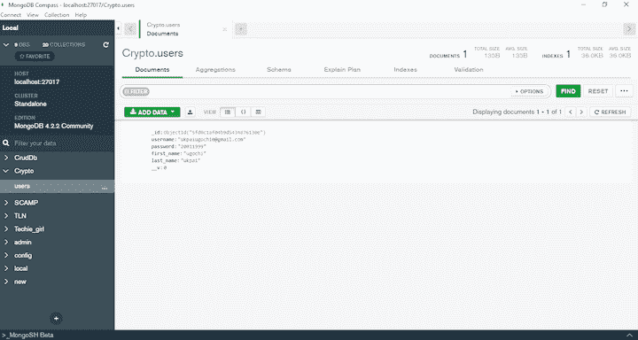
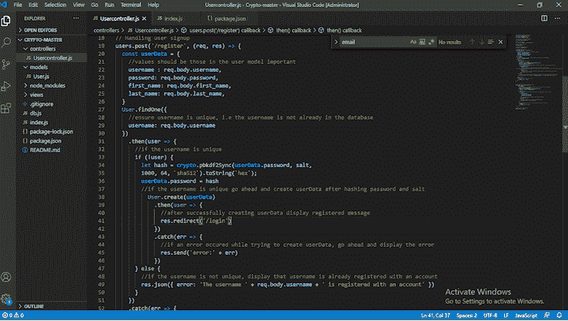
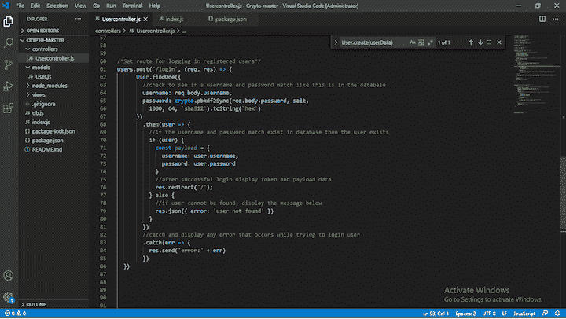
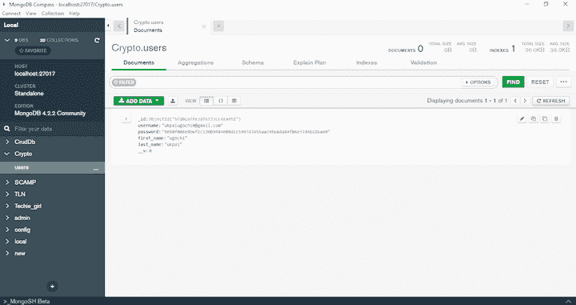

# js 加密模块:教程

> 原文：<https://blog.logrocket.com/node-js-crypto-module-a-tutorial/>

如果罪犯控制了你的数据库，用户数据会怎么样？网络犯罪是一个持续的威胁，坏人潜伏在每个角落，试图传递恶意脚本来克隆您的数据库。您可以采取哪些额外的步骤来保护用户信息？

例如，当用户在应用程序中创建一个帐户时，他们的密码和用户名需要安全地保存在数据库中，可能需要加密。但是，要登录到他们的帐户，用户的密码和用户名将根据数据库中已有的凭据集进行验证。

如果数据库中的密码(被加密成乱码)被用来比较用户输入的密码/电子邮件，这就无法实现。这就是为什么在将数据库中的凭证与用户的输入进行比较时，必须对它们进行解密。密码可以被散列或加密；哈希是一种单向加密方法。

最佳解决方案是在将敏感信息发送到数据库之前对其进行加密。这样，当网络罪犯得到你的数据库时，他们看到的只是随机字符。

在本教程中，我们将回顾 Node.js 中的密码学基础，并演示如何使用 Node.js [crypto](https://nodejs.org/en/knowledge/cryptography/how-to-use-crypto-module/) 模块来保护用户数据。我们将构建一个示例应用程序来演示如何使用 crypto 加密和解密 Node.js 中的用户名和密码。

以下是我们将要介绍的内容:

要学习本教程，您应该具备:

*   [Node.js](https://nodejs.org/en/download/) 安装在您的工作环境中
*   [Git](https://git-scm.com/downloads) 在您的工作环境中下载并设置 Git
*   [MongoDB](https://www.mongodb.com/try/download/community) 存储用户详细信息

## Node.js 中的密码学是什么？

加密是将纯文本转换成不可读文本的过程，反之亦然。这样，只有信息的发送者和接收者理解其内容。

利用 Node.js 中的密码术，可以[哈希密码](https://blog.logrocket.com/building-a-password-hasher-in-node-js/)并存储在数据库中，使数据在哈希后无法转换为纯文本；只能验证。当恶意行为者控制了您的数据库时，他们无法解码加密的信息。您还可以加密其他用户数据，以便在传输过程中解密。

您在应用程序中采用的加密类型取决于您的需求。例如，密码术可以是对称密钥(如散列法)、公钥(如加密或解密)等等。

接收加密数据的终端方可以将其解密为纯文本供他们使用。如果没有密钥，网络罪犯就无法解密加密的数据。这正是 Node.js 加密模块所做的。

## Node.js 加密模块是什么？

Node.js 加密模块提供加密功能来帮助您保护 Node.js 应用程序。它包括一组包装器，用于 OpenSSL 的散列、HMAC、加密、解密、签名和验证功能。

crypto 内置在 Node.js 中，所以不需要严格的实现流程和配置。与其他模块不同，在 Node.js 应用程序中使用 Crypto 之前，不需要安装它。

crypto 允许您在将纯文本存储到数据库之前对其进行哈希运算。为此，您有一个散列类，它可以创建固定长度、确定性、抗冲突和单向散列。对于散列数据，与加密数据不同，密码不能用预先确定的密钥解密。HMAC 类负责基于散列的消息验证代码，该代码散列密钥和值以创建单个最终散列。

出于传输目的，您以后可能需要加密和解密其他用户数据。这就是`Cipher`和`Decipher`类的用武之地。你可以用`Cipher`类加密数据，用`Decipher`类解密。有时，您可能不想在将数据存储到数据库之前对其进行加密。

您还可以验证加密或哈希密码，以确保它们是有效的。你所需要的就是`Verify`类。证书也可以用`sign`类签名。

所有这些都是开发人员喜欢使用加密模块的原因。让我们探索各种加密类，并发现如何用它们实现加密。

## Node.js 加密类

让我们来看看 crypto 中使我们能够实现加密的类。

### `Cipher`

`Cipher`类负责加密信息。当用户在注册时输入密码，调用`C``ipher`类对密码进行加密。

首先，我们将从算法中生成一个密钥。之后，我们将在加密文本之前生成一个随机的初始化数字(`iv`)。

要使用这个类，您必须使用 [`crypto.createCipher()`](https://nodejs.org/api/crypto.html#crypto_crypto_createcipher_algorithm_password_options) 或`[crypto.createCipheriv()](https://nodejs.org/api/crypto.html#crypto_crypto_createcipheriv_algorithm_key_iv_options)`创建一个密码实例。由于`crypto.createCipher()`已经贬值，建议使用`crypto.createCipheriv()`。

下面的程序显示了如何用`Cipher`方法加密密码:

```
// Import module into your application
const crypto = require('crypto');

const algorithm = 'aes-192-cbc';
const password = '2001MyForever';

// We will first generate the key, as it is dependent on the algorithm.
// In this case for aes192, the key is 24 bytes (192 bits).
crypto.scrypt(password, 'salt', 24, (err, key) => {
  if (err) throw err;
  // After that, we will generate a random iv (initialization vector)
  crypto.randomFill(new Uint8Array(16), (err, iv) => {
    if (err) throw err;

    // Create Cipher with key and iv
    const cipher = crypto.createCipheriv(algorithm, key, iv);

    let encrypted = '';
    cipher.setEncoding('hex');

    cipher.on('data', (chunk) => encrypted += chunk);
    cipher.on('end', () => console.log(encrypted));// Prints encrypted data with key

    cipher.write('some clear text data');
    cipher.end();
  });
});

```

### `Decipher`

`Decipher`类负责解密加密文本。当您打算将信息安全地发送给另一个开发人员时，您必须对它进行加密。信息接收者能够读取信息的唯一方法是解密它。这正是`Decipher`类所做的。

* * *

### 更多来自 LogRocket 的精彩文章:

* * *

不能用 new 关键字直接创建解密对象。 [`crypto.createDecipher()`](https://nodejs.org/api/crypto.html#crypto_crypto_createdecipher_algorithm_password_options) 或`[crypto.createDecipheriv()](https://nodejs.org/api/crypto.html#crypto_crypto_createdecipheriv_algorithm_key_iv_options)`方法用于创建解密实例。

`crypto.createDecipher()`是折旧的，所以要用`crypto.createdeCipheriv()`的方法代替。

以下是如何用`Decipher`解密加密文本:

```
// Import module into your application
const crypto = require('crypto');

const algorithm = 'aes-192-cbc';
const password = 'Password used to generate key';

// We will first generate the key, as it is dependent on the algorithm.
// In this case for aes192, the key is 24 bytes (192 bits).
// We will use the async `crypto.scrypt()` instead for deciphering.
const key = crypto.scryptSync(password, 'salt', 24);
// The IV is usually passed along with the ciphertext.
const iv = Buffer.alloc(16, 0); // Initialization vector.

// Create decipher with key and iv
const decipher = crypto.createDecipheriv(algorithm, key, iv);

let decrypted = '';
decipher.on('readable', () => {
  while (null !== (chunk = decipher.read())) {
    decrypted += chunk.toString('utf8');
  }
});
decipher.on('end', () => {
  console.log(decrypted);
  // Prints: some clear text data
});

// Encrypted with same algorithm, key and iv.
const encrypted =
  'e5f79c5915c02171eec6b212d5520d44480993d7d622a7c4c2da32f6efda0ffa';
decipher.write(encrypted, 'hex');
decipher.end();

```

### `Hash`

`Hash`类用于纯文本哈希目的。哈希只是将纯文本转换成哈希函数。哈希文本不能转换回其原始版本。不能用关键字`new`直接创建散列对象。

要创建散列实例，请使用`[crypto.createHash()](https://nodejs.org/api/crypto.html#crypto_crypto_createhash_algorithm_options)`方法，如下例所示:

```
// Import module into your application
const crypto = require('crypto');
// create hash algorithm 
const hash = crypto.createHash('sha256');

hash.on('readable', () => {
  // Only one element is going to be produced by the
  // hash stream.
  const data = hash.read();
  if (data) {
    console.log(data.toString('hex'));
    // Prints:
    //   6a2da20943931e9834fc12cfe5bb47bbd9ae43489a30726962b576f4e3993e50
  }
});

hash.write('some data to hash');
hash.end();

```

### `Certificate`

`Certificate`由密钥对和用于加密电子文档的其他信息组成。

证书可以生成一个会话密钥，用于在 internet 上安全地传输信息。使用 crypto `Certificate`类，您可以使用 OpenSSL 的 SPKAC 实现来使用[签名的公钥和挑战(SPKAC)](https://en.wikipedia.org/wiki/SPKAC) 。

下面是一个如何使用`Certificate`类的例子:

```
const { Certificate } = require('crypto');
const spkac = getSpkacSomehow();
const challenge = Certificate.exportChallenge(spkac);
console.log(challenge.toString('utf8'));
// Prints: the challenge as a UTF8 string

```

### `DiffieHellman`

要成功破译密码，尤其是加密的密码，你需要一个密钥。密钥就像发送方和接收方之间共享的秘密。如果密钥保存不安全，黑客就可以得到它们，并对用户信息造成严重破坏。

Crypto 的`DiffieHellman`类利用了[迪菲-赫尔曼密钥交换](https://en.wikipedia.org/wiki/Diffie%E2%80%93Hellman_key_exchange)。Diffie-Hellman 密钥交换是一种在公共信道中安全传递加密密钥的方法。这保证了专门用于信息发送者和接收者的密钥的安全。

要使用`DiffieHellman`方法，请遵循以下示例:

```
onst crypto = require('crypto');
const assert = require('assert');

// Generate Alice's keys...
const alice = crypto.createDiffieHellman(2048);
const aliceKey = alice.generateKeys();

// Generate Bob's keys...
const bob = crypto.createDiffieHellman(alice.getPrime(), alice.getGenerator());
const bobKey = bob.generateKeys();

// Exchange and generate the secret...
const aliceSecret = alice.computeSecret(bobKey);
const bobSecret = bob.computeSecret(aliceKey);

// OK
assert.strictEqual(aliceSecret.toString('hex'), bobSecret.toString('hex'));

```

### `ECDH`

[椭圆曲线 Diffie–Hellman(ECDH)](https://en.wikipedia.org/wiki/Elliptic-curve_Diffie%E2%80%93Hellman#:~:text=Elliptic%2Dcurve%20Diffie%E2%80%93Hellman%20(,secret%20over%20an%20insecure%20channel.&text=The%20key%2C%20or%20the%20derived,using%20a%20symmetric%2Dkey%20cipher.)用于用椭圆曲线建立共享公私钥对。

下面的例子展示了如何在 Node.js 应用程序中使用`ECDH`类。

```
const crypto = require('crypto');
const assert = require('assert');

// Generate Alice's keys...
const alice = crypto.createECDH('secp521r1');
const aliceKey = alice.generateKeys();

// Generate Bob's keys...
const bob = crypto.createECDH('secp521r1');
const bobKey = bob.generateKeys();

// Exchange and generate the secret...
const aliceSecret = alice.computeSecret(bobKey);
const bobSecret = bob.computeSecret(aliceKey);

assert.strictEqual(aliceSecret.toString('hex'), bobSecret.toString('hex'));
// OK

```

### `HMAC`

基于散列的消息认证码(HMAC)使您能够使用[共享秘密](https://en.wikipedia.org/wiki/Shared_secret)提供[数字签名](https://en.wikipedia.org/wiki/Digital_signatures)。Crypto 的`HMAC`类使用 HMAC 方法进行数字签名。

```
const crypto = require('crypto');
const hmac = crypto.createHmac('sha256', 'a secret');

hmac.on('readable', () => {
  // Only one element is going to be produced by the
  // hash stream.
  const data = hmac.read();
  if (data) {
    console.log(data.toString('hex'));
    // Prints:
    //   7fd04df92f636fd450bc841c9418e5825c17f33ad9c87c518115a45971f7f77e
  }
});

hmac.write('some data to hash');
hmac.end();

```

### `sign`

`sign`类用于生成签名。为了实现高效的加密，需要对密文进行签名，然后进行验证。这样，当接收者得到一个密码时，他们可以通过验证密码上的签名来判断它是否是真实的。

```
const crypto = require('crypto');

const { privateKey, publicKey } = crypto.generateKeyPairSync('ec', {
  namedCurve: 'sect239k1'
});

// Create
const sign = crypto.createSign('SHA256');
sign.write('some data to sign');
sign.end();
const signature = sign.sign(privateKey, 'hex');

```

### `verify`

如果您有一个散列的密码，确定其值的唯一方法是使用`verify`方法。

例如，当您在注册期间散列用户密码并将其存储在数据库中时，您需要确认用户在登录期间输入的密码/用户名。由于我们无法破译散列密码，确认密码/用户名组合正确的唯一方法是使用`verify`。

```
// Verify signed token from `sign` example above
const verify = crypto.createVerify('SHA256');
verify.write('some data to sign');
verify.end();
console.log(verify.verify(publicKey, signature, 'hex'));
// Prints: true 

```

## 在 Node.js 应用程序中使用加密

为了演示如何使用 crypto 加密和解密 Node.js 应用程序中的用户信息，我们将使用一个[示例 Node.js 应用程序](https://github.com/hannydevelop/Crypto)，其中用户使用用户名和密码注册，然后使用这些凭证登录。

比方说，当用户注册时，他们的详细信息以纯文本形式存储，这使得黑客很容易窃取他们的数据。我们将向您展示如何通过在应用程序中添加 crypto 来解决这个问题。

这个应用程序使用 [Passport](http://www.passportjs.org/) 进行用户认证——在我们的例子中，比较用户密码/电子邮件组合。

首先，下载[示例 Node.js 应用程序](https://github.com/hannydevelop/Crypto),并使用以下命令克隆它:

```
git clone https://github.com/hannydevelop/Crypto.git

```

**A** 克隆应用程序后，使用终端导航到应用程序在系统中的位置。

```
cd crypto

```

通过在终端中运行以下命令，安装依赖项并启动应用程序:

```
# Install dependencies 
npm install
# Start application
node index.js

```

在网络浏览器中导航至`[http://localhost:3000/register](http://localhost:3000/register)`查看应用程序。如果你注册一个账户，并使用 [MongoDB Compass](https://www.mongodb.com/products/compass) 查看数据库，你会看到用户密码是明文。



我们想避免这种情况。要将密码转换成密文，我们可以在应用程序中添加`crypto`。

## 向 Node.js 应用程序添加加密

要将 crypto 添加到 Node.js 应用程序中，请执行以下步骤。

1.  ```
    // Import module into the application const crypto = require('crypto') // Creating salt for all users let salt = 'f844b09ff50c' 
    ```

2.  Add the following code to your register method:

    ```
    // Add this right above User.create(userData)

    // Hash user password and salt using 1000 iterations
    let hash = crypto.pbkdf2Sync(userData.password, salt,  
    1000, 64, `sha512`).toString(`hex`);
    userData.password = hash
    ```

    `现在应该是这样的:`

     ````
    //import all dependencies required
    const express = require('express');
    const cors = require('cors');
    const crypto = require('crypto')
    //set variable users as expressRouter
    var users = express.Router();
    //import user model
    var { User } = require('../models/User');
    //protect route with cors
    users.use(cors())
    // Creating salt for all users
    let salt = 'f844b09ff50c'
    // Handling user signup 
    users.post('/register', (req, res) => {
      const userData = {
        //values should be those in the user model important
        username : req.body.username, 
        password: req.body.password,
        first_name: req.body.first_name,
        last_name: req.body.last_name,
      }
      User.findOne({
        //ensure username is unique, i.e the username is not already in the database
        username: req.body.username
      })
        .then(user => {
          //if the username is unique 
          if (!user) {
            let hash = crypto.pbkdf2Sync(userData.password, salt,  
            1000, 64, `sha512`).toString(`hex`);
            userData.password = hash
            //if the username is unique go ahead and create userData after hashing password and salt
              User.create(userData)
                .then(user => {
                  //after successfully creating userData display registered message
                  res.redirect('/login')
                })
                .catch(err => {
                  //if an error occured while trying to create userData, go ahead and display the error
                  res.send('error:' + err)
                })
          } else {
            //if the username is not unique, display that username is already registered with an account
            res.json({ error: 'The username ' + req.body.username + ' is registered with an account' })
          }
        })
        .catch(err => {
          //display error if an error occured
          res.send('error:' + err)
        })
    })
    ```

    ` 
`*   Add the following to your login method.

    ```
    //check to see if a username and password match like this is in the database
    username: req.body.username,
    password: crypto.pbkdf2Sync(req.body.password, salt,  
    1000, 64, `sha512`).toString(`hex`)
    ```

    `users.post('/login')` 现在应该是这个样子:

    ```
    users.post('/login', (req, res) => {
          User.findOne({
            //check to see if a username and password match like this is in the database
            username: req.body.username,
            password: crypto.pbkdf2Sync(req.body.password, salt,  
              1000, 64, `sha512`).toString(`hex`)
          })
            .then(user => {
              //if the username and password match exist in database then the user exists
              if (user) {
                const payload = {
                  username: user.username,  
                  password: user.password 
                }
                //after successful login display token and payload data
                res.redirect('/');
              } else {
                //if user cannot be found, display the message below
                res.json({ error: 'user not found' })
              }
            })
            //catch and display any error that occurs while trying to login user
            .catch(err => {
              res.send('error:' + err)
            })
      })
    ```

    ` 

 `要运行 Node.js 应用程序，请在终端中运行以下命令:

```
node index.js

```

导航至`[http://localhost:3000/register](http://localhost:3000/register)`注册并登录您的应用。这一次，来自 Compass 的片段有所不同(它是一个密文):



## 应该使用 Node.js crypto 吗？

在本文中，我们演示了如何使用 Node.js 加密模块保护用户数据。

还有一些其他的密码术包可以使用 Node.js，比如 [JWT](https://blog.logrocket.com/jwt-authentication-best-practices/) 、 [Bcrypt](https://blog.logrocket.com/deno-alternatives-to-popular-node-projects/#bcrpyt) 等等。但是，这些包不是内置的，有时需要额外的依赖项来完成 crypto 本身可以完成的工作。例如，如果使用 Bcrypt，您需要用 JWT 签署您的密钥。

crypto 有一个 crypt 和 sign 方法，分别执行与 Bcrypt 和 JWT 相同的工作。然而，如果你构建的应用程序只是为了认证用户而不是加密消息，Bcrypt 和 JWT 是更好的选择。那是因为对所有用户使用相同的盐不是一个好的做法；确切地说。你应该为每个用户创建一个独特的盐是一个很好的做法`this.salt = crypto.randomBytes(16).toString('hex');`。

这个过程本身也存在挑战:将散列密码与用户输入的密码进行比较的能力。Bcrypt 的`compareSync()`方法提供了一种比较散列密码和普通密码的简单方法，因此是一种更好的替代方法。

## 200 只显示器出现故障，生产中网络请求缓慢

部署基于节点的 web 应用程序或网站是容易的部分。确保您的节点实例继续为您的应用程序提供资源是事情变得更加困难的地方。如果您对确保对后端或第三方服务的请求成功感兴趣，

[try LogRocket](https://lp.logrocket.com/blg/node-signup)

.

[](https://lp.logrocket.com/blg/node-signup)[https://logrocket.com/signup/](https://lp.logrocket.com/blg/node-signup)

LogRocket 就像是网络和移动应用程序的 DVR，记录下用户与你的应用程序交互时发生的一切。您可以汇总并报告有问题的网络请求，以快速了解根本原因，而不是猜测问题发生的原因。

LogRocket 检测您的应用程序以记录基线性能计时，如页面加载时间、到达第一个字节的时间、慢速网络请求，还记录 Redux、NgRx 和 Vuex 操作/状态。

[Start monitoring for free](https://lp.logrocket.com/blg/node-signup)

.`