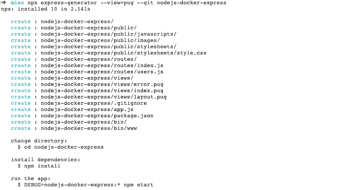
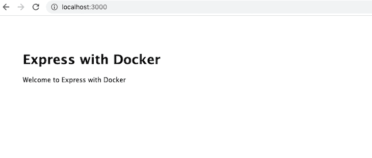
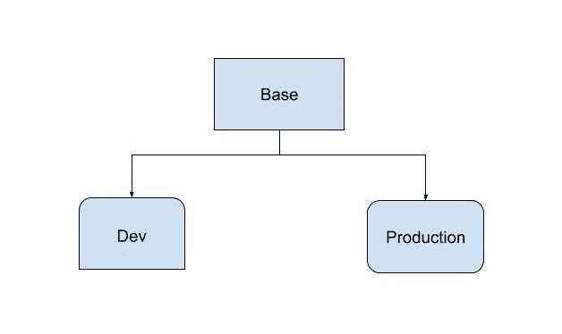
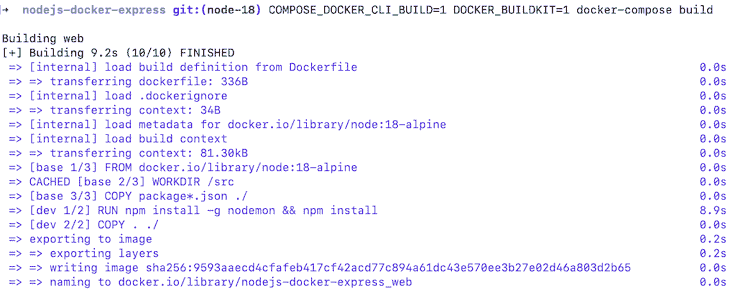
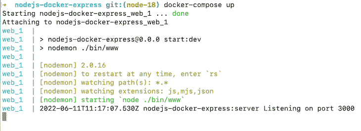
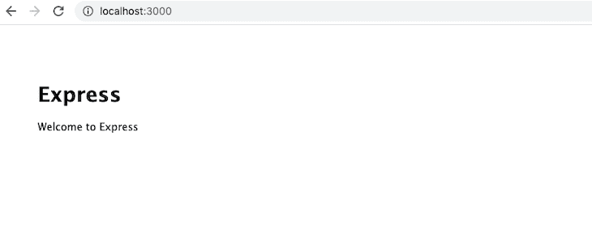
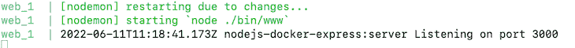

# Node.js 和 Docker:用 Docker Compose 改进 DX

> 原文：<https://blog.logrocket.com/node-js-docker-improve-dx-docker-compose/>

***编者按**:本文最后一次更新于 2022 年 6 月 16 日，以反映节点 v18 中所做的更改。*

Node.js 和 Docker 都是流行的工具。在这个分步指南中，我们将详细介绍如何通过有效使用`docker build`和利用 Docker Compose 来改善开发人员体验，实现无缝的本地开发环境。我们将使用一个演示 Express 应用程序作为例子。

要跟随本教程，您应该熟悉 Node.js 和 npm 的基础知识。我们将使用 Node.js v18，这是撰写本文时的最新版本。要阅读本文，您应该熟悉 Express 框架的基础知识，并且应该掌握一些 Docker 的工作知识。

本教程将使用在类似 Unix 的系统上运行的命令，如 Linux 或 macOS，并带有一个 shell。你可以将我在公共 GitHub 库中构建应用的方式分解为多个 pull 请求的[序列。我们开始吧！](https://github.com/geshan/nodejs-docker-express/pulls?q=is%3Apr+is%3Aclosed)

## 目录

## 使用快速生成器创建新的快速项目

为了生成我们的演示应用程序，我们将使用 [Express 应用程序生成器](https://expressjs.com/en/starter/generator.html)。为此，我们将运行下面的 npx 脚本:

```
npx express-generator --view=pug --git <app-name>

```

为了分析我们运行的命令，我们要求 Express 生成器生成一个 Express 应用程序。`--view=pug`命令告诉生成器使用 Pug 视图引擎，而`--git`参数要求它添加一个`.gitignore`文件。我们的演示版本将使用 Express 的最新版本，v4.18.1。

当然，您需要用您的应用程序名替换`<app-name>`。作为一个例子，我用的是`nodejs-docker-express`。

上面的命令将呈现类似下图的内容:



## 测试快速应用程序

要测试应用程序，首先运行`npm install`安装所有必要的 npm 模块。之后，通过运行以下命令启动应用程序:

```
DEBUG=nodejs-docker-express:* npm start

```

您应该会看到类似于`nodejs-docker-express:server Listening on port 3000`的消息。上面的命令非常简单；它使用一个名为`DEBUG`的值为`nodejs-docker-express:*`的环境变量运行`npm start`，指示服务器执行详细调试。

如果你在 Windows 上，你应该使用`set DEBUG=nodejs-docker-express:* & npm start`。您可以阅读更多关于[快速调试](https://expressjs.com/en/guide/debugging.html)的内容，以了解其他可用的选项。

现在，打开您的浏览器并输入`[http://localhost:3000](http://localhost:3000)`以查看如下输出:



这样，您的基本 Express 应用程序就已经在运行了。现在，您可以在命令行窗口中用`Ctrl+c`停止服务器。接下来，我们将对 Node.js 和 Express 应用程序进行 dockerize。

## 使用 Docker 多阶段构建将应用程序 Docker 化

容器化我们的应用程序有很多好处。首先，不管它在什么平台上运行，它的行为都是一样的。使用 Docker containers，您可以轻松地将应用程序部署到 AWS Fargate、Google Cloud Run 等平台，甚至是您自己的 Kubernetes 集群。

我们从 Dockerfile 文件开始。Docker 文件是构建 Docker 映像的蓝图。当构建的映像正在运行时，它被称为容器。本质上，容器从 Docker 文件开始，该文件包含如何构建 Docker 映像的指令。

同一个映像可以用来旋转一个甚至数百个容器，这就是 Docker 对软件可伸缩性如此有用的原因:


这个过程非常简单；我们从一个 Docker 文件构建一个 Docker 映像，一个正在运行的 Docker 映像被称为 Docker 容器。

### 设置基础阶段

让我们看看我们的 Dockerfile 看起来怎么样。作为奖励，我们将利用多阶段构建使我们的构建更快更有效:

```
FROM node:18-alpine as base

WORKDIR /src
COPY package*.json /
EXPOSE 3000

FROM base as production
ENV NODE_ENV=production
RUN npm ci
COPY . /
CMD ["node", "bin/www"]

FROM base as dev
ENV NODE_ENV=development
RUN npm install -g nodemon && npm install
COPY . /
CMD ["nodemon", "bin/www"]

```

在上面的 Dockerfile 文件中，我们使用多阶段构建。我们的构建有三个阶段:基础、生产和开发。基础阶段在研制和生产上都有共性。从图形上看，可以描绘如下:



这可能会让你想起遗传。在某种程度上，多阶段继承是 Docker 图像的一种继承。我们正在使用一个精简的生产阶段和一个功能更加丰富、以开发为中心的开发阶段。

让我们一行一行地过一遍:

```
FROM node:18-alpine as base

```

首先，我们告诉 Docker 使用官方的 Docker Node Alpine image 版本 18，这是撰写本文时的最新 LTS 版本，可在 [DockerHub](https://hub.docker.com/_/node) 上公开获得。我们使用官方 Node.js Docker 映像的 Alpine 版本，因为它不到 40MB，相比之下， [main](https://hub.docker.com/layers/node/library/node/18.3.0/images/sha256-d5d332ef8e56d51ff484746513ea4129cfd0b561a4e743772cbddc0cfe3ca8c1?context=explore) 的映像只有 352MB。

我们还将 Alpine 指定为`base`，因为这个 Docker 文件使用了 Docker 多阶段构建。命名由你决定；我们使用这个基础是因为它将在以后的构建过程中被扩展:

```
WORKDIR /src
COPY package*.json /
EXPOSE 3000

```

`WORKDIR`为设置后执行的后续`RUN`命令设置上下文。我们将`package.json`和`package-lock.json`文件复制到容器中，通过更好的 Docker 构建缓存获得更快的构建。

在下一行，我们把`EXPOSE`放到了`port 3000`容器上。默认情况下，Node.js Express web 服务器运行在`port 3000`上。上述步骤对于开发和生产阶段都是通用的。

现在，我们可以看看生产目标阶段是如何构建的。

### 设置生产阶段

```
FROM base as production
ENV NODE_ENV=production
RUN npm ci
COPY . /
CMD ["node", "bin/www"]

```

在生产阶段，我们从基础阶段停止的地方继续，因为这里的行指示 Docker 从基础开始。因此，我们要求 Docker 将名为`NODE_ENV`的环境变量设置为`production`。

据说将这个变量设置为`production`可以让应用[的性能提高三倍](https://expressjs.com/en/advanced/best-practice-performance.html#set-node_env-to-production)。它还有其他好处，比如缓存视图。运行`npm install`将只安装主依赖项，忽略开发依赖项。这些设置非常适合生产环境。

接下来，我们运行`npm ci`而不是`npm install`。`npm ci`以持续集成和部署为目标。它也比`npm install`快得多，因为它绕过了一些面向用户的特性。注意，`npm ci`需要一个`package-lock.json`文件才能工作。

之后我们把代码复制到`/src`，也就是我们的`workdir`。`workdir`将复制我们的自定义代码到容器中。因此，为了运行 web 服务器，我们使用 Node.js 命令运行`bin/www`命令。

因为我们利用了多阶段构建，所以我们只能在开发阶段添加开发所需的组件。让我们看看这是如何做到的:

```
FROM base as dev
ENV NODE_ENV=development
RUN npm install -g nodemon && npm install
COPY . /
CMD ["nodemon", "bin/www"]

```

和生产类似，dev 也是从基础阶段延伸出来的。我们将环境变量`NODE_ENV`设置为`development`。之后，我们安装[节点监控](https://nodemon.io/)。每当文件改变时，nodemon 将重启服务器，使我们的开发体验更加顺畅。

然后，我们执行常规的`npm install`，它也会安装开发依赖项，如果有的话。在我们当前的`package.json`中，没有开发依赖性。例如，如果我们用 [Jest](https://jestjs.io/) 测试我们的应用，那将是开发依赖之一。注意这两个命令是用一个`&&`放在一起的，创建了[个更少的 Docker 层](https://docs.docker.com/develop/develop-images/dockerfile_best-practices/#minimize-the-number-of-layers)，这对构建缓存很有好处。

就像前面的阶段一样，我们在`/src`将代码复制到容器中。然而，这一次，我们使用 nodemon 运行 web 服务器，以便在每次文件更改时重新启动它，因为这是开发环境。

### 不要忽视`.dockerignore`

就像我们不会使用 Git。`gitignore`，在使用 Docker 时，强烈建议添加一个`.dockerignore`文件。`.dockerignore`用于忽略您不想放在 Docker 映像中的文件。它有助于保持 Docker 映像较小，并通过忽略不相关的文件更改来保持构建缓存更高效。我们的`.dockerignore`文件如下所示:

```
.git
node_modules

```

我们指示 Docker 不要将`.git`文件夹和`node_modules`从主机复制到 Docker 容器。这样做将有助于我们在容器中运行`npm ci`或`npm install`时保持事情的一致性。

## 添加复合坞站

现在，我们已经拥有了使用 Docker 运行 Node.js Express 应用程序所需的大部分内容。为了把它们粘在一起，我们需要 Docker Compose。

* * *

### 更多来自 LogRocket 的精彩文章:

* * *

有了 [Docker Compose](https://docs.docker.com/compose/) ，我们不需要记住很长的命令来构建或运行容器，这使得运行应用程序更加容易。只要你能运行`docker-compose build`和`docker-compose up`，你的应用就会毫不费力地运行。

Docker Compose 预装在您的 Docker 安装中。它主要用在开发环境中。

下面是我们的`docker-compose.yml`文件，它位于项目的根目录下:

```
version: '3.8'
services:
  web:
    build:
      context: ./
      target: dev
    volumes:
      - .:/src
    command: npm run start:dev
    ports:
      - "3000:3000"
    environment:
      NODE_ENV: development
      DEBUG: nodejs-docker-express:*

```

首先，我们指定我们将使用的 Docker Compose 的版本。在撰写本文时，Docker Compose v3.8 是 Docker 引擎 v19.0.3 支持的最新版本。它还允许我们使用多阶段 Docker 构建。

接下来，我们指定我们正在使用的服务。对于本教程，我们只有一个名为`web`的服务。它有一个当前目录的构建`context`和一个设置为`dev`的重要构建参数`target`。这告诉 Docker 我们希望用 dev stage 构建 Docker 映像。当然，对于将在生产环境中运行的容器，我们将目标设置为`production`。

之后，我们指定 [Docker 卷](https://docs.docker.com/storage/volumes/)，它指示 Docker 从主机的本地目录`./`中复制更改并与 Docker 容器上的`/src`同步。当我们在主机中更改我们的文件时，这将非常有用，并且它也将立即反映在容器中。

因此，我们使用命令`npm run start:dev`，它被添加到`package.json`文件中，如下所示:

```
"start:dev": "nodemon ./bin/www"

```

接下来，我们想用 nodemon 启动 web 服务器。因为这是我们的开发环境，它将在每次保存文件时重启服务器。

然后，我们将主机的`port 3000`映射到容器`port 3000`。我们在构建容器时暴露了`port 3000`，我们的 web 服务器也运行在`3000`上。

最后，我们设置了几个环境变量。首先，我们将`NODE_ENV`设置为`development`,因为我们希望看到详细的错误，并且不做任何视图缓存。然后，我们将 debug 设置为`*`，它告诉 Express web 服务器打印出详细的调试消息。

## 用 Docker 和 Docker Compose 测试应用程序

我们已经设置了所有需要的部分，所以现在，让我们继续构建 Docker 映像。我们将使用 [BuildKit](https://docs.docker.com/develop/develop-images/build_enhancements/) 优化我们的 Docker 构建。启用 BuildKit 后，Docker 图像的速度[快了很多](https://blog.logrocket.com/top-docker-alternatives-2022/)。是时候看看它的实际效果了！运行以下命令:

```
COMPOSE_DOCKER_CLI_BUILD=1 DOCKER_BUILDKIT=1 docker-compose build

```

在上面的代码中，我们告诉 Compose 在 BuildKit 打开的情况下构建 Docker 映像。它应该运行并构建 Docker 映像，如下所示:



我们的 Docker 映像在大约 10 秒内构建完成，这比 BuildKit 要快得多。让我们运行图像:

```
docker-compose up

```

上面的命令应该会产生类似下面的代码:



之后，如果你点击浏览器上的`[http://localhost:3000](http://localhost:3000)`，你应该会看到以下内容:



太好了！我们的应用程序在 Docker 上运行良好。现在，让我们做一个文件更改，看看它是否反映正确。

## 文件更改时重启:nodemon 来拯救

我们的目的是将文本从“欢迎快递”改为“欢迎用 Docker 快递”作为测试。为此，我们需要将`line 6`处的`routes/index.js`文件修改成如下代码:

```
res.render('index', { title: 'Express with Docker' });

```

我们一保存文件，就可以看到 web 服务器重新启动了。这清楚地表明，我们的 Docker 卷和 nodemon 正在按预期正常运行:



此时，如果您刷新运行`[http://localhost:3000](http://localhost:3000)`的浏览器选项卡，您将看到下图:


您已经在配置了 Docker Compose 的本地环境中成功运行了一个带有 Docker 的 Express 应用程序。给自己一个鼓励！

## 后续步骤

Docker Compose 对于启动多个容器非常有用。如果您想添加 MongoDB、 [MySQL](https://geshan.com.np/blog/2020/11/nodejs-mysql-tutorial/) 或 [Postgres](https://geshan.com.np/blog/2021/01/nodejs-postgresql-tutorial/) 作为应用程序的数据源，您可以很容易地在`docker-compose`文件中添加另一个服务。

在本教程中，我们只关注运行单个容器的 Docker 的 Node.js。请记住，当在生产环境中运行容器时，因为我们使用了多阶段 docker 构建，所以它是用正确的阶段`production`构建的。

Node.js 和 Docker 配合得很好。有了 Docker Compose 的使用，开发体验流畅多了。你可以以本教程为构建基础，用 Docker 和 Node.js 尝试更高级的东西，编码快乐！

## 200 只显示器出现故障，生产中网络请求缓慢

部署基于节点的 web 应用程序或网站是容易的部分。确保您的节点实例继续为您的应用程序提供资源是事情变得更加困难的地方。如果您对确保对后端或第三方服务的请求成功感兴趣，

[try LogRocket](https://lp.logrocket.com/blg/node-signup)

.

[](https://lp.logrocket.com/blg/node-signup)[https://logrocket.com/signup/](https://lp.logrocket.com/blg/node-signup)

LogRocket 就像是网络和移动应用程序的 DVR，记录下用户与你的应用程序交互时发生的一切。您可以汇总并报告有问题的网络请求，以快速了解根本原因，而不是猜测问题发生的原因。

LogRocket 检测您的应用程序以记录基线性能计时，如页面加载时间、到达第一个字节的时间、慢速网络请求，还记录 Redux、NgRx 和 Vuex 操作/状态。

[Start monitoring for free](https://lp.logrocket.com/blg/node-signup)

.