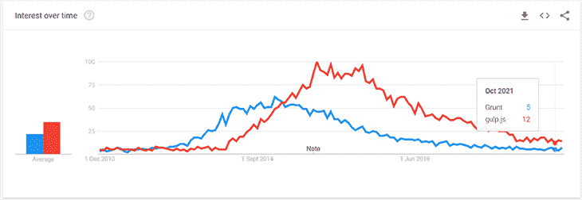

# Node.js 任务运行程序与模块打包程序- LogRocket 博客

> 原文：<https://blog.logrocket.com/node-js-task-runners-vs-module-bundlers/>

*编者按:本帖于 2021 年 12 月 2 日更新，以包括对任务运行器和模块捆绑器的更强大的比较，因为后者自本帖于 2019 年首次发布以来，在使用和受欢迎程度上都有了显著提高。我们还更新了几个部分，以包括关于本帖中讨论的库和工具的最新版本的新信息。*

这篇文章将涵盖以下主题:

## Node.js 简史

JavaScript 的工具生态系统令人难以置信。你很难找到任何其他语言有如此多的工具或如此多的不同用户参与这个工具。从它作为一门语言的卑微开始[最初在 10 天内设计](https://www.computer.org/csdl/mags/co/2012/02/mco2012020007.html)到它的[C10K-在服务器领域实现立足点](http://blog.caustik.com/2012/08/19/node-js-w1m-concurrent-connections/)，你不会找到另一种语言像这种语言一样具有可塑性。

流行的 JavaScript 服务器端实现 Node.js 于 2009 年首次推出。这个平台让前端开发人员几乎在一夜之间成为可行的后端开发人员，解除了前端团队的所有障碍。它的成功保证了一个可以轻松分发源代码的工具，在 2010 年，这个需求被 npm 满足了。

Node.js 被誉为快速、易接近，并且最吸引人的是简单。它很快开始从 PHP 等其他[平台吸引用户，PHP](https://blog.logrocket.com/why-dont-people-like-php/)是一种用来生成动态网站的语言。PHP 可能随时都有成千上万的全局函数可用，并且需要一堆配置文件。

Node.js 允许开发人员迁移到该平台，重新开始。由于太新，它还没有开发出其他语言的“包含电池”框架。Node.js 的指导原则之一是保持核心简单。你找不到连接 MySQL、生成 UUID 或计算 Levenshtein 距离的内置工具。

与此同时，JavaScript 语言也在发生变化。由于用户的“多填充”,一些特性是向后兼容的，但是为了语言的进步，它必须偶尔添加新的语法。开发人员渴望新的语法，但旧的浏览器是现实，这导致了 transpilers 的发展。

由于代码是用 web 的通用语言 JavaScript 编写的，Node.js 的简单性最终变得不那么重要了。Node.js 作为将前端资产从一种表示(如 ES7 或 SASS)转换为另一种表示(如 ES5 或 CSS)的工具，获得了越来越多的关注。

不过，只有一个问题:JavaScript 工程师通常希望继续编写 JavaScript。这导致了任务运行器的开发，这是专门为运行其他工具而设计的 Node.js 工具。

### 任务跑者的崛起

众所周知，构建一个网站基本上需要三种技术，每种技术都由浏览器直接使用:

*   HTML，它控制网页的结构
*   CSS，控制网页外观
*   JavaScript，用于网站交互性编程

对于简单的网站或小团队来说，直接使用这些语言通常是一个不错的方法。然而，对于由工程师团队(每个人都有自己的专长)构建的复杂网站或在浏览器上运行的应用程序，直接使用这些基本语言可能会开始出现问题。

## 使用任务运行器有什么好处？

例如，考虑当公司网站的品牌改变时。几个不同样式文件中使用的十六进制颜色代码可能需要更改。对于原始的 CSS，这个操作需要跨几个团队的协调变化。使用 SASS，这样的更改可以在一行代码中完成。

类似的概念也适用于 HTML，我们使用模板工具如 Mustache 或虚拟 DOM 如 React 生成标记。它们也适用于 JavaScript，工程师可以使用 async/await ES2017 语法编写代码，然后通过回调转换成复杂的 ES5 switch 语句。

此时，我们可能有一个网站需要将 SASS 编译成 CSS，ES2015 代码需要转换成 ES5，React/JSX 模板需要转换成原始 JavaScript。其他操作也是有益的，例如缩小编译的代码和将 PNG 图像压缩成它们的最小表示。

在构建网站时，这些任务中的每一项都需要按照特定的顺序运行。根据特定网站构建的环境——例如它是为开发/调试目的或生产而构建的——一些任务必须被改变或完全跳过。这种复杂性激发了任务运行工具的产生。

两个受欢迎的 Node.js 任务运行者前来救援。第一个是 [Grunt](https://www.npmjs.com/package/grunt) ，第一次提交是在 2011 年 9 月。这个工具采用一种强制性的方法来配置不同的任务，构建深度嵌套的对象并调用一些方法。

第二个是 [Gulp](https://www.npmjs.com/package/gulp) ，在 2013 年 7 月有一个初始提交。这个工具采用了一种不同的方法，本质上更具功能性，将一个函数的输出通过管道传输到另一个函数的输入中，将结果流式传输。

## 咕噜咕噜与狼吞虎咽:任务跑步者的比较

让我们考虑一个简单的 web 应用程序，我们希望使用这些技术的子集来模拟它。这个应用程序依赖于多个 SASS 和 JS 文件。我们希望将 SASS 文件转换成 CSS，并连接结果。

为了简洁起见，我们也将简单地将 JS 文件连接在一起，并假设[模块模式](http://www.adequatelygood.com/JavaScript-Module-Pattern-In-Depth.html)，而不是使用 CommonJS `require`语句。让我们看看使用这些不同的任务运行器，这样的配置会是什么样子。

### Grunt 配置文件

这种方法要求安装以下模块:

*   `grunt`
*   `grunt-contrib-sass`
*   `grunt-contrib-concat`
*   `grunt-contrib-clean`

使用这种方法，我们可以运行`grunt style`、`grunt script`或`grunt build`来完成这两项工作。

```
const grunt = require('grunt');

grunt.initConfig({
  sass: {
    dist: {
      files: [{
          expand: true,
          cwd: './src/styles',
          src: ['*.scss'],
          dest: './temp',
          ext: '.css'
      }]
    }
  },
  concat: {
    styles: {
      src: ['./temp/*.css'],
      dest: 'public/dist.css',
    },
    scripts: {
      src: ['./src/scripts/*.js'],
      dest: 'public/dist.js',
    }
  },
  clean: {
    temp: ['./temp/*.css']
  }
});

grunt.loadNpmTasks('grunt-contrib-sass');
grunt.loadNpmTasks('grunt-contrib-concat');
grunt.loadNpmTasks('grunt-contrib-clean');

grunt.registerTask('style', ['sass', 'concat:styles', 'clean:temp']);
grunt.registerTask('script', ['concat:scripts']);

grunt.registerTask('build', ['style', 'script']);

```

### Gulp 配置文件

前一示例的等效吞咽版本如下。这要求我们安装了`gulp`、`gulp-sass`、`gulp-concat`和`node-sass`。使用这种方法，我们可以运行`gulp style`、`gulp script`或`gulp build`来完成这两项工作。

```
const gulp = require('gulp');
const sass = require('gulp-sass');
const concat = require('gulp-concat');
sass.compiler = require('node-sass');

gulp.task('style', function () {
  return gulp.src('./src/styles/*.scss')
    .pipe(sass().on('error', sass.logError))
    .pipe(concat('dist.css'))
    .pipe(gulp.dest('./public/'));
});

gulp.task('script', function () {
  return gulp.src('./src/scripts/*.js')
    .pipe(concat('dist.js'))
    .pipe(gulp.dest('./public/'));
});

gulp.task('build', gulp.series('style', 'script'));

```

正如您所看到的，Gulp 示例比 Grunt 示例更简洁，因为配置 Gulp 文件比配置 Grunt 文件花费的时间相对更少。但是，Grunt 文件可读性更好。所以，这取决于你想采取哪种方法。

从哲学上讲，这两个工具采用不同的方法来实现可运行的任务，但最终它们允许您做类似的事情。再说一次，Grunt 是在 Gulp 之前引入的。他们在一生中都有着不相上下的受欢迎程度:



Google Trends graph showing Grunt vs. Gulp in 2021

这两个项目都是高度模块化的，允许开发人员创建专门的插件。这些插件允许外部工具，如`eslint`、`sass`或`browserify`轻松集成到任务运行器中。
在我们之前看过的代码中，我们实际上有一个这样的例子:流行的 SASS 工具既有一个`grunt-contrib-sass`模块，又有一个`gulp-sass`模块。

这两个工具可能基本上已经“完成”了。在撰写本文时，Grunt 的最后一次发布是在 2021 年 5 月，Gulp 的最后一次发布是在 2019 年。

“done”是什么意思，这个词在 JavaScript 社区中从字面上和比喻上都是四个字母的单词？那么，在这种情况下，这可能意味着核心任务运行模块做他们需要做的一切，任何额外的功能都可以通过插件添加。

## 任务执行者与捆绑者

在 2021 年的前端开发生态系统中，任务运行器越来越不受欢迎，而[模块捆绑器正在取代它们的位置](https://blog.logrocket.com/benchmarking-bundlers-2020-rollup-parcel-webpack/)。

模块捆绑器是前端开发人员将所有 JavaScript 模块捆绑到一个可以在浏览器中执行的 JavaScript 文件中的工具。模块捆扎机中最大的名称是网络包、汇总和包裹。我们将在下面逐一讨论。

web.dev 博客已经创建了一个名为[工具的网站。报告](https://bundlers.tooling.report/)，其中他们比较了现有的最佳捆扎机，目前他们只比较了四个模块捆扎机:webpack、Browserify、Parcel 和 Rollup。根据他们的结果，在 2021 年 11 月，Parcel 通过了最多的测试(93%)。Webpack 以 90 分的及格分数位居第二。

### 网络包

Webpack 是一个较新的工具，也可以用来获取源文件，以各种方式组合它们，并将它们输出到单个文件中。Webpack 可以使用一个名为`webpack.config.js`的文件以类似于 Grunt 和 Gulp 的方式进行配置。

它也是高度模块化的，我们可以使用像`sass-loader`这样的插件来实现类似的结果。它与 Grunt 和 Gulp 有自己的哲学差异，但是，在基于节点的流程最终转换资产并通过 JavaScript 文件进行配置的意义上，它仍然是相似的。

然而，它与 Grunt 和 Gulp 有很大的不同，直接将它与 Grunt 和 Gulp 进行比较是不公平的。它主要是一个转换 JavaScript 的工具，基于`require`语句和依赖关系的层次结构——它本质上不是一个任务运行器。这是一个模块捆扎机。

webpack 的第一次提交发生在 2012 年 3 月，在 Grunt 和 Gulp 的第一次提交之间，它仍在积极开发中，因为它在世界各地被大量使用。它是最受欢迎的模块捆绑软件，每周下载量超过 1500 万次。

Grunt 和 Gulp 帮助执行许多类型的通用任务，而 webpack 对构建前端资产更感兴趣。但是，它不仅仅限于此，webpack 在 Node.js 开发中也很有用。

### 到达

Rollup 是另一个 JavaScript 模块捆绑器，它将小段代码编译成更广泛、更复杂的代码。Rollup 的配置和 webpack 差不多，熟悉 webpack 的人会发现 Rollup 的配置也差不多，设置起来也很方便。

开发人员通常喜欢 Rollup，因为它们的 API 和设计更简单，使得编写插件更容易。汇总文档也很出色。

### 包裹

Parcel 因其零配置方法而广受欢迎。它也是非常轻量级的，向项目添加 Parcel 非常简单。

包不使用任何配置文件；通过 CLI 传递入口文件就足以开始使用它了。它自己完成剩下的工作。虽然现在，webpack 4 也有一个零配置方法，但与 package 提供的功能相比，它仅限于这些功能。

当构建一个小型到中型的应用程序时，包是一个很好的选择。

### 浏览

[Browserify](https://browserify.org/) 一直是 webpack 势均力敌的竞争对手，但近年来，webpack 的增长速度比 Browserify 快了很多。

Browserify 不是模块捆绑器。相反，它为浏览器带来了 Node.js 的强大功能。这个包允许你在浏览器中为你的前端包使用许多 Node.js 包。

## 任务运行程序备选方案

对于最复杂的构建系统，使用 Node.js 任务运行器是完全有意义的。有一个临界点，用编写应用程序之外的语言来维护构建过程是没有意义的，因为它变得如此复杂。

然而，对于许多项目来说，这些任务运行者最终是多余的。它们是一个*附加的*工具，我们需要将其添加到项目中并保持更新。当任务运行者很容易通过`npm install`获得时，他们的复杂性很容易被忽略。

在前面的例子中，我们需要 32MB 的磁盘空间来使用 Grunt，需要 40MB 的空间来使用 Gulp。这些简单的构建命令——连接两个 JavaScript 文件并编译/连接两个 SASS 文件——使用 Grunt 需要 250 毫秒，使用 Gulp 需要 370 毫秒。

### 使用 Bash 脚本作为任务运行器的替代方案

Gulp 的方法是从一个操作中获取输出，然后通过管道将它们传送到另一个操作中，这听起来应该很熟悉。同样的管道系统也可以通过命令行使用，我们可以通过使用 Bash 脚本来实现自动化。macOS 和 Linux 电脑的用户已经可以使用这样的脚本特性了( [WSL](https://docs.microsoft.com/en-us/windows/wsl/install-win10) 可以帮助 Windows)。

我们可以使用以下三个 Bash 脚本来实现 Grunt 和 Gulp 示例所做的事情:

```
### style.sh
#!/usr/bin/env bash
cat ./src/styles/*.scss | sass > ./public/dist.css

### script.sh
#!/usr/bin/env bash
cat ./src/scripts/*.js > ./public/dist.js

### build.sh
#!/usr/bin/env bash
./style.sh
./script.sh

```

当我们使用这种方法时，我们只需要一个 2.5MB 的二进制文件(可执行文件)。执行整个构建操作所需的时间也减少了:在我的机器上，这个操作只需要 25 毫秒。这意味着我们使用了大约 1/12 的磁盘空间，运行速度提高了 10 倍。对于更复杂的构建步骤，差异可能会更大。

这种方法甚至可以内联到您的`package.json`文件中。然后，可以通过`npm run style`、`npm run script`和`npm run build`执行命令。

```
{
  "scripts": {
    "style": "cat ./src/styles/*.scss | sass > ./public/dist.css",
    "script": "cat ./src/scripts/*.js > ./public/dist.js",
    "build": "npm run style && npm run script"
  }
}

```

当然，这是一种权衡。最大的区别是 [Bash 是一种 shell 脚本语言，语法完全不同于 JavaScript](https://blog.logrocket.com/writing-js-based-bash-scripts-zx/) 。对于一些从事 JavaScript 项目的工程师来说，编写构建复杂应用程序所需的适当脚本可能很困难。

另一个缺点是，Bash 脚本要求我们想要合并的每个操作都有某种可执行文件。幸运的是，他们通常都是。

Browserify 和 [Babel](https://github.com/babel/babel) ，这两个软件都提供了一个可执行文件。萨斯、莱斯、Coffeescript 和 JSX 也都有可执行文件。如果没有，我们可以自己写；然而，一旦我们达到这一点，我们可能会考虑只使用任务运行器。

## 结论

我们机器的命令行脚本功能非常强大。人们很容易忽略它们，尤其是当我们在 JavaScript 这样的高级语言上花了这么多时间的时候。

正如我们所看到的，它们通常足够强大，可以完成我们的许多前端资产构建任务，并且通常可以更快地完成。当您开始下一个项目时，考虑使用这些工具，并且只有当您达到 Bash 脚本的限制时，才切换到像 task runner 这样的更重的解决方案。

## 200 只显示器出现故障，生产中网络请求缓慢

部署基于节点的 web 应用程序或网站是容易的部分。确保您的节点实例继续为您的应用程序提供资源是事情变得更加困难的地方。如果您对确保对后端或第三方服务的请求成功感兴趣，

[try LogRocket](https://lp.logrocket.com/blg/node-signup)

.

[](https://lp.logrocket.com/blg/node-signup)[https://logrocket.com/signup/](https://lp.logrocket.com/blg/node-signup)

LogRocket 就像是网络和移动应用程序的 DVR，记录下用户与你的应用程序交互时发生的一切。您可以汇总并报告有问题的网络请求，以快速了解根本原因，而不是猜测问题发生的原因。

LogRocket 检测您的应用程序以记录基线性能计时，如页面加载时间、到达第一个字节的时间、慢速网络请求，还记录 Redux、NgRx 和 Vuex 操作/状态。

[Start monitoring for free](https://lp.logrocket.com/blg/node-signup)

.