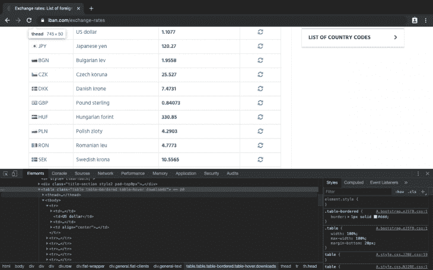
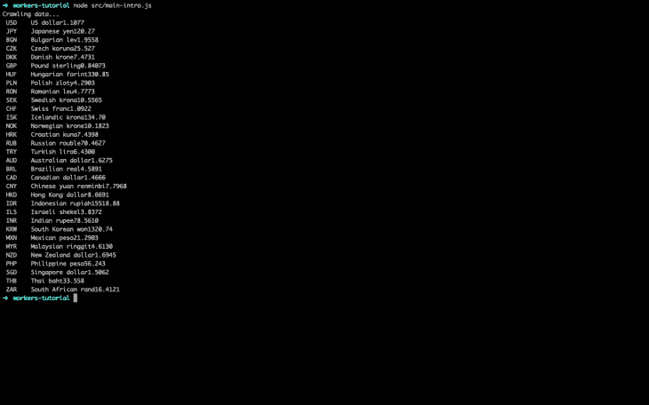
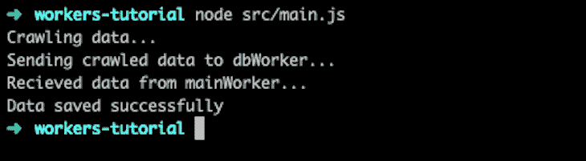
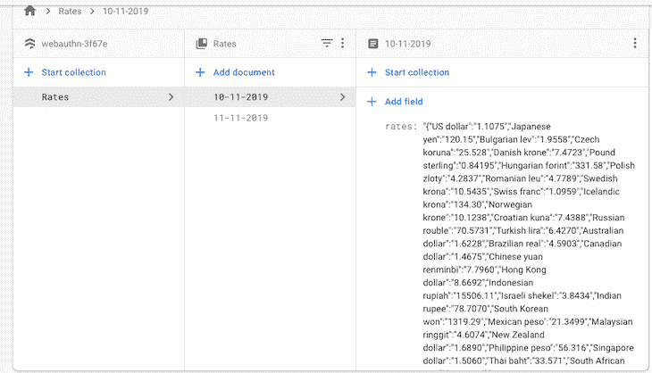
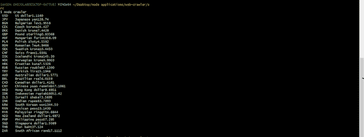

# Node.js 网页抓取教程- LogRocket 博客

> 原文：<https://blog.logrocket.com/node-js-web-scraping-tutorial/>

***编者的*** ***注*** : *本 Node.js 网页抓取教程最后更新于 2022 年 1 月 25 日；更新了所有过时的信息，并添加了关于节点爬网程序包的新部分。*

在这个 Node.js web 抓取教程中，我们将演示如何在 Node.js 中构建一个 web 爬虫来抓取网站并将检索到的数据存储在 Firebase 数据库中。我们的网络爬虫将使用 Node.js 工作线程执行网络抓取和数据传输。

以下是我们将要介绍的内容:

## 什么是网络爬虫？

网络爬虫，通常简称为 crawler 或称为 spiderbot，是一种系统地浏览互联网的机器人，通常用于[网络索引](https://en.wikipedia.org/wiki/Web_indexing)。这些互联网机器人可以被搜索引擎用来提高用户搜索结果的质量。

## Node.js 中的网页抓取是什么？

除了索引万维网，爬行还可以收集数据。这就是所谓的网页抓取。

网络抓取的用例包括从零售商网站或旅游网站的酒店列表中收集价格，从电子邮件目录中抓取销售线索，以及收集信息来训练机器学习模型。

根据网站的结构和提取的数据的复杂性，网页抓取的过程对 CPU 来说是相当繁重的。您可以使用工作线程来优化在 Node.js 中执行 web 抓取所需的 CPU 密集型操作。

## Node.js 网页抓取的安装

启动终端并为本教程创建一个新目录:

```
$ mkdir worker-tutorial
$ cd worker-tutorial

```

通过运行以下命令初始化目录:

```
$ yarn init -y

```

我们还需要以下包来构建爬虫:

如果你不熟悉如何建立一个 Firebase 数据库，查看一下[文档](https://firebase.google.com/docs/web/setup)，按照步骤 1 到 3 开始。

现在，让我们用下面的命令安装上面列出的软件包:

```
$ yarn add axios cheerio firebase-admin

```

## Node.js 中的工作者是什么？

在我们开始使用 workers 构建爬虫之前，让我们回顾一些基础知识。您可以在项目的根目录下创建一个测试文件`hello.js`，来运行下面的代码片段。

### 在 Node.js 中注册一个工人

可以通过从`worker_threads`模块导入`worker`类来初始化(注册)一个 worker，如下所示:

```
// hello.js

const { Worker } = require('worker_threads');

new Worker("./worker.js");

```

### 用 Node.js 中的 workers 打印`Hello World`

用 workers 打印出`Hello World`就像运行下面的代码片段一样简单:

```
// hello.js

const { Worker, isMainThread }  = require('worker_threads');
if(isMainThread){
    new Worker(__filename);
} else{
    console.log("Worker says: Hello World"); // prints 'Worker says: Hello World'
}

```

这个代码片段从`worker_threads`模块中提取 worker 类和`isMainThread`对象:

*   帮助我们知道何时在主线程或工作线程中运行
*   `new Worker(__filename)`用`__filename`变量注册一个新的工人，在本例中，变量是`hello.js`

### 与 Node.js 中的工作线程通信

当一个新的工作线程产生时，有一个允许线程间通信的消息传递端口。下面的代码片段显示了如何在工作线程之间传递消息:

```
// hello.js

const { Worker, isMainThread, parentPort }  = require('worker_threads');

if (isMainThread) {
    const worker =  new Worker(__filename);
    worker.once('message', (message) => {
        console.log(message); // prints 'Worker thread: Hello!'
    });
    worker.postMessage('Main Thread: Hi!');
} else {
    parentPort.once('message', (message) => {
        console.log(message) // prints 'Main Thread: Hi!'
        parentPort.postMessage("Worker thread: Hello!");
    });
}

```

在上面的代码片段中，我们在初始化一个工作线程后使用`parentPort.postMessage()`向父线程发送一条消息。然后，我们使用`parentPort.once()`监听来自父线程的消息。

我们还使用`worker.postMessage()`向工作线程发送消息，并使用`worker.once()`监听来自工作线程的消息。

运行代码会产生以下输出:

```
Main Thread: Hi!
Worker thread: Hello!

```

## 如何用 Node.js 创建网络爬虫？

让我们构建一个基本的 web 爬行器，它使用节点工作器来爬行和写入数据库。爬网程序将按以下顺序完成其任务:

1.  从[网站](https://www.iban.com/exchange-rates)获取(请求)HTML
2.  从响应中提取 HTML
3.  遍历 DOM 并提取包含汇率的表
4.  格式化表格元素(`tbody`、`tr`和`td`)并提取汇率值
5.  将汇率值存储在一个对象中，并使用`worker.postMessage()`将其发送给一个工作线程
6.  使用`parentPort.on()`在工作线程中接受来自父线程的消息
7.  在 Firestore (Firebase 数据库)中存储消息

让我们在项目目录中创建两个新文件:

*   `main.js`为主线程
*   `dbWorker.js`为工作线程

本教程的源代码可以在 GitHub 上找到。你可以随意复制它，叉它，或者提交一个问题。

## 我怎么用 Node.js 刮一个网站？

在主线程(`main.js`)中，我们将从 [IBAN 网站](https://www.iban.com/exchange-rates)中获取当前流行货币对美元的汇率。然后我们将导入`axios`,并用它通过一个简单的`GET`请求从站点获取 HTML。

我们还将使用`cheerio`来遍历 DOM 并从 table 元素中提取数据。为了知道要提取的确切元素，我们将在浏览器中打开 [IBAN 网站](https://www.iban.com/exchange-rates)，并加载[开发工具](https://www.google.com/search?q=devtools&oq=devtools&aqs=chrome..69i57j0l4j69i60l2j69i61.2226j0j7&sourceid=chrome&ie=UTF-8):



从上图中，我们可以看到带有类的`table`元素:

```
table table-bordered table-hover downloads. 

```

这将是一个很好的起点，我们可以将它输入到我们的`cheerio`根元素选择器中:

```
// main.js

const axios = require('axios');
const cheerio = require('cheerio');
const url = "https://www.iban.com/exchange-rates";

fetchData(url).then( (res) => {
    const html = res.data;
    const $ = cheerio.load(html);
    const statsTable = $('.table.table-bordered.table-hover.downloads > tbody > tr');
    statsTable.each(function() {
        let title = $(this).find('td').text();
        console.log(title);
    });
})

async function fetchData(url){
    console.log("Crawling data...")
    // make http call to url
    let response = await axios(url).catch((err) => console.log(err));

    if(response.status !== 200){
        console.log("Error occurred while fetching data");
        return;
    }
    return response;
}

```

使用 Node 运行上面的代码将得到以下输出:



接下来，我们将更新`main.js`文件，这样我们就可以正确格式化我们的输出，并将其发送到我们的工作线程。

### 更新主线程

为了正确格式化我们的输出，我们必须去掉空白和制表符，因为我们将把最终输出存储在`JSON`中。让我们相应地更新`main.js`文件:

```
// main.js
[...]
let workDir = __dirname+"/dbWorker.js";

const mainFunc = async () => {
  const url = "https://www.iban.com/exchange-rates";
  // fetch html data from iban website
  let res = await fetchData(url);
  if(!res.data){
    console.log("Invalid data Obj");
    return;
  }
  const html = res.data;
  let dataObj = new Object();
  // mount html page to the root element
  const $ = cheerio.load(html);

  let dataObj = new Object();
  const statsTable = $('.table.table-bordered.table-hover.downloads > tbody > tr');
  //loop through all table rows and get table data
  statsTable.each(function() {
    let title = $(this).find('td').text(); // get the text in all the td elements
    let newStr = title.split("\t"); // convert text (string) into an array
    newStr.shift(); // strip off empty array element at index 0
    formatStr(newStr, dataObj); // format array string and store in an object
  });

  return dataObj;
}

mainFunc().then((res) => {
    // start worker
    const worker = new Worker(workDir); 
    console.log("Sending crawled data to dbWorker...");
    // send formatted data to worker thread 
    worker.postMessage(res);
    // listen to message from worker thread
    worker.on("message", (message) => {
        console.log(message)
    });
});

[...]

function formatStr(arr, dataObj){
    // regex to match all the words before the first digit
    let regExp = /[^A-Z]*(^\D+)/ 
    let newArr = arr[0].split(regExp); // split array element 0 using the regExp rule
    dataObj[newArr[1]] = newArr[2]; // store object 
}

```

在上面的代码片段中，我们做的不仅仅是数据格式化；在`mainFunc()`解析之后，我们将格式化的数据传递给`worker`线程进行存储。

## 在 Node.js 中使用工作线程进行 web 抓取

在这个工作线程中，我们将初始化 Firebase，并监听来自主线程的抓取数据。当数据到达时，我们将把它存储在数据库中，并向主线程发回一条消息，确认数据存储成功。

负责上述操作的代码片段如下所示:

```
// dbWorker.js

const { parentPort } = require('worker_threads');
const admin = require("firebase-admin");

//firebase credentials
let firebaseConfig = {
    apiKey: "XXXXXXXXXXXX-XXX-XXX",
    authDomain: "XXXXXXXXXXXX-XXX-XXX",
    databaseURL: "XXXXXXXXXXXX-XXX-XXX",
    projectId: "XXXXXXXXXXXX-XXX-XXX",
    storageBucket: "XXXXXXXXXXXX-XXX-XXX",
    messagingSenderId: "XXXXXXXXXXXX-XXX-XXX",
    appId: "XXXXXXXXXXXX-XXX-XXX"
};

// Initialize Firebase
admin.initializeApp(firebaseConfig);
let db = admin.firestore();
// get current data in DD-MM-YYYY format
let date = new Date();
let currDate = `${date.getDate()}-${date.getMonth()}-${date.getFullYear()}`;
// recieve crawled data from main thread
parentPort.once("message", (message) => {
    console.log("Recieved data from mainWorker...");
    // store data gotten from main thread in database
    db.collection("Rates").doc(currDate).set({
        rates: JSON.stringify(message)
    }).then(() => {
        // send data back to main thread if operation was successful
        parentPort.postMessage("Data saved successfully");
    })
    .catch((err) => console.log(err))    
});

```

用 Node 运行`main.js`(包含`dbWorker.js`)将得到以下输出:



现在，您可以检查 Firebase 数据库，并查看以下已爬网数据:



## 使用节点爬虫抓取页面

我们上面实现的方法利用了两个不同的包(Axios 和 Cheerios)来获取和遍历网页。

只使用[节点爬虫](https://github.com/bda-research/node-crawler)，我们可以轻松地执行这些功能。node-crawler 在引擎盖下使用 Cheerio，并带有额外的功能，允许您定制您抓取和抓取网站的方式。

您可以指定选项，如一次可以执行的最大请求数(`maxConnections`)、请求之间允许的最短时间(`rateLimit`)、请求失败时允许的重试次数以及每个请求的优先级。

显然，节点爬虫有很多优点。让我们看看它的代码是如何工作的。

### 正在安装节点爬网程序

在项目目录中，运行以下命令:

```
npm install crawler

```

在名为`crawler.js`的文件中，添加以下代码:

```
const Crawler = require('crawler');
const crawlerInstance = new Crawler({
    maxConnections: 10,

    callback: (error, res, done) => {
        if (error) {
            console.log(error);
        } else {
            const $ = res.$;
            const statsTable = 
            $('.table.table-bordered.table-hover.downloads > tbody > tr');
            statsTable.each(function() {
                let title = $(this).find('td').text();
                console.log(title);
            });
        }
        done();
    }
});

crawlerInstance.queue('https://www.iban.com/exchange-rates');

```

这里，我们使用一个包——节点爬虫——来获取一个网页并遍历它的 DOM。我们将它的包导入到我们的项目中，并创建一个名为`crawlerInstance`的实例。

`maxConnection`选项指定一次要执行的任务数量。在这种情况下，我们将其设置为`10`。接下来，我们创建一个回调函数，它在获取网页后执行。行`const $ = res.$`使 Cheerio 在刚刚获取的网页中可用。

### 使用节点爬虫获取数据

接下来，类似于我们之前所做的，我们遍历 IBAN 汇率页面，获取表上的数据，并在控制台中显示它们。

`queue`函数负责获取网页的数据，在前面的例子中，这个任务是由 Axios 执行的。



要一次从多个网页获取数据，将所有 URL 添加到`queue`,如下所示:

```
crawlerInstance.queue(['https://www.iban.com/exchange-rates','http://www.facebook.com']);

```

默认情况下，node-crawler 使用实例化时创建的回调函数(全局回调)。要为特定任务创建自定义回调函数，只需将其添加到`queue`请求中:

```
crawlerInstance.queue([{
    uri: 'http://www.facebook.com',

    callback: (error, res, done) => {
        if (error) {
            console.log(error);
        } else {
            console.log('res.body.length');
        }
        done();
    }
}]);

```

### 使用节点爬虫添加瓶颈

如上所述，使用节点爬虫的一个优点是它允许你定制你的网络抓取任务，并给它们添加瓶颈。

现在，您可能想知道为什么需要有目的地给任务添加瓶颈。嗯，网站往往有反抓取机制，可以检测和阻止你的请求，如果他们都同时执行。

使用节点爬虫的`rateLimit`，可以在请求之间添加时间间隔，以确保它们不会同时执行。

如前所述，`maxConnection`还可以通过限制可以同时执行的查询数量来增加任务的瓶颈。以下是如何使用这两个选项:

```
const crawlerInstance = new Crawler({
    rateLimit: 2000,
    maxConnections: 1,
    callback: (error, res, done) => {
        if (error) {
            console.log(error);
        } else {
            const $ = res.$;
            console.log($('body').text());
        }
        done();
    }
});

```

当`rateLimit`设置为`2000`时，请求之间会有 2 秒的间隔。

## 使用刮网器合法吗？

虽然网络抓取很有趣，但如果你使用数据侵犯版权，它也可能是违法的。一般来说，建议您事先阅读您打算爬取的网站的条款和条件，以了解他们的数据爬取政策。

在开始你自己的 Node.js 网页抓取项目之前，你可以[了解更多关于网页抓取策略的信息](https://en.m.wikipedia.org/wiki/Web_crawler)。

使用工作线程并不能保证您的应用程序会更快，但如果有效使用，可以呈现这种幻影，因为它通过减少主线程上 CPU 密集型任务的麻烦来释放主线程。

## 结论

在本教程中，我们学习了如何构建一个抓取货币汇率并将其保存到数据库中的网络爬虫。我们还学习了如何使用工作线程来运行这些操作。

以下每个片段的源代码都可以在 [GitHub](https://github.com/Jordanirabor/workers-tutorial) 上找到。你可以随意复制它，叉它，或者提交一个问题。

## 200 只显示器出现故障，生产中网络请求缓慢

部署基于节点的 web 应用程序或网站是容易的部分。确保您的节点实例继续为您的应用程序提供资源是事情变得更加困难的地方。如果您对确保对后端或第三方服务的请求成功感兴趣，

[try LogRocket](https://lp.logrocket.com/blg/node-signup)

.

[](https://lp.logrocket.com/blg/node-signup)[https://logrocket.com/signup/](https://lp.logrocket.com/blg/node-signup)

LogRocket 就像是网络和移动应用程序的 DVR，记录下用户与你的应用程序交互时发生的一切。您可以汇总并报告有问题的网络请求，以快速了解根本原因，而不是猜测问题发生的原因。

LogRocket 检测您的应用程序以记录基线性能计时，如页面加载时间、到达第一个字节的时间、慢速网络请求，还记录 Redux、NgRx 和 Vuex 操作/状态。

[Start monitoring for free](https://lp.logrocket.com/blg/node-signup)

.