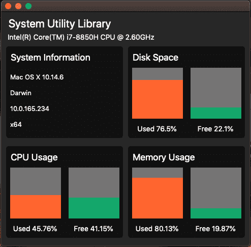
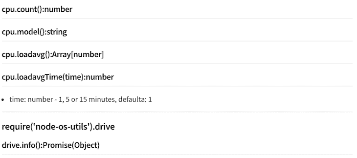

# 探索 NodeGUI 和 React NodeGUI:电子替代品

> 原文：<https://blog.logrocket.com/nodegui-react-nodegui-electron-alternatives/>

***编者按**:本文最后更新于 2021 年 12 月 16 日。*

与 Electron 类似， [NodeGUI](https://github.com/nodegui/nodegui) 是一个开源框架，用于构建跨平台的本机桌面应用程序，采用 JavaScript 和类似 CSS 的样式。您可以从一个代码库在 Mac、Windows 和 Linux 上运行 NodeGUI 应用程序。

NodeGUI 与 Electron 的区别在于，它由 [Qt5](https://www.qt.io/) 提供支持，这对于性能和内存来说都非常出色，但它确实迫使人们使用它们的组件，而不是像 Electron 那样使用 HTML。

在本文中，我们将探索 NodeGUI 框架，主要关注 React NodeGUI 模块，它使开发人员能够使用本机 React 和强大的 CSS 样式构建高性能的本机和跨平台桌面应用程序。

我们将开发一个可以在 Linux、Mac 和 Windows 操作系统上工作的系统实用程序监视器应用程序。我们还将使用 [react-node-gui-starter](https://github.com/nodegui/react-nodegui-starter) 项目来引导我们的应用程序并快速启动和运行。

### 先决条件

要跟随本教程，请确保具备以下条件:

*   Node.js 已安装
*   IDE
*   终端应用程序，如用于 Mac 的 iTerm2 和用于 Windows 的 Hyper
*   熟悉 TypeScript、React 和 CSS

### 目录

## 构建系统实用程序监视器应用程序

我们将构建一个简单的应用程序，动态显示操作系统的 CPU、内存和磁盘空间，以及一些与操作系统相关的附加统计信息。

你可以在这个 [GitHub repo](https://github.com/nodegui/react-nodegui-starter) 上访问这个项目的代码。最终结果将如下图所示:



## 设置我们的 React 节点 GUI 项目

首先，在您的终端应用程序中运行以下代码，这将克隆启动应用程序:

```
# Clone this repository
git clone https://github.com/nodegui/react-nodegui-starter

# Go into the repository
cd react-nodegui-starter

# Install dependencies
npm install

```

我们需要再安装一个 npm 包，以便访问我们的系统信息:

```
npm i node-os-utils

```

[node-os-utils](https://www.npmjs.com/package/node-os-utils) 是一个操作系统实用程序库。有些方法是 Node.js 库的包装器，有些是模块进行的计算。

## 应用程序脚本和开发

starter 应用程序提供了一些我们可以运行的 npm 脚本:

```
"build": "webpack -p",
"start": "webpack && qode ./dist/index.js",
"debug": "webpack && qode --inspect ./dist/index.js",
"start:watch": "nodemon -e js,ts,tsx --ignore dist/ --ignore node_modules/ --exec npm start"

```

对于开发，我们将运行以下命令:

```
npm run start:watch

```

运行上面的命令将启动应用程序，并允许热重装。您可能已经注意到了一个新的窗口加载，它是跨平台的 React NodeGUI 桌面应用程序。

## 全局和系统详细信息帮助程序

首先，我们想要创建一个`globals.ts`文件，在这里我们将存储与我们的应用程序相关的全局信息。在`src`目录中，创建一个名为`helpers`的目录。在`helpers`中，创建一个名为`globals.ts`的文件，并添加以下代码:

```
const colors = {
    red: '#FF652F',
    yellow: '#FFE400',
    green: '#14A76C'
}

const labels = {
    free: 'Free',
    used: 'Used'
}

export const globals = {      
    colors,
    labels
}

```

在上面的代码片段中，我们创建了两个对象，`colors`和`labels`，我们将把它们添加到
`globals`对象中，然后导出。注意，我们在 globals 对象中只使用了`colors`和`labels`变量名，这是 ES6 中的`Object`属性值简写。

如果您想定义一个对象，它的键与作为属性传入的变量同名，您可以使用简写方式，只需传递键名。

`[export](https://developer.mozilla.org/en-US/docs/web/javascript/reference/statements/export)`语句用于在创建 JavaScript 模块时从模块中导出函数、对象或基元值，因此其他程序也可以使用 [`import`](https://developer.mozilla.org/en-US/docs/Web/JavaScript/Reference/Statements/import) 语句。

接下来，我们将在`systemDetails.ts`文件中使用`globals.ts`文件，我们也可以在`helpers`目录中创建该文件:

```
// Import External Dependencies
const osu = require('node-os-utils')

// Destructure plugin modules
const {os, cpu, mem, drive} = osu

// Import Globals
import { globals } from "./globals"

// Use ASYNC function to handle promises
export const systemDetails = async () => {
    // Static Details
    const platform = cpu.model()
    const operatingSystem = await os.oos()
    const ip = os.ip()
    const osType = os.type()
    const arch = os.arch()

    // CPU Usage
    const cpuUsed= await cpu.usage()
    const cpuFree = await cpu.free()

    // Memory Usage
    const memUsed = await mem.used()
    const memFree = await mem.free()

    // Disk Space Usage
    const driveInfo = await drive.info()
    const memUsedPercentage = memUsed.usedMemMb / memUsed.totalMemMb * 100
    const memFreePercentage = memFree.freeMemMb / memFree.totalMemMb * 100

    const systemInformation = {
      staticDetails: {
        platform,
        operatingSystem,
        ip,
        osType,
        arch
      },
      cpuDetails: {
        cpuUsed: {
          usage: cpuUsed,
          label: globals.labels.used,
          color: globals.colors.red
        },
        cpuFree: {
          usage: cpuFree,
          label: globals.labels.free,
          color: globals.colors.green
        }
      },
      memoryDetails: {
        memUsed: {
          usage: memUsedPercentage,
          label: globals.labels.used,
          color: globals.colors.red
        },
        memFree: {
          usage: memFreePercentage,
          label: globals.labels.free,
          color: globals.colors.green
        }
      },
      driveDetails: {
        spaceUsed: {
          usage: driveInfo.usedPercentage,
          label: globals.labels.used,
          color: globals.colors.red
        },
        spaceFree: {
          usage: driveInfo.freePercentage,
          label: globals.labels.free,
          color: globals.colors.green
        }
      }
    }
    return systemInformation
}

```

我们需要 [node-os-utils](https://www.npmjs.com/package/node-os-utils) npm 包，我们将使用它来获取我们所有的系统信息。node-os-utils 主要依赖于本机 Node.js 库，这使得它与 NodeGUI 非常兼容。

接下来，我们使用 [JavaScript ES6 析构](https://hacks.mozilla.org/2015/05/es6-in-depth-destructuring/)将变量分配给我们将在 node-os-utils 包中使用的函数。

我们导入自己创建的`globals`对象。就像我们在`globals.ts`文件中使用 export 语句一样，我们现在再次使用它，但是这一次，我们将导出异步函数`systemDetails`。

node-os-utils 库主要使用 [JavaScript 和 ES6 promises](https://alligator.io/js/promises-es6/) 返回数据，允许我们使用 async/await 函数检索数据。使用 async/ await，我们可以在后台执行异步任务的同时编写完全同步的代码。我个人发现，使用 async/await 函数会产生非常干净、简洁和可读的代码。

为了获得系统信息，我们将在返回承诺的函数调用前使用 node-os-utils 库和`await`操作符。在 node-os-utils 库描述中，您可以确切地看到每个函数调用返回的内容:



## node-os-utils 函数

然后，我们使用函数调用返回的所有值来创建由`systemDetails`函数返回的`systemInformation`对象。现在，我们准备使用`systemInformation`并创建应用程序接口。

## 应用程序界面和设计

在这个阶段，我们的应用程序看起来不太像，但是我们将要改变这一点。在`src`目录中，创建一个`components`目录，并添加以下三个组件文件:

*   `InnerContainer.tsx`
*   `statsColumn.tsx`
*   `statsRow.tsx`

接下来，我们需要更新`src`目录中的`index.tsx`文件。首先，让我们删除应用程序中不会用到的所有代码，留下一个干净的`index.tsx`文件，如下所示:

```
// Import External Dependencies
import {Window, Renderer, View, Text} from "@nodegui/react-nodegui"
import React, { useState, useEffect } from "react"

// Import System Details
import { systemDetails } from "./helpers/systemDetails"

// Application width and height
const fixedSize = { width: 490, height: 460 }

// Function React Component
const App = () => {
  return (
    <Window minSize={fixedSize} maxSize={fixedSize} styleSheet={styleSheet}>
      <View id="container">
        <Text id="header">System Utility Monitor</Text>
      </View>
    </Window>
  )
}

// Application Stylesheets
const styleSheet = `
  #container {
    flex: 1;
    flex-direction: column;
    min-height: '100%';
    align-items: 'center';
    justify-content: 'center';
  }
`

// Render the application
Renderer.render(<App />)

```

如果你以前用过 React Native，上面的语法可能看起来很熟悉；与 React Native 类似，我们没有使用 HTML 的自由。相反，我们使用框架提供的预定义组件，如`View`和`Text`。

在上面的代码中，我们再次使用 JavaScript ES6 析构语法导入模块和函数。然后我们声明一个常量`fixedSize`，我们将使用它来指定应用程序窗口的最小和最大宽度。

接下来，我们将创建一个功能性的 React 组件，我们将在其中构建应用程序。我们不会涉及 React 的基础知识，所以如果你不熟悉 React 钩子，一定要查看一些教程。
如果你想更深入地了解 React 理论，可以看看这篇详细描述了 [React 功能组件](https://www.robinwieruch.de/react-function-component/)的复杂性的文章。此外，查看 React 钩子上的官方 React 文档,它可以从 React v 16.8 获得，是对框架的一个很好的补充。

NodeGUI React 框架的第一个组件是`[<Window/>](https://docs.nodegui.org/#/api/QMainWindow)`组件。一个`QMainWindow`提供了一个主应用程序窗口。NodeGui 中的每个小部件都应该是 QMainWindow 的子部件或嵌套子部件。NodeGui 中的 QMainWindow 还负责其子节点的 FlexLayout 计算。

我们提供`<Window/>`组件`minSize`、`maxSize`和`styleSheet`道具。第 22 行声明了`styleSheet`常量。嵌套在`<Window/>`组件中的是一个`<View/>`组件。一个`QWidget`可以用来封装其他部件并提供结构。它的功能类似于网络世界中的`div`。在`<View/>`组件中有一个`<Text/>`组件，一个`QLabel`组件提供了添加和操作文本的能力。

然后我们声明一个`styleSheet`常量，它是一个模板字符串。模板文字是允许嵌入表达式的字符串文字。您可以对模板文字使用多行字符串和字符串插值功能。在 ES2015 规范的早期版本中，它们被称为模板字符串。

NodeGUI 框架并不支持所有的 CSS 属性，在某些情况下，需要参考 [Qt 文档](https://doc.qt.io/archives/qt-4.8/stylesheet-reference.html#list-of-properties)来确定使用哪一个。因此，造型可能有点棘手。

例如，属性`overflow:scroll`在 Qt CSS 中不存在，因此需要为该功能实现其他解决方法，如这个 [GitHub 问题线程](https://github.com/nodegui/react-nodegui/issues/22)。

关于 Flexbox 支持，NodeGUI 框架按照 [Yoga 框架](https://yogalayout.com/)支持所有属性和所有布局，这也被 React Native 和 ComponentKit 等框架使用。

最后，我们将呈现我们的应用程序。既然应用程序的基础已经就绪，我们需要集成系统信息，并使用我们创建的组件显示它。

## 反应钩子的初始数据对象

在我们使用系统数据之前，我们需要一个初始数据对象，应用程序将在使用从`systemDetails`函数返回的数据填充之前使用这个对象。在`helpers`目录中，创建一个新文件`initialData.ts`，并添加以下代码:

```
export const initialData = {
    staticDetails:{
      platform: 'Loading System Data...',
      operatingSystem: '',
      ip: '',
      osType: '',
      arch: ''
    },
    cpuDetails:{
      cpuUsed: {
        usage: '',
        label: 'Loading',
        color: ''
      },
      cpuFree: {
        usage: '',
        label: 'Loading',
        color: ''
      }
    },
    memoryDetails:{
      memUsed: {
        usage: '',
        label: 'Loading',
        color: ''
      },
      memFree: {
        usage: '',
        label: 'Loading',
        color: ''
      }
    },
    driveDetails: {
      spaceUsed: {
        usage: '',
        label: 'Loading',
        color: ''
      },
      spaceFree: {
        usage: '',
        label: 'Loading',
        color: ''
      }
    }
  }

```

如您所见，这模仿了由`systemDetails`函数返回的`systemInformation`对象。让我们把它添加到`index.ts`文件中，如下所示:

```
...
// Import System Details
import { systemDetails } from "./helpers/systemDetails"
import { initialData } from "./helpers/initialData"
...

```

## 将数据投入使用

React 钩子可能是我在过去几年中 JavaScript 生态系统中最喜欢的发展之一，它允许清晰、简洁的代码易于阅读和维护。

让我们从实现我们之前导入的 React `setState`钩子开始。在`App` functional React 组件中添加以下代码:

```
  // Array destructure data and setData function
  const [data, setData] = useState(initialData)

```

这里有很多东西需要解开，尤其是如果你是 React Hooks 的新手。要了解更多信息，我建议观看以下视频:

 [https://www.youtube.com/embed/mxK8b99iJTg?version=3&rel=1&showsearch=0&showinfo=1&iv_load_policy=1&fs=1&hl=en-US&autohide=2&wmode=transparent](https://www.youtube.com/embed/mxK8b99iJTg?version=3&rel=1&showsearch=0&showinfo=1&iv_load_policy=1&fs=1&hl=en-US&autohide=2&wmode=transparent)

视频

如果我们`console.log()`数据常量，我们将看到我们的`initialData`对象已经被分配给数据常量。现在，让我们再次使用一些析构来为应用程序中的静态数据分配我们需要的变量:

```
  //Get Static Data
  const {platform, operatingSystem, ip, osType, arch} = data.staticDetails

```

目前，`data`常量仍然指向我们创建的`initialData`对象。让我们使用`useEffect()`钩子用来自`systemsDetail`函数的数据更新我们的状态。我们可以通过将下面的代码添加到`index.tsx`文件中，就在`useState()`钩子之后:

```
...
const [data, setData] = useState(initialData)

useEffect(() => {
  const getSystemData = async () => {
    const sysData : any = await systemDetails()
    setData(sysData)
  }
  getSystemData()
})

//Get Static Data
...

```

现在，如果我们`console.log()`这个数据常量，我们会看到它不断地被新数据更新。请务必仔细阅读 [`useEffect`钩子和异步/等待功能](https://dev.to/n1ru4l/homebrew-react-hooks-useasynceffect-or-how-to-handle-async-operations-with-useeffect-1fa8)。

我们可以在应用程序标题下添加以下代码，它将显示系统平台:

```
<Text id="subHeader">{platform}</Text>

```

现在，我们已经为我们的应用程序打下了基础。我们需要的只是建筑和装饰。

## 样式和组件

让我们首先用下面的代码替换`index.tsx`文件中的`styleSheet`常量:

```
// Application Stylesheets
const styleSheet = `
  #container {
    flex: 1;
    flex-direction: column;
    min-height: '100%';
    height: '100%';
    justify-content: 'space-evenly';
    background-color: #272727;
  }
  #header {
    font-size: 22px;
    padding: 5px 10px 0px 10px;
    color: white;
  }
  #subHeader {
    font-size: 14px;
    padding: 0px 10px 10px 10px;
    color: white;
  }
`

```

到目前为止，我们已经使用了相当标准的 CSS 样式，但是随着我们的继续，我们将会看到一些边缘情况。让我们用下面的代码填充第一个组件`StatsRow.tsx`文件:

```
// Import External Dependencies
import React from 'react'
import {View} from "@nodegui/react-nodegui"

export const StatsRow = (props: { children: React.ReactNode; }) => {
  return (
      <View id="systemStats" styleSheet={styleSheet}>
          {props.children}
      </View>
  )
}

const styleSheet = `
  #systemStats {
    width: 470;
    height: 180;
    flex: 1;
    flex-direction: row;
    justify-content: 'space-between';
    margin-horizontal: 10px;
  }
`

```

注意上面的`props.children`属性及其与 TypeScript 一起使用的语法。让我们通过向`index.tsx`文件添加以下代码来导入`StatsRow`组件:

```
...
// Import Components
import {StatsRow} from "./components/StatsRow"
...

```

我们将使用`StatsRow`组件在我们的应用程序中创建两行，但是在使用它之前，让我们先通过添加以下代码来填充`innerContainer.tsx`:

```
// Import External Dependencies
import React from 'react'
import {View, Text} from "@nodegui/react-nodegui"

// Set Types
type InnerContainerColumnProps = {
    title: string
}

export const InnerContainer: React.FC<InnerContainerColumnProps> = props => {
  // Desctructure props
  const {title, children} = props

  return (
      <View id="innerContainer" styleSheet={styleSheet}>        
          <Text id="headText">{title}</Text>
          <View id="stats">
            {children}
          </View>
      </View>
  )
}

const styleSheet = `
  #innerContainer {
    height: 180;
    width: 230;
    background: #111111;
    border-radius: 5px;
  }
  #stats {
    flex-direction: row;
    align-items: 'flex-start';
    justify-content: 'flex-start';
  }

  #headText {
      margin: 5px 5px 5px 0;
      font-size: 18px;
      color: white;
  }
`

```

注意，我们已经涵盖了上面的大部分代码，但是我们需要采取一些额外的措施来在我们的 React 组件中容纳 [TypeScript。](https://blog.logrocket.com/using-typescript-with-react-tutorial-examples/)将以下代码添加到`index.tsx`文件中:

```
...
// Import Components
import {StatsRow} from "./components/StatsRow"
import {InnerContainer} from "./components/InnerContainer"
...

```

让我们完成最后一个组件，`StatsColumn.tsx`，然后将它们一起放到`index.tsx`文件中。我将把代码分成两部分，我们应该把它们结合起来；第一部分是没有样式的组件，第二部分是样式:

```
// Import External Dependencies
import React from 'react'
import {View, Text} from "@nodegui/react-nodegui"

// Set Types
type StatsColumnProps = {
    label: string,
    usage: number,
    color: string
}

export const StatsColumn: React.FC<StatsColumnProps> = props => {
    // Destructure props
    const {usage, color, label} = props

    // Create Label with usage amount and percentage
    const percentageTextLabel = `${label} ${Math.round(usage * 100) / 100}%`

    // Create Dynamic Style Sheet
    const dynamicStyle = `
        height: ${usage};
        background-color: ${color};
    `

    return (
        <View id="statsContainer" styleSheet={statsContainer}>
            <View id="columnContainer" styleSheet={columnContainer}>   
                <View id="innerColumn" styleSheet={dynamicStyle}></View>
            </View>
            <Text id="statsLabel" styleSheet={statsLabel}>{percentageTextLabel}</Text>
        </View>
    )
}

```

我们使用这个组件来创建图形效果，正如您在最终的应用程序屏幕截图中看到的那样。我们将`label`、`usage`和`color`属性传递给组件，我们将使用它们来动态更新组件。

在前面的代码块下，继续添加以下代码片段:

```
const statsContainer = `
    #statsContainer {
        height: '140';
        text-align:center;
        justify-content: 'center';
        align-items: 'center';
        justify-content: 'space-between';
        width: 100%;
        flex: 1 0 100%;
        margin-horizontal: 5px;
    }
`

const columnContainer = `
    #columnContainer{
        height: 100%;
        flex: 1 0 100%;
        flex-direction: column-reverse;
        background-color: #747474;
        width: 100%;
    }
`

const statsLabel = `
    #statsLabel {
        height: 40;
        color: white;
        font-size: 14px;
        width: 100%;        
        qproperty-alignment: 'AlignCenter';
        color: white;
    }
`

```

创建`styleSheet`块的另一种方法是将每个样式属性声明为自己的常量。然而，您使用的方法并没有太大的区别，它更多的是开发者的偏好。

您可能还注意到了 CSS 属性`qproperty-alignment:'AlignCenter';`，这是一个用于对齐文本的 Qt 属性。我花了一些时间来解决这个问题，所以如果你遇到类似的警告，你可以使用这个 [Qt 样式表参考](https://doc.qt.io/qt-5/stylesheet-syntax.html)。

## 添加样式

让我们将最终组件导入到`index.tsx`文件中:

```
// Import Components
import {StatsRow} from "./components/StatsRow"
import {InnerContainer} from "./components/InnerContainer"
import {StatsColumn} from "./components/StatsColumn"

```

向`index.tsx`文件中的`styleSheet`常量添加以下样式:

```
...
  #subHeader {
    font-size: 14px;
    padding: 0px 10px 10px 10px;
    color: white;
  }

  #headText {
    margin: 5px 5px 5px 0;
    font-size: 18px;
    color: white;
  }
  #infoText {
    padding: 5px 0 0 5px;
    color: white;
  }
  #informationContainer {
    height: 180;
    width: 230;
    background: #111111;
    border-radius: 5px;
  }
...

```

现在，让我们为我们的应用程序添加第一部分内容。在`index.tsx`文件中的`<Textid="subHeader">`组件下，添加以下代码:

```
...
<StatsRow>
   <View id="informationContainer" styleSheet={styleSheet}>
      <Text id="headText">System Information</Text>
      <Text id="infoText">{operatingSystem}</Text>
      <Text id="infoText">{osType}</Text>
      <Text id="infoText">{ip}</Text>
      <Text id="infoText">{arch}</Text>
    </View>
</StatsRow>
...

```

由于样式不能被子组件继承的警告，我们需要在主`<Window>`组件中引用`<View id="informationContainer">`中的`styleSheet`之后再引用它。

* * *

### 更多来自 LogRocket 的精彩文章:

* * *

您会注意到，现在，我们的应用程序第一次开始像一个实际的应用程序。让我们添加创建图表的代码。在`useEffect()`挂钩下面，添加以下代码:

```
const renderCpuDetails = () => {
  const cpuDetails = data.cpuDetails
  return Object.keys(cpuDetails).map((key) => {
      const stat = cpuDetails[key]
      return <StatsColumn label={stat.label} usage={stat.usage} color={stat.color}  />
  })
}

const renderMemoryDetails = () => {
  const memDetails = data.memoryDetails
  return Object.keys(memDetails).map((key) => {
      const stat = memDetails[key]
      return <StatsColumn label={stat.label} usage={stat.usage} color={stat.color}  />
  })
}

const renderDriveDetails = () => {
  const driveDetails = data.driveDetails
  return Object.keys(driveDetails).map((key) => {
      const stat: any = driveDetails[key]
      return <StatsColumn label={stat.label} usage={stat.usage} color={stat.color}  />
  })
}

```

在上面的代码中，我们循环遍历各自的对象键，然后使用这些值作为`<StatsColumn/>`组件的道具。

然后，我们可以在代码中使用这些函数，方法是用以下内容更新`index.tsx`文件:

```
<StatsContainer>
    <View id="informationContainer" styleSheet={styleSheet}>
      <Text id="headText">System Information</Text>
      <Text id="infoText">{operatingSystem}</Text>
      <Text id="infoText">{osType}</Text>
      <Text id="infoText">{ip}</Text>
      <Text id="infoText">{arch}</Text>
    </View>
  <InnerContainer title={"Disk Space"}>
    {renderDriveDetails()}
  </InnerContainer>
</StatsContainer>
<StatsContainer>
  <InnerContainer title={"CPU Usage"}>
    {renderCpuDetails()}
  </InnerContainer>
  <InnerContainer title={"Memory Usage"}>
    {renderMemoryDetails()}
  </InnerContainer>
</StatsContainer>

```

在上面的代码中，我们执行了之前声明的三个函数，这三个函数依次呈现了`Disk Space`、`CPU Usage`和`Memory Usage`列。

## 结论

在本文中，我们探索了 NodeGUI 框架和 React NodeGUI 模块，方法是构建一个系统实用程序监视应用程序，该应用程序动态显示操作系统的 CPU、内存和磁盘空间，以及一些与操作系统相关的统计数据。现在，您应该熟悉 NodeGUI 作为电子产品的替代产品的优势。我希望你喜欢这篇文章！

## 使用 LogRocket 消除传统反应错误报告的噪音

[LogRocket](https://lp.logrocket.com/blg/react-signup-issue-free)

是一款 React analytics 解决方案，可保护您免受数百个误报错误警报的影响，只针对少数真正重要的项目。LogRocket 告诉您 React 应用程序中实际影响用户的最具影响力的 bug 和 UX 问题。

[ ](https://lp.logrocket.com/blg/react-signup-general) [  ](https://lp.logrocket.com/blg/react-signup-general) [LogRocket](https://lp.logrocket.com/blg/react-signup-issue-free)

自动聚合客户端错误、反应错误边界、还原状态、缓慢的组件加载时间、JS 异常、前端性能指标和用户交互。然后，LogRocket 使用机器学习来通知您影响大多数用户的最具影响力的问题，并提供您修复它所需的上下文。

关注重要的 React bug—[今天就试试 LogRocket】。](https://lp.logrocket.com/blg/react-signup-issue-free)