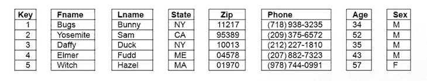
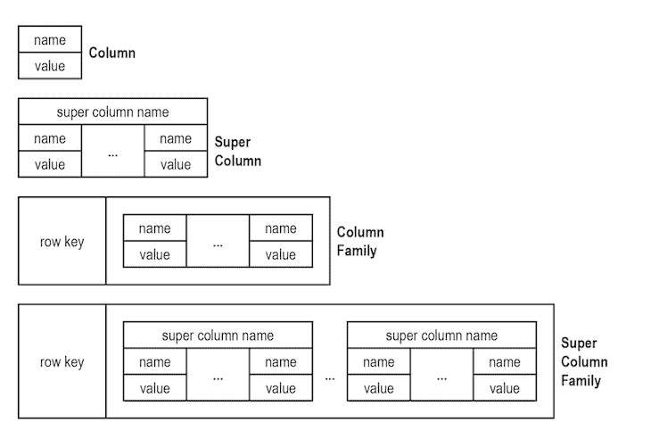
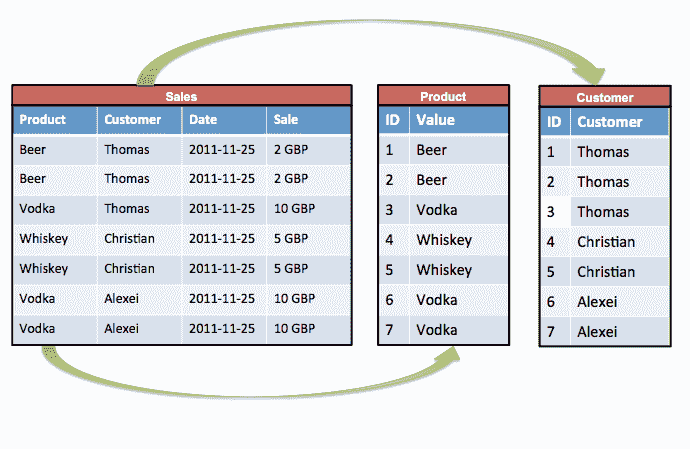

# NoSQL 宽栏商店揭秘

> 原文：<https://blog.logrocket.com/nosql-wide-column-stores-demystified/>

许多人认为 NoSQL 是古老的技术。然而，在数据库的世界里，NoSQL 被认为是一个婴儿——尽管它早在 70 年代就已经存在了。这怎么可能呢？

嗯，NoSQL 直到 2000 年代末才真正流行起来，当时谷歌和亚马逊都投入了大量的研究和资源。从那以后，它的受欢迎程度和实用性呈指数级增长，几乎每个大网站和公司都以某种方式利用 NoSQL。

另一个常见的误解是，NoSQL 可能比它的语义对应物 SQL 更好或更差。相反，这两种数据库类型适用于不同类型的数据，因此永远不会相互替代或相互超越。

不涉及太多细节，SQL 数据库有一个预定义的模式，而 NoSQL 数据库是动态的，非常适合非结构化数据。NoSQL 数据库可以使用模式，尽管这不是强制性的。

记住这一点，今天，我们将看看一个不太复杂的 NoSQL 数据库管理系统:宽列存储，也称为列系列。这种 NoSQL 模型将数据存储在列中而不是行中。因此，它非常适合查询，但对于大型数据集来说不是最佳选择。

然后，我们将浏览以下解释，这些解释对于正确使用宽列存储至关重要:

## 不同的 NoSQL 数据库管理系统

首先，让我们来看看四个主要的 [NoSQL 数据库](https://hostingdata.co.uk/nosql-database/)管理系统。这将有助于我们更好地理解柱族如此受欢迎的原因:

#### 1.`keyvaluestores`

最简单的类型是键值存储。 [Redis 就是一个例子](https://blog.logrocket.com/guide-to-fully-understanding-redis/)；每一项都有一个属性名/键和值。

#### 2.`documentdatabases`

文档数据库，比如 [MongoDB](https://blog.logrocket.com/using-mongodb-in-a-rust-web-service/) ，将键与一个称为文档的复杂数据模式相关联。嵌套文档和键-数组/值对可以包含在每个文档中。

#### 3.`graphdatabases`

像 [Neo4j](https://blog.logrocket.com/getting-started-with-neo4j/) 这样的图形数据库对社交关系等网络信息进行分类。每个反映数据(属性)的节点(或顶点，即事物、地点、人、类别等)的集合被给予标签(边)以建立不同节点之间的关系。

#### 4.`widecolumnstores`

宽列围绕列而不是行存储结构化数据；HBase 和 Apache Cassandra 就是两个例子。通常，支持列族—以与关系数据库表类似的方式统一使用多个列。

## 什么是宽栏商店？

宽列存储使用典型的表、列和行，但与关系数据库(RDB)不同，在同一表中，列的格式和名称可以因行而异。每一列都单独存储在磁盘上。

列式数据库将每一列存储在单独的文件中。一个文件只存储键列，另一个文件只存储名字，另一个文件存储 ZIP，依此类推。一行中的每一列都由自动索引控制—每一列几乎都作为一个索引运行—这意味着扫描/查询的列偏移量对应于各自文件中该行中的其他列偏移量。

当查询单个行的多个列时，传统的面向行的存储为您提供了最佳性能。当然，关系数据库是围绕保存非常具体的信息的列构建的，为每个条目保持这种特异性。例如，让我们以一个客户表为例。列值包含客户姓名、地址和联系信息。每个客户都有相同的格式。

柱状家庭就不一样了。他们给你自动垂直分割；存储既基于列，又按限制较少的属性进行组织。RDB 表也被限制为基于行的存储，并且在行中处理元组存储，在向前移动之前考虑所有属性；例如，元组 1 属性 1、元组 1 属性 2 等等，然后是元组 2 属性 1、元组 2 属性 2 等等。与之相反的是列存储，这也是我们使用列族这个术语的原因。

> **注意**:一些列式系统也可以选择默认的水平分区，比如 600 万行。当需要运行扫描时，这消除了在实际查询期间进行分区的需要。设置您的系统，默认情况下根据最常用的列对其水平分区进行排序。这将最小化包含您正在寻找的值的范围的数量。

如果提供的话，一个有用的选项(InfiniDB 就是一个这样的例子)是基于最近的查询自动创建水平分区。这消除了不再重要的旧查询的影响。

## 列族数据库对象

族(数据库对象)包含相关信息的列。对象是一个由键-值对组成的元组，其中键链接到一个值，而值是一组列。一个系列可以是一个属性或一组相关的属性。

我们可以将第一个列模型称为实体/属性/值表。在实体(列)内部，有一个值/属性表。对于客户数据，第一列选项可能有以下内容:

| 客户 ID | 属性 | 价值 |
| 0001 | 名字 | 简·多伊 |
| 0001 | 电话号码 1 | 100200300 |
| 0001 | 电子邮件 | [【电子邮件保护】](/cdn-cgi/l/email-protection) |

与 RDB 相比，属性/值表在输入更独特的属性时会大放异彩。

| 客户 ID | —————– | 0001 |
| 0001 | 经常抱怨的问题 | —————– |
|  | 业余爱好 | 流行音乐 |
| 属性 |  | 缝纫 |
| —————– | 价值 | 超级列保存相同的信息，但格式不同。 |

客户编号:0001

| Customer ID: 0001 |  |
|  | 属性 |
| 价值 | —————– |
| —————– | 经常抱怨的问题 |
| 流行音乐 | 业余爱好 |
| 缝纫 | 超级列族和超级列只是为前两个模型添加了一个行 ID，因此可以更快地获得数据。使用与实体一样多的超级列模型。将它们放在单独的 NoSQL 表中或编译为超级列族。 |

两种主要的柱状族类型

### 1.`columnarrelationalmodels`

#### 列型存储可以集成列关系模型，即使它们也被认为是 NoSQL 的一部分。

2.`keyvaluestores`

#### 键值存储和/或大表。

列关系模型:优点和缺点

## 优势

### 当以属性方式存储时，列关系模型允许改进属性的压缩。每个文件中的所有数据都属于同一数据文件。

假设您有几十个共享相同属性的条目。您可以通过该属性选择所有元组，然后使用 ID 范围对其进行进一步筛选(例如，仅筛选 ID 为 230 到 910 的元组)。这种压缩需要更少的存储，更令人印象深刻的是更快的查询。

例如，假设您正在寻找一个值大于 x 的元组集合，您不需要搜索所有的元组并收集值大于 x 的元组，而是简单地定位该值并跳过任何不符合条件的元组；因此，检查的磁盘块/字节更少。通常，如果只查询一个属性，查询速度会更快。

每个属性都单独存储在块中，这使得每个磁盘块搜索中可以搜索的元组和属性的比例更大。决策过程更快。列关系模型的另一个相关优势是更快的连接。

每次派生新属性添加到数据库中时，添加新列也容易得多。列数据库只需为新列创建另一个文件，而不需要重新构建巨大的表。

不足之处

### 就缺点而言，更新可能是低效的。例如，假设您想要更新多个属性的特定元组。RDB 模型可以做得更快。与元组行相反，列式家族对属性进行分组，这一事实与此相反；在这种情况下，更新多个属性需要比 RDB 更多的块。

如果一个连接或查询涉及多个属性，这也可能导致列存储的性能降低(但是其他因素也会起作用)。当从列式系统中删除行时，速度也会变慢，因为需要从每个记录文件中删除一条记录。

总的来说，列式家族适用于 OLAP(在线分析处理)，但不适用于 OLTP(在线事务处理)。下面让我们更详细地探讨一下 [OLTP 与 OLAP](https://www.guru99.com/oltp-vs-olap.html) 的场景。

OLTP 应用程序中的查询

## 通常，在这种情况下，对数据库的很小一部分进行单次更新，例如一个或几个帐户元组。然而，它们将需要处理多个属性，这将使 RDB 在速度上具有优势。

约翰·史密斯打电话给客户服务部，你可以通过他的客户 ID 或电话号码找到他的信息。虽然电话号码可能不是唯一的，但它会缩小可供选择的帐户范围。这是一个交易场景，而不是一个分析场景。

所以列数据库更适合 OLTP 系统？错误—您不应该尝试在列数据库上执行 OLTP 类型(单行操作)的事务。当这个过程通过面向行的系统执行时，它只是在表的末尾(最后一页)添加一个新条目(行)。

相反，列式系统需要向每个相应的文件添加/附加新值。数据库中的行数越多，对性能的影响就越大(不要这样做:批量插入是快速插入大量数据的一种可能的解决方案)。

OLAP 应用程序中的查询

## 通常情况下，如果您正在执行寻找元数据见解的查询，例如表中所有帐户值的平均值(总和)，与我们的 RDB 模型相比，列数据库可以更快地访问特定列，并且更快地进行聚合和汇总。

也许你想知道男性顾客的平均年龄。这通常会导致顺序扫描，这是一个性能杀手。假设您有 1 亿行条目，每行 100 列。要么你需要创建关于性别的复合索引，要么读取所有条目来过滤目标数据，这可能是千兆字节或兆兆字节的工作。

与读取无数行/列的元组(包含大量数据)不同，列系统允许您通过只扫描与查询实际相关的两三列来缩小需要研究的元组的范围。

关键要点以及如何调整您的方法

## 列数据库在垂直分区(过滤掉查询中不相关的列，非常适合分析查询)、水平分区(通过消除不相关的范围来提高效率)、更好的压缩和列的自动索引方面为您提供了改进的自动化。

在类似于 InfiniDB 的系统中，您将能够对大多数命令使用标准的 MySQL 语法。比如:`create table`、`select`、`insert`等等。您会发现一些例外，例如缺少笛卡尔积和触发器支持。

最后，将您的[标准 SQL/MySQL 知识与前端](https://blog.logrocket.com/sql-isnt-a-dinosaur-and-it-s-not-dead-you-should-use-it-4e18c4fc5fb2/)相结合。

使用 [LogRocket](https://lp.logrocket.com/blg/signup) 消除传统错误报告的干扰

## [LogRocket](https://lp.logrocket.com/blg/signup) 是一个数字体验分析解决方案，它可以保护您免受数百个假阳性错误警报的影响，只针对几个真正重要的项目。LogRocket 会告诉您应用程序中实际影响用户的最具影响力的 bug 和 UX 问题。

然后，使用具有深层技术遥测的会话重放来确切地查看用户看到了什么以及是什么导致了问题，就像你在他们身后看一样。

LogRocket 自动聚合客户端错误、JS 异常、前端性能指标和用户交互。然后 LogRocket 使用机器学习来告诉你哪些问题正在影响大多数用户，并提供你需要修复它的上下文。

关注重要的 bug—[今天就试试 LogRocket】。](https://lp.logrocket.com/blg/signup-issue-free)

Focus on the bugs that matter — [try LogRocket today](https://lp.logrocket.com/blg/signup-issue-free).