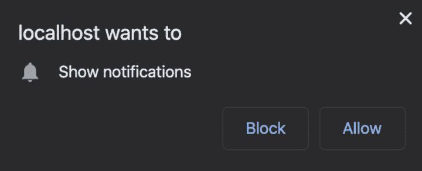
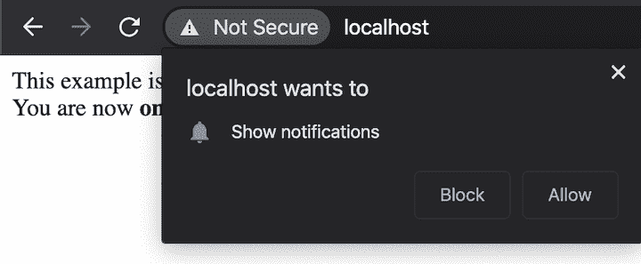
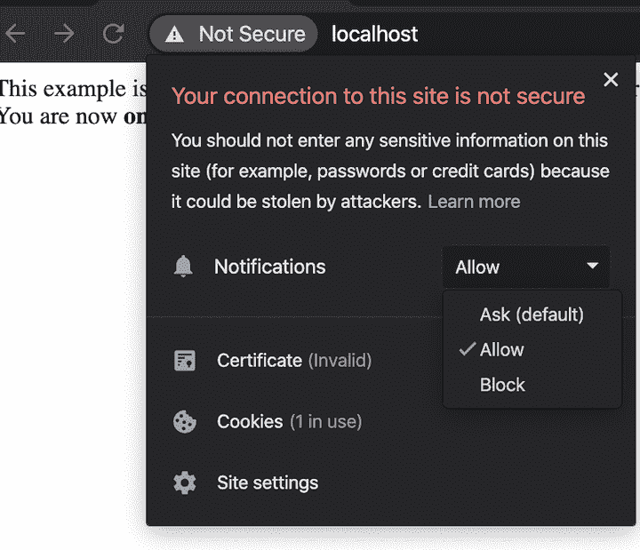
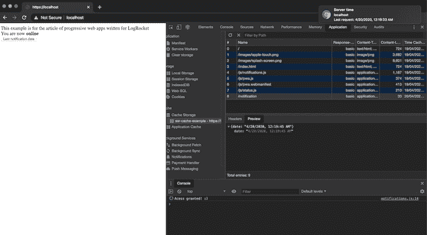

# 渐进式 web 应用程序(PWA)中的通知、缓存和消息

> 原文：<https://blog.logrocket.com/notifications-caching-and-messages-in-a-progressive-web-app-pwa/>

当您打开网站时，很有可能会看到一个提示，要求允许您显示通知。你可能还注意到，由于缓存，一些网站在后续访问中加载速度更快。这些只是在你的网站中构建渐进式网络应用(pwa)有助于提升用户体验的几个例子。

在本教程中，我们将向您展示如何在 PWA 中实现通知、缓存和消息。我们将讨论以下内容。

*   向您的页面添加通知
*   向缓存中添加您没有在服务工作器中明确定义的元素
*   “消息”事件

如果你不熟悉 PWAs，我推荐[从这里开始](https://blog.logrocket.com/how-to-build-a-progressive-web-app-pwa-with-node-js/)。

你可以在 [GitHub](https://github.com/daspinola/pwa-101) 上找到这个项目的初始代码。

## 通知

允许通知的典型请求如下所示:



这种要求虽然有时令人讨厌，但也是有用的。例如，启用通知将允许用户在等待网站上发生事件时导航到其他浏览器标签，例如在聊天中接收消息。

如今我们随处可见它，可能是因为它非常容易实现。

从请求访问开始。在`public/js`文件夹中创建一个名为`notifications.js`的文件，并将其添加到您的页面中。

`public/index.html`:

```
<html>
  <head>
    <link rel="manifest" href="/js/pwa.webmanifest">
    <link rel="apple-touch-icon" href="/images/apple-touch.png">
    <meta name="viewport" content="width=device-width, initial-scale=1">
    <meta name="theme-color" content="#764ABC"/>
  </head>
  <body>
    <div>
      <span>This example is for the article of progressive web apps written for LogRocket</span>
      <br>
      <span>You are now</span> <span><b class="page-status">online</b></span>
    </div>
    <script src="/js/notifications.js"></script>
    <script src="/js/pwa.js"></script>
    <script src="/js/status.js"></script>
  </body>
</html>

```

`public/js/notifications.js`:

```
document.addEventListener('DOMContentLoaded', init, false)
function init() {
  if ('Notification' in window) {
    Notification.requestPermission(result =>  {
      if (result === 'granted') {
        console.log('Acess granted! :)')
      } else if (result === 'denied') {
        console.log('Access denied :(')
      } else {
        console.log('Request ignored :/')
      }
    })
  } 
}

```

如果浏览器启用了通知，当用户打开同一个网站时，它将请求允许显示通知，即使选项卡未被选中或浏览器被最小化。

虽然我们在用户进入页面后立即请求访问，但推荐的做法是仅在用户交互后请求访问，比如按下按钮。



如果用户选择“阻止”，他们可以通过点击 URL 的左侧并选择“询问”或“允许”来允许通知——至少，这是它在 Chrome 中的表现。



假设通知被接受，则不会显示任何内容。那是因为我们没有调用函数来触发通知。

在服务器中创建一条名为`/notification`的新路线，以返回服务器的当前时间。我们还将每秒请求该路由的前端，这样即使我们最小化浏览器或切换标签，我们也可以看到它在工作。

注意:如果你想要实时更新，你应该使用 WebSockets 而不是`setTimeout`。这个例子是为了简单起见。

`server.js`:

```
const express = require('express')
const path = require('path')
const fs = require('fs')
const https = require('https')

const httpPort = 80
const httpsPort = 443

const key = fs.readFileSync('./certs/localhost.key')
const cert = fs.readFileSync('./certs/localhost.crt')

const app = express()
const server = https.createServer({key: key, cert: cert }, app)

app.use((req, res, next) => {
  if (!req.secure) {
    return res.redirect('https://' + req.headers.host + req.url)
  }
  next()
})
app.use(express.static(path.join(__dirname, 'public')))

app.get('/', function(req, res) {
  res.sendFile(path.join(__dirname, 'public/index.html'))
})

app.get('/notification', function(req, res) {
  const date = new Date()
  const message = {
    date: date.toLocaleString()
  }
  res.send(message)
})

app.listen(httpPort, function () {
  console.log(`Listening on port ${httpPort}!`)
})

server.listen(httpsPort, function () {
  console.log(`Listening on port ${httpsPort}!`)
})

```

`public/js/notifications.js`:

```
document.addEventListener('DOMContentLoaded', init, false)

function init() {
  if ('Notification' in window) {
    Notification.requestPermission(result =>  {
      if (result === 'granted') {
        console.log('Acess granted! :)')
        showServerTimeNotification()
      } else if (result === 'denied') {
        console.log('Access denied :(')
      } else {
        console.log('Request ignored :/')
      }
    })
  }

  function showServerTimeNotification() {
    if ('serviceWorker' in navigator) {
      navigator.serviceWorker.ready.then(registration => {
        setInterval(() => {
          fetch('/notification')
            .then(res => res.json())
            .then((response) => {
              const title = 'Server time'
              const options = {
                body: `Right now it's ${response.date}`,
              }
              registration.showNotification(title, options)
            })
        }, 1000)
      })
    }
  }
}

```

我们现在应该有一个通知，显示服务器当前时间的每一秒，如下所示:


为了更详细地了解代码，我们必须先检查服务人员是否正在工作，然后再继续显示通知。您不需要与服务人员在同一个文件中，因为一旦服务人员的状态改变，就会触发`navigator.serviceWorker.ready`。

让服务人员开的是`registration.showNotification(title, options)`，不言自明。它有许多选项，所以你可以自定义外观和行为。例如，你可以用`silent`消除手机中的声音和振动，或者添加自定义的`icon`或`image`，等等。我们使用的是`body`，它代表显示的信息。

前往 [MDN](https://developer.mozilla.org/en-US/docs/Web/API/ServiceWorkerRegistration/showNotification) 查看完整的选项列表。

## 隐藏物

您可能想知道如何缓存文件和请求，而不必在`service-worker.js`文件中手动更新它们。

让我们使用刚刚编写的通知来演示如何实现一个缓存系统，该系统:

```
- Returns the cached data if the request already exists
- Requests to update the current cache
- Executes the request and saves to the cache in case `no``-``cache` is found

```

这种类型的缓存被称为`stale-while-revalidate`，在这种缓存中，您不断地获取以前的记录。这对于很少变化的信息很有用，例如国家列表或用户头像。

让我们创建一个按钮，当按下该按钮时，显示服务器最后一次被访问的通知和缓存的数据，同时缓存请求——不管它是否在`service-worker.js`文件中定义。

即使离线也能工作。首先，将通知更改为仅在按钮被按下时显示。

`public/index.html`:

```
<html>
  <head>
    <link rel="manifest" href="/js/pwa.webmanifest">
    <link rel="apple-touch-icon" href="/images/apple-touch.png">
    <meta name="viewport" content="width=device-width, initial-scale=1">
    <meta name="theme-color" content="#764ABC"/>
  </head>
  <body>
    <div>
      <span>This example is for the article of progressive web apps written for LogRocket</span>
      <br>
      <span>You are now</span> <span><b class="page-status">online</b></span>
    </div>
    <div>
      <button class="btn-notifications">Last notification date</button>
    </div>
    <script src="/js/notifications.js"></script>
    <script src="/js/pwa.js"></script>
    <script src="/js/status.js"></script>
  </body>
</html>

```

`public/js/notifications.js`

```
document.addEventListener('DOMContentLoaded', init, false)

function init() {
  const notificationsBtn = document.querySelector('.btn-notifications')

  notificationsBtn.addEventListener('click', () => {
    requestPermission()
  })

  function requestPermission() {
    if ('Notification' in window) {
      Notification.requestPermission(result =>  {
        if (result === 'granted') {
          console.log('Acess granted! :)')
          showServerTimeNotification()
        } else if (result === 'denied') {
          console.log('Access denied :(')
        } else {
          console.log('Request ignored :/')
        }
      })
    } else {
      alert('Your browser does not support notifications')
    }
  }

  function showServerTimeNotification() {
    if ('serviceWorker' in navigator) {
      navigator.serviceWorker.ready.then(registration => {
        fetch('/notification')
          .then(res => res.json())
          .then((response) => {
            const title = 'Server time'
            const options = {
              body: `Last request: ${response.date}`,
            }
            registration.showNotification(title, options)
          })
      })
    }
  }
}

```

有了这个改变，用户不会在进入网站的那一刻收到一个烦人的通知请求。这增加了用户转化率，使用户不太可能离开你的网站。

然而，这段代码是不够的，因为我们的目标是使用缓存来显示最后一次请求的最后保存日期，而不是当前的服务器日期。为此，我们需要将服务人员更新为以下内容。

`public/js/service-worker.js`(这只需要更新`fetch`事件)。

```
// ...

self.addEventListener('fetch', function(event) {
  event.respondWith(async function() {
    const cache = await caches.open(CACHE_NAME)
    const cacheMatch = await cache.match(event.request)

    if (navigator.onLine) {
      const request = fetch(event.request)

      event.waitUntil(async function() {
        const response = await request
        await cache.put(event.request, await response.clone())
      }())

      return cacheMatch || request
    }

    return cacheMatch // this will be undefined when offline if there are no matches
  }())
})

// ...

```

与上一个例子不同，现在我们检查我们发出的请求是否被缓存了。如果不是，我们发出通常的请求并返回响应。

由于以下部分的原因，每次成功请求后都会更新缓存。

```
if (navigator.onLine) {
  const request = fetch(event.request)

  event.waitUntil(async function() {
    const response = await request
    await cache.put(event.request, await response.clone())
  }())

  return cacheMatch || request
}

return cacheMatch

```

这将检查浏览器是否连接到互联网，以避免发送垃圾请求。`waitUntil`告诉服务人员在请求得到响应之前不要被替换。`clone`是为了让我们能够再次读取请求的响应，以防它已经被读取。

按下按钮，我们现在应该缓存我们的请求，即使它们不在缓存请求列表中。



小心这种类型的实现；你不想填满用户的浏览器缓存。如果您喜欢更安全的方法，您仍然可以保留这种类型的缓存，并将条件更改为只有在缓存中存在时才更新。

```
if (navigator.onLine && cacheMatch) {
  event.waitUntil(async function() {
    const response = await request
    await cache.put(event.request, await response.clone())
  }())
}

```

## 消息事件

最后，让我们回顾一下如何与服务人员沟通，或者让服务人员与客户沟通。如果您需要调用像`skipWaiting`这样的服务工作者方法，这是非常有用的。

### 客户→服务人员

为了让客户端与服务工作者通信，我们需要从客户端发布一条消息，并在服务工作者端用`message`事件接收它。

`public/js/notifications.js`:

```
document.addEventListener('DOMContentLoaded', init, false)

function init() {
  const notificationsBtn = document.querySelector('.btn-notifications')

  navigator.serviceWorker.controller.postMessage('Hello service worker!')

  notificationsBtn.addEventListener('click', () => {
    requestPermission()
  })

  // ...
}

```

`public/js/service-worker.js`:

```
// ...

self.addEventListener('message', function(event) {
  console.log('Message received ->', event.data)
})

// ...

```

### 服务人员→客户

反向沟通有多种方式。我们将使用服务工作器中可用的 [`Clients`](https://developer.mozilla.org/en-US/docs/Web/API/Clients) 接口来发回消息。

`public/js/service-worker.js`:

```
self.addEventListener('message', function(event) {
  console.log('Message received from client ->', event.data)

  self.clients.matchAll().then(clients => {
    clients.forEach(client => client.postMessage('Hello from SW!'));
  })
})

```

`public/js/notifications.js`:

```
document.addEventListener('DOMContentLoaded', init, false)

function init() {
  const notificationsBtn = document.querySelector('.btn-notifications')

  navigator.serviceWorker.controller.postMessage('Hello service worker!')

  navigator.serviceWorker.onmessage = (event) => {
    console.log('Message received from SW ->', event.data)
  }

  notificationsBtn.addEventListener('click', () => {
    requestPermission()
  })

  // ...
}

```

## 和睦相处

大多数最新的浏览器——基本上除了 IE 和 iOS Safari 之外的任何浏览器——都支持本文中讨论的主题，但请务必检查诸如 [MDN](https://developer.mozilla.org/en-US/docs/Web/API/notification) 和[我可以使用](https://caniuse.com/#feat=mdn-api_notification)之类的工具。

## 结论

如果网站是开放的，这些通知会起作用。一些通知使用更近的[推送 API](https://developer.mozilla.org/en-US/docs/Web/API/Push_API) ，它仍处于试验阶段，即使浏览器关闭也能工作。

至于缓存，`stale-while-revalidate`只是众多例子中的一个。例如，我们可以不再访问服务器，决定在一段时间后更新缓存，或者只在特定事件时更新。最合适的方法取决于具体情况。

服务人员与客户之间的通信也可以通过[广播通道 API](https://developer.mozilla.org/en-US/docs/Web/API/Broadcast_Channel_API) 或 [`MessageChannel`](https://developer.mozilla.org/en-US/docs/Web/API/MessageChannel) [i](https://developer.mozilla.org/en-US/docs/Web/API/MessageChannel) 接口实现。

可以在 [GitHub](https://github.com/daspinola/pwa-201) 上参考本教程的最终代码。

## 使用 [LogRocket](https://lp.logrocket.com/blg/signup) 消除传统错误报告的干扰

[](https://lp.logrocket.com/blg/signup)

[LogRocket](https://lp.logrocket.com/blg/signup) 是一个数字体验分析解决方案，它可以保护您免受数百个假阳性错误警报的影响，只针对几个真正重要的项目。LogRocket 会告诉您应用程序中实际影响用户的最具影响力的 bug 和 UX 问题。

然后，使用具有深层技术遥测的会话重放来确切地查看用户看到了什么以及是什么导致了问题，就像你在他们身后看一样。

LogRocket 自动聚合客户端错误、JS 异常、前端性能指标和用户交互。然后 LogRocket 使用机器学习来告诉你哪些问题正在影响大多数用户，并提供你需要修复它的上下文。

关注重要的 bug—[今天就试试 LogRocket】。](https://lp.logrocket.com/blg/signup-issue-free)