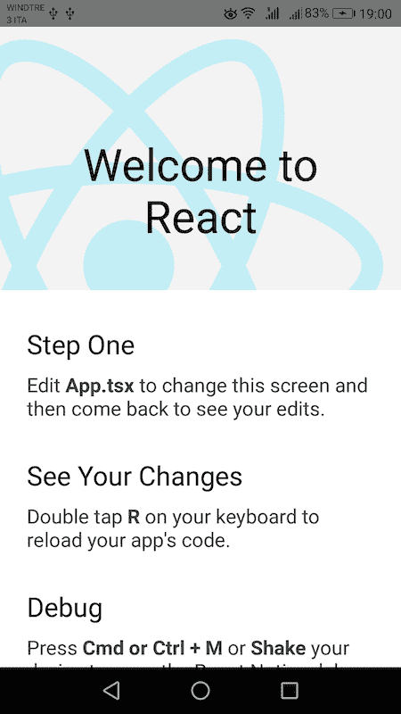
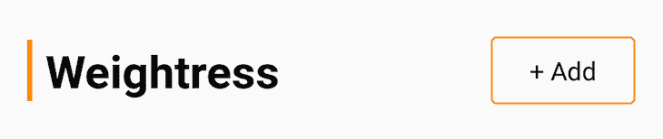
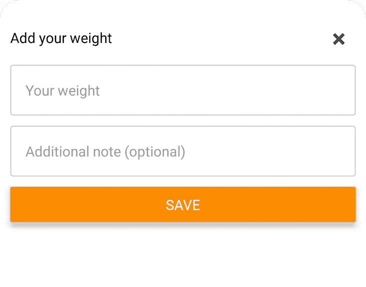

# 使用 React Native 和 WatermelonDB - LogRocket Blog 构建一个完全离线的应用程序

> 原文：<https://blog.logrocket.com/offline-app-react-native-watermelondb/>

## 鼓舞士气的讲话

有时，为了在一个实用的应用程序中提供全套功能，我们并不需要连接到互联网。如果我们不需要，为什么要将数据发送到某个 API 服务器，并支付一大笔钱来存储这些数据呢？

有时，用户只是想要一个可以存储一些信息并在以后显示的应用程序，而不必担心是否有稳定的互联网连接。如果你同意，但你不太确定如何构建这样一个应用程序，那么做得很好——你今天正在阅读正确的博文。🙂

在这篇文章中，我将带你构建一个 React 本机应用程序，让用户跟踪他们的体重，并随着时间的推移，按需可视化存储的数据。所有这一切都不需要连接到大坏互联网！

## 你需要带来什么

没什么——不管你带什么，都欢迎你入席。

然而，本文将假设您对 TypeScript 和 React Native 有所了解，并对数据库有基本的了解。如果你不熟悉以上的一个或全部，仍然欢迎你一起阅读，但是有些东西可能看起来有点太神秘，需要你做更多的研究。

对于像我这样没有耐心的人来说，他们想在提交帖子之前先看看代码，这里是 GitHub 上的[完整代码库。](https://github.com/foysalit/weightress-app-blog)

## 入门指南

任何企业的首要问题是什么？收入来源，对吗？

不对！是名字。在构建应用程序时，选择正确的名称始终是每个人最需要关注的事情。

所以，当然，在我开始写这篇文章之前，我就想出了 Weightress 这个名字，如果你没注意到的话，这是一个非常聪明的文字游戏，因为这个应用程序会跟踪你的体重。太神奇了，对吧？

什么？你觉得你能做得更好吗？好吧，我想看到你尝试一下——如果你能为一个体重跟踪应用想出一个更好的名字，请发微博给我。

好了，玩笑开够了。我们现在开始工作吧。

如果您是第一次接触 React Native，在开始之前，您可能需要用一些工具来设置您的机器。前往 RN 的[官方环境设置文档](https://reactnative.dev/docs/environment-setup)并完成安装过程。完成所有设置后，您可以让 React Native CLI 为您创建一个样板应用程序，只需运行:

```
npx react-native init weightress --template react-native-template-typescript
```

这将生成一个名为`weightress`的新文件夹，并在其中放入一些文件。用您最喜欢的代码编辑器打开文件夹，从终端窗口在文件夹内导航。

为了将用户的数据存储在他们的设备上，我们将使用 [WatermelonDB](https://nozbe.github.io/) 。首先，我们将使用 Yarn 将其安装为一个依赖项，Yarn 是样板文件 React Native 应用程序的默认包管理器。运行以下命令:

```
cd weightress
yarn add @nozbe/watermelondb @nozbe/with-observables
yarn add --dev @babel/plugin-proposal-decorators
```

第一个命令安装与 WatermelonDB 相关的依赖项，第二个命令安装一个开发专用包，我们需要在代码中使用 ES6 装饰语法。

只是安装包不会开箱即用；你还是要让巴别塔知道它的存在。打开`babel.config.js`文件，添加一个新的插件属性，如下所示:

```
module.exports = {
  presets: ['module:metro-react-native-babel-preset'],
  plugins: [
    ["@babel/plugin-proposal-decorators", { "legacy": true }]
  ]
};
```

现在，根据您正在构建的平台，您必须遵循一组不同的指令来完成 DB 设置。对于 iOS，请遵循[这些步骤](https://nozbe.github.io/WatermelonDB/Installation.html#ios-react-native)，对于 Android，请遵循[这些步骤](https://nozbe.github.io/WatermelonDB/Installation.html#android-react-native)。

好吧，你已经活下来了。为原生开发设置包有点乏味，所以希望包的维护者很快会实现自动链接的方法。

现在，您可以将您的设备连接到开发机器，或者在仿真器中运行应用程序。我将使用我的物理 Android 设备，但无论哪种方式，你只需要在你的终端中运行`yarn start`，然后在另一个终端窗口中，根据你想要在哪个平台上运行应用程序，运行`yarn ios`或`yarn android`。

这应该会在您的设备/仿真器上打开应用程序，您应该会看到如下屏幕:



## 数据结构

当构建一个新的应用程序或功能时，我喜欢从头开始规划。这种规划的合适位置是在数据库级别。弄清楚我们将存储什么样的数据以及每个实体将包含什么，让我对构建 UI 和 UX 所需的方法有了更好的理解。

我们的应用程序将允许用户随时输入他们的体重，我们将把它保存在数据库中。然后，在稍后的时间，我们将检索历史条目并向用户显示它们。对于这个简单的数据，我们只需要存储用户输入的数字和输入的时间戳。

此外，让用户在记录体重时输入额外的注释可能会更好。也许他们想写下他们那天的感受，他们吃了什么，等等。笔记也有助于快速搜索特定的内容。现在让我们使用 WatermelonDB 来促进这种数据存储。

创建一个名为`data/`的新文件夹和一个名为`schema.ts`的新文件，并将以下代码放入其中:

```
import {appSchema, tableSchema} from '@nozbe/watermelondb';

export default appSchema({
  version: 1,
  tables: [
    tableSchema({
      name: 'weights',
      columns: [
        {name: 'weight', type: 'number'},
        {name: 'created_at', type: 'number'},
        {name: 'note', type: 'string', isOptional: true},
      ],
    }),
  ],
});
```

在上面的代码中，我们为一个名为 weights 的表设置了模式，该表有三列。注意，`note`列有一个设置为`true`的`isOptional`属性。我们不想强迫用户为每个条目输入注释，这就是为什么我们把它设为可选的。

* * *

### 更多来自 LogRocket 的精彩文章:

* * *

另外，`created_at`列是数字类型，尽管它是日期。这是因为日期作为 Unix 时间戳存储在 WatermelonDB 中。哦，只有`note`和`create_at`的`isIndexed`被设置为真，因为我们将让用户搜索他们的笔记或找到某一天的条目。当涉及到这些列时，索引使查询运行得更快。

这就是建立数据库的全部内容，但是我们的代码仍然需要与这些数据进行通信。这就是模特出现的地方。模型是原始数据在代码中的表示。通常，每张桌子都有一个模型。因此，让我们为权重表创建模型。

在`data/`文件夹中创建一个名为`weight.ts`的新文件，并填入:

```
import {Model} from '@nozbe/watermelondb';
import {field, readonly, date} from '@nozbe/watermelondb/decorators';

export default class Weight extends Model {
  static table = 'weights';

  @field('note') note;
  @field('weight') weight;
  @readonly @date('created_at') createdAt;
}
```

如您所见，它几乎是我们刚刚为数据库表创建的模式的镜像。这只是在数据库列和我们的模型对象的属性之间创建映射。这里有一个神奇的东西是`@date`装饰器，它会自动生成当前时间戳，并在数据库中插入新条目时为我们插入时间戳。

我们几乎完成了设置阶段。现在在`data/`文件夹中，创建另一个名为`database.ts`的文件，并输入以下内容:

```
import {Database} from '@nozbe/watermelondb';
import SQLiteAdapter from '@nozbe/watermelondb/adapters/sqlite';

import Weight from './weight';
import schema from './schema';

const adapter = new SQLiteAdapter({
  schema,
});

export const database = new Database({
  adapter,
  modelClasses: [Weight],
  actionsEnabled: true,
});
```

这里，我们引入了刚刚构建的模式和模型，并创建了一个新的数据库实例，它知道在哪里可以找到数据的模式和模型。有了所有这些，我们现在就可以创建、读取、更新和删除本地数据库中的数据了。

然而，本着将关注点分开的精神，我们将把所有与数据相关的代码放在一个地方，而不是直接从组件访问/操作数据库。让我们在名为`helpers.ts`的`data/`文件夹中创建最后一个文件，并将以下代码放入其中:

```
import {database} from './database';

export type Weight = {
  createdAt?: Date;
  weight: string | number;
  note: string | undefined;
};

const weights = database.collections.get('weights');

export const observeWeights = () => weights.query().observe();
export const saveWeight = async ({weight, note}: Weight) => {
  await database.action(async () => {
    await weights.create((entry) => {
      entry.weight = Number(weight);
      entry.note = note;
    });
  });
};
```

这里，我们为`Weight`定义并导出了一个类型，其中包含了它所定义的字段，这样在组件之间传递的数据就可以被正确地输入。然后，我们在数据库中为我们的`weights`表/集合定义一个容器，我们将在下面的函数中使用它。

目前，我们只定义了一个 getter 和一个 setter。`observeWeights`函数在`weights`表上设置一个订阅，每次数据库发生变化时，这个订阅的监听器都会收到变化。更改可以是创建新条目、更新现有条目或删除条目。

最后导出的是一个函数，给定一个权重和一个注释，它将在数据库的`weights`表中创建一个新条目。需要注意的一点是，权重输入将来自一个输入字段，它通常作为 React Native 中的字符串给出。但是在数据库中，我们希望将它们存储为数字，所以我们在保存之前将字符串转换为数字。

## 用户界面

所有这些都是后台工作——让应用程序正常工作，但不会受到关注。用户界面是用户最终看到的，所以让我们做一些好的工作。

就像以前一样，我们将从一个计划开始，从头开始构建。所以，让我们从 UI 的角度来思考一下我们的应用程序。它可以很容易地分成两个主要部分:一个让用户插入体重条目的表单和一个显示所有以前插入的体重的列表。为了让它更有趣一点，让我们使用一个图表来显示历史数据，而不是简单的旧列表。

为了获得一个愉快的 UX，让我们一直查看图表，只在需要时显示输入表单。尽管如此，我们可以把这个应用分成三个部分:`Header`、`Creator`和`Chart`。记住这一点，打开`App.tsx`文件，删除其中的所有内容，并放入以下代码:

```
import React, {useState} from 'react';
import {SafeAreaView, ScrollView, StatusBar} from 'react-native';

import Chart from './components/chart';
import Header from './components/header';
import Creator from './components/creator';

const App = () => {
  const [showCreator, setShowCreator] = useState<boolean>(false);
  return (
    <>
      <StatusBar />
      <SafeAreaView>
        <ScrollView contentInsetAdjustmentBehavior="automatic">
          <Header onOpenCreator={() => setShowCreator(true)} />
          <Creator
            isCreatorVisible={showCreator}
            onHideCreator={() => setShowCreator(false)}
          />
          <Chart />
        </ScrollView>
      </SafeAreaView>
    </>
  );
};

export default App;
```

这很简单。我们引入了我们计划的三个组件，将`StatusBar`组件放在顶部，并将所有内容包装在`SafeAreaView`组件中，以确保我们的内容不会与状态栏重叠或被可怕的缺口切断。然后，我们还有另一个包装器，`ScrollView`，如果里面的内容溢出了屏幕的垂直高度，它将允许用户向下滚动。

我们看到一个名为`showCreator`的本地布尔状态，它将决定是否向用户显示`Creator`。当渲染`Header`组件时，我们传递一个函数属性`onOpenCreator`，它在被调用时简单地将`showCreator`设置为真。

在`Creator`组件中，我们传递了`showCreator`状态和一个函数，通过将`showCreator`设置为 false 来隐藏创建者。

然后，最后，我们有了`Chart`组件，它不需要任何道具。在某些时候，通过一些用户交互，`Header`组件将触发`onOpenCreator`，这将把`Creator`带入视图，这将让用户输入他们的体重。

现在，让我们深入了解一下每个组件的内部。新建一个名为`components`的文件夹，在里面新建三个文件:`chart.tsx`、`creator.tsx`和`header.tsx`。

### `Header`组件

打开`components/header.tsx`文件，输入以下代码:

```
import React, {FC} from 'react';
import {View, Text, TouchableHighlight} from 'react-native';
import {headerStyles} from './styles';

const Header: FC<{onOpenCreator: () => void}> = ({onOpenCreator}) => {
  return (
    <>
      <View style={headerStyles.container}>
        <Text style={headerStyles.headerTitle}>Weightress</Text>
        <TouchableHighlight
          style={headerStyles.addButton}
          onPress={() => onOpenCreator()}>
          <Text>+ Add</Text>
        </TouchableHighlight>
      </View>
    </>
  );
};

export default Header;
```

这是一个小组件，它呈现一个标题文本，只有应用程序的名称 Weightress 和一个按钮，当按下时会触发`onOpenCreator`功能属性。按钮是使用`TouchableHighlight`组件呈现的，但是您也可以使用`Button`或`Pressable`组件。

注意，我们使用`headerStyles`在所有三个组件上应用样式，它们是从一个我们还没有创建的文件中导入的。因此，让我们创建文件`components/styles.ts`并放入以下代码:

```
import {StyleSheet} from 'react-native';

export const primaryColor = '#FB8C00';

export const headerStyles = StyleSheet.create({
  container: {
    alignItems: 'center',
    paddingVertical: 20,
    flexDirection: 'row',
    paddingHorizontal: 15,
    justifyContent: 'space-between',
  },
  addButton: {
    borderColor: primaryColor,
    paddingHorizontal: 20,
    paddingVertical: 8,
    borderRadius: 3,
    borderWidth: 1,
  },
  headerTitle: {
    fontSize: 25,
    fontWeight: 'bold',
    borderLeftWidth: 3,
    paddingLeft: 10,
    borderLeftColor: primaryColor,
  },
});
```

如您所见，`headerStyles`是一个 React 原生样式表，它有三个属性。每个属性包含一个组件的样式。容器在整个标题周围留出一些空间，并使用`justifyContent: 'space-between'`确保标题文本和添加按钮位于屏幕的相对两侧。

在右侧按钮周围留出一些空间，并在文本周围添加一个圆形(但不要太圆)边框，使其看起来更像按钮。注意，边框颜色是使用`primaryColor`变量设置的。隔离主要颜色将有助于我们在其他组件风格中重用它，并使在一个地方更改应用程序的品牌变得容易。

最后但并非最不重要的是，我们有一些标题文本的样式，下面有一个边框，使它看起来更像一个标志。我们还不能在我们的应用程序中看到它，所以下面是上面代码的截图:



### `Creator`组件

打开`components/creator.tsx`文件，输入以下代码:

```
import React, {FC, useState} from 'react';
import {
  Button,
  Modal,
  Text,
  TextInput,
  TouchableHighlight,
  View,
} from 'react-native';
import {saveWeight} from '../data/helpers';
import {creatorStyles, primaryColor} from './styles';

const Creator: FC<{
  isCreatorVisible: boolean;
  onHideCreator: () => void;
}> = ({onHideCreator, isCreatorVisible}) => {
  const [isSaving, setIsSaving] = useState<boolean>(false);
  const [weight, setWeight] = useState<string>('');
  const [note, setNote] = useState<string>('');

  const handleSavePress = async () => {
    setIsSaving(true);
    await saveWeight({weight, note});
    // hide modal
    onHideCreator();
    // Clear out the inputs
    setWeight('');
    setNote('');
    // Make button active again
    setIsSaving(false);
  };

  return (
    <Modal animationType="slide" transparent={true} visible={isCreatorVisible}>
      <View style={creatorStyles.centeredView}>
        <View style={creatorStyles.modalView}>
          <View style={creatorStyles.topActions}>
            <Text>Add your weight</Text>
            <TouchableHighlight
              onPress={() => {
                onHideCreator();
              }}>
              <Text style={creatorStyles.topCloseButton}>×</Text>
            </TouchableHighlight>
          </View>
          <TextInput
            style={creatorStyles.input}
            placeholder="Your weight"
            keyboardType="decimal-pad"
            onChangeText={(text) => setWeight(text)}
            value={weight}
          />
          <TextInput
            placeholder="Additional note (optional)"
            style={creatorStyles.input}
            onChangeText={(text) => setNote(text)}
            value={note}
          />
          <Button
            title="Save"
            disabled={isSaving}
            color={primaryColor}
            onPress={handleSavePress}
          />
        </View>
      </View>
    </Modal>
  );
};

export default Creator;
```

这一个比`Header`组件多一点肉，不是吗？让我们从本地状态开始。我们有三种:`isSaving`、`weight`和`note`。

节省数据库重量的辅助函数是一个异步函数，因此在请求数据存储和完成数据存储之间可能会有一些延迟。当发生这种情况时，我们希望让用户知道幕后的活动，这就是将使用`isSaving`的地方。另外两个将包含来自用户的输入。

还记得我们说过只按需显示`Creator`吗？我们通过 React Native 的`Modal`组件实现了这一点。把`true`传给那个组件的`visible`道具会把它带入视野，`false`会把它拿出来。我们通过传递一个`animationType="slide"`道具使过渡看起来感觉良好。

组件覆盖了整个屏幕，但是对于有两个输入的小表单，我们不需要那么大的空间。因此，我们将内容包装在两个`View`组件中，包装器使用一些 flexbox 魔法将所有内容放在屏幕底部。

让我们来看看可以实现这一点的风格。返回到`styles.ts`文件并创建一个新的样式表:

```
import {Dimensions, StyleSheet} from 'react-native';
// previous code.....
const windowDim = Dimensions.get('window');
export const windowHeight = windowDim.height;
export const creatorStyles = StyleSheet.create({
  centeredView: {
    flex: 1,
    justifyContent: 'flex-end',
    backgroundColor: 'rgba(255, 255, 255, 0.6)',
  },
  modalView: {
    backgroundColor: '#FFFFFF',
    borderTopLeftRadius: 20,
    borderTopRightRadius: 20,
    padding: 10,
    height: windowHeight / 2,
    shadowColor: '#cacaca',
    shadowOffset: {
      width: 0,
      height: 1,
    },
    shadowOpacity: 0.1,
    shadowRadius: 2,
    elevation: 1,
  },
}
```

`centeredView`是封装所有内容的父包装器，有一个半透明的背景。`justifyContent: 'flex-end'`确保里面的任何元素都放在元素的底部。对于里面的`View`，我们用的是`modalView`风格，白色背景，占据了屏幕一半的高度。

为了准确地确定屏幕的一半是什么，我们需要使用 React Native 的`Dimensions`助手，它让我们可以访问窗口的`height`和`width`以及设备的其他一些大小属性。我们还在元素上添加了一些阴影和边框，让事情看起来更好更平滑。

好的，让我们回头看看这个组件。在模态内部，我们首先看到这个:

```
         <View style={creatorStyles.topActions}>
            <Text>Add your weight</Text>
            <TouchableHighlight
              onPress={() => {
                onHideCreator();
              }}>
              <Text style={creatorStyles.topCloseButton}>×</Text>
            </TouchableHighlight>
          </View>
```

这在模态中添加了一个标题文本，并在右侧添加了一个按钮，当按下按钮时会触发`onHideCreator` prop 函数。请记住，我们从`App.tsx`传递这个消息，它让用户关闭模态。让我们在`styles.ts`文件中为此创建样式:

```
export const creatorStyles = StyleSheet.create({
  // previous code...
  topActions: {
    flexDirection: 'row',
    alignItems: 'center',
    justifyContent: 'space-between',
  },
  topCloseButton: {
    padding: 10,
    color: '#494949',
    fontWeight: 'bold',
    fontSize: 25,
  },
```

它的设置与`Header`组件类似，我们使用 flexbox 将包装器分成两个水平部分。右侧的关闭按钮周围有一些空间，使其易于点击，文本保留在左侧。

现在，情态的主要内容:

```
          <TextInput
            style={creatorStyles.input}
            placeholder="Your weight"
            keyboardType="decimal-pad"
            onChangeText={(text) => setWeight(text)}
            value={weight}
          />
          <TextInput
            placeholder="Additional note (optional)"
            style={creatorStyles.input}
            onChangeText={(text) => setNote(text)}
            value={note}
          />
          <Button
            title="Save"
            disabled={isSaving}
            color={primaryColor}
            onPress={handleSavePress}
          />
```

我们这里有两个`TextInput`组件和一个`Button`。第一个`TextInput`只接受一个数字输入，因为我们在它上面设置了`keyboardType="decimal-pad"`道具，它链接到`weight`状态。第二个是任何附加说明；因此，它连接到`note`状态。最后，我们有一个`Button`,当它被按下时会触发`handleSavePress`功能。

请注意，为了在保存输入时禁用按钮，我们设置了`disabled={isSaving}`，为了使其与我们的品牌相匹配，我们设置了`color={primaryColor}`。我们还没有定义这些字段的样式，所以让我们回到`styles.ts`文件并添加如下内容:

```
export const creatorStyles = StyleSheet.create({
// previous code...
  input: {
    height: 50,
    borderWidth: 1,
    borderRadius: 3,
    marginBottom: 10,
    paddingVertical: 10,
    paddingHorizontal: 15,
    borderColor: '#c9c9c9',
  },
});
```

我们只是在字段周围添加一些间距，并添加一个边框，使它看起来很好。现在让我们看看`handleSavePress`是做什么的:

```
 const handleSavePress = async () => {
    setIsSaving(true);
    await saveWeight({weight, note});
    // hide modal
    onHideCreator();
    // Clear out the inputs
    setWeight('');
    setNote('');
    // Make button active again
    setIsSaving(false);
  };
```

当被触发时，它将首先将状态`isSaving`切换到 true，这又会禁用**保存**按钮。然后，它用来自状态的权重和注释输入调用`saveWeight`函数。它将异步保存 WatermelonDB 中的数据。

一旦完成，我们首先启动`onHideCreator`函数 prop，如果您还记得的话，它隐藏了模态本身。然后，我们只是清除输入，以便当模式重新打开时，用户看到的是空的输入字段，而不是之前插入的权重和注释。最后，我们将`isSaving`切换回 false 来重新启用**保存**按钮，以便用户下次打开模态。

同样，我们还不能在我们的应用程序中看到它，所以这里有一个截图来润润你的嘴…



### `Chart`组件

React 原生生态系统缺少一些在网络上或原生平台上可用的优秀图表和数据库。然而，对于我们的需求， [react-native-chart-kit](https://www.npmjs.com/package/react-native-chart-kit) 提供了开箱即用的一切。这个库依赖于 react-native-svg 库，所以让我们通过运行`yarn add react-native-svg react-native-chart-kit`来安装这两个库。

现在打开`components/chart.tsx`文件，输入以下代码:

```
import React, {FC} from 'react';
import withObservables from '@nozbe/with-observables';
import {LineChart} from 'react-native-chart-kit';

import {observeWeights, Weight} from '../data/helpers';
import {chartConfig, chartStyles, windowWidth} from './styles';

const Chart: FC<{weights: Weight[]}> = ({weights}) => {
  if (weights.length < 1) {
    return null;
  }

  const labels: string[] = [];
  const data: number[] = [];
  weights.forEach((w) => {
    labels.push(`${w?.createdAt.getDate()}/${w.createdAt.getMonth() + 1}`);
    data.push(w.weight);
  });
  return (
    <LineChart
      bezier
      height={250}
      width={windowWidth - 30}
      chartConfig={chartConfig}
      style={chartStyles.chart}
      data={{labels, datasets: [{data}]}}
    />
  );
};

const enhanceWithWeights = withObservables([], () => ({
  weights: observeWeights(),
}));

export default enhanceWithWeights(Chart);
```

首先，我们将`Chart`组件设置为接收权重数组的功能组件。如果数组是空的，我们就不渲染任何东西。否则，我们遍历权重数组并构建一个包含每个条目日期的`labels`数组，格式为`dd/mm`。

我们还将所有权重值存储在一个`data`数组中，存储顺序与`labels`数组相同。我们正在将数据库中的原始数据转换成这个结构，`LineChart`组件可以理解和可视化。该组件只是呈现从 react-native-chart-kit 库中导入的`LineChart`组件。

`data`道具是我们传递刚刚构建的`labels`和`data`数组的地方。`bezier`道具使外推的折线图具有弯曲的外观。我们正在传递一个`height`和一个`width`，其中高度是硬编码的，但是宽度是从一个从`styles.ts`文件导入的`windowWidth`变量中导出的，还有`chartConfig`和`chartStyles`。

让我们回到`styles.ts`文件，看看它们是什么:

```
export const windowWidth = windowDim.width;
export const chartStyles = StyleSheet.create({
  chart: {
    marginLeft: 15,
    borderRadius: 10,
  },
});

export const chartConfig = {
  backgroundColor: primaryColor,
  backgroundGradientFrom: primaryColor,
  backgroundGradientTo: '#FFA726',
  decimalPlaces: 2,
  color: (opacity = 1) => `rgba(255, 255, 255, ${opacity})`,
  labelColor: (opacity = 1) => `rgba(255, 255, 255, ${opacity})`,
  style: {
    borderRadius: 16,
  },
  propsForDots: {
    r: '6',
    strokeWidth: '2',
    stroke: '#ffa726',
  },
};
```

从`Dimension`模块，我们正在导出设备窗口的宽度，图表的宽度将比全宽小 30px。然后，在`chartStyles`中，我们在左边给它一个`15px`空白，这样图表在屏幕上水平居中，两边各有一个漂亮的`15px`。我们还在它的边界周围增加了一些半径。

大部分样式是通过`chartConfig`道具而不是 React 原生样式完成的。我们将图表配置为在背景中使用渐变，从`primaryColor`重音开始。其余属性用于图表中显示的内容的各种形状和颜色。你可以从[图书馆的官方文档](https://www.npmjs.com/package/react-native-chart-kit)中找到更多配置图表的方法。

回到组件内部，注意我们没有像对待其他两个组件那样直接导出`Chart`组件。相反，我们将其包装在一个高阶组件(HOC)中，并导出该包装版本:

```
const enhanceWithWeights = withObservables([], () => ({
  weights: observeWeights(),
}));

export default enhanceWithWeights(Chart);
```

这就是 WatermelonDB 的威力所在。HOC 为我们提供了一种将 React 组件实时直接连接到数据库中的数据的方法。

这是我们应用`observeWeights()`助手函数的地方，用 HOC 包装我们的`Chart`组件意味着组件将自动接收一个名为`weight`的道具。该道具将包含数据库中的所有权重条目，每次添加新数据或更新或删除现有数据时，组件都将使用最新数据重新呈现。

## 带它去兜一圈

有了所有这些，我们终于可以在设备或模拟器上打开我们的应用程序并检查它了。这是我摆弄它的视频:

 [https://www.youtube.com/embed/P27SvfaafNc?version=3&rel=1&showsearch=0&showinfo=1&iv_load_policy=1&fs=1&hl=en-US&autohide=2&wmode=transparent](https://www.youtube.com/embed/P27SvfaafNc?version=3&rel=1&showsearch=0&showinfo=1&iv_load_policy=1&fs=1&hl=en-US&autohide=2&wmode=transparent)

视频

请注意，如果您关闭应用程序并重新打开它，图表将显示您之前保存的所有体重，这要归功于 WatermelonDB。

## 《要么做大，要么呆在家》

首先，为自己能走到这一步而感到欣慰。但是有趣的火车不一定要停在这里。这款应用还能提供更多功能。

以下是您可以在此基础上构建的功能列表，这将有助于您了解更多关于 React Native、数据结构、存储和架构的信息，并在此过程中，将此项目转化为一个更加完美的生产就绪型应用程序:

### 时间段选择器

随着时间的推移，随着用户输入越来越多的数据，图表视图将变得过于拥挤，无法显示所有内容。允许用户选择一个时间段，并从数据库中过滤数据，以便只获取和显示该时间段的重量

### 导入/导出数据

离线应用的一个常见问题是数据同步。用户可能会丢失手机、摔坏手机、重置手机等。还有许多其他情况，设备存储的数据将永远丢失。为了避免这种混乱，离线应用程序需要提供一种将数据导出为 CSV 或 PDF 文件等可移植格式的方法。

还应该有一个导入功能，让用户从以前导出的文件导入数据。当用户获得新设备并希望在新设备上继续使用您的应用程序时，这尤其有用。

### 提醒通知

如果用户当天没有记录体重，应用程序可以在一天结束时发送提醒推送通知，这将非常方便。当然，推送不想要的通知可能会非常烦人，所以构建一个设置选项，以便用户可以打开或关闭。

随着上述三个想法的实施，以及你选择添加的任何你自己的想法，我相信你可以将其转变为商店中的下一个大应用。如果你真的在商店上发布了它或者开发了一个或多个这样的功能，别忘了发推文。

## [LogRocket](https://lp.logrocket.com/blg/react-native-signup) :即时重现 React 原生应用中的问题。

[](https://lp.logrocket.com/blg/react-native-signup)

[LogRocket](https://lp.logrocket.com/blg/react-native-signup) 是一款 React 原生监控解决方案，可帮助您即时重现问题、确定 bug 的优先级并了解 React 原生应用的性能。

LogRocket 还可以向你展示用户是如何与你的应用程序互动的，从而帮助你提高转化率和产品使用率。LogRocket 的产品分析功能揭示了用户不完成特定流程或不采用新功能的原因。

开始主动监控您的 React 原生应用— [免费试用 LogRocket】。](https://lp.logrocket.com/blg/react-native-signup)