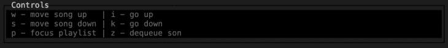
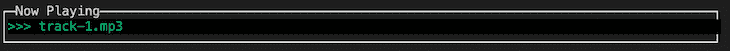
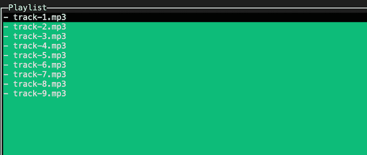
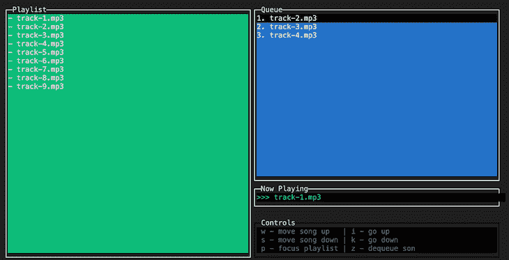
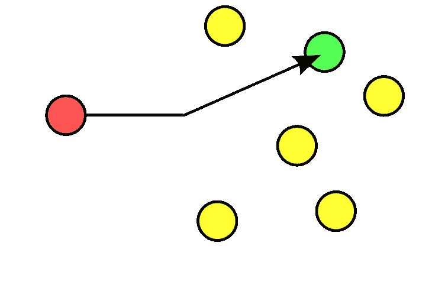
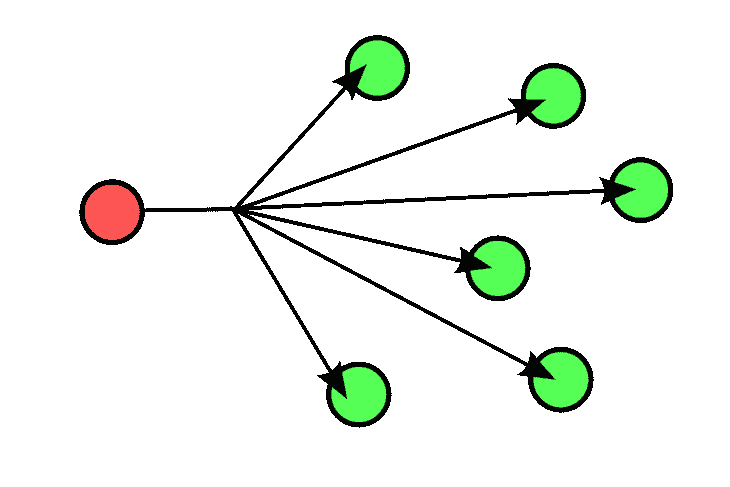
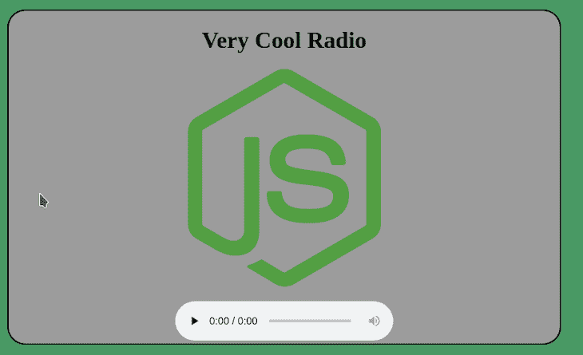

# 在 pure Node.js - LogRocket 博客中制作自己的在线电台服务器

> 原文：<https://blog.logrocket.com/online-radio-server-pure-node-js/>

JavaScript 是一种真正通用且平台无关的语言，包括 Node.js 运行时。你可以用它建造任何你想要的东西。诚然，有些事情比其他事情容易，但我喜欢寻找一些非标准的项目，我可以为了乐趣而投入其中。

不久前，我经常收听我关注的几个在线电台。有时我想知道实现我自己的无线电服务器会有多困难。好吧，也许你已经猜到了，但我不再怀疑，并决定采取一些行动。我将与你分享我的冒险。

## 我们今天在建造什么？

我们的目标是实现一个 Node.js HTTP 服务器，它将有一个用于流式播放歌曲(即音频数据)的端点。然后，客户端可以通过向该端点发出请求来开始消费数据。

我们还需要实现某种控制面板，以便我们可以管理下一首歌曲将被流式传输。最重要的是，我们将实现一个简单的带有播放按钮的网页，类似于大多数在线收音机的外观。

我们将把所有这些都放在一个应用程序中，这对于现实世界的解决方案来说并不明智，但是，嘿，我们只是玩玩而已。本文的完整代码可以在我的 GitHub repo [这里](https://github.com/DarkMannn/node-radio-mini)找到。

我们开始吧！

## 控制面板

因为我喜欢使用终端，Node.js 有一个内置的 CLI，所以我们将以终端 GUI 的形式实现控制面板。经过一点点的研究，我发现 [neo-blessed](https://www.npmjs.com/package/neo-blessed) 是一个为这个任务而设计的库。

新福有一个盒子的概念。这些基本上是你可以在终端中创建、风格化和定位的窗口，就像浏览器中使用 HTML 和 CSS 的组件。

让我们首先定义将包装所有其他内容的主屏幕。我们将把它放在`View`类中:

```
class View {
    constructor() {
        const screen = NeoBlessed.screen({ smartSCR: true });
        screen.title = 'Node Radio Mini';
        screen.key(['escape', 'C-c'], () => process.exit(0));   
        this._screen = screen;
    }
    appendBoxes(boxes) {
        for (const box of boxes) {
            this._screen.append(box);
        }
    }
    render() {
        this._screen.render();
    }
}
```

这里我们创建一个视图层的主屏幕，用一个`render`方法，我们将定期使用它来渲染整个视图。我们附加了一些键(Ctrl+C，Esc ),如果我们愿意，我们可以按这些键来终止应用程序。

接下来，我们需要实现视图的不同部分。每个部分将是一个新的祝福箱，如前所述。我们将为此实现一个基本类，稍后将由其他类扩展:

```
class TerminalBox {
    constructor(config) {
        this.box = NeoBlessed.box(config);
    }
}
```

一个简单而方便的控制面板需要四个主要部分(我称之为盒子)。这些是:

1.  `Playlist`–所有可用歌曲列表
2.  `Queue`–排队等待播放的歌曲列表
3.  `NowPlaying`–当前正在播放的歌曲的名称
4.  `Controls`–键盘按键说明

我们先从简单的开始吧。`Controls`框将包含一个硬编码的键盘按键列表。代码如下:

```
class Controls extends AbstractClasses.TerminalBox {
    constructor(config) {
        super(config);
        this.setPlaylistTips();
    }
    setPlaylistTips() {
        this.box.content = 
            `${keys.FOCUS_QUEUE} - focus queue | ${keys.SCROLL_UP} - go up\n` +
            `${keys.QUEUE_ADD} - enqueue song | ${keys.SCROLL_DOWN} - go down\n`;
    }
    setQueueTips() {
        this.box.content = 
            `${keys.MOVE_UP} - move song up | ${keys.SCROLL_UP}-go up\n` +
            `${keys.MOVE_DOWN} - move song down | ${keys.SCROLL_DOWN}-go down\n` +
            `${keys.FOCUS_PLAYLIST} - focus playlist | ${keys.QUEUE_REMOVE} - dequeue son`;
    }
}
```

正如我所说的，这些框可以根据我们的需要进行风格化，这是通过传递`config`选项(第 3 行)在这个类的实例化上完成的。以下是`Controls`框的配置选项:

```
{
    config: {
        label: 'Controls',
        border: { type: 'line' },
        top: '85%',
        left: '50%',
        width: '50%',
        height: 5,
        style: {
            fg: 'grey',
            bg: 'black',
            border: {
                fg: '#000000'
            }
        }
    }
}
```

所有其他框都有类似的配置选项，所以我不会全部展示。通过传递的配置选项，该框将如下所示:



其他三个框将包含一个或多个子项。为此，我们需要创建另一个类似于第一个类的可扩展类(如`TerminalBox`):

```
class _FocusIndexer {
    constructor({ getIndexLimit }) {
        this._index = 1;
        this._getIndexLimit = getIndexLimit;
    }
    get() {
        return this._index;
    }
    incr() {
        if (this._index < this._getIndexLimit()) {
            this._index++;
        }
    }
    decr() {
        if (this._index > 1) {
            this._index--;
        }
    }
}

class TerminalItemBox extends TerminalBox {
    constructor({ config, childConfig, bgBlur, bgFocus }) {
        super(config);
        this._childConfig = childConfig;
        this._bgBlur = bgBlur;
        this._bgFocus = bgFocus;
        this._focusIndexer = new _FocusIndexer({
            getIndexLimit: this._getNavigationLimit.bind(this)
        });
    }
    _getHeight() {
        // neo-blessed box has two invisible items prepended, so we need '-2'
        return this.box.height - 2;
    }
    _getNavigationLimit() {
        return Math.min(this.box.children.length - 1, this._getHeight());
    }
    _setActiveChildColor(color) {
        const activeChild = this.box.children[this._focusIndexer.get()];
        if (activeChild) {
            activeChild.style.bg = color;
        }
    }
    focus() {
        this._setActiveChildColor(this._bgFocus);
        this.box.focus();
    }
    blur() {
        this._setActiveChildColor(this._bgBlur);
    }
    scroll(scrollKey) { 

        if (this.box.children.length === 1) {
            return;
        }
        const unfocusedIndex = this._focusIndexer.get();
        const unfocusedChild = this.box.children[unfocusedIndex];
        unfocusedChild.style.bg = this._bgBlur;
        if (scrollKey === keys.SCROLL_UP) {
            this._focusIndexer.decr();
        }
        else if (scrollKey === keys.SCROLL_DOWN) {
            this._focusIndexer.incr();
        }
        const focusedIndex = this._focusIndexer.get();
        const focusedChild = this.box.children[focusedIndex];
        focusedChild.style.bg = this._bgFocus;
    }
    _createBoxChild() {
        throw new Error('_createBoxChild() method not implemented');
    }
    createBoxChildAndAppend(content) {
        const boxChild = this._createBoxChild(content);
        this.box.append(boxChild);
    }
}
```

这里最需要注意的是，这个类包含子物品，也是新祝福的盒子。这就是为什么构造函数中同时传入了`config`和`childConfig`两个道具。

此外，这个类有一个`scroll`方法，通过这个方法，你可以在模糊和聚焦项目的不同颜色的帮助下导航项目。为了帮助跟踪焦点子项的索引，我们使用了一个名为`FocusIndexer`的助手类(在第 1 行定义，在第 27 行实例化)。

最后，还有一个添加新孩子的`createBoxChildAndAppend`方法。这不是，但为了节省时间，我就讲到这里。

`NowPlaying`框将只有一个项目:当前播放的歌曲。我们将这样实施它:

```
class NowPlaying extends AbstractClasses.TerminalItemBox {
    _createBoxChild(content) {
        return NeoBlessed.box({
            ...this._childConfig,
            top: 0,
            content: `>>> ${content}`
        });
    }
}
```

当一个实例被创建并插入到主视图中时，它将如下所示:



`Playlist`框将用于存储应用程序运行目录中所有歌曲的列表。几乎所有的重要特性都已经在`TerminalItemBox`类中实现了，所以我们将扩展它:

```
class Playlist extends AbstractClasses.TerminalItemBox {
    /*
    .....
    .....
    */
    _circleChildrenUp() {
        const temp = this.box.children[this.box.children.length - 1].content;
        this.box.children.reduceRight((lowerChild, upperChild) => {
            lowerChild.content = upperChild.content;
            return upperChild;
        });
        this.box.children[1].content = temp;
    }
    _circleChildrenDown() {
        const temp = this.box.children[1].content;
        this.box.children.reduce((upperChild, lowerChild, index) => {
            if (index > 1) {
                upperChild.content = lowerChild.content;
            }
            return lowerChild;
        });
        this.box.children[this.box.children.length - 1].content = temp;
    }
    _circleList(key) {
        if (this._focusIndexer.get() === 1 && key === keys.SCROLL_UP) {
            this._circleChildrenUp();
        }
        else if (
          this._focusIndexer.get() === this._getHeight()
          && key === keys.SCROLL_DOWN
        ) {
            this._circleChildrenDown();
        }
    }
    /*
    .....
    .....
    */
}
```

这里值得一提的一件重要事情是，这个类实现了`_circleList`方法，该方法用于支持导航子项，即使它们溢出了终端视口。

这是播放列表的外观:



`Queue`是我们需要实现的最后一个盒子。类似于`Playlist`，它将扩展`TerminalItemBox`类。但这是相似之处的终点。

这个类不仅负责视图层，该层直观地表示所有排队等待流式传输的歌曲，而且它还将包含用于流式传输和将数据管道传输给所有消费者(即客户端)的所有功能。我们将在下一节详细介绍这一点。

现在，这里是实现，至少是视图层的一部分:

```
class Queue extends AbstractClasses.TerminalItemBox {
    /*
    .....
    .....
    */
    _changeOrderInBoxChildren(key) {
        const index1 = this._focusIndexer.get();
        const child1 = this.box.children[index1];
        child1.style.bg = this._bgBlur;

        if (key === keys.MOVE_UP) {
            this._focusIndexer.decr();
        }
        else if (key === keys.MOVE_DOWN) {
            this._focusIndexer.incr();
        }

        const index2 = this._focusIndexer.get();
        const child2 = this.box.children[index2];
        child2.style.bg = this._bgFocus;

        [
            child1.content,
            child2.content
        ] = [
            `${getFirstWord(child1.content)} ${discardFirstWord(child2.content)}`,
            `${getFirstWord(child2.content)} ${discardFirstWord(child1.content)}`,
        ];

        return { index1, index2 };
    }
}
```

这里唯一值得注意的是`Queue` box 的`_changeOrderInBoxChildren`方法。这种方法允许用户在队列中上下移动歌曲。

最后，我们准备好了整个视图层。结果如下:



在我们实例化了四个类的实例之后——也就是我们的盒子，它们是`playlist`、`queue`、`nowPlaying`和`controls`，加上开头提到的主`view`组件——我们需要为键盘按键事件附加监听器，这样我们就可以让用户在控制面板上执行操作。以下是代码的一部分:

```
const _addPlaylistAndQueueListeners = () => {

    const playlistOnScroll = (scrollKey) => {      
        playlist.scroll(scrollKey);
        view.render();
    };
    playlist.box.key(keys.SCROLL_UP, playlistOnScroll);
    playlist.box.key(keys.SCROLL_DOWN, playlistOnScroll);

    playlist.box.key(keys.QUEUE_ADD, () => {
        const focusedSong = playlist.getFocusedSong();
        const formattedSong = Utils.discardFirstWord(focusedSong);
        queue.createAndAppendToQueue(formattedSong);
        view.render();
    });
    playlist.box.key(keys.FOCUS_QUEUE, () => {
        playlist.blur();
        queue.focus();
        controls.setQueueTips();
        view.render();
    });
    /*
    ......
    ......
    */
};
```

是由 neo-blessed 提供的一种方法，可以让你设置关键监听器，这是一种很好的方法。

我们已经完成了控制面板的制作。现在，我们可以使用定义的键盘快捷键浏览播放列表中的歌曲，并将我们喜欢的歌曲发送到队列中。

## 溪流魔法

队列中的歌曲应该发送给每个正在收听的消费者。这是我们需要实现的下一件事。正如我已经提到的，`Queue`类将负责在 GUI 中显示排队等候的歌曲。最重要的是，这个类将包含向客户端发送歌曲的逻辑。

由于我们希望逐渐向客户端广播音频数据，因此这显然需要通过流来实现，或者在我们的例子中，通过 Node.js 流 API 来实现。

这里要注意的第一件事是，Stream API 主要是为以基于拉的方式一对一(单播)传输分块数据而发明的，这意味着消费者根据其处理数据的速度来确定传输速度。



One-to-one (unicast) transmission.



One-to-many (broadcast) transmission.

在这里，我们需要做完全相反的事情。我们需要一对多(广播)的数据传输，我们需要生产者以基于推送的方式来控制传输速度。这样做的原因很明显:我们希望所有的消费者在一个时间点接收到一首歌的几乎相同的部分。

这里只是提一下:在 Node 的流 API 术语中，生产者是可读的流(`stream.Readable`类)，消费者是可写的流(`stream.Writable class`)。当然，一个实体可以同时是可读的和可写的(`stream.Transform class`)。
在众多方法中，消费可读流最流行的方法是使用`.pipe()`方法:

```
  /*
  producer.pipe(consumer);
  */ 
  readable.pipe(writable);
```

综上所述，这种方法并不能满足我们的需求，因为它意味着一对一的传输，并且流的速度是由可写的。所以我们不能只有一个可读的流，然后通过管道传输多次，就像这样:

```
  // won't work
  readable.pipe(writable1);
  readable.pipe(writable2);
  readable.pipe(writable3);
```

这是行不通的，因为可读流只能被使用一次，而使用`.pipe()`方法，第一个附加的可写流将负责使用。

现在在这个例子中，其他可写的将接收一些甚至所有的流块，但是这个 API 不保证。另一个缺点是，除非你有一个可写的(例如，一个消费者)存在，否则你根本不能流，因为你必须把可读的通过管道传输到某个地方。

但是没问题，这里我们可以使用不同的策略。另一种使用可读流的方法是监听`data`事件。在该事件的处理程序中，我们可以手动将流数据块写入所有可写数据，如下所示:

```
  const writables = [writable1, writable2, writable3];

  readable.on('data', (chunk) => {
    for (const writable of writables) {
      writable.write(chunk);
    }
  );
```

这样好多了。一旦一个处理程序被附加到`data`事件，readable 将进入流动模式并开始传输数据。我们现在有一种优雅的方式来实现一对多传输，即向每个注册的可写数据发送相同的数据块。最重要的是，如果不存在可写的，可读的将继续传输数据，这是我们所需要的，因为几乎每个电台的歌曲都必须继续播放，即使没有人在听。🙂

尽管如此，我们仍然没有解决所有的问题。如果我们只附加处理程序，就像在最后一段代码中一样，可读的(例如，歌曲)将在几秒钟内被消耗掉。我们不希望这样；我们想慢慢地传输数据。

这可以通过使用某种节流机制来减缓块的流动来实现。在 Node.js 中，我们可以用一个转换流(既可读又可写，正如我们已经提到的)和一个定时器函数来实现。此转换流的目标是从可读的接收块，并以确定的速率将块输出到可写的，这将由转换流本身内部的计时器函数来处理。

因为已经有几个发布的包解决了这个问题，我们将使用 npm 的一个名为`[throttle]([https://www.npmjs.com/package/throttle](https://www.npmjs.com/package/throttle))`的包。它是一个类，您可以通过传递一个参数来实例化一个新的转换流:一个数字，表示每秒的字节数。然后，这个转换流会将块的流限制为不超过您提供的每秒字节数:

```
  const Fs = require('fs');
  const Throttle = require('throttle');  

  const readable = fs.createReadStream('/location/of/a/song.mp3');
  const throttle = new Throttle(128000 / 8);
  const writables = [writable1, writable2, writable3];

  readable.pipe(throttle).on('data', (chunk) => {
    for (const writable of writables) {
      writable.write(chunk);
    }
  );
```

有了它，可读的内容不会在几秒钟内被消耗掉。现在流媒体的速度将更接近歌曲的实时播放。但是如何确定什么是接近实时呢？当创建一个新的`Throttle`类的实例时，传递的数字是什么(在第 5 行)？

这就是我们最后的问题。每个音频文件都有一个比特率属性，以每秒位数(bps)表示。我们需要这个数字来决定以什么速度进行流式传输。

在最后一段代码中，我默认为 128，000bps (128Kbps)，因为很多歌曲都有这个比特率(在这段代码中，它被除以 8，因为`Throttle`* *类接收的是每秒字节数，而不是比特数)。但我们不想默认某个值，希望最好；我们必须为我们播放的每首歌曲确定比特率。

幸运的是，我们有办法做到这一点。我们将使用 npm 的[@ dropb/ff probe](https://www.npmjs.com/package/@dropb/ffprobe)* *包(这个包需要操作系统上安装的`ffmpeg`二进制)。在这个软件包的帮助下，我们可以像这样确定比特率:

```
  const Fs = require('fs');
  const Throttle = require('throttle');
  const { ffprobeSync } = require('@dropb/ffprobe');

  const bitRate = ffprobeSync('/location/of/a/song.mp3').format.bit_rate;
  const readable = fs.createReadStream('/location/of/a/song.mp3');
  const throttle = new Throttle(bitRate / 8);
  const writables = [writable1, writable2, writable3];

  readable.pipe(throttle).on('data', (chunk) => {
    for (const writable of writables) {
      writable.write(chunk);
    }
  );
```

终于！工作正常的解决方案！

如果我们像这样实现流逻辑，歌曲将以与其播放速度非常匹配的速度流动。当然，无论我们做什么，我们都比不上 Shoutcast 和 Icecast 这样的专业无线电服务器的精确度。但对我来说已经足够好了。🙂

让我们把这个流逻辑放在我们的`Queue`类中，就像本节开始时提到的:

```
class Queue extends AbstractClasses.TerminalItemBox {
    constructor(params) {
        super(params);
        this._sinks = []; // list of active sinks/writables
        this._songs = []; // list of queued up songs
        this._currentSong = null;
        this.stream = new EventEmitter();
    }
    /*
    ......
    ......
    */
    makeResponseSink() {
        const responseSink = PassThrough();
        this._sinks.push(responseSink);
        return responseSink;
    }
    _broadcastToEverySink(chunk) {
        for (const sink of this._sinks) {
            sink.write(chunk);
        }
    }
    _getBitRate(song) {
        const bitRate = ffprobeSync(`${process.cwd()}/${song}`)).format.bit_rate;
        return parseInt(bitRate);
    }
    _playLoop() {
        this._currentSong = this._songs.length
            ? this.removeFromQueue({ fromTop: true })
            : this._currentSong;
        const bitRate = this._getBitRate(this._currentSong);

        const songReadable = Fs.createReadStream(this._currentSong);
        const throttleTransformable = new Throttle(bitRate / 8);
        throttleTransformable
          .on('data', (chunk) => this._broadcastToEverySink(chunk))
          .on('end', () => this._playLoop());

        songReadable.pipe(throttleTransformable);
    }
    startStreaming() {
        this._playLoop();
    }
    // .....
}
```

我们将排队的歌曲存储在`this._songs`数组中。可以通过在终端 GUI 中导航播放列表并使用我们在本文第一部分中定义的键盘快捷键来添加歌曲。

在`this.makeResponseSink()`方法的帮助下，我们必须向其传输数据的消费者(即可写对象)将被存储在`this._sinks`数组中。我将在下一节详细介绍如何添加消费者。

排队等候的歌曲将一首接一首地播放，正如我们在'*中看到的那样。_playLoop()* '，如果所有的歌曲都结束了，我们将重复最后一首。这样我们可以确保服务器永远不会停止流式传输。

## 计算机网络服务器

现在，既然我们实现了视图层和流逻辑，我们唯一需要做的就是创建一个 HTTP 服务器。我们将使用 [Hapi.js](https://hapi.dev/) ，尽管任何服务器都可以。

我们将实现一个 HTTP 端点，当请求到来时，它将做两件事:

1.  将客户机注册为消费者，并将其添加到我们队列的`this._sinks`映射中(第 6 行)
2.  开始将数据流回客户端

在 Hapi.js 中，路线看起来像这样:

```
      server.route({
          method: 'GET',
          path: '/stream',
          handler: (request, h) => {

              const responseSink = queue.makeResponseSink();
              return h.response(responseSink).type('audio/mpeg');
          }
      });
```

服务器还需要能够提供静态文件，所以我们可以提供一个方便的网页与一些无线电控制。在 Hapi.js 中实现这一点很简单，我不会在这里展示。但这是将被提供的简单页面:

```
<!DOCTYPE html>
<html>
<head>
    <title>Node.js Radio</title>
    <link rel="stylesheet" type="text/css" media="screen" href="/index.css" />
    <script src="/index.js"></script>
</head>
<body>
    <div id='main'>
        <h1 id="title">Very Cool Radio</h1>
        
        <div id='radio'>
            <audio id="audio" src="/stream" preload="none" controls autoplay></audio>
        </div>
    </div>
</body>
</html>
```

当页面加载时，`audio`元素(第 13 行)将向`src="/stream"`(浏览器将自动向其发出请求的端点)发出请求。

这是我们简单而漂亮的网页:



## 包扎

唷，这篇文章比我预期的要长。给你的。热心的读者们，以下是我们所做的总结:

*   我们实现了一个 HTTP 服务器，它将音频数据传输到所有的客户端
*   我们以终端 GUI 的形式实现了一个控制面板，管理服务器的人可以通过它浏览可用歌曲的列表，并将它们排队等待下一次播放
*   我们实现了一个包含音频元素的静态网页，它将从服务器端点开始使用音频数据

同样，本文的整个 repo 位于[这里](https://github.com/DarkMannn/node-radio-mini)，它包含一个功能完整的应用程序，具有一些这里没有显示的功能。

这很有趣。我玩得很开心，希望你也一样！

## 200 只显示器出现故障，生产中网络请求缓慢

部署基于节点的 web 应用程序或网站是容易的部分。确保您的节点实例继续为您的应用程序提供资源是事情变得更加困难的地方。如果您对确保对后端或第三方服务的请求成功感兴趣，

[try LogRocket](https://lp.logrocket.com/blg/node-signup)

.

[](https://lp.logrocket.com/blg/node-signup)[https://logrocket.com/signup/](https://lp.logrocket.com/blg/node-signup)

LogRocket 就像是网络和移动应用程序的 DVR，记录下用户与你的应用程序交互时发生的一切。您可以汇总并报告有问题的网络请求，以快速了解根本原因，而不是猜测问题发生的原因。

LogRocket 检测您的应用程序以记录基线性能计时，如页面加载时间、到达第一个字节的时间、慢速网络请求，还记录 Redux、NgRx 和 Vuex 操作/状态。

[Start monitoring for free](https://lp.logrocket.com/blg/node-signup)

.