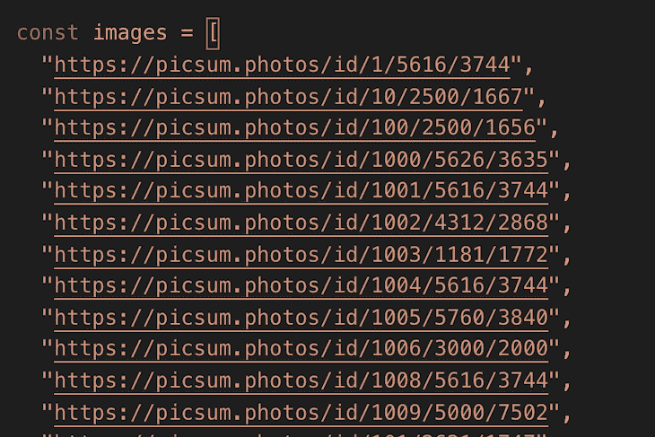
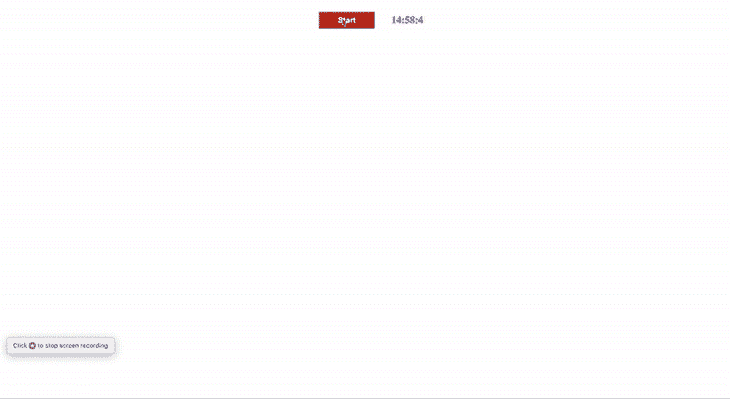
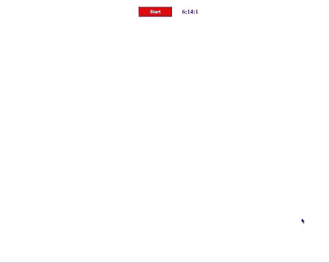
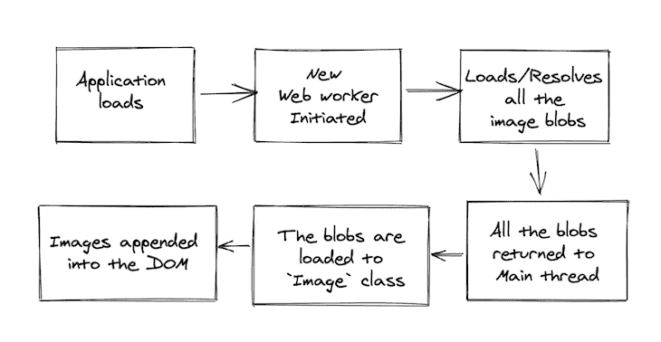

# 使用 Web Workers API 优化媒体加载

> 原文：<https://blog.logrocket.com/optimized-media-loading-web-workers/>

现在是 2020 年，今年我们肯定遇到了太多的问题。然而，开发人员几十年来一直面临的一个问题是如何有效地将媒体加载到 web 应用程序中。

尽管我们已经进行了一些实验并学习了使用各种技术来解决这些问题，比如惰性加载、压缩、基于带宽的动态媒体选择等，但仍有一些情况会对应用性能和用户体验造成严重损害。

在本文中，我们将讨论构建大约 1，000 幅图像(有效和无效图像)的拼贴的技术，同时，我们将讨论问题、一些解决方案以及各种方法的优缺点。

让我们考虑下面的基本设置。`index.html`是一个简单的网页，有一个按钮开始点击加载图像，还有一个计时器(带`setInterval`)显示浏览器冻结时的性能:

```
//index.html

<html>
    <head>
        <title>Optimized media loading with web workers | LogRocket</title>
        <link rel="stylesheet" href="styles.css">
    </head>
    <body>
        <div>
            <div class="box">
                <button id="start" onclick="start()">Start</button>
                <div id="count"></div>
            </div>
            <div id="collage"></div>
        </div>
    </body>
    <script>
        setInterval(() => {
            const count = document.getElementById("count")
            const today = new Date();
            const time = today.getHours() + ":" + today.getMinutes() + ":" + today.getSeconds();
            count.innerHTML = time.toString();
        }, 100)
        </script>
</html>
```

`images.js`是要加载的图像的 URL 数组:



我们将探索解决这个问题的三种不同方法:将图像添加到 DOM 中、使用 promises 和使用 web workers。

## 将图像添加到 DOM

添加所有这些图像的一种简单方法是遍历 URL 数组，为每个 URL 创建一个新的 DOM 元素，并将其附加到 DOM 中。这种方法阻塞了主线程，也造成了糟糕的用户体验——更不用说频繁的 DOM 更改带来的性能问题了。

下面是代码及其工作原理的示例:

```
// Function to append images into the DOM
const start = () => {
        const container = document.getElementById("collage")
        images.forEach(url => {
            const image = document.createElement("img");
            image.src = url;
            container.appendChild(image)
        });
    }
```



正如您所看到的，在上面的方法中，有效和无效的图像 URL 都被添加到了 DOM 中，这影响了性能(注意计时器中的延迟)。这可以用`createDocumentFragment`做得好一点，但是变化不大。

这被证明是一个非常糟糕的方法，迫使我们寻找更好的方法，即承诺方法。

## 利用承诺

处理这种情况的更好的解决方案是异步加载这些图像，并立即将它们插入 DOM。我们可以使用 promises 单独通过`Image()` API 异步加载图像。关于`Image()`建造者的更多细节可以在这里找到[。](https://developer.mozilla.org/en-US/docs/Web/API/HTMLImageElement/Image)

在这种方法中，我们遍历 URL 数组并创建一个 promise，将每个 URL 加载到`Image` API 中。然后，它公开了`onload`和`onerror`函数，分别解析为图像或 null。代码看起来像这样:

```
  const imagesPromiseArray = urlArray.map(url => {
    return new Promise((resolve, reject) => {
      const img = new Image();
      img.onload = () => {
        resolve(img);
      };
      img.onerror = () => {
        resolve(null);
      };
      img.src = url;
    });
  });
```

一旦我们有了图像承诺的数组，我们现在可以在一个`Promise.all`中解析它们，并将其作为承诺返回。这里，我们只过滤并返回有效图像，忽略无效图像，因为我们用`null`为无效图像解析图像承诺。

```
return new Promise((resolve, reject) => {
    Promise.all(imagesPromiseArray).then(images => {
      resolve(images.filter(Boolean));
    });
  });
```

将所有这些放在一起:

```
//resolve-images.js

const resolveImages = urlArray => {
  const imagesPromiseArray = urlArray.map(url => {
    return new Promise((resolve, reject) => {
      const img = new Image();
      img.onload = () => {
        resolve(img);
      };
      img.onerror = () => {
        resolve(null);
      };
      img.src = url;
    });
  });

  return new Promise((resolve, reject) => {
    Promise.all(imagesPromiseArray).then(images => {
      resolve(images.filter(Boolean));
    });
  });

};
```

在我们的`start`函数中，我们将使用这个承诺，而不是一个接一个地添加图像，而是一次将所有有效的图像添加到 DOM 中。`start`函数看起来像:

```
const start = () => {
      const imageFragment = document.createDocumentFragment();
      const container = document.getElementById("collage")
       resolveImages(images).then((imgs) => {
          imgs.forEach((img) => {
              imageFragment.appendChild(img)
          });
          container.appendChild(imageFragment)
      }, () => {})
}
```

行动的变化:



如果你注意到上面的 gif，性能和用户体验都好了很多。现在，当用户点击 **S** *tart 按钮时，图像的加载在后台开始，过一会儿所有有效的图像被加载到屏幕中。*

 *然而，有一个问题显而易见。一旦点击**开始**按钮，计数器就会在`6:14:4`停止相当长的时间。这是因为浏览器被冻结了，因为它必须同时处理大量的图片。在现实世界的应用程序中，情况会更糟，因为应用程序的其他部分也会占用主线程。

因此，这种方法可能看起来更好，但仍然不够。这就把我们带到了 Web Workers API。

## 使用网络工作者

JavaScript 是一种单线程语言，因此，当执行数据密集型任务时，它会冻结浏览器，就像上例中单击按钮后发生的情况一样。

但是我们可以利用 Web Workers API 来利用多线程的优势，这样就不会弄乱主线程。在我们的案例中，这正是我们要解决的问题。关于 Web Workers API 的更多细节可以在这里找到。

步骤很简单，如下所示:



让我们用代码来实现它。第一步是创建一个新文件`image-worker.js`。

```
self.addEventListener(
  "message",
  async function(e) {
    const urls = e.data;
    const images = await Promise.all(
      urls.map(async url => {
        try {
          const response = await fetch(url);
          const fileBlob = await response.blob();
          if (fileBlob.type === "image/jpeg")
            return URL.createObjectURL(fileBlob);
        } catch (e) {
          return null;
        }
      })
    );
    self.postMessage(images);
  },
  false
);
```

这里，我们遍历 URL 数组，获取它们，将它们转换成 blob，并返回有效图像 blob 的数组。我们不能使用`Image()` API，因为它转换成了`img`元素，而且 web workers 不支持或不允许你访问 DOM。

下一步是在我们的`resolveImages`函数中使用 web worker，如下所示:

```
const worker = new Worker("image-worker.js");
```

主线程和 web workers 使用`postMessage`函数进行通信。因此，我们将通过`postMessage`将图像 URL 数组传递给 web worker:

```
worker.postMessage(urlArray);
```

在 worker 处理完 URL 并将图像 blobs 的数组发送回主线程后，我们需要一个事件侦听器来处理它，如下所示:

```
worker.addEventListener(
      "message",
      async function(event) {
        const imagePromises = event.data.map(async url => {
          if (url) {
            return await createImage(url);
          }
        });
        const imageElements = await Promise.all(imagePromises);
        resolve(imageElements.filter(Boolean));
      },
      false
    );
```

这里，在我们获得图像 blob 之后，我们使用`createImage`函数中的`Image()` API 构建图像组件，并重复与前面方法相同的步骤。

```
const createImage = url => {
    return new Promise((resolve, reject) => {
      const img = new Image();
      img.onload = () => {
        resolve(img);
      };
      img.onerror = () => {
        resolve(null);
      };
      img.src = url;
    });
  };
```

综上所述，`resolveImages.js`看起来像是:

```
const resolveImages = urlArray => {
  const createImage = url => {
    return new Promise((resolve, reject) => {
      const img = new Image();
      img.onload = () => {
        resolve(img);
      };
      img.onerror = () => {
        resolve(null);
      };
      img.src = url;
    });
  };
  return new Promise((resolve, reject) => {
    const worker = new Worker("image-worker.js");
    worker.postMessage(urlArray);
    worker.addEventListener(
      "message",
      async function(event) {
        const imagePromises = event.data.map(async url => {
          if (url) {
            return await createImage(url);
          }
        });
        const imageElements = await Promise.all(imagePromises);
        resolve(imageElements.filter(Boolean));
      },
      false
    );
  });
};
```

这种方法提供了基于承诺的方法的所有好处，并且还防止了浏览器冻结，因为我们将所有操作从主线程转移到了 web workers。在下面的 gif 图中，你可以看到图像加载的流畅体验——计时器根本没有停止或延迟。


## 结论

因此，在 Web Workers API 的帮助下，我们成功地优化了媒体加载。我们可以利用工人的力量来解决 web 开发世界中的许多长期问题，这是它的一个用例。如果你能找到更好的方法或想法，请发表评论。

## 通过理解上下文，更容易地调试 JavaScript 错误

调试代码总是一项单调乏味的任务。但是你越了解自己的错误，就越容易改正。

LogRocket 让你以新的独特的方式理解这些错误。我们的前端监控解决方案跟踪用户与您的 JavaScript 前端的互动，让您能够准确找出导致错误的用户行为。

[](https://lp.logrocket.com/blg/javascript-signup)

LogRocket 记录控制台日志、页面加载时间、堆栈跟踪、慢速网络请求/响应(带有标题+正文)、浏览器元数据和自定义日志。理解您的 JavaScript 代码的影响从来没有这么简单过！

[Try it for free](https://lp.logrocket.com/blg/javascript-signup)

.*